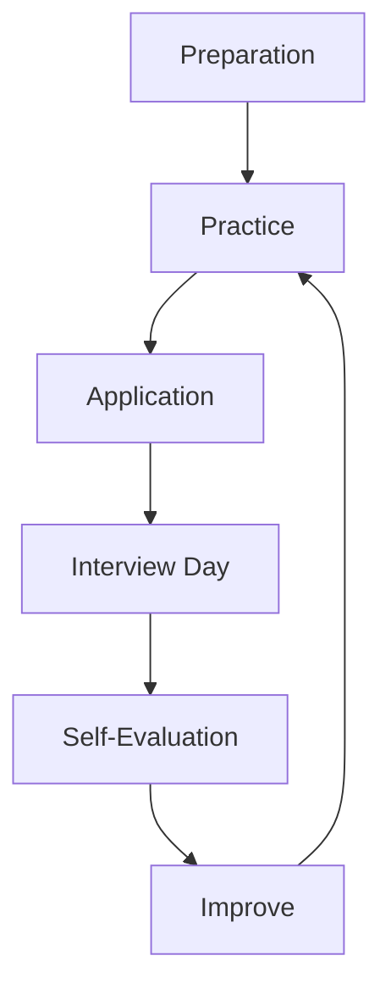

# Resume & Positioning — A 2-Day Crash Course

How to write an SRE/DevOps/Platform resume that gets callbacks — positioning, quantified impact, and the structure that passes both ATS and human review in 6 seconds.

---

## Part 0 — Why This Matters

Your resume is a marketing document, not a job history.

That distinction changes everything. A job history says what you did. A marketing document makes the reader believe you can solve their specific problem. Most resumes fail because they are written for the author — a chronological list of places you worked and duties you held. Hiring managers at high-volume companies spend under 10 seconds on a first pass. Screeners at lower-volume companies spend under 30. If those seconds don't surface clear signal — impact, scope, relevance — the resume goes in the no pile.

The engineering hiring funnel works like this:

```
Resume → ATS filter → Recruiter screen (30 sec) → Hiring manager scan (60 sec) → Phone screen → Loop
```

You need to survive each gate. ATS filters on keywords. Recruiters filter on role-fit at a glance. Hiring managers filter on impact and credibility. Your resume must do three things simultaneously: parse cleanly in automated systems, communicate value in 6 seconds, and hold up under 10 minutes of scrutiny once someone decides to read it.

The single most common failure mode: describing responsibilities instead of results. "Managed Kubernetes clusters" is a duty. "Reduced cluster provisioning time from 45 minutes to 8 minutes by migrating to Cluster API, cutting new-environment lead time by 82%" is impact. The second version answers the question every hiring manager is silently asking: *so what?*

---

## Vocabulary

**ATS (Applicant Tracking System)** — Software that parses your resume before a human sees it. Workday, Greenhouse, Lever, iCIMS are common examples. ATS systems match your resume text against job description keywords. Fancy formatting, tables, and graphics often break parsers.

**Positioning Statement** — The 3–5 line section at the top of your resume (sometimes called a Summary) that answers: who you are, what you specialize in, and what kind of role you're targeting. It frames everything below.

**Quantified Impact** — A result expressed in numbers: time saved, cost reduced, reliability improved, scale achieved. "Improved deployment pipeline" is not quantified. "Reduced deploy time from 22 minutes to 4 minutes" is.

**Action Verb** — The first word of every bullet point. Strong action verbs signal ownership. Weak verbs signal passivity. "Helped implement" signals you were nearby. "Designed and implemented" signals you drove it.

**Keywords** — Terms from the job description that ATS systems scan for. Role-specific: Kubernetes, Terraform, Prometheus, Incident Management. Soft: cross-functional, reliability, on-call. Match the job description's language — if they write "GitOps", use "GitOps", not "Git-based deployment workflow".

**One-Page Rule** — The default for engineers with under 10 years of experience. After 10 years, two pages is defensible. Three pages is almost never justified. The goal is signal density, not completeness.

**Summary vs Objective** — A Summary describes what you bring ("7 years designing highly available distributed systems…"). An Objective describes what you want ("Seeking a senior SRE role…"). Use a Summary. Objectives are outdated and waste prime real estate.

**STAR Bullets** — Situation, Task, Action, Result. The framework for writing impact bullets. In a resume bullet you compress this into one or two lines: action taken + context + measurable result.

**Portfolio** — Your GitHub profile, personal site, blog posts, or open-source contributions that provide third-party evidence for claims on your resume. Especially important for platform and SRE roles where tooling you built is often proprietary and not visible to reviewers.

---




## DAY 1 — Resume Structure and Impact Writing

### The Six Sections

**1. Header**

Name, city/state (not full address), phone, email, LinkedIn URL, GitHub URL. If you have a personal site with relevant work, include it. No photo. No date of birth. No "References available upon request" — it wastes a line.

Make your name the largest text on the page. Recruiters file resumes by name. Make it easy to find you.

**2. Summary**

Three to five lines. Write it last — after you've written everything else. It should answer:
- What is your specialization? (SRE, platform engineering, DevOps, cloud infrastructure)
- What is your level? (senior, staff, lead)
- What is your distinguishing value? (reliability focus, large-scale systems, cloud migration experience)
- What are you targeting? (optional — useful when pivoting)

Example:
> Senior Site Reliability Engineer with 6 years building observability platforms and incident management tooling for distributed systems at scale (10K+ nodes). Deep experience in Kubernetes, Prometheus/Grafana stacks, and chaos engineering. Reduced MTTR by 40% across two organizations through systematic on-call process redesign.

This summary takes 8 seconds to read and immediately answers: who you are, what you've done at what scale, and what impact you've driven.

**3. Experience**

Reverse chronological. Each role gets: company name, your title, dates (month/year), location or "Remote". Then 3–6 bullets per role.

Do not put more bullets on older roles than current ones. Depth should concentrate on your most recent 2–3 roles.

**4. Skills**

A single grouped section — not a list of everything you've ever touched. Group by category:

```
Infrastructure: Kubernetes, Terraform, AWS (EC2, EKS, RDS, S3), GCP, Azure
Observability:  Prometheus, Grafana, Loki, OpenTelemetry, Datadog, PagerDuty
CI/CD:          GitHub Actions, ArgoCD, Jenkins, GitLab CI, Helm
Languages:      Python, Go, Bash
```

Do not list skills you cannot defend in an interview. Do not omit skills that appear in your target job descriptions — even if you use them less frequently.

**5. Education**

School, degree, graduation year. If you have 5+ years of experience, this section shrinks to two lines. If you have a relevant certification — CKA, AWS SAA, GCP Professional, Terraform Associate — add a "Certifications" subsection here or as a standalone section.

**6. Projects (Optional)**

Critical if you are early career, transitioning, or have relevant side projects not visible at work. Keep it to 2–3 entries. Each project gets: name, one-line description, tech stack, link.

---

### Writing Impact Bullets

The formula: **Action Verb + Context + Result + Metric**

Every bullet should pass the "so what" test. Read the bullet and ask: does this tell the reader how this company or team is better because you worked there?

**Weak:**
- Responsible for monitoring infrastructure
- Worked on CI/CD pipelines
- Helped with incident response process

**Strong:**
- Built centralized observability platform using Prometheus, Grafana, and Loki, reducing alert-to-acknowledgment latency from 18 minutes to 3 minutes across 12 services
- Redesigned CI/CD pipeline in GitHub Actions, cutting average build time from 14 minutes to 5 minutes and reducing failed deployments by 35%
- Led redesign of incident response runbooks and on-call rotation for a team of 8 SREs, reducing P1 MTTR from 47 minutes to 22 minutes over 6 months

Notice what changed:
- "Responsible for" → active verb ("Built", "Redesigned", "Led")
- Vague scope → specific scope ("12 services", "team of 8 SREs")
- No result → clear before/after metric
- No timeline → timeframe where relevant

---

### Quantifying Everything

The most common objection: "I don't have metrics." You almost certainly do — you just haven't extracted them yet.

Questions to surface metrics:

- How many services, nodes, clusters, pipelines, or environments did you own?
- What was the team size you collaborated with or led?
- What did the system handle at peak? (requests/sec, GB/day, transactions/month)
- What did you change? Before vs after — even rough estimates are honest.
- What was the failure rate, error rate, MTTR, or MTTD before and after?
- How much time did you save per deployment, per incident, per onboarding?
- How many engineers used the platform you built?
- What was the cloud cost reduction in dollars or percentage?

If you genuinely have no hard number, use scale and scope: "across 200+ microservices", "serving 50M monthly active users", "across 3 AWS regions". These are still more informative than nothing.

⚠️ Do not fabricate numbers. Interviewers will ask about them. Estimates framed as estimates ("approximately $40K/month reduction based on spot vs on-demand pricing") are legitimate. Invented precision is not.

---

### Keyword Optimization for ATS

The quickest ATS improvement: paste the job description into a text editor and highlight every technical term, tool name, and methodology. Then check your resume for each one.

Practical rules:
- Use exact terminology from the job description. "Container orchestration" when they wrote "Kubernetes" does not match.
- Include both spelled-out and abbreviated forms where both might be searched: "Site Reliability Engineering (SRE)"
- Do not stuff keywords into a hidden section or in white text — ATS systems have gotten better at detecting this, and it will get you flagged.
- Keywords belong in context: inside bullets and the skills section, not crammed into the summary.

A resume optimized for a specific job description should have at least 60–70% overlap with the key terms in that JD.

---

### The One-Page Rule and When to Break It

Default: one page for under 10 years of experience.

When two pages is acceptable:
- You have 10+ years of genuinely distinct, relevant experience
- You are applying for a Staff or Principal level role where breadth and depth both matter
- You have publications, patents, or significant open-source contributions that are relevant

When two pages is not acceptable:
- You padded with old irrelevant jobs
- You have 3-line role descriptions for every position
- You listed every technology you've ever used in the skills section

The test: can you cut 20% without losing signal? If yes, cut it. The goal is not brevity for its own sake — it is signal density. Two tight pages beat three sparse ones.

---

## DAY 2 — Positioning, LinkedIn, and Tailoring

### Positioning for Specific Roles

The same experience can be positioned differently depending on the role. This is not dishonesty — it is emphasis.

**SRE positioning:**
Lead with reliability outcomes: availability numbers, MTTR/MTTD improvements, incident reduction, on-call load reduction, SLO/SLA work. Emphasize toil reduction, postmortem culture, and capacity planning. Keywords: SLO, error budget, toil, chaos engineering, observability, SLI.

**DevOps / Platform Engineering positioning:**
Lead with developer experience and velocity: pipeline efficiency, deployment frequency, onboarding time, self-service tooling. Emphasize internal platforms, golden paths, and enabling product teams. Keywords: golden path, internal developer platform (IDP), GitOps, Backstage, developer experience, platform as a product.

**Cloud / Infrastructure positioning:**
Lead with scale and cost: cloud cost optimization, migration scope, multi-region architecture, IaC coverage. Emphasize architecture decisions and cloud-native patterns. Keywords: FinOps, cloud migration, landing zone, multi-account, IaC, immutable infrastructure.

The same Kubernetes work can be framed as "maintained cluster reliability at 99.98% availability" (SRE), "built self-service namespace provisioning enabling 12 product teams to deploy independently" (platform), or "migrated on-premise workloads to EKS reducing infrastructure cost by $180K annually" (cloud). Know which lens your target role uses and write to it.

---

### LinkedIn Optimization

LinkedIn is a parallel resume that gets indexed by recruiters running Boolean searches. The rules diverge slightly from a PDF resume.

**Headline:** Do not default to your current job title. Write a positioning headline:
> Senior SRE | Kubernetes | Observability | Distributed Systems | Ex-Google, Ex-Stripe

**About section:** 3–5 sentences. Same positioning as your resume summary, slightly warmer in tone. Include keyword-rich sentences about your specialization — this affects search ranking.

**Experience:** Can be slightly longer than your PDF resume because there is no page limit. But do not pad. Strong bullets still matter — recruiters read them.

**Skills section:** Add all relevant technical skills. Get endorsements for the top ones — this affects search ranking.

**Featured section:** Link your GitHub, a post you wrote, a talk you gave, or a project you shipped. This is the portfolio section of LinkedIn.

**Activity:** Publishing one technical post per month meaningfully increases profile visibility. You do not need to write original essays — a 5-paragraph breakdown of a problem you solved at work is enough.

**Open to Work:** You can set this to "recruiters only" so it is not visible to your current employer. Use it — it increases inbound dramatically.

---

### Portfolio and GitHub as Proof of Work

In SRE and platform engineering, most of your best work is invisible — proprietary systems, internal tooling, incident work. Your GitHub becomes evidence of how you think and what you build when you have creative control.

What matters on GitHub:
- Pinned repositories that are clean, well-documented, and demonstrate relevant skills
- README files that explain what the project is, why you built it, and how to run it
- Real projects, not just tutorial completions or forks with no commits
- Contributions to tools you use: Prometheus exporters, Terraform modules, Helm charts, operators

You do not need dozens of repositories. Three to five strong projects beat thirty abandoned stubs.

For SRE specifically: a homelab with Kubernetes, Prometheus, Grafana, and Loki — documented publicly — is more credible than most certifications. It shows you've actually operated the stack, not just passed a multiple-choice exam.

---

### Cover Letters — When They Matter

For most engineering roles at large tech companies: cover letters are not read and do not matter. Submit one if required; keep it under 200 words.

For startups, smaller companies, and roles where culture fit is explicitly emphasized: a one-page cover letter matters. Write it as a targeted argument — why this company, why this role, why now, what you'll bring in the first 90 days.

The structure that works:
1. One sentence on why this specific company/role (not "I've always been passionate about cloud")
2. Two to three sentences on the most relevant thing you've done
3. One sentence on what you want to build or solve there
4. Close

Do not summarize your resume. The cover letter exists to tell the story the resume cannot.

---

### Tailoring Per Job Description

A generic resume sent to 50 jobs performs worse than a tailored resume sent to 10.

The minimum tailoring pass (20 minutes per application):
1. Read the JD and highlight the top 5 technical requirements
2. Check your resume — do all 5 appear? Add them in context if they're missing and accurate
3. Reorder your skills section to front-load what the JD emphasizes
4. Check your summary — does it reflect this company's domain? (fintech, gaming, SaaS, infrastructure product)
5. Swap one or two bullets in your most recent role to better match the JD's language

A deeper tailoring pass is worth it for roles you genuinely want. Rewrite the summary for the company. Add a project bullet that mirrors their stack. Swap a generic bullet for one that directly mirrors a JD requirement.

---

### Common Resume Mistakes

**1. Responsibilities instead of results.** "Managed CI/CD pipelines" vs "Reduced deployment failures by 40% by introducing canary releases and automated rollback." The first is on every SRE resume. The second differentiates.

**2. Dates in the wrong format.** Always use month/year: "Jan 2021 – Mar 2023". Year-only format looks like you're hiding short tenures. Exact dates look like you're a spreadsheet.

**3. Employment gaps unexplained.** If there's a visible gap, a single parenthetical is enough: "(Sabbatical)", "(Family care)", "(Contract work — details on request)". Unexplained gaps create unnecessary doubt.

**4. Wrong file format.** Submit PDF unless the system requires Word. PDFs render consistently. Word documents can reformat on other machines.

**5. Inconsistent tense.** Current role: present tense. Past roles: past tense. Mixing them looks careless.

**6. Overly designed layouts.** Columns, tables, icons, and graphics look good in your PDF viewer and break in ATS. Use a single-column, clean layout. No creative formatting.

**7. Generic summary.** "Results-driven engineer passionate about technology" says nothing. "Staff SRE specializing in reliability engineering for high-traffic distributed systems, with a track record of reducing P1 MTTR across two organizations" says something.

**8. Missing GitHub link.** For platform/SRE/DevOps roles, the absence of a GitHub link is a yellow flag. If you're in the field and not publicly on GitHub, create a profile and pin your strongest work.

---

### Resume Review Checklist

Before submitting any application, confirm:

- [ ] Name and contact info correct and current
- [ ] LinkedIn URL and GitHub URL included and resolve correctly
- [ ] No typos (spell-check, then read it aloud)
- [ ] Summary is specific, not generic
- [ ] Every bullet starts with a strong action verb
- [ ] At least 60% of bullets have a quantified metric
- [ ] Skills section reflects JD keywords
- [ ] Dates are consistent (month/year format)
- [ ] Tense is correct (present for current, past for prior)
- [ ] File saved as PDF
- [ ] One page (or justified two pages)
- [ ] No tables, columns, or graphics that break ATS

---

## Worked Example — Before/After SRE Resume Transformation

**Role:** Senior SRE, 5 years experience

---

### Before (Weak Bullets)

```
Site Reliability Engineer — Acme Corp (2021–2024)
- Responsible for Kubernetes cluster management
- Helped with incident response and on-call rotation
- Worked on monitoring and alerting systems
- Assisted in CI/CD pipeline improvements
- Participated in capacity planning meetings
```

Problems: every bullet is passive or shared. Zero metrics. Zero scope. Impossible to distinguish someone who sat in the room from someone who drove the work.

---

### After (Strong Impact Bullets)

```
Senior Site Reliability Engineer — Acme Corp (Jan 2021 – Mar 2024)
- Owned reliability of 3-region EKS infrastructure serving 8M daily active users;
  maintained 99.97% availability over 18 months
- Redesigned on-call process for 6-person SRE team: introduced structured runbooks,
  blameless postmortems, and error budget reviews — reduced P1 MTTR from 52 min to 19 min
- Built Prometheus/Grafana observability stack covering 40+ microservices;
  reduced alert noise by 60% through SLO-based alerting migration
- Rewrote deployment pipeline in GitHub Actions with automated canary releases and
  rollback triggers — cut failed production deployments from 12/month to 3/month
- Led Kubernetes 1.24 → 1.28 upgrade across 6 clusters with zero-downtime strategy,
  completing 3 weeks ahead of EOL deadline
```

What changed: every bullet names a concrete action, scopes the work, and lands a result. A reader knows exactly what you owned and what changed because of your work.

---

## Pitfalls

**Perfection paralysis.** A good resume submitted today beats a perfect resume submitted in 6 weeks. Ship a v1, apply, iterate based on response rates.

**Applying without tailoring.** Volume without targeting is noise. Fifty generic applications to roles you're 60% qualified for returns fewer callbacks than ten tailored applications to roles where you're a strong match.

**Treating LinkedIn as a backup resume.** Recruiters source from LinkedIn independently of job applications. An outdated or thin LinkedIn profile loses you inbound opportunities you'll never know you missed.

**Underestimating the summary.** Many engineers write the summary last and then spend 30 seconds on it. Spend 30 minutes. It is the first thing read and the thing that frames everything below.

**Listing tools you cannot defend.** "Familiar with" is a red flag phrase if it means you ran a tutorial once. If you list it, be ready to answer real questions about it.

**Not updating after every major project.** The best time to write bullets is immediately after shipping something — when the metrics are fresh and the context is clear. A resume updated quarterly is far easier to maintain than one rebuilt from memory every two years.

---

## Quick Reference

### Action Verb List

**Designed / Built:** Architected, Designed, Built, Developed, Implemented, Created, Established, Launched

**Improved / Optimized:** Reduced, Improved, Optimized, Accelerated, Streamlined, Automated, Eliminated, Decreased

**Led / Owned:** Led, Owned, Drove, Spearheaded, Directed, Managed, Coordinated

**Migrated / Deployed:** Migrated, Deployed, Shipped, Delivered, Rolled out, Provisioned

**Investigated / Resolved:** Debugged, Diagnosed, Resolved, Remediated, Triaged

---

### Resume Template (Text Layout)

```
[FULL NAME]
[City, State] | [email] | [phone] | linkedin.com/in/[handle] | github.com/[handle]

─────────────────────────────────────────────────────────────────

SUMMARY
[3–5 lines: role level, specialization, distinguishing value, scale]

─────────────────────────────────────────────────────────────────

EXPERIENCE

[Company Name] — [Your Title]                         [Month YYYY – Month YYYY]
[City, State / Remote]
- [Action Verb] [what you built/changed] [scope] — [result + metric]
- [Action Verb] [what you built/changed] [scope] — [result + metric]
- [Action Verb] [what you built/changed] [scope] — [result + metric]

[Previous Company] — [Your Title]                     [Month YYYY – Month YYYY]
[City, State / Remote]
- ...

─────────────────────────────────────────────────────────────────

SKILLS
Infrastructure:  [list]
Observability:   [list]
CI/CD:           [list]
Languages:       [list]
Cloud:           [list]

─────────────────────────────────────────────────────────────────

EDUCATION
[Degree], [School], [Year]

CERTIFICATIONS (if applicable)
[Certification Name], [Issuer], [Year]
```

---

### ATS Checklist

- [ ] Single column layout — no tables or text boxes
- [ ] Standard fonts (Arial, Calibri, Georgia, Times New Roman)
- [ ] No headers/footers containing critical info (ATS often skips them)
- [ ] Section headings use standard names: Experience, Education, Skills
- [ ] All dates in consistent format (Month YYYY)
- [ ] No images, icons, or graphics
- [ ] Saved as PDF (unless Word explicitly requested)
- [ ] File named: `FirstName-LastName-Resume.pdf`
- [ ] Keywords from JD appear in context in bullets and skills section
- [ ] Role title on resume matches or is close to role title in JD

---


## Top 10 Interview Questions

<details>
<summary><strong>Q: What is Resume Positioning and what problem does it solve?</strong></summary>

Resume Positioning addresses a specific need in modern engineering workflows. Understanding the core problem it solves — and the alternatives it replaced — is the foundation for every subsequent interview question. Frame your answer around the pain point first, then the solution.

</details>

<details>
<summary><strong>Q: How does Resume Positioning compare to its main alternatives?</strong></summary>

Every tool exists in an ecosystem of alternatives. Be prepared to articulate the specific tradeoffs: when Resume Positioning is the right choice, when an alternative is better, and what factors drive the decision (scale, team expertise, existing infrastructure, compliance requirements).

</details>

<details>
<summary><strong>Q: What are the most common production pitfalls with Resume Positioning?</strong></summary>

Production experience is what separates senior from junior engineers. Common pitfalls include: misconfiguration that works in dev but fails at scale, security oversights, inadequate monitoring, and operational procedures that are untested until an incident occurs. Cite specific examples from your experience.

</details>

<details>
<summary><strong>Q: How do you monitor and observe Resume Positioning in production?</strong></summary>

Key metrics to track, alerting thresholds to set, dashboards to build, and log patterns to watch. Production monitoring should cover: health/liveness, performance (latency, throughput), capacity (resource utilisation), and business impact (error rates affecting users). Explain which metrics are leading indicators versus lagging.

</details>

<details>
<summary><strong>Q: How do you scale Resume Positioning as load increases?</strong></summary>

Scaling strategies depend on the bottleneck: horizontal scaling (add more instances), vertical scaling (bigger instances), caching (reduce load), sharding (distribute data), and async processing (decouple components). Explain which approach applies to Resume Positioning and at what scale each strategy becomes necessary.

</details>

<details>
<summary><strong>Q: How do you handle security and access control with Resume Positioning?</strong></summary>

Security is non-negotiable in production. Cover: authentication and authorization mechanisms, secrets management (never in code), encryption (at rest and in transit), network security (firewalls, private networks), audit logging, and compliance requirements relevant to your industry.

</details>

<details>
<summary><strong>Q: How do you implement disaster recovery for Resume Positioning?</strong></summary>

DR planning requires defining RTO (recovery time objective) and RPO (recovery point objective), implementing backup strategies, testing restore procedures, and documenting runbooks. Explain your backup strategy, how you test restores, and what your recovery procedure looks like.

</details>

<details>
<summary><strong>Q: How do you automate Resume Positioning deployment and configuration management?</strong></summary>

Infrastructure as code, CI/CD pipelines, configuration management, and GitOps workflows. Explain how you version, test, deploy, and roll back changes. Cover: what is automated, what requires manual approval, and how you handle configuration drift.

</details>

<details>
<summary><strong>Q: How do you troubleshoot issues with Resume Positioning in production?</strong></summary>

A systematic debugging approach: check health endpoints, review recent changes (deploys, config changes), examine logs and metrics, reproduce the issue, identify root cause, fix, verify, and write a postmortem. Explain your actual debugging workflow with concrete examples.

</details>

<details>
<summary><strong>Q: What are the best practices for Resume Positioning that you have learned from experience?</strong></summary>

Best practices that go beyond documentation: lessons learned from production incidents, configuration patterns that prevent common issues, testing strategies that catch bugs before production, and operational procedures that reduce toil. Share specific examples where following (or not following) a best practice had measurable impact.

</details>

---


## Quick Quiz

Test your understanding with these rapid-fire questions (answers hidden):

<details>
<summary>1. What is the ONE core problem that Resume Positioning solves?</summary>
Re-read Part 0 — the mental model section. If you can explain the "why" in one sentence, you understand the foundation.
</details>

<details>
<summary>2. Name the 3 most important terms from the vocabulary section.</summary>
Review Part 1. These are the building blocks every conversation about Resume Positioning uses.
</details>

<details>
<summary>3. What is the first thing you would set up on Day 1?</summary>
Check the Day 1 section — the very first hands-on step that gets you a working result.
</details>

<details>
<summary>4. What is the most common production pitfall with Resume Positioning?</summary>
Review the Common Pitfalls section. The first item listed is typically the most frequently encountered.
</details>

<details>
<summary>5. How does Resume Positioning compare to its closest alternative?</summary>
Check the Comparison Matrix below — focus on the key differentiating row.
</details>


## Comparison Matrix

| Dimension | Impact-First Resume | Skill-First | Chronological |
|-----------|---------------------|-------------|---------------|
| **Primary use case** | Core strength of Impact-First Resume | Core strength of Skill-First | Core strength of Chronological |
| **Learning curve** | Moderate | Varies | Varies |
| **Community/ecosystem** | Active | Active | Growing |
| **Operational complexity** | Medium | Varies | Varies |
| **Best for** | See Part 0 | Different tradeoffs | Different tradeoffs |

> **How to read this matrix:** no tool wins on every dimension. Pick based on your specific constraints — team expertise, existing infrastructure, scale requirements, and compliance needs. The right choice is the one that fits your context, not the one with the most checkmarks.

## Next Steps

Resume done. Keep moving:

- `Behavioral-Interview.md` — STAR method, the 10 stories you need, and how to handle "tell me about a time" for SRE/DevOps roles
- `Salary-Negotiation.md` — how to handle compensation conversations, counter-offers, and the window between offer and acceptance
- `Engineering-Career-Path.md` — IC ladder from L3 to Staff/Principal, how leveling works across companies, and how to build toward promotion

---

## Recommended learning resources

**YouTube channels & playlists:**
- [Rahul Pandey and Taro — Resume Reviews](https://www.youtube.com/@RahulPandeyrkp) — live resume teardowns for engineers at every level, with before/after examples
- [Exponent — Resume and Application Strategy](https://www.youtube.com/@tryexponent) — how to position experience for top-tier companies
- [Tiff in Tech — Tech Resume Tips](https://www.youtube.com/@TiffInTech) — practical resume formatting, ATS optimisation, and storytelling for tech roles
- [A Life After Layoff — Resume Writing](https://www.youtube.com/results?search_query=a+life+after+layoff+resume) — recruiter perspective on what gets resumes past the first screen
- [Jeff Su — Resume and Career](https://www.youtube.com/results?search_query=jeff+su+resume+tech) — concise tips on bullet writing, quantifying impact, and resume structure

**Official docs & blogs:**
- [levels.fyi — Compensation and Leveling](https://www.levels.fyi/) — understand leveling across companies so you can position your resume at the right seniority
- [interviewing.io Blog — Resume Insights](https://interviewing.io/blog) — data-driven analysis of what resume signals actually predict interview performance

---

## The Mantra

Your resume does not get you the job — it gets you the conversation.
Write it for the reader, not for yourself.
Every bullet answers one question: *so what?*
Quantify or cut.
Tailor or lose.
Ship it and iterate.

---

`Reads: 0/4. Tier reached: PEAK. Lessons added: 0.`
