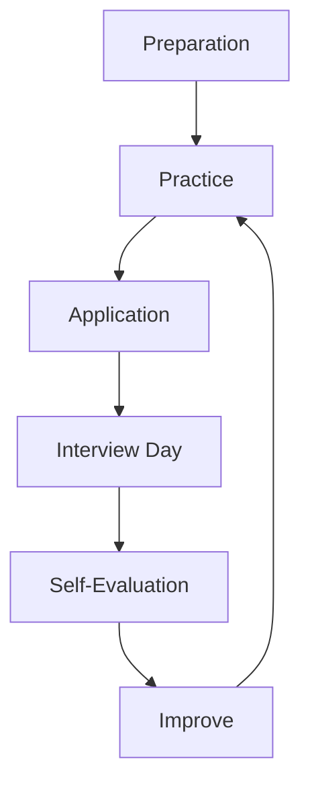

# Salary Negotiation — A 2-Day Crash Course

Salary negotiation is a skill, not a personality trait — the script, timing, and tactics that can add 10–30% to your offer without risking it.

---

## Part 0 — Why This Matters

Companies expect you to negotiate. Recruiters are trained to make the first offer low, knowing that most candidates will push back. When you don't, two things happen: you leave money on the table, and you signal — to yourself and to them — that you don't fully value what you bring.

The initial offer is not a final price. It is an opening bid. Treat it that way.

A single negotiation conversation — ten minutes of mild discomfort — can add $10,000 to $40,000 in year-one compensation. Compounded over a career, it is one of the highest-leverage moves you can make.

You are not being greedy. You are being professional.

---

## Vocabulary

Before you negotiate, you need to speak the language.

**Total Compensation (TC)** — Everything you receive in a year: base salary, cash bonus, equity value, and benefits. Always compare offers at the TC level, not just base.

**Base** — Your fixed annual salary, paid every paycheck regardless of company performance. The most negotiable single number.

**Bonus** — A performance-based cash payment, usually annual. It may be a fixed percentage of base ("target bonus") or discretionary. Always ask: what is the target percentage, and what has actual payout been historically?

**RSU / Stock** — Restricted Stock Units. Shares in the company that vest over time (commonly four years with a one-year cliff). The value fluctuates with the stock price, so a $100K RSU grant today may be worth more or less when it vests.

**Sign-on Bonus** — A one-time cash payment made at or shortly after joining. Often used to compensate you for unvested equity you are leaving behind, or to bridge a gap when the company cannot raise base. Usually clawed back (partially or fully) if you leave within 12–24 months.

**Leveling** — The internal job level at which a company places you (L4, L5, Staff, Senior, etc.). Leveling determines your compensation band. Getting leveled higher is often worth more than negotiating within a band.

**Bands** — The salary range associated with a given level. Companies rarely publish these, but Levels.fyi, Glassdoor, and Blind surface them. Knowing the band ceiling tells you how much room exists.

**BATNA** — Best Alternative to a Negotiated Agreement. Your walk-away option. If you have another offer, your BATNA is strong. If this is your only option, your BATNA is weak — but you can improve it by accelerating other processes.

**Counter-offer** — Your response to an initial offer, proposing different terms. This is where negotiation happens.

**Competing Offer** — An offer from a different company. The single most powerful negotiation tool. You do not need to use it aggressively; simply having one changes the dynamic.

**Vesting** — The schedule on which equity becomes yours. A standard schedule: 25% after year one (the cliff), then monthly or quarterly for three more years. Early-stage startups may have four-year monthly vesting with no cliff.

---




## Day 1 — Understanding the Game

### What Total Compensation Actually Looks Like

Never evaluate an offer by base alone. A $180K base with a 10% bonus, $150K in RSUs over four years, and no sign-on is:

- Base: $180,000
- Bonus (target): $18,000
- RSU annualized: $37,500
- **TC Year 1: ~$235,500**

A competing offer of $165K base, 15% bonus, $200K RSUs, and a $20K sign-on is:

- Base: $165,000
- Bonus (target): $24,750
- RSU annualized: $50,000
- Sign-on (year 1 only): $20,000
- **TC Year 1: ~$259,750**

The lower base offer is actually $24,000 higher in year one and $25,000 higher annualized beyond year one. You would not see this without building the full TC picture.

Always build a spreadsheet. Compare apples to apples.

### Researching Market Rates

You need data before you name a number. Three sources that engineers actually trust:

**Levels.fyi** — The most reliable source for big tech compensation by level and location. Self-reported, reasonably accurate. Filter by company, level, and metro. Use it to find the median and the 75th percentile for your target role.

**Glassdoor** — Broader coverage across company sizes. Less granular on leveling. Good for smaller companies not well-represented on Levels.fyi.

**Blind** — Anonymous forum where engineers share offers and comp details. Noisy, but valuable for recent data and negotiation anecdotes at specific companies.

**Your network** — If you know people at the company, ask. A 15-minute conversation with a current employee is worth more than any aggregated dataset.

Your target: know the market rate for your role and level at this specific company before you enter any negotiation conversation. Come in with three data points, not one.

### When to Discuss Compensation

Delay the compensation conversation as long as possible. Your leverage is highest after you have an offer — when they have decided they want you. Before that, any number you give is a ceiling on your offer, not a floor.

If a recruiter asks about salary early in the process, redirect:

> "I'd rather learn more about the role and the team first so I can evaluate the full opportunity. What range has the company budgeted for this position?"

In some US states (California, New York, Colorado, and others), employers are legally required to disclose the pay range. Ask for it.

If they push:

> "I'm flexible and focused on finding the right fit. I'm happy to discuss compensation once we get to the offer stage."

Most recruiters will accept this once or twice.

### Handling "What's Your Current Salary?"

In many US states this question is now illegal. Even where it is not, you are not obligated to answer it.

If asked:

> "I'd prefer to keep that private, but I can tell you what I'm targeting based on my research into market rates for this role."

Or deflect entirely:

> "Rather than anchor on my current comp, I'd love to understand the range you have budgeted — that way we can both see if there's a fit."

Your current salary is irrelevant to what you are worth in a new role. Do not let it cap your offer.

### Handling "What Are Your Expectations?"

If you must give a number, give a range — and anchor high within your researched market data. Your floor should be your actual target.

> "Based on my research on Levels.fyi and conversations in the market, I'm targeting $195K–$215K base, with the expectation of a competitive total comp package."

Now the anchor is set above your floor, and you have room to negotiate down to a number you are happy with.

### The First Offer Is Never the Best Offer

Companies build negotiation room into every offer. Recruiters have a budget range; the first offer is rarely the top of it. Even a modest counter — stated calmly and backed by data — almost never results in an offer being rescinded.

The risk of negotiating professionally is near zero. The cost of not negotiating is real and immediate.

---

## Day 2 — The Negotiation

### The Negotiation Script

The structure of a strong counter has four moves:

**1. Acknowledge** — Thank them. Show genuine enthusiasm. This is not sycophancy; it defuses tension and signals you are not adversarial.

**2. Express enthusiasm** — Confirm you want the role. This removes their fear that negotiating means you are not interested.

**3. Counter with data** — Name a specific number, higher than what you want to land on. Back it with market data. Be specific — specificity signals research, not wishful thinking.

**4. Invite collaboration** — Make it easy for them to work with you rather than against you.

The script, out loud:

> "Thank you so much for the offer — I'm genuinely excited about the team and the work. I do want to discuss compensation. Based on my research on Levels.fyi and conversations with people in the market, I'm seeing total comp in the $230K–$250K range for this level and location. The offer you've put together is at $195K TC. Is there room to get closer to $235K?"

Then stop talking. Do not fill the silence. Let them respond.

### Negotiating Multiple Offers

If you have two or more offers, you are in the strongest possible position. Use them — but with precision, not as a blunt threat.

> "I'm very interested in your offer, and you're my first choice. I do have a competing offer at $240K TC that I'm weighing. I'd love to find a way to make this work — is there flexibility to get to $235K?"

You do not have to reveal the competing company unless you want to. You do not have to show them the competing offer letter.

If they ask you to share the competing offer: you can, or you can say you'd rather not for confidentiality reasons. Either is acceptable.

Use competing offers to accelerate timelines, not just raise numbers. "I have an offer deadline of Friday — can we move this forward?"

### Negotiating Beyond Salary

Base is the most visible lever but not the only one. When base is stuck, move to:

**Sign-on bonus** — Often comes from a different budget than base. Asking for $20K–$30K sign-on when base is at its ceiling is a common and accepted move.

> "I understand base may have a ceiling at this level. Would you be able to include a sign-on bonus to bridge the gap?"

**RSU refresh / equity top-up** — If the RSU grant feels low, ask for more. Phrase it as total equity over four years.

> "The equity component feels light relative to what I'm seeing in the market. Is there room to increase the initial RSU grant?"

**Title / leveling** — If you are leveled at L4 and you believe you are L5, negotiate the level — not just the comp. A level change unlocks a higher band permanently.

> "Based on my experience and the scope of the role as we discussed it, I want to revisit leveling. I believe my background maps more closely to L5. Can we explore that?"

**Remote and flexibility** — If you want full-remote or a specific schedule, negotiate it now, in writing. Do not assume it will be fine later.

**PTO and start date** — Both are negotiable at most companies. An extra week of PTO is worth several thousand dollars annually. A later start date gives you time to decompress between roles.

### Handling Exploding Offers

An exploding offer has an artificially short deadline — "you have 48 hours" — designed to prevent you from getting competing offers. This is a pressure tactic. Treat it as one.

> "I appreciate the offer and I'm very interested. I want to make a thoughtful decision — can you extend the deadline to [one week from now]? I want to make sure I'm fully committed when I accept."

Most companies will grant this. If they refuse, consider what that tells you about how they will treat you as an employee.

⚠️ Never accept an offer you are not ready to commit to just because of a fabricated deadline. A company that genuinely wants you will give you reasonable time.

### When to Walk Away

Walk away when:

- The final offer falls materially below your BATNA and there is no movement after two rounds of negotiation.
- The leveling conversation revealed the role is not what was represented.
- The process itself has shown you how the company operates, and you do not like what you see.
- Accepting would require you to take a meaningful cut in comp without a compelling reason.

Walking away professionally:

> "I appreciate all the time you've invested in this process, and I have a lot of respect for the team. After careful consideration, I've decided to pursue another opportunity that's a closer fit for where I am in my career. I hope our paths cross again."

Keep it warm. Industries are small.

### Negotiating as a Current Employee

**Promotion negotiation** — When you are due for a promotion, do not wait to be told what you will receive. Come prepared.

Document your impact before the conversation: projects shipped, revenue influenced, scope expanded, people mentored. Quantify wherever you can.

> "I've been performing at the next level for [X months]. Here's the scope I've taken on: [specific examples]. I'd like to discuss formalizing this as a promotion to [title] with comp aligned to that level."

**Retention negotiation** — If you have an outside offer, you can use it to reset your comp without leaving. Be direct:

> "I've been approached by [company] and received an offer at $X TC. I'm happy here and not looking to leave, but the gap is significant enough that I need to address it. Can we revisit my comp?"

Your employer will do one of three things: match, partially match, or decline. If they decline, you now have real information about how they value you.

⚠️ Only use a retention counter if you are genuinely willing to leave. If you have no intention of taking the outside offer, using it as a bluff can damage trust and your manager's respect for you.

---

## Worked Example — Negotiating an SRE Offer from $180K to $220K TC

**The offer:** $175K base, 10% target bonus, $120K RSUs over four years, no sign-on. TC: ~$207,500.

**Your research:** Levels.fyi shows P4/L4 SRE at this company is $195K–$225K base, with median TC around $280K at a tech major. This company is mid-size, so a 15–20% discount is reasonable — target TC: $235K–$245K.

---

**Round 1 — The counter:**

Recruiter: "We're excited to extend you an offer of $175K base with a 10% target bonus and $120K in RSUs vesting over four years."

You: "Thank you — I'm genuinely excited about this role. The team and the scope are exactly what I'm looking for. I do want to discuss the compensation. Based on my research into market rates for this level and location, I'm seeing TC closer to $240K–$250K. The offer as structured comes to about $207K. Is there room to move closer to $240K?"

Recruiter: "Let me go back to the team. I'll have an answer by end of week."

---

**Round 2 — Their response:**

Recruiter: "We were able to come up with $185K base and bump the RSUs to $140K. That puts you at about $220K TC."

You: "I appreciate that — moving on both base and equity is meaningful. I'm still a bit below where I was hoping to land. Is there any room for a sign-on bonus to bridge the gap? Something in the $15K–$20K range would make a real difference."

Recruiter: "I can bring that back. Sign-on is a different budget, so it's worth asking."

---

**Round 3 — Final:**

Recruiter: "We can do $15K sign-on. So the full package is $185K base, 10% bonus, $140K RSUs, $15K sign-on."

**Year 1 TC: $185,000 + $18,500 + $35,000 + $15,000 = $253,500**

You: "That works for me. I'm in. What are the next steps?"

Starting offer TC: $207,500. Final TC year one: $253,500. Delta: $46,000. Two polite conversations.

---

## Pitfalls

**Accepting on the spot.** Always ask for time to review, even if you know you want the offer. "I'm very excited — can I have until [date] to review?" gives you space to negotiate without pressure.

**Naming a number first.** Let them anchor first whenever possible. The first number sets the frame for everything that follows.

**Negotiating by email only.** Phone or video is better. Tone matters. Silence is a tool. Email removes both.

**Apologizing for negotiating.** Do not say "I'm sorry to ask, but..." Own the conversation. You are not asking for a favor.

**Revealing your floor too early.** "I need at least $170K" tells them exactly where to land. State your target and a range anchored above it.

**Negotiating one thing at a time in isolation.** Think in TC. If base cannot move, ask about equity. If equity cannot move, ask about sign-on. Keep the full picture in view.

**Going silent after a counter.** Once you have made your counter, stop talking. The next person to speak loses negotiating leverage. Wait for their response.

**Taking it personally.** Recruiters are not your enemies. They are doing their job. A calm, professional counter is almost never received negatively.

---

## Quick Reference

### Negotiation Script Template

```
"Thank you — I'm genuinely excited about this opportunity and the team.

I do want to discuss compensation. Based on my research, I'm seeing
[market data: source and range] for this role and level. The offer as
structured is [current TC]. Is there room to get to [specific target]?"

[Wait. Do not speak first.]
```

### TC Calculator

| Component         | Value          | Notes                               |
|-------------------|----------------|-------------------------------------|
| Base              | $___,___       | Annual, pre-tax                     |
| Bonus (target)    | $___,___ (___%)| Ask for historical payout rates     |
| RSU (annualized)  | $___,___       | Total grant ÷ vesting years         |
| Sign-on           | $___,___       | Year 1 only; check clawback terms   |
| **Year 1 TC**     | **$___,___**   |                                     |
| **Annualized TC** | **$___,___**   | Exclude sign-on for apples-to-apples|

### Market Rate Sources

| Source       | Best For                          | URL              |
|--------------|-----------------------------------|------------------|
| Levels.fyi   | Big tech, by level and location   | levels.fyi       |
| Glassdoor    | Broad coverage, mid-size companies| glassdoor.com    |
| Blind        | Recent offer anecdotes            | teamblind.com    |
| Your network | Company-specific intelligence     | People you know  |

---


## Top 10 Interview Questions

<details>
<summary><strong>Q: What is Salary Negotiation and what problem does it solve?</strong></summary>

Salary Negotiation addresses a specific need in modern engineering workflows. Understanding the core problem it solves — and the alternatives it replaced — is the foundation for every subsequent interview question. Frame your answer around the pain point first, then the solution.

</details>

<details>
<summary><strong>Q: How does Salary Negotiation compare to its main alternatives?</strong></summary>

Every tool exists in an ecosystem of alternatives. Be prepared to articulate the specific tradeoffs: when Salary Negotiation is the right choice, when an alternative is better, and what factors drive the decision (scale, team expertise, existing infrastructure, compliance requirements).

</details>

<details>
<summary><strong>Q: What are the most common production pitfalls with Salary Negotiation?</strong></summary>

Production experience is what separates senior from junior engineers. Common pitfalls include: misconfiguration that works in dev but fails at scale, security oversights, inadequate monitoring, and operational procedures that are untested until an incident occurs. Cite specific examples from your experience.

</details>

<details>
<summary><strong>Q: How do you monitor and observe Salary Negotiation in production?</strong></summary>

Key metrics to track, alerting thresholds to set, dashboards to build, and log patterns to watch. Production monitoring should cover: health/liveness, performance (latency, throughput), capacity (resource utilisation), and business impact (error rates affecting users). Explain which metrics are leading indicators versus lagging.

</details>

<details>
<summary><strong>Q: How do you scale Salary Negotiation as load increases?</strong></summary>

Scaling strategies depend on the bottleneck: horizontal scaling (add more instances), vertical scaling (bigger instances), caching (reduce load), sharding (distribute data), and async processing (decouple components). Explain which approach applies to Salary Negotiation and at what scale each strategy becomes necessary.

</details>

<details>
<summary><strong>Q: How do you handle security and access control with Salary Negotiation?</strong></summary>

Security is non-negotiable in production. Cover: authentication and authorization mechanisms, secrets management (never in code), encryption (at rest and in transit), network security (firewalls, private networks), audit logging, and compliance requirements relevant to your industry.

</details>

<details>
<summary><strong>Q: How do you implement disaster recovery for Salary Negotiation?</strong></summary>

DR planning requires defining RTO (recovery time objective) and RPO (recovery point objective), implementing backup strategies, testing restore procedures, and documenting runbooks. Explain your backup strategy, how you test restores, and what your recovery procedure looks like.

</details>

<details>
<summary><strong>Q: How do you automate Salary Negotiation deployment and configuration management?</strong></summary>

Infrastructure as code, CI/CD pipelines, configuration management, and GitOps workflows. Explain how you version, test, deploy, and roll back changes. Cover: what is automated, what requires manual approval, and how you handle configuration drift.

</details>

<details>
<summary><strong>Q: How do you troubleshoot issues with Salary Negotiation in production?</strong></summary>

A systematic debugging approach: check health endpoints, review recent changes (deploys, config changes), examine logs and metrics, reproduce the issue, identify root cause, fix, verify, and write a postmortem. Explain your actual debugging workflow with concrete examples.

</details>

<details>
<summary><strong>Q: What are the best practices for Salary Negotiation that you have learned from experience?</strong></summary>

Best practices that go beyond documentation: lessons learned from production incidents, configuration patterns that prevent common issues, testing strategies that catch bugs before production, and operational procedures that reduce toil. Share specific examples where following (or not following) a best practice had measurable impact.

</details>

---


## Terminal Demo

```terminal-demo
# negotiation@offer ~ %

$ echo "Research Phase"
Levels.fyi:    Senior SRE @ Target Company = 35-55 LPA
Glassdoor:     Avg 42 LPA (base) + 8 LPA (bonus) + RSUs
Blind:         Recent offers in range 40-50 LPA total comp

$ echo "Counter-Offer Framework"
1. Express enthusiasm (never negotiate from a position of disinterest)
2. Anchor high: "Based on my research and experience, I was expecting
   total comp in the range of 50-55 LPA"
3. Justify: "I bring 8 years of SRE experience, led reliability for
   a system handling 10M daily transactions in BFSI"
4. Be specific: negotiate base, bonus, RSUs, and signing separately
5. Get it in writing before accepting

$ echo "Never Say"
"What is the budget for this role?" — lets them anchor low
"I currently make X" — irrelevant to your market value
"I will accept anything" — removes all leverage
```

---

## Quick Quiz

Test your understanding with these rapid-fire questions (answers hidden):

<details>
<summary>1. What is the ONE core problem that Salary Negotiation solves?</summary>
Re-read Part 0 — the mental model section. If you can explain the "why" in one sentence, you understand the foundation.
</details>

<details>
<summary>2. Name the 3 most important terms from the vocabulary section.</summary>
Review Part 1. These are the building blocks every conversation about Salary Negotiation uses.
</details>

<details>
<summary>3. What is the first thing you would set up on Day 1?</summary>
Check the Day 1 section — the very first hands-on step that gets you a working result.
</details>

<details>
<summary>4. What is the most common production pitfall with Salary Negotiation?</summary>
Review the Common Pitfalls section. The first item listed is typically the most frequently encountered.
</details>

<details>
<summary>5. How does Salary Negotiation compare to its closest alternative?</summary>
Check the Comparison Matrix below — focus on the key differentiating row.
</details>


## Comparison Matrix

| Dimension | Data-Driven Negotiation | Anchoring High | Package-Based |
|-----------|-------------------------|----------------|---------------|
| **Primary use case** | Core strength of Data-Driven Negotiation | Core strength of Anchoring High | Core strength of Package-Based |
| **Learning curve** | Moderate | Varies | Varies |
| **Community/ecosystem** | Active | Active | Growing |
| **Operational complexity** | Medium | Varies | Varies |
| **Best for** | See Part 0 | Different tradeoffs | Different tradeoffs |

> **How to read this matrix:** no tool wins on every dimension. Pick based on your specific constraints — team expertise, existing infrastructure, scale requirements, and compliance needs. The right choice is the one that fits your context, not the one with the most checkmarks.

## Next Steps

- `Resume-Positioning.md` — How to frame your experience to justify senior leveling before the offer conversation begins.
- `Engineering-Career-Path.md` — Understanding leveling frameworks so you can negotiate the right title, not just the right number.
- `Behavioral-Interview.md` — The stories that support your level claim and strengthen your hand in compensation discussions.

---

## Recommended learning resources

**YouTube channels & playlists:**
- [Rahul Pandey and Taro — Salary Negotiation](https://www.youtube.com/@RahulPandeyrkp) — negotiation frameworks, counter-offer scripts, and real examples from tech compensation
- [Exponent — Offer Negotiation](https://www.youtube.com/@tryexponent) — step-by-step walkthroughs of negotiating base, equity, signing bonus, and level
- [Tiff in Tech — Compensation Conversations](https://www.youtube.com/@TiffInTech) — how to research market rates, handle recruiter calls, and negotiate with confidence
- [A Life After Layoff — Negotiation Tactics](https://www.youtube.com/results?search_query=a+life+after+layoff+salary+negotiation) — the recruiter's perspective on negotiation, and what actually moves the needle
- [Josh Fluke — Tech Salary Insights](https://www.youtube.com/results?search_query=josh+fluke+salary+negotiation) — compensation transparency and negotiation strategies for tech roles

**Official docs & blogs:**
- [levels.fyi — Compensation Data](https://www.levels.fyi/) — the definitive crowdsourced compensation database: know the bands before you negotiate
- [Candor Salary Negotiation Guide](https://candor.co/guides/salary-negotiation) — practical scripts, email templates, and decision frameworks for tech offer negotiation

---

## The Mantra

**You are not asking for a favor. You are completing a transaction between professionals. They know the band. You know the market. The conversation is expected. Have it.**
