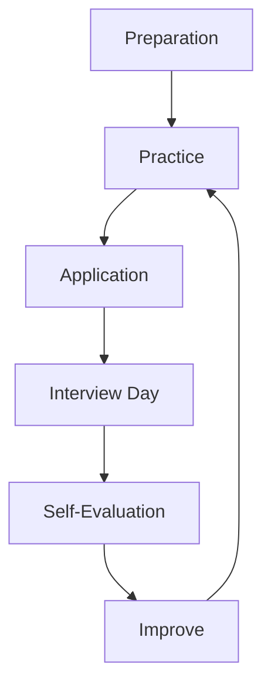

# System Design Interview — A 2-Day Crash Course

Run a 45-minute system design interview by owning the clock across five phases — requirements, estimation, high-level design, deep dives, and trade-off discussion — while keeping the conversation collaborative and your reasoning visible.

**Prerequisite:** `design/System-Design.md` — review it before Day 1.

---

## Part 0 — Why This Interview Exists

System design interviews are not a quiz on whether you've memorized the internals of Kafka or the exact algorithm behind consistent hashing. They are a structured conversation to see how you think under ambiguity, how you prioritize, and how you communicate decisions to someone who disagrees with you.

Interviewers score three things:

1. **Structured thinking** — do you move through a problem methodically, or do you jump to implementation details before you've scoped the problem?
2. **Trade-off awareness** — do you understand that every choice has a cost, and can you name both sides?
3. **Communication** — can you keep a senior engineer engaged and aligned without losing the thread?

Memorizing "design Twitter" or "design YouTube" is a trap. The patterns you learn from those systems are valuable, but the interviewer can rotate the knobs at any moment — "now design it for 10x the load," "what if the write path needs to be strongly consistent?" — and the only thing that saves you is a framework, not a memorized answer.

Two days of deliberate practice beats two weeks of passive reading. You are here to build the framework, not fill your head with system trivia.

---

## Vocabulary

| Term | What It Means |
|---|---|
| **Functional Requirements** | What the system must do — the user-facing behaviors (e.g., a user can send a message). |
| **Non-Functional Requirements** | How the system must behave — latency, availability, durability, consistency, throughput. |
| **Back-of-Envelope Estimation** | Rough math to size traffic, storage, and bandwidth before committing to an architecture. |
| **Component Diagram** | A whiteboard-level sketch showing services, databases, queues, and caches and how they connect. |
| **API Design** | The contract between clients and your system — endpoint names, inputs, outputs, and error shapes. |
| **Data Model** | How you store and access data — schema, primary keys, indexes, partitioning strategy. |
| **Deep Dive** | A focused 5–10 minute discussion on one component — usually the hardest or most interesting one. |
| **Trade-off** | An explicit acknowledgment that choosing X costs you Y, and why X is still the right call. |
| **Bottleneck** | The component or constraint that limits the throughput of the whole system. |
| **Scaling** | Techniques to handle more load — horizontal scaling, sharding, caching, async processing, CDN. |

---




## Day 1 — The Framework

### The Five-Phase Clock

A 45-minute session has a natural shape. If you internalize this shape, you stop second-guessing yourself and start leading.

```
0:00 – 5:00    Requirements     Clarify scope, pin functional and non-functional requirements
5:00 – 10:00   Estimation       Size the system — DAU, QPS, storage, bandwidth
10:00 – 25:00  High-Level Design   Draw the component diagram, define APIs, outline data model
25:00 – 40:00  Deep Dives       Go deep on 2–3 hard components; let the interviewer steer
40:00 – 45:00  Wrap-Up          Summarize, surface trade-offs you deferred, invite questions
```

This is a guideline, not a contract. If the interviewer redirects you, follow. But when they go quiet, you are responsible for moving the clock forward.

### Phase 1 — Requirements (5 minutes)

Start every interview with questions, not a solution. This is non-negotiable.

Ask first:

- Who uses this system? (consumers, internal teams, third parties)
- What are the core use cases? (write one or two sentences per use case)
- What scale are we targeting? (DAU, peak QPS, geographic spread)
- What are the consistency and availability expectations? (can we tolerate eventual consistency? what's the SLA?)
- Are there any notable constraints? (regulatory, cost, existing stack)

Write what you hear on the whiteboard. Confirm it back. Then say: "I'll focus on X, Y, and Z. I'll note A and B as out of scope unless we have time."

This does three things: it shows structured thinking before touching a marker, it prevents you from solving the wrong problem, and it gives the interviewer a chance to redirect early rather than after 20 minutes of wasted work.

Common mistakes:

- Asking too many questions and burning the clock. Five focused questions is enough.
- Assuming scale. Always confirm whether you're designing for 1 million or 100 million daily active users — the architecture differs fundamentally.
- Skipping non-functional requirements. Latency, availability, and consistency drive more architectural decisions than anything else.

### Phase 2 — Estimation (5 minutes)

Back-of-envelope math is not about precision. It is about establishing whether your design is in the right order of magnitude.

A standard estimation framework:

```
Daily Active Users (DAU): X million
Read/Write ratio: e.g., 100:1
Writes per second: DAU × write_actions_per_day / 86,400
Reads per second: writes × read_write_ratio
Storage per year: writes/sec × object_size × 86,400 × 365
Bandwidth: QPS × avg_payload_size
```

Say your numbers out loud. Interviewers want to see the reasoning, not the final answer. Round aggressively — "roughly 10K writes per second" is more useful than "9,847."

Flag what the numbers tell you:

- Over 10K writes/second: you probably need sharding or a write-optimized data store.
- Over 1 PB of storage per year: you need tiered storage or compression.
- P99 latency under 100ms for reads: you need a caching layer.

Estimation is not busywork. It shapes every component decision that follows.

### Phase 3 — High-Level Design (15 minutes)

Now draw. Start with a client and work right-to-left through the request path.

A minimal high-level design covers:

1. **API definition** — one or two key endpoints, their inputs and outputs. For a URL shortener: `POST /shorten { url }` → `{ short_url }`, `GET /{code}` → redirect.
2. **Component diagram** — clients, load balancers, application servers, databases, caches, queues, CDN. Keep it to 6–10 boxes. More is noise.
3. **Data model** — the core entities, primary keys, and one or two critical indexes. No need for a full ER diagram.

Drive the conversation while you draw. Narrate each decision: "I'm putting a cache here because reads are 100x more frequent than writes and the data is immutable after creation. That lets us reduce database load dramatically." The interviewer is scoring your reasoning, not your diagram.

If you get stuck, default to: stateless application servers → a primary database → a cache in front of reads → a queue for async work. This pattern covers 80% of systems.

### Phase 4 — Deep Dives (15 minutes)

This is where senior and staff-level candidates separate from the pack.

The interviewer will usually steer: "How does your database handle 50K writes per second?" or "Walk me through what happens when a user sends a message and the recipient is offline." If they don't steer, you pick the hardest component in your diagram and go deep.

What deep means:

- Explain the data access pattern — how many round trips, what indexes fire, what the hotspot risk is.
- Identify the failure mode — what breaks first, what the blast radius is.
- Propose a solution — and name its trade-off.

Examples of strong deep dive topics:

| Component | Questions to Answer |
|---|---|
| Database | Sharding strategy, replication lag, hotspot keys |
| Cache | Eviction policy, cache invalidation, thundering herd |
| Queue | At-least-once vs exactly-once delivery, consumer group design, dead letter queues |
| Search | Inverted index, tokenization, ranking, freshness |
| Notification delivery | Fan-out strategy, push vs pull, retry and dedup |

Do not try to cover everything. Two thorough deep dives beat five shallow ones.

### Phase 5 — Wrap-Up (5 minutes)

Close with a summary that acknowledges what you deferred. This signals maturity: you know what you didn't do, and you know why.

A good wrap-up sounds like:

"We covered the core write and read paths, sharding strategy, and cache invalidation. Two things I'd want to revisit with more time: a proper disaster recovery strategy for cross-region replication, and the exact fanout behavior under celebrity-account traffic spikes. Want me to go deeper on either of those?"

Then stop. Let the interviewer respond.

### What Interviewers Actually Evaluate

Interviewers are not checking boxes against a model answer. They are asking themselves four questions:

1. Would I want to work with this person on a hard problem?
2. Did they structure the problem before trying to solve it?
3. Did they acknowledge trade-offs or pretend there were none?
4. When I pushed back, did they engage thoughtfully or get defensive?

A candidate who says "I'd use Kafka here because we need at-least-once delivery and replay capability, though that adds operational complexity — if the team doesn't have Kafka experience, a simpler SQS setup might be the right call" scores higher than one who just says "use Kafka" with no context.

---

## Day 2 — Practice and Calibration

### Common Systems to Practice

You do not need to memorize designs. You need to practice the framework on enough systems that the five phases become automatic.

**URL Shortener** — The classic warmup. Core challenge: generating unique short codes at scale, handling redirect with low latency, analytics as a second-order concern.

**Rate Limiter** — Tests your knowledge of distributed state. Core challenge: coordinating counters across multiple application servers without a hot single-node bottleneck. Sliding window vs token bucket trade-off is the meat of this one.

**News Feed** — The fanout problem. Core challenge: push (write-time fanout) vs pull (read-time aggregation) vs hybrid. High-follower accounts break the naive push model. This one rewards knowing your user distribution.

**Chat System** — Real-time delivery and offline message storage. Core challenge: WebSocket connection management, message ordering, and reliable delivery when the recipient is offline. Presence tracking is a nice bonus.

**Notification System** — Multi-channel delivery at scale. Core challenge: fan-out to millions of subscribers, per-channel rate limiting, retry with dedup. The worked example in Part 7 covers this in full.

**Search Autocomplete** — Trie vs inverted index trade-off. Core challenge: low-latency prefix lookups, updating the index with fresh data, personalizing results per user without blowing up storage.

For each system, run through all five phases on paper or a whiteboard. Time yourself. Thirty minutes of timed practice beats three hours of reading.

### Estimation Cheatsheet

Commit these numbers to memory. They come up in every interview.

```
1 million requests/day         ~12 requests/second
1 billion requests/day         ~12,000 requests/second (12K QPS)
1 KB per request               1 GB/million requests
Average photo (compressed)     ~200 KB
Average video (1 min, 720p)    ~50 MB
SSD read latency               ~100 microseconds
Network round trip (same DC)   ~500 microseconds
Network round trip (cross-DC)  ~50–150 milliseconds
L1 cache hit                   ~1 nanosecond
L2 cache hit                   ~4 nanoseconds
RAM read                       ~100 nanoseconds
```

Powers of ten to know cold:

- 1 KB = 10^3 bytes
- 1 MB = 10^6 bytes
- 1 GB = 10^9 bytes
- 1 TB = 10^12 bytes
- 1 PB = 10^15 bytes

### How to Handle "What Would You Change at 10x Scale"

This question is almost guaranteed. Here is how to answer it.

First, identify your current bottleneck — the component in your diagram that saturates first. Then propose a targeted mitigation. Never say "add more servers" as the complete answer; always pair it with the specific constraint being relieved.

Common 10x inflection points:

| When you hit... | The bottleneck is likely... | Common mitigation |
|---|---|---|
| ~10K writes/second | Single primary database | Horizontal sharding, write-ahead log tailing |
| ~100K reads/second | Database read replicas saturated | Multi-tier caching (L1 in-process, L2 Redis) |
| ~1M concurrent connections | Stateful WebSocket tier | Horizontal scale + connection state in Redis |
| ~100 TB/year storage | Single storage tier cost | Tiered storage — hot/warm/cold with lifecycle policies |
| ~10M notifications/minute | Single queue consumer group | Partitioned topics, parallel consumer workers |

Frame your answer as a diagnosis first, then a treatment: "At 10x load, the first thing that saturates is the write path to the database. With 50K writes per second, a single primary can't keep up. I'd introduce horizontal sharding by user ID, which distributes the write load but adds cross-shard query complexity for anything that needs to aggregate across users."

### How to Discuss Trade-offs

A trade-off is not a weakness in your design. It is evidence that you understand it.

Every trade-off has four parts:

1. The choice you made
2. The benefit of that choice
3. The cost of that choice
4. The condition under which you would choose differently

Example: "I chose eventual consistency for the notification delivery count because the counter is informational — users don't make financial decisions based on it — and strong consistency would require distributed locks that hurt our write throughput by 3–5x. If this were a payment confirmation counter, I'd pay that cost."

Avoid weasel words: "it depends," "it might," "probably." Replace them with conditionals you can defend: "under these conditions, X. If the requirement changes to Y, then Z."

### L4 vs L5 vs Staff-Level Expectations

These are rough guidelines, not rules. Different companies calibrate differently.

**L4 (Mid-level):** Covers functional requirements thoroughly. Draws a coherent high-level design. Identifies the obvious bottlenecks with prompting. Discusses 1–2 trade-offs. Can be led into deep dives with questions.

**L5 (Senior):** Proactively identifies non-obvious bottlenecks. Drives the deep dive without needing prompting. Names trade-offs before the interviewer asks. Discusses failure modes and recovery paths. Can reason about operational complexity, not just architectural correctness.

**Staff:** Brings cross-cutting concerns without prompting — security, data privacy, cost, operability, team skill requirements. Identifies when a simpler design is the right answer even if a clever one is possible. Asks the interviewer clarifying questions that reframe the problem space. Discusses migration paths, not just greenfield designs.

At every level: interviewers want to see you lead, not follow. If you are always waiting for the next question, you will underperform your actual level.

---

## Part 7 — Worked Example: Designing a Notification System (45 Minutes)

Walk through this as if you are in the room.

---

**Interviewer:** Design a notification system that can send push notifications, SMS, and email to users.

---

**You (Requirements — 5 minutes):**

"Before I sketch anything, a few questions. Who are the consumers of this system — mobile apps, web clients, third-party integrations?

Interviewer: mobile and web, internal services trigger the notifications.

Got it. What are the core use cases — are we talking transactional notifications like order confirmations, or marketing like promotional campaigns, or both?

Interviewer: both.

What scale? How many notifications per day?

Interviewer: 10 million per day.

And what are the delivery guarantees — at-least-once, or exactly-once?

Interviewer: at-least-once is fine, but we don't want noticeable duplicates.

Last one: can notifications be delivered out of order, or does sequence matter?

Interviewer: order doesn't matter.

Okay. So: 10M notifications per day across push, SMS, and email. At-least-once delivery with dedup on the receiving end. Transactional and marketing. Internal services as producers. I'll keep user preference management and delivery analytics out of scope for now unless you want them. Sound right?

Interviewer: sounds right."

---

**You (Estimation — 5 minutes):**

"10M notifications per day is about 115 per second on average. Peak I'll estimate at 5–10x — call it 600–1,000 per second for burst traffic like a flash sale sending to 10M users in a short window.

Payload per notification: maybe 1 KB including metadata. At 1K QPS that's 1 MB/second through the system — manageable.

For storage: notification logs at 1 KB each, 10M per day, retained 30 days — that's 300 GB. Fine for a managed database.

The hard part is not throughput, it's fan-out. A single triggered event could generate 10M individual delivery tasks. That's the architectural challenge I'll keep in focus."

---

**You (High-Level Design — 15 minutes):**

"Let me draw this out.

The entry point is a Notification Service that accepts requests from internal producers — order service, marketing platform, etc. The API is simple: `POST /notifications` with a payload that includes recipient list or audience segment, message template, channels, and priority.

From there, I'll put a message queue — Kafka works well here because we need durability, replay, and the ability to add consumers without changing producers. The notification service writes to a Kafka topic.

On the consumer side: I'll have one consumer group per channel — Push Worker, SMS Worker, Email Worker. Each worker reads from the topic, enriches the message with user contact info from a User Data Service, calls the third-party provider (APNs/FCM for push, Twilio for SMS, SendGrid for email), and writes a delivery record to a notification log database.

For dedup: I'll generate a deterministic notification ID at creation time based on (event_id, user_id, channel). Workers check this ID against a short-TTL Redis set before sending. If it's already there, skip. This handles at-least-once delivery without noticeable duplicates.

Let me also sketch the user preference layer — I'll treat this as a read-through cache in front of a Preferences DB. Workers check preferences before sending so users who opt out of SMS don't get SMS.

APIs:
- `POST /notifications` — create and enqueue notification
- `GET /notifications/{id}` — delivery status
- `DELETE /notifications/{id}` — cancel if not yet sent"

---

**You (Deep Dives — 15 minutes):**

"I want to go deep on two things: the fan-out problem and the retry mechanism. Which would you rather start with?

Interviewer: fan-out.

Fan-out is the hardest part of this system. A marketing campaign to 10M users can't just be one message in the queue — the single consumer would serialize the work and we'd miss our delivery window.

I'd split this into two stages. Stage one: a Fan-out Service reads the campaign trigger, looks up the audience segment — say 10M user IDs — and writes individual per-user notification tasks to the queue in batches. It can do this in parallel across partitions.

Stage two: the channel workers pick up individual tasks and call third-party providers. With Kafka partitioned by user ID, we can scale workers horizontally — if we need 100 workers to drain the queue in 10 minutes, we add 100 workers.

The trade-off here is write amplification. A single campaign event becomes 10M queue messages. At 1 KB each, that's 10 GB of queue traffic per campaign. Kafka handles that comfortably, but it's worth being aware of.

The alternative — pull model where each worker queries 'what's pending for my partition?' — reduces write amplification but adds polling overhead and makes it harder to bound delivery latency. For a notification system where delivery within 60 seconds is the SLA, push wins.

Interviewer: what about retries?

For retries: exponential backoff with jitter, max 3 attempts, dead-letter queue for anything that fails all attempts. The DLQ feeds an alerting pipeline so the on-call team can investigate delivery failures at scale.

The tricky part is the retry window. For transactional notifications — order confirmations — a 30-second retry delay is fine. For time-sensitive notifications like OTPs, we need tighter SLAs and probably a separate priority queue with faster retry.

I'd model this as two Kafka topics: `notifications.high-priority` and `notifications.standard`, with dedicated consumer groups for each."

---

**You (Wrap-Up — 5 minutes):**

"To summarize: we have a producer API feeding Kafka, a fan-out service for bulk campaigns, per-channel workers with dedup via Redis, preference checks before delivery, and a retry mechanism with a dead-letter queue for failures.

Two things I'd want to revisit: first, cross-region delivery — if we want to honor data residency requirements, we'd need region-aware routing, which adds complexity to the fan-out stage. Second, delivery analytics — the notification log database gives us raw data, but building a real-time funnel (sent → delivered → opened) requires either a stream processor on top of Kafka or a separate events pipeline.

Any of those you'd like to dig into?"

---

This walkthrough is approximately 45 minutes executed at a comfortable pace. Practice it out loud. The physical act of narrating reveals where your reasoning has gaps.

---

## Part 8 — Pitfalls

**Jumping to solutions.** If you start drawing before you've confirmed requirements, you are designing in the dark. The first five minutes of silence while you ask questions is valuable signal to the interviewer, not dead air.

**Naming tools without justification.** "I'll use Redis" is not a design decision. "I'll use Redis as an in-memory cache for session tokens because they're small, frequently read, and can tolerate a cold start on restart" is. Every technology choice needs a why.

**Treating the design as complete.** No design survives contact with 10x scale. Acknowledge failure modes, bottlenecks, and deferred concerns. Candidates who present a design as if it has no weaknesses raise a red flag.

**Not driving the conversation.** The interviewer is not there to feed you the next question. When you finish a section, move to the next one. When you finish a deep dive, offer to do another or ask what they want to explore. Passive candidates appear unsure.

**Ignoring the interviewer.** If the interviewer says "interesting, but what about X?" — stop what you're doing and address X. They are showing you the scoring rubric. Follow it.

**Over-engineering.** A URL shortener does not need Kafka. A rate limiter does not need a distributed graph database. Start with the simplest design that satisfies the requirements, then scale it as the constraints demand.

**Paralysis on numbers.** If you don't know the exact latency of a disk seek or the exact throughput of a modern NIC, estimate. Say "I'm assuming roughly X — if the actual number is significantly different, that changes the calculus on Y." Interviewers know you don't have these memorized. They want to see that you know which numbers matter and why.

⚠️ One pitfall that ends interviews early: arguing with the interviewer. If they push back on your design, treat it as new information, not a challenge to defend against. "That's a fair point — if consistency is a hard requirement, then we'd need to revisit the eventual consistency assumption here and consider two-phase commit or a saga pattern." Updating your position is strength.

---

## Part 9 — Quick Reference

### Framework Template

```
1. Requirements (5 min)
   - Functional: list 3–5 core use cases
   - Non-functional: latency, availability, consistency, scale
   - Out of scope: name at least 2 things you're not designing

2. Estimation (5 min)
   - DAU → QPS (reads and writes separately)
   - Storage per year
   - Bandwidth
   - Flag what the numbers imply for architecture

3. High-Level Design (15 min)
   - API: 2–3 key endpoints
   - Component diagram: 6–10 boxes
   - Data model: core entities, primary key, critical indexes

4. Deep Dives (15 min)
   - Pick 2 hard components
   - For each: access pattern → failure mode → mitigation → trade-off

5. Wrap-Up (5 min)
   - Summarize decisions
   - Name 2 deferred concerns
   - Invite questions
```

### Estimation Numbers

```
Seconds in a day:          86,400
Seconds in a year:         31.5 million
1M req/day in QPS:         ~12 QPS
1B req/day in QPS:         ~12,000 QPS
100M DAU, 10 writes/day:   ~12,000 writes/second
Photo size (compressed):   ~200 KB
Video (1 min, 720p):        ~50 MB
Typical API payload:       1–10 KB
RAM read:                  ~100 ns
SSD random read:           ~100 µs
Network (same DC):         ~500 µs
Network (cross-region):    ~50–150 ms
```

### Common Systems Checklist

Work through each of these before your interview. For each one, practice the full 45-minute framework out loud.

- [ ] URL Shortener
- [ ] Rate Limiter
- [ ] Key-Value Store
- [ ] News Feed
- [ ] Chat System
- [ ] Notification System
- [ ] Search Autocomplete
- [ ] Web Crawler
- [ ] Distributed Cache
- [ ] Design YouTube / Netflix (video streaming)

For each: identify the single hardest component, explain the fan-out or consistency challenge, and name the trade-off between two reasonable approaches.

---


## Top 10 Interview Questions

<details>
<summary><strong>Q: What is System Design Interview and what problem does it solve?</strong></summary>

System Design Interview addresses a specific need in modern engineering workflows. Understanding the core problem it solves — and the alternatives it replaced — is the foundation for every subsequent interview question. Frame your answer around the pain point first, then the solution.

</details>

<details>
<summary><strong>Q: How does System Design Interview compare to its main alternatives?</strong></summary>

Every tool exists in an ecosystem of alternatives. Be prepared to articulate the specific tradeoffs: when System Design Interview is the right choice, when an alternative is better, and what factors drive the decision (scale, team expertise, existing infrastructure, compliance requirements).

</details>

<details>
<summary><strong>Q: What are the most common production pitfalls with System Design Interview?</strong></summary>

Production experience is what separates senior from junior engineers. Common pitfalls include: misconfiguration that works in dev but fails at scale, security oversights, inadequate monitoring, and operational procedures that are untested until an incident occurs. Cite specific examples from your experience.

</details>

<details>
<summary><strong>Q: How do you monitor and observe System Design Interview in production?</strong></summary>

Key metrics to track, alerting thresholds to set, dashboards to build, and log patterns to watch. Production monitoring should cover: health/liveness, performance (latency, throughput), capacity (resource utilisation), and business impact (error rates affecting users). Explain which metrics are leading indicators versus lagging.

</details>

<details>
<summary><strong>Q: How do you scale System Design Interview as load increases?</strong></summary>

Scaling strategies depend on the bottleneck: horizontal scaling (add more instances), vertical scaling (bigger instances), caching (reduce load), sharding (distribute data), and async processing (decouple components). Explain which approach applies to System Design Interview and at what scale each strategy becomes necessary.

</details>

<details>
<summary><strong>Q: How do you handle security and access control with System Design Interview?</strong></summary>

Security is non-negotiable in production. Cover: authentication and authorization mechanisms, secrets management (never in code), encryption (at rest and in transit), network security (firewalls, private networks), audit logging, and compliance requirements relevant to your industry.

</details>

<details>
<summary><strong>Q: How do you implement disaster recovery for System Design Interview?</strong></summary>

DR planning requires defining RTO (recovery time objective) and RPO (recovery point objective), implementing backup strategies, testing restore procedures, and documenting runbooks. Explain your backup strategy, how you test restores, and what your recovery procedure looks like.

</details>

<details>
<summary><strong>Q: How do you automate System Design Interview deployment and configuration management?</strong></summary>

Infrastructure as code, CI/CD pipelines, configuration management, and GitOps workflows. Explain how you version, test, deploy, and roll back changes. Cover: what is automated, what requires manual approval, and how you handle configuration drift.

</details>

<details>
<summary><strong>Q: How do you troubleshoot issues with System Design Interview in production?</strong></summary>

A systematic debugging approach: check health endpoints, review recent changes (deploys, config changes), examine logs and metrics, reproduce the issue, identify root cause, fix, verify, and write a postmortem. Explain your actual debugging workflow with concrete examples.

</details>

<details>
<summary><strong>Q: What are the best practices for System Design Interview that you have learned from experience?</strong></summary>

Best practices that go beyond documentation: lessons learned from production incidents, configuration patterns that prevent common issues, testing strategies that catch bugs before production, and operational procedures that reduce toil. Share specific examples where following (or not following) a best practice had measurable impact.

</details>

---


## Quick Quiz

Test your understanding with these rapid-fire questions (answers hidden):

<details>
<summary>1. What is the ONE core problem that System Design Interview solves?</summary>
Re-read Part 0 — the mental model section. If you can explain the "why" in one sentence, you understand the foundation.
</details>

<details>
<summary>2. Name the 3 most important terms from the vocabulary section.</summary>
Review Part 1. These are the building blocks every conversation about System Design Interview uses.
</details>

<details>
<summary>3. What is the first thing you would set up on Day 1?</summary>
Check the Day 1 section — the very first hands-on step that gets you a working result.
</details>

<details>
<summary>4. What is the most common production pitfall with System Design Interview?</summary>
Review the Common Pitfalls section. The first item listed is typically the most frequently encountered.
</details>

<details>
<summary>5. How does System Design Interview compare to its closest alternative?</summary>
Check the Comparison Matrix below — focus on the key differentiating row.
</details>


## Comparison Matrix

| Dimension | Top-Down Approach | Bottom-Up | Iterative |
|-----------|-------------------|-----------|-----------|
| **Primary use case** | Core strength of Top-Down Approach | Core strength of Bottom-Up | Core strength of Iterative |
| **Learning curve** | Moderate | Varies | Varies |
| **Community/ecosystem** | Active | Active | Growing |
| **Operational complexity** | Medium | Varies | Varies |
| **Best for** | See Part 0 | Different tradeoffs | Different tradeoffs |

> **How to read this matrix:** no tool wins on every dimension. Pick based on your specific constraints — team expertise, existing infrastructure, scale requirements, and compliance needs. The right choice is the one that fits your context, not the one with the most checkmarks.

## Next Steps

- `design/System-Design.md` — the foundational concepts underlying every system you'll design in interviews
- `design/HLD.md` — high-level design patterns and component catalog
- `interview/Behavioral-Interview.md` — the other half of the loop

---

## Recommended learning resources

**YouTube channels & playlists:**
- [ByteByteGo — System Design Interview](https://www.youtube.com/@ByteByteGo) — Alex Xu's visual walkthroughs of real interview problems: URL shortener, chat system, notification service
- [Exponent — System Design Mock Interviews](https://www.youtube.com/@tryexponent) — full mock interviews with feedback, covering structure, estimation, and trade-off conversations
- [Gaurav Sen — System Design](https://www.youtube.com/@gaborsen) — intuition-first explanations of consistent hashing, load balancing, and database selection
- [sudoCODE — System Design Playlist](https://www.youtube.com/@sudocode) — practical system design with clear diagrams and interviewer-perspective commentary
- [NeetCode — System Design for Interviews](https://www.youtube.com/@NeetCode) — structured approach to common interview problems with time management tips

**Official docs & blogs:**
- [ByteByteGo Blog](https://blog.bytebytego.com/) — visual system design explanations, architecture deep dives, and interview preparation guides
- [interviewing.io Blog](https://interviewing.io/blog) — data-driven insights on what actually matters in system design interviews

---

## The Mantra

You are not there to impress — you are there to think out loud.

The interviewer already knows the answer. What they don't know is how you got there, whether you acknowledged the wrong turns, and whether you'd be someone they trust in a 2am incident war room.

Lead the clock. Name the trade-offs. Drive to clarity. That is the whole thing.
