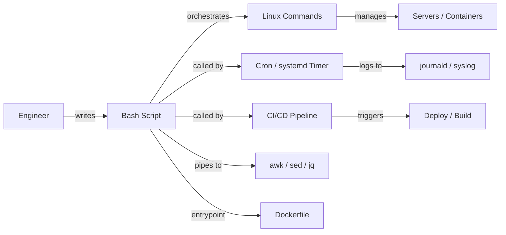

# Bash Scripting — A 2-Day Crash Course

> **In one sentence:** Bash scripting lets you save a sequence of shell commands into a file and
> add variables, loops, conditionals, and functions — turning repetitive manual work into
> reliable, repeatable automation.

> Builds directly on `Linux.md` (the commands) — a Bash script is just those commands, organized.

---

## Part 0 — Why script, and the mindset

If you find yourself running the same few commands over and over — deploy steps, log cleanup, a
health check, a backup — that's a script waiting to be written. Scripting turns "I hope I
remember the steps" into "run this file." For SRE/DevOps it's the glue everywhere: CI steps,
container entrypoints, cron jobs, install scripts, and quick automation.

**The crucial mindset shift:** a script runs *unattended*, so it must handle failure. Typed
interactively, you see an error and react. In a script, a failed command might silently continue
and cause damage (deleting the wrong thing, deploying a half-built artifact). So the #1 skill
isn't syntax — it's **making scripts fail safely and loudly**. That's why every good script
starts with `set -euo pipefail` (explained Day 1).

**Mental model:** a Bash script is a recipe the computer follows literally and blindly. Your job
is to make the recipe unambiguous, guard against bad inputs and failures, and stop immediately
when something's wrong — because it won't use judgment, only your instructions.



---

## Part 1 — The anatomy of a script
```bash
#!/usr/bin/env bash          # shebang: run this file with bash
set -euo pipefail            # safety settings (see Day 1) — put this in EVERY script
IFS=$'\n\t'                  # safer word-splitting (optional but good)

# variables, functions, logic follow...
echo "Hello, $USER"
```
```bash
chmod +x script.sh           # make it executable
./script.sh                  # run it      (or: bash script.sh)
```
The **shebang** (`#!`) tells the OS which interpreter to use. `chmod +x` makes it runnable.

---

## DAY 1 — Variables, safety, conditionals, loops

### 1. Variables and quoting (quoting is where beginners get burned)
```bash
name="Gurpreet"          # NO spaces around = (name = "x" is wrong)
echo "$name"             # use $ to read; ALWAYS wrap in double quotes
greeting="Hello, $name"  # variables expand inside double quotes
literal='Hello, $name'   # single quotes do NOT expand — prints literally
files=$(ls *.log)        # command substitution: capture output into a variable
count=$(( 3 + 4 ))       # arithmetic
```
**The golden rule: always double-quote your variables** — `"$var"`, `"${arr[@]}"`. Unquoted
variables break the moment a value contains a space or is empty, causing weird, dangerous bugs.
`"$name"` is safe; `$name` is a landmine.

### 2. The safety preamble (do this first, every time)
```bash
set -e          # exit immediately if any command fails (non-zero exit)
set -u          # error on use of an UNSET variable (catches typos like $file vs $file_)
set -o pipefail # a pipeline fails if ANY part fails (not just the last command)
# combined:
set -euo pipefail
```
Without these, a script barrels past failures. `set -u` alone prevents the catastrophic
`rm -rf "$DIR/"` when `$DIR` is accidentally empty. This single line is the difference between a
safe script and a dangerous one.

### 3. Conditionals
```bash
if [[ "$count" -gt 10 ]]; then
    echo "many"
elif [[ "$count" -eq 0 ]]; then
    echo "none"
else
    echo "some"
fi

# file/string tests
if [[ -f "$file" ]]; then echo "file exists"; fi      # -d dir, -e exists, -x executable
if [[ -z "$var" ]]; then echo "var is empty"; fi      # -z empty, -n non-empty
if [[ "$a" == "$b" ]]; then echo "equal"; fi          # string ==, !=
# numeric: -eq -ne -lt -le -gt -ge       logical: && || !
```
Use **`[[ ]]`** (Bash's test) over the older `[ ]` — it's safer with strings and supports `&&`/`||`.

### 4. Exit codes (how scripts know success/failure)
```bash
command
echo $?          # 0 = success, non-zero = failure (the exit code of the last command)

if grep -q "error" log.txt; then     # -q = quiet; the IF tests its exit code
    echo "found errors"
fi

mkdir /data || { echo "mkdir failed"; exit 1; }   # run RHS only if LHS fails
```
Every command returns an exit code; `0` means success. Conditionals and `&&`/`||` are built on
this. End your script with a meaningful `exit 0` / `exit 1`.

### 5. Loops
```bash
for f in *.log; do                  # loop over files
    echo "processing $f"
    gzip "$f"
done

for i in {1..5}; do echo "$i"; done # numeric range

while read -r line; do               # read a file line by line (-r = don't mangle backslashes)
    echo "line: $line"
done < input.txt

for host in web1 web2 web3; do
    ssh "$host" "uptime"
done
```

### 6. Arguments (making scripts reusable)
```bash
# $1 $2 ... = positional args, $0 = script name, $@ = all args, $# = count
echo "first arg: $1"
echo "all args: $@"
echo "arg count: $#"

if [[ $# -lt 1 ]]; then
    echo "Usage: $0 <environment>" >&2     # print usage to stderr
    exit 1
fi
env="$1"
```

**By end of Day 1 you can:** write a safe script (`set -euo pipefail`), use quoted variables,
conditionals, exit codes, loops, and arguments. That's enough to automate most real tasks.

---

## DAY 2 — Functions, robustness, text processing, real scripts

### 1. Functions
```bash
log() {                          # define a function
    echo "[$(date '+%H:%M:%S')] $*"   # $* = all the function's args
}

deploy() {
    local env="$1"               # 'local' keeps the variable inside the function
    log "deploying to $env"
    # ...
    return 0                     # return an exit code (not a value)
}

log "starting"
deploy "prod"
```
Use `local` for function variables (otherwise they leak globally). Functions `return` exit codes;
to "return data," `echo` it and capture with `$(...)`.

### 2. Robustness patterns (what separates a script from a *good* script)
```bash
# Trap: run cleanup on exit or error (delete temp files, etc.)
tmpdir=$(mktemp -d)
trap 'rm -rf "$tmpdir"' EXIT       # runs no matter how the script ends

# Default values for unset vars
name="${1:-world}"                 # use $1, or "world" if unset
: "${API_URL:?API_URL must be set}"  # error out if a required var is missing

# Check a command exists before using it
command -v jq >/dev/null || { echo "jq not installed" >&2; exit 1; }
```
`trap ... EXIT` guarantees cleanup even on failure — essential when a script makes temporary
files or changes that must be undone.

### 3. Reading input and here-docs
```bash
read -rp "Continue? [y/N] " answer
[[ "$answer" == "y" ]] || exit 0

# here-doc: feed a multi-line block to a command
cat > config.yaml <<EOF
env: $env
replicas: 3
EOF

# here-doc with NO expansion (literal $) — quote the delimiter:
cat > script.sh <<'EOF'
echo "$HOME is literal here"
EOF
```

### 4. Text processing in scripts (the real power)
Combine the Linux tools (`Linux.md`) inside scripts:
```bash
# extract, filter, transform
errors=$(grep -c "ERROR" app.log)
ips=$(awk '{print $1}' access.log | sort | uniq -c | sort -rn | head)
cpu=$(top -bn1 | grep "Cpu" | awk '{print $2}')

# sed for substitution
sed -i 's/old/new/g' config.txt           # in-place replace
version=$(sed -n 's/^version: //p' meta.yaml)

# jq for JSON (see jq.md)
status=$(curl -s "$url" | jq -r '.status')
```
`awk` (columns), `sed` (substitution), `grep` (filter), and `jq` (JSON) are the four you'll reach
for constantly to parse command output and files.

### 5. Arrays and associative arrays
```bash
hosts=("web1" "web2" "web3")
echo "${hosts[0]}"            # first element
echo "${hosts[@]}"           # all elements
echo "${#hosts[@]}"          # count
for h in "${hosts[@]}"; do ssh "$h" uptime; done

declare -A ports             # associative array (map)
ports[web]=80
ports[api]=8080
echo "${ports[api]}"
```

### 6. Putting it together — script structure
```bash
#!/usr/bin/env bash
set -euo pipefail

# --- config ---
readonly LOG_DIR="/var/log/myapp"
readonly RETENTION_DAYS=7

# --- functions ---
log()  { echo "[$(date '+%F %T')] $*"; }
die()  { echo "ERROR: $*" >&2; exit 1; }

usage() { echo "Usage: $0 <env>"; exit 1; }

main() {
    [[ $# -eq 1 ]] || usage
    local env="$1"
    command -v aws >/dev/null || die "aws CLI required"

    log "cleaning logs older than $RETENTION_DAYS days"
    find "$LOG_DIR" -name "*.log" -mtime +"$RETENTION_DAYS" -delete

    log "deploying to $env"
    # ... deploy steps ...
    log "done"
}

main "$@"     # pass script args into main
```
The `main "$@"` pattern (logic in functions, one `main` call at the bottom) keeps scripts
readable and testable as they grow.

---

## Worked example — a safe log-rotation + health-check script
```bash
#!/usr/bin/env bash
set -euo pipefail
trap 'echo "failed at line $LINENO" >&2' ERR

readonly URL="${1:?Usage: $0 <health-url>}"
readonly LOGDIR="/var/log/myapp"

# 1. rotate: gzip logs older than a day, delete those older than a week
find "$LOGDIR" -name "*.log" -mtime +1  -exec gzip {} \;
find "$LOGDIR" -name "*.gz"  -mtime +7  -delete

# 2. health check with retry
for attempt in {1..3}; do
    if code=$(curl -s -o /dev/null -w "%{http_code}" "$URL"); [[ "$code" == "200" ]]; then
        echo "healthy ($code)"; exit 0
    fi
    echo "attempt $attempt: got $code, retrying..." >&2
    sleep 2
done
echo "unhealthy after 3 attempts" >&2
exit 1
```

---


## Terminal Demo

```terminal-demo
# bash@scripting ~ %

$ echo "Hello from Bash ${BASH_VERSION}"
Hello from Bash 5.2.21(1)-release

$ for svc in api web worker; do echo "Checking $svc..."; curl -sf "localhost:8080/$svc/health" && echo "OK" || echo "FAIL"; done
Checking api... OK
Checking web... OK
Checking worker... FAIL

$ find /var/log -name "*.log" -mmin -60 -size +10M | sort
/var/log/api/access.log
/var/log/api/error.log

$ ps aux --sort=-%mem | head -5
USER     PID  %CPU %MEM    VSZ   RSS COMMAND
postgres 5678 12.1  5.6  1843m 890m postgres: writer process
app      1234 45.2  3.2  2560m 512m node /app/api/server.js

$ awk '{sum+=$10} END {print "Total bytes:", sum}' /var/log/api/access.log
Total bytes: 45678901234
```

---

## Common pitfalls
- **Unquoted variables.** `$var` breaks on spaces/empties. Always `"$var"` and `"${arr[@]}"`.
  This causes the majority of subtle script bugs.
- **No `set -euo pipefail`.** Scripts barrel past failures and corrupt things. Add it to every
  script.
- **`set -e` surprises.** It doesn't trigger inside `if`/`&&`/`||` conditions (by design) and a
  trailing command in a function can mask failures — know its edge cases.
- **`=` with spaces.** `x = 1` is a command, not an assignment. Write `x=1`.
- **Parsing `ls`.** Don't `for f in $(ls)`; use `for f in *.log` (globbing) — `ls` output breaks
  on spaces/newlines.
- **Forgetting `local` in functions.** Variables leak into the global scope and clash.
- **Not validating arguments/required vars.** Use `${VAR:?msg}` and `$#` checks so the script
  fails clearly instead of doing something dangerous with empty values.
- **Reinventing complex logic in Bash.** Past ~100 lines or heavy data structures, switch to
  Python. Bash is glue, not an application language.

---

## Quick reference
```bash
# Preamble
#!/usr/bin/env bash
set -euo pipefail

# Variables
x=value   "$x"   "${x:-default}"   "${x:?error if unset}"   "${#x}"  # length
$(cmd)    $(( a + b ))    ${x^^}  # upper   ${x,,}  # lower   ${x/foo/bar}  # replace

# Tests  [[ ]]
-f file  -d dir  -e exists  -x exec  -r read  -w write
-z empty  -n nonempty   ==  !=   =~ regex
-eq -ne -lt -le -gt -ge   (numbers)    &&  ||  !

# Control
if ...; then ...; elif ...; then ...; else ...; fi
for x in list; do ...; done       for ((i=0;i<n;i++)); do ...; done
while ...; do ...; done           until ...; do ...; done
case "$x" in a) ...;; b|c) ...;; *) ...;; esac

# Functions
name() { local v="$1"; ...; return 0; }

# Args & IO
$0 $1 $@ $# $?       read -rp "prompt " var       cmd >&2 (to stderr)
cmd > f  >> f  2>&1  < f  | tee f      <<EOF heredoc EOF   <<'EOF' literal EOF

# Robustness
trap 'cleanup' EXIT ERR INT       mktemp -d       command -v tool

# Arrays
a=(x y z)  "${a[@]}"  "${a[0]}"  "${#a[@]}"      declare -A map; map[k]=v
```
```bash
shellcheck script.sh      # LINT your scripts — catches quoting bugs & more. Use it always.
bash -n script.sh         # syntax check without running
bash -x script.sh         # trace execution (debug)
```

---

## Top 10 Interview Questions

<details>
<summary><strong>Q: What does set -euo pipefail do and why should every script start with it?</strong></summary>

`set -e` exits on any non-zero return code. `set -u` treats unset variables as errors, catching typos like `$flie` instead of `$file`. `set -o pipefail` makes a pipeline fail if any stage fails, not just the last one. Together they turn a silent-failure script into one that stops immediately when something goes wrong — which is the difference between a safe script and one that deletes the wrong directory because a variable was empty.

</details>

<details>
<summary><strong>Q: Why must you always double-quote your variables in Bash?</strong></summary>

An unquoted variable undergoes word splitting and glob expansion. If `$file` contains `my report.txt`, then `rm $file` runs `rm my report.txt` — two arguments, deleting the wrong things. Worse, if a variable is empty, `rm -rf $DIR/` becomes `rm -rf /`. Quoting with `"$file"` preserves the value as a single token and prevents these catastrophic bugs.

</details>

<details>
<summary><strong>Q: How would you safely handle temporary files in a Bash script?</strong></summary>

Use `mktemp` to create a temp file or directory, then register a `trap` on `EXIT` to clean it up: `tmpdir=$(mktemp -d); trap 'rm -rf "$tmpdir"' EXIT`. The trap fires no matter how the script exits — success, failure, or signal — so you never leak temp files on a production server.

</details>

<details>
<summary><strong>Q: Explain the difference between $@ and $* in a script.</strong></summary>

When double-quoted, `"$@"` expands each positional parameter as a separate word, preserving arguments that contain spaces. `"$*"` joins all parameters into a single string separated by the first character of IFS. In practice you almost always want `"$@"` when passing arguments through to another command, because it keeps multi-word arguments intact.

</details>

<details>
<summary><strong>Q: When would you choose Python over Bash for an automation task?</strong></summary>

Once the script needs structured data (JSON/YAML parsing), error handling beyond exit codes, HTTP API calls, or grows past about 100 lines. Bash is glue for commands; Python is for logic. If you find yourself writing associative arrays, complex string manipulation, or nested conditionals in Bash, you have already crossed the line.

</details>

<details>
<summary><strong>Q: How do you pass variables safely into an awk or sed command from Bash?</strong></summary>

For awk, use the `-v` flag: `awk -v threshold="$val" '$3 > threshold'`. For sed, use double quotes around the expression but be careful with special characters. Never embed shell variables inside single-quoted awk programs — the shell cannot expand them. The `-v` approach avoids quoting nightmares entirely.

</details>

<details>
<summary><strong>Q: What is a here-document and when would you use one?</strong></summary>

A here-doc feeds a multi-line block of text to a command's stdin. `cat > config.yaml <<EOF ... EOF` writes a config file inline in your script. Quoting the delimiter (`<<'EOF'`) disables variable expansion inside the block, which matters when generating scripts or configs that themselves contain `$` signs.

</details>

<details>
<summary><strong>Q: How do you handle a script that needs to retry a flaky operation?</strong></summary>

Use a counted loop with a sleep and an exit condition: `for attempt in {1..5}; do command && break; sleep 2; done`. Check the exit code after the loop to know whether it succeeded or exhausted retries. In production, add exponential backoff and log each attempt so you can trace failures in the journal.

</details>

<details>
<summary><strong>Q: What is the main() pattern in Bash scripting and why use it?</strong></summary>

You define all logic in functions, then call `main "$@"` at the bottom of the script. This keeps global scope clean, makes the script testable (you can source it without executing), and mirrors the structure of larger programs. It also makes the script's entry point obvious to anyone reading it.

</details>

<details>
<summary><strong>Q: How do you debug a Bash script that is failing silently?</strong></summary>

Run it with `bash -x script.sh` to trace every command as it executes, showing variable expansions. For targeted debugging, add `set -x` before the suspect section and `set +x` after. Also check `$?` after critical commands, and use `trap 'echo "failed at line $LINENO" >&2' ERR` to pinpoint exactly where failure occurs.

</details>

---


## Quick Quiz

Test your understanding with these rapid-fire questions (answers hidden):

<details>
<summary>1. What is the ONE core problem that Bash solves?</summary>
Re-read Part 0 — the mental model section. If you can explain the "why" in one sentence, you understand the foundation.
</details>

<details>
<summary>2. Name the 3 most important terms from the vocabulary section.</summary>
Review Part 1. These are the building blocks every conversation about Bash uses.
</details>

<details>
<summary>3. What is the first thing you would set up on Day 1?</summary>
Check the Day 1 section — the very first hands-on step that gets you a working result.
</details>

<details>
<summary>4. What is the most common production pitfall with Bash?</summary>
Review the Common Pitfalls section. The first item listed is typically the most frequently encountered.
</details>

<details>
<summary>5. How does Bash compare to its closest alternative?</summary>
Check the Comparison Matrix below — focus on the key differentiating row.
</details>


## Comparison Matrix

| Dimension | Bash | Zsh | Fish |
|-----------|------|-----|------|
| **Primary use case** | Core strength of Bash | Core strength of Zsh | Core strength of Fish |
| **Learning curve** | Moderate | Varies | Varies |
| **Community/ecosystem** | Active | Active | Growing |
| **Operational complexity** | Medium | Varies | Varies |
| **Best for** | See Part 0 | Different tradeoffs | Different tradeoffs |

> **How to read this matrix:** no tool wins on every dimension. Pick based on your specific constraints — team expertise, existing infrastructure, scale requirements, and compliance needs. The right choice is the one that fits your context, not the one with the most checkmarks.

## Next steps after Day 2
- Run **shellcheck** on everything (it teaches you correct Bash as you go).
- Learn **awk** and **sed** more deeply for text processing; **jq**/**yq** for JSON/YAML
  (see `jq.md`, `yq.md`).
- Cron and systemd timers for scheduling scripts; `getopts` for proper flag parsing.
- Know when to graduate to **Python** — for anything with real data structures, APIs, or >100
  lines of logic.

## Recommended learning resources

**YouTube channels & playlists:**
- [NetworkChuck — Bash Scripting for Beginners](https://www.youtube.com/@NetworkChuck) — approachable intro to writing your first scripts and automating tasks
- [LearnLinuxTV — Bash Scripting Tutorial Series](https://www.youtube.com/@LearnLinuxTV) — structured walkthrough from variables to functions to real automation
- [Fireship — Bash in 100 Seconds](https://www.youtube.com/@Fireship) — quick mental model of what Bash is and why it matters
- [The Urban Penguin — Advanced Bash Scripting](https://www.youtube.com/@TheUrbanPenguin) — deeper topics: arrays, traps, getopts, process substitution
- [Luke Smith — Shell Scripting Tutorials](https://www.youtube.com/@LukeSmithxyz) — minimalist, practical shell scripting and Unix philosophy

**Official docs & blogs:**
- [GNU Bash Reference Manual](https://www.gnu.org/software/bash/manual/bash.html) — the authoritative reference for syntax, builtins, and expansion rules
- [ShellCheck](https://www.shellcheck.net/) — paste any script here to catch quoting bugs, syntax issues, and bad patterns instantly
- [Julia Evans — Bash quirks](https://jvns.ca/) — visual, memorable guides to the parts of Bash that trip everyone up

**The mantra:** `set -euo pipefail` at the top, quote every variable, check exit codes, clean up
with `trap`, validate inputs, and run shellcheck. Bash is glue for commands — keep it small and
make it fail safely.
