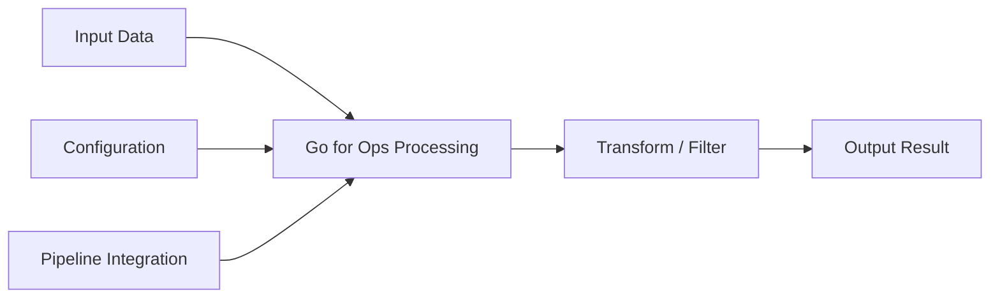

# Go for Ops — A 2-Day Crash Course

Go is the language of cloud infrastructure — Kubernetes, Docker, Terraform, and Prometheus are all written in it; knowing the basics lets you read, extend, and build ops tooling without depending on someone else's wrapper.

**Prerequisites:** None. A terminal and curiosity are enough.

---

## Part 0 — Why Go for Ops?

You have Python. You have shell scripts. Why learn another language?

Because the ecosystem decided for you. When you open a Kubernetes operator, a Prometheus exporter, a Terraform provider, or a container runtime, you are reading Go. If you cannot read Go, you are reading documentation written by someone who did. That is an indirection you can remove.

Four properties make Go the default choice for ops tooling:

**Single binary deployment.** `go build` produces one self-contained executable. No interpreter, no virtualenv, no shared libraries to manage. You copy the binary to a server and it runs. That is the entire deployment story for most internal tools.

**Cross-compilation is a first-class feature.** From your laptop you can produce a Linux/amd64 binary, a Linux/arm64 binary for Graviton, and a Darwin/arm64 binary for the team — in three commands, no cross-compiler toolchain required.

**Goroutines handle concurrency cheaply.** Checking the health of 500 endpoints concurrently is a few lines. The runtime multiplexes goroutines onto OS threads so you get M:N concurrency without managing thread pools.

**CNCF runs on Go.** If you interact with the Kubernetes API, write exporters, build admission webhooks, or extend Terraform, the idiomatic path is Go. The `client-go` library, the controller-runtime framework, and the operator SDK all assume Go as the primary language.

Go is not a replacement for Python in every context. Quick data munging, scripting, and ML tooling still favor Python. But for anything that ships as a binary, integrates with the Kubernetes API, or needs to be distributed to infrastructure — Go earns its place.

---

## Vocabulary

These ten terms appear constantly. Know them before Day 1.

**Package** — the unit of code organization. Every `.go` file declares `package foo` at the top. The package named `main` is the entry point for executables. Everything else is a library.

**Module** — the unit of dependency management. A directory containing a `go.mod` file is a module. Running `go mod init example.com/mytool` creates it. The module path is used for imports.

**Goroutine** — a lightweight concurrent function. `go f()` starts `f` as a goroutine. The runtime scheduler runs thousands of goroutines on a handful of OS threads.

**Channel** — a typed conduit between goroutines. `ch := make(chan string)` creates an unbuffered channel. Sends and receives synchronize the two sides. Channels are how goroutines communicate without shared memory.

**Interface** — a set of method signatures. Any type that implements those methods satisfies the interface implicitly — no `implements` keyword. `io.Reader`, `io.Writer`, and `error` are the three interfaces you will see everywhere.

**Error handling** — Go has no exceptions. Functions return an `error` value as the last return value. You check it: `if err != nil { return err }`. This is not boilerplate — it is the contract that makes error paths explicit.

**Struct** — a named collection of fields. The building block for defining your own types. Methods attach to structs.

**`go build`** — compiles and links a binary. `go build -o mybinary .` produces `mybinary` from the current module.

**`go mod`** — manages dependencies. `go mod tidy` adds missing imports and removes unused ones. `go get` adds a new dependency.

**`defer`** — schedules a function call to run when the surrounding function returns, regardless of how it returns. Used for cleanup: closing files, unlocking mutexes, flushing buffers.

---




## DAY 1 — The Foundations

### Install

```bash
# macOS
brew install go

# Linux (replace version as needed)
curl -LO https://go.dev/dl/go1.22.3.linux-amd64.tar.gz
sudo tar -C /usr/local -xzf go1.22.3.linux-amd64.tar.gz
export PATH=$PATH:/usr/local/go/bin

# Verify
go version
# go version go1.22.3 linux/amd64
```

Add `export PATH=$PATH:/usr/local/go/bin` to your `.bashrc` or `.zshrc`.

### Hello World

```bash
mkdir ~/go-ops && cd ~/go-ops
go mod init example.com/go-ops
```

`main.go`:

```go
package main

import "fmt"

func main() {
    fmt.Println("hello from ops land")
}
```

```bash
go run main.go
go build -o hello .
./hello
```

`go run` compiles and runs in one step. `go build` produces a binary. For production tools you always build first.

### Variables and Types

```go
package main

import "fmt"

func main() {
    // explicit type
    var host string = "db-01.prod"
    var port int = 5432

    // inferred type — the idiomatic form
    timeout := 30
    healthy := true

    // multiple assignment
    region, zone := "us-east-1", "us-east-1a"

    fmt.Printf("host=%s port=%d timeout=%ds healthy=%v region=%s zone=%s\n",
        host, port, timeout, healthy, region, zone)
}
```

The basic types you use most: `string`, `int`, `int64`, `float64`, `bool`, `[]byte`.

### Functions

```go
func checkHTTP(url string, timeoutSec int) (int, error) {
    // returns status code and an error
    client := &http.Client{Timeout: time.Duration(timeoutSec) * time.Second}
    resp, err := client.Get(url)
    if err != nil {
        return 0, err
    }
    defer resp.Body.Close()
    return resp.StatusCode, nil
}
```

Functions can return multiple values. The convention is `(result, error)`. The caller checks the error before using the result.

### Error Handling

```go
status, err := checkHTTP("https://example.com", 5)
if err != nil {
    log.Printf("request failed: %v", err)
    os.Exit(1)
}
fmt.Printf("status: %d\n", status)
```

`%v` formats any value. `%w` wraps an error so callers can unwrap it with `errors.Is` or `errors.As`. You will write `if err != nil` many times per day. That is not a bug — it is the explicit contract.

### Structs

```go
type Server struct {
    Name    string
    Host    string
    Port    int
    Healthy bool
}

func (s Server) Address() string {
    return fmt.Sprintf("%s:%d", s.Host, s.Port)
}

func main() {
    svc := Server{Name: "api", Host: "10.0.1.5", Port: 8080}
    fmt.Println(svc.Address())
}
```

Methods have a receiver: `func (s Server)` is a value receiver; `func (s *Server)` is a pointer receiver used when the method modifies the struct.

### Slices and Maps

```go
// slice — ordered, variable-length list
servers := []string{"web-01", "web-02", "web-03"}
servers = append(servers, "web-04")

for i, s := range servers {
    fmt.Printf("%d: %s\n", i, s)
}

// map — key-value store
latency := map[string]int{
    "web-01": 12,
    "web-02": 45,
}
latency["web-03"] = 8

// safe lookup — second value is false if key absent
val, ok := latency["web-04"]
if !ok {
    fmt.Println("web-04 not found")
}
_ = val
```

⚠️ A nil map panics on write. Always initialize: `m := make(map[string]int)` or with a literal `map[string]int{}`.

### Reading Files

```go
package main

import (
    "bufio"
    "fmt"
    "log"
    "os"
)

func main() {
    f, err := os.Open("hosts.txt")
    if err != nil {
        log.Fatal(err)
    }
    defer f.Close()

    scanner := bufio.NewScanner(f)
    for scanner.Scan() {
        fmt.Println(scanner.Text())
    }
    if err := scanner.Err(); err != nil {
        log.Fatal(err)
    }
}
```

`defer f.Close()` on the line after the open is the canonical pattern. It reads naturally — open, schedule close, do work.

### HTTP Client

```go
package main

import (
    "fmt"
    "io"
    "log"
    "net/http"
    "time"
)

func main() {
    client := &http.Client{Timeout: 10 * time.Second}

    resp, err := client.Get("https://httpbin.org/get")
    if err != nil {
        log.Fatal(err)
    }
    defer resp.Body.Close()

    body, err := io.ReadAll(resp.Body)
    if err != nil {
        log.Fatal(err)
    }

    fmt.Printf("status: %d\nbody length: %d bytes\n", resp.StatusCode, len(body))
}
```

Always set a `Timeout` on the `http.Client`. The default client has no timeout — in production that means a hung connection hangs your tool forever.

### Basic CLI Tool with `flag`

```go
package main

import (
    "flag"
    "fmt"
    "log"
    "net/http"
    "time"
)

func main() {
    url     := flag.String("url", "https://example.com", "endpoint to check")
    timeout := flag.Int("timeout", 10, "timeout in seconds")
    flag.Parse()

    client := &http.Client{Timeout: time.Duration(*timeout) * time.Second}
    resp, err := client.Get(*url)
    if err != nil {
        log.Fatalf("check failed: %v", err)
    }
    defer resp.Body.Close()

    fmt.Printf("url=%s status=%d\n", *url, resp.StatusCode)
}
```

```bash
go build -o check .
./check -url https://api.myservice.com -timeout 5
```

The `flag` package covers simple tools. For subcommands and richer UX look at `cobra` — the library behind `kubectl`, `helm`, and the AWS CLI.

---

## DAY 2 — Concurrency, Services, and Ops-Specific Patterns

### Goroutines and Channels

The ops use case: check 100 endpoints in parallel instead of sequentially.

```go
package main

import (
    "fmt"
    "net/http"
    "sync"
    "time"
)

type Result struct {
    URL    string
    Status int
    Err    error
}

func check(url string, ch chan<- Result, wg *sync.WaitGroup) {
    defer wg.Done()
    client := &http.Client{Timeout: 5 * time.Second}
    resp, err := client.Get(url)
    if err != nil {
        ch <- Result{URL: url, Err: err}
        return
    }
    defer resp.Body.Close()
    ch <- Result{URL: url, Status: resp.StatusCode}
}

func main() {
    urls := []string{
        "https://example.com",
        "https://httpbin.org/get",
        "https://api.github.com",
    }

    ch := make(chan Result, len(urls))
    var wg sync.WaitGroup

    for _, url := range urls {
        wg.Add(1)
        go check(url, ch, &wg)
    }

    // close channel once all goroutines finish
    go func() {
        wg.Wait()
        close(ch)
    }()

    for r := range ch {
        if r.Err != nil {
            fmt.Printf("FAIL %s — %v\n", r.URL, r.Err)
        } else {
            fmt.Printf("OK   %s — %d\n", r.URL, r.Status)
        }
    }
}
```

`sync.WaitGroup` tracks outstanding goroutines. `chan<- Result` is a send-only channel type — a useful constraint that documents intent.

### Building an HTTP Server

```go
package main

import (
    "encoding/json"
    "log"
    "net/http"
)

type HealthResponse struct {
    Status  string `json:"status"`
    Version string `json:"version"`
}

func healthHandler(w http.ResponseWriter, r *http.Request) {
    w.Header().Set("Content-Type", "application/json")
    json.NewEncoder(w).Encode(HealthResponse{
        Status:  "ok",
        Version: "1.0.0",
    })
}

func main() {
    http.HandleFunc("/healthz", healthHandler)
    log.Println("listening on :8080")
    log.Fatal(http.ListenAndServe(":8080", nil))
}
```

```bash
go build -o server . && ./server &
curl -s http://localhost:8080/healthz
```

The standard library `net/http` handles most internal tooling. For production APIs with routing, middleware, and graceful shutdown, look at `chi` or `gin`.

### Kubernetes client-go Basics

`client-go` is the official Kubernetes API client for Go. Every operator, controller, and `kubectl` plugin uses it.

```bash
go get k8s.io/client-go@latest
go get k8s.io/api@latest
go get k8s.io/apimachinery@latest
```

```go
package main

import (
    "context"
    "fmt"
    "log"

    metav1 "k8s.io/apimachinery/pkg/apis/meta/v1"
    "k8s.io/client-go/kubernetes"
    "k8s.io/client-go/tools/clientcmd"
)

func main() {
    config, err := clientcmd.BuildConfigFromFlags("", clientcmd.RecommendedHomeFile)
    if err != nil {
        log.Fatal(err)
    }

    clientset, err := kubernetes.NewForConfig(config)
    if err != nil {
        log.Fatal(err)
    }

    pods, err := clientset.CoreV1().Pods("default").List(context.Background(), metav1.ListOptions{})
    if err != nil {
        log.Fatal(err)
    }

    for _, pod := range pods.Items {
        fmt.Printf("pod: %s status: %s\n", pod.Name, pod.Status.Phase)
    }
}
```

`clientcmd.RecommendedHomeFile` resolves to `~/.kube/config`. Inside a cluster, use `rest.InClusterConfig()` instead.

### Custom Controller / Operator Concept

An operator is a controller loop that watches Kubernetes resources and reconciles actual state toward desired state. The structure is always the same:

1. **Watch** — list and watch a resource, whether built-in or a custom CRD.
2. **Queue** — events go into a work queue to smooth out bursts.
3. **Reconcile** — for each item dequeued, read current state, compare to desired, take action.
4. **Re-queue on error** — if reconciliation fails, put the item back with backoff.

The `controller-runtime` library from the Operator SDK abstracts the watch/queue plumbing so you only write the `Reconcile(ctx, req)` function. That function should be **idempotent** — calling it repeatedly with the same input should converge to the same state.

```
Operator SDK / controller-runtime
    └── Manager
        └── Controller
            └── Reconciler  ← your code lives here
```

When you scaffold an operator with `operator-sdk init`, it generates this structure and you fill in `Reconcile`. The rest is boilerplate that rarely changes.

### Cross-Compilation

```bash
# Linux amd64 — most servers and CI runners
GOOS=linux GOARCH=amd64 go build -o dist/mytool-linux-amd64 .

# Linux arm64 — Graviton, Ampere, Raspberry Pi 4+
GOOS=linux GOARCH=arm64 go build -o dist/mytool-linux-arm64 .

# macOS Apple Silicon
GOOS=darwin GOARCH=arm64 go build -o dist/mytool-darwin-arm64 .

# Windows
GOOS=windows GOARCH=amd64 go build -o dist/mytool-windows-amd64.exe .
```

No external cross-compiler. No Docker buildx for the binary itself. The Go toolchain handles it natively.

### Docker Multi-Stage Build for Go Binaries

The key insight: the final image does not need the Go toolchain. The multi-stage build compiles in a builder stage and copies only the binary into a minimal runtime image.

```dockerfile
# Stage 1 — build
FROM golang:1.22-alpine AS builder

WORKDIR /app
COPY go.mod go.sum ./
RUN go mod download

COPY . .
RUN CGO_ENABLED=0 GOOS=linux go build -o /app/mytool .

# Stage 2 — runtime
FROM gcr.io/distroless/static-debian12

COPY --from=builder /app/mytool /mytool
ENTRYPOINT ["/mytool"]
```

`CGO_ENABLED=0` disables C bindings, producing a fully static binary. `distroless/static` is roughly 2 MB and has no shell — a minimal attack surface. The resulting image is typically 5–15 MB versus 300+ MB for a Go-toolchain image.

### Testing

```go
// check_test.go
package main

import (
    "net/http"
    "net/http/httptest"
    "testing"
)

func TestCheckHTTP_OK(t *testing.T) {
    server := httptest.NewServer(http.HandlerFunc(func(w http.ResponseWriter, r *http.Request) {
        w.WriteHeader(http.StatusOK)
    }))
    defer server.Close()

    status, err := checkHTTP(server.URL, 5)
    if err != nil {
        t.Fatalf("unexpected error: %v", err)
    }
    if status != http.StatusOK {
        t.Errorf("expected 200, got %d", status)
    }
}
```

```bash
go test ./...
go test -v -run TestCheckHTTP ./...
go test -race ./...   # detect data races in concurrent code
```

`httptest.NewServer` spins up a real HTTP server in-process. No mocking framework needed for HTTP. The `-race` flag instruments the binary with Go's built-in race detector — run it in CI.

### Go vs Python for Ops

| Concern | Go | Python |
|---|---|---|
| Distribution | Single binary, no runtime | Requires interpreter and deps |
| Cold start | Fast | Slow due to import overhead |
| Concurrency | Goroutines — cheap, built-in | asyncio or threads — heavier |
| Kubernetes API | client-go — first class | kubernetes-client — good but secondary |
| Scripting / one-liners | Verbose — wrong tool | Natural home |
| ML / data | No ecosystem | Dominant |
| Operator development | Canonical path | Possible but uncommon |
| Error handling | Explicit, verbose | Exceptions — implicit paths |

Use Go when you are building something that ships as a binary, integrates with the Kubernetes API, or needs to run concurrently at scale. Use Python when you are scripting, automating workflows, or working with data.

---

## Worked Example — Fleet Health Checker

A CLI tool that reads a list of endpoints from a file, checks each one concurrently, and exits with code 1 if any endpoint is unhealthy.

```go
package main

import (
    "bufio"
    "flag"
    "fmt"
    "log"
    "net/http"
    "os"
    "sync"
    "time"
)

type Result struct {
    URL     string
    Status  int
    Err     error
    Healthy bool
}

func probe(url string, timeoutSec int) Result {
    client := &http.Client{Timeout: time.Duration(timeoutSec) * time.Second}
    resp, err := client.Get(url)
    if err != nil {
        return Result{URL: url, Err: err}
    }
    defer resp.Body.Close()
    return Result{
        URL:     url,
        Status:  resp.StatusCode,
        Healthy: resp.StatusCode >= 200 && resp.StatusCode < 300,
    }
}

func loadURLs(path string) ([]string, error) {
    f, err := os.Open(path)
    if err != nil {
        return nil, err
    }
    defer f.Close()

    var urls []string
    scanner := bufio.NewScanner(f)
    for scanner.Scan() {
        line := scanner.Text()
        if line != "" {
            urls = append(urls, line)
        }
    }
    return urls, scanner.Err()
}

func main() {
    hostsFile := flag.String("hosts", "hosts.txt", "file with one URL per line")
    timeout   := flag.Int("timeout", 10, "per-request timeout in seconds")
    workers   := flag.Int("workers", 20, "max concurrent checks")
    flag.Parse()

    urls, err := loadURLs(*hostsFile)
    if err != nil {
        log.Fatalf("load hosts: %v", err)
    }

    sem     := make(chan struct{}, *workers)
    results := make(chan Result, len(urls))
    var wg sync.WaitGroup

    for _, url := range urls {
        wg.Add(1)
        go func(u string) {
            defer wg.Done()
            sem <- struct{}{}       // acquire slot
            results <- probe(u, *timeout)
            <-sem                   // release slot
        }(url)
    }

    go func() {
        wg.Wait()
        close(results)
    }()

    var failed int
    for r := range results {
        if r.Err != nil {
            fmt.Printf("ERROR  %s — %v\n", r.URL, r.Err)
            failed++
        } else if !r.Healthy {
            fmt.Printf("FAIL   %s — HTTP %d\n", r.URL, r.Status)
            failed++
        } else {
            fmt.Printf("OK     %s — HTTP %d\n", r.URL, r.Status)
        }
    }

    fmt.Printf("\n%d checked, %d unhealthy\n", len(urls), failed)
    if failed > 0 {
        os.Exit(1)
    }
}
```

The semaphore pattern — `sem chan struct{}` — limits concurrency without a dedicated worker pool library. Buffering `results` to `len(urls)` prevents goroutines from blocking on send after the main goroutine finishes consuming.

Build and run:

```bash
go build -o fleet-check .

cat > hosts.txt <<'EOF'
https://example.com
https://httpbin.org/status/200
https://httpbin.org/status/503
EOF

./fleet-check -hosts hosts.txt -timeout 5 -workers 10
echo "exit code: $?"
```

---

## Pitfalls

**Forgetting to close the response body.** Always `defer resp.Body.Close()` immediately after checking the error on `client.Get()`. Leaving it open leaks connections and eventually exhausts the connection pool.

**Nil map writes.** `var m map[string]int` declares a nil map. Writing to it panics. Use `m := make(map[string]int)`.

**Loop variable capture in goroutines.** In Go versions before 1.22, all goroutines in a range loop share the same loop variable. Pass the value as a function argument: `go func(u string) { ... }(url)`. Go 1.22+ fixes this, but being explicit is still clearer.

**No timeout on the default HTTP client.** `http.Get(url)` uses the default client which has no timeout. In production every HTTP client must have an explicit timeout set.

**Goroutine leaks.** A goroutine that blocks on a channel send or receive with no one on the other end leaks forever. Design your channel topology so every goroutine has a clear exit path — either the channel closes or a context is cancelled.

**`os.Exit` bypasses defers.** Calling `os.Exit(1)` skips all deferred calls. Use `log.Fatal` only in `main` where that is acceptable, not in library functions where callers may have important defers pending.

**Ignoring errors.** Assigning to `_` is sometimes necessary, but suppressing an error value from an operation that can legitimately fail means you will spend hours debugging a symptom that has no visible cause.

---

## Quick Reference

```bash
# Module management
go mod init example.com/myapp     # create module
go mod tidy                        # add missing, remove unused deps
go get github.com/some/package     # add dependency

# Build and run
go run main.go                     # compile and run
go build -o myapp .                # build binary
go vet ./...                       # static analysis

# Cross-compile
GOOS=linux GOARCH=amd64 go build -o myapp-linux .

# Test
go test ./...                      # run all tests
go test -race ./...                # with race detector
go test -v -run TestName ./...     # run specific test
go test -cover ./...               # coverage summary

# Format and lint
gofmt -w .                         # format all files
goimports -w .                     # format and fix imports (install separately)
golangci-lint run                  # comprehensive linting (install separately)

# Inspect
go doc net/http.Client             # show docs for a type
go env                             # show build environment
```

Common error patterns:

```go
// wrap with context
if err != nil {
    return fmt.Errorf("listing pods in %s: %w", namespace, err)
}

// check specific error
if errors.Is(err, os.ErrNotExist) {
    // file does not exist — handle accordingly
}

// check error type
var pathErr *os.PathError
if errors.As(err, &pathErr) {
    fmt.Println("path:", pathErr.Path)
}
```

---


## Top 10 Interview Questions

<details>
<summary><strong>Q: What is Go for Ops and what problem does it solve?</strong></summary>

Go for Ops addresses a specific need in modern engineering workflows. Understanding the core problem it solves — and the alternatives it replaced — is the foundation for every subsequent interview question. Frame your answer around the pain point first, then the solution.

</details>

<details>
<summary><strong>Q: How does Go for Ops compare to its main alternatives?</strong></summary>

Every tool exists in an ecosystem of alternatives. Be prepared to articulate the specific tradeoffs: when Go for Ops is the right choice, when an alternative is better, and what factors drive the decision (scale, team expertise, existing infrastructure, compliance requirements).

</details>

<details>
<summary><strong>Q: What are the most common production pitfalls with Go for Ops?</strong></summary>

Production experience is what separates senior from junior engineers. Common pitfalls include: misconfiguration that works in dev but fails at scale, security oversights, inadequate monitoring, and operational procedures that are untested until an incident occurs. Cite specific examples from your experience.

</details>

<details>
<summary><strong>Q: How do you monitor and observe Go for Ops in production?</strong></summary>

Key metrics to track, alerting thresholds to set, dashboards to build, and log patterns to watch. Production monitoring should cover: health/liveness, performance (latency, throughput), capacity (resource utilisation), and business impact (error rates affecting users). Explain which metrics are leading indicators versus lagging.

</details>

<details>
<summary><strong>Q: How do you scale Go for Ops as load increases?</strong></summary>

Scaling strategies depend on the bottleneck: horizontal scaling (add more instances), vertical scaling (bigger instances), caching (reduce load), sharding (distribute data), and async processing (decouple components). Explain which approach applies to Go for Ops and at what scale each strategy becomes necessary.

</details>

<details>
<summary><strong>Q: How do you handle security and access control with Go for Ops?</strong></summary>

Security is non-negotiable in production. Cover: authentication and authorization mechanisms, secrets management (never in code), encryption (at rest and in transit), network security (firewalls, private networks), audit logging, and compliance requirements relevant to your industry.

</details>

<details>
<summary><strong>Q: How do you implement disaster recovery for Go for Ops?</strong></summary>

DR planning requires defining RTO (recovery time objective) and RPO (recovery point objective), implementing backup strategies, testing restore procedures, and documenting runbooks. Explain your backup strategy, how you test restores, and what your recovery procedure looks like.

</details>

<details>
<summary><strong>Q: How do you automate Go for Ops deployment and configuration management?</strong></summary>

Infrastructure as code, CI/CD pipelines, configuration management, and GitOps workflows. Explain how you version, test, deploy, and roll back changes. Cover: what is automated, what requires manual approval, and how you handle configuration drift.

</details>

<details>
<summary><strong>Q: How do you troubleshoot issues with Go for Ops in production?</strong></summary>

A systematic debugging approach: check health endpoints, review recent changes (deploys, config changes), examine logs and metrics, reproduce the issue, identify root cause, fix, verify, and write a postmortem. Explain your actual debugging workflow with concrete examples.

</details>

<details>
<summary><strong>Q: What are the best practices for Go for Ops that you have learned from experience?</strong></summary>

Best practices that go beyond documentation: lessons learned from production incidents, configuration patterns that prevent common issues, testing strategies that catch bugs before production, and operational procedures that reduce toil. Share specific examples where following (or not following) a best practice had measurable impact.

</details>

---

## Next Steps

You have enough Go to read existing ops tooling and build simple internal tools. The natural next files in this crash course:

- **`Kubernetes.md`** — once you can read Go you can follow `client-go` examples without translation loss
- **`Docker.md`** — multi-stage builds make more sense when you understand what the Go binary contains
- **`Prometheus.md`** — writing a custom exporter is straightforward Go after Day 1
- **`Python-for-SRE.md`** — understand where Python still wins and how the two tools complement each other

For deeper Go: the official tour at `tour.golang.org`, the standard library docs at `pkg.go.dev`, and the `kubernetes/sample-controller` repository on GitHub — the canonical starting point for understanding controller patterns in production.

---

## Recommended learning resources

**YouTube channels & playlists:**
- [ThePrimeagen — Go and Systems Programming](https://www.youtube.com/@ThePrimeagen) — fast-paced exploration of Go's concurrency model, performance, and terminal tooling
- [Fireship — Go in 100 Seconds](https://www.youtube.com/@Fireship) — rapid mental model of why Go exists and what makes it different
- [Jon Gjengset — Systems Programming Concepts](https://www.youtube.com/@jonhoo) — deep systems thinking (Rust-focused but the concurrency and networking concepts transfer directly to Go)
- [NetworkChuck — Go Programming for Beginners](https://www.youtube.com/@NetworkChuck) — approachable introduction to Go with hands-on projects
- [TechWorld with Nana — Golang Tutorial for Beginners](https://www.youtube.com/@TechWorldwithNana) — structured walkthrough aimed at DevOps engineers picking up Go

**Official docs & blogs:**
- [A Tour of Go (tour.golang.org)](https://go.dev/tour/) — the official interactive tutorial covering every language feature you need
- [Go Standard Library Documentation (pkg.go.dev)](https://pkg.go.dev/std) — searchable reference for the standard library, which is where most ops Go code lives

---

## The Mantra

> Read the error. Wrap it with context. Return it to the caller. The language forces the conversation that other languages let you skip.
