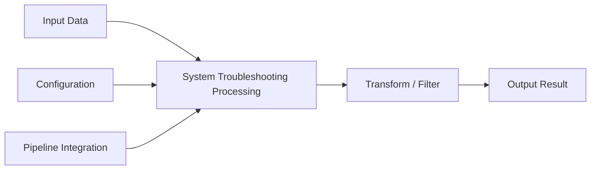

# System Troubleshooting — A 2-Day Crash Course

The debugging methodology, performance tools, and mental models that let you find the root cause of production issues in minutes instead of hours — USE method, strace, perf, bpftrace, and flame graphs.

**Prerequisite:** [`Linux.md`](./Linux.md)

---

## Part 0 — Why Methodology Beats Intuition

When production is down, you need a systematic approach. Random guessing wastes time and makes things worse. You restart a service, latency drops for thirty seconds, then climbs back. You add more instances, the problem spreads. You've changed two variables at once and now you don't know what fixed what — or whether anything is fixed at all.

The tools in this guide are not magic. A flame graph won't fix your code. What they give you is a way to ask precise questions and get precise answers, so that every action you take reduces uncertainty rather than adding to it.

The mental model underneath everything here: a computer is a collection of shared resources. Processes compete for CPU, memory, disk bandwidth, and network. Something is always the bottleneck. Your job is to find it before it finds your on-call rotation.

---

## Vocabulary

**USE Method** — For every hardware resource (CPU, memory, disk, network): check Utilization (how busy is it?), Saturation (how much work is queued?), and Errors (are there failures?). Created by Brendan Gregg.

**RED Method** — For every service: check Rate (requests per second), Errors (failed requests per second), and Duration (latency distribution). Better suited to microservices than USE.

**Flame Graph** — A visualization of stack traces sampled over time. Width represents time spent; you look for wide towers that indicate hot code paths. Created by Brendan Gregg.

**strace** — A Linux tool that intercepts and logs system calls made by a process. Tells you what a process is actually doing at the kernel boundary.

**perf** — A Linux kernel profiling tool. Samples CPU activity, hardware counters, and kernel events. The foundation of most Linux performance analysis.

**bpftrace** — A high-level tracing language built on BPF (Berkeley Packet Filter). Lets you instrument the kernel and user space dynamically without modifying binaries or rebooting.

**top / htop** — Real-time process viewers. `top` is always available. `htop` adds color, mouse support, and easier sorting.

**vmstat** — Virtual memory statistics. Shows CPU, memory, swap, and I/O in a single line every N seconds. Useful for catching swapping and scheduling pressure.

**iostat** — Block device I/O statistics. Part of the `sysstat` package. Shows throughput, IOPS, and utilization per device.

**sar** — System Activity Reporter. Records and replays historical performance data. Invaluable when the incident happened at 3am and you're investigating at 9am.

**dmesg** — Kernel ring buffer. Contains messages about hardware events, driver errors, OOM kills, filesystem errors, and network issues. Always check it early.

**OOM Killer** — The kernel mechanism that kills processes when physical memory is exhausted. It logs the victim and the reason to dmesg. Finding an OOM kill changes your entire diagnosis.

---




## Day 1 — Frameworks and First Response

### The USE Method in Practice

The USE method gives you a checklist for every resource. Run through it top to bottom before you start forming hypotheses.

For **CPU**:
- Utilization: `top`, `mpstat -P ALL 1`
- Saturation: load average (from `uptime`) relative to CPU count, run queue from `vmstat`
- Errors: `perf stat -a sleep 5` for hardware errors, `dmesg | grep -i mce` for machine check exceptions

For **memory**:
- Utilization: `free -h`, `cat /proc/meminfo`
- Saturation: `vmstat 1` — watch `si` (swap in) and `so` (swap out); any non-zero value is a problem
- Errors: `dmesg | grep -i 'memory\|oom\|edac'`

For **disk**:
- Utilization: `iostat -xz 1` — the `%util` column
- Saturation: `iostat -xz 1` — the `await` (average wait) and `aqu-sz` (queue depth) columns
- Errors: `dmesg | grep -iE 'error|fail|I/O'`

For **network**:
- Utilization: `sar -n DEV 1` or `ip -s link`
- Saturation: `ss -s` for socket overflows, `netstat -s | grep overflow`
- Errors: `ip -s link` — look at the error and drop counters

Work through each resource. When one of the checks returns something abnormal, you've found your suspect — then you dig deeper.

### The RED Method for Services

Once you've ruled out hardware-level resource exhaustion, switch to the RED method for your services. You need three numbers:

- **Rate**: how many requests per second is the service handling?
- **Errors**: what fraction are failing, and with what error code?
- **Duration**: what does the latency distribution look like — median, p95, p99?

If you have Prometheus and Grafana, these numbers live in dashboards. If you don't, you can approximate them from access logs with `awk`, or from application metrics endpoints.

A service can be CPU-bound, I/O-bound, lock-contended, or just misconfigured. RED tells you there's a problem. USE tells you where the resource pressure is. Between them, you can form a specific hypothesis.

### First 5 Minutes — The Checklist

When an alert fires and you're staring at a terminal, run these in order. Each one takes thirty seconds or less.

```bash
# 1. Is the machine alive and how loaded is it?
uptime

# 2. Who else is logged in, what are they doing?
w

# 3. Any recent error messages from the kernel?
dmesg -T | tail -50

# 4. What processes are consuming resources right now?
top -b -n 1 | head -30

# 5. Memory pressure?
free -h
vmstat 1 5

# 6. Disk I/O?
iostat -xz 1 5

# 7. Network errors?
ip -s link

# 8. Are the services you expect actually running?
systemctl list-units --state=failed
```

After these eight commands, you will have ruled out a class of problems or confirmed one. You are now forming a hypothesis, not guessing.

### CPU Troubleshooting

High CPU load can mean many things: a single process spinning in a tight loop, too many processes competing for time, the kernel spending cycles on interrupts, or a process blocked in kernel code.

**Step 1 — Find the process.**

```bash
# Sort by CPU, refresh once
top -b -n 1 | sort -k9 -rn | head -20

# Or with ps
ps aux --sort=-%cpu | head -20
```

**Step 2 — Find the function.**

Once you have a PID, `perf top` shows you which functions are consuming CPU right now:

```bash
perf top -p <PID>
```

The output is a live list of functions sorted by sample count. A function occupying 80% of samples is almost certainly your problem.

**Step 3 — Confirm with a flame graph.**

`perf top` gives you a list; a flame graph gives you the full call path, which is what you need to understand why the function is being called that often.

```bash
# Record 30 seconds of samples
perf record -F 99 -p <PID> -g -- sleep 30

# Generate the flame graph (requires Brendan Gregg's FlameGraph tools)
perf script | stackcollapse-perf.pl | flamegraph.pl > flamegraph.svg
```

Open the SVG in a browser. The widest towers are where your CPU time goes. A tower representing a regex engine called from a request handler is a different fix than a tower representing a lock acquisition inside the kernel.

### Memory Troubleshooting

Memory problems fall into three categories: the system is simply using too much RAM, something is leaking, or the OOM killer is running.

**Check total usage and available memory:**

```bash
free -h
# Buffers/cache are reclaimable — "available" is the number that matters
```

**Check for swapping:**

```bash
vmstat 1
# Watch si (swap in) and so (swap out)
# Any consistent non-zero value means you're short on real memory
```

**Check for OOM kills:**

```bash
dmesg -T | grep -i 'oom\|killed process'
```

If the OOM killer ran, you'll see a wall of output showing the process that was killed, its memory usage, and the state of every other process at the time. The victim is often not the cause — something else exhausted memory and the victim happened to be the largest allocator.

**Find per-process memory usage:**

```bash
# RSS (resident set) sorted by size
ps aux --sort=-%mem | head -20

# Smaps for a specific process (detailed breakdown)
cat /proc/<PID>/smaps | grep -i pss | awk '{sum += $2} END {print sum " kB"}'
```

**Check /proc/meminfo for the full picture:**

```bash
cat /proc/meminfo
# Key fields: MemTotal, MemFree, MemAvailable, SwapTotal, SwapFree,
#             Slab (kernel caches), Dirty (data not yet flushed to disk)
```

---

## Day 2 — Deep Diagnostics

### Disk I/O Troubleshooting

Disk is often the hidden bottleneck. A CPU-bound symptom can trace back to excessive logging. A memory shortage can cause swapping that makes disk the constraint.

**Start with iostat:**

```bash
iostat -xz 1
```

Key columns:
- `%util` — device utilization; above 80% is concerning, but SSDs can saturate before hitting 100%
- `await` — average wait time per request in milliseconds; above 10ms on an SSD is a red flag
- `aqu-sz` — average queue depth; a deep queue means requests are piling up
- `r/s`, `w/s` — reads and writes per second
- `rkB/s`, `wkB/s` — throughput

**Find the process doing the I/O:**

```bash
# Requires root
iotop -o -d 2
```

`iotop -o` shows only processes actively doing I/O. The `-d 2` refreshes every 2 seconds.

**Check for filesystem errors:**

```bash
dmesg -T | grep -iE 'ext4|xfs|btrfs|error|corrupt'
```

**Check disk latency directly with bpftrace:**

```bash
# Latency histogram for block I/O, requires root
bpftrace -e 'tracepoint:block:block_rq_complete { @usecs = hist(args->nr_sector); }'
```

### Network Troubleshooting

**Check socket state:**

```bash
# Summary of socket states
ss -s

# All listening TCP sockets
ss -tlnp

# Connections in TIME_WAIT (high count can indicate connection exhaustion)
ss -tan | awk '{print $1}' | sort | uniq -c | sort -rn
```

**Check for packet drops and errors:**

```bash
ip -s link
# Look at: RX errors, RX dropped, TX errors, TX dropped
```

**Check for retransmissions:**

```bash
netstat -s | grep -i retransmit
```

**Capture traffic for a specific port:**

```bash
tcpdump -i eth0 -nn port 8080 -w /tmp/capture.pcap
```

Then open the pcap in Wireshark, or analyze it directly:

```bash
tcpdump -r /tmp/capture.pcap -nn | head -50
```

**MTU issues** manifest as connections that work for small payloads but hang or fail for large ones. The classic symptom is an SSH session that connects fine but stalls when you try to run a command that produces output.

```bash
# Test with a specific payload size (adjust 1472 down if fragmented)
ping -M do -s 1472 <target-ip>

# Check current MTU
ip link show
```

### strace — What Is This Process Actually Doing?

`strace` intercepts every system call a process makes. It's noisy but invaluable when you need to know what a process is doing at the OS boundary — what files it's opening, what network connections it's making, where it's spending its time.

```bash
# Attach to a running process
strace -p <PID>

# Attach and count syscalls (less noise, more signal)
strace -c -p <PID>

# Trace a new process, follow child processes
strace -f command arg1 arg2

# Filter to file operations only
strace -e trace=file -p <PID>

# Filter to network operations only
strace -e trace=network -p <PID>

# Show timestamps (microseconds)
strace -T -tt -p <PID>
```

The summary mode (`-c`) is often the best starting point. It tells you which syscalls are consuming the most time before you wade through thousands of lines.

⚠️ `strace` adds overhead — up to 2–5x slowdown for syscall-heavy processes. Do not use it on a critical production service under load without understanding the impact.

### perf — CPU Profiling and Flame Graphs

`perf` is the Swiss Army knife of Linux performance analysis. You've already seen `perf top` and `perf record`. Here's the broader picture.

**System-wide CPU profile:**

```bash
perf record -F 99 -a -g -- sleep 30
perf report
```

**Count hardware events:**

```bash
perf stat -a sleep 5
# Shows: instructions, cycles, cache-misses, branch-misses, etc.
# A high cache-miss rate points to memory access patterns
```

**Profile a specific command from start to finish:**

```bash
perf stat ./my-program --args
```

**Generate a flame graph from perf data:**

```bash
# Assumes FlameGraph repo is cloned to ~/FlameGraph
git clone https://github.com/brendangregg/FlameGraph ~/FlameGraph

perf record -F 99 -p <PID> -g -- sleep 30
perf script > perf.out
~/FlameGraph/stackcollapse-perf.pl perf.out > perf.folded
~/FlameGraph/flamegraph.pl perf.folded > flamegraph.svg
```

Reading a flame graph: the x-axis is alphabetical, not time. Width represents the total CPU time consumed by that function and everything it calls. You're looking for wide plateaus at the top of towers — those are leaf functions consuming time directly.

### bpftrace — Dynamic Kernel Tracing

`bpftrace` lets you answer questions that no static tool can. You can trace any kernel function, any system call, any user-space function, and emit histograms, counts, or raw events.

**Count syscalls by process:**

```bash
bpftrace -e 'tracepoint:raw_syscalls:sys_enter { @[comm] = count(); }'
```

**Trace slow file opens:**

```bash
bpftrace -e 'tracepoint:syscalls:sys_enter_openat { @start[tid] = nsecs; }
tracepoint:syscalls:sys_exit_openat /(@start[tid]) && (nsecs - @start[tid]) > 1000000/ {
  printf("slow open: %s %d us\n", comm, (nsecs - @start[tid]) / 1000);
  delete(@start[tid]);
}'
```

**Profile on-CPU user stacks:**

```bash
bpftrace -e 'profile:hz:99 /pid == <PID>/ { @[ustack] = count(); }'
```

`bpftrace` has low overhead — it compiles your script to BPF bytecode and runs it in the kernel. You can run it safely on production systems in most cases.

### Memory Leaks

A memory leak is a process that allocates memory and never frees it. Over hours or days, its RSS grows until the OOM killer fires.

**Confirm the leak:**

```bash
# Watch RSS over time
while true; do
  ps -o pid,rss,comm -p <PID>
  sleep 60
done
```

If RSS grows monotonically and never shrinks, you have a leak.

**Find what's leaking with valgrind (for a reproducer, not on production):**

```bash
valgrind --leak-check=full --show-leak-kinds=all ./my-program
```

**Use bpftrace to trace allocations in production:**

```bash
# Count allocation sites (requires debug symbols)
bpftrace -e 'uprobe:/path/to/binary:malloc { @[ustack] = count(); }'
```

### The Scientific Method for Debugging

Every good debugging session follows this loop:

1. **Observe** — what are the symptoms? Latency, error rate, resource exhaustion?
2. **Hypothesize** — what single change could explain what you're seeing?
3. **Predict** — if your hypothesis is correct, what else should be true?
4. **Test** — check the prediction with a tool or experiment.
5. **Conclude** — was the prediction correct? If yes, you've found the cause. If no, discard the hypothesis and form a new one.

Never test two hypotheses at once. Never make two changes at once. You'll lose track of causality and waste more time than the methodical approach would have cost.

When you're wrong — and you will be wrong — that's still progress. A ruled-out hypothesis narrows the space.

### Post-Incident Analysis

After the incident is resolved, you have a window of 24–48 hours when the details are fresh. Use it.

Write down:
- The timeline: when did the incident start, when was it detected, when was each action taken, when was it resolved?
- The root cause: not "disk was full" but "log rotation was disabled after the configuration migration on April 14"
- The contributing factors: what made this harder to detect or fix?
- The remediation: what did you do to resolve it?
- The follow-up: what systemic changes will prevent recurrence?

The goal is not to assign blame. It's to make your system and your team better. See `Postmortems-RCA.md` for the full process.

---

## Worked Example — Debugging a Slow API

**Symptom:** The `/search` endpoint has spiked from 50ms p99 to 4 seconds p99. CPU on the API servers is at 95%.

**Step 1 — Confirm and measure.**

```bash
top -b -n 1 | head -20
```

The API process is consuming 380% of CPU (all four cores). This is CPU-bound, not I/O-bound.

**Step 2 — Find the hot function.**

```bash
perf top -p $(pgrep -f api-server)
```

`re2::RE2::Match` appears in the top entry, consuming 78% of samples. A regex function.

**Step 3 — Get the full call path.**

```bash
perf record -F 99 -p $(pgrep -f api-server) -g -- sleep 30
perf script | ~/FlameGraph/stackcollapse-perf.pl | ~/FlameGraph/flamegraph.pl > /tmp/flame.svg
```

The flame graph shows: `http_handler` → `SearchService.search` → `filter_results` → `re2::RE2::Match`. The regex is being called inside a loop over search results.

**Step 4 — Find the code.**

You search for `filter_results` in the codebase and find a function that compiles a new `Regex` object from the user's query string on every iteration of the loop, inside the result set.

```python
# Before — compiles regex once per result
for result in results:
    if re.match(query_pattern, result.title):
        filtered.append(result)

# After — compile once, reuse
compiled = re.compile(query_pattern)
for result in results:
    if compiled.match(result.title):
        filtered.append(result)
```

**Step 5 — Verify the fix.**

Deploy to one host. Watch `perf top`. CPU drops to 12%. p99 latency returns to 48ms. Roll out to all hosts.

Root cause: regex compilation is expensive — O(n) where n is pattern length — and compiling inside a tight loop multiplies that cost by the result set size.

---

## Pitfalls

**Watching the wrong metric.** High CPU utilization looks like a CPU problem. But if the CPU is 90% in `iowait`, the bottleneck is disk. Always check `%iowait` in `top` or `mpstat`.

**Treating load average as CPU utilization.** Load average includes processes waiting for I/O, not just processes running. A load of 8 on a 4-core machine could mean 4 busy CPUs and 4 processes waiting on disk.

**Assuming the first anomaly you find is the root cause.** The OOM killer fires and kills your service. You add more RAM. The service keeps OOM-killing. The root cause was a memory leak — adding RAM just delayed the kill. Find why, not just what.

**Running strace on a busy process.** The overhead is real. On a process handling 50,000 requests per second, attaching strace can push latency high enough to cause cascading failures. Use `perf` or `bpftrace` instead for production profiling.

**Changing multiple things at once.** It feels faster. It's not. You lose the ability to attribute cause and effect, and rollback becomes harder.

**Confusing correlation with causation.** Two metrics moving together at the same time does not mean one caused the other. A deploy happened at the same time as a traffic spike. The traffic spike caused the incident. Check deployment times against your metrics, but don't stop there.

**Skipping dmesg.** Hardware errors, OOM kills, and filesystem corruption all land in dmesg. It takes ten seconds to check it. Check it early.

---

## Quick Reference

### USE Method Checklist

| Resource | Utilization | Saturation | Errors |
|----------|-------------|------------|--------|
| CPU | `top`, `mpstat -P ALL 1` | `uptime` (load avg), `vmstat` (r column) | `perf stat`, `dmesg \| grep mce` |
| Memory | `free -h`, `/proc/meminfo` | `vmstat` (si/so columns) | `dmesg \| grep oom` |
| Disk | `iostat -xz 1` (%util) | `iostat -xz 1` (await, aqu-sz) | `dmesg \| grep -iE 'error\|fail'` |
| Network | `sar -n DEV 1` | `ss -s`, `netstat -s \| grep overflow` | `ip -s link` |

### Tool Selection Matrix

| Symptom | Start Here | Go Deeper |
|---------|------------|-----------|
| High CPU | `top`, `mpstat` | `perf top`, flame graph |
| Memory pressure | `free`, `vmstat` | `/proc/meminfo`, `smaps` |
| Disk latency | `iostat` | `iotop`, bpftrace block tracepoints |
| Network drops | `ip -s link`, `ss` | `netstat -s`, `tcpdump` |
| Mysterious process behavior | `strace -c -p PID` | `strace -T -tt -p PID` |
| Finding hot code paths | `perf top` | flame graph |
| Memory leak | watch `ps` RSS | `valgrind`, `bpftrace uprobe:malloc` |

### Essential One-Liners

```bash
# First-response snapshot
uptime && free -h && iostat -xz 1 1 && ss -s

# Top 10 processes by CPU
ps aux --sort=-%cpu | head -11

# Top 10 processes by memory
ps aux --sort=-%mem | head -11

# All failed systemd units
systemctl list-units --state=failed

# Last 50 kernel messages with timestamps
dmesg -T | tail -50

# OOM kills in the last boot
dmesg -T | grep -i 'oom\|killed process'

# Disk I/O by process (requires root)
iotop -o -b -n 5 -d 2

# TCP connections by state
ss -tan | awk 'NR>1 {print $1}' | sort | uniq -c | sort -rn

# Syscall summary for a PID
strace -c -p <PID> -e trace=all -- sleep 10

# CPU flame graph (30 second sample)
perf record -F 99 -p <PID> -g -- sleep 30 && \
  perf script | stackcollapse-perf.pl | flamegraph.pl > /tmp/flame.svg

# Count syscalls by process (bpftrace, root required)
bpftrace -e 'tracepoint:raw_syscalls:sys_enter { @[comm] = count(); }' -- sleep 10

# File open latency (bpftrace, root required)
bpftrace -e 'tracepoint:syscalls:sys_enter_openat { @start[tid] = nsecs; }
tracepoint:syscalls:sys_exit_openat /(@start[tid])/ {
  @usec = hist((nsecs - @start[tid]) / 1000); delete(@start[tid]); }'
```

---


## Top 10 Interview Questions

<details>
<summary><strong>Q: What is System Troubleshooting and what problem does it solve?</strong></summary>

System Troubleshooting addresses a specific need in modern engineering workflows. Understanding the core problem it solves — and the alternatives it replaced — is the foundation for every subsequent interview question. Frame your answer around the pain point first, then the solution.

</details>

<details>
<summary><strong>Q: How does System Troubleshooting compare to its main alternatives?</strong></summary>

Every tool exists in an ecosystem of alternatives. Be prepared to articulate the specific tradeoffs: when System Troubleshooting is the right choice, when an alternative is better, and what factors drive the decision (scale, team expertise, existing infrastructure, compliance requirements).

</details>

<details>
<summary><strong>Q: What are the most common production pitfalls with System Troubleshooting?</strong></summary>

Production experience is what separates senior from junior engineers. Common pitfalls include: misconfiguration that works in dev but fails at scale, security oversights, inadequate monitoring, and operational procedures that are untested until an incident occurs. Cite specific examples from your experience.

</details>

<details>
<summary><strong>Q: How do you monitor and observe System Troubleshooting in production?</strong></summary>

Key metrics to track, alerting thresholds to set, dashboards to build, and log patterns to watch. Production monitoring should cover: health/liveness, performance (latency, throughput), capacity (resource utilisation), and business impact (error rates affecting users). Explain which metrics are leading indicators versus lagging.

</details>

<details>
<summary><strong>Q: How do you scale System Troubleshooting as load increases?</strong></summary>

Scaling strategies depend on the bottleneck: horizontal scaling (add more instances), vertical scaling (bigger instances), caching (reduce load), sharding (distribute data), and async processing (decouple components). Explain which approach applies to System Troubleshooting and at what scale each strategy becomes necessary.

</details>

<details>
<summary><strong>Q: How do you handle security and access control with System Troubleshooting?</strong></summary>

Security is non-negotiable in production. Cover: authentication and authorization mechanisms, secrets management (never in code), encryption (at rest and in transit), network security (firewalls, private networks), audit logging, and compliance requirements relevant to your industry.

</details>

<details>
<summary><strong>Q: How do you implement disaster recovery for System Troubleshooting?</strong></summary>

DR planning requires defining RTO (recovery time objective) and RPO (recovery point objective), implementing backup strategies, testing restore procedures, and documenting runbooks. Explain your backup strategy, how you test restores, and what your recovery procedure looks like.

</details>

<details>
<summary><strong>Q: How do you automate System Troubleshooting deployment and configuration management?</strong></summary>

Infrastructure as code, CI/CD pipelines, configuration management, and GitOps workflows. Explain how you version, test, deploy, and roll back changes. Cover: what is automated, what requires manual approval, and how you handle configuration drift.

</details>

<details>
<summary><strong>Q: How do you troubleshoot issues with System Troubleshooting in production?</strong></summary>

A systematic debugging approach: check health endpoints, review recent changes (deploys, config changes), examine logs and metrics, reproduce the issue, identify root cause, fix, verify, and write a postmortem. Explain your actual debugging workflow with concrete examples.

</details>

<details>
<summary><strong>Q: What are the best practices for System Troubleshooting that you have learned from experience?</strong></summary>

Best practices that go beyond documentation: lessons learned from production incidents, configuration patterns that prevent common issues, testing strategies that catch bugs before production, and operational procedures that reduce toil. Share specific examples where following (or not following) a best practice had measurable impact.

</details>

---


## Terminal Demo

```terminal-demo
# sre@incident ~ %

$ echo "Step 1: Check system load"
$ uptime
 10:15:32 up 90 days, load average: 8.45, 6.23, 3.12

$ echo "Step 2: Identify CPU hogs"
$ ps aux --sort=-%cpu | head -4
USER     PID  %CPU %MEM COMMAND
app      1234 89.2  3.2 node /app/api/server.js
postgres 5678 12.1  5.6 postgres: autovacuum worker

$ echo "Step 3: Check memory"
$ free -h
              total   used   free   available
Mem:          15Gi    14.2Gi 200Mi  800Mi

$ echo "Step 4: Check disk I/O"
$ iostat -xz 1 1 | tail -3
Device  r/s     w/s   rkB/s   wkB/s  %util
xvda    12.34   45.67 234.5   890.1  78.9
xvdf    2.34    123.4  45.6  4567.8  92.3

$ echo "Step 5: Check for OOM kills"
$ dmesg | grep -i "oom\|killed" | tail -2
[4567890.123] Out of memory: Killed process 9012 (java)
[4567891.456] oom_reaper: reaped process 9012 (java)

$ echo "Root cause: Java process OOM -> memory pressure -> API latency spike"
```

---

## Quick Quiz

Test your understanding with these rapid-fire questions (answers hidden):

<details>
<summary>1. What is the ONE core problem that System Troubleshooting solves?</summary>
Re-read Part 0 — the mental model section. If you can explain the "why" in one sentence, you understand the foundation.
</details>

<details>
<summary>2. Name the 3 most important terms from the vocabulary section.</summary>
Review Part 1. These are the building blocks every conversation about System Troubleshooting uses.
</details>

<details>
<summary>3. What is the first thing you would set up on Day 1?</summary>
Check the Day 1 section — the very first hands-on step that gets you a working result.
</details>

<details>
<summary>4. What is the most common production pitfall with System Troubleshooting?</summary>
Review the Common Pitfalls section. The first item listed is typically the most frequently encountered.
</details>

<details>
<summary>5. How does System Troubleshooting compare to its closest alternative?</summary>
Check the Comparison Matrix below — focus on the key differentiating row.
</details>


## Comparison Matrix

| Dimension | Linux Tools | APM Tools | Cloud Monitoring |
|-----------|-------------|-----------|------------------|
| **Primary use case** | Core strength of Linux Tools | Core strength of APM Tools | Core strength of Cloud Monitoring |
| **Learning curve** | Moderate | Varies | Varies |
| **Community/ecosystem** | Active | Active | Growing |
| **Operational complexity** | Medium | Varies | Varies |
| **Best for** | See Part 0 | Different tradeoffs | Different tradeoffs |

> **How to read this matrix:** no tool wins on every dimension. Pick based on your specific constraints — team expertise, existing infrastructure, scale requirements, and compliance needs. The right choice is the one that fits your context, not the one with the most checkmarks.

## Next Steps

- [`Linux.md`](./Linux.md) — core Linux fundamentals this guide builds on
- [`Prometheus.md`](../observability/Prometheus.md) — instrument your services so you have USE and RED metrics in dashboards before incidents happen
- [`Incident-Response.md`](../processes/Incident-Response.md) — the human and process side of running an incident
- [`SRE-Process.md`](../processes/SRE-Process.md) — how to build systems that are observable and resilient by design

---

## Recommended learning resources

**YouTube channels & playlists:**
- [Brendan Gregg — Performance Analysis and BPF](https://www.youtube.com/@brendangregg) — the definitive source on Linux performance methodology, flame graphs, and eBPF tracing
- [LearnLinuxTV — Linux Troubleshooting](https://www.youtube.com/@LearnLinuxTV) — structured walkthroughs of diagnosing CPU, memory, disk, and network issues
- [NetworkChuck — Linux Debugging](https://www.youtube.com/@NetworkChuck) — beginner-friendly approach to reading logs, checking processes, and fixing common problems
- [The Urban Penguin — Linux Performance Tuning](https://www.youtube.com/@TheUrbanPenguin) — detailed tutorials on strace, lsof, sar, and kernel-level diagnostics
- [Fireship — Linux Process Management](https://www.youtube.com/@Fireship) — quick explainers on processes, signals, and the tools that inspect them

**Official docs & blogs:**
- [Brendan Gregg's Blog and USE Method](https://www.brendangregg.com/usemethod.html) — the USE method checklist, Linux performance tools map, and flame graph methodology
- [Julia Evans — Debugging and Profiling Zines](https://jvns.ca/) — visual, practical guides to strace, perf, and thinking about Linux internals
- [Linux Performance (brendangregg.com/linuxperf.html)](https://www.brendangregg.com/linuxperf.html) — the comprehensive Linux performance tools diagram and tool-by-tool reference

---

## The Mantra

**Measure, don't guess. One variable at a time. Rule out before you rule in.**

The engineer who reaches for a flame graph in the first five minutes is not showing off — they're following a method. The method is fast because it eliminates entire classes of problems with a single command. Build the habit of running through USE before you form a hypothesis. Get comfortable with `perf` before you need it. Know where to look in `dmesg` before the alert fires.

Production incidents are not won with heroics. They're won with preparation — knowing your tools, knowing your system's normal behavior, and having the discipline to stay methodical when everything is on fire.

The tools are here. The method is here. The rest is practice.
