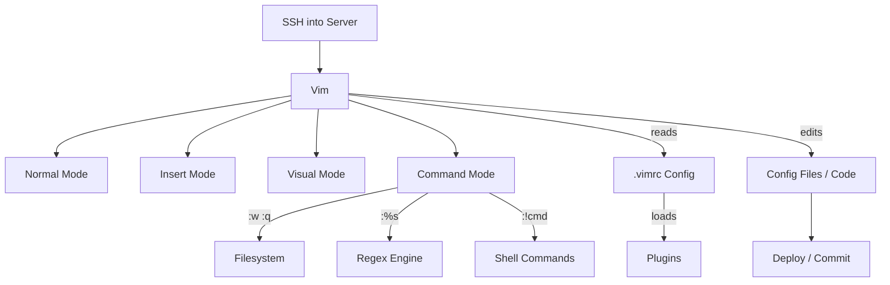

# Vim — A 2-Day Crash Course

> **In one sentence:** Vim is a modal text editor built for editing text at the speed of thought — available on every Unix-like system — so knowing it means you can edit anything, anywhere, without a GUI. Prerequisite: basic terminal comfort — see `Linux.md`.

---

## Part 0 — Why Vim exists

You SSH into a remote server at 2 AM. There is no VS Code, no GUI, no file manager. There is `/bin/vi`. This is the reality that created Vim.

Vim's ancestor, `vi`, shipped with Unix in 1976. Every Linux server, every macOS machine, every container image that ships a text editor ships some form of `vi`. Vim (Vi IMproved) extended it. Neovim extended Vim. But the core model has not changed in 50 years — because it is correct.

The second reason is speed. A mouse is a context switch. Reaching for it breaks flow. Vim keeps both hands on the keyboard and makes the keyboard do everything: navigate, select, delete, substitute, repeat.

The third reason is composability. Vim commands are a small grammar — nouns, verbs, counts — and you combine them rather than memorize every case. Once you internalize that grammar, editing becomes something closer to expressing intent than typing.

### Modal editing

Most editors have one mode: you type and characters appear. Vim has modes. In **Normal mode**, keystrokes are commands, not input. In **Insert mode**, keystrokes produce text. This feels wrong for about two days and then feels obviously right forever.

The insight is that you spend far more time reading and navigating text than you spend typing new characters. Normal mode is optimized for the common case.

**Mental model:** Your keyboard is an instrument — Normal mode is the instrument's full range; Insert mode is just one note.



---

## Part 1 — The vocabulary

| Term | What it means |
|------|---------------|
| **Normal mode** | Default mode — keystrokes are commands, not text input |
| **Insert mode** | Text-entry mode — what you type appears in the buffer |
| **Visual mode** | Selection mode — highlight text to operate on it |
| **Command mode** | Ex command line, entered with `:` — for file operations, substitutions, settings |
| **Buffer** | An in-memory copy of a file (or unnamed scratch space) |
| **Register** | A named clipboard slot — Vim has 26 named registers plus system registers |
| **Motion** | A command that moves the cursor: `w`, `b`, `gg`, `$`, etc. |
| **Operator** | A command that acts on text: `d` (delete), `c` (change), `y` (yank/copy), `=` (indent) |
| **Text object** | A structured chunk of text — word, sentence, paragraph, block between `()` or `{}` |

Operators and motions compose: `d` + `w` = delete a word. `c` + `i` + `{` = change everything inside braces. This grammar is the core of Vim.

---

## DAY 1 — Survive and edit

### 1.1 Opening a file

```bash
vim filename.txt       # open or create a file
vim +42 filename.txt   # open and jump to line 42
vim +/pattern file     # open and jump to first match of pattern
```

When Vim opens, you are in **Normal mode**. Nothing you type goes into the file yet.

### 1.2 Understanding modes in practice

You move between modes deliberately:

| From | To | Key |
|------|----|-----|
| Normal | Insert | `i`, `a`, `o`, `I`, `A`, `O` |
| Normal | Visual | `v`, `V`, `Ctrl-v` |
| Normal | Command | `:` |
| Insert | Normal | `Esc` or `Ctrl-[` |
| Visual | Normal | `Esc` |
| Command | Normal | `Esc` or `Enter` (executes the command) |

The status bar at the bottom tells you which mode you are in. `-- INSERT --` means Insert mode. Blank means Normal mode.

⚠️ The single most common beginner mistake: typing text while in Normal mode and watching the cursor jump around. When in doubt, press `Esc` until the status line is blank, then navigate.

### 1.3 Basic navigation in Normal mode

Forget the arrow keys for now. They work, but they require moving your right hand.

**Character movement**

```
h   left
j   down
k   up
l   right
```

Count prefixes work everywhere: `5j` moves down 5 lines. `12l` moves right 12 characters.

**Word movement**

```
w   forward to start of next word
b   backward to start of previous word
e   forward to end of current/next word
W   same as w, but Words separated by whitespace only
B   same as b, but Words separated by whitespace only
```

**Line movement**

```
0   start of line (column 0)
^   first non-blank character of line
$   end of line
```

**File movement**

```
gg      go to first line of file
G       go to last line of file
42G     go to line 42
Ctrl-d  scroll down half a screen
Ctrl-u  scroll up half a screen
Ctrl-f  scroll forward (down) a full screen
Ctrl-b  scroll backward (up) a full screen
```

**Screen positioning**

```
H   move cursor to top of screen (High)
M   move cursor to middle of screen (Middle)
L   move cursor to bottom of screen (Low)
zz  redraw screen with cursor line centered
```

### 1.4 Inserting text

Each of these drops you into Insert mode at a different position:

```
i   Insert before the cursor
a   Append after the cursor
I   Insert at the start of the line (first non-blank)
A   Append at the end of the line
o   Open a new line below and enter Insert mode
O   Open a new line above and enter Insert mode
```

Type your text, then press `Esc` to return to Normal mode. Get into the habit of returning to Normal mode the moment you stop typing.

### 1.5 Saving and quitting

These are Command mode operations. Press `:` from Normal mode, then type the command.

```
:w          write (save) the file
:q          quit (fails if unsaved changes exist)
:wq         write and quit
:x          write and quit (only writes if changes exist — slightly cleaner than :wq)
:q!         quit without saving — discard changes
:w filename write to a different filename (saves a copy)
```

You will also see `ZZ` (Normal mode shortcut for `:wq`) and `ZQ` (shortcut for `:q!`).

### 1.6 Undo and redo

```
u       undo last change
Ctrl-r  redo (undo the undo)
U       undo all changes on the current line (less useful)
```

Vim's undo history is a tree, not a linear stack. For now, treat it as linear — `u` goes back, `Ctrl-r` goes forward.

### 1.7 Searching

```
/pattern    search forward for pattern
?pattern    search backward for pattern
n           next match (same direction)
N           previous match (opposite direction)
*           search forward for word under cursor
#           search backward for word under cursor
```

Patterns are regular expressions. `/foo` finds literal `foo`. `/fo*` finds `f` followed by zero or more `o`s. See `Bash.md` for a regex refresher — the same ERE syntax applies.

To clear search highlighting after a search:

```
:noh
```

### 1.8 Copy, cut, and paste

In Vim, "copy" is called **yank**, "cut" is **delete** (the deleted text goes into a register), and "paste" is **put**.

```
yy      yank (copy) the current line
3yy     yank 3 lines
dd      delete (cut) the current line
3dd     delete 3 lines
p       put (paste) after the cursor / below the current line
P       put before the cursor / above the current line
```

Yanked and deleted text lands in the default register (`"`). You can access it with `p` until the next yank or delete overwrites it.

**Named registers** persist across operations. `"ayy` yanks into register `a`. `"ap` pastes from register `a`. Useful when you are moving multiple chunks of text simultaneously.

**The system clipboard** uses register `+` on most systems:

```
"+yy    yank current line to system clipboard
"+p     paste from system clipboard
```

---

### By end of Day 1 you can:

- Open a file, enter text, save it, and quit without panicking
- Navigate a file entirely from the keyboard
- Search for text and jump between matches
- Copy and paste lines
- Undo mistakes

That is enough to be functional. Day 2 makes you fast.

---

## DAY 2 — Edit at the speed of thought

### 2.1 Operators, motions, and text objects

This is the grammar that separates Vim users from fast Vim users.

**Syntax:** `[count] operator [count] motion`

```
d   delete
c   change (delete + enter Insert mode)
y   yank (copy)
=   auto-indent
>   indent right
<   indent left
```

Combine with motions:

```
dw      delete from cursor to start of next word
d$      delete from cursor to end of line
d0      delete from cursor to start of line
d/foo   delete from cursor to first match of "foo"
yG      yank from current line to end of file
c$      change from cursor to end of line (same as C)
```

**Text objects** are the real power:

```
iw  inner word (the word the cursor is on)
aw  a word (includes trailing space)
is  inner sentence
ip  inner paragraph
i"  inner double-quoted string
a"  a double-quoted string (includes the quotes)
i'  inner single-quoted string
i)  inner parentheses
a)  a parentheses block (includes the parens)
i]  inner square brackets
i}  inner curly braces
it  inner HTML/XML tag
at  a tag block (includes the tags)
```

Examples:

```
ciw     change inner word — delete word under cursor, enter Insert
di"     delete everything inside double quotes
ya)     yank everything inside and including parentheses
=ip     auto-indent the current paragraph
```

You do not need to position the cursor at the start of the word or string. These are object-aware — Vim finds the boundaries for you.

### 2.2 Visual mode

Visual mode lets you select a region and apply an operator to it.

```
v       character-wise visual mode
V       line-wise visual mode
Ctrl-v  block-wise visual mode (column selection)
```

Once in visual mode, navigate to extend the selection, then apply an operator:

```
v3wc            visually select 3 words, then change them
Vjd             select current and next line, delete both
Ctrl-v 3j I#    block-insert # at the start of 4 lines (comment them out)
```

Block visual mode (`Ctrl-v`) is useful for editing aligned columns — adding a prefix to multiple lines simultaneously, for example.

### 2.3 The dot command — your most powerful key

`.` repeats the last change. This is deceptively powerful.

Workflow: make a change once, navigate to the next occurrence, press `.`.

```
ciw new_value Esc   change the word under cursor to "new_value"
n                   jump to next occurrence
.                   repeat the change
```

Combine with `n` + `.` to do targeted replacements without a global substitution.

### 2.4 Search and replace

Command mode substitution uses sed-like syntax:

```
:s/old/new/         replace first occurrence on current line
:s/old/new/g        replace all occurrences on current line
:%s/old/new/g       replace all occurrences in the file
:%s/old/new/gc      replace all occurrences, confirm each
:10,20s/old/new/g   replace in lines 10–20
```

Flags: `g` = global (all per line), `c` = confirm each, `i` = case-insensitive.

Use a different delimiter to avoid escaping slashes:

```
:%s|http://|https://|g
```

### 2.5 Macros

A macro records a sequence of keystrokes and replays them.

```
qa      start recording into register a
[do your edits]
q       stop recording
@a      replay macro stored in register a
@@      replay the last replayed macro
10@a    replay macro a 10 times
```

Make your macro position-independent by using motions like `^`, `$`, `w`, `b` rather than fixed `h`/`l` counts. If a macro goes wrong midway through a bulk run, press `Ctrl-c` to stop, then `u` to undo.

### 2.6 Marks

Marks let you bookmark positions and jump back.

```
ma      set mark a at current cursor position
`a      jump to exact position of mark a (line and column)
'a      jump to start of line containing mark a
``      jump to position before last jump
'.      jump to position of last change
```

Lowercase marks (`a`–`z`) are local to a buffer. Uppercase marks (`A`–`Z`) are global — they persist across files and sessions.

### 2.7 Splits and tabs

**Splits**

```
:sp filename        horizontal split, open filename
:vsp filename       vertical split, open filename
Ctrl-w h/j/k/l      move between splits
Ctrl-w =            equalize split sizes
Ctrl-w +/-          resize height
Ctrl-w >/<          resize width
:close              close current split
```

**Tabs**

```
:tabnew filename    open file in a new tab
gt                  next tab
gT                  previous tab
:tabclose           close current tab
```

See `tmux.md` for a complementary approach — many engineers prefer tmux panes over Vim splits for shell/editor separation.

### 2.8 Buffers

When you open multiple files, each lives in a buffer.

```
:e filename     open a file into a new buffer
:ls             list open buffers
:b 2            switch to buffer 2
:b filename     switch to buffer by name (tab completion works)
:bd             close current buffer
:bn / :bp       next / previous buffer
```

### 2.9 The .vimrc

Vim reads `~/.vimrc` on startup. Start minimal:

```vim
set nocompatible
set encoding=utf-8
set backspace=indent,eol,start

" Display
set number
set relativenumber
set cursorline
set laststatus=2

" Search
set incsearch
set hlsearch
set ignorecase
set smartcase

" Indentation
set tabstop=4
set shiftwidth=4
set expandtab
set smartindent

" Usability
set wildmenu
set scrolloff=8
set hidden

" Leader key
let mapleader = ","

" Clear search highlight
nnoremap <silent> <Leader><space> :noh<CR>

" Escape shortcut in Insert mode
inoremap jk <Esc>
```

`<Leader>` is a configurable prefix key for custom mappings. The default is `\` but `,` or `<Space>` are popular choices.

### 2.10 Plugins — the minimal set

**Plugin manager** — vim-plug is the standard starting point:

```vim
call plug#begin('~/.vim/plugged')
Plug 'tpope/vim-surround'     " cs"' to change surrounding quotes
Plug 'tpope/vim-commentary'   " gcc to toggle comment on a line
Plug 'tpope/vim-repeat'       " makes . work with plugin actions
Plug 'junegunn/fzf.vim'       " fuzzy file/content search
Plug 'airblade/vim-gitgutter' " git diff in the gutter
call plug#end()
```

Run `:PlugInstall` after saving.

`vim-surround` extends the grammar naturally: `cs"'` changes surrounding `"` to `'`; `ds(` deletes surrounding parentheses; `ysiw]` wraps the current word in `[]`.

`vim-commentary` gives you `gc` as a comment operator. `gcc` comments the current line. `gc3j` comments 4 lines. Filetype-aware.

---

## Worked example — Refactoring a config file

You have an Nginx config where you need to:
1. Change all `http://` to `https://` across the file
2. Rename `api.old.com` to `api.new.com` with confirmation
3. Add `gzip on;` after each `server {` line using a macro
4. Comment out all `access_log off;` lines in one command

**Step 1 — Global substitution:**

```
:%s|http://|https://|g
```

**Step 2 — Targeted rename with confirmation:**

```
:%s/api\.old\.com/api.new.com/gc
```

The `c` flag prompts for confirmation on each match — use it when you are not certain the pattern is unique.

**Step 3 — Macro to insert a line after a pattern:**

Search for the pattern: `/server {`

With the cursor on that line, record a macro:

```
qa     start recording
$      go to end of line
o      open new line below, enter Insert
gzip on;
Esc    return to Normal
n      jump to next match
q      stop recording
```

Replay: `99@a` — Vim stops automatically when no more matches remain.

**Step 4 — Bulk comment with ex global:**

```
:g/access_log off;/normal I#
```

`:g` runs a Normal mode command on every matching line. `I# ` enters Insert at line start and types `# `. This single command handles every matching line in one shot.

**Step 5 — Save safely:**

```
:w backup.conf
:wq
```

This entire workflow — two substitutions, one macro, one ex-global — takes under two minutes. The equivalent mouse-driven edit takes five and leaves more room for error.

---

## Common pitfalls

- **Stuck in Insert mode.** If keystrokes produce characters instead of moving the cursor, press `Esc`. Press it twice if needed.

- **Accidentally entering Replace mode.** `R` starts Replace mode — characters overwrite as you type. Press `Esc` and undo with `u`.

- **Swap file warnings.** Vim creates `.filename.swp` during editing. If Vim crashed previously, press `R` to recover, `:w` to save, then delete the swap file with `:!rm .%.swp`.

- **Read-only files.** `:w` fails if you lack write permission. Use `:w !sudo tee %` to write via sudo without leaving Vim.

- **Macro mid-run disaster.** Press `Ctrl-c` to stop a running macro. Undo with repeated `u`.

- **Substitution scope errors.** `:s/old/new` replaces only the first match on the current line. Forgetting `%` (whole file) or `g` (all per line) is the most common substitution mistake.

- **Staircase paste.** Pasting external code can trigger autoindent, producing cascading indentation. Run `:set paste` before pasting, `:set nopaste` after.

- **Buffers vs windows.** `:q` closes a window, not a buffer. Use `:ls` to see open buffers, `:bd` to remove one.

---

## Quick command reference

### Navigation

```
h j k l         character left / down / up / right
w b e           word forward / backward / end
W B E           WORD (whitespace-delimited) versions
0 ^ $           line start / first non-blank / line end
gg G            file start / file end
42G             go to line 42
Ctrl-d Ctrl-u   half-page down / up
Ctrl-f Ctrl-b   full-page down / up
H M L           screen top / middle / bottom
{ }             paragraph boundary up / down
%               jump to matching bracket
```

### Editing

```
i a o           insert before / append after / new line below
I A O           insert line-start / append line-end / new line above
x X             delete char under / before cursor
r               replace single character
s S             substitute char / line
d{motion}       delete
c{motion}       change (delete + Insert)
y{motion}       yank (copy)
p P             paste after / before
u Ctrl-r        undo / redo
.               repeat last change
J               join lines
>> <<           indent / unindent
={motion}       auto-indent
```

### Search and replace

```
/pattern        search forward
?pattern        search backward
n N             next / previous match
* #             search word under cursor forward / backward
:noh            clear search highlight
:%s/old/new/g   replace all in file
:%s/old/new/gc  replace all with confirmation
:g/pattern/cmd  run ex command on all matching lines
```

### File operations

```
:e filename     open file
:w              save
:w filename     save as
:q :wq :q!      quit / save+quit / force quit
:ls             list buffers
:b N            switch to buffer N
:bd             close buffer
:sp :vsp        horizontal / vertical split
:tabnew f       open in new tab
gt gT           next / previous tab
```

### Window management

```
Ctrl-w h/j/k/l  move between splits
Ctrl-w =        equalize split sizes
Ctrl-w +/-      resize height
Ctrl-w >/<      resize width
Ctrl-w q        close split
```

### Useful ex commands

```
:set number / relativenumber   line numbers
:set paste / nopaste           toggle paste mode
:!command                      run shell command
:r !command                    insert command output at cursor
:%!command                     pipe buffer through shell command
:sort                          sort lines
:sort u                        sort and deduplicate
:help topic                    built-in help
```

---

## Top 10 Interview Questions

<details>
<summary><strong>Q: What are Vim's modes and why does modal editing matter?</strong></summary>

Vim has Normal, Insert, Visual, and Command modes. Normal mode treats keystrokes as commands rather than text input. This matters because you spend far more time navigating and editing than typing new characters — modal editing optimises for the common case. On a remote server at 2 AM with no GUI, this design lets you work at full speed.

</details>

<details>
<summary><strong>Q: Explain the operator-motion-object grammar with an example.</strong></summary>

Vim commands compose like a language: `d` (delete) + `i` (inner) + `w` (word) = `diw`, which deletes the word under the cursor. `ci"` changes everything inside double quotes. You learn a small set of operators (`d`, `c`, `y`) and motions (`w`, `$`, `gg`), and they combine into hundreds of precise edits without memorising each one individually.

</details>

<details>
<summary><strong>Q: How do you do a global find-and-replace across an entire file?</strong></summary>

`:%s/old/new/g` — the `%` means the whole file, `s` is substitute, and `g` replaces all occurrences per line, not just the first. Add `c` for confirmation on each match (`:%s/old/new/gc`). For paths or URLs containing slashes, use an alternate delimiter like `:%s|http://|https://|g`.

</details>

<details>
<summary><strong>Q: What is the dot command and how does it improve efficiency?</strong></summary>

`.` repeats the last change. The workflow is: make an edit once (e.g., `ciw new_value Esc`), move to the next occurrence with `n`, press `.` to repeat. This is faster than a global substitution when you need to review each change, and it composes with any operator-motion combination.

</details>

<details>
<summary><strong>Q: How would you edit a file on a server where you opened it without sudo but need root to save?</strong></summary>

Use `:w !sudo tee %` — this pipes the buffer through `sudo tee` writing to the current filename (`%`). It lets you save without exiting Vim, re-opening with `sudo`, and losing your edits. This is a common situation when editing configs in `/etc`.

</details>

<details>
<summary><strong>Q: What are macros and when would you use them in production work?</strong></summary>

Macros record a sequence of keystrokes and replay them. `qa` starts recording into register `a`, `q` stops, `@a` replays, `100@a` replays 100 times. They are useful for repetitive structured edits — reformatting log entries, adding a prefix to 200 lines, or restructuring config blocks where a regex substitution would be fragile.

</details>

<details>
<summary><strong>Q: How do you handle the "staircase paste" problem when pasting code into Vim?</strong></summary>

Autoindent causes cascading indentation when pasting external text. Run `:set paste` before pasting to disable autoindent, then `:set nopaste` after. Alternatively, use `"+p` to paste from the system clipboard register, which avoids the problem entirely if Vim was compiled with clipboard support.

</details>

<details>
<summary><strong>Q: What is the difference between a buffer, a window, and a tab in Vim?</strong></summary>

A buffer is an in-memory copy of a file. A window is a viewport showing a buffer. A tab is a collection of windows. You can have multiple windows showing the same buffer, and buffers exist even when no window displays them. `:ls` lists buffers, `:b N` switches, `:bd` closes. Understanding this prevents confusion when `:q` closes a window but leaves the buffer open.

</details>

<details>
<summary><strong>Q: How would you comment out 50 lines quickly in Vim?</strong></summary>

Use block visual mode: `Ctrl-v`, select the column on 50 lines with `49j`, press `I` to insert at the column, type `# `, press `Esc`. All 50 lines get the prefix simultaneously. Alternatively, use the `:g` command: `:10,59s/^/# /` to prepend a comment to lines 10 through 59.

</details>

<details>
<summary><strong>Q: What Vim configuration would you recommend for a production server's /etc/vimrc?</strong></summary>

Keep it minimal: `set nocompatible`, `set backspace=indent,eol,start`, `set number`, `set incsearch`, `set hlsearch`, `syntax on`. On shared servers, avoid plugins and heavy customisation — other engineers need to use the same Vim. Save personal configuration for your own `~/.vimrc` and keep the system config functional and non-surprising.

</details>

---


## Quick Quiz

Test your understanding with these rapid-fire questions (answers hidden):

<details>
<summary>1. What is the ONE core problem that Vim solves?</summary>
Re-read Part 0 — the mental model section. If you can explain the "why" in one sentence, you understand the foundation.
</details>

<details>
<summary>2. Name the 3 most important terms from the vocabulary section.</summary>
Review Part 1. These are the building blocks every conversation about Vim uses.
</details>

<details>
<summary>3. What is the first thing you would set up on Day 1?</summary>
Check the Day 1 section — the very first hands-on step that gets you a working result.
</details>

<details>
<summary>4. What is the most common production pitfall with Vim?</summary>
Review the Common Pitfalls section. The first item listed is typically the most frequently encountered.
</details>

<details>
<summary>5. How does Vim compare to its closest alternative?</summary>
Check the Comparison Matrix below — focus on the key differentiating row.
</details>


## Comparison Matrix

| Dimension | Vim | Neovim | VS Code |
|-----------|-----|--------|---------|
| **Primary use case** | Core strength of Vim | Core strength of Neovim | Core strength of VS Code |
| **Learning curve** | Moderate | Varies | Varies |
| **Community/ecosystem** | Active | Active | Growing |
| **Operational complexity** | Medium | Varies | Varies |
| **Best for** | See Part 0 | Different tradeoffs | Different tradeoffs |

> **How to read this matrix:** no tool wins on every dimension. Pick based on your specific constraints — team expertise, existing infrastructure, scale requirements, and compliance needs. The right choice is the one that fits your context, not the one with the most checkmarks.

## Next steps after Day 2

- **Neovim** — A modern rewrite of Vim with Lua-based configuration, a built-in LSP client, async jobs, and a rich plugin ecosystem. Your Day 1 and Day 2 skills transfer completely. Start with the `kickstart.nvim` project for a well-documented base config.

- **tmux integration** — Running Vim inside tmux gives you persistent sessions, window management independent of Vim's splits, and adjacent panes for running tests or builds. See `tmux.md`. Many engineers use tmux panes for shell work and Vim splits only for code files.

- **LSP (Language Server Protocol)** — Neovim's built-in `vim.lsp` delivers go-to-definition, hover docs, inline diagnostics, and rename-symbol inside Vim's editing model. Install a language server (`pyright`, `gopls`, `clangd`), wire it in `init.lua`, and you have IDE intelligence without leaving the keyboard.

- **Git workflow** — `vim-fugitive` integrates git into Vim: `:G` opens a status buffer where you can stage hunks, write commit messages, resolve conflicts, and browse history. See `Git.md` for the underlying concepts.

- **Composing with shell tools** — `:%!jq .` formats a JSON buffer in place. `:%!column -t` aligns columns. `:%!sort -u` sorts and deduplicates. Vim's `!` operator makes any Unix tool available as an edit operation. See `Bash.md` for the tools that compose well here.

---

## Recommended learning resources

**YouTube channels & playlists:**
- [ThePrimeagen — Vim As Your Editor](https://www.youtube.com/@ThePrimeagen) — high-energy series on Vim motions, macros, and making Vim your daily driver
- [Luke Smith — Vim Tutorials](https://www.youtube.com/@LukeSmithxyz) — practical Vim usage, plugin setup, and the Unix-native editing workflow
- [Fireship — Vim in 100 Seconds](https://www.youtube.com/@Fireship) — fast overview that sets the mental model before you start practising
- [DistroTube — Vim/Neovim Configuration](https://www.youtube.com/@DistroTube) — walkthroughs of vimrc and init.lua setups for productive editing
- [TJ DeVries — Neovim Core and Kickstart](https://www.youtube.com/@teaborgs) — Neovim core contributor explaining LSP, Telescope, and modern Vim workflows

**Official docs & blogs:**
- [Vim Help (vimhelp.org)](https://vimhelp.org/) — the built-in `:help` system rendered as a searchable website
- [Vim Tips Wiki](https://vim.fandom.com/wiki/Vim_Tips_Wiki) — community-curated tips and recipes for common editing tasks
- [OpenVim Interactive Tutorial](https://www.openvim.com/) — browser-based practice environment for learning motions and commands

**The mantra:** Every edit is a sentence — operator, motion, object — speak it clearly and Vim executes it exactly.
