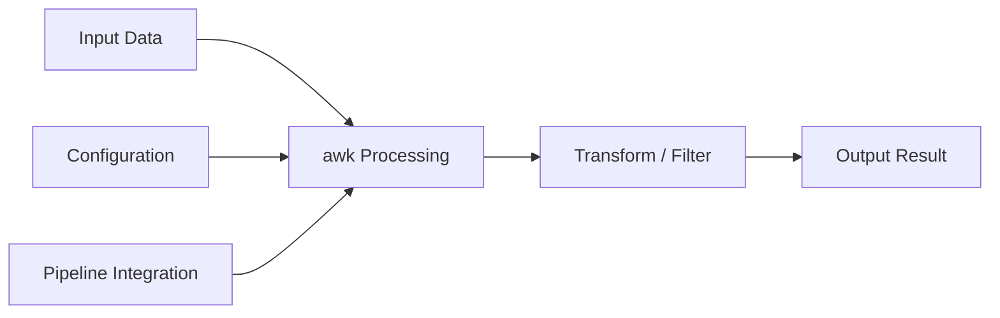

# awk — A 2-Day Crash Course

> **In one sentence:** awk is a pattern-scanning and text-processing language built into every Unix system — it turns structured text (logs, CSVs, command output) into exactly the data you need, in one line. Prerequisite: see `Linux.md` and `Bash.md`.

---

## Part 0 — Why awk exists

You already know `grep` finds matching lines, and `cut` splits columns. But they can't talk to each other. You can't say "show me column 3 only where column 5 is greater than 1000, and give me the total." That's where both tools break down.

awk does both — and more — in a single pass. It reads a file (or stdin), applies your rules line by line, and lets you filter, compute, reformat, and summarize in one expression. No temporary files. No multi-step pipelines for simple aggregations.

**Mental model:** awk is a tiny database engine for text files — every line is a record, every word is a field, and you write rules that say "when this pattern matches, do this action."

---




## Part 1 — The vocabulary

| Term | Symbol / Variable | Meaning |
|---|---|---|
| Record | `$0` | The entire current line |
| Field | `$1`, `$2` … `$NF` | Individual columns (split by FS) |
| Record number | `NR` | Line counter — increments for every input line |
| Number of fields | `NF` | How many fields the current record has |
| Field separator | `FS` | Input delimiter (default: whitespace) |
| Output separator | `OFS` | Separator used when printing with `print` and commas |
| Pattern | `/regex/` or expression | A condition that gates an action |
| Action | `{ ... }` | Code that runs when the pattern matches |
| BEGIN block | `BEGIN { }` | Runs once before any input is read |
| END block | `END { }` | Runs once after all input is consumed |
| printf | `printf fmt, args` | Formatted output — same as C's printf |

The structure of every awk program is:

```
pattern { action }
```

Both are optional. No pattern means the action runs on every line. No action means the matching line is printed.

---

## DAY 1 — One-liners that replace scripts

### 1.1 Printing specific fields

The simplest awk program: print a field.

```bash
# Print the first field of every line
awk '{ print $1 }' file.txt

# Print fields 1 and 3
awk '{ print $1, $3 }' file.txt

# Print the last field regardless of how many columns exist
awk '{ print $NF }' file.txt

# Print the second-to-last field
awk '{ print $(NF-1) }' file.txt
```

`print $1, $3` separates with OFS (default: a space). `print $1 $3` concatenates with nothing between them.

### 1.2 Filtering by pattern

```bash
# Print lines that contain "ERROR"
awk '/ERROR/ { print }' app.log

# Equivalent shorthand — action defaults to print when omitted
awk '/ERROR/' app.log

# Negate: skip lines matching a pattern
awk '!/DEBUG/' app.log

# Combine pattern with field test
awk '/ERROR/ { print $1, $NF }' app.log
```

### 1.3 Setting the field separator with -F

awk splits on whitespace by default. Real-world data often uses other delimiters.

```bash
# Parse /etc/passwd — colon-delimited
awk -F: '{ print $1, $6 }' /etc/passwd

# CSV (simple, no quoted commas)
awk -F, '{ print $2 }' data.csv

# Tab-delimited
awk -F'\t' '{ print $3 }' data.tsv

# Multiple possible delimiters — use a regex as FS
awk -F'[,;]' '{ print $1 }' mixed.csv

# You can also set FS inside a BEGIN block
awk 'BEGIN { FS=":" } { print $1 }' /etc/passwd
```

### 1.4 Using NR and NF

```bash
# Print line numbers alongside content
awk '{ print NR, $0 }' file.txt

# Skip the header line (line 1)
awk 'NR > 1 { print }' data.csv

# Print only the first 10 lines
awk 'NR <= 10' file.txt

# Print lines where the number of fields is exactly 5
awk 'NF == 5' file.txt

# Print lines that have more than 3 fields
awk 'NF > 3 { print NR, $0 }' file.txt
```

### 1.5 String matching beyond simple /regex/

```bash
# Match a specific field against a regex
awk '$3 ~ /^GET/' access.log

# Negated field match
awk '$3 !~ /^GET/' access.log

# Exact string comparison on a field
awk '$2 == "200"' access.log

# Comparison operators work on strings and numbers
awk '$5 > 5000' access.log
```

The `~` operator means "matches this regex." `==` is exact equality.

### 1.6 Arithmetic on fields

awk treats fields as numbers automatically when they look numeric.

```bash
# Sum the third column
awk '{ sum += $3 } END { print sum }' data.txt

# Average
awk '{ sum += $3; count++ } END { print sum / count }' data.txt

# Multiply two fields
awk '{ print $1, $2 * $3 }' prices.txt

# Conditional arithmetic: only sum lines where field 2 equals "sale"
awk '$2 == "sale" { total += $4 } END { print total }' transactions.txt
```

### 1.7 BEGIN and END blocks

```bash
# Print a header before output, and a total after
awk 'BEGIN { print "Name\tScore" }
     { print $1, $2 }
     END { print "---\nDone." }' scores.txt

# Set OFS so comma-separated print fields use a different separator
awk 'BEGIN { OFS="," } { print $1, $3, $5 }' data.txt

# Count matching lines
awk '/ERROR/ { count++ } END { print count " errors found" }' app.log
```

**By end of Day 1 you can:**
- Extract any column from any delimited file
- Filter lines by pattern or by field value
- Do basic aggregation (sum, count, average) in a single pass
- Add headers and footers around your output
- Handle any input delimiter

---

## DAY 2 — Make it real

### 2.1 Arrays — counting and grouping

awk arrays are associative (hash maps). The key can be any string.

```bash
# Count occurrences of each value in field 1
awk '{ count[$1]++ } END { for (k in count) print k, count[k] }' data.txt

# Count HTTP status codes in an access log
awk '{ status[$9]++ } END { for (s in status) print s, status[s] }' access.log

# Sum bytes per IP
awk '{ bytes[$1] += $10 } END { for (ip in bytes) print ip, bytes[ip] }' access.log
```

The `for (key in array)` loop iterates in arbitrary order. Pipe to `sort` if order matters.

### 2.2 Histograms and frequency tables

```bash
# Response time histogram in 100ms buckets
awk '{ bucket = int($NF / 100) * 100; hist[bucket]++ }
     END { for (b in hist) print b, hist[b] }' timings.txt | sort -n

# Top talkers: sort by count descending
awk '{ count[$1]++ }
     END { for (k in count) print count[k], k }' access.log | sort -rn | head -10
```

### 2.3 Multi-file processing and FNR

When you feed multiple files, `NR` keeps incrementing across all files. `FNR` resets to 1 for each new file.

```bash
# Print the filename alongside each line
awk '{ print FILENAME, FNR, $0 }' *.log

# Skip the header of each file (first line of each)
awk 'FNR > 1 { print }' *.csv

# Process two files differently using FILENAME
awk 'FILENAME == "a.txt" { a[$1]=1 }
     FILENAME == "b.txt" && $1 in a { print }' a.txt b.txt
```

### 2.4 printf for formatted output

`print` adds a newline and uses OFS between arguments. `printf` gives you full format control.

```bash
# Right-align numbers in a column
awk '{ printf "%-20s %8d\n", $1, $2 }' data.txt

# Print a table with headers
awk 'BEGIN { printf "%-15s %10s %8s\n", "IP", "Requests", "Bytes" }
     { req[$1]++; bytes[$1] += $10 }
     END { for (ip in req) printf "%-15s %10d %8d\n", ip, req[ip], bytes[ip] }' access.log

# Write to a file from within awk
awk '{ printf "%s\n", $0 > "/tmp/output.txt" }' input.txt
```

Format verbs: `%s` (string), `%d` (integer), `%f` (float), `%e` (scientific). Width: `%10s` right-pads to 10. Left-align with `%-10s`.

### 2.5 User-defined functions

For logic you'd otherwise repeat, define a function in the program body.

```bash
awk '
function abs(x) { return x < 0 ? -x : x }
function max(a, b) { return a > b ? a : b }
{
  diff = abs($2 - $3)
  print $1, diff, max(diff, 100)
}
' data.txt
```

Functions are declared anywhere in the program — before or after the rules that call them.

### 2.6 Processing logs — nginx access log

A standard nginx combined log line looks like:

```
127.0.0.1 - frank [10/Oct/2000:13:55:36 -0700] "GET /index.html HTTP/1.1" 200 2326
```

Fields: `$1`=IP, `$4`=timestamp (with bracket), `$7`=path, `$9`=status, `$10`=bytes.

```bash
# Requests per status code
awk '{ status[$9]++ } END { for (s in status) print s, status[s] }' access.log | sort -n

# Top 10 IPs by request count
awk '{ count[$1]++ } END { for (ip in count) print count[ip], ip }' access.log \
  | sort -rn | head -10

# Total bytes served
awk '{ total += $10 } END { printf "%.2f MB\n", total / 1024 / 1024 }' access.log

# 5xx errors with their paths
awk '$9 ~ /^5/ { print $9, $7 }' access.log | sort | uniq -c | sort -rn
```

### 2.7 Processing syslog

syslog format: `Month Day HH:MM:SS hostname process[pid]: message`

```bash
# Count events per process (strip the PID from field 5)
awk '{ match($5, /^([^[]+)/, arr); proc[arr[1]]++ }
     END { for (p in proc) print proc[p], p }' /var/log/syslog | sort -rn

# Show only SSH events
awk '/sshd/ { print $1, $2, $3, $0 }' /var/log/auth.log

# Count failed logins per hour
awk '/Failed password/ { hour=substr($3,1,2); fails[hour]++ }
     END { for (h in fails) print h, fails[h] }' /var/log/auth.log | sort
```

### 2.8 Combining with pipes

awk is at its best in the middle of a pipeline.

```bash
# Disk usage: show only mounts over 80% full
df -h | awk 'NR > 1 && int($5) > 80 { print $5, $6 }'

# Process list: top 5 by memory
ps aux | sort -k4 -rn | awk 'NR <= 5 { printf "%-10s %5s%% %s\n", $1, $4, $11 }'

# Count unique IPs in a log — awk instead of cut+sort+uniq
awk '{ ips[$1]=1 } END { print length(ips) }' access.log

# Extract specific fields, then sort and count
grep "POST" access.log | awk '{ print $7 }' | sort | uniq -c | sort -rn | head -20
```

### 2.9 awk vs jq vs Python — when to use which

| Situation | Tool |
|---|---|
| Structured text, TSV, CSV, log files | awk |
| JSON input or output | jq |
| Multi-step logic, classes, external libraries | Python |
| Quick field extraction from CLI output | awk |
| Nested data structures | jq or Python |
| One-pass aggregation with no state beyond counts/sums | awk |
| Need error handling, retries, HTTP calls | Python |

awk's sweet spot: text with a consistent field structure, one-pass processing, no external dependencies. The moment you're importing a module in Python just to parse a log file, ask yourself whether awk would have done it in three words.

See `jq.md` for the JSON counterpart.

### 2.10 Writing awk scripts — not just one-liners

When your awk program grows beyond two lines on the command line, put it in a file.

```bash
# report.awk
BEGIN {
    FS = ","
    OFS = "\t"
    printf "%-20s %10s %10s\n", "Name", "Revenue", "Margin"
}
NR > 1 {
    revenue[$1] += $3
    margin[$1] += $4
}
END {
    for (name in revenue) {
        pct = (margin[name] / revenue[name]) * 100
        printf "%-20s %10.2f %9.1f%%\n", name, revenue[name], pct
    }
}
```

Run it with:

```bash
awk -f report.awk sales.csv
```

The `-f` flag reads the program from a file. You can pass multiple `-f` flags to compose programs. Pass variables in from the shell with `-v`:

```bash
awk -v threshold=1000 '$3 > threshold { print }' data.txt
```

`-v` sets an awk variable before execution starts — safer than embedding shell variables inside the awk program with quoting nightmares.

---

## Worked example — Analyzing nginx access logs

Assume a standard combined-format log at `/var/log/nginx/access.log`.

```bash
# Top 10 IPs by request count
awk '{ count[$1]++ }
     END { for (ip in count) print count[ip], ip }' /var/log/nginx/access.log \
  | sort -rn | head -10

# Requests per status code — sorted numerically
awk '{ status[$9]++ }
     END { for (s in status) print s, status[s] }' /var/log/nginx/access.log \
  | sort -n

# Average response time — assumes response time is the last field
awk '{ sum += $NF; count++ }
     END { printf "Avg response time: %.2f ms\n", sum / count }' /var/log/nginx/access.log

# Bandwidth (bytes) per endpoint — top 10
awk '{ bytes[$7] += $10 }
     END { for (path in bytes) print bytes[path], path }' /var/log/nginx/access.log \
  | sort -rn | head -10

# 4xx and 5xx errors with counts — useful for alerting triage
awk '$9 ~ /^[45]/ { errors[$9 " " $7]++ }
     END { for (e in errors) print errors[e], e }' /var/log/nginx/access.log \
  | sort -rn | head -20
```

Each of these is a single awk invocation. No temp files, no intermediate scripts.

---

## Common pitfalls

- **Quoting shell variables inside awk.** Never write `awk "{ print $1 }"` — the shell expands `$1` before awk sees it. Use single quotes around awk programs, and pass shell variables with `-v var="$shellvar"`.

- **String vs number comparison.** `awk '$2 > 9'` works because awk coerces the string to a number. But `awk '$2 > "9"'` does lexicographic comparison — "10" < "9" lexicographically. Keep comparisons numeric when your data is numeric.

- **Forgetting that arrays are unordered.** `for (k in arr)` gives you keys in arbitrary order. Always pipe to `sort` when order matters in output.

- **Using `print` with `>` inside a loop.** `print $0 > "file.txt"` inside a loop is valid, but awk keeps the file open. If you want to append, use `>>`. If you open many different files dynamically, you may hit the OS file descriptor limit — use `close("file.txt")` periodically.

- **FS as a regex, not a literal string.** `-F '.'` does not split on a literal dot — `.` is a regex wildcard. Use `-F '[.]'` or `-F '\.'` for a literal dot. Same applies when setting `FS` in a BEGIN block.

- **Treating $0 as immutable.** Assigning to a field (`$2 = "new"`) rebuilds `$0` using OFS as the separator. If OFS differs from your input separator, `$0` will look different. Be intentional about this.

- **Assuming NF is stable after field assignment.** Assigning to a field beyond the current NF (e.g., `$10 = "x"` when NF is 5) extends the record and changes NF.

- **One-liners that grow past readability.** Once you have more than two patterns or one non-trivial action block, move it to a file with `-f`. Debugging a 200-character one-liner on a production server is not fun.

⚠️ On macOS, the default `awk` is BSD awk, which lacks some GNU awk (`gawk`) features — notably `gensub()` and full POSIX interval expressions. Install `gawk` via Homebrew if you need those features and want your scripts to be portable to Linux.

---

## Quick command reference

```bash
# Print a specific field
awk '{ print $2 }' file.txt

# Print multiple fields with custom separator
awk 'BEGIN { OFS="|" } { print $1, $3, $5 }' file.txt

# Filter lines by field value
awk '$4 == "ERROR"' app.log

# Filter lines by field numeric comparison
awk '$3 > 500' data.txt

# Count lines matching a pattern
awk '/WARN/ { count++ } END { print count }' app.log

# Sum a column
awk '{ sum += $2 } END { print sum }' data.txt

# Average a column
awk '{ sum += $3; n++ } END { print sum/n }' data.txt

# Skip header row
awk 'NR > 1 { print $1, $2 }' report.csv

# Parse colon-delimited file
awk -F: '{ print $1, $3 }' /etc/passwd

# Count unique values in field 1
awk '{ seen[$1]=1 } END { print length(seen) }' data.txt

# Frequency table for field 1
awk '{ freq[$1]++ } END { for (k in freq) print freq[k], k }' data.txt | sort -rn

# Print lines between two patterns (inclusive)
awk '/START/,/END/' file.txt

# Remove duplicate lines (keeps first occurrence, no sort required)
awk '!seen[$0]++' file.txt

# Add line numbers
awk '{ print NR": "$0 }' file.txt

# Print lines longer than 80 characters
awk 'length($0) > 80' file.txt

# Replace a field value and reprint the line
awk '$2 == "foo" { $2 = "bar" } { print }' file.txt

# Run an awk script from a file
awk -f analysis.awk data.csv

# Pass a shell variable into awk
threshold=1000
awk -v t="$threshold" '$3 > t { print }' data.txt
```

---


## Top 10 Interview Questions

<details>
<summary><strong>Q: What is awk and what problem does it solve?</strong></summary>

awk addresses a specific need in modern engineering workflows. Understanding the core problem it solves — and the alternatives it replaced — is the foundation for every subsequent interview question. Frame your answer around the pain point first, then the solution.

</details>

<details>
<summary><strong>Q: How does awk compare to its main alternatives?</strong></summary>

Every tool exists in an ecosystem of alternatives. Be prepared to articulate the specific tradeoffs: when awk is the right choice, when an alternative is better, and what factors drive the decision (scale, team expertise, existing infrastructure, compliance requirements).

</details>

<details>
<summary><strong>Q: What are the most common production pitfalls with awk?</strong></summary>

Production experience is what separates senior from junior engineers. Common pitfalls include: misconfiguration that works in dev but fails at scale, security oversights, inadequate monitoring, and operational procedures that are untested until an incident occurs. Cite specific examples from your experience.

</details>

<details>
<summary><strong>Q: How do you monitor and observe awk in production?</strong></summary>

Key metrics to track, alerting thresholds to set, dashboards to build, and log patterns to watch. Production monitoring should cover: health/liveness, performance (latency, throughput), capacity (resource utilisation), and business impact (error rates affecting users). Explain which metrics are leading indicators versus lagging.

</details>

<details>
<summary><strong>Q: How do you scale awk as load increases?</strong></summary>

Scaling strategies depend on the bottleneck: horizontal scaling (add more instances), vertical scaling (bigger instances), caching (reduce load), sharding (distribute data), and async processing (decouple components). Explain which approach applies to awk and at what scale each strategy becomes necessary.

</details>

<details>
<summary><strong>Q: How do you handle security and access control with awk?</strong></summary>

Security is non-negotiable in production. Cover: authentication and authorization mechanisms, secrets management (never in code), encryption (at rest and in transit), network security (firewalls, private networks), audit logging, and compliance requirements relevant to your industry.

</details>

<details>
<summary><strong>Q: How do you implement disaster recovery for awk?</strong></summary>

DR planning requires defining RTO (recovery time objective) and RPO (recovery point objective), implementing backup strategies, testing restore procedures, and documenting runbooks. Explain your backup strategy, how you test restores, and what your recovery procedure looks like.

</details>

<details>
<summary><strong>Q: How do you automate awk deployment and configuration management?</strong></summary>

Infrastructure as code, CI/CD pipelines, configuration management, and GitOps workflows. Explain how you version, test, deploy, and roll back changes. Cover: what is automated, what requires manual approval, and how you handle configuration drift.

</details>

<details>
<summary><strong>Q: How do you troubleshoot issues with awk in production?</strong></summary>

A systematic debugging approach: check health endpoints, review recent changes (deploys, config changes), examine logs and metrics, reproduce the issue, identify root cause, fix, verify, and write a postmortem. Explain your actual debugging workflow with concrete examples.

</details>

<details>
<summary><strong>Q: What are the best practices for awk that you have learned from experience?</strong></summary>

Best practices that go beyond documentation: lessons learned from production incidents, configuration patterns that prevent common issues, testing strategies that catch bugs before production, and operational procedures that reduce toil. Share specific examples where following (or not following) a best practice had measurable impact.

</details>

---


## Quick Quiz

Test your understanding with these rapid-fire questions (answers hidden):

<details>
<summary>1. What is the ONE core problem that awk solves?</summary>
Re-read Part 0 — the mental model section. If you can explain the "why" in one sentence, you understand the foundation.
</details>

<details>
<summary>2. Name the 3 most important terms from the vocabulary section.</summary>
Review Part 1. These are the building blocks every conversation about awk uses.
</details>

<details>
<summary>3. What is the first thing you would set up on Day 1?</summary>
Check the Day 1 section — the very first hands-on step that gets you a working result.
</details>

<details>
<summary>4. What is the most common production pitfall with awk?</summary>
Review the Common Pitfalls section. The first item listed is typically the most frequently encountered.
</details>

<details>
<summary>5. How does awk compare to its closest alternative?</summary>
Check the Comparison Matrix below — focus on the key differentiating row.
</details>


## Comparison Matrix

| Dimension | awk | sed | Perl one-liners |
|-----------|-----|-----|-----------------|
| **Primary use case** | Core strength of awk | Core strength of sed | Core strength of Perl one-liners |
| **Learning curve** | Moderate | Varies | Varies |
| **Community/ecosystem** | Active | Active | Growing |
| **Operational complexity** | Medium | Varies | Varies |
| **Best for** | See Part 0 | Different tradeoffs | Different tradeoffs |

> **How to read this matrix:** no tool wins on every dimension. Pick based on your specific constraints — team expertise, existing infrastructure, scale requirements, and compliance needs. The right choice is the one that fits your context, not the one with the most checkmarks.

## Next steps after Day 2

- `sed.md` — stream editor for substitution and line deletion; complements awk for in-place text transformation
- `Bash.md` — shell scripting fundamentals; awk lives inside bash pipelines and scripts
- `jq.md` — awk's counterpart for JSON; learn when to switch tools
- `Linux.md` — file permissions, process management, and the broader Unix toolkit that awk plugs into

---

## Recommended learning resources

**YouTube channels & playlists:**
- [LearnLinuxTV — awk Tutorial Series](https://www.youtube.com/@LearnLinuxTV) — methodical walkthrough from basic field splitting to real log-processing examples
- [The Urban Penguin — awk Deep Dive](https://www.youtube.com/@TheUrbanPenguin) — detailed coverage of patterns, actions, arrays, and built-in variables
- [Fireship — awk in 100 Seconds](https://www.youtube.com/@Fireship) — rapid mental model of what awk is and where it fits in the Unix pipeline
- [Luke Smith — Text Processing with awk](https://www.youtube.com/@LukeSmithxyz) — practical examples of awk for everyday command-line tasks
- [tutoriaLinux — awk for System Administrators](https://www.youtube.com/@tutoriaLinux) — ops-focused awk usage for parsing logs and system output

**Official docs & blogs:**
- [GNU Awk User's Guide (gawk manual)](https://www.gnu.org/software/gawk/manual/gawk.html) — the definitive reference for syntax, built-in functions, and advanced features
- [The AWK Programming Language — Aho, Weinberger, Kernighan](https://archive.org/details/pdfy-MgN0H1joIoDVoIC7) — the original book by awk's creators, still the best tutorial

**The mantra:** if you can describe what you want in terms of "when this column matches this condition, compute that" — awk does it in one line, right now, with no dependencies.
