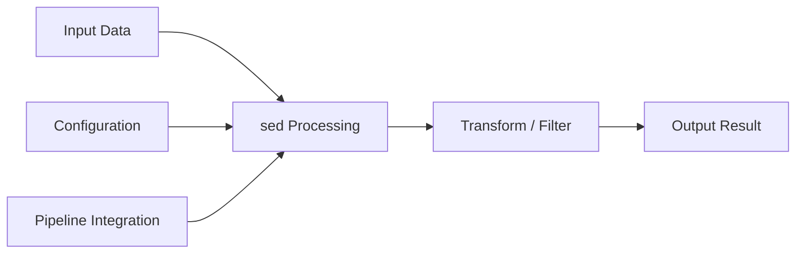

# sed — A 2-Day Crash Course

> **In one sentence:** sed (stream editor) is a non-interactive text transformer — it reads input line by line, applies your editing commands, and writes the result, making it the fastest way to search-and-replace across files from the command line. Prerequisite: see `Linux.md` and `Bash.md`.

---

## Part 0 — Why sed exists

You need to change text in files without opening an editor. Maybe you need to rename a variable across 50 files, strip debug headers from 10,000 log lines, replace a deprecated API endpoint in every config file in a repo, or transform an INI file into YAML so Ansible can consume it. Opening each file in vim and typing `:%s/old/new/g` works once — it does not scale.

sed solves exactly this problem. It is a stream editor, meaning it operates on a stream of text rather than an open document. You hand it input (a file, piped output, a here-string), tell it what transformations to apply, and it writes the result to stdout — or back to the file if you ask it to.

The conveyor belt mental model gets you far: imagine each line of your input riding a belt past a workstation. At the workstation, you have a set of rules — delete this line, replace that word, print this section. Each line gets processed by your rules and either falls off the end into the output, or gets dropped, depending on what you told sed to do. Lines are processed one at a time. sed does not look ahead or behind by default. It is fast, composable, and available on every Unix system you will ever touch.

When people reach for sed, they are usually doing one of three things: substitution (find and replace), filtering (delete or print only matching lines), or light transformation (reformat text structure). You will use substitution 90% of the time. The other commands exist for the 10% that matters.

**Mental model:** sed is a find-and-replace engine on a conveyor belt — each line rolls past, your rules transform it, and the modified line comes out the other end.

---




## Part 1 — The vocabulary

| Term | What it means |
|---|---|
| **Pattern Space** | The buffer where sed holds the current line while processing it. Your commands operate on pattern space. |
| **Hold Space** | A secondary buffer — empty by default — where you can stash content across line boundaries. Think of it as a scratchpad. |
| **Address** | A selector that restricts which lines a command applies to. Can be a line number (`3`), a regex (`/error/`), a range (`3,7`), or a last-line anchor (`$`). Without an address, a command applies to every line. |
| **Command** | The operation to perform. Core set: `s` (substitute), `d` (delete), `p` (print), `a` (append after), `i` (insert before), `c` (change/replace entire line). |
| **Regex** | The pattern matching syntax sed uses inside addresses and `s` commands. POSIX basic regex (BRE) by default; extended regex (ERE) with `-E` flag. |
| **Back-reference** | A way to reuse a captured group from your regex in the replacement. In BRE: `\1`, `\2`. In ERE: same syntax, different grouping delimiters. |
| **In-place edit (-i)** | The flag that tells sed to write changes back to the original file instead of stdout. ⚠️ Behavior differs between GNU sed and macOS sed — covered in pitfalls. |
| **Delimiter** | The character that separates the parts of a `s` command. Traditionally `/`, but any character works — useful when your pattern contains slashes (e.g., URLs or file paths). |

---

## DAY 1 — Essential transformations

### 1.1 The substitution command

The `s` command is the workhorse. Its structure is:

```bash
sed 's/pattern/replacement/'
```

Three delimiters divide the command into four parts: `s`, the pattern, the replacement, and optional flags. The pattern is a regex. The replacement is literal text, but can include `&` (the entire match) or back-references.

```bash
# Replace first occurrence of "foo" on each line
echo "foo foo foo" | sed 's/foo/bar/'
# Output: bar foo foo

# & inserts the matched text in the replacement
echo "error" | sed 's/error/[&]/'
# Output: [error]
```

### 1.2 The global flag

Without flags, `s` replaces only the first match on each line. Add `g` to replace all occurrences:

```bash
echo "foo foo foo" | sed 's/foo/bar/g'
# Output: bar bar bar
```

You can also target the Nth occurrence specifically:

```bash
echo "foo foo foo" | sed 's/foo/bar/2'
# Output: foo bar foo
```

Combine `g` and a number to replace from the Nth occurrence onward (GNU sed only):

```bash
echo "foo foo foo" | sed 's/foo/bar/2g'
# Output: foo bar bar
```

### 1.3 Deleting lines

The `d` command deletes matching lines from the output:

```bash
# Delete all blank lines
sed '/^$/d' file.txt

# Delete lines containing "DEBUG"
sed '/DEBUG/d' app.log

# Delete a specific line number
sed '5d' file.txt

# Delete a range of lines
sed '3,7d' file.txt
```

When `d` fires, sed skips to the next line immediately — no further commands in the script run for that line.

### 1.4 Printing specific lines

By default, sed prints every line whether modified or not. The `-n` flag suppresses automatic printing. Pair it with the `p` command to print only what you explicitly select:

```bash
# Print only lines containing "ERROR"
sed -n '/ERROR/p' app.log

# Print lines 10 through 20
sed -n '10,20p' file.txt

# Print the last line
sed -n '$p' file.txt
```

Without `-n`, `p` causes matched lines to print twice — once from automatic output and once from the explicit `p`. That is almost never what you want, so `-n` and `p` travel together.

### 1.5 Address ranges

Addresses let you restrict any command to specific lines. They compose with every command, not just `d` and `p`:

```bash
# Substitute only on lines 5 through 10
sed '5,10s/old/new/' file.txt

# Substitute only on lines matching a regex
sed '/^server/s/localhost/0.0.0.0/' nginx.conf

# From a matching pattern to end of file
sed '/^START/,$d' file.txt

# Negate an address with ! — apply command to every line EXCEPT matches
sed '/comment/!s/foo/bar/' file.txt
```

Line number `0` is valid in GNU sed as the start of a range when the end is a regex — it lets the range match from the very first line even if that line matches the end pattern.

### 1.6 In-place editing

In production you usually want to modify files directly, not just print the result:

```bash
# GNU sed — in-place, no backup
sed -i 's/old/new/g' file.txt

# GNU sed — in-place with backup (.bak extension)
sed -i.bak 's/old/new/g' file.txt
```

⚠️ macOS ships BSD sed, where `-i` requires a suffix argument — even an empty string. See pitfalls for the cross-platform pattern.

---

**By end of Day 1 you can:**
- Replace text globally across a file or stream
- Delete lines by pattern or line number
- Print only the lines you care about
- Target commands to specific line ranges
- Edit files in place with a backup

---

## DAY 2 — Make it real

### 2.1 Regex groups and back-references

Capture groups let you reuse parts of the match in your replacement. In BRE (default), groups use escaped parentheses `\(` and `\)`. In ERE (with `-E`), plain parentheses work:

```bash
# Swap first and last name (BRE)
echo "Smith, John" | sed 's/\([^,]*\), \(.*\)/\2 \1/'
# Output: John Smith

# Same with ERE
echo "Smith, John" | sed -E 's/([^,]*), (.*)/\2 \1/'
# Output: John Smith

# Wrap IP addresses in brackets
echo "Connect to 192.168.1.1 for access" | \
  sed -E 's/([0-9]+\.[0-9]+\.[0-9]+\.[0-9]+)/[\1]/'
# Output: Connect to [192.168.1.1] for access
```

### 2.2 Multiple commands

You have two clean ways to run multiple sed commands in one pass.

**Using `-e`:**

```bash
sed -e 's/foo/bar/g' -e 's/baz/qux/g' file.txt
```

**Using semicolons:**

```bash
sed 's/foo/bar/g; s/baz/qux/g' file.txt
```

Note that some commands — particularly those involving newlines or multi-line logic — do not compose cleanly with semicolons. When in doubt, use `-e` or a script file.

### 2.3 sed script files

When your transformation gets complex, put it in a file:

```bash
# transform.sed
s/http:/https:/g
s/www\.old-domain\.com/www.new-domain.com/g
/^#/d
```

Run it with `-f`:

```bash
sed -f transform.sed input.txt
```

Script files make version control, review, and reuse straightforward. Any transformation you run more than twice belongs in a script file.

### 2.4 Append, insert, and change

These three commands operate on entire lines rather than patterns within lines:

```bash
# Append a line AFTER every line matching /^Host/
sed '/^Host/a\  StrictHostKeyChecking no' ssh_config

# Insert a line BEFORE the first line
sed '1i\# Auto-generated — do not edit' file.txt

# Replace (change) every line matching /^version/
sed '/^version/c\version = 2.0.0' config.toml
```

The `a` and `i` commands use a backslash-newline in traditional sed. GNU sed relaxes this and lets you use `\n` inline, which is friendlier in scripts:

```bash
# GNU sed — inline newline in append
sed '/^Host/a\\  StrictHostKeyChecking no' ssh_config
```

### 2.5 Hold space for multi-line operations

The hold space is where sed's power extends beyond simple line-by-line work. The key commands:

| Command | Effect |
|---|---|
| `h` | Copy pattern space to hold space (overwrite) |
| `H` | Append pattern space to hold space |
| `g` | Copy hold space to pattern space (overwrite) |
| `G` | Append hold space to pattern space |
| `x` | Exchange pattern space and hold space |

A classic use — reverse the lines of a file:

```bash
sed -n '1!G; h; $p' file.txt
```

What this does: for every line except the first (`1!`), append hold space to pattern space (`G`); then copy pattern space back to hold space (`h`); at the last line (`$`), print (`p`). Each line accumulates in hold space in reverse order, and the whole thing prints at the end.

Another practical use: join a continuation line (a line ending with `\`) to the next line — a pattern you encounter when parsing Makefiles or shell scripts.

### 2.6 Bulk edits with find

Combining sed with find is the standard approach for multi-file transformations:

```bash
# Replace in all .conf files under /etc (GNU sed)
find /etc -name '*.conf' -exec sed -i 's/old_value/new_value/g' {} \;

# More efficient with + (passes multiple files per invocation)
find . -name '*.py' -exec sed -i 's/python2/python3/g' {} +

# Dry run — preview changes before committing
find . -name '*.tf' -exec sed 's/us-east-1/us-west-2/g' {} \;
```

For repository-wide renames, this pattern — `find` with `-name` filtering combined with `sed -i` — is the standard tool before reaching for something heavier like a scripted `git grep` loop.

### 2.7 sed vs awk vs perl — when to use which

These three tools overlap, and the choice matters for readability and maintenance.

**Use sed when:**
- You are doing substitution, deletion, or basic line filtering
- The transformation fits in one or two commands
- You want the fastest path from "I need to replace X with Y"

**Use awk when:**
- You need to operate on fields (columns) within a line
- You need arithmetic, conditionals, or per-file summaries
- The data has a consistent delimiter (CSV, TSV, space-separated)
- See `awk.md` for the full picture

**Use perl when:**
- You need look-ahead/look-behind regex (PCRE)
- The transformation is stateful and complex enough that sed and awk both feel like the wrong tool
- Cross-platform consistency matters — perl's `-i` behavior is uniform across macOS and Linux

A good heuristic: if you are writing more than three `-e` expressions or reaching for hold space and labels, consider whether a five-line awk or perl script would be clearer. sed's strength is concision — when the script stops being concise, switch tools.

---

## Worked example — Migrating config file format

You have an INI-style config file that a legacy service writes:

```ini
[database]
host=localhost
port=5432
name=myapp

[cache]
host=redis.internal
port=6379
```

Your new service expects YAML:

```yaml
database:
  host: localhost
  port: 5432
  name: myapp

cache:
  host: redis.internal
  port: 6379
```

The transformation in sed:

```bash
sed -E \
  -e '/^\[.*\]$/ { s/^\[//; s/\]$//; s/(.+)/\1:/; }' \
  -e '/^[^#:]/ s/^([^=]+)=(.*)$/  \1: \2/' \
  -e '/^$/d' \
  config.ini
```

Walking through it:

- First `-e`: for lines that are INI section headers (`[database]`), strip the brackets and append a colon — producing `database:`.
- Second `-e`: for lines that are key-value pairs (not comments, not already-transformed section headers), reformat `key=value` as `  key: value` with two-space indent.
- Third `-e`: strip blank lines — YAML tolerates them, but this keeps output clean.

In a real ops scenario you test on one file first:

```bash
sed -f transform.sed sample.ini > sample.yaml
diff expected.yaml sample.yaml
```

Then run across all files once you are confident:

```bash
find /etc/myapp -name '*.ini' | while read -r f; do
  sed -E \
    -e '/^\[.*\]$/ { s/^\[//; s/\]$//; s/(.+)/\1:/; }' \
    -e '/^[^#:]/ s/^([^=]+)=(.*)$/  \1: \2/' \
    -e '/^$/d' \
    "$f" > "${f%.ini}.yaml"
done
```

---

## Common pitfalls

- **macOS vs GNU sed and `-i`** — BSD sed (macOS) requires `-i ''` for in-place editing with no backup. GNU sed takes `-i` alone. The cross-platform safe form is `sed -i '' 's/x/y/' file` on Mac and `sed -i 's/x/y/' file` on Linux. If you write scripts that run on both, detect the platform or use `perl -pi -e 's/x/y/' file` — perl's in-place flag behaves identically on both.

- **Greedy regex eats more than you expect** — `.*` matches as much as possible. `s/<.*>//` on `<b>bold</b> and <i>italic</i>` removes everything from the first `<` to the last `>`, not just one tag. Use `[^>]*` instead of `.*` when matching inside delimiters: `s/<[^>]*>//g`.

- **Forgetting to escape special characters** — Dots, asterisks, brackets, and slashes in your pattern need escaping in BRE. A literal dot is `\.`, not `.`. A literal `*` is `\*`. Using `-E` for ERE does not change this for most metacharacters. When in doubt, test with `echo "..." | sed 's/pattern/replacement/'` before running on real files.

- **Omitting `-n` with `p`** — Running `sed '/error/p' file.txt` prints matching lines twice. You want `sed -n '/error/p' file.txt`.

- **In-place editing without a backup on irreplaceable files** — Always use `-i.bak` the first time you run a new sed command on a production config. Disk space is cheap; reconstructing a config from memory is not.

- **Newlines in replacement strings** — You cannot type a literal newline in a replacement in most shells without escaping. Use `\n` in GNU sed replacements. In BSD sed, you need an actual escaped newline in the source. Another reason to prefer GNU sed or perl for complex replacements.

- **ERE vs BRE confusion** — In BRE, `+` and `?` are literal characters; write `\+` and `\?` for quantifiers. In ERE (`-E`), `+` and `?` are quantifiers and you escape for literals. Mixing the two up is the most common source of "my regex works in grep but not in sed."

---

## Quick command reference

```bash
# --- Substitution ---

# Replace first occurrence per line
sed 's/old/new/' file.txt

# Replace all occurrences per line
sed 's/old/new/g' file.txt

# Case-insensitive substitution (GNU sed)
sed 's/old/new/gi' file.txt

# Use alternate delimiter — handy for paths and URLs
sed 's|/usr/local|/opt|g' file.txt

# Substitute only on lines matching a pattern
sed '/^server/s/80/8080/' nginx.conf

# In-place edit, GNU
sed -i 's/old/new/g' file.txt

# In-place edit, macOS/BSD
sed -i '' 's/old/new/g' file.txt

# --- Deletion ---

# Delete lines matching a pattern
sed '/DEBUG/d' app.log

# Delete blank lines
sed '/^[[:space:]]*$/d' file.txt

# Delete line numbers 1 through 5
sed '1,5d' file.txt

# Delete from matching line to end of file
sed '/^END/,$d' file.txt

# --- Printing and filtering ---

# Print only matching lines
sed -n '/ERROR/p' app.log

# Print lines 20 to 30
sed -n '20,30p' file.txt

# Print from matching line to end of file
sed -n '/^START/,$p' file.txt

# --- Multiple commands ---

sed -e 's/foo/bar/g' -e 's/baz/qux/g' file.txt
sed 's/foo/bar/g; /^$/d' file.txt

# --- Insert, append, change ---

# Append line after match
sed '/^Host /a\  IdentityFile ~/.ssh/id_ed25519' ~/.ssh/config

# Insert line before line 1
sed '1i\# DO NOT EDIT' file.txt

# Replace matching line entirely
sed '/^version/c\version: 3' docker-compose.yml

# --- Back-references ---

# Wrap matched digits in quotes
sed -E 's/([0-9]+)/"\1"/' file.txt

# Swap two colon-separated fields
sed -E 's/^([^:]+):([^:]+)/\2:\1/' file.txt

# --- Bulk edits with find ---

# Replace in all YAML files, GNU sed
find . -name '*.yaml' -exec sed -i 's/old_host/new_host/g' {} +

# --- Script file ---

sed -f transform.sed input.txt
```

---


## Top 10 Interview Questions

<details>
<summary><strong>Q: What is sed and what problem does it solve?</strong></summary>

sed addresses a specific need in modern engineering workflows. Understanding the core problem it solves — and the alternatives it replaced — is the foundation for every subsequent interview question. Frame your answer around the pain point first, then the solution.

</details>

<details>
<summary><strong>Q: How does sed compare to its main alternatives?</strong></summary>

Every tool exists in an ecosystem of alternatives. Be prepared to articulate the specific tradeoffs: when sed is the right choice, when an alternative is better, and what factors drive the decision (scale, team expertise, existing infrastructure, compliance requirements).

</details>

<details>
<summary><strong>Q: What are the most common production pitfalls with sed?</strong></summary>

Production experience is what separates senior from junior engineers. Common pitfalls include: misconfiguration that works in dev but fails at scale, security oversights, inadequate monitoring, and operational procedures that are untested until an incident occurs. Cite specific examples from your experience.

</details>

<details>
<summary><strong>Q: How do you monitor and observe sed in production?</strong></summary>

Key metrics to track, alerting thresholds to set, dashboards to build, and log patterns to watch. Production monitoring should cover: health/liveness, performance (latency, throughput), capacity (resource utilisation), and business impact (error rates affecting users). Explain which metrics are leading indicators versus lagging.

</details>

<details>
<summary><strong>Q: How do you scale sed as load increases?</strong></summary>

Scaling strategies depend on the bottleneck: horizontal scaling (add more instances), vertical scaling (bigger instances), caching (reduce load), sharding (distribute data), and async processing (decouple components). Explain which approach applies to sed and at what scale each strategy becomes necessary.

</details>

<details>
<summary><strong>Q: How do you handle security and access control with sed?</strong></summary>

Security is non-negotiable in production. Cover: authentication and authorization mechanisms, secrets management (never in code), encryption (at rest and in transit), network security (firewalls, private networks), audit logging, and compliance requirements relevant to your industry.

</details>

<details>
<summary><strong>Q: How do you implement disaster recovery for sed?</strong></summary>

DR planning requires defining RTO (recovery time objective) and RPO (recovery point objective), implementing backup strategies, testing restore procedures, and documenting runbooks. Explain your backup strategy, how you test restores, and what your recovery procedure looks like.

</details>

<details>
<summary><strong>Q: How do you automate sed deployment and configuration management?</strong></summary>

Infrastructure as code, CI/CD pipelines, configuration management, and GitOps workflows. Explain how you version, test, deploy, and roll back changes. Cover: what is automated, what requires manual approval, and how you handle configuration drift.

</details>

<details>
<summary><strong>Q: How do you troubleshoot issues with sed in production?</strong></summary>

A systematic debugging approach: check health endpoints, review recent changes (deploys, config changes), examine logs and metrics, reproduce the issue, identify root cause, fix, verify, and write a postmortem. Explain your actual debugging workflow with concrete examples.

</details>

<details>
<summary><strong>Q: What are the best practices for sed that you have learned from experience?</strong></summary>

Best practices that go beyond documentation: lessons learned from production incidents, configuration patterns that prevent common issues, testing strategies that catch bugs before production, and operational procedures that reduce toil. Share specific examples where following (or not following) a best practice had measurable impact.

</details>

---


## Quick Quiz

Test your understanding with these rapid-fire questions (answers hidden):

<details>
<summary>1. What is the ONE core problem that sed solves?</summary>
Re-read Part 0 — the mental model section. If you can explain the "why" in one sentence, you understand the foundation.
</details>

<details>
<summary>2. Name the 3 most important terms from the vocabulary section.</summary>
Review Part 1. These are the building blocks every conversation about sed uses.
</details>

<details>
<summary>3. What is the first thing you would set up on Day 1?</summary>
Check the Day 1 section — the very first hands-on step that gets you a working result.
</details>

<details>
<summary>4. What is the most common production pitfall with sed?</summary>
Review the Common Pitfalls section. The first item listed is typically the most frequently encountered.
</details>

<details>
<summary>5. How does sed compare to its closest alternative?</summary>
Check the Comparison Matrix below — focus on the key differentiating row.
</details>


## Comparison Matrix

| Dimension | sed | awk | Perl one-liners |
|-----------|-----|-----|-----------------|
| **Primary use case** | Core strength of sed | Core strength of awk | Core strength of Perl one-liners |
| **Learning curve** | Moderate | Varies | Varies |
| **Community/ecosystem** | Active | Active | Growing |
| **Operational complexity** | Medium | Varies | Varies |
| **Best for** | See Part 0 | Different tradeoffs | Different tradeoffs |

> **How to read this matrix:** no tool wins on every dimension. Pick based on your specific constraints — team expertise, existing infrastructure, scale requirements, and compliance needs. The right choice is the one that fits your context, not the one with the most checkmarks.

## Next steps after Day 2

- `awk.md` — when you need field-aware processing, arithmetic, or per-file summaries, awk picks up where sed leaves off
- `Bash.md` — wire sed into loops, conditionals, and pipelines; understand quoting rules so your patterns survive the shell
- `Linux.md` — find, xargs, and process substitution are sed's most common companions for bulk file operations
- `jq.md` — if the text you are transforming is JSON, jq is the right tool; sed on JSON is a path to subtle bugs

---

## Recommended learning resources

**YouTube channels & playlists:**
- [LearnLinuxTV — sed Tutorial Series](https://www.youtube.com/@LearnLinuxTV) — structured introduction from basic substitutions to multi-line editing
- [The Urban Penguin — sed Mastery](https://www.youtube.com/@TheUrbanPenguin) — deep dive into addresses, hold space, and advanced sed scripts
- [Luke Smith — sed and Stream Editing](https://www.youtube.com/@LukeSmithxyz) — practical, no-nonsense examples of sed for daily text manipulation
- [tutoriaLinux — sed for DevOps](https://www.youtube.com/@tutoriaLinux) — ops-focused sed usage for config file management and log processing
- [Fireship — sed in 100 Seconds](https://www.youtube.com/@Fireship) — quick overview that frames sed in the Unix pipeline mental model

**Official docs & blogs:**
- [GNU sed Manual](https://www.gnu.org/software/sed/manual/sed.html) — the authoritative reference for addresses, commands, and regular expression syntax
- [sed one-liners explained (catonmat.net)](https://catonmat.net/sed-one-liners-explained-part-one) — Peteris Krumins' annotated collection of the most useful sed patterns

**The mantra:** sed is a scalpel — know the one line you need, run it, trust the output, move on.
