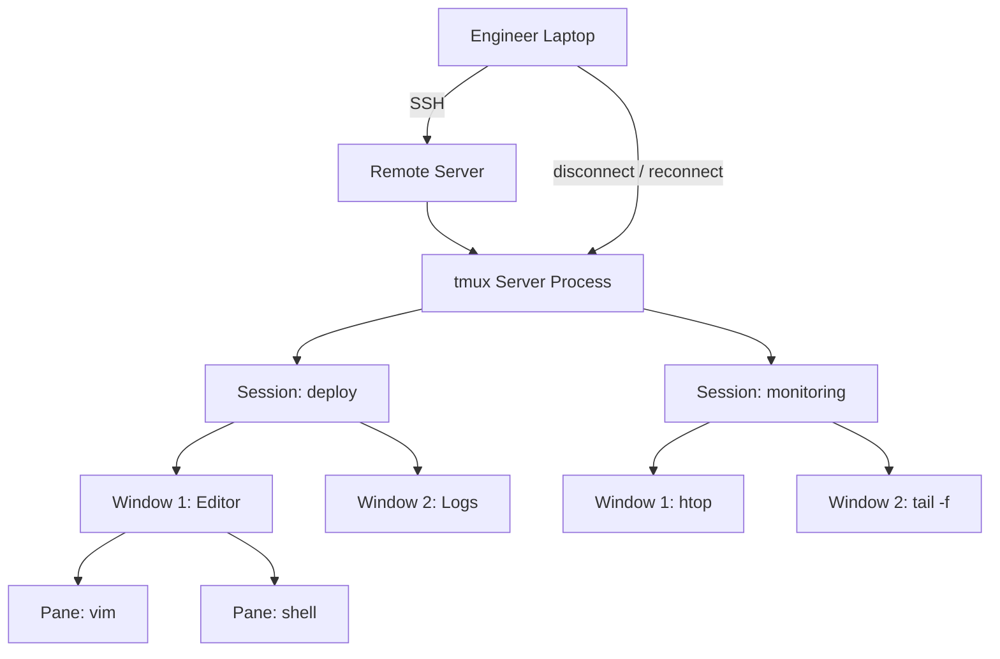

# tmux — A 2-Day Crash Course

> **In one sentence:** tmux is a terminal multiplexer — it lets you split one terminal into many
> panes/windows and, crucially, keeps your sessions running on a server even after you disconnect,
> so long-running work survives a dropped SSH connection.

> Builds on `Linux.md`. Especially valuable when working on remote servers over SSH.

---

## Part 0 — The two problems tmux solves

**Problem 1: the dropped connection.** You SSH into a server, start a long migration or build,
and your laptop sleeps / WiFi drops. The SSH session dies — and so does your command, half-done.
Painful. tmux fixes this: your work runs inside a tmux **session** that lives *on the server*,
independent of your connection. Disconnect, reconnect later, and `tmux attach` drops you right
back where you were — the command still running.

**Problem 2: one terminal, many things.** You want logs in one pane, a shell in another, `top` in
a third — without juggling separate windows or SSH connections. tmux splits a single terminal into
panes and windows you navigate with the keyboard.

For SRE/DevOps work on remote machines, the first problem alone makes tmux essential. Running
anything long on a server *without* tmux (or screen) is asking to lose it.

**Mental model:** tmux is a persistent workspace that lives on the machine, not in your terminal
window. You *attach* to it to see it and *detach* to leave it running. Think of it as remote-
desktop for the terminal: closing the window doesn't close the work.



---

## Part 1 — The hierarchy and the prefix key

**The hierarchy:**
```
Session   (a workspace — e.g. "deploy", "monitoring"; survives disconnects)
└── Window   (like a browser tab — full-screen, switch between them)
    └── Pane    (a split within a window — multiple shells side by side)
```

**The prefix key — the one thing to understand.** Every tmux command starts with a **prefix**
keystroke, then the command key. The default prefix is **`Ctrl-b`** (written `C-b`). So "create a
new window" is: press `Ctrl-b`, release, then press `c`. Written as `C-b c`. Beginners get
confused because nothing happens until they hit the prefix first — *every* tmux shortcut is
`prefix` then `key`. (Many people remap the prefix to `Ctrl-a`, which is easier to reach.)

---

## DAY 1 — Survive disconnects, split your screen

### 1. The session lifecycle (the part that saves your work)
```bash
tmux                          # start a new (unnamed) session
tmux new -s deploy            # start a NAMED session "deploy" (always name them)
# ...do work; then to leave it running:
#   press: C-b d              # DETACH — session keeps running on the server
tmux ls                       # list running sessions
tmux attach -t deploy         # re-ATTACH to it (after reconnecting via SSH)
tmux kill-session -t deploy   # end it when truly done
```
**This is the whole point.** Start a long job inside `tmux new -s job`, press `C-b d` to detach,
log off — the job keeps running. SSH back in tomorrow, `tmux attach -t job`, and watch it finish.

### 2. Windows (tabs)
Inside tmux, all of these begin with the prefix `C-b`:
```
C-b c        create a new window
C-b n        next window        C-b p   previous window
C-b 0..9     jump to window by number
C-b ,        rename the current window
C-b w        list/choose windows interactively
C-b &        kill the current window
```
Windows are full-screen "tabs" — one for editing, one for logs, one for a shell.

### 3. Panes (splits within a window)
```
C-b %        split vertically (panes side by side)
C-b "        split horizontally (panes stacked)
C-b <arrow>  move between panes (or C-b o to cycle)
C-b x        close the current pane
C-b z        ZOOM the current pane to full-screen (toggle — hugely useful)
C-b {  C-b } swap pane position
C-b spacebar cycle through preset layouts
```
`C-b z` (zoom) is a favorite: temporarily blow up one pane to full screen to read something, press
again to restore the split.

### 4. Resizing and the basic workflow
```
C-b C-<arrow>   resize the current pane (hold Ctrl, tap arrows)
```
A typical remote-work setup:
```text
tmux new -s work
C-b %           -> split into left/right
(left pane) tail -f /var/log/app.log
C-b <Right>     -> move to right pane
(right pane) vim config.yaml     # edit while watching logs
C-b d           -> detach and go home; logs keep flowing
```

**By end of Day 1 you can:** create named sessions, detach/reattach (the killer feature), and
split into windows and panes. That covers 90% of daily tmux use.

---

## DAY 2 — Fluency and configuration

### 1. Copy mode — scroll and copy without a mouse
By default you can't scroll back in a tmux pane with the mouse wheel (until configured). Use
**copy mode**:
```
C-b [        enter copy mode (now you can scroll/search the scrollback)
  arrows / PageUp / PageDown   move around
  /  or  ?    search forward / backward
  space        start selection,  enter   copy selection
  q            quit copy mode
C-b ]        paste what you copied
```
In copy mode you can read far back in a command's output — essential when a log scrolled past.
(With vi-mode enabled, navigation uses `hjkl` like Vim.)

### 2. A sane `~/.tmux.conf` (configure it once, love it forever)
```tmux
# remap prefix to Ctrl-a (easier than Ctrl-b)
unbind C-b
set -g prefix C-a
bind C-a send-prefix

# start window/pane numbering at 1
set -g base-index 1
setw -g pane-base-index 1

# mouse support: click panes, scroll, resize by dragging
set -g mouse on

# bigger scrollback history
set -g history-limit 50000

# more intuitive split keys (and keep current path)
bind | split-window -h -c "#{pane_current_path}"
bind - split-window -v -c "#{pane_current_path}"

# vi keys in copy mode
setw -g mode-keys vi

# reload config without restarting: prefix + r
bind r source-file ~/.tmux.conf \; display "reloaded"

# don't rename windows automatically
set -g allow-rename off
```
Apply: inside tmux, `C-b :source-file ~/.tmux.conf` (or with the bind above, `prefix r`). The two
highest-value tweaks for beginners: **`set -g mouse on`** (click/scroll/resize with the mouse) and
**remapping the prefix** to something comfortable.

### 3. Managing multiple sessions
```bash
tmux new -s monitoring
tmux new -s deploy
tmux ls                          # see them all
tmux attach -t monitoring
C-b s                            # interactively switch between sessions (inside tmux)
C-b $                            # rename the current session
tmux kill-server                 # nuke ALL sessions (careful)
```
Organize work by session: one for monitoring, one for a deploy, one for ad-hoc debugging.

### 4. Scripting tmux (set up a whole layout in one command)
You can launch a pre-arranged environment:
```bash
tmux new-session -d -s dev                       # start detached
tmux send-keys -t dev "tail -f /var/log/app.log" C-m
tmux split-window -h -t dev
tmux send-keys -t dev "htop" C-m
tmux attach -t dev
```
For repeatable layouts, tools like **tmuxinator** or **tmuxp** define your panes/windows in a YAML
file and build them with one command — great for a standard "open my dev environment" setup.

### 5. Pairing and shared sessions
Two people SSH'd into the same box can attach to the *same* tmux session and both see/type — a
simple way to pair on an incident or debugging session (`tmux attach -t shared`).

---

## Worked example — long migration over flaky WiFi
```text
1. ssh prod-db-1
2. tmux new -s migration                  # named session lives on the server
3. C-b %                                   # split: run the migration left, watch logs right
4. (left)  ./run-migration.sh             # the long job
   C-b <Right>
   (right) tail -f /var/log/migrate.log    # watch progress
5. C-b d                                   # detach — go to lunch, close the laptop
   ...WiFi drops, no problem...
6. ssh prod-db-1 ; tmux attach -t migration   # back exactly where you left off, still running
7. C-b z on the log pane to read a long error full-screen, C-b z again to restore.
8. Done -> tmux kill-session -t migration
```

---


## Terminal Demo

```terminal-demo
# tmux@multiplexer ~ %

$ tmux -V
tmux 3.4

$ tmux list-sessions
production: 3 windows (created Mon Jun 2 08:00:00 2026)
monitoring: 2 windows (created Mon Jun 2 08:05:00 2026)

$ tmux list-windows -t production
0: api (1 panes) [active]
1: logs (2 panes)
2: db (1 panes)

$ echo "Key Commands"
C-a c       New window
C-a n/p     Next/prev window
C-a |       Split horizontal
C-a -       Split vertical
C-a d       Detach session
C-a z       Toggle pane zoom
```

---

## Common pitfalls
- **Running long jobs without tmux on a server.** A dropped SSH kills them. Start inside
  `tmux new -s job` first — this is the whole reason tmux exists.
- **Forgetting the prefix.** Nothing happens until you press `C-b` (or your remapped prefix)
  *first*, then the key. Every shortcut is `prefix` then `key`.
- **`C-b` collides with shell habits.** `Ctrl-b` also means "back one char" in readline. Remapping
  to `Ctrl-a` is common (but note that's "start of line" in readline — pick what fits you).
- **Can't scroll.** Without `mouse on`, use copy mode (`C-b [`). Many beginners think tmux "ate"
  their scrollback — it's just in copy mode.
- **Pasting multi-line text mangles it.** Terminal paste into tmux can trigger auto-indent chaos;
  enable bracketed paste / use `C-b ]` for tmux's own buffer.
- **Confusing detach with kill.** `C-b d` (detach) leaves it running; `kill-session` ends it.
  Detach to preserve work.
- **Unnamed sessions.** `tmux ls` showing `0:`, `1:` is confusing. Always `new -s name`.

---

## Quick reference (default prefix = `C-b`)
```text
SESSIONS (from the shell)
  tmux new -s NAME           start named session
  tmux ls                    list sessions
  tmux attach -t NAME        reattach
  tmux kill-session -t NAME  end one
  C-b d                      detach (keep running)
  C-b s                      switch session   C-b $  rename session

WINDOWS (tabs)
  C-b c   new      C-b n / p  next/prev   C-b 0-9  jump
  C-b ,   rename   C-b w  list   C-b &  kill

PANES (splits)
  C-b %   split vertical     C-b "   split horizontal
  C-b arrow  move   C-b o  cycle   C-b z  ZOOM toggle
  C-b x   kill pane   C-b {/}  swap   C-b space  layouts
  C-b C-arrow  resize

COPY MODE
  C-b [   enter   (scroll, / to search)   space select   enter copy   q quit
  C-b ]   paste

CONFIG
  ~/.tmux.conf      C-b :source-file ~/.tmux.conf   (or prefix r if bound)
  key settings: set -g mouse on ; set -g prefix C-a ; set -g history-limit 50000
```

---

## Top 10 Interview Questions

<details>
<summary><strong>Q: Why should you always run long-running commands inside tmux on a remote server?</strong></summary>

A process started in a plain SSH session is tied to that session. If the connection drops — laptop sleeps, WiFi flickers, VPN reconnects — the process receives SIGHUP and terminates, potentially mid-migration or mid-deploy. tmux decouples the process from your terminal. The session persists on the server, and you reattach with `tmux attach -t name` after reconnecting.

</details>

<details>
<summary><strong>Q: What is the difference between detaching and killing a tmux session?</strong></summary>

Detaching (`C-b d`) leaves the session and all its processes running on the server — you just disconnect your view. Killing (`tmux kill-session -t name`) terminates the session and sends SIGHUP to every process inside it. During an incident, you detach to preserve running diagnostics. You kill only when you are truly finished.

</details>

<details>
<summary><strong>Q: Explain the tmux hierarchy: session, window, pane.</strong></summary>

A session is the top-level workspace that survives disconnects. Each session contains one or more windows, which are like browser tabs — full-screen views you switch between. Each window can be split into panes, which are side-by-side or stacked terminal views within that window. A typical setup: one session for a deploy, with a window split into a pane for the deploy command and a pane tailing logs.

</details>

<details>
<summary><strong>Q: What does the prefix key do and why do people remap it?</strong></summary>

Every tmux shortcut starts with the prefix key (default `Ctrl-b`), then a command key. Nothing happens until you press the prefix first. People remap it to `Ctrl-a` because it is easier to reach and matches GNU screen's default. The trade-off is that `Ctrl-a` is "beginning of line" in readline, so you lose that shortcut in the shell — but most people find the ergonomic benefit worth it.

</details>

<details>
<summary><strong>Q: How do you scroll back through output in a tmux pane?</strong></summary>

Enter copy mode with `C-b [`. You can then scroll with arrow keys, Page Up/Down, or use `/` and `?` to search. Press `q` to exit copy mode. Without copy mode, the scrollback appears inaccessible because tmux intercepts terminal scroll events. Setting `set -g mouse on` in `.tmux.conf` also enables mouse-wheel scrolling.

</details>

<details>
<summary><strong>Q: How would you set up a repeatable tmux layout for daily work?</strong></summary>

Script it with `tmux new-session -d -s dev`, then `tmux split-window`, `tmux send-keys`, and `tmux attach`. For complex layouts, use tmuxinator or tmuxp — they define panes, windows, and startup commands in a YAML file. Run one command and your entire development environment appears identically every time.

</details>

<details>
<summary><strong>Q: Can two engineers share a tmux session for pair debugging?</strong></summary>

Yes. Both SSH into the same server and run `tmux attach -t session-name`. They both see and can type in the same session simultaneously. This is a simple way to pair on an incident without screen-sharing tools. For read-only access, one person can attach with `tmux attach -t session-name -r`.

</details>

<details>
<summary><strong>Q: What is the zoom toggle and when is it useful?</strong></summary>

`C-b z` temporarily expands the current pane to fill the entire window. Press it again to restore the split layout. This is invaluable when you have a multi-pane setup but need to read a full stack trace or long log output in one pane without permanently rearranging your layout.

</details>

<details>
<summary><strong>Q: How do you increase the scrollback buffer size?</strong></summary>

Add `set -g history-limit 50000` to `~/.tmux.conf`. The default is 2000 lines, which is often too small for tailing verbose application logs during an incident. After changing the config, either restart tmux or reload with `C-b :source-file ~/.tmux.conf`. The setting only applies to new panes, not existing ones.

</details>

<details>
<summary><strong>Q: What are the most important .tmux.conf settings for a production SRE?</strong></summary>

`set -g mouse on` for quick pane switching and scrolling. `set -g history-limit 50000` for adequate scrollback. Remap the prefix to something comfortable. `bind | split-window -h -c "#{pane_current_path}"` so new panes open in the same directory. `setw -g mode-keys vi` if you use Vim. These five settings cover 90% of daily friction.

</details>

---


## Quick Quiz

Test your understanding with these rapid-fire questions (answers hidden):

<details>
<summary>1. What is the ONE core problem that tmux solves?</summary>
Re-read Part 0 — the mental model section. If you can explain the "why" in one sentence, you understand the foundation.
</details>

<details>
<summary>2. Name the 3 most important terms from the vocabulary section.</summary>
Review Part 1. These are the building blocks every conversation about tmux uses.
</details>

<details>
<summary>3. What is the first thing you would set up on Day 1?</summary>
Check the Day 1 section — the very first hands-on step that gets you a working result.
</details>

<details>
<summary>4. What is the most common production pitfall with tmux?</summary>
Review the Common Pitfalls section. The first item listed is typically the most frequently encountered.
</details>

<details>
<summary>5. How does tmux compare to its closest alternative?</summary>
Check the Comparison Matrix below — focus on the key differentiating row.
</details>


## Comparison Matrix

| Dimension | tmux | screen | Zellij |
|-----------|------|--------|--------|
| **Primary use case** | Core strength of tmux | Core strength of screen | Core strength of Zellij |
| **Learning curve** | Moderate | Varies | Varies |
| **Community/ecosystem** | Active | Active | Growing |
| **Operational complexity** | Medium | Varies | Varies |
| **Best for** | See Part 0 | Different tradeoffs | Different tradeoffs |

> **How to read this matrix:** no tool wins on every dimension. Pick based on your specific constraints — team expertise, existing infrastructure, scale requirements, and compliance needs. The right choice is the one that fits your context, not the one with the most checkmarks.

## Next steps after Day 2
- Build a `~/.tmux.conf` you like (mouse, prefix, history, vi copy-mode, status bar).
- **tmuxinator / tmuxp** for declarative, reusable session layouts.
- Status-bar customization (show host, time, load) and plugins via **TPM** (tmux plugin manager).
- Compare with **GNU screen** (older alternative) — you'll meet it on legacy boxes; same idea,
  different keys.

## Recommended learning resources

**YouTube channels & playlists:**
- [LearnLinuxTV — tmux Crash Course](https://www.youtube.com/@LearnLinuxTV) — clear, structured introduction to sessions, windows, and panes
- [NetworkChuck — tmux for Beginners](https://www.youtube.com/@NetworkChuck) — beginner-friendly demo of why tmux matters for remote work
- [ThePrimeagen — tmux and Terminal Workflow](https://www.youtube.com/@ThePrimeagen) — how to build a fast dev workflow with tmux and Vim together
- [Dreams of Code — tmux Setup Guide](https://www.youtube.com/@dreamsofcode) — modern tmux configuration, plugins, and status bar customisation
- [Luke Smith — Terminal Multiplexers](https://www.youtube.com/@LukeSmithxyz) — minimalist approach to tmux and why it replaces tabbed terminals

**Official docs & blogs:**
- [tmux GitHub Wiki](https://github.com/tmux/tmux/wiki) — official documentation, FAQ, and getting-started guide
- [tmux Cheat Sheet (tmuxcheatsheet.com)](https://tmuxcheatsheet.com/) — printable quick reference for keybindings and commands

**The mantra:** start long remote work inside a named tmux session, detach with `C-b d`, reattach
with `tmux attach`. Every shortcut is prefix-then-key. Turn the mouse on, and never lose a
long-running job to a dropped connection again.
