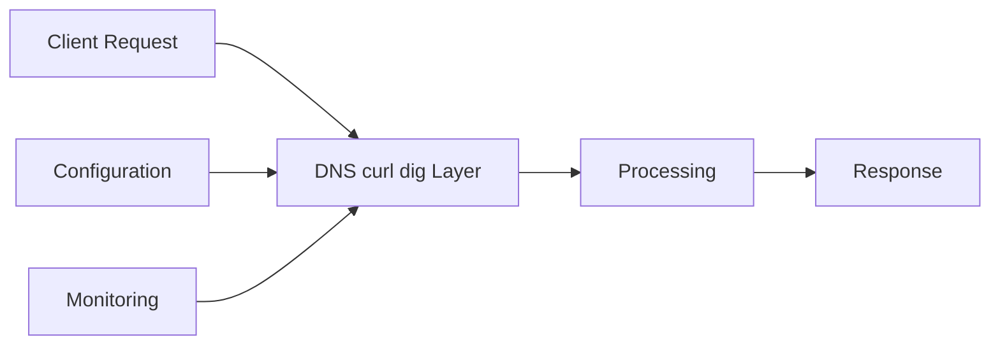

# DNS, curl & dig — A 2-Day Crash Course

> **In one sentence:** This is the network-debugging toolkit — understand how DNS turns names into
> addresses, use `dig` to inspect that resolution, and use `curl` to make and dissect HTTP
> requests, so you can answer "why can't my service reach that endpoint?"

> Builds on `Linux.md`. These three skills resolve a huge fraction of "it's not connecting" incidents.

---

## Part 0 — Why this matters and the mental model

When a service can't talk to another service, the cause is almost always in one of a few layers,
and you debug them in order:
1. **Name resolution** — does the hostname resolve to an IP at all? (DNS) → `dig`
2. **Connectivity** — can you reach that IP and port? → `ping`, `nc`, `curl`
3. **The application** — does the HTTP request actually work, and what does it return? → `curl`

Most "connection" problems are really **DNS problems** (wrong/stale record, wrong resolver) or
**HTTP problems** (wrong path, TLS error, 4xx/5xx). `dig` and `curl` are the two instruments that
tell you which layer is broken.

**How DNS works (the model):** DNS is the internet's phone book. When you request
`api.example.com`, your machine asks a chain of DNS servers to translate that name into an IP
address. It's hierarchical: root servers → `.com` servers → `example.com`'s authoritative servers,
which hold the actual records. Answers are **cached** with a **TTL** (time-to-live), which is why
DNS changes don't take effect instantly — old answers linger until the TTL expires. Understanding
caching/TTL explains most "I changed the DNS but it still goes to the old server" confusion.

**Mental model:** name → (DNS resolution) → IP → (TCP connect to a port) → (HTTP request/response).
Debug left to right; `dig` checks the first arrow, `curl` checks the last.

---




## Part 1 — DNS record types you must know

| Record | Maps... | Example |
|--------|---------|---------|
| **A** | name → IPv4 address | `api.example.com → 93.184.216.34` |
| **AAAA** | name → IPv6 address | |
| **CNAME** | name → another name (alias) | `www → example.com` |
| **MX** | domain → mail servers | |
| **TXT** | arbitrary text (SPF, domain verification) | |
| **NS** | domain → its authoritative nameservers | |
| **SOA** | the domain's "start of authority" metadata | |
| **PTR** | IP → name (reverse DNS) | |

The two you'll touch most: **A** (where does this name point?) and **CNAME** (this name is an alias
for that one). **TTL** on each record controls how long it's cached.

---

## DAY 1 — Inspect DNS with dig, fetch with curl

### 1. `dig` — see exactly what DNS returns
```bash
dig example.com                    # full answer (A record by default)
dig +short example.com             # just the IP — the quick check
dig example.com A                  # specific record type (A/AAAA/CNAME/MX/TXT/NS)
dig +short example.com MX
dig @8.8.8.8 example.com           # ask a SPECIFIC resolver (Google's), bypassing your default
dig +trace example.com             # follow the full resolution chain from the root
```
Reading `dig` output, the key part is the **ANSWER SECTION**:
```
;; ANSWER SECTION:
example.com.   3600   IN   A   93.184.216.34
                ^TTL            ^the IP
```
That TTL (3600 = 1 hour) is how long this answer is cached. `dig +short` is your everyday "what
does this resolve to?" The `@resolver` form is gold for "does the *new* DNS record exist yet, even
if my machine has the old one cached?" — ask the authoritative server directly.

### 2. The DNS debugging workflow
```bash
dig +short api.example.com                 # does it resolve? to what?
dig @1.1.1.1 +short api.example.com        # does a public resolver agree? (cache vs reality)
dig api.example.com NS                      # who's authoritative for this domain?
dig @<authoritative-ns> +short api.example.com   # what does the SOURCE OF TRUTH say?
```
If your machine resolves to an old IP but the authoritative server returns the new one → you're
hitting a **cache**; wait out the TTL or flush. If nothing resolves → the record is missing/wrong.

### 3. `curl` — make HTTP requests and dissect them
```bash
curl https://example.com                       # fetch the body
curl -I https://example.com                    # HEAD request — headers only (status, content-type)
curl -i https://example.com                    # include response headers WITH the body
curl -v https://example.com                    # VERBOSE — see DNS, TCP, TLS handshake, headers
curl -s https://example.com | jq .             # silent (no progress bar) + pipe JSON to jq
```
`curl -v` is the single best network-debugging command: it shows you, step by step, the IP it
resolved, the TLS handshake, the request headers it sent, and the response headers it got back.
When something's wrong, `curl -v` usually shows you *where*.

### 4. Reading `curl -v` (what each part tells you)
```
* Trying 93.184.216.34:443...        <- DNS resolved + attempting TCP connect (connectivity layer)
* SSL connection using TLSv1.3        <- TLS handshake succeeded (cert/TLS layer)
> GET / HTTP/2                        <- the request you SENT (lines starting >)
> Host: example.com
< HTTP/2 200                          <- the response you GOT (lines starting <)
< content-type: text/html
```
`>` = sent, `<` = received. If it hangs at "Trying..." → connectivity/firewall. If TLS fails →
certificate/protocol. If you get a `< 404`/`< 500` → DNS and connection are fine, it's an
application/path problem.

**By end of Day 1 you can:** resolve names with `dig` (including bypassing cache via `@resolver`),
fetch and inspect HTTP with `curl -v`/`-I`, and reason about which layer (DNS / connect / TLS /
app) is failing.

---

## DAY 2 — Real debugging, APIs, and TLS

### 1. curl for APIs (your daily integration tool)
```bash
# methods, headers, body
curl -X POST https://api.example.com/users \
  -H "Content-Type: application/json" \
  -H "Authorization: Bearer $TOKEN" \
  -d '{"name":"gurpreet"}'

curl -s https://api.example.com/data | jq '.items[]'    # parse JSON (see jq.md)
curl -u user:pass https://api.example.com               # basic auth
curl -o out.json https://api.example.com/data           # save to a file
curl -L https://example.com                              # follow redirects (3xx)
curl --data-urlencode "q=hello world" https://api/search # url-encode a param
```
Useful flags: `-w` to print timing/status, e.g. measure latency without a browser:
```bash
curl -s -o /dev/null -w "status=%{http_code} time=%{time_total}s dns=%{time_namelookup}s\n" \
  https://api.example.com/health
```
`%{time_namelookup}` vs `%{time_total}` tells you whether slowness is DNS or the server.

### 2. Connectivity tests (when curl can't even connect)
```bash
ping example.com                  # basic reachability (ICMP; some hosts block it)
nc -zv example.com 443            # is the PORT open? (netcat) — the real "can I reach the service?"
nc -zv 10.0.0.5 5432              # e.g. can I reach Postgres on this host?
traceroute example.com            # the network path (where packets stop)
ss -tulpn                         # locally: what's listening on which port? (see Linux.md)
telnet example.com 80             # old-school port check
```
`nc -zv host port` is the precise "is that service reachable on that port?" test — more useful
than `ping` (which only tests the host, not the port, and is often blocked).

### 3. TLS / certificate debugging (a common production headache)
```bash
curl -v https://example.com 2>&1 | grep -i -E "SSL|TLS|certificate|expire"
# inspect the cert directly:
openssl s_client -connect example.com:443 -servername example.com </dev/null 2>/dev/null \
  | openssl x509 -noout -dates -subject -issuer
```
Common TLS errors and meaning: "certificate has expired" (renew it), "self-signed certificate"
(untrusted CA — add `-k` to bypass *for testing only*), "handshake failure" (protocol/cipher
mismatch), "SNI" issues (use `-servername`/`--resolve`). `curl -k` skips verification — handy to
confirm "is it the cert or the app?" but never in production code.

### 4. Testing against a specific server (bypass DNS / test before cutover)
```bash
# pretend example.com resolves to a specific IP — test the NEW server before changing DNS
curl -v --resolve example.com:443:10.0.0.99 https://example.com/health
# or hit an IP but send the right Host header (virtual hosts):
curl -v -H "Host: example.com" https://10.0.0.99/health
```
`--resolve` is the pro move: validate a new backend behind a hostname *before* you flip DNS to it
— no `/etc/hosts` editing, no waiting on TTLs.

### 5. Local DNS resolution config
```bash
cat /etc/resolv.conf          # which DNS servers your machine uses
cat /etc/hosts                # static name->IP overrides (checked BEFORE DNS)
getent hosts example.com      # how the SYSTEM resolves it (respects /etc/hosts, nsswitch)
resolvectl status             # systemd-resolved status (modern distros)
# flush caches (varies): resolvectl flush-caches  /  sudo systemd-resolve --flush-caches
```
Note: `dig` queries DNS directly and **ignores `/etc/hosts`**, while your applications use the
system resolver (which *does* read `/etc/hosts`). So `dig` and your app can disagree — use
`getent hosts` to see what the *application* will actually resolve.

### 6. The full top-to-bottom debug sequence
```bash
# "my app can't reach api.example.com:443"
dig +short api.example.com                 # 1. does the name resolve? to the right IP?
getent hosts api.example.com               # 1b. what will the APP resolve (incl /etc/hosts)?
nc -zv api.example.com 443                 # 2. is the port reachable? (firewall/routing)
curl -v https://api.example.com/health     # 3. does HTTP+TLS work? what status comes back?
curl -v --resolve api.example.com:443:<new-ip> https://api.example.com/health  # test a specific backend
```

---

## Worked example — "the API call started failing after a deploy"
```text
1. dig +short api.example.com            -> resolves to 10.0.0.50 (an IP). Good, DNS is fine.
2. nc -zv api.example.com 443            -> "succeeded". Port reachable. Not a firewall issue.
3. curl -v https://api.example.com/v1/orders
     < HTTP/2 404                         -> connection + TLS fine; it's a 404. App-layer problem.
4. curl -i https://api.example.com/v2/orders
     < HTTP/2 200                         -> the path moved to /v2 in the deploy. Root cause found.
   (If step 3 had hung at "Trying..." -> connectivity. If TLS error -> cert. The status code
    localizes the problem to a layer.)
```

---

## Common pitfalls
- **Assuming DNS propagated instantly.** TTL caching means old answers linger. Check the
  authoritative server with `dig @ns` and remember `dig` ignores `/etc/hosts` (use `getent`).
- **Using `ping` to test a service.** `ping` tests the host (ICMP), often blocked, and never tests
  the port. Use `nc -zv host port` or `curl`.
- **Ignoring `curl -v`.** People guess instead of reading the verbose output that literally shows
  where it failed (resolve / connect / TLS / status).
- **`curl -k` in production.** It disables cert verification — fine to *diagnose* "is it the
  cert?", never to *fix* by leaving it on. Fix the cert.
- **Confusing redirects.** A `301/302` without `-L` looks like "nothing returned." Add `-L` to
  follow.
- **Reading status codes loosely.** 2xx ok, 3xx redirect, **4xx your request is wrong** (path,
  auth, payload), **5xx the server failed**. The class tells you whose problem it is.
- **`dig` vs the app disagreeing.** `dig` = pure DNS; apps use the system resolver + `/etc/hosts`.
  `getent hosts` shows the truth your app sees.

---

## Quick reference
```bash
# DNS (dig)
dig +short name [A|AAAA|CNAME|MX|TXT|NS]   # the IP/record, terse
dig name                                   # full answer (read ANSWER SECTION + TTL)
dig @8.8.8.8 name                          # query a specific resolver (bypass local cache)
dig +trace name                            # full resolution from root
dig -x 1.2.3.4                             # reverse lookup (PTR)
host name   nslookup name                  # simpler alternatives
getent hosts name                          # what the SYSTEM resolves (honors /etc/hosts)

# HTTP (curl)
curl URL                  -I (headers only)   -i (headers+body)   -v (verbose/debug)
  -s (silent)   -L (follow redirects)   -o file   -O (save w/ remote name)
  -X METHOD   -H "Header: v"   -d 'body'   --data-urlencode k=v
  -u user:pass   -k (insecure, testing only)
  --resolve host:port:IP    -H "Host: name"   (test a specific backend)
  -w "%{http_code} %{time_total}s %{time_namelookup}s"   (timing)

# Connectivity
ping host        nc -zv host port        traceroute host        ss -tulpn
telnet host port

# TLS
openssl s_client -connect host:443 -servername host </dev/null | openssl x509 -noout -dates
```

---


## Top 10 Interview Questions

<details>
<summary><strong>Q: What is DNS curl dig and what problem does it solve?</strong></summary>

DNS curl dig addresses a specific need in modern engineering workflows. Understanding the core problem it solves — and the alternatives it replaced — is the foundation for every subsequent interview question. Frame your answer around the pain point first, then the solution.

</details>

<details>
<summary><strong>Q: How does DNS curl dig compare to its main alternatives?</strong></summary>

Every tool exists in an ecosystem of alternatives. Be prepared to articulate the specific tradeoffs: when DNS curl dig is the right choice, when an alternative is better, and what factors drive the decision (scale, team expertise, existing infrastructure, compliance requirements).

</details>

<details>
<summary><strong>Q: What are the most common production pitfalls with DNS curl dig?</strong></summary>

Production experience is what separates senior from junior engineers. Common pitfalls include: misconfiguration that works in dev but fails at scale, security oversights, inadequate monitoring, and operational procedures that are untested until an incident occurs. Cite specific examples from your experience.

</details>

<details>
<summary><strong>Q: How do you monitor and observe DNS curl dig in production?</strong></summary>

Key metrics to track, alerting thresholds to set, dashboards to build, and log patterns to watch. Production monitoring should cover: health/liveness, performance (latency, throughput), capacity (resource utilisation), and business impact (error rates affecting users). Explain which metrics are leading indicators versus lagging.

</details>

<details>
<summary><strong>Q: How do you scale DNS curl dig as load increases?</strong></summary>

Scaling strategies depend on the bottleneck: horizontal scaling (add more instances), vertical scaling (bigger instances), caching (reduce load), sharding (distribute data), and async processing (decouple components). Explain which approach applies to DNS curl dig and at what scale each strategy becomes necessary.

</details>

<details>
<summary><strong>Q: How do you handle security and access control with DNS curl dig?</strong></summary>

Security is non-negotiable in production. Cover: authentication and authorization mechanisms, secrets management (never in code), encryption (at rest and in transit), network security (firewalls, private networks), audit logging, and compliance requirements relevant to your industry.

</details>

<details>
<summary><strong>Q: How do you implement disaster recovery for DNS curl dig?</strong></summary>

DR planning requires defining RTO (recovery time objective) and RPO (recovery point objective), implementing backup strategies, testing restore procedures, and documenting runbooks. Explain your backup strategy, how you test restores, and what your recovery procedure looks like.

</details>

<details>
<summary><strong>Q: How do you automate DNS curl dig deployment and configuration management?</strong></summary>

Infrastructure as code, CI/CD pipelines, configuration management, and GitOps workflows. Explain how you version, test, deploy, and roll back changes. Cover: what is automated, what requires manual approval, and how you handle configuration drift.

</details>

<details>
<summary><strong>Q: How do you troubleshoot issues with DNS curl dig in production?</strong></summary>

A systematic debugging approach: check health endpoints, review recent changes (deploys, config changes), examine logs and metrics, reproduce the issue, identify root cause, fix, verify, and write a postmortem. Explain your actual debugging workflow with concrete examples.

</details>

<details>
<summary><strong>Q: What are the best practices for DNS curl dig that you have learned from experience?</strong></summary>

Best practices that go beyond documentation: lessons learned from production incidents, configuration patterns that prevent common issues, testing strategies that catch bugs before production, and operational procedures that reduce toil. Share specific examples where following (or not following) a best practice had measurable impact.

</details>

---


## Quick Quiz

Test your understanding with these rapid-fire questions (answers hidden):

<details>
<summary>1. What is the ONE core problem that DNS curl dig solves?</summary>
Re-read Part 0 — the mental model section. If you can explain the "why" in one sentence, you understand the foundation.
</details>

<details>
<summary>2. Name the 3 most important terms from the vocabulary section.</summary>
Review Part 1. These are the building blocks every conversation about DNS curl dig uses.
</details>

<details>
<summary>3. What is the first thing you would set up on Day 1?</summary>
Check the Day 1 section — the very first hands-on step that gets you a working result.
</details>

<details>
<summary>4. What is the most common production pitfall with DNS curl dig?</summary>
Review the Common Pitfalls section. The first item listed is typically the most frequently encountered.
</details>

<details>
<summary>5. How does DNS curl dig compare to its closest alternative?</summary>
Check the Comparison Matrix below — focus on the key differentiating row.
</details>


## Comparison Matrix

| Dimension | dig | nslookup | dog |
|-----------|-----|----------|-----|
| **Primary use case** | Core strength of dig | Core strength of nslookup | Core strength of dog |
| **Learning curve** | Moderate | Varies | Varies |
| **Community/ecosystem** | Active | Active | Growing |
| **Operational complexity** | Medium | Varies | Varies |
| **Best for** | See Part 0 | Different tradeoffs | Different tradeoffs |

> **How to read this matrix:** no tool wins on every dimension. Pick based on your specific constraints — team expertise, existing infrastructure, scale requirements, and compliance needs. The right choice is the one that fits your context, not the one with the most checkmarks.

## Next steps after Day 2
- **`jq`** to parse JSON API responses fluently (see `jq.md`); **`yq`** for YAML (`yq.md`).
- HTTP deeper: status codes, methods, headers (caching, CORS), HTTP/2 vs HTTP/3.
- DNS deeper: split-horizon DNS, DNS in Kubernetes (CoreDNS, service discovery), DNSSEC.
- Load testing endpoints (`hey`, `wrk`, `vegeta`) and synthetic monitoring (blackbox_exporter —
  see `Prometheus.md`).

---

## Recommended learning resources

**YouTube channels & playlists:**
- [Hussein Nasser — DNS and Networking playlist](https://www.youtube.com/@haboread) — deep dives on DNS resolution, TCP handshakes, and how curl works under the hood
- [Computerphile — DNS Explained](https://www.youtube.com/@Computerphile) — clear visual explanations of recursive resolution, caching, and record types
- [NetworkChuck — DNS, curl, and Networking](https://www.youtube.com/@NetworkChuck) — beginner-friendly hands-on walkthroughs of dig, nslookup, and curl
- [PowerCert Animated Videos — DNS](https://www.youtube.com/@PowerCertAnimatedVideos) — animated explanations of DNS hierarchy and query flow
- [Fireship — HTTP Networking Concepts](https://www.youtube.com/@Fireship) — fast conceptual primers on the protocols that sit on top of DNS

**Official docs & blogs:**
- [curl Official Documentation](https://curl.se/docs/) — the definitive reference for every flag, protocol, and use case
- [Julia Evans — Networking Zines](https://jvns.ca/) — approachable illustrated guides to DNS, HTTP, and networking debugging
- [MDN Web Docs — HTTP](https://developer.mozilla.org/en-US/docs/Web/HTTP) — thorough reference for headers, methods, status codes, and caching

---

**The mantra:** name → IP → port → HTTP, debugged left to right. `dig +short` (and `@resolver` to
beat the cache) for DNS; `nc -zv` for the port; `curl -v` to watch the whole request and read the
status code that tells you which layer broke.
