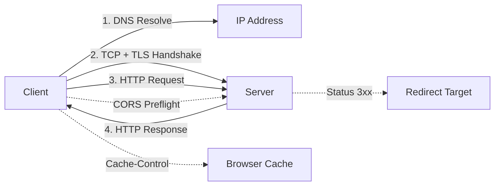

# HTTP — A 2-Day Crash Course

> Before you can debug a failing API, you need to understand what actually travels across the wire — this file gives you that foundation. Prereq: `DNS-curl-dig.md`.

---

## Part 0 — Why HTTP Matters

Every API call you make, every webhook you receive, every 502 you curse at — HTTP is underneath all of it. You can guess at problems for hours, or you can read the wire and know in seconds. The engineers who debug fastest are not smarter; they just understand what HTTP is doing at each step.

HTTP is a request/response protocol. A client sends a request; a server sends a response. That is the whole model. What makes it rich — and occasionally confusing — is the set of metadata fields, version differences, and layered behaviors (caching, auth, compression) built on top of that simple contract.

This is not exhaustive — it is the 20% that explains 80% of what you will encounter in production.



---

## Vocabulary

| Term | What it means |
|---|---|
| **Method** | The verb — what the client wants to do (GET, POST, PUT, DELETE, PATCH, HEAD, OPTIONS) |
| **Status Code** | The three-digit number in the response that tells you what happened (200, 404, 500, etc.) |
| **Header** | A key-value metadata field attached to a request or response — carries instructions, tokens, content type, caching rules |
| **Body** | The payload — the actual data sent with a request (e.g., JSON in a POST) or returned in a response |
| **URL** | The address — scheme + host + path + optional query string (e.g., `https://api.example.com/users?active=true`) |
| **Content-Type** | Header that declares the format of the body (`application/json`, `text/html`, `multipart/form-data`) |
| **Authorization** | Header used to carry credentials — typically `Bearer <token>` or `Basic <base64>` |
| **Cookie** | A small piece of state the server sets on the client, sent back automatically on subsequent requests |
| **Cache-Control** | Header that governs how responses are cached — by the browser, a CDN, or a reverse proxy |
| **CORS** | Cross-Origin Resource Sharing — a browser security mechanism that controls which origins can read responses from a different origin |
| **TLS** | Transport Layer Security — the cryptographic layer that makes HTTP into HTTPS; encrypts the wire |

---

## DAY 1 — The Basics

### HTTP Methods

Methods communicate intent. Servers are supposed to honor that intent, though nothing technically prevents a POST endpoint from deleting data. The contract is a convention, not enforcement.

| Method | Intended use | Idempotent? | Body? |
|---|---|---|---|
| GET | Retrieve a resource | Yes | No |
| POST | Create or submit | No | Yes |
| PUT | Replace a resource entirely | Yes | Yes |
| PATCH | Partial update | No | Yes |
| DELETE | Remove a resource | Yes | No |
| HEAD | Same as GET but no response body — useful for checking existence or cache freshness | Yes | No |
| OPTIONS | Ask what methods are allowed — used by browsers in CORS preflight | Yes | No |

Idempotent means: calling it N times has the same effect as calling it once. GET and DELETE are idempotent. POST is not — hitting "submit order" twice creates two orders.

### Status Codes

You do not need to memorize all 70+. You need to know the important ones well.

**2xx — Success**

| Code | Meaning | When you see it |
|---|---|---|
| 200 | OK | Standard success |
| 201 | Created | POST that created a resource; often includes a `Location` header pointing to the new resource |
| 204 | No Content | Success but no body — common for DELETE |
| 206 | Partial Content | Range request; used in video streaming and resumable downloads |

**3xx — Redirection**

| Code | Meaning | When you see it |
|---|---|---|
| 301 | Moved Permanently | URL has changed forever |
| 302 | Found (temporary redirect) | Temporary; often used in OAuth flows |
| 304 | Not Modified | Conditional GET hit the cache; no body returned |
| 307/308 | Temporary/Permanent Redirect | Method-preserving equivalents of 302/301 |

**4xx — Client Error**

| Code | Meaning | Common cause |
|---|---|---|
| 400 | Bad Request | Malformed JSON, missing required field, invalid parameter |
| 401 | Unauthorized | Missing or invalid credentials |
| 403 | Forbidden | Authenticated but not allowed |
| 404 | Not Found | Resource does not exist |
| 405 | Method Not Allowed | Called POST on a GET-only endpoint |
| 409 | Conflict | Duplicate resource, version conflict |
| 410 | Gone | Resource existed but was permanently deleted |
| 422 | Unprocessable Entity | Syntactically valid but semantically wrong (e.g., end date before start date) |
| 429 | Too Many Requests | Rate limited — check `Retry-After` header |

**5xx — Server Error**

| Code | Meaning | Common cause |
|---|---|---|
| 500 | Internal Server Error | Unhandled exception — check server logs |
| 502 | Bad Gateway | Upstream server returned invalid response — often a crashed app server behind a proxy |
| 503 | Service Unavailable | Server is overloaded or down for maintenance |
| 504 | Gateway Timeout | Upstream server took too long to respond |

### Headers

Headers are the metadata layer of HTTP. A request has headers; a response has headers; some (like `Content-Type`) appear in both.

Key request headers:

```
GET /api/users HTTP/1.1
Host: api.example.com
Authorization: Bearer eyJhbGciOi...
Accept: application/json
Content-Type: application/json
User-Agent: MyApp/1.0
```

Key response headers:

```
HTTP/1.1 200 OK
Content-Type: application/json; charset=utf-8
Content-Length: 1234
Cache-Control: max-age=300
ETag: "abc123"
X-Request-Id: 7f3d9a
```

- `Host` — required in HTTP/1.1; tells the server which virtual host is being addressed
- `Accept` — tells the server what format the client can handle
- `Content-Length` — byte size of the body; required for some proxies and servers to function correctly
- `X-Request-Id` — a convention (not a standard) for tracing requests across systems; always log this if present

### The Request/Response Lifecycle

1. Client resolves the hostname via DNS.
2. Client opens a TCP connection (and TLS handshake if HTTPS).
3. Client sends the HTTP request — method, path, version, headers, optional body.
4. Server processes the request.
5. Server sends the HTTP response — status line, headers, optional body.
6. Connection is closed or kept alive for reuse (`Connection: keep-alive`).

This cycle is the unit of work. Everything else is optimization or decoration.

### Reading with curl -v

`curl -v` shows you everything — the TLS handshake, request headers, response headers, and body. This is your primary debugging tool.

```bash
curl -v https://api.example.com/users \
  -H "Authorization: Bearer your-token" \
  -H "Accept: application/json"
```

Lines prefixed with `>` are what curl sends. Lines prefixed with `<` are what the server returns. Lines with `*` are informational (TLS info, connection state).

```
* Connected to api.example.com (93.184.216.34) port 443
* TLS handshake complete
> GET /users HTTP/2
> Host: api.example.com
> Authorization: Bearer your-token
>
< HTTP/2 200
< content-type: application/json
< cache-control: max-age=60
<
{"users":[...]}
```

Read `curl -v` output before you open a ticket. More often than not, the answer is in the response headers.

---

## DAY 2 — The Deeper Layer

### HTTPS and TLS Handshake

When you connect to an HTTPS URL, TLS runs before any HTTP is exchanged. The handshake:

1. Client sends `ClientHello` — supported TLS versions, cipher suites.
2. Server responds with `ServerHello` — chosen version and cipher, plus its certificate.
3. Client verifies the certificate (chain of trust to a trusted CA).
4. Key exchange — both sides derive the same session key without transmitting it directly (Diffie-Hellman or ECDHE).
5. Both sides confirm with a `Finished` message. Handshake done.
6. HTTP traffic flows, encrypted with the session key.

TLS 1.3 (current) collapses this to one round trip. TLS 1.2 required two. This matters for latency on first connection.

What this means for debugging: if you see `SSL certificate problem` or `certificate verify failed` in curl, the issue is at step 3. Use `curl -v --cacert yourca.pem` to supply a custom CA, or `-k` to skip verification in a test environment. ⚠️ Never use `-k` in production or in scripts that run against real infrastructure.

### HTTP/2 and HTTP/3

**HTTP/1.1** sends one request per connection at a time (pipelining existed but was broken in practice). To get parallelism, browsers opened 6–8 connections per host.

**HTTP/2** introduced multiplexing — multiple streams over a single TCP connection. One connection, many concurrent requests, no head-of-line blocking at the HTTP layer.

Other HTTP/2 features:
- **Header compression** (HPACK) — repeated headers like `Authorization` are not re-sent in full
- **Server push** — server can proactively send resources the client will need
- **Binary framing** — not human-readable like HTTP/1.1; use Wireshark or `nghttp2` to inspect

**HTTP/3** replaces TCP with QUIC (UDP-based). Key benefit: eliminates TCP-level head-of-line blocking. If a packet is lost, only the affected stream stalls — not all streams. Also improves connection establishment on unreliable networks.

In practice: most CDNs and major APIs support HTTP/2. HTTP/3 is increasingly common but not universal. Your application code does not usually need to handle this explicitly — the TLS library and HTTP client handle negotiation via ALPN (Application-Layer Protocol Negotiation).

Check what version you are using:

```bash
curl -I --http2 https://example.com
# Look for "HTTP/2" in the response line
```

### CORS

CORS is a browser security feature. It does not protect your server — it protects users from malicious websites reading responses from your API using the user's credentials.

The rule: a browser script at `https://app.example.com` making a request to `https://api.other.com` is cross-origin. The browser will block the response unless `api.other.com` explicitly allows it via response headers.

For simple requests (GET, POST with `application/x-www-form-urlencoded`), the browser makes the request and then checks the response headers.

For non-simple requests (POST with `application/json`, DELETE, custom headers), the browser first sends an **OPTIONS preflight** to ask for permission:

```
OPTIONS /api/data HTTP/1.1
Origin: https://app.example.com
Access-Control-Request-Method: POST
Access-Control-Request-Headers: Content-Type, Authorization
```

The server must respond with:

```
HTTP/1.1 204 No Content
Access-Control-Allow-Origin: https://app.example.com
Access-Control-Allow-Methods: POST, GET, DELETE
Access-Control-Allow-Headers: Content-Type, Authorization
Access-Control-Max-Age: 86400
```

Common CORS debugging pattern: if a request works in curl but fails in the browser, check the DevTools Network tab for a failed OPTIONS preflight. The server is either not handling OPTIONS or returning the wrong `Access-Control-Allow-Origin` header.

`Access-Control-Allow-Origin: *` allows any origin but cannot be used with credentialed requests (cookies or `Authorization` headers). For those, you must specify the exact origin and add `Access-Control-Allow-Credentials: true`.

### Caching

Caching saves bandwidth and reduces latency. Understanding it saves you from hours of debugging stale data.

**Cache-Control directives** (response header):

| Directive | Meaning |
|---|---|
| `max-age=N` | Cache for N seconds |
| `no-store` | Do not cache at all |
| `no-cache` | Cache but revalidate with the server before using |
| `private` | Only the user's browser can cache it — not a CDN |
| `public` | CDNs and proxies may cache it |
| `immutable` | Content will never change; skip revalidation |
| `s-maxage=N` | Like max-age but only for shared caches (CDNs) |

**ETag and conditional requests:**

The server sends an `ETag` header — a fingerprint of the response body:

```
HTTP/1.1 200 OK
ETag: "d4e8a7f3"
Cache-Control: no-cache
```

On the next request, the client sends:

```
GET /api/users HTTP/1.1
If-None-Match: "d4e8a7f3"
```

If the resource has not changed, the server returns `304 Not Modified` with no body. The client uses its cached copy. This saves bandwidth without serving stale data.

`Last-Modified` / `If-Modified-Since` works the same way but uses a timestamp instead of a hash. ETags are more reliable — timestamps can be imprecise in edge cases.

### Cookies

The server sets a cookie with `Set-Cookie`:

```
Set-Cookie: session=abc123; Path=/; HttpOnly; Secure; SameSite=Lax; Max-Age=3600
```

Key attributes: `HttpOnly` — JS cannot read it (XSS mitigation). `Secure` — HTTPS only. `SameSite=Lax` — not sent on cross-site subrequests (CSRF mitigation). `SameSite=None; Secure` — required for third-party cookies. Omit `Max-Age`/`Expires` and it is a session cookie, gone when the browser closes.

Cookies are sent automatically on every matching request. This is why CSRF is a risk and why `SameSite` exists.

### Auth Patterns

| Pattern | Header | Notes |
|---|---|---|
| Basic Auth | `Authorization: Basic <base64>` | Only safe over HTTPS; base64 is not encryption |
| Bearer Token | `Authorization: Bearer <JWT>` | Stateless; server verifies claims without a DB lookup |
| API Key | `X-API-Key: sk-live-abc123` | Use a header, not a query param — query params appear in logs |
| OAuth2 | `Authorization: Bearer <access-token>` | Short-lived access token + long-lived refresh token |

A 401 means the token is missing or invalid. A 403 means valid token, wrong permissions. Different problems — different fixes.

### Compression

Client advertises support: `Accept-Encoding: gzip, br, deflate`. Server compresses and declares: `Content-Encoding: gzip`. Decompression is transparent — curl and HTTP clients handle it.

Gzip is universal. Brotli (`br`) compresses better and is supported by all modern browsers and most CDNs.

⚠️ Do not compress already-compressed content (images, video, zips). It wastes CPU and often increases size.

### Rate Limiting

When you exceed a server's request quota you get `429 Too Many Requests`. Common response headers:

```
Retry-After: 30
X-RateLimit-Limit: 1000
X-RateLimit-Remaining: 0
X-RateLimit-Reset: 1717200000
```

Always respect `Retry-After`. Implement exponential backoff with jitter — start at 1s, double each attempt, add random jitter, cap at a maximum. Never fixed-interval retry.

---

## Worked Example — Debugging a Failing API Integration

You are integrating with a third-party payments API. Your code calls `POST /payments` with a JSON body and gets a `422 Unprocessable Entity` back. No useful message in your app logs.

**Step 1 — Reproduce with curl -v**

```bash
curl -v -X POST https://api.payments.example.com/payments \
  -H "Authorization: Bearer $API_KEY" \
  -H "Content-Type: application/json" \
  -d '{"amount": 5000, "currency": "usd", "customer_id": "cus_abc"}'
```

**Step 2 — Read the response body**

```json
{
  "error": "validation_failed",
  "field": "amount",
  "message": "amount must be an integer representing cents"
}
```

The body told you the answer. `5000` is being sent as a JSON number representing dollars, but the API expected `500000` (cents). Fix the value.

**Step 3 — Check headers if the body is not helpful**

- `X-Request-Id` — give this to the vendor; they can look up the request server-side
- `WWW-Authenticate` — on a 401, tells you what auth scheme is expected
- `Content-Type` in the response — if it is `text/html` when you expected `application/json`, a proxy or WAF is intercepting

**Step 4 — CORS (browser only)**

Open DevTools → Network tab. Failed OPTIONS preflight before your request? The issue is server-side CORS configuration, not your request logic.

**Step 5 — TLS**

```bash
curl -v https://api.payments.example.com 2>&1 | grep -E "SSL|TLS|cert"
```

Certificate errors usually mean a custom CA (corporate proxy) or an expired cert on the server.

---

## Pitfalls

**Confusing 401 and 403.** 401 = "who are you?" — no or invalid credentials. 403 = "I know who you are, but no." Different failures, different fixes.

**HTTP vs HTTPS.** Cookies with `Secure` are not sent over HTTP. Tokens in plaintext over HTTP. Always use HTTPS, including staging.

**Missing `Content-Type` on requests.** JSON without `Content-Type: application/json` will be rejected or misparsed by many servers.

**CDN caching surprises.** `Cache-Control: public, max-age=3600` means a CDN may serve a stale response for an hour after you deploy a fix. Use `s-maxage=0` to override CDN caching independently of the browser.

**No trace IDs in logs.** Without `X-Request-Id`, correlating client errors to server logs is guesswork. Log it on every layer.

**Retrying without backoff.** Hammering a 429 or 503 endpoint with immediate retries makes the outage worse. Exponential backoff with jitter, always.

**Secrets in query params.** Query strings appear in access logs, browser history, and referrer headers. Put credentials in headers.

**CORS as a security boundary.** CORS only constrains browsers. curl and server-to-server calls ignore it entirely. Use authentication to restrict access — not CORS.

---

## Quick Reference

### curl Commands

```bash
# GET with auth, pipe to jq
curl -s https://api.example.com/users \
  -H "Authorization: Bearer $TOKEN" | jq .

# POST JSON
curl -X POST https://api.example.com/users \
  -H "Content-Type: application/json" \
  -H "Authorization: Bearer $TOKEN" \
  -d '{"name": "Alice", "email": "alice@example.com"}'

# PATCH / DELETE
curl -X PATCH https://api.example.com/users/42 \
  -H "Content-Type: application/json" \
  -H "Authorization: Bearer $TOKEN" \
  -d '{"email": "newalice@example.com"}'
curl -X DELETE https://api.example.com/users/42 \
  -H "Authorization: Bearer $TOKEN"

# Headers only / follow redirects / timeouts
curl -sI https://api.example.com/users
curl -L https://short.url/abc
curl --connect-timeout 10 --max-time 30 https://api.example.com/slow

# Upload a file
curl -X POST https://api.example.com/upload \
  -H "Authorization: Bearer $TOKEN" \
  -F "file=@/path/to/file.pdf"

# Verbose — shows TLS, request headers, response headers
curl -v https://api.example.com/users 2>&1 | less

# Inspect certificate
curl -v https://api.example.com 2>&1 | grep -E "subject|issuer|expire"

# Custom CA bundle (corporate proxy / internal PKI)
curl --cacert /path/to/custom-ca.pem https://internal.api.corp

# Conditional GET using ETag
curl -H 'If-None-Match: "d4e8a7f3"' https://api.example.com/users

# Force HTTP version
curl --http2 https://api.example.com/
curl --http1.1 https://api.example.com/
```

### Status Code Cheatsheet

```
200 OK            201 Created       204 No Content    304 Not Modified
400 Bad Request   401 Unauthorized  403 Forbidden     404 Not Found
405 Wrong Method  409 Conflict      422 Bad Semantics 429 Rate Limited
500 Server Bug    502 Bad Gateway   503 Unavailable   504 Timeout
```

Full details in the DAY 1 tables above.

---

## Top 10 Interview Questions

<details>
<summary><strong>Q: What is the difference between HTTP/1.1, HTTP/2, and HTTP/3?</strong></summary>

HTTP/1.1 sends one request per connection at a time and relies on multiple connections for parallelism. HTTP/2 multiplexes many streams over a single TCP connection, adds header compression (HPACK), and uses binary framing. HTTP/3 replaces TCP with QUIC (UDP-based), eliminating TCP-level head-of-line blocking so a lost packet only stalls the affected stream. Each version improves latency and efficiency, especially on unreliable networks.

</details>

<details>
<summary><strong>Q: Explain the difference between 401 and 403 status codes.</strong></summary>

401 Unauthorized means the request lacks valid credentials -- the server does not know who the client is. 403 Forbidden means the server knows who the client is (authentication succeeded) but the client does not have permission to access the resource. The fix for 401 is to provide or fix credentials; the fix for 403 is to change the client's permissions or role.

</details>

<details>
<summary><strong>Q: How does CORS work, and why does it only affect browsers?</strong></summary>

CORS is a browser security feature that blocks scripts on one origin from reading responses from a different origin unless the server explicitly allows it via `Access-Control-Allow-Origin` headers. For non-simple requests, the browser sends an OPTIONS preflight first. Server-to-server calls and curl ignore CORS entirely because it is enforced by the browser, not the network. CORS protects users from malicious websites, not servers from unauthorised access.

</details>

<details>
<summary><strong>Q: What is an ETag and how does conditional caching work?</strong></summary>

An ETag is a fingerprint of a response body sent by the server. On subsequent requests, the client sends `If-None-Match` with the cached ETag. If the resource has not changed, the server returns 304 Not Modified with no body -- the client reuses its cached copy. This saves bandwidth without serving stale data. ETags are more reliable than `Last-Modified` timestamps because they detect content changes precisely.

</details>

<details>
<summary><strong>Q: When would you use PUT vs PATCH, and what does idempotency mean in this context?</strong></summary>

PUT replaces a resource entirely -- you send the complete new representation. PATCH applies a partial update -- you send only the fields that changed. PUT is idempotent (calling it N times produces the same result), while PATCH is not guaranteed to be idempotent. In practice, use PUT when the client owns the full resource state, and PATCH when updating a single field to avoid overwriting concurrent changes.

</details>

<details>
<summary><strong>Q: How does the TLS handshake work, and what changed between TLS 1.2 and 1.3?</strong></summary>

The handshake establishes a secure channel: the client sends supported cipher suites, the server responds with its certificate and chosen cipher, the client verifies the certificate chain, and both sides derive a session key via key exchange. TLS 1.3 reduces this from two round trips to one by combining the key exchange and server parameters into a single flight, which meaningfully reduces first-connection latency.

</details>

<details>
<summary><strong>Q: What is the difference between `Cache-Control: no-cache` and `no-store`?</strong></summary>

`no-store` means the response must never be stored anywhere -- not in the browser cache, not in a CDN. `no-cache` means the response can be cached, but the client must revalidate with the server (via ETag or Last-Modified) before using the cached copy. Use `no-store` for sensitive data (banking responses). Use `no-cache` when you want cache efficiency but need freshness guarantees.

</details>

<details>
<summary><strong>Q: Why should API keys be sent in headers rather than query parameters?</strong></summary>

Query parameters appear in server access logs, browser history, referrer headers sent to third-party resources, and CDN logs. A key in the URL is effectively leaked to every system that logs the request. Placing credentials in the `Authorization` or a custom header (e.g., `X-API-Key`) keeps them out of URLs and ensures they are only visible in the request headers, which are not logged by default.

</details>

<details>
<summary><strong>Q: Explain how to debug a 502 Bad Gateway error.</strong></summary>

A 502 means the proxy or load balancer received an invalid response from the upstream server. First, check if the upstream application is running at all. Then check the proxy's error logs (Nginx: `/var/log/nginx/error.log`) for the specific upstream failure reason -- crashed process, timeout, or malformed response. Use `curl -v` directly against the upstream to isolate whether the issue is the app or the proxy configuration. Common causes: app crashed, upstream timeout too short, or connection refused.

</details>

<details>
<summary><strong>Q: How does exponential backoff with jitter work, and why is it important for retries?</strong></summary>

Exponential backoff doubles the wait time between retries (1s, 2s, 4s, 8s). Jitter adds randomness to each interval so that many clients retrying simultaneously do not all hit the server at the same instant (thundering herd problem). Without jitter, coordinated retries create periodic traffic spikes that can repeatedly overwhelm a recovering service. Cap the maximum wait time and always respect the `Retry-After` header if present.

</details>

---

## Next Steps

- `DNS-curl-dig.md` — understand what happens before the TCP connection even opens
- `Nginx.md` — configure reverse proxies, CORS headers, TLS termination, and rate limiting at the edge
- `jq.md` — parse and filter the JSON bodies you are now confidently fetching

---

## Recommended learning resources

**YouTube channels & playlists:**
- [Hussein Nasser — HTTP playlist](https://www.youtube.com/@haboread) — deep dives on HTTP/1.1, HTTP/2, HTTP/3, keep-alive, head-of-line blocking, and TLS handshakes
- [Computerphile — HTTP and the Web](https://www.youtube.com/@Computerphile) — clear visual explanations of request/response, caching, and how the web works at the protocol level
- [Fireship — HTTP in 100 Seconds](https://www.youtube.com/@Fireship) — fast conceptual primer covering methods, status codes, and the evolution from HTTP/1 to HTTP/3
- [PowerCert Animated Videos — HTTP vs HTTPS](https://www.youtube.com/@PowerCertAnimatedVideos) — animated walkthrough of TLS, certificates, and why HTTPS matters
- [NetworkChuck — HTTP Deep Dive](https://www.youtube.com/@NetworkChuck) — hands-on demonstration of HTTP requests with curl and browser developer tools

**Official docs & blogs:**
- [MDN Web Docs — HTTP](https://developer.mozilla.org/en-US/docs/Web/HTTP) — the most thorough reference for methods, headers, status codes, caching, CORS, and content negotiation
- [Julia Evans — HTTP Zine](https://jvns.ca/) — approachable illustrated guide to HTTP requests, responses, and debugging
- [curl Documentation — HTTP Protocol](https://everything.curl.dev/http) — practical HTTP reference from the perspective of the tool you will use most

---

## The Mantra

> Read the wire before you read the code. The response headers tell you what happened; the status code tells you who is responsible; the body tells you why. `curl -v` costs you ten seconds and saves you an hour.
