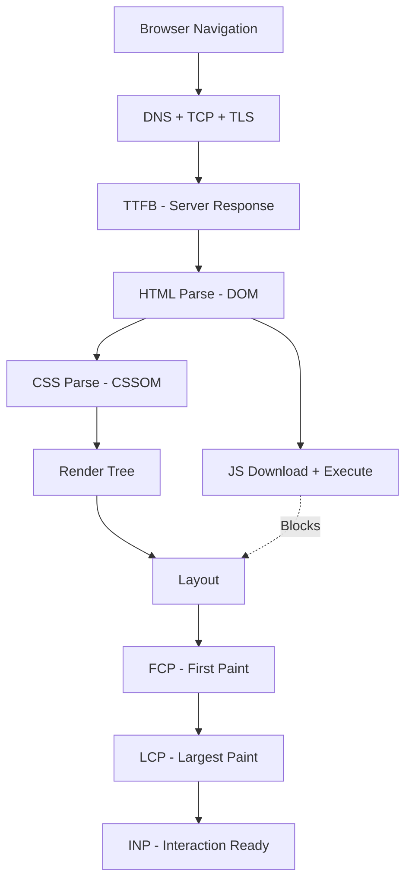

# Web Performance — A 2-Day Crash Course

Web performance is the practice of making websites fast — Core Web Vitals, TTFB, Lighthouse audits, and the optimizations that turn a 5-second load into a 1-second load.

**Prerequisite:** `HTTP.md` — you need to understand request/response cycles, headers, and caching before this makes full sense.

---

## Part 0 — Why This Matters

Slow sites lose users and revenue. That's not a soft claim — it's measured.

Google has ranked pages by performance since 2021 via Core Web Vitals as a direct ranking signal. A page that loads in 1 second converts at roughly 3× the rate of one that takes 5 seconds. Users on mobile networks abandon after 3 seconds of waiting. These numbers repeat across industries because they reflect human attention, not niche behavior.

Performance is a feature. It is not polish you apply after shipping. A product that works but feels sluggish fails at the same place a product that crashes fails — user trust. The engineer who treats performance as an afterthought ships technical debt with a user-visible cost.

The good news: most sites are not optimized. A typical new project starts around Lighthouse 30–50. Getting to 90+ is straightforward once you know the levers.



---

## Vocabulary

**Core Web Vitals** — Google's three metrics for user experience: LCP, INP, and CLS. These are the metrics that feed into search ranking.

**LCP (Largest Contentful Paint)** — How long until the largest visible element (hero image, heading) is rendered. Measures perceived load speed.

**INP (Interaction to Next Paint)** — How quickly the page responds to user input. Replaced FID in 2024. Measures interactivity.

**CLS (Cumulative Layout Shift)** — How much the page layout jumps around during load. Measures visual stability.

**TTFB (Time to First Byte)** — Time from request sent to first byte received from the server. Measures server and network latency before the browser does anything.

**FCP (First Contentful Paint)** — Time until the first DOM element (text, image) is painted. Earlier than LCP.

**Lighthouse** — Google's automated auditing tool built into Chrome DevTools. Scores pages 0–100 across Performance, Accessibility, Best Practices, and SEO.

**Waterfall Chart** — A visual timeline of every network request a page makes, showing when each starts, how long it takes, and what it is waiting on.

**Critical Rendering Path** — The sequence of steps the browser takes to render a page: HTML parse → DOM → CSSOM → Render Tree → Layout → Paint. Blocking resources anywhere in this chain delay everything after.

**Lazy Loading** — Deferring the load of off-screen resources (images, components) until the user scrolls near them.

**CDN (Content Delivery Network)** — A geographically distributed network of servers that cache and serve your static assets from locations close to users.

**Image Optimization** — Serving images at the right format, size, and quality for each device and viewport.

**Bundle Size** — The total JavaScript or CSS sent to the browser. Larger bundles mean longer parse and execution time.

---

## Day 1

### Core Web Vitals — What Each Measures

**LCP** targets the hero content. It measures the time from navigation start until the largest element in the viewport — typically a hero image, above-the-fold heading, or video poster — is fully rendered.

Good: under 2.5 seconds. Needs improvement: 2.5–4 seconds. Poor: over 4 seconds.

The most common LCP killers are render-blocking resources that delay the browser from starting to paint, unoptimized hero images that take too long to download, and server-side latency showing up as a high TTFB before the browser even requests the image.

**INP** replaced First Input Delay in March 2024. It measures the full interaction latency — from user gesture (click, tap, keypress) to the next frame being painted — across all interactions during a page visit, then reports near the worst case.

Good: under 200ms. Needs improvement: 200–500ms. Poor: over 500ms.

INP problems are almost always JavaScript problems. Long tasks on the main thread block the browser from responding. A 300ms click handler, synchronous localStorage access, or a heavy third-party script all push INP up.

**CLS** measures unexpected layout shifts. Every time an element moves during load — a late-loading font causes text reflow, an image without dimensions causes content to jump, an ad injects above existing content — the shift is scored and accumulated.

Good: under 0.1. Needs improvement: 0.1–0.25. Poor: over 0.25.

CLS fixes are usually straightforward: set explicit width and height on images, reserve space for ads and embeds, avoid injecting content above existing DOM nodes.

---

### Measuring Performance

You have four primary tools. Use them in combination.

**Lighthouse** runs in Chrome DevTools (Cmd+Option+I → Lighthouse tab) or via the CLI (`npm install -g lighthouse && lighthouse https://example.com`). It runs a throttled, simulated mobile session and gives you a score with specific recommendations. Fast to run, good for development feedback.

**WebPageTest** (webpagetest.org) runs real browsers on real devices from real geographic locations. It shows you waterfall charts, filmstrip views (screenshots at each 100ms interval), and more diagnostic data than Lighthouse. Use it when you want to understand what a user in Frankfurt or Singapore actually experiences.

**Chrome DevTools** — the Performance tab records a full trace of browser activity: main thread work, JavaScript execution, layout events, paint operations. When you have a high INP or jank, this is where you find the cause. The Network tab shows you the waterfall. The Coverage tab shows you unused JavaScript and CSS.

**RUM vs Synthetic:**

Synthetic monitoring (Lighthouse, WebPageTest) runs controlled tests. The results are reproducible and comparable, but they don't capture what real users with diverse devices, networks, and browser extensions experience.

Real User Monitoring (RUM) collects performance data from actual page loads. Tools like Google Analytics 4, Cloudflare Web Analytics, Sentry Performance, and Datadog RUM send Core Web Vitals from real sessions. RUM catches issues that synthetic testing misses — a slow third-party script that only fires in production, performance that degrades under load.

Use synthetic for development iteration. Use RUM to understand your actual user population.

---

### Reading the Waterfall Chart

Open DevTools → Network tab → reload the page. You'll see a row per request, with a colored bar showing timing.

The bar has segments:

- **DNS Lookup** — resolving the hostname. Should be near-zero for repeat visits.
- **Initial Connection** — TCP handshake. HTTPS adds TLS negotiation on top.
- **TTFB** — the white gap between sending the request and receiving the first byte. This is server processing time plus network round-trip.
- **Content Download** — how long to receive the full response body.

Finding bottlenecks:

A wide TTFB on the HTML document means your origin server is slow, or your CDN is not caching it. A chain of sequential requests means your HTML depends on a resource that depends on another resource — serialize these and the browser is stuck waiting. A large gap before a request starts means something else had to finish first (a render-blocking script, a CSS file).

Look for the "waterfall" pattern — requests that cannot start until others finish. Each of those chains adds latency directly to your load time. The goal is to parallelize as many requests as possible.

---

### TTFB Optimization

TTFB is the earliest point where you can save time. Before the browser has received the first byte, it cannot parse HTML, discover resources, or start rendering anything.

**Server response time** — if your origin takes 800ms to respond, that's 800ms of user waiting before anything happens. Profile your server: slow database queries, N+1 query patterns, unindexed lookups, and synchronous calls to external APIs all show up here. Target under 200ms for your origin response time.

**CDN caching** — put a CDN in front of your origin. For cacheable HTML pages (marketing pages, documentation), serve them from CDN edge nodes. The latency difference between a server in us-east-1 and a CDN edge node in Frankfurt is 150–200ms for a user in Germany.

**Cache-Control on HTML** — most engineers cache images and JS aggressively but forget that HTML can also be cached. A short TTL (60–300 seconds) on semi-static pages dramatically reduces TTFB for returning visitors.

**Edge computing** — platforms like Cloudflare Workers let you run server logic at CDN edge nodes. If your TTFB is high because you're doing server-side rendering at a single origin, moving rendering to the edge brings your origin latency to every user.

---

## Day 2

### Image Optimization

Images are typically the largest assets on a page and the most common LCP bottleneck.

**Formats:**

Use WebP for photographs and complex images — typically 25–35% smaller than JPEG at equivalent quality. Use AVIF where browser support allows — 50% smaller than JPEG, but encoding is slow and support is still catching up. Use SVG for icons, logos, and illustrations. Never use PNG for photographs.

```html
<picture>
  <source srcset="hero.avif" type="image/avif">
  <source srcset="hero.webp" type="image/webp">
  
</picture>
```

Always include explicit `width` and `height` attributes on `` elements — this lets the browser reserve space before the image loads, preventing CLS.

**Responsive images:**

Never serve a 2000px image to a 400px mobile viewport. Use `srcset` and `sizes`:

```html

```

**Lazy loading:**

Add `loading="lazy"` to all images below the fold. The browser will defer fetching them until the user scrolls near them.

```html

```

⚠️ Never apply lazy loading to your LCP image — it will delay the metric you're trying to improve.

---

### JavaScript Optimization

JavaScript is the most expensive resource per byte. A 100KB image and a 100KB JavaScript file are not equal: the JS must be parsed, compiled, and executed.

**Code splitting** — instead of shipping one large bundle, split your JavaScript into chunks that load on demand. React's `React.lazy()`, Next.js's automatic page-level splitting, and Webpack/Vite's dynamic imports all do this. Users on your homepage don't need your checkout code.

**Tree shaking** — modern bundlers (Webpack, Rollup, Vite) eliminate unused exports at build time. This works only with ES module syntax (`import`/`export`), not CommonJS (`require`). Audit your bundle with tools like `webpack-bundle-analyzer` or `vite-bundle-visualizer` to find large dependencies you're not fully using.

**defer and async:**

```html
<!-- Blocks HTML parsing — avoid for non-critical scripts -->
<script src="app.js"></script>

<!-- Downloads in parallel, executes after HTML parses — use for most scripts -->
<script src="app.js" defer></script>

<!-- Downloads in parallel, executes immediately when ready — use for independent scripts -->
<script src="analytics.js" async></script>
```

For your main application bundle, use `defer`. For independent third-party scripts (analytics, chat widgets), use `async`.

**Third-party scripts** are often the real culprit behind high INP. A chat widget that loads 500KB of JS and runs long tasks on the main thread will tank your performance score regardless of how optimized your own code is. Audit every third-party script. Remove ones you don't use. Load critical ones with `async` and non-critical ones only after the page is interactive.

---

### CSS Optimization

**Critical CSS** is the CSS needed to render above-the-fold content. Extract it, inline it in `<style>` tags in `<head>`, and load the rest of your stylesheet asynchronously:

```html
<style>/* critical above-fold styles inlined here */</style>
<link rel="preload" href="styles.css" as="style" onload="this.onload=null;this.rel='stylesheet'">
<noscript><link rel="stylesheet" href="styles.css"></noscript>
```

**Removing unused CSS** — tools like PurgeCSS scan your HTML and JS for class names and remove anything not referenced. A Tailwind project without PurgeCSS ships 3MB of CSS. With it: 10KB.

Avoid large CSS-in-JS libraries that generate styles at runtime — they delay rendering and increase main thread work.

---

### Caching Strategy

**Cache-Control headers:**

```
# Immutable assets with content hashes in filename — cache forever
Cache-Control: public, max-age=31536000, immutable

# HTML pages — short cache, revalidate
Cache-Control: public, max-age=300, stale-while-revalidate=86400

# API responses — no public cache
Cache-Control: private, no-cache
```

Name your hashed assets with content hashes in the filename (`app.3f2a8b.js`). This lets you set long cache TTLs safely — when the file changes, the filename changes, and cache busting happens automatically.

**Service workers** let you control caching at the browser level. A service worker can pre-cache your app shell on install, serve cached responses instantly while revalidating in the background (stale-while-revalidate pattern), and make your app work offline. Workbox (from Google) gives you a high-level API for common service worker caching strategies without writing low-level fetch event handlers.

---

### CDN Configuration

A CDN does three things: caches your assets at edge locations, terminates TLS closer to users, and absorbs traffic spikes without touching your origin.

Configure your CDN to:

- Cache static assets (JS, CSS, images) at the edge with long TTLs
- Pass Cache-Control headers from your origin, or set override rules per path pattern
- Enable Brotli compression at the edge
- Use HTTP/2 or HTTP/3 to multiplex requests over a single connection

Most CDNs (Cloudflare, Fastly, CloudFront) have a concept of cache rules or page rules where you define behavior per URL pattern. Set aggressive caching for `/static/*` and short or no caching for `/api/*`.

---

### Compression

**Brotli** compresses 15–20% better than gzip at comparable CPU cost. All modern browsers support it. Enable it on your server or CDN. In Nginx:

```nginx
brotli on;
brotli_comp_level 6;
brotli_types text/plain text/css application/javascript application/json image/svg+xml;
```

If Brotli is not available, gzip is still a major win over uncompressed. Never serve uncompressed text assets.

---

### Font Loading

Fonts block text rendering. A page that loads a 200KB WOFF2 file before painting text will show a flash of invisible text (FOIT) or a flash of unstyled text (FOUT).

Use `font-display: swap` in your `@font-face` declaration — this tells the browser to render text with a fallback font immediately and swap in the web font when it loads:

```css
@font-face {
  font-family: 'Inter';
  src: url('inter.woff2') format('woff2');
  font-display: swap;
}
```

Preload your primary font file so the browser discovers it early:

```html
<link rel="preload" href="/fonts/inter.woff2" as="font" type="font/woff2" crossorigin>
```

Use variable fonts where possible — one file for all weights and styles instead of separate files per variant.

---

### Resource Hints

Tell the browser what to do before it needs to do it.

**preload** — fetch this resource immediately, with high priority. Use for LCP images, critical fonts, and assets discovered late in the render chain:

```html
<link rel="preload" href="hero.webp" as="image">
<link rel="preload" href="inter.woff2" as="font" type="font/woff2" crossorigin>
```

**prefetch** — fetch this resource at low priority for likely future navigation. Use for next-page assets:

```html
<link rel="prefetch" href="/checkout/bundle.js" as="script">
```

**preconnect** — establish a connection (DNS + TCP + TLS) to an origin early, before you request anything from it. Use for critical third-party origins:

```html
<link rel="preconnect" href="https://fonts.googleapis.com">
<link rel="preconnect" href="https://cdn.example.com" crossorigin>
```

⚠️ Do not preconnect to every third-party domain — each connection consumes bandwidth. Limit preconnect to 2–3 critical origins.

---

### Monitoring in Production

Lighthouse tells you how a page performs in a controlled test. RUM tells you how it performs for your actual users.

**Performance budgets** — define maximum thresholds for key metrics and fail your CI build if you exceed them. Lighthouse CI (`lhci`) integrates into GitHub Actions and blocks deploys when performance regresses.

```yaml
# lighthouserc.js
module.exports = {
  assert: {
    assertions: {
      'first-contentful-paint': ['error', { maxNumericValue: 2000 }],
      'largest-contentful-paint': ['error', { maxNumericValue: 2500 }],
      'cumulative-layout-shift': ['error', { maxNumericValue: 0.1 }],
    },
  },
};
```

**RUM tools** — the `web-vitals` npm package lets you capture CWV from real sessions and send them to your analytics pipeline:

```js
import { onLCP, onINP, onCLS } from 'web-vitals';

onLCP(metric => sendToAnalytics(metric));
onINP(metric => sendToAnalytics(metric));
onCLS(metric => sendToAnalytics(metric));
```

Google Search Console's Core Web Vitals report shows field data aggregated from Chrome users — it's often your best view of real-world performance across your entire site.

---

## Worked Example — Landing Page from Lighthouse 35 to 95

Starting point: a marketing landing page scoring Lighthouse 35. TTFB 1.8s, LCP 6.2s, CLS 0.34, INP 380ms.

**Step 1 — Fix CLS first (quickest win).**

Audit the waterfall filmstrip. Two images have no `width`/`height` attributes — they cause layout shift when loaded. A Google Fonts stylesheet loads 800ms in and pushes content down. Add explicit dimensions to all images. Switch to `font-display: swap`. Add `rel="preconnect"` for the fonts origin.

Result: CLS drops from 0.34 to 0.04.

**Step 2 — Reduce TTFB.**

The server is doing SSR with a cold database connection on every request. Add edge caching for the marketing page (no user-specific content). Static content served from CDN edge.

Result: TTFB drops from 1.8s to 220ms.

**Step 3 — Fix LCP.**

The LCP element is a 2.4MB JPEG hero image. Convert to WebP (380KB). Add `rel="preload"` for the hero image. Remove `loading="lazy"` that was incorrectly applied to it.

Result: LCP drops from 6.2s to 1.9s.

**Step 4 — Reduce JavaScript.**

Bundle analyzer shows `moment.js` (280KB) included via a date formatting utility that only runs on one page. Replace with a tree-shaken `date-fns` import (4KB). Move analytics and chat widget scripts to `async` load after page interactive.

Result: main thread unblocks. INP drops from 380ms to 95ms.

**Step 5 — Enable Brotli and long-cache headers.**

Configure Nginx to serve Brotli for text assets. Add `immutable` cache headers for hashed JS/CSS files. Add `stale-while-revalidate` for HTML.

Result: repeat-visit loads drop from 2.1s to 0.4s.

**Final score: Lighthouse 93.** TTFB 220ms, LCP 1.9s, CLS 0.04, INP 95ms.

The gains came in this order: layout stability, server latency, image size, JavaScript weight, caching. That order is typical.

---

## Pitfalls

**Optimizing Lighthouse score instead of real user experience.** Lighthouse runs on a simulated throttled device. A score of 95 on Lighthouse with 500ms INP for real users on low-end Android phones means you optimized the wrong thing. Always pair synthetic with RUM.

**Lazy loading the LCP image.** This is a common mistake. The `loading="lazy"` attribute delays resource discovery. On your hero image it directly increases your LCP metric.

**Preloading too many resources.** Preload hints tell the browser to fetch resources at high priority. If you preload 10 things, you've created a traffic jam. Preload 1–3 critical resources maximum.

**Not setting image dimensions.** Every `` without explicit `width` and `height` is a potential CLS event. Make this a code review checklist item.

**Third-party scripts as an afterthought.** A tag manager that loads 8 marketing scripts can add 2–3 seconds to your load time and 200ms to your INP. Treat third-party JavaScript with the same scrutiny as your own.

**Cache invalidation gaps.** If you set aggressive caching on HTML without content hashes in filenames, a deploy will serve stale HTML pointing to old JS/CSS. Always use content hashes for versioned assets and separate your caching strategy for HTML vs assets.

**Over-inlining critical CSS.** Inlining 50KB of "critical" CSS defeats the purpose. Critical CSS should be the minimal styles for above-fold rendering — typically 5–15KB. Use tools like Critical or Critters to extract it programmatically.

---

## Quick Reference

### Core Web Vitals Targets

| Metric | Good | Needs Improvement | Poor |
|--------|------|-------------------|------|
| LCP | < 2.5s | 2.5–4s | > 4s |
| INP | < 200ms | 200–500ms | > 500ms |
| CLS | < 0.1 | 0.1–0.25 | > 0.25 |
| TTFB | < 800ms | 800ms–1.8s | > 1.8s |
| FCP | < 1.8s | 1.8–3s | > 3s |

### Optimization Checklist

- [ ] Hero image in WebP or AVIF format
- [ ] All images have explicit `width` and `height`
- [ ] LCP image is preloaded — not lazy loaded
- [ ] Below-fold images use `loading="lazy"`
- [ ] JavaScript bundle analyzed for unused dependencies
- [ ] `defer` on main bundle scripts, `async` on independent third-party scripts
- [ ] Unused CSS removed (PurgeCSS or equivalent)
- [ ] Critical CSS inlined; rest loaded asynchronously
- [ ] Fonts use `font-display: swap`
- [ ] Primary font preloaded
- [ ] Brotli or gzip compression enabled
- [ ] Long-lived `Cache-Control` with `immutable` on hashed assets
- [ ] HTML has short TTL with `stale-while-revalidate`
- [ ] CDN in front of origin for static assets
- [ ] TTFB under 800ms (target under 200ms)
- [ ] `preconnect` for 2–3 critical third-party origins
- [ ] RUM instrumented in production
- [ ] Performance budget enforced in CI

### Lighthouse Categories

| Category | What It Audits |
|----------|----------------|
| Performance | Load speed, CWV, resource efficiency |
| Accessibility | ARIA, contrast, keyboard navigation |
| Best Practices | HTTPS, deprecated APIs, console errors |
| SEO | Meta tags, crawlability, mobile-friendliness |

---

## Top 10 Interview Questions

<details>
<summary><strong>Q: What are Core Web Vitals, and why do they matter for search ranking?</strong></summary>

Core Web Vitals are three Google metrics: LCP (load speed -- largest element rendered under 2.5s), INP (interactivity -- input-to-paint under 200ms), and CLS (visual stability -- layout shift under 0.1). Since 2021, Google uses these as a direct ranking signal. Poor scores push pages down in search results, which makes performance a business concern beyond just user experience.

</details>

<details>
<summary><strong>Q: What is the difference between synthetic monitoring and Real User Monitoring (RUM)?</strong></summary>

Synthetic monitoring (Lighthouse, WebPageTest) runs controlled tests from known locations with throttled conditions -- results are reproducible but do not capture real-world diversity. RUM collects performance data from actual user sessions, capturing variations in device, network, browser extensions, and geographic latency. Use synthetic for development iteration and CI gating; use RUM to understand what real users actually experience in production.

</details>

<details>
<summary><strong>Q: Why should you never lazy-load the LCP image?</strong></summary>

The `loading="lazy"` attribute defers image fetching until the user scrolls near it. For the LCP element (typically the hero image), this delays the most important visual element, directly increasing the LCP metric. The browser would have discovered and fetched it early in the render pipeline, but lazy loading tells it to wait. Instead, preload the LCP image with `<link rel="preload">` to ensure the browser fetches it as early as possible.

</details>

<details>
<summary><strong>Q: How does code splitting improve performance, and when can it backfire?</strong></summary>

Code splitting breaks a monolithic JavaScript bundle into smaller chunks loaded on demand. Users on the homepage do not download checkout code. This reduces initial parse/execute time and improves INP. It can backfire if you split too aggressively -- many small chunks create waterfall chains of sequential requests, and each chunk has HTTP overhead. Find the balance: split by route or major feature, not by individual component.

</details>

<details>
<summary><strong>Q: Explain the critical rendering path and how render-blocking resources affect it.</strong></summary>

The browser parses HTML to build the DOM, parses CSS to build the CSSOM, combines them into a Render Tree, then performs Layout and Paint. CSS in `<head>` blocks rendering until downloaded and parsed. Synchronous `<script>` tags block HTML parsing entirely. These render-blocking resources delay FCP and LCP. Mitigations: inline critical CSS, use `defer` on scripts, and preload essential resources so the browser discovers them early.

</details>

<details>
<summary><strong>Q: What is the benefit of content-hashed filenames for static assets?</strong></summary>

Content hashes (e.g., `app.3f2a8b.js`) change when the file content changes. This allows you to set `Cache-Control: max-age=31536000, immutable` -- browsers cache the file indefinitely. When you deploy new code, the filename changes and the browser fetches the new version. Without content hashes, you must either use short cache TTLs (wasting bandwidth) or risk serving stale assets after deploys.

</details>

<details>
<summary><strong>Q: How does `preconnect` differ from `preload`, and when would you use each?</strong></summary>

`preconnect` establishes a connection (DNS + TCP + TLS) to a third-party origin before any request is made -- saving 100-300ms when the first actual request happens. `preload` fetches a specific resource immediately at high priority. Use `preconnect` for third-party origins you will request from (fonts API, CDN). Use `preload` for critical resources the browser discovers late in the parse (hero image, font file, above-fold CSS).

</details>

<details>
<summary><strong>Q: Why is JavaScript the most expensive resource type per byte?</strong></summary>

A 100KB image is decoded and painted. A 100KB JavaScript file must be downloaded, parsed into an AST, compiled to bytecode, and executed -- each step consuming main thread time. Execution can trigger layout recalculations, DOM mutations, and network requests. This is why a 500KB JS bundle has far more performance impact than a 500KB image, and why reducing JavaScript weight is the highest-leverage optimisation for INP.

</details>

<details>
<summary><strong>Q: How do you set up a performance budget in CI?</strong></summary>

Use Lighthouse CI (`lhci`) in your GitHub Actions or GitLab CI pipeline. Define threshold assertions in a `lighthouserc.js` file -- e.g., LCP under 2500ms, CLS under 0.1. If a PR causes a regression that exceeds these thresholds, the CI job fails and blocks the merge. This prevents performance regressions from shipping without explicit review, making performance a first-class quality gate alongside tests.

</details>

<details>
<summary><strong>Q: What order should you follow when optimising a slow page?</strong></summary>

Start with Lighthouse and the Network waterfall to identify the biggest bottleneck. Fix CLS first (quickest -- add image dimensions, reserve space). Then reduce TTFB (CDN, edge caching, server optimisation). Then fix LCP (optimise hero image, preload it, remove lazy loading). Then reduce JavaScript (code split, tree shake, defer third-party scripts). Then add caching headers. This order -- stability, server, paint, JS, cache -- typically yields the fastest cumulative improvement.

</details>

---


## Terminal Demo

```terminal-demo
# lighthouse@performance ~ %

$ npx lighthouse https://app.example.com --output=json --quiet | jq '.categories | to_entries[] | {category:.key, score:(.value.score*100)}'
{"category":"performance","score":92}
{"category":"accessibility","score":98}
{"category":"best-practices","score":95}
{"category":"seo","score":100}

$ curl -w "TTFB: %{time_starttransfer}s Total: %{time_total}s Size: %{size_download} bytes\n" -so /dev/null https://app.example.com
TTFB: 0.089s Total: 0.234s Size: 45678 bytes

$ npx bundlesize
  PASS  dist/main.js: 45.2 kB < 50 kB (gzip)
  PASS  dist/vendor.js: 89.1 kB < 100 kB (gzip)
  PASS  dist/styles.css: 12.3 kB < 20 kB (gzip)
```

---

## Quick Quiz

Test your understanding with these rapid-fire questions (answers hidden):

<details>
<summary>1. What is the ONE core problem that Web Performance solves?</summary>
Re-read Part 0 — the mental model section. If you can explain the "why" in one sentence, you understand the foundation.
</details>

<details>
<summary>2. Name the 3 most important terms from the vocabulary section.</summary>
Review Part 1. These are the building blocks every conversation about Web Performance uses.
</details>

<details>
<summary>3. What is the first thing you would set up on Day 1?</summary>
Check the Day 1 section — the very first hands-on step that gets you a working result.
</details>

<details>
<summary>4. What is the most common production pitfall with Web Performance?</summary>
Review the Common Pitfalls section. The first item listed is typically the most frequently encountered.
</details>

<details>
<summary>5. How does Web Performance compare to its closest alternative?</summary>
Check the Comparison Matrix below — focus on the key differentiating row.
</details>


## Comparison Matrix

| Dimension | Core Web Vitals | Lighthouse | WebPageTest |
|-----------|-----------------|------------|-------------|
| **Primary use case** | Core strength of Core Web Vitals | Core strength of Lighthouse | Core strength of WebPageTest |
| **Learning curve** | Moderate | Varies | Varies |
| **Community/ecosystem** | Active | Active | Growing |
| **Operational complexity** | Medium | Varies | Varies |
| **Best for** | See Part 0 | Different tradeoffs | Different tradeoffs |

> **How to read this matrix:** no tool wins on every dimension. Pick based on your specific constraints — team expertise, existing infrastructure, scale requirements, and compliance needs. The right choice is the one that fits your context, not the one with the most checkmarks.

## Next Steps

- `HTTP.md` — caching headers, HTTP/2 multiplexing, and compression in depth
- `Nginx.md` — configuring Brotli, cache headers, and proxy caching at the server level
- `Cloudflare.md` — CDN configuration, cache rules, and Workers for edge rendering
- `DNS-curl-dig.md` — understanding DNS lookup time and how preconnect mitigates it

---

## Recommended learning resources

**YouTube channels & playlists:**
- [Google Chrome Developers — Web Performance](https://www.youtube.com/@ChromeDevs) — Core Web Vitals deep dives, Lighthouse walkthroughs, and rendering pipeline explanations from the Chrome team
- [Fireship — Web Performance in 100 Seconds](https://www.youtube.com/@Fireship) — fast primer on lazy loading, code splitting, and the metrics that matter
- [Hussein Nasser — Web Performance playlist](https://www.youtube.com/@haboread) — backend-focused performance topics including connection pooling, HTTP/2, caching, and CDN architecture
- [Computerphile — How Browsers Work](https://www.youtube.com/@Computerphile) — visual explanations of the rendering pipeline, DOM construction, and layout
- [Harry Roberts (CSS Wizardry)](https://www.youtube.com/@csswizardry) — advanced front-end performance patterns, resource hints, and font loading strategies

**Official docs & blogs:**
- [web.dev — Performance](https://web.dev/performance/) — Google's canonical resource for Core Web Vitals, Lighthouse, and performance best practices
- [MDN Web Docs — Web Performance](https://developer.mozilla.org/en-US/docs/Web/Performance) — reference material on critical rendering path, resource loading, and performance APIs
- [WebPageTest Documentation](https://docs.webpagetest.org/) — advanced waterfall analysis, scripted tests, and real-device performance measurement

---

## The Mantra

Measure before you optimize. The waterfall tells you where time is actually going — not where you assume it's going. Fix the biggest bottleneck first, measure again, repeat. Performance work compounds: a 300ms TTFB reduction and a 40% image size reduction and a 200KB JS reduction don't add — they multiply, because each one unblocks the next step in the rendering chain faster.

Fast is a feature. Ship it like one.
