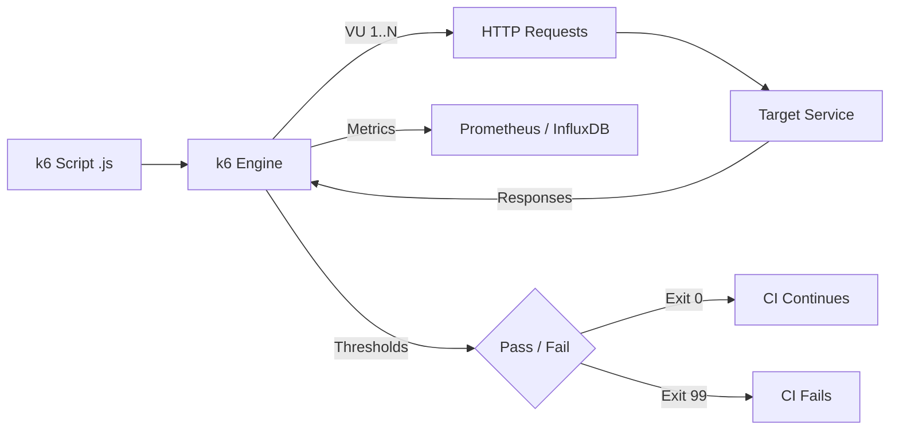

# k6 — A 2-Day Crash Course

k6 is a developer-centric load testing tool — you write tests in JavaScript, run them from the CLI, and get actionable metrics you can feed directly into your observability stack.

**Prerequisite:** `HTTP.md` — you need a solid mental model of requests, responses, status codes, and latency before load testing makes sense.

---

## Part 0 — Why k6

You cannot guess how your system behaves under load. Your intuitions about "this endpoint is fast" or "this service can handle it" are almost always wrong at scale. The only way to know is to measure.

k6 earns its place in that process for three reasons:

- **Scriptable.** Tests are plain JavaScript. You can parameterize them, add conditional logic, pull test data from files, and version-control everything alongside your application code.
- **CI-friendly.** k6 exits with a non-zero code when thresholds fail, which means your pipeline can gate deployments on performance the same way it gates on failing unit tests.
- **Prometheus-compatible output.** k6 can stream metrics to Prometheus, InfluxDB, or Grafana Cloud in real time, so you see load test results inside the same dashboards you use in production.



---

## Vocabulary

Before you run anything, get these terms precise. Confusion here causes misread results.

**Virtual User (VU)** — A simulated user. Each VU runs your script from top to bottom in a loop. VUs are concurrent; 100 VUs means 100 simultaneous script executions.

**Iteration** — One complete execution of your test script by a single VU. A 100-VU test running for 30 seconds might complete thousands of iterations.

**Scenario** — A named, independently configured workload. You can have multiple scenarios in one test — for example, one scenario hammering your search endpoint and another doing checkout flows.

**Threshold** — A pass/fail criterion applied to a metric. If `http_req_duration p(95) < 500ms` is your threshold and the 95th percentile exceeds 500ms, the test fails and k6 exits non-zero.

**Check** — An assertion inside your script. "Did this response return 200?" is a check. Checks do not fail the test by default — they only record a pass/fail ratio. To make failures actionable, pair them with thresholds.

**Stage** — A time-boxed portion of a ramp. A typical test ramps up VUs, holds at peak, then ramps down. Each of those is a stage.

**Options** — The configuration object exported from your script (`export const options = { ... }`). Stages, thresholds, scenarios, and VU counts all live here.

**Executor** — The strategy that controls how VUs and iterations are scheduled. `ramping-vus` ramps users up and down. `constant-arrival-rate` fires a fixed number of requests per second regardless of VU count. Choosing the wrong executor gives you misleading numbers.

**Metric** — A time-series data point k6 records during the test. Built-in metrics include `http_req_duration`, `http_req_failed`, `vus`, `iterations`, and about a dozen more. You can also define custom metrics.

**Tag** — A key-value label you attach to requests or metrics. Tags let you slice results by endpoint, user type, environment, or anything else you care about.

---

## DAY 1

### Install

```bash
# macOS
brew install k6

# Linux (Debian/Ubuntu)
sudo gpg -k
sudo gpg --no-default-keyring \
  --keyring /usr/share/keyrings/k6-archive-keyring.gpg \
  --keyserver hkp://keyserver.ubuntu.com:80 \
  --recv-keys C5AD17C747E3415A3642D57D77C6C491D6AC1D69
echo "deb [signed-by=/usr/share/keyrings/k6-archive-keyring.gpg] \
  https://dl.k6.io/deb stable main" \
  | sudo tee /etc/apt/sources.list.d/k6.list
sudo apt-get update && sudo apt-get install k6

# Docker (no install needed)
docker run --rm -i grafana/k6 run - <script.js
```

Verify: `k6 version`

---

### Your First Script

Create `smoke.js`:

```javascript
import http from 'k6/http';
import { sleep } from 'k6';

export const options = {
  vus: 1,
  duration: '10s',
};

export default function () {
  http.get('https://httpbin.org/get');
  sleep(1);
}
```

Run it:

```bash
k6 run smoke.js
```

k6 prints a summary at the end. The most important line is `http_req_duration` — specifically the median, 90th, and 95th percentile values.

The `sleep(1)` call simulates think time between requests. Without it, each VU hammers the server as fast as it can, which is rarely what real users do.

---

### HTTP Requests

```javascript
import http from 'k6/http';

export default function () {
  // GET
  const res = http.get('https://api.example.com/users');

  // POST with JSON body
  const payload = JSON.stringify({ username: 'alice', password: 'secret' });
  const params = { headers: { 'Content-Type': 'application/json' } };
  const loginRes = http.post('https://api.example.com/login', payload, params);

  // Reuse auth token across requests
  const token = loginRes.json('token');
  const authParams = {
    headers: { Authorization: `Bearer ${token}` },
  };
  http.get('https://api.example.com/profile', authParams);
}
```

k6 also supports `http.put`, `http.patch`, `http.del`, and the generic `http.request` for full control.

---

### Checks

```javascript
import http    from 'k6/http';
import { check } from 'k6';

export default function () {
  const res = http.get('https://api.example.com/health');

  check(res, {
    'status is 200':        (r) => r.status === 200,
    'body contains ok':     (r) => r.body.includes('ok'),
    'response under 200ms': (r) => r.timings.duration < 200,
  });
}
```

k6 reports the pass rate for each check in the summary. If 5% of requests fail the status check, you see that immediately.

---

### Thresholds

Thresholds are what make k6 useful in CI. Without them, you get metrics but no verdict.

```javascript
export const options = {
  vus: 50,
  duration: '30s',
  thresholds: {
    http_req_duration: ['p(95)<500', 'p(99)<1000'],
    http_req_failed:   ['rate<0.01'],   // less than 1% error rate
    checks:            ['rate>0.99'],   // more than 99% checks pass
  },
};
```

If any threshold is violated, k6 exits with code 99. Your CI pipeline treats that the same as a failing test.

---

### Ramp-Up Stages

A flat load profile — jump straight to 100 VUs — produces a spike that rarely represents real traffic and can overwhelm a cold system before it warms up. Use stages instead.

```javascript
export const options = {
  stages: [
    { duration: '2m', target: 50  },  // ramp up to 50 VUs
    { duration: '5m', target: 50  },  // hold at 50 VUs
    { duration: '2m', target: 100 },  // ramp to peak
    { duration: '5m', target: 100 },  // hold at peak
    { duration: '2m', target: 0   },  // ramp down
  ],
  thresholds: {
    http_req_duration: ['p(95)<600'],
  },
};
```

Watch your p95 latency during each stage transition. If it climbs during ramp-up and never recovers, your service does not auto-scale fast enough.

---

## DAY 2

### Scenarios and Executors

When you need multiple workload shapes in one run, use scenarios:

```javascript
export const options = {
  scenarios: {
    browse: {
      executor:         'ramping-vus',
      startVUs:         0,
      stages: [
        { duration: '1m', target: 20 },
        { duration: '3m', target: 20 },
        { duration: '1m', target: 0  },
      ],
      gracefulRampDown: '30s',
      exec:             'browseFlow',
    },
    checkout: {
      executor:        'constant-arrival-rate',
      rate:            10,          // 10 iterations per second
      timeUnit:        '1s',
      duration:        '3m',
      preAllocatedVUs: 20,
      exec:            'checkoutFlow',
    },
  },
};

export function browseFlow()   { /* ... */ }
export function checkoutFlow() { /* ... */ }
```

**Executor reference:**

| Executor | Use when |
|---|---|
| `shared-iterations` | Fixed total iteration count across all VUs |
| `per-vu-iterations` | Each VU runs N iterations |
| `constant-vus` | Fixed VU count for a fixed duration |
| `ramping-vus` | VU count changes over time (most common) |
| `constant-arrival-rate` | Fixed RPS/TPS regardless of VU throughput |
| `ramping-arrival-rate` | RPS changes over time |
| `externally-controlled` | VU count driven by k6's REST API at runtime |

---

### Custom Metrics

```javascript
import { Counter, Gauge, Rate, Trend } from 'k6/metrics';

const loginErrors  = new Counter('login_errors');
const activeUsers  = new Gauge('active_users');
const successRate  = new Rate('success_rate');
const loginLatency = new Trend('login_latency', true); // true = milliseconds

export default function () {
  const res = http.post('/login', payload);

  if (res.status !== 200) {
    loginErrors.add(1);
  }
  successRate.add(res.status === 200);
  loginLatency.add(res.timings.duration);
}
```

Custom metrics appear in the end-of-test summary and can have thresholds applied to them:

```javascript
thresholds: {
  login_latency: ['p(95)<400'],
  login_errors:  ['count<10'],
  success_rate:  ['rate>0.98'],
},
```

---

### Parameterization

Hard-coded credentials in load tests produce unrealistic cache behavior and lockouts. Externalize test data.

**From JSON:**

```javascript
import { SharedArray } from 'k6/data';

const users = new SharedArray('users', function () {
  return JSON.parse(open('./users.json'));
});

export default function () {
  const user = users[Math.floor(Math.random() * users.length)];
  http.post('/login', JSON.stringify(user));
}
```

**From CSV:**

```javascript
import { SharedArray } from 'k6/data';
import papaparse from 'https://jslib.k6.io/papaparse/5.1.1/index.js';

const users = new SharedArray('users', function () {
  return papaparse.parse(open('./users.csv'), { header: true }).data;
});
```

`SharedArray` loads the data once and shares it across all VUs, keeping memory usage flat regardless of VU count.

---

### CI/CD Integration

**GitHub Actions:**

```yaml
- name: Run k6 load test
  uses: grafana/k6-action@v0.3.1
  with:
    filename: tests/load/smoke.js
  env:
    BASE_URL: ${{ secrets.STAGING_URL }}
```

**GitLab CI:**

```yaml
k6-load-test:
  image: grafana/k6
  stage: test
  script:
    - k6 run --out json=results.json tests/load/smoke.js
  artifacts:
    paths:
      - results.json
```

Run a lightweight smoke test (1 VU, 30 seconds) on every PR. Save the heavier soak and stress tests for nightly or pre-release pipelines.

---

### Output to Prometheus and Grafana

k6 ships with a Prometheus remote write output built in:

```bash
k6 run \
  --out experimental-prometheus-rw \
  script.js
```

Configure the endpoint:

```bash
K6_PROMETHEUS_RW_SERVER_URL=http://prometheus:9090/api/v1/write \
K6_PROMETHEUS_RW_TREND_STATS="p(50),p(90),p(95),p(99)" \
k6 run --out experimental-prometheus-rw script.js
```

Grafana Labs maintains an official k6 dashboard (ID 18030). Import it, point it at your Prometheus datasource, and you get VU count, RPS, error rate, and latency percentiles out of the box.

For InfluxDB + Grafana (older but still common):

```bash
k6 run --out influxdb=http://influxdb:8086/k6 script.js
```

---

### Distributed Testing with k6-operator

A single k6 process can saturate a multi-core machine and generate significant load, but if you need millions of RPS you need distributed execution. The k6-operator runs on Kubernetes and orchestrates multiple k6 pods from a single `TestRun` custom resource.

```yaml
apiVersion: k6.io/v1alpha1
kind: TestRun
metadata:
  name: api-load-test
spec:
  parallelism: 4          # 4 k6 pods, each running 1/4 of the load
  script:
    configMap:
      name: k6-script
      file: script.js
  arguments: --out experimental-prometheus-rw
```

All pods report metrics to the same sink, so your Grafana dashboard sees the aggregate picture. The operator handles pod lifecycle, so a pod crash does not silently drop load — it restarts.

---

### Browser Testing

k6 includes a Chromium-based browser module for testing real user flows:

```javascript
import { browser } from 'k6/browser';

export const options = {
  scenarios: {
    ui: {
      executor: 'shared-iterations',
      options:  { browser: { type: 'chromium' } },
    },
  },
};

export default async function () {
  const page = await browser.newPage();
  try {
    await page.goto('https://example.com/login');
    await page.locator('input[name="username"]').type('alice');
    await page.locator('input[name="password"]').type('secret');
    await page.locator('button[type="submit"]').click();
    await page.waitForNavigation();
  } finally {
    await page.close();
  }
}
```

Browser tests are heavier than protocol-level tests — keep VU counts low (10–50) and focus on measuring Core Web Vitals and JS-rendered interaction latency.

---

### Comparison with Other Tools

| Tool | Script language | Strengths | Weaknesses |
|---|---|---|---|
| k6 | JavaScript | CI integration, Prometheus output, scenarios | Chromium tests are heavy |
| wrk | Lua | Extreme raw throughput benchmarking | Minimal metrics, no scenarios |
| vegeta | Go / CLI | Simple rate-based testing, easy piping | No scripting, flat load only |
| Locust | Python | Familiar for Python teams, web UI | Higher resource usage per VU |
| Gatling | Scala/DSL | Excellent HTML reports, JVM ecosystem | Steeper learning curve |

Use wrk or vegeta when you want a quick ceiling check on raw throughput. Use k6 when you need realistic user flows, SLO-based thresholds, and CI integration.

---

## Worked Example — Load Testing an API with SLO-Based Thresholds

Suppose your SLO says: 99% of requests must complete in under 500ms, and error rate must stay below 0.5%.

```javascript
import http from 'k6/http';
import { check, sleep } from 'k6';
import { SharedArray }  from 'k6/data';

const BASE_URL = __ENV.BASE_URL || 'https://api.staging.example.com';

const users = new SharedArray('users', function () {
  return JSON.parse(open('./test-users.json'));
});

export const options = {
  stages: [
    { duration: '2m', target: 25  },
    { duration: '5m', target: 100 },
    { duration: '2m', target: 100 },
    { duration: '1m', target: 0   },
  ],
  thresholds: {
    http_req_duration: ['p(99)<500'],
    http_req_failed:   ['rate<0.005'],
    checks:            ['rate>0.995'],
  },
};

export default function () {
  const user = users[__VU % users.length];

  const loginRes = http.post(
    `${BASE_URL}/auth/login`,
    JSON.stringify({ email: user.email, password: user.password }),
    { headers: { 'Content-Type': 'application/json' } },
  );

  check(loginRes, {
    'login 200': (r) => r.status === 200,
  });

  if (loginRes.status !== 200) return;

  const token = loginRes.json('access_token');
  const headers = {
    Authorization:  `Bearer ${token}`,
    'Content-Type': 'application/json',
  };

  const itemsRes = http.get(`${BASE_URL}/items?page=1&limit=20`, { headers });
  check(itemsRes, {
    'items 200':       (r) => r.status === 200,
    'items non-empty': (r) => r.json('data').length > 0,
  });

  sleep(Math.random() * 2 + 1); // 1–3 second think time
}
```

Run it:

```bash
BASE_URL=https://api.staging.example.com k6 run \
  --out experimental-prometheus-rw \
  api-load-test.js
```

Watch p99 latency in Grafana as VUs climb. If it breaches 500ms during the ramp-up hold, you have a scaling problem to investigate before production.

---

## Pitfalls

**Not accounting for think time.** Removing `sleep()` calls makes your VU count a multiplier on raw RPS. One VU hitting a 10ms endpoint with no sleep does 100 RPS. That is almost never what you want when simulating real users.

**Checking status but not setting a threshold.** Checks record pass rates but do not fail the test. If your login check shows 30% failure in the summary and your CI job still passes, you forgot the threshold.

**Using constant-vus when you mean constant-arrival-rate.** With `constant-vus`, actual RPS depends on how fast each VU completes requests. If your backend slows down, VUs back up and RPS drops — the test self-throttles. Use `constant-arrival-rate` when you want to hold a specific RPS regardless of latency.

**Generating load from your laptop.** Your machine, its NIC, and the network between you and the target are all potential bottlenecks. Run k6 from the same cloud region as your service, or use k6 Cloud / k6-operator.

**Ignoring the ramp-down.** Skipping ramp-down means abrupt VU termination that can leave in-flight requests and skew your tail latency numbers. Always include a final stage ramping to 0.

**Testing production without guards.** Load tests against production are valid, but only with rate limiters, feature flags, and an abort plan. Use `--abort-on-fail` and set aggressive thresholds so a runaway test does not become an incident.

⚠️ k6 does not automatically follow HTTP redirects for all methods. Check `params.redirects` if your POST returns a 302 and you expect a follow-through.

---

## Quick Reference

```bash
# Run a script
k6 run script.js

# Override VUs and duration from CLI
k6 run --vus 10 --duration 30s script.js

# Pass environment variables
k6 run -e BASE_URL=https://staging.example.com script.js

# Output to JSON
k6 run --out json=results.json script.js

# Output to Prometheus remote write
k6 run --out experimental-prometheus-rw script.js

# Run in cloud (k6 Cloud)
k6 cloud script.js

# Validate script without running
k6 inspect script.js
```

**Built-in metric names:**

| Metric | Type | Description |
|---|---|---|
| `http_req_duration` | Trend | Total request round-trip time |
| `http_req_failed` | Rate | Proportion of requests with error status |
| `http_reqs` | Counter | Total HTTP requests made |
| `vus` | Gauge | Active VUs at any moment |
| `vus_max` | Gauge | Maximum VUs allocated |
| `iterations` | Counter | Total script iterations completed |
| `iteration_duration` | Trend | Time for one full script iteration |
| `data_sent` | Counter | Bytes sent |
| `data_received` | Counter | Bytes received |

**Threshold expression syntax:**

```
p(N)<value    — Nth percentile under value (ms)
avg<value     — Average under value
rate<value    — Rate below fraction (0.0–1.0)
count<value   — Absolute count below value
```

---

## Top 10 Interview Questions

<details>
<summary><strong>Q: What is the difference between a check and a threshold in k6?</strong></summary>

A check is an assertion inside your script (e.g., "status is 200") that records pass/fail ratios but does not fail the test by itself. A threshold is a pass/fail criterion applied to a metric (e.g., "p95 < 500ms") -- if violated, k6 exits with code 99, failing your CI pipeline. Always pair important checks with thresholds; otherwise a 30% failure rate can pass silently.

</details>

<details>
<summary><strong>Q: When would you use `constant-arrival-rate` instead of `ramping-vus`?</strong></summary>

Use `constant-arrival-rate` when you want to maintain a fixed requests-per-second regardless of backend latency. With `ramping-vus`, actual RPS depends on how fast each VU completes -- if the backend slows down, VUs back up and RPS drops, masking the problem. `constant-arrival-rate` holds the pressure constant, which accurately simulates real traffic patterns and reveals how the system degrades under sustained load.

</details>

<details>
<summary><strong>Q: Why is think time (sleep) important in load tests?</strong></summary>

Without sleep, each VU hammers the server as fast as it can -- one VU hitting a 10ms endpoint generates 100 RPS. Real users pause between actions (reading, typing, deciding). Removing think time inflates your effective load by 10-100x, produces unrealistic cache hit ratios, and can trigger rate limiters or WAF blocks. Use `sleep(Math.random() * 2 + 1)` for realistic 1-3 second think time with natural variation.

</details>

<details>
<summary><strong>Q: How do you integrate k6 into a CI/CD pipeline?</strong></summary>

Use the `grafana/k6-action` for GitHub Actions or the `grafana/k6` Docker image for GitLab CI. Define thresholds in your script so k6 exits non-zero on failure, which blocks the pipeline. Run a lightweight smoke test (1 VU, 30s) on every PR. Reserve heavier soak and stress tests for nightly or pre-release pipelines. Pass environment variables like `BASE_URL` via CI secrets to target staging environments.

</details>

<details>
<summary><strong>Q: What are custom metrics in k6 and when would you define them?</strong></summary>

k6 provides built-in metrics (http_req_duration, http_req_failed, etc.), but custom metrics let you track domain-specific measurements. Use `Counter` for event counts (login errors), `Rate` for ratios (success rate), `Trend` for latency distributions (login_latency), and `Gauge` for point-in-time values (active users). Custom metrics can have thresholds applied, making them actionable in CI.

</details>

<details>
<summary><strong>Q: How does k6 distribute load for large-scale tests?</strong></summary>

A single k6 process can generate significant load from a multi-core machine. For millions of RPS, use the k6-operator on Kubernetes, which splits the workload across multiple k6 pods via a `TestRun` custom resource with a `parallelism` field. All pods report to the same metrics backend (Prometheus/InfluxDB), so Grafana shows the aggregate picture. The operator handles pod lifecycle and restarts crashed pods.

</details>

<details>
<summary><strong>Q: What is the difference between a smoke test, load test, stress test, and soak test?</strong></summary>

A smoke test uses minimal load (1-5 VUs, 30s) to verify the system functions under basic conditions. A load test simulates expected production traffic to validate SLO compliance. A stress test ramps beyond expected capacity to find the breaking point. A soak test runs at moderate load for hours to surface memory leaks, connection pool exhaustion, and gradual degradation. Each answers a different question about system resilience.

</details>

<details>
<summary><strong>Q: How do you parameterize k6 tests to avoid unrealistic cache behaviour?</strong></summary>

Use `SharedArray` to load test data (users, product IDs, search terms) from JSON or CSV files. Each VU picks a different data point, ensuring requests hit different cache keys and database rows. `SharedArray` loads data once and shares it across all VUs, keeping memory flat regardless of VU count. Hard-coded credentials produce unrealistic cache hit rates and can trigger account lockouts.

</details>

<details>
<summary><strong>Q: What built-in metrics should you monitor during a k6 test?</strong></summary>

Watch `http_req_duration` (especially p95 and p99) for latency, `http_req_failed` for error rate, `http_reqs` for throughput, `vus` for active virtual users, and `iteration_duration` for full script cycle time. Compare these across ramp stages -- if p95 climbs during ramp-up and never recovers, your service cannot scale fast enough. Export to Prometheus and visualise in Grafana for real-time correlation with infrastructure metrics.

</details>

<details>
<summary><strong>Q: Why should you not run load tests from your laptop against a remote service?</strong></summary>

Your laptop's NIC, local network bandwidth, and the internet path between you and the target are all potential bottlenecks that artificially limit the load you can generate. Network latency adds to every request timing, inflating your measured p95. CPU contention on your machine can starve k6 of resources. Run k6 from the same cloud region as your service, or use k6 Cloud / k6-operator for accurate measurements and higher throughput.

</details>

---


## Quick Quiz

Test your understanding with these rapid-fire questions (answers hidden):

<details>
<summary>1. What is the ONE core problem that k6 solves?</summary>
Re-read Part 0 — the mental model section. If you can explain the "why" in one sentence, you understand the foundation.
</details>

<details>
<summary>2. Name the 3 most important terms from the vocabulary section.</summary>
Review Part 1. These are the building blocks every conversation about k6 uses.
</details>

<details>
<summary>3. What is the first thing you would set up on Day 1?</summary>
Check the Day 1 section — the very first hands-on step that gets you a working result.
</details>

<details>
<summary>4. What is the most common production pitfall with k6?</summary>
Review the Common Pitfalls section. The first item listed is typically the most frequently encountered.
</details>

<details>
<summary>5. How does k6 compare to its closest alternative?</summary>
Check the Comparison Matrix below — focus on the key differentiating row.
</details>


## Comparison Matrix

| Dimension | k6 | Locust | JMeter |
|-----------|----|--------|--------|
| **Primary use case** | Core strength of k6 | Core strength of Locust | Core strength of JMeter |
| **Learning curve** | Moderate | Varies | Varies |
| **Community/ecosystem** | Active | Active | Growing |
| **Operational complexity** | Medium | Varies | Varies |
| **Best for** | See Part 0 | Different tradeoffs | Different tradeoffs |

> **How to read this matrix:** no tool wins on every dimension. Pick based on your specific constraints — team expertise, existing infrastructure, scale requirements, and compliance needs. The right choice is the one that fits your context, not the one with the most checkmarks.

## Next Steps

- `HTTP.md` — If any request behavior surprised you during the test, go back here.
- `Prometheus.md` — Understand the metrics backend that stores your k6 output.
- `Grafana.md` — Build dashboards that show load test results alongside your production signals.
- `Capacity-Planning.md` — Use load test data to make actual sizing decisions.

---

## Recommended learning resources

**YouTube channels & playlists:**
- [Grafana — k6 Official playlist](https://www.youtube.com/@Grafana) — tutorials on scripting, thresholds, scenarios, and integrating k6 with Grafana Cloud
- [Hussein Nasser — Load Testing playlist](https://www.youtube.com/@haboread) — deep dives on load testing methodology, concurrency models, and interpreting results
- [Fireship — Load Testing in 100 Seconds](https://www.youtube.com/@Fireship) — quick conceptual overview of why and how to load test
- [NetworkChuck — Performance Testing](https://www.youtube.com/@NetworkChuck) — hands-on demonstrations of testing web services under load
- [Stephane Maarek — Performance and Load Testing](https://www.youtube.com/@StephaneMaarek) — structured approach to capacity validation and bottleneck identification

**Official docs & blogs:**
- [k6 Official Documentation](https://grafana.com/docs/k6/latest/) — scripting reference, execution options, result analysis, and CI integration guides
- [k6 Blog](https://grafana.com/blog/) — production patterns, case studies, and performance engineering best practices
- [Grafana k6 Extensions](https://grafana.com/docs/k6/latest/extensions/) — browser testing, distributed execution, and output plugins

---

## The Mantra

You do not have a performance problem until you have a measurement. You do not have a solution until the measurement improves. k6 is the instrument — what you do with the numbers is the engineering.
