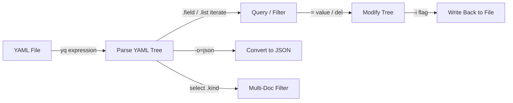

# yq — A 2-Day Crash Course

> **In one sentence:** yq is jq for YAML — it reads, filters, and edits YAML (and JSON/XML/TOML)
> from the command line, which makes it the go-to tool for surgically editing Kubernetes manifests,
> Helm values, CI configs, and any other YAML in scripts and pipelines.

> Read `jq.md` first — yq (the popular Go version by Mike Farah) uses **jq-style syntax**, so most
> of what you know transfers directly. This focuses on the YAML-specific superpowers and gotchas.

---

## Part 0 — Why yq exists

DevOps runs on YAML: Kubernetes manifests, Helm `values.yaml`, Docker Compose, GitHub
Actions/GitLab CI configs, Ansible playbooks. You constantly need to *read* a value out of YAML
("what image tag is this deployment using?") or *change one* in a pipeline ("bump the tag to the
new build SHA") — without hand-editing files (error-prone) or writing a YAML parser in Python
(overkill). `sed` can't safely edit YAML because indentation and structure matter.

yq solves this: it understands YAML structure, so you can query and edit precisely, in scripts,
**preserving formatting and comments** (a big deal for config you commit to Git). It's the missing
link between "I have YAML" and "I want to automate changes to it."

**Two important notes before anything else:**
1. **There are two different `yq` tools.** The widely-used one is **Mike Farah's Go yq**
   (jq-style syntax, `mikefarah/yq`). An older Python `yq` is a thin jq wrapper with different
   syntax. This guide is the **Go version** — check with `yq --version`. If your syntax errors,
   you may have the other tool.
2. **yq's query language mirrors jq.** `.spec.replicas`, `.[]`, `select()`, `|` all work the same.
   So jq fluency ≈ yq fluency. The new parts are *editing in place* and *multi-document* handling.

**Mental model:** same pipeline-of-filters model as jq (`.` flows through `|`), but the data is
YAML and yq can write changes *back into the file* while keeping comments and layout intact.



---

## DAY 1 — Read and query YAML

### 1. The basics (identical feel to jq)
```bash
yq '.' file.yaml                       # pretty-print / validate
yq '.spec.replicas' deploy.yaml        # read a nested value -> 3
yq '.metadata.name' deploy.yaml
yq '.spec.template.spec.containers[0].image' deploy.yaml   # the image of the first container
```
`yq '.'` pretty-prints; field access and array indexing work exactly like jq.

### 2. Iterating and filtering
```bash
yq '.spec.containers[].name' pod.yaml          # each container name
yq '.items[] | .metadata.name' list.yaml       # name of each item
yq '.spec.containers[] | select(.name == "app") | .image' pod.yaml   # filter then extract
yq '.[] | select(.enabled == true) | .name' services.yaml
```
`.[]`, `select()`, and `|` behave as in jq — pick the elements you want, then pull the field.

### 3. Output formats — convert between YAML and JSON
A daily-useful trick: yq converts formats, so you can YAML→JSON→jq and back:
```bash
yq -o=json '.' file.yaml               # YAML -> JSON
yq -o=yaml '.' file.json               # JSON -> YAML (yq reads JSON natively — JSON is valid YAML)
yq -o=json '.spec' deploy.yaml | jq '.replicas'   # hand off to jq if you prefer
cat values.json | yq -P                # -P = pretty YAML output
```
This makes yq the bridge: convert a JSON API response into a YAML manifest, or vice versa.

### 4. Raw output for scripts
```bash
yq -r '.metadata.name' deploy.yaml     # raw string (no quotes) — though yq strings are often unquoted already
for img in $(yq '.spec.template.spec.containers[].image' deploy.yaml); do
  echo "image: $img"
done
```

**By end of Day 1 you can:** read and validate YAML, query nested fields and arrays, filter with
`select()`, and convert YAML↔JSON. If you know jq, this is mostly muscle memory.

---

## DAY 2 — Edit YAML (the part jq can't do safely)

### 1. In-place editing — the killer feature
This is why yq exists. Change a value and write it back to the file, preserving structure:
```bash
yq -i '.spec.replicas = 5' deploy.yaml                 # -i = in place
yq -i '.image.tag = "1.4.2"' values.yaml
yq -i '.spec.template.spec.containers[0].image = "myapp:abc123"' deploy.yaml
```
`= value` sets a field; `-i` writes back. Crucially, the Go yq **preserves comments and
formatting** in the rest of the file — vital for config you keep in Git and review.

### 2. Using variables and environment (CI/CD bread and butter)
```bash
# inject a shell/CI value safely with env()
TAG=abc123 yq -i '.spec.template.spec.containers[0].image = "myapp:" + env(TAG)' deploy.yaml
# or strenv() to force string interpretation
yq -i '.metadata.labels.version = strenv(GIT_SHA)' deploy.yaml
```
`env(VAR)` / `strenv(VAR)` pull in environment variables — this is exactly how a CI pipeline bumps
an image tag to the new build SHA before `kubectl apply` or a GitOps commit (see `ArgoCD.md`).

### 3. Adding, deleting, and merging
```bash
yq -i '.metadata.labels.team = "payments"' deploy.yaml   # add/set a nested key (creates path)
yq -i 'del(.spec.template.spec.containers[0].resources)' deploy.yaml   # delete a key
yq -i '.spec.ports += [{"name":"metrics","port":9090}]' svc.yaml       # append to an array
yq ea '. as $item ireduce ({}; . * $item)' a.yaml b.yaml   # deep-merge documents
yq '.a *= load("override.yaml")' base.yaml                  # merge another file in
```
`del()` removes, `+=` appends, `*` deep-merges. Setting a deep path (`.a.b.c = x`) creates the
intermediate maps if they don't exist.

### 4. Multi-document YAML (Kubernetes manifests!)
Kubernetes files often contain several docs separated by `---`. yq handles them:
```bash
yq '.kind' multi.yaml                       # prints the kind of EACH document
yq 'select(.kind == "Deployment")' multi.yaml          # only the Deployment doc(s)
yq 'select(.kind == "Service") | .spec.ports' multi.yaml
yq -i 'select(.kind == "Deployment") | .spec.replicas = 3' multi.yaml   # edit just one doc
yq ea '[.]' multi.yaml                       # ea = evaluate-all: treat all docs as one array
```
`select(.kind == "...")` is the standard way to target one resource inside a multi-doc manifest.
`-ea`/`eval-all` loads *all* documents together (needed for cross-document operations and merges).

### 5. Reading values into scripts and back (the CI loop)
```bash
# read current values
replicas=$(yq '.spec.replicas' deploy.yaml)
image=$(yq '.spec.template.spec.containers[0].image' deploy.yaml)

# the classic GitOps tag bump in a pipeline:
yq -i ".spec.template.spec.containers[0].image = \"$REGISTRY/app:$GIT_SHA\"" deploy.yaml
git add deploy.yaml && git commit -m "deploy app:$GIT_SHA" && git push   # Argo CD syncs it
```

### 6. Validate and pretty-print (lint your YAML)
```bash
yq '.' file.yaml >/dev/null && echo "valid YAML" || echo "INVALID"
yq -P -i '.' file.yaml                       # normalize/pretty-print in place
yq 'keys' file.yaml                           # top-level keys
yq 'explode(.)' file.yaml                      # expand YAML anchors/aliases (&/*) into full values
```
`explode(.)` is handy for YAML with anchors/aliases — it resolves them so you see the real,
expanded structure.

---

## Worked example — CI bumps an image tag in a K8s manifest
```bash
#!/usr/bin/env bash
set -euo pipefail
# $GIT_SHA and $REGISTRY come from the CI environment (see GitHub-Actions.md / GitLab-CI.md)

MANIFEST="k8s/deployment.yaml"

# 1. read what's there now (for logging / sanity)
echo "current image: $(yq '.spec.template.spec.containers[0].image' "$MANIFEST")"

# 2. set the new image tag in place, preserving all comments/formatting
yq -i ".spec.template.spec.containers[0].image = \"${REGISTRY}/app:${GIT_SHA}\"" "$MANIFEST"

# 3. also stamp a label for traceability
GIT_SHA="$GIT_SHA" yq -i '.metadata.labels.commit = strenv(GIT_SHA)' "$MANIFEST"

# 4. commit -> GitOps tool (Argo CD) detects the change and syncs the cluster
git add "$MANIFEST"
git commit -m "deploy app:${GIT_SHA}"
git push
```

---

## Common pitfalls
- **Wrong yq.** Two tools share the name. The jq-style syntax here is **Mike Farah's Go yq**.
  `yq --version`; if `.foo` syntax errors, you likely have the Python wrapper (which uses jq via
  `yq '.foo' -`).
- **Forgetting `-i`.** Without it, yq prints the result to stdout and leaves the file unchanged.
  Add `-i` to actually edit the file (and ideally commit to Git first so you can diff/undo).
- **Multi-doc surprises.** A file with `---` separators has multiple documents; a bare query runs
  per-document. Use `select(.kind=="...")` to target one, and `-ea` for cross-document ops.
- **String vs number/bool coercion.** `.replicas = "3"` writes a string `"3"`; `.replicas = 3`
  writes a number. For env values that must be strings (versions like `1.10`), use `strenv()` to
  avoid YAML turning `1.10` into `1.1`.
- **Quoting in the shell.** Single-quote the yq program; when injecting shell vars, prefer
  `env()`/`strenv()` over string interpolation to avoid quoting bugs.
- **Assuming comments survive everywhere.** The Go yq preserves comments for most edits, but heavy
  restructuring can drop them — diff the result.
- **Editing with `sed` instead.** `sed` doesn't understand indentation/structure and will corrupt
  YAML. Use yq.

---

## Quick reference (Mike Farah's Go yq)
```bash
# Read
yq '.' f.yaml                       pretty-print/validate
yq '.a.b.c' f.yaml                  nested field
yq '.list[0]'  '.list[]'            index / iterate
yq '.x | select(.k=="v")' f.yaml    filter
yq 'keys'  'length'  '.. | .name?'  keys, length, recursive descent

# Edit (add -i to write in place)
yq -i '.a.b = 5' f.yaml             set (creates path)
yq -i 'del(.a.b)' f.yaml            delete
yq -i '.list += [item]' f.yaml      append to array
yq -i '.a *= load("b.yaml")' f.yaml merge a file in
env(VAR) / strenv(VAR)              inject env (strenv forces string)

# Multi-document
yq 'select(.kind=="Deployment")' m.yaml      target one doc
yq -ea '[.]' m.yaml                          eval-all: all docs as array
yq 'explode(.)' f.yaml                        resolve anchors/aliases

# Formats
yq -o=json '.' f.yaml               YAML -> JSON
yq -o=yaml '.' f.json               JSON -> YAML
yq -P f.yaml                        pretty YAML
yq -o=props '.' f.yaml              -> java properties (also: csv, tsv, xml)

# Flags
-i in-place   -o=FORMAT output   -P pretty   -ea/eval-all multi-doc   -n null input
```

---

## Top 10 Interview Questions

<details>
<summary><strong>Q: What is the difference between Mike Farah's Go yq and the Python yq?</strong></summary>

Mike Farah's Go yq uses jq-style syntax natively (`.field`, `select()`, `|`) and can edit YAML files in place while preserving comments. The Python yq is a thin wrapper that converts YAML to JSON, pipes it through actual jq, and converts back -- it requires jq to be installed and has different syntax quirks. Check with `yq --version`; the Go version shows `mikefarah/yq`. This guide covers the Go version.

</details>

<details>
<summary><strong>Q: How does `yq -i` preserve comments and formatting when editing YAML?</strong></summary>

The Go yq parser builds an internal tree that retains comments, blank lines, and indentation style as metadata attached to each node. When writing back, it reconstructs the file using this metadata. Most single-field edits preserve the surrounding file layout perfectly. Heavy structural changes (reordering keys, deep merges) can occasionally drop comments -- always diff the result after complex edits.

</details>

<details>
<summary><strong>Q: How do you inject a CI environment variable into a YAML file safely?</strong></summary>

Use `env()` or `strenv()`: `TAG=abc123 yq -i '.image.tag = env(TAG)' values.yaml`. `env()` interprets the value as its native YAML type (number, bool, string). `strenv()` forces string interpretation -- critical for values like `1.10` which YAML would otherwise parse as the number `1.1`. Never use shell interpolation inside the yq expression; it creates quoting bugs.

</details>

<details>
<summary><strong>Q: How do you target a specific document in a multi-document YAML file?</strong></summary>

Use `select(.kind == "Deployment")` to match a specific document by a field value. For Kubernetes manifests with `---` separators, this is the standard pattern: `yq 'select(.kind == "Service") | .spec.ports' multi.yaml`. For cross-document operations (merging, comparing), use `eval-all` (`-ea`) which loads all documents into a single evaluation context.

</details>

<details>
<summary><strong>Q: What is the common pitfall with string vs number coercion in yq?</strong></summary>

`.replicas = "3"` writes the YAML string `"3"`, while `.replicas = 3` writes the integer `3`. Kubernetes expects integers for replicas, ports, and other numeric fields -- a quoted string will fail validation. Conversely, version strings like `1.10` must use `strenv()` to prevent YAML from interpreting them as the float `1.1`. Always verify the output type matches what the consuming tool expects.

</details>

<details>
<summary><strong>Q: How would you use yq to implement a GitOps image tag bump in a CI pipeline?</strong></summary>

Read the current image: `yq '.spec.template.spec.containers[0].image' deploy.yaml`. Set the new tag: `yq -i ".spec.template.spec.containers[0].image = \"$REGISTRY/app:$GIT_SHA\"" deploy.yaml`. Optionally stamp a label: `GIT_SHA=$GIT_SHA yq -i '.metadata.labels.commit = strenv(GIT_SHA)' deploy.yaml`. Commit and push -- ArgoCD or Flux detects the change and syncs the cluster. This is the standard GitOps pattern for image promotion.

</details>

<details>
<summary><strong>Q: How does yq handle format conversion, and when is this useful?</strong></summary>

yq reads YAML, JSON, XML, TOML, and properties natively. `yq -o=json '.' file.yaml` converts YAML to JSON; `yq -o=yaml '.' file.json` converts JSON to YAML. This is useful when you need to hand off data to jq (which only reads JSON), when API responses in JSON need to become Kubernetes manifests, or when migrating configuration between formats. One tool replaces separate converters.

</details>

<details>
<summary><strong>Q: What does `explode(.)` do and when would you need it?</strong></summary>

`explode(.)` resolves YAML anchors (`&`) and aliases (`*`) into their full expanded values. YAML anchors allow you to define a value once and reference it elsewhere, but this makes the actual values opaque when reading the file. `explode(.)` produces a file with no anchors -- every value is written out explicitly. Use it when debugging complex Helm values or Ansible playbooks that rely heavily on anchors.

</details>

<details>
<summary><strong>Q: How do you append an item to a YAML array without overwriting the existing entries?</strong></summary>

Use the `+=` operator: `yq -i '.spec.ports += [{"name": "metrics", "port": 9090}]' svc.yaml`. This appends the new item to the existing array. Using `=` instead of `+=` would replace the entire array. For nested arrays in multi-document files, combine with `select()`: `yq -i 'select(.kind == "Service") | .spec.ports += [{"name": "metrics", "port": 9090}]' multi.yaml`.

</details>

<details>
<summary><strong>Q: Why should you never use sed to edit YAML files?</strong></summary>

sed operates on text lines and has no understanding of YAML structure. YAML is indentation-sensitive -- a sed replacement that changes a value might break the indentation of nested keys, duplicate a key that appears at multiple levels, or corrupt multi-line strings. yq understands the YAML tree and modifies only the targeted node while preserving the surrounding structure, comments, and formatting. This is especially critical for Kubernetes manifests where a structural error causes silent deployment failures.

</details>

---


## Quick Quiz

Test your understanding with these rapid-fire questions (answers hidden):

<details>
<summary>1. What is the ONE core problem that yq solves?</summary>
Re-read Part 0 — the mental model section. If you can explain the "why" in one sentence, you understand the foundation.
</details>

<details>
<summary>2. Name the 3 most important terms from the vocabulary section.</summary>
Review Part 1. These are the building blocks every conversation about yq uses.
</details>

<details>
<summary>3. What is the first thing you would set up on Day 1?</summary>
Check the Day 1 section — the very first hands-on step that gets you a working result.
</details>

<details>
<summary>4. What is the most common production pitfall with yq?</summary>
Review the Common Pitfalls section. The first item listed is typically the most frequently encountered.
</details>

<details>
<summary>5. How does yq compare to its closest alternative?</summary>
Check the Comparison Matrix below — focus on the key differentiating row.
</details>


## Comparison Matrix

| Dimension | yq | jq | dasel |
|-----------|----|----|-------|
| **Primary use case** | Core strength of yq | Core strength of jq | Core strength of dasel |
| **Learning curve** | Moderate | Varies | Varies |
| **Community/ecosystem** | Active | Active | Growing |
| **Operational complexity** | Medium | Varies | Varies |
| **Best for** | See Part 0 | Different tradeoffs | Different tradeoffs |

> **How to read this matrix:** no tool wins on every dimension. Pick based on your specific constraints — team expertise, existing infrastructure, scale requirements, and compliance needs. The right choice is the one that fits your context, not the one with the most checkmarks.

## Next steps after Day 2
- Pair with **`jq`** (convert YAML→JSON for jq-only features, then back) — see `jq.md`.
- Use in **CI/CD** to bump tags/versions and in **GitOps** commits (`ArgoCD.md`).
- Kustomize/Helm cover templated config at scale; yq is for surgical, scripted edits and reads.
- `yq` for non-YAML: it also reads/writes JSON, XML, TOML, and properties — one tool for config
  format conversion.

---

## Recommended learning resources

**YouTube channels & playlists:**
- [Fireship — YAML in 100 Seconds](https://www.youtube.com/@Fireship) — fast primer on the data format yq operates on
- [Hussein Nasser — YAML and Config Management](https://www.youtube.com/@haboread) — practical context for why YAML processing matters in DevOps pipelines
- [TechWorld with Nana — Kubernetes YAML](https://www.youtube.com/@TechWorldwithNana) — the Kubernetes manifests you will most often process with yq
- [LearnLinuxTV — Command Line YAML Tools](https://www.youtube.com/@LearnLinuxTV) — hands-on terminal walkthroughs covering yq for sysadmin tasks

**Official docs & blogs:**
- [yq Official Documentation (Mike Farah)](https://mikefarah.gitbook.io/yq/) — the definitive reference for operators, expressions, and recipes
- [jq Official Manual](https://stedolan.github.io/jq/manual/) — yq's expression language is modelled on jq, so this remains essential background reading

---

**The mantra:** yq is jq for YAML — same `.`-through-`|` pipeline to read, plus `= value` with
`-i` to edit files in place (comments preserved). `select(.kind==...)` for multi-doc manifests,
`env()`/`strenv()` to inject CI values, and never edit YAML with `sed`.
