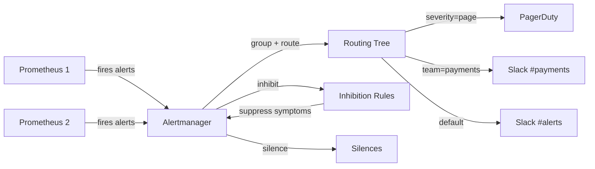

# Alertmanager — A 2-Day Crash Course

> **In one sentence:** Alertmanager takes the raw alerts Prometheus fires and turns them into
> sane notifications — grouping related ones, silencing noise, routing each to the right team and
> channel (Slack, PagerDuty, email), and suppressing alerts that are just symptoms of a bigger one.

> Pairs with `Prometheus.md`. Prometheus *decides when* an alert is firing; Alertmanager *decides
> what to do about it*. They are deliberately separate.

---

## Part 0 — Why Alertmanager exists (the problem it solves)

Prometheus can evaluate alert rules ("error rate > 5% for 10m → fire"). But if that's all you had,
operating it would be miserable:
- A datacenter hiccup fires 200 alerts at once → 200 pages. (Should be *one* notification.)
- The same alert fires every evaluation cycle → your phone buzzes every 30 seconds.
- A network switch dies, so every service behind it alerts → you get paged for 50 *symptoms* of
  *one* cause.
- You're doing planned maintenance → you get paged for things you already know about.
- Different alerts need different people: DB alerts → DBAs, payment alerts → payments on-call.

Alertmanager is the layer that makes alerting *humane*. It sits between Prometheus (and other
sources) and your notification channels, and applies four key behaviors: **grouping**,
**deduplication/throttling**, **routing**, and **inhibition/silencing**. Without it, alerting is
unusable at scale; with it, you get one well-formed, correctly-routed notification per real
problem.

**Mental model:** Prometheus is a smoke detector that beeps. Alertmanager is the smart building
system: it collects all the beeps, groups the ones from the same fire, decides who to call
(fire dept vs. maintenance), avoids calling them every second, and stays quiet for a scheduled
fire drill.



---

## Part 1 — The vocabulary

| Term | Meaning |
|------|---------|
| **Alert** | A firing condition sent from Prometheus (carries labels + annotations) |
| **Grouping** | Bundling related alerts into one notification (`group_by`) |
| **Route** | A tree deciding where each alert goes, based on its labels |
| **Receiver** | A notification destination (Slack, PagerDuty, email, webhook) |
| **Inhibition** | Suppressing alerts when a more important related alert is firing |
| **Silence** | Temporarily muting matching alerts (e.g. during maintenance) |
| **Repeat interval** | How often to re-notify about an alert that's still firing |

Alerts carry **labels** (used for routing/grouping/matching — e.g. `severity`, `team`, `service`)
and **annotations** (human text — `summary`, `description`). Labels are for machines; annotations
are for the human who gets paged.

---

## DAY 1 — Get it working

### 1. How alerts get here (the wiring)
```
Prometheus (evaluates alert rules)  --fires-->  Alertmanager  --routes-->  Slack / PagerDuty / Email
```
First, Prometheus must know where Alertmanager is:
```yaml
# prometheus.yml
alerting:
  alertmanagers:
    - static_configs:
        - targets: ['alertmanager:9093']
```
And Prometheus needs alert *rules* (the firing conditions — see `Prometheus.md`):
```yaml
# rules.yml (loaded by Prometheus)
groups:
  - name: api.alerts
    rules:
      - alert: HighErrorRate
        expr: sum(rate(http_requests_total{code=~"5.."}[5m])) / sum(rate(http_requests_total[5m])) > 0.05
        for: 10m
        labels: { severity: page, team: api }
        annotations:
          summary: "High 5xx error rate on {{ $labels.team }}"
          description: "Error rate is {{ $value | humanizePercentage }}"
```
Those `labels` (`severity`, `team`) are what Alertmanager routes on.

### 2. Minimal Alertmanager config
`alertmanager.yml`:
```yaml
route:
  receiver: 'slack-default'      # the catch-all receiver
  group_by: ['alertname', 'team']
  group_wait: 30s                # wait this long to collect related alerts before first send
  group_interval: 5m             # wait between sending updates to an existing group
  repeat_interval: 4h            # re-notify about a still-firing alert every 4h

receivers:
  - name: 'slack-default'
    slack_configs:
      - api_url: 'https://hooks.slack.com/services/XXX'
        channel: '#alerts'
        title: '{{ .CommonAnnotations.summary }}'
        text: '{{ range .Alerts }}{{ .Annotations.description }}{{ end }}'
```
Start it (`alertmanager --config.file=alertmanager.yml`), open http://localhost:9093 to see the
UI (firing alerts, silences). Trigger the rule and watch one grouped Slack message arrive.

### 3. Understand the four timing knobs (this is where the magic and confusion live)
- **`group_wait`** (e.g. 30s): when a brand-new group's first alert fires, wait this long so
  *related* alerts can join the same notification. Prevents a burst of separate pings.
- **`group_interval`** (e.g. 5m): once a group has notified, wait this long before sending an
  *updated* notification for that group (e.g. when a new alert joins it).
- **`repeat_interval`** (e.g. 4h): for an alert that *keeps firing*, how often to re-page so it's
  not forgotten — without buzzing constantly.
- **`for:`** (on the Prometheus rule, not here): how long the condition must hold *before* firing
  at all — kills flapping.
Get these right and you get one timely notification per incident instead of a storm.

**By end of Day 1 you can:** wire Prometheus → Alertmanager, define a route + receiver, send a
grouped Slack notification, and explain the timing knobs. That's a functioning alerting pipeline.

---

## DAY 2 — Make it real

### 1. Routing tree — send the right alert to the right place
The `route` is a *tree*: an alert enters at the root and falls into the first matching child;
children inherit the parent's settings unless overridden.
```yaml
route:
  receiver: 'slack-default'
  group_by: ['alertname', 'cluster', 'service']
  routes:
    - matchers: [ 'severity = page' ]      # urgent -> PagerDuty
      receiver: 'pagerduty'
      continue: false                       # stop here (don't also match siblings)
    - matchers: [ 'team = payments' ]       # payments alerts -> their channel
      receiver: 'slack-payments'
    - matchers: [ 'severity = warning' ]    # warnings -> a quieter channel
      receiver: 'slack-warnings'
      repeat_interval: 12h
```
This is the heart of Alertmanager: label-based routing so DB alerts page DBAs, payment alerts go
to payments, criticals go to PagerDuty, and warnings go somewhere you check later — automatically.

### 2. Receivers — the integrations
```yaml
receivers:
  - name: 'pagerduty'
    pagerduty_configs:
      - routing_key: '<integration-key>'
        severity: 'critical'
  - name: 'slack-payments'
    slack_configs:
      - api_url: '<webhook>'
        channel: '#payments-alerts'
  - name: 'email-oncall'
    email_configs:
      - to: 'oncall@example.com'
        from: 'alerts@example.com'
        smarthost: 'smtp:587'
  - name: 'webhook'
    webhook_configs:
      - url: 'http://my-handler/alerts'      # custom integrations / auto-remediation
```
Common destinations: PagerDuty/Opsgenie (paging), Slack/Teams (chat), email, and generic
webhooks (for anything else, including auto-remediation hooks).

### 3. Inhibition — suppress symptoms when you know the cause
When a whole cluster is down, you don't want 80 "service X unreachable" pages on top of the one
"cluster down" page. **Inhibition** mutes the symptom alerts while the cause alert is firing:
```yaml
inhibit_rules:
  - source_matchers: [ 'severity = critical', 'alertname = ClusterDown' ]
    target_matchers: [ 'severity = warning' ]
    equal: ['cluster']        # only inhibit warnings in the SAME cluster
```
"If `ClusterDown` (critical) is firing for a cluster, suppress all `warning` alerts for that same
cluster." This is what stops alert storms during big outages.

### 4. Silences — planned mute (do this before maintenance)
A **silence** temporarily mutes alerts matching a label set, for a time window — set via the UI
or `amtool`:
```bash
amtool silence add alertname="HighErrorRate" service="checkout" \
  --duration=2h --comment="planned deploy" --author="gurpreet"
amtool silence query           # list active silences
amtool silence expire <id>     # end one early
```
Always silence before planned maintenance so you're not paged for self-inflicted noise — and set
an expiry so you don't accidentally mute forever.

### 5. Templating notifications (make pages actionable)
A good notification tells the responder what's wrong *and what to do*. Use templates to include
the summary, value, affected service, and a **runbook link**:
```yaml
slack_configs:
  - channel: '#alerts'
    title: '[{{ .Status | toUpper }}] {{ .CommonLabels.alertname }} ({{ .CommonLabels.service }})'
    text: >-
      {{ range .Alerts }}*{{ .Annotations.summary }}*
      {{ .Annotations.description }}
      Runbook: {{ .Annotations.runbook_url }}{{ end }}
```
Put `runbook_url` in your Prometheus rule annotations so every page links to the fix. (See the
runbook template in the processes folder.)

### 6. High availability
Run Alertmanager as a small **cluster** (≥2 instances that gossip) so notifications still go out
if one dies — and so they're *deduplicated* (you get one page, not one per instance). Point all
your Prometheis at all Alertmanager instances.

---

## Worked example — route, group, inhibit, silence
```text
1. Prometheus rules tag alerts with severity (page/warning) + team + cluster + service.
2. Alertmanager route: severity=page -> PagerDuty; team=payments -> #payments; else -> #alerts.
3. group_by [cluster, alertname]; group_wait 30s -> a burst becomes ONE grouped message.
4. Inhibit rule: ClusterDown (critical) suppresses all warnings in that cluster -> no storm.
5. Deploy window tonight: amtool silence add service=checkout --duration=2h -> no self-paging.
6. Every page's text includes the summary, current value, and a runbook_url -> responder acts fast.
```

---

## Common pitfalls
- **No grouping (`group_by`).** You get one notification per alert instead of one per incident —
  a pager storm. Group by meaningful labels (cluster, alertname, service).
- **Tiny `repeat_interval`.** Re-paging every few minutes for the same firing alert = fatigue and
  ignored pages. Use hours.
- **No inhibition.** A single big outage produces dozens of symptom pages. Inhibit symptoms under
  the cause.
- **Forgetting to silence before maintenance.** Self-inflicted 3am pages. Silence first, with an
  expiry.
- **Routing everything to one channel.** Defeats the point; route by team/severity.
- **Unactionable notifications.** A page with no context or runbook wastes the responder's time.
  Template in summary + value + runbook link.
- **Confusing where things live.** Alert *rules* and `for:` are in *Prometheus*; grouping,
  routing, inhibition, silences are in *Alertmanager*. (`amtool check-config` / `promtool check
  rules` validate the right files.)

---

## Quick reference
```yaml
# alertmanager.yml structure
route:
  receiver: <default>
  group_by: [label, ...]
  group_wait: 30s          # collect related alerts before first send
  group_interval: 5m       # gap between updates to an existing group
  repeat_interval: 4h      # re-notify a still-firing alert
  routes: [ { matchers: ['k=v'], receiver: r, continue: false } ]
receivers:
  - name: r
    slack_configs|pagerduty_configs|email_configs|webhook_configs|opsgenie_configs: [...]
inhibit_rules:
  - source_matchers: ['severity=critical']
    target_matchers: ['severity=warning']
    equal: [cluster]
```
```bash
# Ops
alertmanager --config.file=alertmanager.yml
amtool check-config alertmanager.yml          # validate
amtool alert query                             # list firing alerts
amtool silence add <matchers> --duration=2h --comment="..." --author=you
amtool silence query | expire <id>
curl localhost:9093/-/reload                   # hot-reload config
# matchers in routes: =  (equal)  !=  =~ (regex)  !~ (regex not)
```

---

## Top 10 Interview Questions

<details>
<summary><strong>Q: How does Alertmanager's routing tree work, and how do you design one for a multi-team organisation?</strong></summary>

The routing tree is a hierarchy where alerts enter at the root and fall into the first matching child route based on label matchers. Children inherit parent settings unless overridden. In a multi-team setup, you typically match on `team` or `severity` labels at the top level, routing critical pages to PagerDuty and team-specific warnings to dedicated Slack channels. The `continue: true` flag lets an alert match multiple sibling routes when you need both paging and chat notification for the same alert.

</details>

<details>
<summary><strong>Q: What is the difference between grouping, inhibition, and silencing in Alertmanager?</strong></summary>

Grouping bundles related alerts (same alertname, cluster, service) into a single notification to prevent pager storms. Inhibition automatically suppresses symptom alerts when a higher-severity cause alert is firing — for example, suppressing all warnings in a cluster when a ClusterDown critical is active. Silencing is a manual, time-bounded mute you create before planned maintenance so known-noisy alerts do not page anyone. All three reduce noise, but grouping is structural, inhibition is automatic, and silencing is deliberate.

</details>

<details>
<summary><strong>Q: Explain `group_wait`, `group_interval`, and `repeat_interval` — what happens if you set them wrong?</strong></summary>

`group_wait` is the initial delay before sending the first notification for a new group, allowing related alerts to arrive together. `group_interval` controls how long to wait before sending an update when new alerts join an existing group. `repeat_interval` determines how often to re-notify about a still-firing alert. Setting `group_wait` too high delays critical pages; setting `repeat_interval` too low causes alert fatigue; setting `group_interval` too high means new alerts in a group go unnoticed for too long.

</details>

<details>
<summary><strong>Q: How do you achieve high availability for Alertmanager without sending duplicate notifications?</strong></summary>

You run multiple Alertmanager instances (at least two) in a gossip-based cluster. All Prometheus instances send alerts to all Alertmanager peers. The cluster uses a peer-to-peer protocol to deduplicate notifications — only one instance in the cluster actually sends each notification. If one Alertmanager dies, the remaining peers continue sending without duplication. You configure the cluster with `--cluster.peer` flags pointing instances at each other.

</details>

<details>
<summary><strong>Q: How would you handle alert routing for a BFSI organisation where payment alerts must reach a specific on-call rotation within 30 seconds?</strong></summary>

Create a dedicated child route matching `team=payments` and `severity=page` with a short `group_wait` (10-15s) and route it to a PagerDuty receiver tied to the payments on-call schedule. Set `repeat_interval` to 30 minutes so a still-firing alert re-pages if unacknowledged. Use inhibition rules so a full payment-system outage suppresses individual transaction-level alerts, and ensure the notification template includes a runbook URL pointing to the payment incident playbook.

</details>

<details>
<summary><strong>Q: What is the `continue` flag in routing, and when would you use it?</strong></summary>

By default, an alert stops at the first matching route (`continue: false`). Setting `continue: true` on a route lets the alert also evaluate subsequent sibling routes. This is useful when you want one alert to notify multiple channels — for example, routing severity=critical to both PagerDuty and a Slack war-room channel. Without `continue`, you would need a webhook receiver that fans out manually.

</details>

<details>
<summary><strong>Q: How do you test Alertmanager configuration changes safely before deploying to production?</strong></summary>

Use `amtool check-config alertmanager.yml` to validate syntax. Then use `amtool config routes test --config.file=alertmanager.yml` with sample alert label sets to verify which receiver each alert would hit. In staging, fire synthetic alerts via the Alertmanager API (`POST /api/v2/alerts`) and confirm they arrive at the expected receiver. Never push untested routing changes to production — a misconfigured catch-all can silently swallow critical pages.

</details>

<details>
<summary><strong>Q: When should you use Alertmanager's inhibition rules versus Prometheus's `for` duration?</strong></summary>

The `for` duration in Prometheus prevents flapping by requiring a condition to hold for a period before firing at all — it filters out transient spikes. Inhibition in Alertmanager suppresses alerts that are symptoms of a known, already-firing cause. They solve different problems: `for` reduces false positives from noisy metrics; inhibition reduces alert storms during cascading failures. Use both together — `for` on every rule to kill flapping, inhibition to handle correlated outages.

</details>

<details>
<summary><strong>Q: How do you make Alertmanager notifications actionable rather than just informational?</strong></summary>

Use Go templates in receiver configs to include the alert summary, current metric value, affected service, and most importantly a `runbook_url` annotation from the Prometheus alert rule. A good notification answers three questions in under 10 seconds: what is broken, how bad is it, and where do I go to fix it. Without a runbook link, responders waste the first minutes of every incident figuring out what the alert even means.

</details>

<details>
<summary><strong>Q: What happens to alerts during an Alertmanager restart or rolling upgrade?</strong></summary>

If you run a single instance, in-flight alert state (active alerts, silences, notification log) is persisted to disk in the `--storage.path` directory. On restart, Alertmanager reloads this state and resumes. However, there is a brief window where incoming alerts are not processed. In an HA cluster, the other peers continue handling alerts during the restart, so the gap is invisible. This is why running at least two instances is essential for production — a single instance restart creates a notification blind spot.

</details>

---


## Quick Quiz

Test your understanding with these rapid-fire questions (answers hidden):

<details>
<summary>1. What is the ONE core problem that Alertmanager solves?</summary>
Re-read Part 0 — the mental model section. If you can explain the "why" in one sentence, you understand the foundation.
</details>

<details>
<summary>2. Name the 3 most important terms from the vocabulary section.</summary>
Review Part 1. These are the building blocks every conversation about Alertmanager uses.
</details>

<details>
<summary>3. What is the first thing you would set up on Day 1?</summary>
Check the Day 1 section — the very first hands-on step that gets you a working result.
</details>

<details>
<summary>4. What is the most common production pitfall with Alertmanager?</summary>
Review the Common Pitfalls section. The first item listed is typically the most frequently encountered.
</details>

<details>
<summary>5. How does Alertmanager compare to its closest alternative?</summary>
Check the Comparison Matrix below — focus on the key differentiating row.
</details>


## Comparison Matrix

| Dimension | Alertmanager | PagerDuty | OpsGenie |
|-----------|--------------|-----------|----------|
| **Primary use case** | Core strength of Alertmanager | Core strength of PagerDuty | Core strength of OpsGenie |
| **Learning curve** | Moderate | Varies | Varies |
| **Community/ecosystem** | Active | Active | Growing |
| **Operational complexity** | Medium | Varies | Varies |
| **Best for** | See Part 0 | Different tradeoffs | Different tradeoffs |

> **How to read this matrix:** no tool wins on every dimension. Pick based on your specific constraints — team expertise, existing infrastructure, scale requirements, and compliance needs. The right choice is the one that fits your context, not the one with the most checkmarks.

## Next steps after Day 2
- **HA clustering** of Alertmanager and multi-Prometheus fan-in.
- **Time intervals** (`mute_time_intervals` / `active_time_intervals`) for business-hours routing.
- Pair with **multi-window burn-rate SLO alerts** from `Prometheus.md` and link every alert to a
  runbook (processes folder).
- Loki's ruler and OTel-derived alerts can also feed Alertmanager — one routing layer for
  everything.

## Recommended learning resources

**YouTube channels & playlists:**
- [PromLabs (Julius Volz) — Alerting Best Practices](https://www.youtube.com/@PromLabs) — Prometheus co-founder covers alert rule design, grouping, and inhibition patterns
- [Grafana Labs — Alertmanager & Unified Alerting](https://www.youtube.com/@GrafanaLabs) — official tutorials on routing trees, notification channels, and Grafana's built-in alerting
- [TechWorld with Nana — Prometheus Alerting Setup](https://www.youtube.com/@TechWorldwithNana) — beginner-friendly end-to-end alerting pipeline walkthrough
- [CNCF — KubeCon Observability Track](https://www.youtube.com/@caborstudio) — conference talks on on-call practices, SLO-based alerting, and multi-tenant routing
- [DevOps Toolkit (Viktor Farcic) — Alerting Strategies](https://www.youtube.com/@DevOpsToolkit) — real-world alert fatigue reduction and routing configurations

**Official docs & blogs:**
- [Alertmanager Official Documentation](https://prometheus.io/docs/alerting/latest/alertmanager/)
- [Robust Perception Blog (Brian Brazil)](https://www.robustperception.io/blog/) — posts on alert design philosophy, grouping strategy, and avoiding alert fatigue
- [Grafana Labs Blog — Alerting Category](https://grafana.com/blog/) — unified alerting, Mimir ruler integration, and notification pipeline design

**The mantra:** Prometheus decides *when*; Alertmanager decides *what to do* — group related
alerts into one notification, route by label to the right team, inhibit symptoms under causes,
silence planned work, and make every page actionable with a runbook link.
