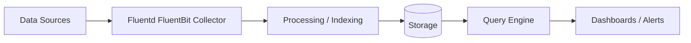

# Fluentd & Fluent Bit — A 2-Day Crash Course

Log collectors and shippers that move logs from everywhere to somewhere — Fluentd is the Swiss Army knife with a rich plugin ecosystem, Fluent Bit is the lightweight alternative built for containers and edge nodes.

---

## Part 0 — Why

Every service writes logs. Kubernetes pods write to stdout. Systemd captures it. Your app drops JSON to a file. Your load balancer spits access logs. None of that is useful if it stays on the node.

You need something to pick those logs up, optionally transform them, and deliver them to a place where you can actually query them — Loki, Elasticsearch, S3, Kafka, or all four simultaneously.

Fluentd and Fluent Bit are the pipes. They sit between your application and your storage backend. Without them you are SSH-ing into nodes and grepping files. That works until it doesn't — until the node dies, until the log rotates, until you have 200 pods.

These tools give you:

- **Centralized collection** — one place to configure where logs go
- **Parsing** — turn raw strings into structured fields
- **Enrichment** — add Kubernetes metadata, host labels, environment tags
- **Buffering** — absorb spikes, survive backend downtime, guarantee delivery
- **Routing** — send app logs to Loki, audit logs to S3, errors to PagerDuty

---

## Vocabulary

**Input** — the source plugin. Tail a file, read from systemd, listen on a TCP port, scrape the Docker daemon socket.

**Parser** — turns a raw log line into structured key-value fields. Regex, JSON, Logfmt, Nginx, Apache — built-in or custom.

**Filter** — transforms records in flight. Add fields, drop fields, rename keys, parse nested JSON, enrich with metadata.

**Output** — the destination plugin. Loki, Elasticsearch, S3, Kafka, stdout, HTTP endpoint.

**Buffer** — a queue that sits between the filter chain and the output. Absorbs bursts. Retries on failure. Can be memory or filesystem-backed.

**Tag** — a string label attached to every record, used for routing. Format is dot-separated: `kube.var.log.containers.myapp`.

**Match** — a directive that says "records with this tag pattern go to this output." Tags and matches are how you route logs.

**Router** — the mechanism that evaluates tags against match rules and dispatches records accordingly.

**DaemonSet** — the Kubernetes workload type used to run Fluent Bit on every node. One pod per node, privileged, with host path mounts so it can read `/var/log/containers`.

---




## DAY 1 — Fluent Bit on Kubernetes

### Goal

Deploy Fluent Bit as a DaemonSet, collect container logs from every node, parse them, and ship to Loki or Elasticsearch.

### Step 1 — Deploy with Helm

```bash
helm repo add fluent https://fluent.github.io/helm-charts
helm repo update

helm install fluent-bit fluent/fluent-bit \
  --namespace logging \
  --create-namespace \
  --values values.yaml
```

### Step 2 — Minimal values.yaml for Loki

```yaml
config:
  inputs: |
    [INPUT]
        Name              tail
        Path              /var/log/containers/*.log
        multiline.parser  docker, cri
        Tag               kube.*
        Mem_Buf_Limit     5MB
        Skip_Long_Lines   On

  filters: |
    [FILTER]
        Name                kubernetes
        Match               kube.*
        Kube_URL            https://kubernetes.default.svc:443
        Kube_CA_File        /var/run/secrets/kubernetes.io/serviceaccount/ca.crt
        Kube_Token_File     /var/run/secrets/kubernetes.io/serviceaccount/token
        Merge_Log           On
        Keep_Log            Off
        K8S-Logging.Parser  On
        K8S-Logging.Exclude On

  outputs: |
    [OUTPUT]
        Name            loki
        Match           kube.*
        Host            loki.logging.svc.cluster.local
        Port            3100
        Labels          job=fluentbit, namespace=$kubernetes['namespace_name'], pod=$kubernetes['pod_name']
        Auto_Kubernetes_Labels On

tolerations:
  - operator: Exists
```

### Step 3 — Verify it's running

```bash
kubectl get ds -n logging
kubectl logs -n logging -l app.kubernetes.io/name=fluent-bit --tail=50
```

Look for lines like `[output:loki] worker #0 connected to loki`. If you see `connection refused`, check the Loki service DNS.

### Step 4 — Basic JSON parsing

If your app logs JSON, Fluent Bit parses it automatically when you set `Merge_Log On` in the Kubernetes filter. The JSON fields become top-level fields in the record.

For non-JSON, add a parser:

```ini
[PARSER]
    Name        myapp
    Format      regex
    Regex       ^(?<time>[^ ]+) (?<level>[A-Z]+) (?<message>.+)$
    Time_Key    time
    Time_Format %Y-%m-%dT%H:%M:%S.%L

[INPUT]
    Name    tail
    Path    /var/log/containers/myapp*.log
    Parser  myapp
    Tag     kube.myapp
```

### Step 5 — Ship to Elasticsearch instead

```ini
[OUTPUT]
    Name            es
    Match           kube.*
    Host            elasticsearch.logging.svc.cluster.local
    Port            9200
    Index           kubernetes_logs
    Type            _doc
    Logstash_Format On
    Logstash_Prefix k8s
    Retry_Limit     False
```

`Logstash_Format On` creates daily indices like `k8s-2026.05.31` — useful if you are coming from a Logstash background.

---

## DAY 2 — Going Deeper

### Fluentd vs Fluent Bit — When to Use Which

Both are CNCF projects from Treasure Data. Fluent Bit was spun out of Fluentd specifically for resource-constrained environments.

| | Fluent Bit | Fluentd |
|---|---|---|
| Memory footprint | ~1 MB | ~40 MB |
| Language | C | Ruby + C extensions |
| Plugin ecosystem | ~100 plugins | ~1000+ plugins |
| Config syntax | INI sections | Ruby-ish directives |
| Multiline support | Built-in | Via plugins |
| Routing complexity | Good | Excellent |
| Aggregation role | Not ideal | Strong fit |

Use Fluent Bit as a **node-level agent** (DaemonSet). Use Fluentd as a **central aggregator** — collecting from Fluent Bit instances, doing heavy transformation, fanning out to multiple backends.

A common pattern: Fluent Bit on every node ships to a Fluentd StatefulSet, which fans out to Loki, S3, and Kafka simultaneously.

### Custom Parsers

Regex parsers let you extract any field from a log line.

```ini
[PARSER]
    Name        nginx_custom
    Format      regex
    Regex       ^(?<remote>[^ ]*) - (?<user>[^ ]*) \[(?<time>[^\]]*)\] "(?<method>\S+) (?<path>[^ ]*) \S+" (?<status>[^ ]*) (?<size>[^ ]*)
    Time_Key    time
    Time_Format %d/%b/%Y:%H:%M:%S %z
```

For Fluentd, use `@type regexp` inside a `<parse>` block with the same named capture groups and `time_key`/`time_format` fields.

### Multiline Logs

Stack traces, Spring Boot startup logs, anything that spans multiple lines — this is one of the trickiest parts.

Fluent Bit uses a state-machine approach via `[MULTILINE_PARSER]`:

```ini
[INPUT]
    Name              tail
    Path              /var/log/containers/myapp*.log
    multiline.parser  java
    Tag               kube.java

[MULTILINE_PARSER]
    name          java_custom
    type          regex
    flush_timeout 1000
    rule          "start_state"   "/^\d{4}-\d{2}-\d{2}/"  "cont"
    rule          "cont"          "/^[^\d]/"               "cont"
```

`start_state` matches the first line of an event. `cont` matches continuation lines. A new `start_state` match flushes the previous event.

For Fluentd, use `fluent-plugin-concat` with `multiline_start_regexp /^\d{4}-\d{2}-\d{2}/` and `flush_interval 3s`.

### Enrichment Filters

The Kubernetes filter in Fluent Bit adds pod name, namespace, container name, labels, and annotations to every record. This is what makes log search useful — you can filter by `namespace=production` or `app=payments`.

```ini
[FILTER]
    Name                kubernetes
    Match               kube.*
    Kube_URL            https://kubernetes.default.svc:443
    Merge_Log           On
    Labels              On
    Annotations         Off
```

Turn `Annotations Off` unless you specifically need them — annotations can bloat records significantly.

For custom enrichment, use the `record_modifier` filter:

```ini
[FILTER]
    Name            record_modifier
    Match           *
    Record          cluster my-cluster-name
    Record          environment production
```

In Fluentd:

```xml
<filter **>
  @type record_transformer
  <record>
    cluster "my-cluster-name"
    environment "production"
    hostname "#{Socket.gethostname}"
  </record>
</filter>
```

### Buffering and Retry

Without buffering, a backend blip causes log loss. With filesystem buffering, Fluent Bit writes chunks to disk and retries until the backend recovers.

```ini
[OUTPUT]
    Name            loki
    Match           kube.*
    Host            loki.logging.svc.cluster.local
    Port            3100
    storage.type    filesystem
    Retry_Limit     False
```

`Retry_Limit False` means retry forever — appropriate for logs you cannot afford to lose. Set a numeric value (e.g., `5`) if you would rather drop and move on after exhausting retries.

For Fluentd, add a `<buffer>` block inside your `<match>`: set `@type file`, `flush_interval 5s`, `retry_type exponential_backoff`, and `overflow_action block`. The `block` action applies backpressure rather than dropping records when the buffer fills — use `drop_oldest_chunk` if you would rather lose old data than slow ingestion.

### Output Plugins

**S3** — long-term archival, cost-effective:

```ini
[OUTPUT]
    Name            s3
    Match           kube.*
    bucket          my-log-bucket
    region          us-east-1
    s3_key_format   /kubernetes/%Y/%m/%d/%H/$TAG[4].%M.gz
    total_file_size 50M
    upload_timeout  10m
    compression     gzip
    store_dir       /tmp/fluent-bit/s3
```

**Kafka** — streaming pipeline, fan-out:

```ini
[OUTPUT]
    Name            kafka
    Match           kube.*
    Brokers         kafka.logging.svc.cluster.local:9092
    Topics          kubernetes-logs
    rdkafka.compression.type gzip
```

**Elasticsearch**:

```ini
[OUTPUT]
    Name            es
    Match           kube.*
    Host            elasticsearch.logging.svc.cluster.local
    Port            9200
    Index           k8s-logs
    Logstash_Format On
    tls             Off
    HTTP_User       elastic
    HTTP_Passwd     ${ES_PASSWORD}
```

### Performance Tuning

Key SERVICE knobs for a busy node: `Flush 1` (flush every second — lower latency, higher CPU), `storage.path /var/log/fluentbit/storage` (enables filesystem buffering globally), `HTTP_Server On` + `HTTP_Port 2020` (exposes `/api/v1/metrics` for Prometheus). Set `storage.backlog.mem_limit 5M` to cap memory used for retry backlog.

For Fluentd the main lever is `workers 4` in `<system>` — each worker runs a parallel copy of the pipeline. Match worker count to available cores on the aggregator node.

---

## Worked Example — K8s Logs to Loki with Structured Parsing

This is a production-ready Fluent Bit config that collects container logs, parses JSON app logs, adds Kubernetes metadata, and ships to Loki with appropriate labels.

```ini
[SERVICE]
    Flush           5
    Daemon          Off
    Log_Level       warn
    Parsers_File    parsers.conf
    HTTP_Server     On
    HTTP_Listen     0.0.0.0
    HTTP_Port       2020
    storage.path    /var/log/fluent-bit/storage
    storage.sync    normal

[INPUT]
    Name              tail
    Path              /var/log/containers/*.log
    Exclude_Path      /var/log/containers/fluent-bit*,/var/log/containers/kube-system*
    multiline.parser  docker, cri
    Tag               kube.*
    DB                /var/log/fluent-bit/tail.db
    Mem_Buf_Limit     10MB
    Skip_Long_Lines   On
    Refresh_Interval  10

[FILTER]
    Name                kubernetes
    Match               kube.*
    Kube_URL            https://kubernetes.default.svc:443
    Kube_CA_File        /var/run/secrets/kubernetes.io/serviceaccount/ca.crt
    Kube_Token_File     /var/run/secrets/kubernetes.io/serviceaccount/token
    Kube_Tag_Prefix     kube.var.log.containers.
    Merge_Log           On
    Keep_Log            Off
    K8S-Logging.Parser  On
    K8S-Logging.Exclude On
    Labels              On
    Annotations         Off

[FILTER]
    Name            record_modifier
    Match           kube.*
    Record          cluster production-east-1

[FILTER]
    Name            grep
    Match           kube.*
    Exclude         log /health|/readyz|/livez/

[OUTPUT]
    Name            loki
    Match           kube.*
    Host            loki.monitoring.svc.cluster.local
    Port            3100
    Labels          job=fluentbit, cluster=production-east-1, namespace=$kubernetes['namespace_name'], app=$kubernetes['labels']['app']
    Auto_Kubernetes_Labels Off
    Line_Format     json
    storage.type    filesystem
    Retry_Limit     False
```

The `DB` directive on the INPUT tells Fluent Bit to persist its read position — if the pod restarts, it picks up where it left off instead of re-reading or skipping.

`Exclude_Path` drops Fluent Bit's own logs from the pipeline to avoid feedback loops, and noisy kube-system containers.

The `grep` filter drops health check noise before it hits Loki — reduces cardinality and storage costs.

---

## Pitfalls

**Feedback loops.** If Fluent Bit collects its own logs and ships them, those logs get collected again, creating an infinite loop. Always add `Exclude_Path` for the Fluent Bit container path.

**Wrong tag format.** The Kubernetes filter expects tags in the format `kube.var.log.containers.<pod>_<namespace>_<container>-<hash>.log`. If your tag doesn't match this pattern exactly, the filter won't enrich the record. Check with `Log_Level debug` and look for `kubernetes filter`.

**Multiline with CRI format.** Kubernetes 1.24+ with containerd uses CRI log format, not Docker JSON. Use `multiline.parser docker, cri` (both, comma-separated) to handle both.

**Buffer disk full.** If the output is down for hours and `Retry_Limit False` is set, the buffer grows without bound. Mount the buffer path on a dedicated volume and set a size limit, or configure `storage.total_limit_size` in SERVICE.

**Loki label cardinality.** Every unique combination of label values creates a new stream in Loki. Don't use `pod_name` or `container_id` as labels — use `namespace`, `app`, `environment`. High cardinality labels kill Loki performance.

**Fluentd Ruby GC pauses.** Fluentd is Ruby. Under high load, GC pauses can cause buffering spikes. Monitor `fluentd_output_status_buffer_queue_length`. If it climbs steadily, add workers or move to Fluent Bit for that workload.

**Kubernetes RBAC.** The Fluent Bit service account needs `get`, `list`, `watch` on pods and namespaces for the Kubernetes filter to work. Missing RBAC causes silent enrichment failures — records are shipped without Kubernetes metadata.

⚠️ Never set `Retry_Limit False` without also setting a `storage.total_limit_size`. An unbounded retry queue on a filesystem-backed buffer will fill the node disk and take down the entire node.

---

## Quick Reference

```bash
# Check Fluent Bit is collecting logs
kubectl logs -n logging ds/fluent-bit --tail=100 | grep -E "error|warn|output"

# Check metrics endpoint
kubectl port-forward -n logging ds/fluent-bit 2020:2020
curl http://localhost:2020/api/v1/metrics

# Check Fluent Bit config in cluster
kubectl get configmap -n logging fluent-bit -o yaml

# Fluentd — test config syntax
fluentd --dry-run -c /etc/fluentd/fluent.conf

# Fluent Bit — test config syntax
fluent-bit -c /etc/fluent-bit/fluent-bit.conf --dry-run

# Common Fluent Bit labels pattern for Loki
Labels job=fluentbit, namespace=$kubernetes['namespace_name'], app=$kubernetes['labels']['app']

# Add [OUTPUT] Name stdout / Match * temporarily to debug tag flow
```

**Key config files:**

- `/etc/fluent-bit/fluent-bit.conf` — main config
- `/etc/fluent-bit/parsers.conf` — parser definitions
- `/var/log/fluent-bit/tail.db` — read position database
- `/var/log/fluent-bit/storage/` — filesystem buffer

**Helm:** repo `https://fluent.github.io/helm-charts`, chart `fluent/fluent-bit`. Inspect defaults with `helm show values fluent/fluent-bit`.

---


## Top 10 Interview Questions

<details>
<summary><strong>Q: What is Fluentd FluentBit and what problem does it solve?</strong></summary>

Fluentd FluentBit addresses a specific need in modern engineering workflows. Understanding the core problem it solves — and the alternatives it replaced — is the foundation for every subsequent interview question. Frame your answer around the pain point first, then the solution.

</details>

<details>
<summary><strong>Q: How does Fluentd FluentBit compare to its main alternatives?</strong></summary>

Every tool exists in an ecosystem of alternatives. Be prepared to articulate the specific tradeoffs: when Fluentd FluentBit is the right choice, when an alternative is better, and what factors drive the decision (scale, team expertise, existing infrastructure, compliance requirements).

</details>

<details>
<summary><strong>Q: What are the most common production pitfalls with Fluentd FluentBit?</strong></summary>

Production experience is what separates senior from junior engineers. Common pitfalls include: misconfiguration that works in dev but fails at scale, security oversights, inadequate monitoring, and operational procedures that are untested until an incident occurs. Cite specific examples from your experience.

</details>

<details>
<summary><strong>Q: How do you monitor and observe Fluentd FluentBit in production?</strong></summary>

Key metrics to track, alerting thresholds to set, dashboards to build, and log patterns to watch. Production monitoring should cover: health/liveness, performance (latency, throughput), capacity (resource utilisation), and business impact (error rates affecting users). Explain which metrics are leading indicators versus lagging.

</details>

<details>
<summary><strong>Q: How do you scale Fluentd FluentBit as load increases?</strong></summary>

Scaling strategies depend on the bottleneck: horizontal scaling (add more instances), vertical scaling (bigger instances), caching (reduce load), sharding (distribute data), and async processing (decouple components). Explain which approach applies to Fluentd FluentBit and at what scale each strategy becomes necessary.

</details>

<details>
<summary><strong>Q: How do you handle security and access control with Fluentd FluentBit?</strong></summary>

Security is non-negotiable in production. Cover: authentication and authorization mechanisms, secrets management (never in code), encryption (at rest and in transit), network security (firewalls, private networks), audit logging, and compliance requirements relevant to your industry.

</details>

<details>
<summary><strong>Q: How do you implement disaster recovery for Fluentd FluentBit?</strong></summary>

DR planning requires defining RTO (recovery time objective) and RPO (recovery point objective), implementing backup strategies, testing restore procedures, and documenting runbooks. Explain your backup strategy, how you test restores, and what your recovery procedure looks like.

</details>

<details>
<summary><strong>Q: How do you automate Fluentd FluentBit deployment and configuration management?</strong></summary>

Infrastructure as code, CI/CD pipelines, configuration management, and GitOps workflows. Explain how you version, test, deploy, and roll back changes. Cover: what is automated, what requires manual approval, and how you handle configuration drift.

</details>

<details>
<summary><strong>Q: How do you troubleshoot issues with Fluentd FluentBit in production?</strong></summary>

A systematic debugging approach: check health endpoints, review recent changes (deploys, config changes), examine logs and metrics, reproduce the issue, identify root cause, fix, verify, and write a postmortem. Explain your actual debugging workflow with concrete examples.

</details>

<details>
<summary><strong>Q: What are the best practices for Fluentd FluentBit that you have learned from experience?</strong></summary>

Best practices that go beyond documentation: lessons learned from production incidents, configuration patterns that prevent common issues, testing strategies that catch bugs before production, and operational procedures that reduce toil. Share specific examples where following (or not following) a best practice had measurable impact.

</details>

---


## Quick Quiz

Test your understanding with these rapid-fire questions (answers hidden):

<details>
<summary>1. What is the ONE core problem that Fluentd FluentBit solves?</summary>
Re-read Part 0 — the mental model section. If you can explain the "why" in one sentence, you understand the foundation.
</details>

<details>
<summary>2. Name the 3 most important terms from the vocabulary section.</summary>
Review Part 1. These are the building blocks every conversation about Fluentd FluentBit uses.
</details>

<details>
<summary>3. What is the first thing you would set up on Day 1?</summary>
Check the Day 1 section — the very first hands-on step that gets you a working result.
</details>

<details>
<summary>4. What is the most common production pitfall with Fluentd FluentBit?</summary>
Review the Common Pitfalls section. The first item listed is typically the most frequently encountered.
</details>

<details>
<summary>5. How does Fluentd FluentBit compare to its closest alternative?</summary>
Check the Comparison Matrix below — focus on the key differentiating row.
</details>


## Comparison Matrix

| Dimension | Fluentd/Fluent Bit | Logstash | Vector |
|-----------|--------------------|----------|--------|
| **Primary use case** | Core strength of Fluentd/Fluent Bit | Core strength of Logstash | Core strength of Vector |
| **Learning curve** | Moderate | Varies | Varies |
| **Community/ecosystem** | Active | Active | Growing |
| **Operational complexity** | Medium | Varies | Varies |
| **Best for** | See Part 0 | Different tradeoffs | Different tradeoffs |

> **How to read this matrix:** no tool wins on every dimension. Pick based on your specific constraints — team expertise, existing infrastructure, scale requirements, and compliance needs. The right choice is the one that fits your context, not the one with the most checkmarks.

## Next Steps

- `Loki.md` — querying the logs you just shipped, LogQL, label strategy
- `ELK-Stack.md` — Elasticsearch + Kibana as an alternative backend
- `OpenTelemetry.md` — unified approach combining logs, metrics, and traces
- `Kubernetes.md` — DaemonSet mechanics, RBAC, node affinity, tolerations

---

## Recommended learning resources

**YouTube channels & playlists:**
- [CNCF — KubeCon Logging & Fluent Ecosystem Track](https://www.youtube.com/@caborstudio) — conference talks on Fluent Bit in Kubernetes, DaemonSet patterns, and log pipeline design
- [Grafana Labs — Fluent Bit to Loki Pipeline](https://www.youtube.com/@GrafanaLabs) — official tutorials on shipping logs from Fluent Bit into Loki and building dashboards
- [TechWorld with Nana — Kubernetes Logging](https://www.youtube.com/@TechWorldwithNana) — beginner-friendly walkthrough of log collection in Kubernetes with Fluent Bit
- [DevOps Toolkit (Viktor Farcic) — Log Aggregation Compared](https://www.youtube.com/@DevOpsToolkit) — practical comparison of Fluent Bit, Fluentd, Logstash, and Promtail
- [Elastic Official — Fluentd & Filebeat Alternatives](https://www.youtube.com/@Elastic) — understanding how Fluentd fits alongside or replaces Filebeat in ELK pipelines

**Official docs & blogs:**
- [Fluent Bit Official Documentation](https://docs.fluentbit.io/)
- [Fluentd Official Documentation](https://docs.fluentd.org/)
- [Grafana Labs Blog — Log Shipping](https://grafana.com/blog/) — posts on Fluent Bit configuration patterns, Loki output tuning, and Alloy migration

## The Mantra

> You are not logging until logs survive a node restart, a backend outage, and a 10x traffic spike without loss. Fluent Bit gives you the agent. Buffer gives you the resilience. Structured labels give you the queryability. All three, or you are just hoping.
