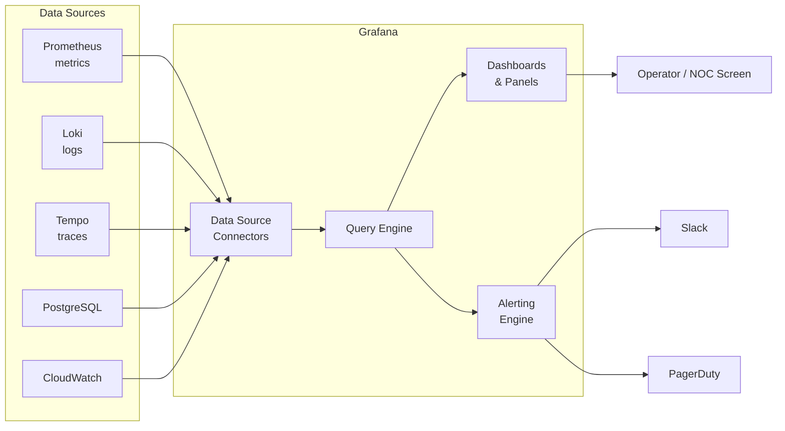

# Grafana — A 2-Day Crash Course

> **In one sentence:** Grafana is the dashboard and visualization layer — it connects to your
> data sources (Prometheus, Loki, databases…), turns queries into graphs you can read at a
> glance, and alerts you when something crosses a line.

> Pairs with `Prometheus.md` (metrics) and `Loki.md` (logs). Grafana *visualizes*; it doesn't
> store data itself.

---

## Part 0 — Why Grafana exists

Prometheus can graph a single query, but operating a real system means watching dozens of
signals across many services, correlating them, and spotting trends — at 3am, fast. You need a
**dashboard**: a curated wall of panels that tells you the health of a system in five seconds.
And you need it to pull from *all* your data, not just one tool.

Grafana is that layer. Its superpower is being **data-source agnostic**: one dashboard can show
Prometheus metrics next to Loki logs next to a SQL query, all on the same time range. It's the
single pane of glass operators actually look at.

**Mental model:** Grafana owns no data. It's a smart picture-frame: you plug in **data sources**
(where the data lives), write **queries** (what to fetch), and arrange **panels** (how to show
it) on **dashboards** (the wall). Change the time range at the top and every panel re-queries
for that window.



---

## Part 1 — The vocabulary

| Term | Meaning |
|------|---------|
| **Data source** | A backend Grafana queries (Prometheus, Loki, PostgreSQL, CloudWatch…) |
| **Panel** | One visualization (a graph, gauge, table, stat) driven by a query |
| **Dashboard** | A collection of panels, sharing a time range and variables |
| **Query** | The expression sent to the data source (PromQL for Prometheus, etc.) |
| **Variable** | A dashboard dropdown (`$namespace`) that makes panels reusable/filterable |
| **Alert rule** | A condition on a query that fires notifications |
| **Provisioning** | Defining data sources/dashboards as code (YAML/JSON), not by clicking |

---

## DAY 1 — Get it working

### 1. Run it and add a data source
Grafana runs on port 3000 (default login admin/admin). First thing: connect a data source.
**Connections → Data sources → Add → Prometheus**, set the URL (e.g. `http://prometheus:9090`),
Save & Test. Now Grafana can query your metrics.

### 2. Build your first panel
Create a dashboard → **Add panel**. In the query editor pick the Prometheus data source and
enter PromQL:
```promql
sum(rate(http_requests_total[5m]))
```
You get a time-series graph of requests per second. The panel editor is where you'll spend
time:
- **Query** tab — the PromQL/LogQL/SQL expression(s). Add several queries to overlay lines.
- **Visualization** — Time series, Stat, Gauge, Bar gauge, Table, Heatmap, etc.
- **Legend / unit** — set the unit (e.g. "req/s", "bytes", "percent") so axes read correctly.
- **Legend `{{label}}`** — `{{code}}` turns one query-by-code into a labeled line per status.

### 3. The three panel types you'll use most
- **Time series** — the default; trends over time (RPS, latency, CPU).
- **Stat** — one big number (current error rate, uptime) with optional sparkline + thresholds
  (green/amber/red).
- **Table** — tabular data (top endpoints, current alerts).
Pick the simplest panel that conveys the signal. A 3am dashboard is mostly Stats (is it red?)
backed by Time series (why?).

### 4. Time range & refresh (the controls that change everything)
Top-right: the **time range** (Last 5m / 1h / 24h / custom) and **auto-refresh**. Every panel
queries for the selected window. Learning to zoom the time range — drag-select on any graph to
zoom in — is how you investigate incidents.

### 5. Import a ready-made dashboard (don't build from scratch)
Grafana has thousands of community dashboards. **Dashboards → Import → enter a dashboard ID**
(e.g. Node Exporter Full is `1860`), pick your Prometheus data source, and you instantly have a
full host-monitoring dashboard. Start here, then customize.

**By end of Day 1 you can:** connect a data source, build panels with queries, choose
visualizations and units, control time ranges, and import community dashboards. That's a working
observability cockpit.

---

## DAY 2 — Make it real

### 1. Variables — one dashboard, every service
Hardcoding `job="api"` into every panel means a dashboard per service. Instead, define a
**variable** (Dashboard settings → Variables):
```
Name: job   Type: Query   Query: label_values(http_requests_total, job)
```
This creates a dropdown listing every `job`. Use it in panels: `rate(http_requests_total{job="$job"}[5m])`.
Now one dashboard works for all services, filterable from the dropdown. Add `$namespace`,
`$instance`, etc. — variables are what turn a dashboard from one-off to reusable.

### 2. Multi-source correlation (Grafana's real strength)
On one dashboard, put a metrics panel (Prometheus: error rate) next to a logs panel
(Loki: `{job="api"} |= "error"`). When the error-rate graph spikes, the matching logs are right
there on the same time range. This metrics↔logs correlation is the fastest path from "something's
wrong" to "here's why" — and it's why teams standardize on Grafana + Prometheus + Loki (the
"LGTM"-style stack).

### 3. Panel polish that makes dashboards readable
- **Thresholds** — color a Stat/Gauge green→amber→red at chosen values (instant health read).
- **Units** — always set them; "1500000000" vs "1.5 GB" is the difference between usable and not.
- **Legends** — use `{{label}}` templating; hide noisy series.
- **Rows** — group related panels (a row per service/subsystem) and collapse them.
- **Annotations** — overlay deploy markers on graphs so you can see "the error spike started at
  the 14:02 deploy."

### 4. Alerting (Grafana-managed alerts)
Grafana has its own unified alerting (alongside Prometheus's). Create an **Alert rule**: a query
+ a condition (e.g. `error_rate > 0.05`) + a duration + a **contact point** (Slack, email,
PagerDuty, webhook) + a **notification policy** (routing/grouping). Useful when your data lives
in sources other than Prometheus, or you want alerting and dashboards in one place. (For
Prometheus-native alerting, see `Alertmanager.md` — many shops use both.)

### 5. Dashboards as code (provisioning)
Clicking dashboards into existence isn't reproducible. Treat them as code:
- Every dashboard has a **JSON model** (Dashboard settings → JSON Model) — commit it to Git.
- **Provision** data sources and dashboards from YAML files Grafana reads at startup, so a fresh
  Grafana comes up fully configured.
```yaml
# provisioning/datasources/prometheus.yaml
apiVersion: 1
datasources:
  - name: Prometheus
    type: prometheus
    url: http://prometheus:9090
    access: proxy
    isDefault: true
```
This is how you version-control and review observability, and how the kube-prometheus-stack ships
dashboards automatically.

### 6. Organization at scale
- **Folders** to group dashboards by team/system; **permissions** per folder.
- **Playlists** to rotate dashboards on a wall display (NOC screens).
- **Library panels** to reuse one panel definition across dashboards.

---

## Worked example — a service health dashboard
```text
1. Add Prometheus + Loki data sources.
2. Variables: $job (label_values(http_requests_total, job)), $instance.
3. Row "Golden Signals":
   - Stat: error rate %  (threshold red >5%)
   - Time series: RPS  sum(rate(http_requests_total{job="$job"}[5m]))
   - Time series: p95 latency  histogram_quantile(0.95, sum by(le)(rate(..._bucket[5m])))
   - Stat: saturation (CPU %)
4. Row "Logs": Loki panel {job="$job"} |= "error" — correlates with the spikes above.
5. Annotations: overlay deploy events.
6. Export the JSON model, commit to Git; provision it so it deploys with the stack.
```

---


## Terminal Demo

```terminal-demo
# grafana-cli@monitoring ~ %

$ grafana-cli --version
Grafana CLI version 10.4.1

$ grafana-cli plugins ls
installed plugins:
  - grafana-piechart-panel @ 1.6.4
  - grafana-clock-panel @ 2.1.3
  - grafana-polystat-panel @ 2.1.0

$ curl -s -u admin:admin localhost:3000/api/datasources | jq '.[].name'
"Prometheus"
"Loki"
"Tempo"
"PostgreSQL"

$ curl -s -u admin:admin localhost:3000/api/search?type=dash-db | jq '.[:5][] | {title,uid,url}'
{"title":"API Overview","uid":"api-001","url":"/d/api-001"}
{"title":"Kubernetes Cluster","uid":"k8s-001","url":"/d/k8s-001"}
{"title":"Node Exporter","uid":"node-001","url":"/d/node-001"}
{"title":"PostgreSQL","uid":"pg-001","url":"/d/pg-001"}

$ curl -s -u admin:admin localhost:3000/api/alerts | jq '.[:3][] | {name,state,severity}'
{"name":"High API Latency","state":"ok","severity":"critical"}
{"name":"Low Disk Space","state":"ok","severity":"warning"}
{"name":"Pod Restart Loop","state":"alerting","severity":"critical"}

$ grafana-cli admin reset-admin-password newpassword
Admin password changed successfully ✔

$ curl -s -u admin:admin -X POST localhost:3000/api/dashboards/db -H "Content-Type: application/json" -d @dashboard.json | jq '{status,uid,url}'
{"status":"success","uid":"new-001","url":"/d/new-001"}
```

---

## Common pitfalls
- **Building dashboards from scratch.** Import community dashboards (by ID) and adapt — huge
  time saver.
- **No units set.** Raw numbers are unreadable. Always set the panel unit.
- **Hardcoding labels instead of variables.** You'll end up with a dashboard per service. Use
  `$job`/`$namespace` variables.
- **Too many panels.** A dashboard nobody can read at a glance is useless. Lead with a few Stats
  (red/green), detail below.
- **Click-only dashboards.** They vanish when Grafana is rebuilt and can't be reviewed. Export
  JSON / provision as code.
- **Confusing Grafana with a data store.** It queries live from sources; retention/storage is
  the data source's job (Prometheus/Loki).
- **Putting secrets in dashboard JSON / data source configs in Git.** Use env vars / secrets
  for credentials.

---

## Quick reference
```text
NAVIGATION
  Connections -> Data sources         add/test a backend
  Dashboards -> New / Import (by ID)   create or pull a community dashboard
  Panel edit: Query | Transform | Visualization | (units, thresholds, legend)
  Top-right: time range + refresh (drag-select on a graph to zoom)

VARIABLES (Dashboard settings -> Variables)
  Query var:   label_values(metric, label)      use as {label="$var"}
  Multi-value + "All" option for filters

VISUALIZATIONS
  Time series (trends) | Stat (one number) | Gauge | Bar gauge | Table | Heatmap | Logs

LEGEND TEMPLATING   {{label}}   e.g. {{code}}, {{instance}}

ALERTING
  Alert rule (query + condition + for) -> Contact point (Slack/Email/PagerDuty)
  -> Notification policy (routing/grouping)

AS CODE
  Dashboard settings -> JSON Model (commit to Git)
  provisioning/datasources/*.yaml  and  provisioning/dashboards/*.yaml
```

---

## Top 10 Interview Questions

<details>
<summary><strong>Q: Grafana does not store data itself — so what exactly does it do, and why is that separation valuable?</strong></summary>

Grafana is a visualization and alerting layer that queries external data sources (Prometheus, Loki, PostgreSQL, CloudWatch, etc.) in real time. The separation means you can swap or add backends without changing dashboards, and each backend scales independently. It also means Grafana stays lightweight — it renders, it does not retain.

</details>

<details>
<summary><strong>Q: How do you make a single Grafana dashboard work for dozens of services without duplicating it?</strong></summary>

You define template variables (Dashboard settings → Variables) using queries like `label_values(http_requests_total, job)`. Panels reference `$job` instead of a hardcoded value. A dropdown lets operators switch between services, and the "All" option shows everything at once. This turns one dashboard into a reusable instrument for every team.

</details>

<details>
<summary><strong>Q: What is the difference between Grafana-managed alerting and Prometheus Alertmanager-based alerting? When would you use each?</strong></summary>

Prometheus alerting evaluates PromQL rules inside Prometheus and fires to Alertmanager for routing and grouping. Grafana-managed alerting evaluates queries from any data source (not just Prometheus) inside Grafana and routes notifications via its own contact points and policies. Use Prometheus/Alertmanager when you want alerting decoupled from the UI layer. Use Grafana alerting when you need to alert on non-Prometheus sources or want a single pane for both dashboards and alert configuration.

</details>

<details>
<summary><strong>Q: How do you version-control Grafana dashboards in a team environment?</strong></summary>

Export the dashboard JSON model (Dashboard settings → JSON Model) and commit it to Git. For automated deployments, use Grafana's provisioning system — place YAML files in `provisioning/datasources/` and `provisioning/dashboards/` so Grafana loads them at startup. The kube-prometheus-stack Helm chart ships dashboards this way. This makes dashboards reviewable, reproducible, and recoverable.

</details>

<details>
<summary><strong>Q: A dashboard panel shows "No data." Walk through how you would troubleshoot it.</strong></summary>

First, check the time range — a too-narrow or future window shows nothing. Second, open the panel editor and run the query in Explore to see if the data source returns results. Third, verify the data source connection (Connections → Data sources → Test). Fourth, check that variable values resolve correctly — a `$namespace` set to a non-existent value filters everything out. Finally, confirm the metric actually exists in the backend (e.g. run `up` in Prometheus).

</details>

<details>
<summary><strong>Q: What are Grafana annotations, and how do they help during incident investigation?</strong></summary>

Annotations overlay event markers — such as deployments, config changes, or scaling events — directly on time-series graphs. During an incident, you can visually correlate a latency spike with a deploy marker at the same timestamp, immediately narrowing the blast radius. Annotations can be added manually, via API, or automatically from CI/CD pipelines.

</details>

<details>
<summary><strong>Q: How does Grafana correlate metrics and logs on the same dashboard?</strong></summary>

You place a Prometheus panel (e.g. error rate) and a Loki panel (e.g. `{app="api"} |= "error"`) on the same dashboard sharing the same time range and variables. When you drag-select a spike on the metrics graph, the time range updates and the Loki panel shows the matching logs. This metrics-to-logs correlation is the fastest path from "something is wrong" to "here is why."

</details>

<details>
<summary><strong>Q: What are Grafana library panels, and when would you use them?</strong></summary>

A library panel is a reusable panel definition stored centrally. When you update it, every dashboard that references it gets the change. Use them for standardized panels — golden-signal stats, SLO burn-rate gauges — that appear across many team dashboards. This avoids drift and reduces maintenance when query logic or thresholds change.

</details>

<details>
<summary><strong>Q: You inherit a Grafana instance with 200 click-created dashboards and no provisioning. How do you bring it under control?</strong></summary>

Export each dashboard's JSON via the Grafana API (`/api/dashboards/uid/<uid>`), organize them into a Git repo by team or service, and set up provisioning YAML so Grafana reads from that repo on startup. Going forward, treat the repo as the source of truth and use CI to deploy changes. For the transition, keep Grafana in read-write mode but review and merge any click-edits back into Git periodically.

</details>

<details>
<summary><strong>Q: What is the LGTM stack, and why has it become a popular observability choice?</strong></summary>

LGTM stands for Loki (logs), Grafana (visualization), Tempo (traces), and Mimir (metrics). All four are Grafana Labs projects designed to work together — same label model, native cross-linking (trace-to-log, metric-to-trace via exemplars), and a single Grafana UI. The appeal is a unified, open-source observability platform with no vendor lock-in, lower cost than commercial alternatives, and consistent operational patterns across all three signals.

</details>

---


## Quick Quiz

Test your understanding with these rapid-fire questions (answers hidden):

<details>
<summary>1. What is the ONE core problem that Grafana solves?</summary>
Re-read Part 0 — the mental model section. If you can explain the "why" in one sentence, you understand the foundation.
</details>

<details>
<summary>2. Name the 3 most important terms from the vocabulary section.</summary>
Review Part 1. These are the building blocks every conversation about Grafana uses.
</details>

<details>
<summary>3. What is the first thing you would set up on Day 1?</summary>
Check the Day 1 section — the very first hands-on step that gets you a working result.
</details>

<details>
<summary>4. What is the most common production pitfall with Grafana?</summary>
Review the Common Pitfalls section. The first item listed is typically the most frequently encountered.
</details>

<details>
<summary>5. How does Grafana compare to its closest alternative?</summary>
Check the Comparison Matrix below — focus on the key differentiating row.
</details>


## Comparison Matrix

| Dimension | Grafana | Datadog | Kibana |
|-----------|---------|---------|--------|
| **Primary use case** | Core strength of Grafana | Core strength of Datadog | Core strength of Kibana |
| **Learning curve** | Moderate | Varies | Varies |
| **Community/ecosystem** | Active | Active | Growing |
| **Operational complexity** | Medium | Varies | Varies |
| **Best for** | See Part 0 | Different tradeoffs | Different tradeoffs |

> **How to read this matrix:** no tool wins on every dimension. Pick based on your specific constraints — team expertise, existing infrastructure, scale requirements, and compliance needs. The right choice is the one that fits your context, not the one with the most checkmarks.

## Next steps after Day 2
- **Transformations** (join/merge/calculate across queries) for richer panels.
- **Loki** + **Tempo** data sources for logs and traces (full LGTM-style stack).
- **Grafana Mimir / Cloud** for long-term metrics (ties to your Mimir vs Grafana Cloud BYOC
  evaluation).
- Templating dashboards with **Grafonnet/Jsonnet** or shipping them via the
  kube-prometheus-stack.

## Recommended learning resources

**YouTube channels & playlists:**
- [Grafana Labs — Official Tutorials](https://www.youtube.com/@GrafanaLabs) — dashboard building, data source configuration, and GrafanaCon / ObservabilityCON talks
- [TechWorld with Nana — Grafana for Beginners](https://www.youtube.com/@TechWorldwithNana) — beginner-friendly walkthrough of panels, variables, and alerting
- [DevOps Toolkit (Viktor Farcic) — Grafana Stack](https://www.youtube.com/@DevOpsToolkit) — real-world dashboard design and LGTM stack comparisons
- [CNCF — KubeCon Observability Track](https://www.youtube.com/@caborstudio) — conference talks on Grafana dashboards at scale and best practices
- [Honeycomb (Charity Majors) — Observability Philosophy](https://www.youtube.com/@honeycombio) — why dashboards alone are not enough and how to think about observability

**Official docs & blogs:**
- [Grafana Official Documentation](https://grafana.com/docs/grafana/latest/)
- [Grafana Labs Blog](https://grafana.com/blog/) — deep technical posts on dashboard design, Explore mode, and plugin development
- [Grafana Play — Public Demo Dashboards](https://play.grafana.org/) — explore real dashboards without installing anything

**The mantra:** Grafana frames the picture — connect data sources, query them, arrange panels,
use variables to make dashboards reusable, set units/thresholds for instant reads, correlate
metrics with logs, and keep dashboards in Git.
