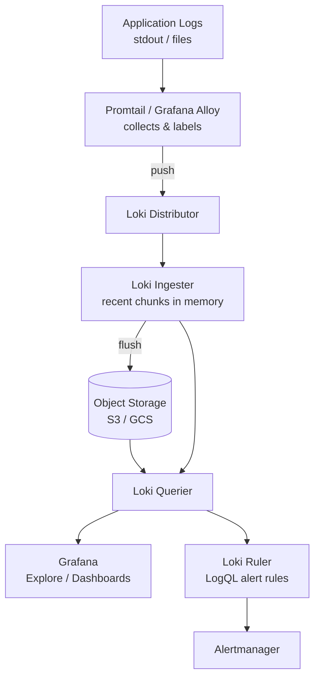

# Loki (LogQL) — A 2-Day Crash Course

> **In one sentence:** Loki is a log database built like Prometheus — it indexes only cheap
> labels (not the full log text), so storing and searching huge volumes of logs is fast and
> inexpensive, and you query it with LogQL, a close cousin of PromQL.

> Pairs with `Prometheus.md` (metrics) and `Grafana.md` (the UI you'll query it from).

---

## Part 0 — Why Loki exists, and its one big idea

Logs are essential — when metrics tell you *something* is wrong, logs tell you *what*. But
traditional log systems (like Elasticsearch/ELK) index the **full text** of every log line.
That's powerful but expensive: huge storage, heavy compute, costly to run at scale.

Loki's insight (from the Grafana team): **don't index the log contents — only index a small set
of labels, and store the raw log lines compressed in cheap object storage.** You find the right
*stream* of logs by labels (like `{app="api", env="prod"}`), then filter the text within that
stream at query time. This is "grep, but distributed and indexed by label."

The result: logging that's an order of magnitude cheaper, and a model that mirrors Prometheus
exactly — same label concept, same `{selector}` syntax, same Grafana integration. If you know
Prometheus, Loki feels immediately familiar.

**Mental model:** Prometheus indexes metric *names + labels* and stores numbers; Loki indexes
*labels only* and stores raw log lines. You first pick a stream by labels (the index does this
fast), then `|=` grep within it (scanned at query time). Cheap index, cheap storage, fast enough.



---

## Part 1 — The vocabulary & architecture

| Term | Meaning |
|------|---------|
| **Stream** | A unique set of labels = one log stream (`{app="api", level="error"}`) |
| **Label** | Indexed key/value identifying a stream (keep these low-cardinality!) |
| **LogQL** | Loki's query language (log queries + metric queries over logs) |
| **Promtail / Alloy** | The agent that ships logs to Loki (the modern agent is Grafana Alloy) |
| **Line filter** | `|=`, `!=`, `|~` — grep the text within selected streams |

**Architecture:**
```
your logs (files/stdout/journald)
   │  collected by Promtail / Grafana Alloy (adds labels)
   ▼
 Loki  ──► index (labels) + chunks (compressed log lines) in object storage (S3/GCS)
   ▲
   └── queried via LogQL, usually through Grafana
```
The **agent** (Promtail/Alloy) is what tails your logs, attaches labels, and pushes them to
Loki — the equivalent of an exporter in the Prometheus world.

---

## DAY 1 — Get it working

### 1. The stack and how logs get in
For a quick start, run Loki + Promtail (or Alloy) + Grafana (the docker-compose in Loki's repo,
or the `loki-stack` Helm chart in Kubernetes). Promtail tails log files / container stdout,
**attaches labels**, and ships to Loki. In Kubernetes it auto-discovers pods and labels streams
with `namespace`, `pod`, `container`, `app`, etc.

A minimal Promtail scrape:
```yaml
scrape_configs:
  - job_name: system
    static_configs:
      - targets: [localhost]
        labels:
          job: varlogs
          __path__: /var/log/*log     # which files to tail
```

### 2. Query in Grafana — add Loki as a data source
Add a **Loki** data source (URL of your Loki, e.g. `http://loki:3100`), then use the **Explore**
view to query. Explore is the log-investigation cockpit.

### 3. LogQL part 1 — select a stream, then filter
Every LogQL query starts with a **label selector** (`{...}`), exactly like PromQL:
```logql
{app="api"}                          # all logs from the api app
{app="api", env="prod"}              # AND of labels
{app=~"api|web"}                     # regex on a label
```
Then chain **line filters** to grep the text:
```logql
{app="api"} |= "error"               # lines CONTAINING "error"
{app="api"} != "healthcheck"         # lines NOT containing "healthcheck"
{app="api"} |~ "timeout|refused"     # regex match
{app="api"} |= "error" != "deprecated"   # chain them
```
Read it left to right: pick the streams by label (fast, indexed), then filter the text
(scanned). **Always select by label first** — `{app="api"} |= "error"` is efficient;
trying to search all logs everywhere for "error" is not.

### 4. The investigation workflow
```text
1. Narrow by labels: {namespace="payments", app="checkout"}
2. Filter to the problem: |= "exception"
3. Set the time range to the incident window (top-right in Grafana).
4. Read the lines; widen/narrow filters as you learn more.
5. Correlate with the metrics panel on the same dashboard/time range.
```

**By end of Day 1 you can:** get logs flowing via Promtail/Alloy, add Loki to Grafana, and
query with `{label}` selectors + `|=`/`|~` line filters. That covers the bulk of daily log
searching.

---

## DAY 2 — Make it real

### 1. Parsing structured logs (extract fields at query time)
Loki only indexed labels, but you can parse fields *during the query* and then filter on them:
```logql
{app="api"} | json                       # parse JSON logs into fields
{app="api"} | json | status >= 500       # then filter by an extracted field
{app="api"} | logfmt | duration > 1s      # parse logfmt (key=value) logs
{app="api"} | pattern `<_> <method> <path> <status>`   # pattern-extract from plain text
{app="api"} |= "error" | regexp `user=(?P<user>\w+)`   # named-capture regex
```
This is the key Day-2 skill: extract `status`, `duration`, `user`, etc. from the log body and
filter on them — without having pre-indexed them as labels (which would blow up cardinality).

### 2. Metric queries from logs (LogQL's hidden superpower)
LogQL can turn logs into *metrics* — count error rates, measure throughput — right from the log
stream, no separate metric needed:
```logql
rate({app="api"} |= "error" [5m])                    # error log lines per second
sum by (status) (rate({app="api"} | json [5m]))      # log rate by extracted status
count_over_time({app="api"} |= "timeout" [1h])       # how many timeouts in the last hour
sum(rate({app="api"} | json | status >= 500 [5m]))   # 5xx rate derived from logs
```
This means you can graph and alert on log patterns using the same Grafana panels as metrics —
hugely useful when an app emits something in logs but not as a metric.

### 3. Labels vs filters — the cardinality rule (the #1 thing to get right)
This is where teams break Loki. **Labels are indexed and must be low-cardinality.** Good labels:
`app`, `namespace`, `env`, `level`, `cluster` — a bounded set of values. **Never** make a label
out of something unbounded: `user_id`, `request_id`, `trace_id`, `ip`, `timestamp`. High-label
cardinality creates millions of tiny streams and destroys Loki's performance and cost model.

The rule of thumb: **label what you'd group/filter streams by; keep everything else in the log
line and extract it at query time** (with `| json`/`| logfmt`/`| regexp`). High-cardinality
fields live in the *content*, not the *labels*.

### 4. Retention, storage, and ops
Loki stores chunks in object storage (S3/GCS) and is configured for retention/compaction. In
production you'll tune retention periods, set per-tenant limits (Loki is multi-tenant), and run
it in microservices mode at scale. The `loki-stack`/`loki` Helm charts handle most defaults.

### 5. Alerting on logs
Loki has a ruler that evaluates LogQL **metric** queries as alerts (and can send to
Alertmanager — see `Alertmanager.md`):
```yaml
groups:
  - name: log-alerts
    rules:
      - alert: TooManyExceptions
        expr: sum(rate({app="api"} |= "Exception" [5m])) > 1
        for: 10m
        labels: { severity: page }
        annotations: { summary: "Exception rate elevated on api" }
```

---

## Worked example — debug a latency spike with logs + metrics
```text
1. Grafana metrics panel shows p95 latency spiking at 14:05.
2. Switch to Explore (Loki), set time range 14:00–14:10.
3. {namespace="payments", app="checkout"} | json | duration > 2s   -> find the slow requests.
4. |~ "downstream|timeout"   -> they're all calls to a downstream service timing out.
5. Confirm scale: sum(rate({app="checkout"} | json | status=504 [5m]))  graphs the 504 rate.
6. Root cause in minutes because logs and metrics shared the time range (Grafana.md).
```

---

## Common pitfalls
- **High-cardinality labels.** Putting `request_id`/`user_id`/`ip` in labels is the cardinal
  Loki sin — it explodes streams and wrecks performance. Keep those in the log body, extract at
  query time.
- **Querying without a label selector.** `|= "error"` alone (no `{}`) scans everything. Always
  narrow by labels first.
- **Expecting full-text-search speed like Elasticsearch.** Loki greps within selected streams;
  it's fast *because* you scope by labels. Tight selectors = fast queries.
- **Not parsing structured logs.** If your apps log JSON/logfmt, use `| json`/`| logfmt` to
  filter on fields instead of brittle substring matching.
- **Confusing Loki with the agent.** Loki stores/queries; Promtail/Alloy collects and labels.
  Misconfigured *labels* happen in the agent, not Loki.
- **Logging unbounded high-volume noise.** Loki is cheap, not free — drop/aggregate debug spam
  at the agent.

---

## Quick reference (LogQL)
```logql
# Stream selectors (indexed — start here)
{app="api"}   {app="api", env="prod"}   {app=~"api|web"}   {level!="debug"}

# Line filters (grep the text)
|= "str"     # contains
!= "str"     # not contains
|~ "regex"   # matches regex
!~ "regex"   # not matches

# Parsers + label filters
| json                         | logfmt
| pattern `<_> <status>`       | regexp `(?P<name>re)`
| <field> = "v"   | <field> >= 500   | duration > 1s   | __error__ = ""

# Formatting
| line_format "{{.method}} {{.path}}"     | label_format new=`{{.old}}`

# Metric queries (logs -> numbers)
rate({app="api"} |= "error" [5m])
count_over_time({app="api"} [1h])
sum by (status) (rate({app="api"} | json [5m]))
bytes_rate({app="api"} [5m])
```
```bash
# CLI (logcli)
logcli query '{app="api"} |= "error"' --since=1h
logcli labels                 # list available labels
logcli labels app             # list values for a label
```

---

## Top 10 Interview Questions

<details>
<summary><strong>Q: How does Loki's indexing strategy differ from Elasticsearch, and why does that matter for cost?</strong></summary>

Loki indexes only the label set (low-cardinality metadata like `app`, `namespace`, `env`), not the log content itself. Log lines are stored compressed in cheap object storage. Elasticsearch indexes the full text of every field, which gives richer search but costs significantly more in compute and storage. Loki trades query-time flexibility for an order-of-magnitude reduction in infrastructure cost.

</details>

<details>
<summary><strong>Q: What is the most common mistake teams make when configuring Loki labels?</strong></summary>

Putting high-cardinality values — `user_id`, `request_id`, `trace_id`, `IP address` — into labels. Each unique label combination creates a separate stream, and millions of tiny streams destroy Loki's ingestion performance and blow up storage. High-cardinality data belongs in the log line body, extracted at query time with `| json` or `| regexp`.

</details>

<details>
<summary><strong>Q: Explain the difference between a log query and a metric query in LogQL.</strong></summary>

A log query returns raw log lines — e.g. `{app="api"} |= "error"`. A metric query wraps a log query in an aggregation function and returns a numeric time series — e.g. `rate({app="api"} |= "error" [5m])` gives error lines per second. Metric queries let you graph and alert on log patterns using the same Grafana panels as Prometheus metrics.

</details>

<details>
<summary><strong>Q: How would you investigate a latency spike using Loki and Grafana together?</strong></summary>

Start from the Prometheus metrics panel showing the latency spike. Note the time window. Switch to Grafana Explore with the Loki data source, set the same time range, and query `{app="checkout"} | json | duration > 2s` to find slow requests. Chain additional filters like `|~ "timeout|refused"` to narrow down. The shared time range across metrics and logs panels on one dashboard is the key — you correlate the spike with the exact log lines that explain it.

</details>

<details>
<summary><strong>Q: What is the role of Promtail (or Grafana Alloy) in the Loki architecture?</strong></summary>

Promtail/Alloy is the agent that runs on your hosts or as a Kubernetes DaemonSet. It tails log files or container stdout, attaches labels (from static config or Kubernetes metadata), and pushes the labeled streams to Loki. It is the equivalent of an exporter in the Prometheus world. Misconfigured labels are almost always an agent-side problem, not a Loki-side one.

</details>

<details>
<summary><strong>Q: How does Loki handle alerting on log patterns?</strong></summary>

Loki has a built-in ruler component that evaluates LogQL metric queries on a schedule — identical to Prometheus recording/alerting rules. For example, `sum(rate({app="api"} |= "Exception" [5m])) > 1` fires when the exception rate exceeds one per second. The ruler sends firing alerts to Alertmanager, which handles grouping, routing, and notification — the same pipeline as Prometheus alerts.

</details>

<details>
<summary><strong>Q: You run a LogQL query and it is very slow. What are the likely causes and how do you fix it?</strong></summary>

The most common cause is a missing or overly broad label selector — scanning all streams instead of narrowing by `app`, `namespace`, or `env` first. Second, the time range may be too wide; narrow it to the incident window. Third, complex regex line filters (`|~`) on high-volume streams are expensive; prefer exact match (`|=`) where possible. Finally, check whether the query is hitting the ingesters (recent data, fast) or object storage (historical data, slower).

</details>

<details>
<summary><strong>Q: How do you extract structured fields from JSON logs in Loki without pre-indexing them?</strong></summary>

Use the `| json` parser stage in LogQL. For example, `{app="api"} | json | status >= 500` parses every log line as JSON at query time and filters on the extracted `status` field. For logfmt logs, use `| logfmt`. For unstructured text, use `| pattern` or `| regexp` with named capture groups. The key insight is that these fields are never indexed — they are extracted on the fly, keeping the index small and cheap.

</details>

<details>
<summary><strong>Q: What deployment modes does Loki support, and when would you choose each?</strong></summary>

Loki supports three modes: monolithic (single binary, good for small teams and development), simple scalable (read/write/backend separation, good for medium workloads), and microservices (each component — distributor, ingester, querier, compactor — runs independently, necessary at high scale). Start monolithic, move to simple scalable when you hit ingestion or query bottlenecks, and go to full microservices only when you need independent scaling of specific components.

</details>

<details>
<summary><strong>Q: How does Loki compare to Grafana's other LGTM components in terms of the data model?</strong></summary>

Loki mirrors Prometheus intentionally. Both use the same `{label="value"}` selector syntax, the same label-based data model, and integrate natively in Grafana. Prometheus stores numeric samples indexed by metric name and labels; Loki stores raw log lines indexed only by labels. Tempo stores traces indexed only by trace ID. The shared label model is what enables cross-signal correlation — you can jump from a metric alert to matching logs to a related trace using the same label values.

</details>

---

## Next steps after Day 2
- **Grafana Alloy** (the unified agent replacing Promtail) for logs + metrics + traces.
- **Tempo** for distributed tracing — and trace↔log correlation (jump from a log line to its
  trace) to complete the LGTM stack.
- Tune **retention, limits, and compaction**; run Loki in scalable/microservices mode.
- Derive metrics and SLOs from logs when apps don't expose Prometheus metrics.

**The mantra:** index labels, store raw lines cheaply. Select streams by low-cardinality labels
first, then grep/parse the text. Keep high-cardinality data in the log body, not in labels.
