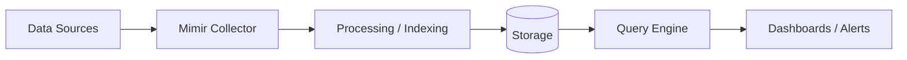

# Mimir — A 2-Day Crash Course

> **Prerequisites:** You have worked through `Prometheus.md` and `Grafana.md`. You understand scrape configs, PromQL, and how Grafana connects to a data source.

---

## Part 0 — Why Mimir Exists

Prometheus does one thing well: it scrapes metrics, evaluates rules, and stores everything locally. That design is clean and fast, but it has a hard ceiling. A single Prometheus server is a single node — one disk, one RAM limit, one point of failure. At a few thousand series it hums. At a hundred million series it groans. At a billion it falls over.

Mimir is Grafana Labs' answer to that ceiling. It is a horizontally scalable, multi-tenant, long-term metrics backend. Think of Prometheus as a workshop bench — fast and close at hand. Think of Mimir as the warehouse behind it: infinite shelves, durable storage, and access for the whole factory floor at once.

You do not replace Prometheus with Mimir. You keep Prometheus doing what it does best — short-term local scraping and alerting — and you point its `remote_write` at Mimir so every sample lands in durable object storage. Grafana then queries Mimir for anything beyond the Prometheus retention window, or for queries that span multiple Prometheus instances.

The result: your metrics survive node reboots, your retention is limited only by your object storage bill, and every team queries the same data without stepping on each other.

---

## Vocabulary

**Remote Write** — Prometheus's push protocol. Every scrape cycle, Prometheus serialises its samples into a compressed protobuf payload and HTTP-POSTs it to a remote endpoint. Mimir's distributor is that endpoint. You configure it under `remote_write:` in `prometheus.yml`.

**Distributor** — The front door of a Mimir cluster. It receives remote-write requests, validates them, deduplicates across replicas, and fans the samples out to a ring of ingesters. It is stateless and scales horizontally.

**Ingester** — Holds the most recent samples in memory and on a local write-ahead log. Every series is hashed to a consistent set of ingesters (default: three replicas). When a block reaches a configurable age — usually two hours — the ingester uploads it to object storage and releases the memory.

**Compactor** — A background component that merges, deduplicates, and re-encodes blocks in object storage. Without it, you accumulate thousands of small two-hour blocks. With it, blocks are collapsed into larger, more efficient chunks. The compactor also enforces retention — it deletes blocks older than your retention window.

**Store-gateway** — Serves queries against blocks that have already been uploaded to object storage. It downloads block indices and caches chunks locally so repeated queries are fast. It does not hold the full blocks — only what it needs.

**Querier** — Executes PromQL queries. For recent data it asks the ingesters. For older data it asks the store-gateways. It merges the two result sets transparently, so from Grafana's perspective there is one continuous time series.

**Query-frontend** — Sits in front of the querier. It queues requests, splits long-range queries into parallel sub-queries, and caches results. You always point Grafana at the query-frontend, never directly at the querier.

**Blocks** — The on-disk format Mimir inherits from Prometheus TSDB. Each block is a directory containing an `index`, `chunks/` directory, and a `meta.json`. Blocks are immutable once written and are the unit of upload, compaction, and deletion.

**Multi-tenancy** — Mimir partitions data by tenant ID. Every inbound request carries an `X-Scope-OrgID` header. Samples, rules, and query results are isolated per tenant. In single-tenant mode you can set a fixed ID and forget about it. In multi-tenant mode each team or environment gets its own namespace.

**Object Storage** — Where blocks live permanently. Mimir supports S3, GCS, Azure Blob Storage, and any S3-compatible store (MinIO, Ceph). It is the source of truth. If an ingester crashes before flushing, the WAL on disk allows recovery.

---




## DAY 1 — Get Running: Monolithic Mode

### What You Are Building

A single Mimir process running all components, a local MinIO instance acting as S3, and Prometheus remote-writing into it. Grafana visualising the result.

### Step 1 — Start MinIO

```bash
docker run -d --name minio \
  -p 9000:9000 -p 9001:9001 \
  -e MINIO_ROOT_USER=mimir \
  -e MINIO_ROOT_PASSWORD=mimirpassword \
  quay.io/minio/minio server /data --console-address ":9001"
```

Create a bucket called `mimir` in the MinIO console at `http://localhost:9001`.

### Step 2 — Write a Mimir Config

Save this as `mimir.yaml`. Monolithic mode runs every component in one process — you choose it with `-target=all`.

```yaml
# mimir.yaml — monolithic, single-tenant
multitenancy_enabled: false

blocks_storage:
  backend: s3
  s3:
    endpoint:          localhost:9000
    bucket_name:       mimir
    access_key_id:     mimir
    secret_access_key: mimirpassword
    insecure:          true

compactor:
  data_dir: /tmp/mimir-compactor

ingester:
  ring:
    replication_factor: 1

store_gateway:
  sharding_ring:
    replication_factor: 1

ruler_storage:
  backend: s3
  s3:
    endpoint:          localhost:9000
    bucket_name:       mimir
    access_key_id:     mimir
    secret_access_key: mimirpassword
    insecure:          true
```

`replication_factor: 1` is only appropriate for local experimentation — never in production.

### Step 3 — Start Mimir

```bash
docker run -d --name mimir \
  --network host \
  -v $(pwd)/mimir.yaml:/etc/mimir/mimir.yaml \
  grafana/mimir:latest \
  -config.file=/etc/mimir/mimir.yaml \
  -target=all
```

Mimir exposes its HTTP API on port `8080` and gRPC on `9095` by default. Hit `http://localhost:8080/ready` — you should see `ready`.

### Step 4 — Configure Prometheus remote_write

Add this to your `prometheus.yml`:

```yaml
remote_write:
  - url: http://localhost:8080/api/v1/push
    headers:
      X-Scope-OrgID: anonymous
```

Restart Prometheus. Within one scrape interval you should see log lines from Mimir acknowledging batches.

### Step 5 — Add Mimir as a Grafana Data Source

In Grafana, go to **Connections → Data sources → Add data source → Prometheus**. Set the URL to `http://localhost:8080/prometheus`. Under **Custom HTTP Headers** add `X-Scope-OrgID: anonymous`. Save and test. You now have a Mimir-backed Prometheus data source.

Open any dashboard. Query `up` or `prometheus_tsdb_head_series`. The data is coming from Mimir, not from Prometheus's local TSDB.

### Step 6 — Verify Blocks Are Uploading

After about two hours (or sooner if you force a flush), check the MinIO bucket. You should see directories under `anonymous/` — one per uploaded block, each with an `index`, `chunks/`, and `meta.json`.

```bash
# Force ingesters to flush immediately (useful for testing)
curl -X POST http://localhost:8080/ingester/flush
```

You have confirmed the full write path: Prometheus → Mimir distributor → ingester → object storage.

---

## DAY 2 — Production Patterns

### Multi-Tenancy in Practice

Enable it in `mimir.yaml`:

```yaml
multitenancy_enabled: true
```

Every remote-write request must now carry a valid `X-Scope-OrgID`. Give each team, environment, or product its own ID:

```yaml
# prometheus-prod.yml
remote_write:
  - url: http://mimir:8080/api/v1/push
    headers:
      X-Scope-OrgID: team-platform

# prometheus-staging.yml
remote_write:
  - url: http://mimir:8080/api/v1/push
    headers:
      X-Scope-OrgID: team-staging
```

In Grafana, create one data source per tenant. Each data source sends its own `X-Scope-OrgID`. Teams cannot see each other's data. The ruler, alertmanager integration, and recording rules are also tenant-scoped.

### Microservices Mode

When load warrants it, you run each component as its own service and scale them independently. You set `-target` to the component name:

```
-target=distributor
-target=ingester
-target=querier
-target=query-frontend
-target=compactor
-target=store-gateway
-target=ruler
```

A production Kubernetes deployment typically runs:
- 3–6 distributors (stateless, horizontal scale)
- 3–9 ingesters (stateful, handle with care during rollouts)
- 3+ queriers
- 2 query-frontends
- 1–3 compactors
- 3+ store-gateways

Ingesters use a consistent hash ring — members discover each other via Consul, etcd, or Memberlist (the default, built-in gossip protocol). Do not abruptly kill ingesters; always drain them first:

```bash
curl -X POST http://ingester-0:8080/ingester/shutdown
```

### The Ruler

The ruler evaluates recording rules and alerting rules stored in object storage. It fires alerts to Alertmanager over the same tenant-scoped path. Configure it in `mimir.yaml`:

```yaml
ruler:
  alertmanager_url: http://alertmanager:9093
  rule_path: /tmp/mimir-rules
```

Upload rules via the Mimir ruler API rather than mounting files:

```bash
# Upload a rule group for tenant team-platform
mimirtool rules load rules.yaml \
  --address=http://mimir:8080 \
  --id=team-platform
```

Rules live in object storage. Prometheus-side alerting rules are now optional — you can centralise all rule evaluation in Mimir.

### Compactor Configuration

The compactor runs on a schedule and needs enough disk for temporary work. Tune it:

```yaml
compactor:
  data_dir:             /var/mimir/compactor
  compaction_interval:  1h
  retention_period:     90d
  block_ranges:         [2h, 12h, 24h]
```

`block_ranges` is the compaction ladder. Two-hour blocks get merged into twelve-hour blocks, then into twenty-four-hour blocks. Wider blocks mean fewer files in object storage and faster range queries.

### High Availability

Mimir's HA deduplication handles the case where you run two Prometheus servers in HA pairs scraping the same targets. Both write to Mimir, but Mimir deduplicates based on `cluster` and `replica` labels. Configure it:

```yaml
# prometheus-ha-0.yml
global:
  external_labels:
    cluster: prod-eu-west
    replica:  prom-0

# prometheus-ha-1.yml
global:
  external_labels:
    cluster: prod-eu-west
    replica:  prom-1
```

```yaml
# mimir.yaml
limits:
  ha_tracker_enable_for_all_users: true
```

Mimir elects one replica as primary per cluster label and drops the duplicates from the other. If the primary goes silent, it promotes the other. Your data has no gaps. Your storage does not double.

### Mimir vs Thanos vs Cortex

All three solve the same problem: long-term, scalable metrics. The lineage matters:

- **Cortex** was the original CNCF project. Mimir is Grafana Labs' fork, started in 2022, optimised for performance and simplified operations. Mimir compiles to a single binary; Cortex has more moving parts.
- **Thanos** takes a sidecar approach. A Thanos sidecar runs next to each Prometheus and uploads blocks to object storage. The querier federates across all sidecars and stores. No distributor, no ingester ring — queries fan out to live Prometheus instances for recent data.
- **Mimir** replaces Prometheus's storage path entirely via remote write. Prometheus becomes a dumb scrape relay. You lose the ability to query live Prometheus TSDB directly, but you gain stronger tenant isolation, a simpler query path, and better write scalability.

When to choose which:

| Situation | Recommendation |
|---|---|
| You already run Thanos and it works | Stay on Thanos |
| You want Grafana-native integration and active upstream | Mimir |
| You need maximum flexibility without vendor alignment | Cortex |
| You have many independent Prometheus instances and want to federate without changing them | Thanos |
| You are starting fresh with a Grafana stack | Mimir |

### Cost Optimisation

Object storage is cheap. Compute is not. These levers matter most:

**Ingesters** are your most expensive components — they hold data in memory. Size them with roughly 1.5 bytes per active sample per second as a starting rule. Keep replication factor at 3 in production; avoid going higher.

**Store-gateways** download chunk indices. Use SSDs for their local cache. Configure the cache size explicitly:

```yaml
store_gateway:
  sharding_ring:
    replication_factor: 3
  blocks_metadata_ttl: 15m
```

**Query caching** — attach a Memcached or Redis instance to the query-frontend. A single cache hit on a six-hour range query saves the entire fan-out to store-gateways.

```yaml
frontend:
  results_cache:
    backend: memcached
    memcached:
      addresses: dns+memcached:11211
```

**Compaction** reduces object storage API calls. More compaction means fewer, larger files, which means fewer GET requests and lower cost. Run the compactor continuously, not on a cron.

**Cardinality limits** prevent a single misbehaving service from exploding your ingester memory. Set per-tenant limits:

```yaml
limits:
  max_global_series_per_user:   1500000
  max_global_series_per_metric: 50000
  ingestion_rate:               100000
  ingestion_burst_size:         200000
```

These are not punitive — they are safety valves. Set them, then adjust upward with evidence.

---

## Worked Example — Migrating from Standalone Prometheus

You have a standalone Prometheus with 30 days of local retention and no remote storage. You want to move to Mimir with 90-day retention and HA.

**Step 1 — Deploy Mimir alongside Prometheus.** Do not decommission anything yet. Add `remote_write` to Prometheus, pointing at Mimir. Let it run for 24 hours. Verify data is appearing in Mimir via Grafana.

**Step 2 — Backfill historical data.** Mimir supports the backfill API (`/api/v1/push/blocks`). Use `mimirtool` to upload existing TSDB blocks:

```bash
mimirtool backfill \
  --address=http://mimir:8080 \
  --id=team-platform \
  /var/prometheus/data/01ABC...
```

Run this for each block. Blocks older than two hours are already in the TSDB blocks format — no conversion needed.

**Step 3 — Switch Grafana data sources.** Update each data source from `http://prometheus:9090` to `http://mimir:8080/prometheus`. For the tenant header, use whatever OrgID you chose. Confirm dashboards render correctly. Compare a few panels side by side for the overlapping time range — values should match exactly.

**Step 4 — Adjust Prometheus retention.** Once you are confident Mimir has the data, reduce Prometheus `--storage.tsdb.retention.time` to something short — four to twelve hours is enough for ingesters to flush. This frees disk.

**Step 5 — (Optional) Run Prometheus as a relay.** If you trust the remote_write path and Mimir's WAL recovery, you can run Prometheus with `--storage.tsdb.retention.time=2h` and treat it purely as a relay. The risk: if Mimir is unreachable, Prometheus's local buffer fills and you start dropping samples. Mitigate with remote-write queue settings:

```yaml
remote_write:
  - url: http://mimir:8080/api/v1/push
    queue_config:
      max_samples_per_send: 10000
      max_shards:           50
      capacity:             100000
```

---

## Pitfalls

**Forgetting `X-Scope-OrgID` when multi-tenancy is enabled.** Mimir rejects requests without it. The error is a `400 Bad Request` with a message about missing tenant ID. Check your remote_write headers and Grafana data source headers.

**Undersized ingesters.** If you set replication factor 3 and run only two ingesters, write quorum fails. Mimir needs at least `ceil(replication_factor / 2) + 1` ingesters healthy to accept writes. Plan your ingester count before enabling HA.

**Not running the compactor.** Without compaction, you accumulate thousands of two-hour blocks. Store-gateway startup time grows. Query performance degrades. Object storage API costs climb. The compactor is not optional — run it.

**High-cardinality labels.** Labels like `trace_id`, `user_id`, or `request_id` in metric names create one series per unique value. A single such metric can push you past your per-tenant series limit overnight. Set `max_global_series_per_user` early and configure a cardinality dashboard — Mimir exposes cardinality APIs at `/api/v1/cardinality/label_names` and `/api/v1/cardinality/label_values`.

**Abrupt ingester termination.** Killing an ingester without draining it means the data in its memory and WAL must be replayed on restart. That is fine, but it delays recovery and can cause ingesters to miss write quorum while recovering. Use the shutdown endpoint.

**Mixing Mimir and Prometheus data sources in the same Grafana dashboard.** You will see duplicate series during the migration window. Filter by `replica` or use separate dashboard rows for the transition period.

**Object storage permissions.** Mimir needs `s3:GetObject`, `s3:PutObject`, `s3:DeleteObject`, and `s3:ListBucket` on the bucket. Missing `DeleteObject` means the compactor cannot enforce retention, and your storage grows unbounded.

⚠️ Do not run the compactor against the same bucket as another Mimir cluster. Compaction is not multi-cluster-safe — each cluster must have its own bucket or bucket prefix.

---

## Quick Reference

```bash
# Check Mimir health
curl http://mimir:8080/ready
curl http://mimir:8080/metrics

# List active ingesters in the ring
curl http://mimir:8080/ring | jq '.ingesters[].addr'

# Flush ingesters (dev/testing only)
curl -X POST http://mimir:8080/ingester/flush

# Upload a rule group
mimirtool rules load rules.yaml --address=http://mimir:8080 --id=<tenant>

# Query cardinality
curl "http://mimir:8080/prometheus/api/v1/cardinality/label_names" \
  -H "X-Scope-OrgID: team-platform"

# Backfill a TSDB block
mimirtool backfill --address=http://mimir:8080 --id=<tenant> /path/to/block

# Drain an ingester before rolling restart
curl -X POST http://ingester-0:8080/ingester/shutdown

# Check compactor ring
curl http://mimir:8080/compactor/ring
```

Key ports:

| Port | Purpose |
|------|---------|
| `8080` | HTTP API, remote-write, query, UI |
| `9095` | gRPC (internal component communication) |
| `9091` | Internal metrics (if split from HTTP port) |

Useful flags:

| Flag | Meaning |
|------|---------|
| `-target=all` | Monolithic mode — all components in one process |
| `-config.file=` | Path to config YAML |
| `-modules` | List all available target modules |
| `-log.level=debug` | Verbose logging for troubleshooting |

---


## Top 10 Interview Questions

<details>
<summary><strong>Q: What is Mimir and what problem does it solve?</strong></summary>

Mimir addresses a specific need in modern engineering workflows. Understanding the core problem it solves — and the alternatives it replaced — is the foundation for every subsequent interview question. Frame your answer around the pain point first, then the solution.

</details>

<details>
<summary><strong>Q: How does Mimir compare to its main alternatives?</strong></summary>

Every tool exists in an ecosystem of alternatives. Be prepared to articulate the specific tradeoffs: when Mimir is the right choice, when an alternative is better, and what factors drive the decision (scale, team expertise, existing infrastructure, compliance requirements).

</details>

<details>
<summary><strong>Q: What are the most common production pitfalls with Mimir?</strong></summary>

Production experience is what separates senior from junior engineers. Common pitfalls include: misconfiguration that works in dev but fails at scale, security oversights, inadequate monitoring, and operational procedures that are untested until an incident occurs. Cite specific examples from your experience.

</details>

<details>
<summary><strong>Q: How do you monitor and observe Mimir in production?</strong></summary>

Key metrics to track, alerting thresholds to set, dashboards to build, and log patterns to watch. Production monitoring should cover: health/liveness, performance (latency, throughput), capacity (resource utilisation), and business impact (error rates affecting users). Explain which metrics are leading indicators versus lagging.

</details>

<details>
<summary><strong>Q: How do you scale Mimir as load increases?</strong></summary>

Scaling strategies depend on the bottleneck: horizontal scaling (add more instances), vertical scaling (bigger instances), caching (reduce load), sharding (distribute data), and async processing (decouple components). Explain which approach applies to Mimir and at what scale each strategy becomes necessary.

</details>

<details>
<summary><strong>Q: How do you handle security and access control with Mimir?</strong></summary>

Security is non-negotiable in production. Cover: authentication and authorization mechanisms, secrets management (never in code), encryption (at rest and in transit), network security (firewalls, private networks), audit logging, and compliance requirements relevant to your industry.

</details>

<details>
<summary><strong>Q: How do you implement disaster recovery for Mimir?</strong></summary>

DR planning requires defining RTO (recovery time objective) and RPO (recovery point objective), implementing backup strategies, testing restore procedures, and documenting runbooks. Explain your backup strategy, how you test restores, and what your recovery procedure looks like.

</details>

<details>
<summary><strong>Q: How do you automate Mimir deployment and configuration management?</strong></summary>

Infrastructure as code, CI/CD pipelines, configuration management, and GitOps workflows. Explain how you version, test, deploy, and roll back changes. Cover: what is automated, what requires manual approval, and how you handle configuration drift.

</details>

<details>
<summary><strong>Q: How do you troubleshoot issues with Mimir in production?</strong></summary>

A systematic debugging approach: check health endpoints, review recent changes (deploys, config changes), examine logs and metrics, reproduce the issue, identify root cause, fix, verify, and write a postmortem. Explain your actual debugging workflow with concrete examples.

</details>

<details>
<summary><strong>Q: What are the best practices for Mimir that you have learned from experience?</strong></summary>

Best practices that go beyond documentation: lessons learned from production incidents, configuration patterns that prevent common issues, testing strategies that catch bugs before production, and operational procedures that reduce toil. Share specific examples where following (or not following) a best practice had measurable impact.

</details>

---


## Quick Quiz

Test your understanding with these rapid-fire questions (answers hidden):

<details>
<summary>1. What is the ONE core problem that Mimir solves?</summary>
Re-read Part 0 — the mental model section. If you can explain the "why" in one sentence, you understand the foundation.
</details>

<details>
<summary>2. Name the 3 most important terms from the vocabulary section.</summary>
Review Part 1. These are the building blocks every conversation about Mimir uses.
</details>

<details>
<summary>3. What is the first thing you would set up on Day 1?</summary>
Check the Day 1 section — the very first hands-on step that gets you a working result.
</details>

<details>
<summary>4. What is the most common production pitfall with Mimir?</summary>
Review the Common Pitfalls section. The first item listed is typically the most frequently encountered.
</details>

<details>
<summary>5. How does Mimir compare to its closest alternative?</summary>
Check the Comparison Matrix below — focus on the key differentiating row.
</details>


## Comparison Matrix

| Dimension | Mimir | Thanos | Cortex |
|-----------|-------|--------|--------|
| **Primary use case** | Core strength of Mimir | Core strength of Thanos | Core strength of Cortex |
| **Learning curve** | Moderate | Varies | Varies |
| **Community/ecosystem** | Active | Active | Growing |
| **Operational complexity** | Medium | Varies | Varies |
| **Best for** | See Part 0 | Different tradeoffs | Different tradeoffs |

> **How to read this matrix:** no tool wins on every dimension. Pick based on your specific constraints — team expertise, existing infrastructure, scale requirements, and compliance needs. The right choice is the one that fits your context, not the one with the most checkmarks.

## Next Steps

- `Prometheus.md` — revisit scrape configuration, recording rules, and remote_write queue tuning now that you know where the data lands
- `Grafana.md` — set up multi-tenant data sources, cardinality dashboards, and Explore mode against Mimir
- `Alertmanager.md` — wire Mimir's ruler to a centralised Alertmanager with per-tenant routing
- `Loki.md` — pair Mimir with Loki for metrics and logs in a unified Grafana stack
- `Tempo.md` — close the loop with distributed tracing and correlate traces back to Mimir metrics using exemplars

---

## Recommended learning resources

**YouTube channels & playlists:**
- [Grafana Labs — Mimir Deep Dives](https://www.youtube.com/@GrafanaLabs) — official architecture walkthroughs, migration guides, and GrafanaCon talks on running Mimir at scale
- [PromLabs (Julius Volz) — Long-Term Metrics Storage](https://www.youtube.com/@PromLabs) — Prometheus co-founder discusses remote write, federation, and why external storage matters
- [CNCF — KubeCon Observability Track](https://www.youtube.com/@caborstudio) — conference talks on multi-tenant metrics, horizontal scaling, and Mimir vs Thanos
- [DevOps Toolkit (Viktor Farcic) — Mimir vs Thanos](https://www.youtube.com/@DevOpsToolkit) — practical comparison of long-term Prometheus storage backends
- [TechWorld with Nana — Prometheus Remote Write](https://www.youtube.com/@TechWorldwithNana) — beginner-friendly explanation of remote write pipelines and why they exist

**Official docs & blogs:**
- [Mimir Official Documentation](https://grafana.com/docs/mimir/latest/)
- [Grafana Labs Blog — Mimir Category](https://grafana.com/blog/) — deep posts on cardinality management, compactor tuning, and multi-tenant architecture
- [Robust Perception Blog (Brian Brazil)](https://www.robustperception.io/blog/) — Prometheus storage internals that underpin how Mimir works

## The Mantra

Prometheus owns the scrape. Mimir owns the history. Grafana owns the view. They compose — do not conflate them.

When Prometheus falls over at scale, the answer is not a bigger Prometheus. The answer is to stop asking one node to be everything. Mimir exists to take the storage problem off your hands so Prometheus can go back to being fast, local, and sharp.

Keep your remote_write queue tuned. Keep your ingesters sized. Run the compactor. Set cardinality limits before you need them, not after. And remember: the `X-Scope-OrgID` header is not optional — it is the key that separates one team's 2 AM page from another's.

---

*Part of the Observability crash course. See also: `Prometheus.md`, `Grafana.md`, `Alertmanager.md`, `Loki.md`, `OpenTelemetry.md`.*
