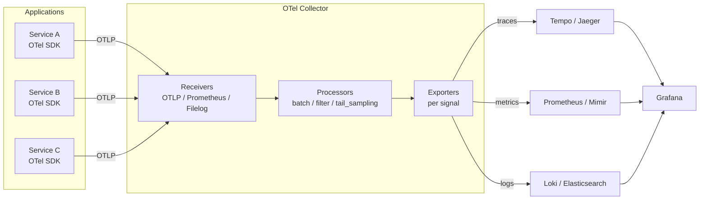

# OpenTelemetry (OTel) — A 2-Day Crash Course

> **In one sentence:** OpenTelemetry is a vendor-neutral standard and toolkit for generating and
> shipping all three kinds of telemetry — traces, metrics, and logs — so you instrument your
> code once and send the data to any backend (Prometheus, Grafana, Jaeger, Datadog…).

> Pairs with `Prometheus.md` (metrics), `Loki.md` (logs), `Grafana.md` (visualization).
> OTel is the *plumbing that produces and moves* telemetry; those tools store and display it.

---

## Part 0 — Why OpenTelemetry exists

Observability has three "signals":
- **Metrics** — numbers over time (RPS, latency, CPU). Great for "is something wrong?"
- **Logs** — discrete event records. Great for "what exactly happened?"
- **Traces** — the path of a single request across all the services it touches, with timing at
  each hop. Great for "*where* in my distributed system is the time going / the error coming
  from?"

The problem OTel solves: historically every vendor had its own SDK and agent. Switching from
Datadog to Grafana meant re-instrumenting your entire codebase. And distributed **tracing** —
following one request across 12 microservices — was nearly impossible without a common standard
for passing trace context between services.

OpenTelemetry (a CNCF project, the merger of OpenTracing + OpenCensus) fixes this by being **the
universal standard**: one set of SDKs and one wire protocol (**OTLP**). You instrument your app
against OTel once; you can point the data at *any* backend by changing config, not code. It has
become the industry default — supported by essentially every observability vendor.

**Mental model:** OTel is a universal adapter for telemetry. Your apps speak OTel; a **Collector**
in the middle receives it, processes it, and fans it out to whatever backends you choose.
Instrument once, route anywhere, no lock-in.



---

## Part 1 — The vocabulary

| Term | Meaning |
|------|---------|
| **Signal** | One of the three data types: traces, metrics, logs |
| **Trace** | The full journey of one request across services |
| **Span** | One operation within a trace (a DB call, an HTTP handler); spans nest into a tree |
| **Trace context** | IDs propagated between services so spans link into one trace |
| **Instrumentation** | Code (or auto-magic) that produces spans/metrics |
| **SDK** | The per-language library that creates and exports telemetry |
| **OTLP** | OpenTelemetry Protocol — the standard wire format |
| **Collector** | A standalone service that receives, processes, and exports telemetry |
| **Exporter** | Sends telemetry onward (to OTLP, Prometheus, Jaeger, a vendor…) |

**Traces are the signal people come to OTel for.** A trace is a tree of spans: the root span is
the incoming request; child spans are the downstream calls (auth → DB → cache → payment API),
each timestamped. Render it and you *see* exactly which hop was slow or errored.

---

## DAY 1 — Get it working

### 1. The data flow
```
[your app + OTel SDK]  --OTLP-->  [OTel Collector]  --exporters-->  Jaeger/Tempo (traces)
                                        │                            Prometheus (metrics)
                                        └──────────────────────────> Loki / vendor (logs)
```
Apps export OTLP to a **Collector**; the Collector routes each signal to the right backend.

### 2. Auto-instrumentation — telemetry with (almost) no code
The fastest win: many languages can be instrumented automatically — no source changes — capturing
HTTP, gRPC, and DB calls as spans.
```bash
# Python example
pip install opentelemetry-distro opentelemetry-exporter-otlp
opentelemetry-bootstrap -a install        # auto-installs instrumentation for your libs
OTEL_SERVICE_NAME=checkout \
OTEL_EXPORTER_OTLP_ENDPOINT=http://localhost:4317 \
opentelemetry-instrument python app.py     # wraps your app — spans appear automatically
```
```bash
# Java: just attach the agent jar — zero code changes
java -javaagent:opentelemetry-javaagent.jar \
  -Dotel.service.name=checkout \
  -Dotel.exporter.otlp.endpoint=http://localhost:4317 \
  -jar app.jar
```
Run this and your service's incoming requests and outgoing calls show up as traces. Start here
before writing any manual instrumentation.

### 3. The standard env-var configuration (works across languages)
```bash
OTEL_SERVICE_NAME=checkout                     # names your service in traces
OTEL_EXPORTER_OTLP_ENDPOINT=http://collector:4317   # where to send (OTLP gRPC = 4317, HTTP = 4318)
OTEL_RESOURCE_ATTRIBUTES=service.namespace=payments,deployment.environment=prod
OTEL_TRACES_SAMPLER=parentbased_traceidratio   # sampling strategy
OTEL_TRACES_SAMPLER_ARG=0.1                     # sample 10% of traces
```
OTel is configured almost entirely through these standard environment variables — the same names
in every language.

### 4. Read a trace
Send traffic, then open your trace UI (Jaeger/Tempo via Grafana). You'll see a **waterfall**: the
root span across the top, child spans nested beneath, each with a duration bar. The long bar is
your bottleneck; a red span is where the error originated. This is the "aha" — you can *see* the
slow hop in a 10-service request instantly.

**By end of Day 1 you can:** auto-instrument a service, configure it with standard env vars, send
traces to a Collector/backend, and read a trace waterfall. That alone transforms debugging
distributed systems.

---

## DAY 2 — Make it real

### 1. The Collector — the piece you'll actually operate
The **Collector** is a standalone binary you run (as a sidecar, a daemonset, or a gateway). It
decouples your apps from backends: apps always send OTLP to the Collector; the Collector does the
processing and decides where data goes. Config has three stages:
```yaml
# otel-collector-config.yaml
receivers:                       # how telemetry comes IN
  otlp:
    protocols: { grpc: {endpoint: 0.0.0.0:4317}, http: {endpoint: 0.0.0.0:4318} }

processors:                      # transform/batch/sample in the MIDDLE
  batch: {}                                  # batch for efficiency
  memory_limiter: { check_interval: 1s, limit_mib: 512 }
  resource:                                  # add/modify attributes
    attributes: [{ key: cluster, value: prod-1, action: upsert }]

exporters:                       # where telemetry goes OUT
  otlphttp/tempo: { endpoint: http://tempo:4318 }      # traces
  prometheus:      { endpoint: 0.0.0.0:8889 }           # metrics (scraped by Prometheus)
  # vendor exporters (datadog, etc.) go here too

service:                         # wire receivers -> processors -> exporters per signal
  pipelines:
    traces:  { receivers: [otlp], processors: [memory_limiter, batch], exporters: [otlphttp/tempo] }
    metrics: { receivers: [otlp], processors: [batch], exporters: [prometheus] }
```
The mental model for the Collector: **receivers → processors → exporters**, defined per signal in
`pipelines`. Want to switch vendors? Change an exporter. Want to drop noisy spans or scrub PII?
Add a processor. Your apps never change.

### 2. Manual instrumentation — add business spans
Auto-instrumentation covers frameworks; you add spans for *your* logic:
```python
from opentelemetry import trace
tracer = trace.get_tracer(__name__)

def process_order(order):
    with tracer.start_as_current_span("process_order") as span:
        span.set_attribute("order.id", order.id)
        span.set_attribute("order.value", order.total)
        try:
            charge(order)                       # nested calls become child spans automatically
        except Exception as e:
            span.record_exception(e)
            span.set_status(trace.Status(trace.StatusCode.ERROR))
            raise
```
Add attributes that help you debug (IDs, amounts, flags) — but never secrets/PII. Custom metrics
work similarly via the Metrics API (counters, histograms).

### 3. Context propagation — how one trace spans many services
The magic of distributed tracing is **trace context propagation**: service A injects trace IDs
into outgoing request headers (the W3C `traceparent` header), service B extracts them and
continues the same trace. Auto-instrumentation does this for you over HTTP/gRPC. If you build raw
requests or use a queue, you must propagate context manually, or the trace breaks into
disconnected pieces (a common "why is my trace split?" bug).

### 4. Sampling — you can't keep every trace
At scale, storing 100% of traces is expensive. **Sampling** keeps a representative subset:
- **Head sampling** — decide at the start (e.g. keep 10%). Simple, set via `OTEL_TRACES_SAMPLER`.
- **Tail sampling** — decide *after* the trace completes (in the Collector), so you can keep
  100% of *errors* and slow traces and 1% of the boring fast ones. More useful, more complex.
Sampling applies to traces; metrics are aggregated (not sampled) and logs are usually kept.

### 5. Semantic conventions — name things the standard way
OTel defines **semantic conventions**: standard attribute names like `http.request.method`,
`db.system`, `service.name`, `deployment.environment`. Using them means backends and dashboards
understand your data out of the box, and you can correlate across services. (There are emerging
conventions for **GenAI/LLM** spans — `gen_ai.*` — directly relevant if you're instrumenting
GenAI-powered SRE tooling.)

### 6. Correlate the three signals
The endgame: a trace links to the **logs** emitted during it (via shared trace IDs) and the
**metrics** it contributed to. In Grafana you click a slow span → jump to its logs → see the
exception. One instrumentation standard makes all three signals line up. This is what "modern
observability" means.

---

## Worked example — trace a slow checkout across services
```text
1. Auto-instrument checkout, payments, inventory (env vars: OTEL_SERVICE_NAME + OTLP endpoint).
2. All three export OTLP to one Collector (otlp receiver -> batch -> Tempo + Prometheus).
3. A request is slow. Open the trace: waterfall shows checkout -> payments (12ms) ->
   inventory (1.8s !!). The long bar is inventory's DB span.
4. The inventory span has db.statement + an error status -> a missing index on a query.
5. Click the span -> jump to inventory's logs for that trace ID -> confirm the slow query.
6. Tail sampling kept this trace because it was slow; 99% of fast traces were dropped to save cost.
```

---

## Common pitfalls
- **Skipping the Collector and exporting straight to a backend.** Works for a demo, but you lose
  the decoupling — every vendor change becomes a code change. Run a Collector.
- **Broken context propagation.** Manual HTTP clients / message queues that don't forward
  `traceparent` split your trace into orphans. Use instrumented clients or propagate manually.
- **No sampling at scale.** 100% traces = huge bills and storage. Use head sampling early, tail
  sampling (keep errors/slow) when you can.
- **High-cardinality span attributes / PII.** Don't attach unbounded values or secrets to spans;
  it bloats storage and leaks data.
- **Ignoring semantic conventions.** Custom attribute names mean dashboards and correlation don't
  "just work." Use the standard names.
- **Confusing OTel with a backend.** OTel produces and ships telemetry; it doesn't store or
  display it. You still need Tempo/Jaeger (traces), Prometheus (metrics), Loki (logs), Grafana
  (UI).

---

## Quick reference
```bash
# Standard env vars (work across languages)
OTEL_SERVICE_NAME=svc
OTEL_EXPORTER_OTLP_ENDPOINT=http://collector:4317     # gRPC; :4318 for HTTP
OTEL_EXPORTER_OTLP_PROTOCOL=grpc|http/protobuf
OTEL_RESOURCE_ATTRIBUTES=service.namespace=ns,deployment.environment=prod
OTEL_TRACES_SAMPLER=parentbased_traceidratio
OTEL_TRACES_SAMPLER_ARG=0.1
OTEL_METRICS_EXPORTER=otlp   OTEL_LOGS_EXPORTER=otlp   OTEL_TRACES_EXPORTER=otlp
OTEL_PROPAGATORS=tracecontext,baggage

# Python auto-instrument
opentelemetry-bootstrap -a install
opentelemetry-instrument python app.py

# Java agent
java -javaagent:opentelemetry-javaagent.jar -jar app.jar

# Collector
otelcol --config=otel-collector-config.yaml
```
```text
Collector config shape:
  receivers:  otlp, prometheus, filelog, ...      (data IN)
  processors: batch, memory_limiter, resource,    (transform)
              tail_sampling, attributes, filter
  exporters:  otlp, otlphttp, prometheus,         (data OUT)
              loki, debug, <vendor>
  service.pipelines.{traces,metrics,logs}: wire receivers -> processors -> exporters
```

---

## Top 10 Interview Questions

<details>
<summary><strong>Q: What problem does OpenTelemetry solve that vendor-specific SDKs do not?</strong></summary>

Vendor-specific SDKs lock your instrumentation to one backend. Switching from Datadog to Grafana or Jaeger means re-instrumenting every service. OTel provides a single, vendor-neutral standard (SDKs + OTLP wire protocol) so you instrument once and route telemetry to any backend by changing Collector config, not application code. It eliminates vendor lock-in at the instrumentation layer.

</details>

<details>
<summary><strong>Q: What is the difference between a trace, a span, and a span context?</strong></summary>

A trace is the full journey of one request across all services — a tree of spans sharing one trace ID. A span is a single timed operation within that tree (e.g. an HTTP handler, a DB call). Span context is the minimal payload — trace ID, span ID, sampling flags — that gets propagated between services via headers (e.g. W3C `traceparent`) to link spans into one trace.

</details>

<details>
<summary><strong>Q: Why should you run an OTel Collector instead of exporting directly from your app to a backend?</strong></summary>

The Collector decouples your applications from backends. It batches, retries, samples, scrubs PII, and routes each signal to the right destination — all without touching application code. Switching vendors or adding a second backend is a Collector config change. Without it, every backend change requires a code change and redeploy across all services.

</details>

<details>
<summary><strong>Q: Explain the difference between head-based and tail-based sampling. When would you use each?</strong></summary>

Head-based sampling decides at the start of the trace (e.g. keep 10% randomly). It is simple and low-overhead but may drop interesting traces — errors and slow requests get sampled at the same rate as healthy ones. Tail-based sampling decides after the trace completes, in the Collector, so you can keep 100% of errors and slow traces while dropping most fast/healthy ones. Use head sampling for quick wins early on; move to tail sampling when you need to control costs without losing important traces.

</details>

<details>
<summary><strong>Q: What are OTel semantic conventions, and why do they matter?</strong></summary>

Semantic conventions are standardized attribute names — `http.request.method`, `db.system`, `service.name`, `deployment.environment`. Using them means backends, dashboards, and correlation features work out of the box because they know what each attribute means. Custom or inconsistent names break cross-service correlation and make dashboards non-portable.

</details>

<details>
<summary><strong>Q: A distributed trace shows two disconnected fragments instead of one tree. What is the likely cause?</strong></summary>

Broken context propagation. One of the services in the chain is not forwarding the `traceparent` header — typically a manually constructed HTTP client, a message queue consumer that does not extract trace context from message attributes, or a proxy that strips unknown headers. The fix is to ensure every service boundary propagates the W3C trace context, either via auto-instrumentation or manual propagation.

</details>

<details>
<summary><strong>Q: How does auto-instrumentation work, and what are its limitations?</strong></summary>

Auto-instrumentation uses language-specific hooks (Java agent, Python monkey-patching, .NET instrumentation libraries) to wrap common frameworks — HTTP servers, DB clients, gRPC — and emit spans without source code changes. It covers framework-level operations but not your business logic. You still need manual spans for domain-specific operations like "process_order" or "calculate_risk_score," and you need to add meaningful attributes (order ID, amount) that auto-instrumentation cannot infer.

</details>

<details>
<summary><strong>Q: Describe the Collector's pipeline architecture. What are receivers, processors, and exporters?</strong></summary>

The Collector pipeline has three stages: receivers accept telemetry in (OTLP, Prometheus scrape, filelog, etc.), processors transform it in the middle (batching, memory limiting, attribute filtering, tail sampling), and exporters send it out (to Tempo, Prometheus, Loki, a vendor, etc.). Pipelines are defined per signal (traces, metrics, logs), and each can have different processing chains. This architecture lets you add processing without changing instrumented applications.

</details>

<details>
<summary><strong>Q: How do you correlate traces, metrics, and logs using OTel?</strong></summary>

All three signals share the same resource attributes (especially `service.name`). Traces carry a trace ID that gets injected into log lines via the OTel log bridge, so you can jump from a log entry to its trace. Metrics use exemplars — when recording a histogram observation, you attach the current trace ID, so clicking a metric data point in Grafana opens the corresponding trace. The Collector routes all three signals from the same pipeline, ensuring consistent labeling.

</details>

<details>
<summary><strong>Q: What are the GenAI semantic conventions in OTel, and how are they relevant to SRE?</strong></summary>

The `gen_ai.*` semantic conventions are emerging standards for tracing LLM calls — attributes like `gen_ai.system`, `gen_ai.request.model`, `gen_ai.usage.input_tokens`, `gen_ai.usage.output_tokens`. For SRE teams building or operating AI-powered tooling, these conventions enable token cost observability, latency tracking per model, and error rate monitoring on LLM endpoints — the same RED signals you track for any service, applied to GenAI workloads.

</details>

---

## Next steps after Day 2
- **Tail sampling** in the Collector (keep all errors/slow traces, drop the rest).
- **Tempo** (Grafana's trace backend) + trace↔log↔metric correlation in Grafana.
- Manual **metrics** and **logs** via the OTel SDK; **baggage** for propagating business context.
- The **GenAI semantic conventions** (`gen_ai.*`) for tracing LLM calls — directly applicable to
  instrumenting AI-in-SRE tooling and token/cost observability.

**The mantra:** instrument once against OTel, route anywhere via the Collector
(receivers → processors → exporters). Traces show *where* in a distributed system the time and
errors live; propagate context, sample sensibly, and use standard attribute names.
