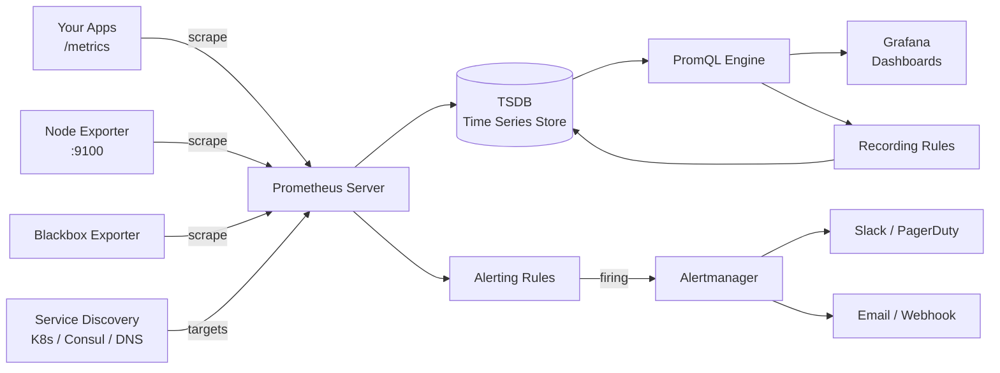

# Prometheus — A 2-Day Crash Course

> **In one sentence:** Prometheus scrapes numeric metrics from your services every few seconds,
> stores them as time series, and lets you query and alert on them with a language called
> PromQL — it's the de-facto standard for "is my system healthy?"

---

## Part 0 — Why Prometheus exists, and the one weird idea (pull, not push)

You can't operate what you can't measure. Prometheus answers "how many requests per second?
what's the error rate? is memory climbing?" — continuously, for everything. It became the
standard because it's simple, reliable, and built for dynamic (cloud/Kubernetes) environments.

**The defining design choice: Prometheus PULLS.** Instead of your apps *sending* metrics to a
server, each app exposes a plain HTTP endpoint (usually `/metrics`) showing its current numbers,
and Prometheus periodically *scrapes* (HTTP GETs) that endpoint. This feels backwards at first
but it's powerful: Prometheus controls the timing, can tell instantly if a target is down (the
scrape fails), and there's no complex push infrastructure. In Kubernetes it auto-discovers new
pods to scrape as they appear.

**What a `/metrics` endpoint looks like** (just text):
```
# HELP http_requests_total Total HTTP requests
# TYPE http_requests_total counter
http_requests_total{method="GET",code="200"} 10247
http_requests_total{method="GET",code="500"} 13
```
Each line is a metric name, a set of **labels** (the `{...}` key/values), and a current value.

**Mental model:** every service hangs a "current readings" board on its wall (`/metrics`).
Prometheus walks around every 15s photographing each board, files the readings by timestamp,
and you ask questions of that archive with PromQL.



---

## Part 1 — The vocabulary

| Term | Meaning |
|------|---------|
| **Metric** | A named measurement (`http_requests_total`) |
| **Label** | A key/value dimension on a metric (`code="500"`) — defines a unique series |
| **Series** | metric name + a unique label set = one time-series of values over time |
| **Scrape** | Prometheus fetching `/metrics` from a target |
| **Exporter** | A sidecar that exposes metrics for things that can't (Node Exporter for hosts) |
| **PromQL** | The query language |
| **Instant vector / Range vector** | values at one moment / values over a time window `[5m]` |

**The four metric types** (you must distinguish counters from gauges):
- **Counter** — only goes up (total requests, total errors). You almost always wrap it in
  `rate()`.
- **Gauge** — goes up and down (memory in use, temperature, queue length).
- **Histogram** — buckets of observations (request durations) → enables percentiles.
- **Summary** — like a histogram but client-computed quantiles.

---

## DAY 1 — Get it working

### 1. The architecture in one picture
```
your apps (/metrics) ──scrape──> Prometheus ──> stores time series (TSDB)
hosts (node_exporter) ──scrape──┘      │
                                       ├──> PromQL queries (UI / Grafana)
                                       └──> rules engine ──> Alertmanager ──> Slack/PagerDuty
```
Prometheus does scraping + storage + querying + alert *evaluation*. Sending the actual alert
notifications is a separate component, **Alertmanager** (see `Alertmanager.md`). Dashboards are
usually **Grafana** (see `Grafana.md`).

### 2. Run it and scrape something
`prometheus.yml`:
```yaml
global:
  scrape_interval: 15s          # how often to scrape
scrape_configs:
  - job_name: 'prometheus'      # Prometheus scrapes itself
    static_configs:
      - targets: ['localhost:9090']
  - job_name: 'node'            # a host's CPU/mem/disk via Node Exporter
    static_configs:
      - targets: ['10.0.0.1:9100']
```
Start Prometheus, open http://localhost:9090, and go to **Status → Targets** to confirm targets
are `UP`. The expression browser (the **Graph** tab) is where you'll learn PromQL.

### 3. Your first queries (PromQL basics)
```promql
up                                    # 1 if a target is up, 0 if down — try this first
node_memory_MemAvailable_bytes        # all series for this metric
http_requests_total{job="api"}        # filter by a label (=)
http_requests_total{code=~"5.."}      # regex match (=~) — all 5xx
http_requests_total{code!="200"}      # not equal
```
Labels are how you slice: `{job="api", code="500", method="POST"}` narrows to one dimension.

### 4. The single most important pattern: `rate()` on counters
A counter like `http_requests_total` just climbs forever; the raw number is meaningless. What
you want is the *per-second rate*:
```promql
rate(http_requests_total[5m])         # avg requests/sec over the last 5 minutes
```
**Rule:** always `rate()` (or `increase()`) a counter before doing anything else. `[5m]` is a
**range** — "the last 5 minutes of samples." `rate()` even handles counter resets (restarts)
automatically.
```promql
increase(http_requests_total[1h])     # total requests in the last hour
```

### 5. Aggregation — collapse the labels you don't care about
```promql
sum(rate(http_requests_total[5m]))                 # total RPS across everything
sum by (code) (rate(http_requests_total[5m]))      # RPS broken down by status code
sum by (instance) (rate(node_cpu_seconds_total[5m]))
topk(5, sum by (path) (rate(http_requests_total[5m])))   # busiest 5 paths
```
`sum/avg/max/min by (label)` is the workhorse: rate first, then aggregate.

**By end of Day 1 you can:** stand up Prometheus, confirm targets, write label-filtered
queries, `rate()` your counters, and aggregate. That's most of practical PromQL.

---

## DAY 2 — Make it real

### 1. The Golden Signals as queries (what you actually monitor)
```promql
# ERROR RATE (ratio of 5xx to all requests)
sum(rate(http_requests_total{code=~"5.."}[5m]))
  / sum(rate(http_requests_total[5m]))

# LATENCY p95 from a histogram (the bucket metric ends in _bucket, with a 'le' label)
histogram_quantile(0.95,
  sum by (le) (rate(http_request_duration_seconds_bucket[5m])))

# TRAFFIC
sum(rate(http_requests_total[5m]))

# SATURATION — CPU usage %
100 - (avg by (instance) (rate(node_cpu_seconds_total{mode="idle"}[5m])) * 100)

# memory available %
node_memory_MemAvailable_bytes / node_memory_MemTotal_bytes * 100
```
(These map directly to SRE practice — see `SRE-Process.md`.)

### 2. Exporters — getting metrics from things that don't speak Prometheus
Most software needs a helper that translates its stats into the Prometheus format:
- **node_exporter** — host CPU/mem/disk/network.
- **blackbox_exporter** — probe endpoints from outside (HTTP/TCP/ICMP uptime).
- **postgres_exporter / redis_exporter / etc.** — database internals.
- Your own apps: use a client library (Go/Python/Java/etc.) to expose `/metrics`.
You point a `scrape_config` at the exporter's port and Prometheus collects it.

### 3. Service discovery (essential in Kubernetes)
Static target lists don't work when pods come and go. Prometheus auto-discovers targets:
```yaml
scrape_configs:
  - job_name: 'k8s-pods'
    kubernetes_sd_configs: [{ role: pod }]
    relabel_configs:
      - source_labels: [__meta_kubernetes_pod_annotation_prometheus_io_scrape]
        action: keep
        regex: "true"          # only scrape pods annotated prometheus.io/scrape: "true"
```
In practice you'll usually run the **kube-prometheus-stack** Helm chart, which wires up
discovery, exporters, Grafana, and Alertmanager for you.

### 4. Recording rules — precompute expensive queries
If a dashboard or alert runs a heavy query constantly, precompute it on a schedule:
```yaml
groups:
  - name: api.rules
    rules:
      - record: job:http_requests:rate5m
        expr: sum by (job) (rate(http_requests_total[5m]))
```
Now dashboards query the cheap `job:http_requests:rate5m` instead of recomputing the rate.

### 5. Alerting rules — fire when something's wrong
Prometheus *evaluates* alert conditions; Alertmanager *routes* the notifications.
```yaml
groups:
  - name: api.alerts
    rules:
      - alert: HighErrorRate
        expr: |
          sum(rate(http_requests_total{code=~"5.."}[5m]))
            / sum(rate(http_requests_total[5m])) > 0.05
        for: 10m                            # must be true for 10m before firing (anti-flap)
        labels: { severity: page }
        annotations:
          summary: "5xx error rate above 5% on {{ $labels.job }}"
```
The `for:` clause prevents flapping on momentary blips. **Alert on symptoms** (users seeing
errors), not causes (CPU high) — see `SRE-Process.md`.

### 6. PromQL functions worth knowing
```promql
absent(up{job="api"})              # 1 if the series is missing — alert on a scrape gap
predict_linear(node_filesystem_avail_bytes[1h], 4*3600) < 0   # disk full within 4h?
changes(gauge[1h])                 # how many times a value changed
delta(gauge[5m])                   # change over a window (gauges)
clamp_max(x, 100)                  # cap values
```

---

## Worked example — instrument and alert on a service
```text
1. App exposes /metrics with http_requests_total (counter, labels code/method) and
   http_request_duration_seconds (histogram).
2. scrape_config targets the app + node_exporter for the host.
3. In the Graph tab, build:
     RPS:        sum(rate(http_requests_total[5m]))
     error %:    sum(rate(http_requests_total{code=~"5.."}[5m])) / sum(rate(http_requests_total[5m]))
     p95 latency: histogram_quantile(0.95, sum by(le)(rate(http_request_duration_seconds_bucket[5m])))
4. Recording rule precomputes the error ratio for the dashboard + alert.
5. Alert HighErrorRate (>5% for 10m, severity page) -> Alertmanager -> Slack.
6. Grafana dashboard graphs all three (see Grafana.md).
```

---


## Terminal Demo

```terminal-demo
# promql@monitoring ~ %

$ curl -s localhost:9090/api/v1/status/runtimeinfo | jq '{storageRetention,goroutines:.goroutineCount,uptime:.CWD}'
{"storageRetention":"30d","goroutines":85}

$ curl -s localhost:9090/api/v1/targets | jq '.data.activeTargets | length'
45

$ promtool check config /etc/prometheus/prometheus.yml
SUCCESS: /etc/prometheus/prometheus.yml is valid

$ curl -s 'localhost:9090/api/v1/query?query=up' | jq '.data.result[:3][] | {job:.metric.job,instance:.metric.instance,up:.value[1]}'
{"job":"api","instance":"10.0.1.42:8080","up":"1"}
{"job":"api","instance":"10.0.2.18:8080","up":"1"}
{"job":"node-exporter","instance":"10.0.1.42:9100","up":"1"}

$ curl -s 'localhost:9090/api/v1/query?query=rate(http_requests_total{job="api"}[5m])' | jq '.data.result[:2][] | {method:.metric.method,status:.metric.status,rps:.value[1]}'
{"method":"GET","status":"200","rps":"125.4"}
{"method":"POST","status":"201","rps":"45.2"}

$ curl -s 'localhost:9090/api/v1/query?query=histogram_quantile(0.99,rate(http_request_duration_seconds_bucket{job="api"}[5m]))' | jq '.data.result[0].value[1]'
"0.245"

$ promtool tsdb analyze /var/prometheus/data
Block ID: 01HXYZ...  Duration: 2h  Series: 45,678  Samples: 12,345,678  Size: 234 MB
```

---

## Common pitfalls
- **Not using `rate()` on counters.** The raw counter is a meaningless ever-growing number.
  Rate it first, every time.
- **High-cardinality labels.** Putting user IDs, request IDs, emails, or timestamps in labels
  explodes the number of series and can crash Prometheus. Labels must be *low-cardinality*
  (status code, method, region — not unbounded values).
- **Aggregating before rating.** `rate(sum(...))` is wrong; do `sum(rate(...))`.
- **Histogram quantiles without `by (le)`.** `histogram_quantile` needs the `le` (bucket) label
  preserved in the aggregation.
- **Cause-based alerts → alert fatigue.** Page on user-visible symptoms (SLO burn), not on every
  CPU spike.
- **Treating Prometheus as long-term storage.** It's optimized for recent data; use Thanos,
  Mimir, or Cortex for long retention / global view (relevant to your Mimir vs Grafana Cloud
  work).
- **No `for:` on alerts.** Causes flapping pages on momentary blips.

---

## Quick reference
```promql
# Selectors
metric{label="v"}   {label=~"re.*"}   {label!="v"}   metric offset 5m   metric[5m]

# Counters
rate(c[5m])   irate(c[5m])   increase(c[1h])

# Aggregation
sum|avg|min|max|count by (l) (...)     without (l) (...)
topk(N, ...)   bottomk(N, ...)   count(up == 1)

# Histograms
histogram_quantile(0.95, sum by (le) (rate(x_bucket[5m])))

# Math / logic
a / b   a > b   a and b   a or b   a unless b
a / on(instance) group_left b

# Functions
absent(x)  changes(x[1h])  delta(g[5m])  deriv(g[5m])  predict_linear(g[1h], 3600)
clamp_max/min  label_replace(...)  time()  vector(1)
```
```bash
# Ops
promtool check config prometheus.yml      promtool check rules rules.yml
curl localhost:9090/-/healthy             curl -X POST localhost:9090/-/reload
curl 'localhost:9090/api/v1/query?query=up'
```

---

## Top 10 Interview Questions

<details>
<summary><strong>Q: Why does Prometheus use a pull (scrape) model instead of push, and when is push preferred?</strong></summary>

Pull gives Prometheus control over scrape timing, makes it trivial to detect a dead target (scrape fails), and removes the need for apps to know where to send metrics. Push is preferred when targets are short-lived (batch jobs, lambdas) — that is what the Pushgateway exists for — or when network topology prevents the monitoring server from reaching targets.

</details>

<details>
<summary><strong>Q: What is the difference between a counter and a gauge, and why does it matter for querying?</strong></summary>

A counter only goes up (total requests, total errors) and resets to zero on restart; you must wrap it in `rate()` or `increase()` to get useful per-second or per-window values. A gauge goes up and down (memory usage, temperature) and can be used directly. Applying `rate()` to a gauge or reading a raw counter value are common beginner mistakes that produce meaningless results.

</details>

<details>
<summary><strong>Q: Explain what high cardinality means and why it is dangerous in Prometheus.</strong></summary>

Cardinality is the number of unique time series. Every unique combination of metric name + label values creates a separate series. Putting unbounded values like user IDs, request IDs, or email addresses into labels can explode series count into the millions, causing massive memory consumption and potentially crashing Prometheus. Labels must be low-cardinality — status codes, HTTP methods, regions — not unbounded identifiers.

</details>

<details>
<summary><strong>Q: How would you calculate the 95th percentile latency from a histogram in PromQL?</strong></summary>

Use `histogram_quantile(0.95, sum by (le) (rate(http_request_duration_seconds_bucket[5m])))`. The key is preserving the `le` (less-than-or-equal) bucket label in the aggregation — without `by (le)`, the bucket boundaries collapse and the result is garbage. The histogram must have been instrumented with appropriate bucket boundaries that bracket your expected latency range.

</details>

<details>
<summary><strong>Q: What is the difference between `rate()` and `irate()`, and when would you choose each?</strong></summary>

`rate()` computes the per-second average over the entire range window (e.g. `[5m]`), smoothing out spikes — ideal for alerting and dashboards. `irate()` uses only the last two data points in the window, producing an instantaneous rate that is more responsive but noisier. Use `rate()` for alerts and recording rules (stability matters), and `irate()` for interactive, high-resolution dashboards where you want to see short spikes.

</details>

<details>
<summary><strong>Q: How does Prometheus service discovery work in Kubernetes, and what role do relabel_configs play?</strong></summary>

Prometheus uses `kubernetes_sd_configs` to query the Kubernetes API for pods, services, endpoints, or nodes. It discovers all targets matching the specified role, then `relabel_configs` filter and transform the discovered metadata — for example, keeping only pods annotated with `prometheus.io/scrape: "true"` and extracting the scrape port from another annotation. Without relabelling, Prometheus would attempt to scrape every pod in the cluster.

</details>

<details>
<summary><strong>Q: What are recording rules, and why would you use them instead of querying directly?</strong></summary>

Recording rules precompute expensive PromQL expressions on a schedule and store the result as a new time series. This avoids recomputing heavy aggregations every time a dashboard loads or an alert evaluates, reducing query latency and Prometheus CPU usage. They are essential when the same costly query (e.g. multi-dimensional rates aggregated across hundreds of targets) is used by multiple dashboards and alerts.

</details>

<details>
<summary><strong>Q: How does the `for` clause in alerting rules prevent flapping, and what happens without it?</strong></summary>

The `for` duration requires the alert expression to be continuously true for that period before the alert transitions from `pending` to `firing`. Without it, a momentary spike (a single evaluation cycle) would immediately fire a page, then resolve, then fire again — creating alert fatigue. A typical value like `for: 10m` absorbs transient blips and ensures the condition is a genuine, sustained problem before notifying anyone.

</details>

<details>
<summary><strong>Q: How would you set up Prometheus for high availability and long-term storage?</strong></summary>

For HA, run two identical Prometheus instances scraping the same targets — they operate independently and Alertmanager deduplicates their alerts. For long-term storage, Prometheus itself is designed for short retention (days to weeks). Use a remote-write-compatible backend like Thanos, Mimir, or Cortex to ship data to durable, horizontally scalable object storage. Thanos adds a sidecar to each Prometheus for global querying; Mimir accepts remote-write and provides a single query endpoint across all data.

</details>

<details>
<summary><strong>Q: What is federation, and when would you use it versus remote write?</strong></summary>

Federation lets one Prometheus scrape selected series from another Prometheus's `/federate` endpoint — useful for aggregating summary metrics from cluster-level Prometheus instances into a global one. Remote write continuously pushes all (or filtered) series to a remote backend in near-real-time. Federation is simpler but lossy (you choose which series to pull); remote write is the modern approach for full-fidelity, long-term, centralized storage.

</details>

<details>
<summary><strong>Q: A dashboard suddenly shows no data for a service that was previously reporting. How do you troubleshoot?</strong></summary>

Start at the source: check **Status > Targets** in Prometheus UI — is the target `UP` or `DOWN`? If down, check network connectivity, whether the pod/process is running, and whether the `/metrics` endpoint responds to a manual `curl`. If the target is up, verify the metric name and labels in the expression browser — a label change (e.g. after a deploy) can make existing queries return empty. Use `absent(up{job="x"})` as an alert to catch scrape gaps proactively.

</details>

---


## Quick Quiz

Test your understanding with these rapid-fire questions (answers hidden):

<details>
<summary>1. What is the ONE core problem that Prometheus solves?</summary>
Re-read Part 0 — the mental model section. If you can explain the "why" in one sentence, you understand the foundation.
</details>

<details>
<summary>2. Name the 3 most important terms from the vocabulary section.</summary>
Review Part 1. These are the building blocks every conversation about Prometheus uses.
</details>

<details>
<summary>3. What is the first thing you would set up on Day 1?</summary>
Check the Day 1 section — the very first hands-on step that gets you a working result.
</details>

<details>
<summary>4. What is the most common production pitfall with Prometheus?</summary>
Review the Common Pitfalls section. The first item listed is typically the most frequently encountered.
</details>

<details>
<summary>5. How does Prometheus compare to its closest alternative?</summary>
Check the Comparison Matrix below — focus on the key differentiating row.
</details>


## Comparison Matrix

| Dimension | Prometheus | Datadog | InfluxDB |
|-----------|------------|---------|----------|
| **Primary use case** | Core strength of Prometheus | Core strength of Datadog | Core strength of InfluxDB |
| **Learning curve** | Moderate | Varies | Varies |
| **Community/ecosystem** | Active | Active | Growing |
| **Operational complexity** | Medium | Varies | Varies |
| **Best for** | See Part 0 | Different tradeoffs | Different tradeoffs |

> **How to read this matrix:** no tool wins on every dimension. Pick based on your specific constraints — team expertise, existing infrastructure, scale requirements, and compliance needs. The right choice is the one that fits your context, not the one with the most checkmarks.

## Next steps after Day 2
- **Grafana** for dashboards (see `Grafana.md`) and **Alertmanager** for routing (see
  `Alertmanager.md`).
- **kube-prometheus-stack** Helm chart for a batteries-included K8s setup.
- Long-term/HA storage: **Thanos** or **Mimir** (ties to your migration ADR work).
- Multi-window **burn-rate alerting** for SLOs, and the **PromQL** functions you didn't cover.

## Recommended learning resources

**YouTube channels & playlists:**
- [PromLabs (Julius Volz) — PromQL Deep Dives](https://www.youtube.com/@PromLabs) — Prometheus co-founder walks through query patterns, recording rules, and common mistakes
- [Grafana Labs — Prometheus Tutorials](https://www.youtube.com/@GrafanaLabs) — official walkthroughs on scraping, remote write, and Grafana integration
- [TechWorld with Nana — Prometheus Monitoring](https://www.youtube.com/@TechWorldwithNana) — beginner-friendly setup and concepts for Kubernetes monitoring
- [CNCF — KubeCon Observability Track](https://www.youtube.com/@caborstudio) — conference talks on Prometheus at scale, federation, and HA patterns
- [DevOps Toolkit (Viktor Farcic) — Monitoring Comparisons](https://www.youtube.com/@DevOpsToolkit) — real-world Prometheus setups and tool comparisons

**Official docs & blogs:**
- [Prometheus Official Documentation](https://prometheus.io/docs/introduction/overview/)
- [Robust Perception Blog (Brian Brazil)](https://www.robustperception.io/blog/) — deep posts on Prometheus internals, cardinality, and best practices
- [Grafana Labs Blog — Prometheus Category](https://grafana.com/blog/) — remote write tuning, Mimir integration, and operational guides

**The mantra:** services expose `/metrics`, Prometheus scrapes them, you `rate()` counters and
`sum by (label)` to answer questions, keep label cardinality low, and alert on symptoms.
