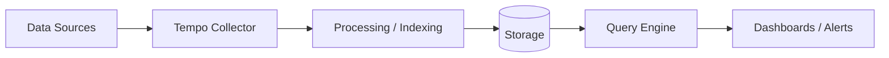

# Tempo — A 2-Day Crash Course

> Distributed tracing at minimal cost — Tempo does for traces what Loki does for logs: skip the index, store everything cheap, and let you find what you need by ID.
> **Prerequisites:** `OpenTelemetry.md`, `Grafana.md`

---

## Part 0 — Why Tempo Exists

Most tracing backends — Jaeger, Zipkin, Elasticsearch-backed solutions — build an inverted index over every span attribute. That index is fast, but it is also expensive: the more cardinality you have (trace IDs, user IDs, request paths), the more memory and disk the index consumes. At scale, the index can cost more than the trace data itself.

Tempo takes a different approach. It stores only a **minimal index** — essentially a mapping from trace ID to the object-storage location of that trace. Everything else lives in cheap object storage (S3, GCS, Azure Blob, or local disk). You retrieve a trace by its ID, not by querying span attributes directly.

The tradeoff is intentional. Tempo is not a general-purpose search engine for spans. It is a store-and-retrieve engine optimized for:

- **Cost** — object storage is an order of magnitude cheaper than indexed stores.
- **Scale** — ingest rates of millions of spans per second without index write amplification.
- **Integration** — native Grafana datasource, deep links from Loki logs and Prometheus metrics to traces.

If you need "find all traces where `http.status_code=500`," Tempo's metrics-generator and TraceQL (Day 2) cover that case — but the architecture is fundamentally different from a search-first system.

---

## Vocabulary

| Term | What it means |
|---|---|
| **Trace** | The complete record of a single request as it moves through every service — a tree of spans sharing one TraceID |
| **Span** | One unit of work within a trace: a function call, a DB query, an HTTP hop. Has start time, duration, attributes, and events |
| **TraceID** | A 128-bit identifier that ties every span in a request together — the primary key Tempo indexes |
| **Distributor** | Tempo component that receives spans from collectors over OTLP, Jaeger, or Zipkin protocols and forwards them to ingesters |
| **Ingester** | Holds recent traces in memory, flushes completed traces to object storage as blocks |
| **Compactor** | Background component that merges small blocks into larger ones, enforces retention, and maintains the bloom filter index |
| **Querier** | Serves read requests — checks the ingester cache, then fetches blocks from object storage, runs TraceQL |
| **Backend** | The object storage layer (S3-compatible, GCS, Azure Blob, or local filesystem) where trace blocks live |
| **TraceQL** | Tempo's query language for selecting spans and traces by attributes, duration, and structural relationships |
| **Service Graph** | A node-edge map of service dependencies derived from trace data — generated by the metrics-generator and exposed as Prometheus metrics |

---




## DAY 1 — Install, Ingest, and Query

### What you will build today

An OTel Collector receives spans from your application, forwards them to Tempo, and Grafana lets you pull traces by ID.

### Step 1 — Run Tempo in single-binary mode

Single-binary mode runs every Tempo component in one process. It is right for local development and small teams. For production, each component runs separately (covered in the scaling section).

```yaml
# tempo.yaml
server:
  http_listen_port: 3200

distributor:
  receivers:
    otlp:
      protocols:
        grpc:
          endpoint: 0.0.0.0:4317
        http:
          endpoint: 0.0.0.0:4318

ingester:
  trace_idle_period: 10s
  max_block_duration: 5m

compactor:
  compaction:
    block_retention: 48h

storage:
  trace:
    backend: local
    local:
      path: /tmp/tempo/blocks
    wal:
      path: /tmp/tempo/wal

metrics_generator:
  registry:
    external_labels:
      source: tempo
  storage:
    path: /tmp/tempo/generator/wal
    remote_write:
      - url: http://prometheus:9090/api/v1/write

overrides:
  metrics_generator_processors: [service-graphs, span-metrics]
```

Run it:

```bash
docker run -d --name tempo \
  -p 3200:3200 \
  -p 4317:4317 \
  -p 4318:4318 \
  -v $(pwd)/tempo.yaml:/etc/tempo.yaml \
  -v /tmp/tempo:/tmp/tempo \
  grafana/tempo:latest \
  -config.file=/etc/tempo.yaml
```

Tempo is healthy when `curl http://localhost:3200/ready` returns `ready`.

### Step 2 — Configure the OTel Collector

The Collector sits between your app and Tempo. It receives OTLP spans, can batch and retry, and exports to Tempo.

```yaml
# otel-collector.yaml
receivers:
  otlp:
    protocols:
      grpc:
        endpoint: 0.0.0.0:4317
      http:
        endpoint: 0.0.0.0:4318

processors:
  batch:
    timeout: 1s
    send_batch_size: 1024

exporters:
  otlp:
    endpoint: tempo:4317
    tls:
      insecure: true

service:
  pipelines:
    traces:
      receivers: [otlp]
      processors: [batch]
      exporters: [otlp]
```

### Step 3 — Instrument your app

In Python with the OTel SDK:

```python
from opentelemetry import trace
from opentelemetry.sdk.trace import TracerProvider
from opentelemetry.sdk.trace.export import BatchSpanProcessor
from opentelemetry.exporter.otlp.proto.grpc.trace_exporter import OTLPSpanExporter

provider = TracerProvider()
provider.add_span_processor(
    BatchSpanProcessor(OTLPSpanExporter(endpoint="http://localhost:4317"))
)
trace.set_tracer_provider(provider)

tracer = trace.get_tracer("my-service")

with tracer.start_as_current_span("handle-request") as span:
    span.set_attribute("http.method", "GET")
    span.set_attribute("http.route", "/api/orders")
    # do work
```

Every span carries the same TraceID through context propagation — as long as you pass the OTel context across service boundaries (via HTTP headers like `traceparent`), all spans from one request end up in the same trace.

### Step 4 — Add Tempo as a Grafana datasource

In Grafana → Connections → Data sources → Add → Tempo:

- **URL:** `http://tempo:3200`
- Under **Trace to logs**, set your Loki datasource and the label field that maps to your service name.
- Under **Trace to metrics**, set your Prometheus datasource.

Save and test. You should see "Data source connected and labels found."

### Step 5 — Find a trace by ID

Open Grafana → Explore → Select the Tempo datasource → paste a TraceID into the search box. You will see the trace as a waterfall diagram showing every span, its duration, and its attributes.

If you do not have a TraceID yet, check your application logs — the OTel SDK can emit the TraceID alongside log lines. With Loki linked (Step 4), a "Tempo" button appears next to log lines that contain a trace ID, jumping you directly to the trace.

---

## DAY 2 — TraceQL, Metrics Generator, and Production Concerns

### TraceQL

TraceQL is a pipeline language for querying spans. Every query starts with a **spanset selector** and can chain **filters** and **aggregations**.

**Basic span selector:**

```
{ .http.route = "/api/orders" }
```

This returns every trace that contains at least one span where `http.route` equals `/api/orders`.

**Filter by duration:**

```
{ .http.route = "/api/orders" && duration > 500ms }
```

**Filter by status:**

```
{ status = error }
```

**Structural queries — find a span that is a child of another:**

```
{ .service.name = "gateway" } >> { .service.name = "orders-db" && duration > 200ms }
```

The `>>` operator means "followed by a descendant." This query finds any trace where the gateway called the orders database and that DB call took more than 200 ms.

**Aggregate over a time range:**

```
{ .service.name = "payment-service" } | rate()
```

```
{ status = error } | rate() by (.service.name)
```

TraceQL aggregations output metrics you can plot in Grafana panels. Use the Tempo datasource with a `TraceQL metrics` query type.

### Metrics Generator

The metrics-generator is an optional Tempo component that derives RED metrics (Rate, Errors, Duration) from live span data and remote-writes them to Prometheus. Two processors ship out of the box:

**span-metrics** — emits `traces_spanmetrics_calls_total` and `traces_spanmetrics_duration_seconds` labeled by service, span name, and status.

**service-graphs** — emits `traces_service_graph_request_total` and `traces_service_graph_request_duration_seconds` labeled by client and server service. Grafana renders these as the service topology map.

Enable both in `overrides.metrics_generator_processors` as shown in the Day 1 config. You then get Prometheus dashboards showing latency and error rates — and those metrics link back to Tempo traces via exemplars.

### Linking Traces, Logs, and Metrics

This is where Tempo's value multiplies. The three pillars of observability become navigable.

**Logs → Traces:** Add `trace_id` to your structured log output. Configure Loki's derived fields in Grafana to detect the `trace_id` pattern and render a "View in Tempo" link. When investigating an error in Loki, one click opens the full trace.

**Traces → Logs:** In Tempo's Grafana datasource settings, configure "Trace to logs" with the Loki datasource. Tempo will query Loki for log lines that share the same `traceID` and `service.name` labels, showing them alongside the trace waterfall.

**Metrics → Traces:** Use Prometheus exemplars. When your app records a histogram observation, attach the current TraceID as an exemplar:

```python
histogram.observe(duration, exemplar={"traceID": current_trace_id})
```

In Grafana, exemplar dots appear on metric graphs. Clicking one opens the corresponding trace in Tempo.

**Traces → Metrics:** From a slow trace, Tempo can link to the span-metrics panel in Prometheus that shows the P99 for that operation over time — confirming whether this was an anomaly or a regression.

### Multi-Tenancy

Tempo supports multiple tenants via the `X-Scope-OrgID` HTTP header. Each tenant's data is isolated in its own path in object storage.

Pass the header from the Collector:

```yaml
exporters:
  otlp:
    endpoint: tempo:4317
    headers:
      X-Scope-OrgID: "team-payments"
    tls:
      insecure: true
```

Enable multi-tenancy in Tempo:

```yaml
auth_enabled: true
```

In Grafana, set the `X-Scope-OrgID` header on the Tempo datasource under "Custom HTTP Headers."

### Scaling Tempo

Single-binary is fine up to roughly 5,000 spans/second on modest hardware. Beyond that, split components:

| Component | Scale axis | Notes |
|---|---|---|
| Distributor | CPU / network | Stateless, scale horizontally behind a load balancer |
| Ingester | Memory | Holds in-flight traces; use a StatefulSet in Kubernetes, 3+ replicas |
| Querier | CPU / memory | Stateless, scale for read throughput |
| Compactor | Single instance | Only one compactor should run per tenant to avoid conflicts |
| Query-frontend | Network | Optional; shards large queries across queriers |

Use object storage (S3 or GCS) in production — local disk does not survive pod restarts or node failures.

### Tempo vs Jaeger

| Dimension | Tempo | Jaeger |
|---|---|---|
| Storage cost | Very low — object storage only | Higher — Cassandra or Elasticsearch index |
| Search capability | TraceQL on span attributes; no full-text index | Full attribute search via Elasticsearch backend |
| Grafana integration | First-class native datasource | Plugin, less seamless |
| Multi-tenancy | Built in | Requires Elasticsearch index-per-tenant or external proxy |
| Metrics derivation | Built-in metrics-generator | Requires separate SPM (Span Metrics Processor) setup |
| Operational complexity | Low (one binary to start) | Higher (Collector + backend + query + UI) |
| Use case fit | High-volume ingest, cost-sensitive, Grafana stack | Teams needing rich span search without TraceQL |

Choose Tempo if you are already on the Grafana stack and want low-cost, high-volume tracing. Consider Jaeger if your team requires full-text search over arbitrary span attributes and is not committed to Grafana.

---

## Worked Example — Tracing a Slow API Request

**Scenario:** Users report that `POST /api/checkout` occasionally takes 4+ seconds. You have traces flowing into Tempo.

**Step 1 — Reproduce and capture a TraceID.**

Trigger a slow request. Your application logs emit:

```
level=error msg="slow request" trace_id=4bf92f3577b34da6a3ce929d0e0e4736 duration=4.2s
```

**Step 2 — Open the trace in Grafana.**

Paste `4bf92f3577b34da6a3ce929d0e0e4736` into Tempo Explore. The waterfall appears:

```
checkout-api        POST /api/checkout          4.2s
  ├─ inventory-svc  CheckStock                   80ms
  ├─ pricing-svc    CalculateTotal               45ms
  ├─ payment-svc    ChargeCard                   3.8s   ← ⚠️ outlier
  │    └─ stripe    POST /v1/charges             3.7s
  └─ email-svc      SendConfirmation             90ms
```

The bottleneck is the Stripe API call inside `payment-svc`.

**Step 3 — Check span attributes on the Stripe span.**

Click the span. Attributes show:

```
http.url:         https://api.stripe.com/v1/charges
http.status_code: 200
net.peer.name:    api.stripe.com
retry_count:      2
```

Two retries — Stripe throttled the first two attempts. The issue is missing retry backoff configuration in `payment-svc`.

**Step 4 — Correlate with metrics.**

From the trace view, click "Related metrics." Grafana shows the P99 of `payment-svc → ChargeCard` over the last hour. You see P99 spiked from 200 ms to 3.8 s around 14:32 UTC — correlating with a Stripe status page incident.

**Step 5 — Check logs.**

From the trace view, click "Logs for this trace." Loki returns the payment-svc log lines tagged with this TraceID, confirming the retry sequence and the Stripe throttle error codes.

You now have the full picture: external dependency degradation caused the slow checkout. No guessing, no grepping through fragmented logs across services.

---

## Pitfalls

**Sending traces without a TraceID in your logs.** Tempo is useless if you cannot find a TraceID. Make `trace_id` a first-class field in every structured log line. Use the OTel log bridge to inject it automatically rather than doing it by hand.

**Not setting `trace_idle_period` correctly.** If your traces have spans that arrive late — long-lived requests, async workers, message queue consumers — the ingester may flush the trace before all spans arrive. Increase `trace_idle_period` to match your slowest expected span arrival. Default is 30 seconds.

**Using local storage in production.** Local storage does not survive restarts and cannot be shared across multiple ingesters. Always use object storage (S3, GCS) for any deployment that matters.

**Sampling everything in high-volume services.** If your services emit millions of requests per second, storing every trace is expensive even on object storage. Use head-based sampling in the OTel Collector (`probabilistic_sampler` processor) or tail-based sampling (`tail_sampling` processor) to keep errors, slow requests, and a representative fraction of normal traffic. ⚠️ Tail-based sampling requires all spans for a trace to arrive at the same Collector instance — use a consistent hash on TraceID to route spans correctly.

**Ignoring compaction.** Without the compactor running, your object storage fills with tiny block files and query performance degrades. Confirm the compactor is running and that retention is set to a value your storage budget supports.

**Forgetting `X-Scope-OrgID` in single-tenant mode.** If `auth_enabled: false`, Tempo assigns all traces to the `anonymous` tenant. If you later enable multi-tenancy, existing data is not migrated. Decide on tenancy before you go to production.

**Large traces from loops.** A span that spawns 50,000 child spans — a loop that creates one span per DB row, for example — will produce a trace that Grafana struggles to render and Tempo struggles to store atomically. Aggregate loop spans into a single summary span with a count attribute instead.

---

## Quick Reference

```bash
# Check Tempo is ready
curl http://localhost:3200/ready

# Query a trace by ID (raw JSON)
curl "http://localhost:3200/api/traces/4bf92f3577b34da6a3ce929d0e0e4736"

# Search with TraceQL via HTTP API
curl -G "http://localhost:3200/api/search" \
  --data-urlencode 'q={ .http.route = "/api/checkout" && duration > 1s }' \
  --data-urlencode "start=$(date -d '1 hour ago' +%s)" \
  --data-urlencode "end=$(date +%s)"

# Check ingester ring (distributed mode)
curl http://localhost:3200/ring

# Check compactor ring
curl http://localhost:3200/compactor/ring

# Verify metrics-generator is producing metrics
curl http://localhost:3200/metrics | grep traces_spanmetrics

# List per-tenant overrides (multi-tenant mode)
curl http://localhost:3200/api/overrides
```

**TraceQL cheat sheet:**

```
# Any error span
{ status = error }

# Slow DB calls
{ .db.system = "postgresql" && duration > 100ms }

# Service-to-service with slow child
{ .service.name = "api" } >> { .service.name = "db" && duration > 200ms }

# Rate of errors by service
{ status = error } | rate() by (.service.name)

# P99 latency by route
{ .http.route != "" } | histogram_over_time(duration) by (.http.route)
```

**Key ports:**

| Port | Protocol | Purpose |
|---|---|---|
| 3200 | HTTP | Tempo HTTP API and Grafana datasource |
| 4317 | gRPC | OTLP gRPC receiver |
| 4318 | HTTP | OTLP HTTP receiver |
| 9096 | gRPC | Tempo internal gRPC (distributed mode) |

---


## Top 10 Interview Questions

<details>
<summary><strong>Q: What is Tempo and what problem does it solve?</strong></summary>

Tempo addresses a specific need in modern engineering workflows. Understanding the core problem it solves — and the alternatives it replaced — is the foundation for every subsequent interview question. Frame your answer around the pain point first, then the solution.

</details>

<details>
<summary><strong>Q: How does Tempo compare to its main alternatives?</strong></summary>

Every tool exists in an ecosystem of alternatives. Be prepared to articulate the specific tradeoffs: when Tempo is the right choice, when an alternative is better, and what factors drive the decision (scale, team expertise, existing infrastructure, compliance requirements).

</details>

<details>
<summary><strong>Q: What are the most common production pitfalls with Tempo?</strong></summary>

Production experience is what separates senior from junior engineers. Common pitfalls include: misconfiguration that works in dev but fails at scale, security oversights, inadequate monitoring, and operational procedures that are untested until an incident occurs. Cite specific examples from your experience.

</details>

<details>
<summary><strong>Q: How do you monitor and observe Tempo in production?</strong></summary>

Key metrics to track, alerting thresholds to set, dashboards to build, and log patterns to watch. Production monitoring should cover: health/liveness, performance (latency, throughput), capacity (resource utilisation), and business impact (error rates affecting users). Explain which metrics are leading indicators versus lagging.

</details>

<details>
<summary><strong>Q: How do you scale Tempo as load increases?</strong></summary>

Scaling strategies depend on the bottleneck: horizontal scaling (add more instances), vertical scaling (bigger instances), caching (reduce load), sharding (distribute data), and async processing (decouple components). Explain which approach applies to Tempo and at what scale each strategy becomes necessary.

</details>

<details>
<summary><strong>Q: How do you handle security and access control with Tempo?</strong></summary>

Security is non-negotiable in production. Cover: authentication and authorization mechanisms, secrets management (never in code), encryption (at rest and in transit), network security (firewalls, private networks), audit logging, and compliance requirements relevant to your industry.

</details>

<details>
<summary><strong>Q: How do you implement disaster recovery for Tempo?</strong></summary>

DR planning requires defining RTO (recovery time objective) and RPO (recovery point objective), implementing backup strategies, testing restore procedures, and documenting runbooks. Explain your backup strategy, how you test restores, and what your recovery procedure looks like.

</details>

<details>
<summary><strong>Q: How do you automate Tempo deployment and configuration management?</strong></summary>

Infrastructure as code, CI/CD pipelines, configuration management, and GitOps workflows. Explain how you version, test, deploy, and roll back changes. Cover: what is automated, what requires manual approval, and how you handle configuration drift.

</details>

<details>
<summary><strong>Q: How do you troubleshoot issues with Tempo in production?</strong></summary>

A systematic debugging approach: check health endpoints, review recent changes (deploys, config changes), examine logs and metrics, reproduce the issue, identify root cause, fix, verify, and write a postmortem. Explain your actual debugging workflow with concrete examples.

</details>

<details>
<summary><strong>Q: What are the best practices for Tempo that you have learned from experience?</strong></summary>

Best practices that go beyond documentation: lessons learned from production incidents, configuration patterns that prevent common issues, testing strategies that catch bugs before production, and operational procedures that reduce toil. Share specific examples where following (or not following) a best practice had measurable impact.

</details>

---

## Next Steps

- `OpenTelemetry.md` — instrument services correctly so spans carry the right attributes for TraceQL queries
- `Grafana.md` — build trace-linked dashboards, configure exemplar overlays, and set up the service topology panel
- `Prometheus.md` — consume the span-metrics and service-graph metrics that Tempo's metrics-generator produces
- `Loki.md` — close the loop with log-to-trace and trace-to-log correlation using derived fields

---

## Recommended learning resources

**YouTube channels & playlists:**
- [Grafana Labs — Tempo Tutorials](https://www.youtube.com/@GrafanaLabs) — official deep dives on TraceQL, metrics-generator, and Tempo architecture at ObservabilityCON
- [OpenTelemetry Official — Tracing & Collector Pipelines](https://www.youtube.com/@oaborstudio) — OTel community talks on trace instrumentation that feeds Tempo
- [CNCF — KubeCon Observability Track](https://www.youtube.com/@caborstudio) — conference talks on distributed tracing at scale, sampling strategies, and trace correlation
- [DevOps Toolkit (Viktor Farcic) — Tempo vs Jaeger](https://www.youtube.com/@DevOpsToolkit) — practical comparison of tracing backends and LGTM stack integration
- [Honeycomb (Charity Majors) — Debugging with Traces](https://www.youtube.com/@honeycombio) — observability philosophy applied to trace-driven debugging

**Official docs & blogs:**
- [Tempo Official Documentation](https://grafana.com/docs/tempo/latest/)
- [Grafana Labs Blog — Tempo Category](https://grafana.com/blog/) — deep posts on TraceQL, metrics-generator, and scaling Tempo in microservices mode
- [TraceQL Documentation](https://grafana.com/docs/tempo/latest/traceql/) — complete query language reference with pipeline and aggregation examples

## The Mantra

**Find it by ID. Understand it by context. Fix it once.**

Tempo does not try to be a search engine. It is a retrieval system — fast, cheap, and honest about what it is. Your job is to make sure every request drops a TraceID somewhere you can find it: a log line, a response header, an error message. Once you have the ID, Tempo hands you the full story. The tracing is only as useful as the instrumentation feeding it — instrument deliberately, not exhaustively.
