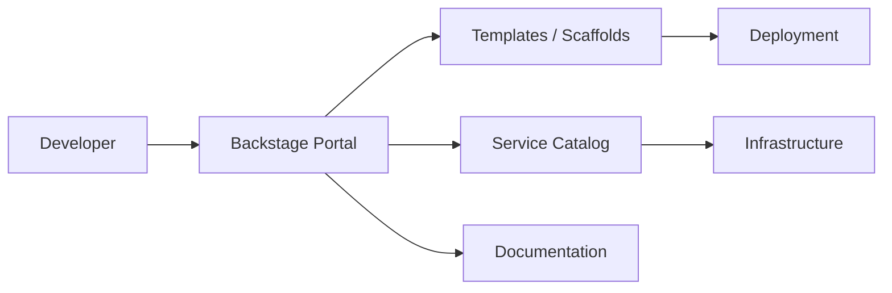

# Backstage — A 2-Day Crash Course

Backstage is Spotify's open-source developer portal — a single platform that unifies your service catalog, software templates, TechDocs, and plugins so every engineer in your organization can find, create, and understand services without hunting through wikis and Slack threads.

**Prerequisites:** None. Familiarity with YAML and basic terminal usage is enough to get started.

---

## Part 0 — Why Backstage Exists

Picture a company that has grown from five services to five hundred. No single person knows what all of them do. You want to find the owner of the payments API — you check Confluence, Slack, GitHub, and a spreadsheet that was last updated two years ago. You want to create a new microservice — you copy-paste an old repo, delete the wrong files, and spend a day configuring CI/CD by hand. You want to read the documentation for the auth service — there isn't any, or what exists is in three different places and contradicts itself.

This is microservices sprawl. It is not a people problem. It is a tooling problem.

Backstage solves it by giving your organization a single front door to:

- **discover** every service, library, website, and API in one catalog
- **understand** who owns it, what it depends on, and where the docs live
- **create** new services using golden-path templates that encode your organization's best practices
- **extend** the experience with plugins for Kubernetes, CI/CD, cost, security, and anything else your teams need

Spotify built Backstage internally in 2016 and open-sourced it in 2020. It graduated as a CNCF incubating project in 2022. Hundreds of companies — Expedia, American Airlines, Zalando, Netflix — run it in production.

---

## Vocabulary

Before you touch the terminal, get these terms straight. You will see them everywhere.

**Software Catalog** — The central registry of all software in your organization. Think of it as a live, queryable database of everything your teams build and operate.

**Entity** — Any item registered in the catalog. Every component, API, system, domain, group, and user is an entity.

**Component** — A piece of software: a service, a website, a library, a data pipeline. The most common entity type. Examples: `payments-api`, `checkout-frontend`, `ml-training-job`.

**API** — An entity that describes an interface a component exposes or consumes. Can be typed as OpenAPI, AsyncAPI, GraphQL, or gRPC.

**System** — A collection of components and APIs that together deliver a capability. Example: the `payments` system contains the `payments-api` component, the `payments-db` component, and the `payment-events` API.

**Domain** — A high-level grouping of systems, typically aligned to a business domain. Example: the `commerce` domain contains the `payments` system and the `cart` system.

**Template (Scaffolder)** — A definition that lets engineers create new software using a form-driven wizard. The Scaffolder runs steps — fetch a skeleton repo, substitute variables, create a GitHub repo, register the new entity in the catalog. Templates are how you encode golden paths.

**TechDocs** — Backstage's docs-as-code feature. It reads Markdown from your repo (via MkDocs) and renders it inside the portal. Docs live next to code, versioned in git, searchable from the UI.

**Plugin** — A React frontend (and optional backend) package that extends Backstage. Kubernetes, GitHub Actions, ArgoCD, PagerDuty, cost insights — each is a plugin. Backstage ships around 150 community plugins.

**Descriptor (catalog-info.yaml)** — A YAML file you commit to a repository. It tells Backstage what the entity is, who owns it, what it depends on, and where its docs live. This is the contract between your repo and the catalog.

---




## DAY 1 — Install, Register, Explore

### 1.1 Create a Backstage App

You need Node 18+ and Yarn 1.x (classic). Backstage does not yet support Yarn Berry cleanly.

```bash
npx @backstage/create-app@latest
```

Answer the prompt: give your app a name (e.g. `my-portal`). The CLI scaffolds a monorepo with two workspaces — `packages/app` (the React frontend) and `packages/backend` (the Node backend).

```bash
cd my-portal
yarn dev
```

The app starts at `http://localhost:3000`. The backend runs on port 7007. You are looking at a working Backstage instance with example entities already loaded.

### 1.2 Understand the App Monorepo

```
my-portal/
  app-config.yaml          # Main configuration — integrations, auth, catalog locations
  packages/
    app/                   # React frontend
      src/
        App.tsx            # Root, where plugins are wired in
        components/
    backend/               # Node backend
      src/
        index.ts           # Plugin backends registered here
```

`app-config.yaml` is the file you will edit most often. It controls everything from the base URL to which GitHub org to index.

### 1.3 Write Your First catalog-info.yaml

In any existing repository, create a file at the root called `catalog-info.yaml`:

```yaml
apiVersion: backstage.io/v1alpha1
kind: Component
metadata:
  name: payments-api
  description: Handles all payment processing for the commerce platform
  annotations:
    github.com/project-slug: my-org/payments-api
    backstage.io/techdocs-ref: dir:.
  tags:
    - java
    - payments
spec:
  type: service
  lifecycle: production
  owner: group:commerce-team
  system: payments
  providesApis:
    - payments-openapi
```

Key fields:

- `kind` — Component, API, System, Domain, Group, or User
- `metadata.name` — unique identifier within its namespace
- `metadata.annotations` — attach external identifiers and enable plugin integrations
- `spec.owner` — a group or user entity ref; this is how ownership is tracked
- `spec.lifecycle` — `experimental`, `production`, or `deprecated`

### 1.4 Register the Entity in the Catalog

In the Backstage UI, navigate to **Catalog** > **Register Existing Component**. Paste the full URL to your `catalog-info.yaml` on GitHub (the raw file URL). Backstage fetches it, validates it, and adds the entity to the catalog.

To automate this at scale, add a location to `app-config.yaml`:

```yaml
catalog:
  locations:
    - type: url
      target: https://github.com/my-org/payments-api/blob/main/catalog-info.yaml
    - type: github-discovery
      target: https://github.com/my-org
      rules:
        - allow: [Component, API]
```

The `github-discovery` location type crawls your entire GitHub org and auto-registers any repo that has a `catalog-info.yaml`. This is how large organizations bootstrap the catalog quickly.

### 1.5 Browse the Catalog

The Catalog view lets you filter by kind, owner, lifecycle, and tag. Click into a component to see:

- **Overview** — metadata, owner, lifecycle, system membership
- **Relations** — visual graph of dependencies
- **TechDocs** — rendered documentation
- **Plugin tabs** — CI/CD status, Kubernetes pods, cost, etc. (once configured)

The **Explore** page shows systems and domains as higher-level groupings.

### 1.6 Set Up TechDocs

TechDocs uses MkDocs under the hood. In your repo, add:

```yaml
# mkdocs.yml (at repo root)
site_name: Payments API
docs_dir: docs
nav:
  - Home: index.md
  - Architecture: architecture.md
  - Runbook: runbook.md
```

Create a `docs/` directory with your Markdown files. The `catalog-info.yaml` annotation `backstage.io/techdocs-ref: dir:.` tells Backstage where to find the docs.

In development mode, Backstage builds TechDocs on-the-fly. In production, you pre-build and publish to object storage (S3, GCS, Azure Blob).

### 1.7 Create a New Service with a Template

Navigate to **Create** in the sidebar. You will see the default example templates. Click one — for example, "Create a Node.js Service". Fill in the form: service name, owner, GitHub org. Submit.

The Scaffolder runs its steps in a live log view:

1. Fetches the skeleton from the template repo
2. Substitutes your variables into file names and file contents
3. Creates a new GitHub repository
4. Registers the new `catalog-info.yaml` in the catalog

Within two minutes you have a new repo with CI/CD, a catalog entry, and TechDocs scaffolded — without copying anything by hand.

---

## DAY 2 — Custom Templates, Plugins, Auth, and Golden Paths

### 2.1 Write a Custom Scaffolder Template

Templates are entities too — they live in YAML files and get registered in the catalog. Create a file `templates/java-service/template.yaml`:

```yaml
apiVersion: scaffolder.backstage.io/v1beta3
kind: Template
metadata:
  name: java-microservice
  title: Java Microservice
  description: Spring Boot service with CI/CD, TechDocs, and catalog registration
  tags:
    - java
    - recommended
spec:
  owner: group:platform-team
  type: service

  parameters:
    - title: Service Details
      required: [name, description, owner]
      properties:
        name:
          title: Service Name
          type: string
          pattern: '^[a-z][a-z0-9-]*$'
        description:
          title: Description
          type: string
        owner:
          title: Owner
          type: string
          ui:field: OwnerPicker
          ui:options:
            catalogFilter:
              kind: Group

  steps:
    - id: fetch
      name: Fetch Skeleton
      action: fetch:template
      input:
        url: ./skeleton
        values:
          name: ${{ parameters.name }}
          description: ${{ parameters.description }}
          owner: ${{ parameters.owner }}

    - id: publish
      name: Publish to GitHub
      action: publish:github
      input:
        allowedHosts: [github.com]
        repoUrl: github.com?owner=my-org&repo=${{ parameters.name }}
        defaultBranch: main

    - id: register
      name: Register in Catalog
      action: catalog:register
      input:
        repoContentsUrl: ${{ steps.publish.output.repoContentsUrl }}
        catalogInfoPath: /catalog-info.yaml

  output:
    links:
      - title: Repository
        url: ${{ steps.publish.output.remoteUrl }}
      - title: Open in Catalog
        entityRef: ${{ steps.register.output.entityRef }}
```

The `skeleton/` directory beside this template contains the actual files — `pom.xml`, `src/`, `catalog-info.yaml`, `mkdocs.yml`, `.github/workflows/ci.yml` — all with `${{ values.name }}` placeholders substituted by Nunjucks templating.

### 2.2 Install the Kubernetes Plugin

The Kubernetes plugin shows pod status, container logs, and resource utilization directly on the component page. Install it:

```bash
# In packages/app
yarn workspace app add @backstage/plugin-kubernetes

# In packages/backend
yarn workspace backend add @backstage/plugin-kubernetes-backend
```

Wire it into `packages/app/src/components/catalog/EntityPage.tsx`:

```tsx
import { EntityKubernetesContent } from '@backstage/plugin-kubernetes';

// Inside the serviceEntityPage definition:
<EntityLayout.Route path="/kubernetes" title="Kubernetes">
  <EntityKubernetesContent refreshIntervalMs={30000} />
</EntityLayout.Route>
```

In `app-config.yaml`:

```yaml
kubernetes:
  serviceLocatorMethod:
    type: multiTenant
  clusterLocatorMethods:
    - type: config
      clusters:
        - url: https://my-cluster.example.com
          name: production
          authProvider: serviceAccount
          serviceAccountToken: ${K8S_SA_TOKEN}
          caData: ${K8S_CA_DATA}
```

In each component's `catalog-info.yaml`, add the annotation:

```yaml
annotations:
  backstage.io/kubernetes-id: payments-api
  backstage.io/kubernetes-namespace: payments
```

### 2.3 CI/CD and Cost Plugins

For **GitHub Actions**, install `@backstage/plugin-github-actions` and add `EntityGithubActionsContent` to the entity page. It shows workflow runs, statuses, and re-run buttons.

For **cost insights**, Spotify's `@backstage-community/plugin-cost-insights` lets you surface cloud spend per team. It requires a custom `CostInsightsClient` that calls your billing API — the plugin ships an example mock client to start from.

For **ArgoCD**, install `@roadiehq/backstage-plugin-argo-cd`. Add the `argocd/app-name` annotation to `catalog-info.yaml` and configure the ArgoCD instance URL in `app-config.yaml`.

### 2.4 Build a Custom Plugin

When no community plugin covers your needs, build one:

```bash
yarn backstage-cli package create-plugin --backend false --pluginId my-widget
```

This generates a plugin package under `plugins/my-widget/`. The plugin exports a React component. Wire it into the app in `packages/app/src/App.tsx` or the entity page.

A plugin has three parts: a route, a page component, and optionally a backend that proxies to your internal APIs. The backend proxy approach keeps credentials server-side and avoids CORS issues.

### 2.5 Authentication

Backstage ships providers for GitHub, GitLab, Google, Okta, Azure AD, and more. Configure in `app-config.yaml`:

```yaml
auth:
  environment: production
  providers:
    github:
      production:
        clientId: ${AUTH_GITHUB_CLIENT_ID}
        clientSecret: ${AUTH_GITHUB_CLIENT_SECRET}
```

In `packages/app/src/App.tsx`, set the `SignInPage` component:

```tsx
import { githubAuthApiRef } from '@backstage/core-plugin-api';
import { SignInPage } from '@backstage/core-components';

const app = createApp({
  components: {
    SignInPage: props => (
      <SignInPage
        {...props}
        auto
        provider={{
          id: 'github-auth-provider',
          title: 'GitHub',
          message: 'Sign in with GitHub',
          apiRef: githubAuthApiRef,
        }}
      />
    ),
  },
});
```

For authorization — controlling who can see or edit what — Backstage introduced a permission framework in v1.1. Define permission policies in the backend to restrict catalog mutations or plugin actions based on group membership.

### 2.6 Integrating with GitHub and GitLab

Add an integration in `app-config.yaml`:

```yaml
integrations:
  github:
    - host: github.com
      token: ${GITHUB_TOKEN}
  gitlab:
    - host: gitlab.com
      token: ${GITLAB_TOKEN}
```

The GitHub integration enables auto-discovery of `catalog-info.yaml` files across your org, the GitHub Actions plugin, and the Scaffolder's `publish:github` action.

The GitLab integration provides the same capabilities for GitLab-hosted repos. Use `publish:gitlab` in Scaffolder templates and `gitlab-discovery` for catalog auto-import.

### 2.7 Golden Paths for Teams

A golden path is an opinionated, supported way to do a common task — create a service, deploy to Kubernetes, add observability. Backstage makes golden paths concrete:

1. **Write a template** that encodes the path — skeleton code, CI config, catalog registration, TechDocs structure.
2. **Add it to the Create catalog** so it surfaces in the wizard alongside a description and tags.
3. **Maintain the skeleton** in a dedicated repo. When your CI standard changes, update the skeleton; engineers creating new services get the update automatically.
4. **Document deviations** — if a team needs to diverge, they should do so explicitly, not by accident.

A well-maintained golden path eliminates the "how do I create a new service" question entirely. The answer is always: go to the portal, click Create, choose the right template.

### 2.8 Measuring Developer Experience

Backstage does not ship metrics dashboards out of the box, but it gives you the data:

- **Catalog completeness** — what percentage of services have an owner, have docs, are registered? Query the catalog API (`/api/catalog/entities`) and track over time.
- **Template usage** — the Scaffolder backend emits events; add a listener to count template runs per template and per team.
- **TechDocs coverage** — count components with the `backstage.io/techdocs-ref` annotation set.
- **Search usage** — the Search plugin backend logs queries; surface the most common failed searches as gaps in documentation.

Feed these into Grafana or DataDog to build a developer experience scorecard. Present it to leadership quarterly. Catalog health improves when teams can see their score.

---

## Worked Example — Onboarding a Microservice with a Golden Path Template

Scenario: a backend engineer named Priya needs to create a new Go service called `notification-worker` for the `messaging` team.

**Step 1: Priya opens the portal and clicks Create.**

She browses templates tagged `go` and `recommended`. She selects "Go Microservice — Platform Approved."

**Step 2: She fills in the form.**

- Service Name: `notification-worker`
- Description: Processes outbound notification jobs from the queue
- Owner: `group:messaging-team`
- System: `notifications`
- GitHub Org: `my-org`

**Step 3: The Scaffolder runs.**

It fetches the Go skeleton — which includes a `Makefile`, a `Dockerfile`, a GitHub Actions workflow with lint/test/build steps, a `catalog-info.yaml`, and a `mkdocs.yml`. It substitutes `notification-worker` and `messaging-team` throughout. It creates the repo `my-org/notification-worker` on GitHub with branch protection enabled. It registers the entity in the catalog.

**Step 4: Priya is handed two links.**

- Repository: `https://github.com/my-org/notification-worker`
- Catalog entry: `https://portal.my-org.com/catalog/default/component/notification-worker`

**Step 5: Priya clones the repo and starts writing business logic.**

The CI pipeline is already running on the skeleton's example test. TechDocs builds from the `docs/` directory. The Kubernetes plugin will show pods once the service is deployed and annotated.

Total time from idea to working repo: under three minutes. No tickets, no platform team hand-holding, no copy-pasting.

---

## Pitfalls

**Catalog-info.yaml drift** — Teams rename services or change ownership but forget to update the YAML. Enforce catalog health in code review. Some organizations add a CI check that validates `catalog-info.yaml` on every PR.

**Orphaned entities** — When a repo is deleted or renamed, its entity stays in the catalog. Add a scheduled job that checks entity reachability and flags stale entries.

**Over-templating** — Building a template for every edge case creates template sprawl. Aim for three to five opinionated templates per major language or framework. Resist requests for "a template that does everything."

**Authentication misconfiguration** — Running Backstage without auth in production leaks your entire service inventory. Do not expose the portal to the internet without enabling an auth provider and setting appropriate permissions.

**Plugin overload** — Adding twenty plugins before your catalog has real data is backwards. Start with catalog, TechDocs, and one CI/CD plugin. Add plugins when a team asks for them.

**Ignoring the backend** — Most Backstage tutorials show only the frontend. The backend is where catalog ingestion, the Scaffolder executor, TechDocs publisher, and plugin proxies run. Understand what the backend does before deploying to production.

**Slow startup from a large catalog** — If you auto-discover thousands of repos, the catalog refresh cycle can be slow. Tune `processingIntervalSeconds` in `app-config.yaml` and add database indexes. Use PostgreSQL, not the default SQLite, in production.

⚠️ Never run the default SQLite database in production. It does not support concurrent writes and will corrupt under load. Switch to PostgreSQL before your first real deployment.

---

## Quick Reference

```bash
# Create a new Backstage app
npx @backstage/create-app@latest

# Start the full app (frontend + backend)
yarn dev

# Start only the backend
yarn workspace backend start

# Add a frontend plugin to the app package
yarn workspace app add @backstage/plugin-kubernetes

# Add a backend plugin to the backend package
yarn workspace backend add @backstage/plugin-kubernetes-backend

# Generate a new custom plugin
yarn backstage-cli package create-plugin --pluginId my-widget

# Validate a catalog-info.yaml locally
npx @backstage/catalog-model validate catalog-info.yaml

# Query the catalog API directly
curl http://localhost:7007/api/catalog/entities?filter=kind=Component

# Build TechDocs locally
npx @techdocs/cli serve --dir docs/
```

Key `app-config.yaml` sections:

```yaml
app:
  baseUrl: http://localhost:3000

backend:
  baseUrl: http://localhost:7007
  database:
    client: pg
    connection: ${POSTGRES_CONNECTION}

integrations:
  github:
    - host: github.com
      token: ${GITHUB_TOKEN}

catalog:
  locations:
    - type: github-discovery
      target: https://github.com/my-org

auth:
  providers:
    github:
      production:
        clientId: ${AUTH_GITHUB_CLIENT_ID}
        clientSecret: ${AUTH_GITHUB_CLIENT_SECRET}
```

---


## Top 10 Interview Questions

<details>
<summary><strong>Q: What is Backstage and what problem does it solve?</strong></summary>

Backstage addresses a specific need in modern engineering workflows. Understanding the core problem it solves — and the alternatives it replaced — is the foundation for every subsequent interview question. Frame your answer around the pain point first, then the solution.

</details>

<details>
<summary><strong>Q: How does Backstage compare to its main alternatives?</strong></summary>

Every tool exists in an ecosystem of alternatives. Be prepared to articulate the specific tradeoffs: when Backstage is the right choice, when an alternative is better, and what factors drive the decision (scale, team expertise, existing infrastructure, compliance requirements).

</details>

<details>
<summary><strong>Q: What are the most common production pitfalls with Backstage?</strong></summary>

Production experience is what separates senior from junior engineers. Common pitfalls include: misconfiguration that works in dev but fails at scale, security oversights, inadequate monitoring, and operational procedures that are untested until an incident occurs. Cite specific examples from your experience.

</details>

<details>
<summary><strong>Q: How do you monitor and observe Backstage in production?</strong></summary>

Key metrics to track, alerting thresholds to set, dashboards to build, and log patterns to watch. Production monitoring should cover: health/liveness, performance (latency, throughput), capacity (resource utilisation), and business impact (error rates affecting users). Explain which metrics are leading indicators versus lagging.

</details>

<details>
<summary><strong>Q: How do you scale Backstage as load increases?</strong></summary>

Scaling strategies depend on the bottleneck: horizontal scaling (add more instances), vertical scaling (bigger instances), caching (reduce load), sharding (distribute data), and async processing (decouple components). Explain which approach applies to Backstage and at what scale each strategy becomes necessary.

</details>

<details>
<summary><strong>Q: How do you handle security and access control with Backstage?</strong></summary>

Security is non-negotiable in production. Cover: authentication and authorization mechanisms, secrets management (never in code), encryption (at rest and in transit), network security (firewalls, private networks), audit logging, and compliance requirements relevant to your industry.

</details>

<details>
<summary><strong>Q: How do you implement disaster recovery for Backstage?</strong></summary>

DR planning requires defining RTO (recovery time objective) and RPO (recovery point objective), implementing backup strategies, testing restore procedures, and documenting runbooks. Explain your backup strategy, how you test restores, and what your recovery procedure looks like.

</details>

<details>
<summary><strong>Q: How do you automate Backstage deployment and configuration management?</strong></summary>

Infrastructure as code, CI/CD pipelines, configuration management, and GitOps workflows. Explain how you version, test, deploy, and roll back changes. Cover: what is automated, what requires manual approval, and how you handle configuration drift.

</details>

<details>
<summary><strong>Q: How do you troubleshoot issues with Backstage in production?</strong></summary>

A systematic debugging approach: check health endpoints, review recent changes (deploys, config changes), examine logs and metrics, reproduce the issue, identify root cause, fix, verify, and write a postmortem. Explain your actual debugging workflow with concrete examples.

</details>

<details>
<summary><strong>Q: What are the best practices for Backstage that you have learned from experience?</strong></summary>

Best practices that go beyond documentation: lessons learned from production incidents, configuration patterns that prevent common issues, testing strategies that catch bugs before production, and operational procedures that reduce toil. Share specific examples where following (or not following) a best practice had measurable impact.

</details>

---


## Terminal Demo

```terminal-demo
# backstage@platform ~ %

$ npx @backstage/create-app@latest
? Enter a name for the app: developer-portal
Creating the app...
Installing dependencies...
App created successfully!

$ yarn dev
Starting Backstage backend...
Backend: http://localhost:7007
Starting Backstage frontend...
Frontend: http://localhost:3000

$ curl -s localhost:7007/api/catalog/entities?filter=kind=component | jq ".[:3][] | {name:.metadata.name,type:.spec.type,owner:.spec.owner}"
{"name":"api-service","type":"service","owner":"platform-team"}
{"name":"web-app","type":"website","owner":"frontend-team"}
{"name":"order-processor","type":"service","owner":"backend-team"}

$ cat catalog-info.yaml | head -10
apiVersion: backstage.io/v1alpha1
kind: Component
metadata:
  name: api-service
  description: Production API
  annotations:
    github.com/project-slug: supersaiyane/api
spec:
  type: service
  owner: platform-team
```

---

## Quick Quiz

Test your understanding with these rapid-fire questions (answers hidden):

<details>
<summary>1. What is the ONE core problem that Backstage solves?</summary>
Re-read Part 0 — the mental model section. If you can explain the "why" in one sentence, you understand the foundation.
</details>

<details>
<summary>2. Name the 3 most important terms from the vocabulary section.</summary>
Review Part 1. These are the building blocks every conversation about Backstage uses.
</details>

<details>
<summary>3. What is the first thing you would set up on Day 1?</summary>
Check the Day 1 section — the very first hands-on step that gets you a working result.
</details>

<details>
<summary>4. What is the most common production pitfall with Backstage?</summary>
Review the Common Pitfalls section. The first item listed is typically the most frequently encountered.
</details>

<details>
<summary>5. How does Backstage compare to its closest alternative?</summary>
Check the Comparison Matrix below — focus on the key differentiating row.
</details>


## Comparison Matrix

| Dimension | Backstage | Port | Cortex |
|-----------|-----------|------|--------|
| **Primary use case** | Core strength of Backstage | Core strength of Port | Core strength of Cortex |
| **Learning curve** | Moderate | Varies | Varies |
| **Community/ecosystem** | Active | Active | Growing |
| **Operational complexity** | Medium | Varies | Varies |
| **Best for** | See Part 0 | Different tradeoffs | Different tradeoffs |

> **How to read this matrix:** no tool wins on every dimension. Pick based on your specific constraints — team expertise, existing infrastructure, scale requirements, and compliance needs. The right choice is the one that fits your context, not the one with the most checkmarks.

## Next Steps

- `Kubernetes.md` — understand the runtime your services run on; the Backstage Kubernetes plugin becomes much more useful once you know what you are looking at
- `ArgoCD.md` — connect your catalog to GitOps deployments; ArgoCD app health surfaces on the component page
- `GitHub-Actions.md` — your Scaffolder templates will generate CI workflows; know how to write and maintain them
- `Terraform.md` — provision infrastructure as part of Scaffolder templates using `fetch:template` combined with custom Terraform actions

---

## Recommended learning resources

**YouTube channels & playlists:**
- [Backstage Official — Tutorials and Demos](https://www.youtube.com/results?search_query=backstage+spotify+developer+portal) — getting started, plugin development, and catalog configuration
- [Spotify Engineering — Backstage](https://www.youtube.com/results?search_query=spotify+engineering+backstage) — the origin story, design decisions, and how Spotify uses Backstage internally
- [CNCF — Backstage Talks](https://www.youtube.com/@cncf) — KubeCon and community talks on Backstage adoption, plugin ecosystem, and platform engineering
- [DevOps Toolkit (Viktor Farcic) — Developer Portals](https://www.youtube.com/@DevOpsToolkit) — comparing Backstage with alternatives and building internal developer platforms
- [Roadie — Backstage Tutorials](https://www.youtube.com/results?search_query=roadie+backstage) — practical walkthroughs of catalog setup, Scaffolder templates, and TechDocs

**Official docs & blogs:**
- [Backstage Documentation](https://backstage.io/docs/) — getting started, software catalog, Scaffolder, TechDocs, and plugin development
- [Backstage Blog](https://backstage.io/blog/) — release notes, adoption stories, and platform engineering best practices

---

## The Mantra

> A portal nobody uses is just another tool to maintain. Build for the engineer who is new, frustrated, and in a hurry — make discovery instant, creation trivial, and documentation automatic. That is the entire job.
