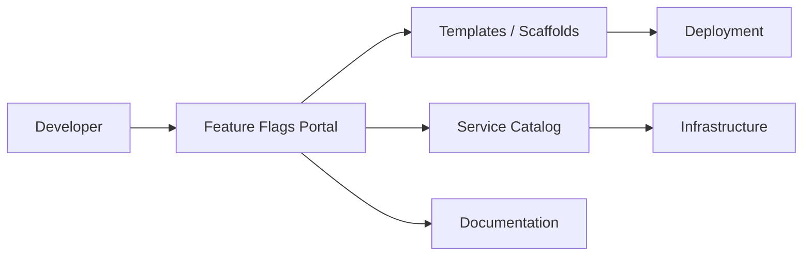

# Feature Flags — A 2-Day Crash Course

Feature flags decouple deployment from release — ship code to production dark, then enable it for specific users, gradually, without redeploying.

---

## Part 0 — Why Feature Flags Exist

Big-bang releases are risky. You spend weeks merging a feature branch, deploy everything at once, and if something breaks you either roll back the entire release or stay up all night hotfixing. Either way, you've coupled two things that don't need to be coupled: when code reaches production and when users see it.

Long-lived feature branches make this worse. The longer a branch lives, the more it diverges from main. Merge conflicts accumulate. Integration surprises compound. Teams that ship every day on one branch beat teams that merge once a month on five.

Feature flags solve this by letting you push code to production in a dormant state. The code is there — it just doesn't run for users yet. When you're ready, you flip a switch. If something goes wrong, you flip it back. No redeploy. No rollback. No paging the on-call engineer at 2 AM to revert a deployment.

The three problems flags address:

1. **Deployment risk** — separate "code is in production" from "feature is live"
2. **Branch longevity** — merge to main constantly, hide incomplete work behind flags
3. **Release control** — choose who sees a feature, when, and at what percentage

---

## Vocabulary

**Flag (Toggle)** — A named conditional in your code that controls whether a code path executes. At its simplest: `if featureEnabled("new-checkout") { ... }`.

**Variant** — The value a flag returns. Boolean flags return true/false. Multivariate flags return strings or JSON — useful for A/B tests where you want to compare three designs, not just two.

**Kill Switch** — A flag you flip to disable functionality during an incident. You build it in before you need it. When the payment processor starts returning 500s, you flip the switch and route users to a fallback. Kill switches should always default to the safe state.

**Percentage Rollout** — Enabling a flag for a random X% of users. The selection is deterministic per user — a user who sees 10% rollout today sees the same experience tomorrow, not a random flip each page load.

**User Targeting** — Enabling a flag for specific users, emails, or IDs. You use this for beta testers, internal users, or specific accounts before a general rollout.

**Segment** — A named group of users with shared attributes. "Enterprise accounts", "users in the EU", "mobile users on iOS 17+". You evaluate flags against segments to control exposure with more precision than percentage alone.

**Context** — The data you pass to the flag evaluation engine at runtime. Typically: user ID, email, plan tier, region, device type. The engine uses context to decide which variant to return.

**Technical Debt (Stale Flags)** — Flags that outlived their purpose. The code ships, rollout hits 100%, the flag stays in the codebase for two years. Stale flags make code harder to read, add evaluation overhead, and create confusion about what the "real" behavior is. Cleaning them up is unglamorous work that compounds into a serious mess if ignored.

**OpenFeature** — A CNCF standard that defines a vendor-neutral SDK interface for feature flag evaluation. You code against the OpenFeature API; a provider plugin connects it to whichever backend you're using (LaunchDarkly, Unleash, Flagsmith, etc.). Switching vendors becomes a config change, not a rewrite.

---




## DAY 1 — Concepts and Your First Flag

### Config vs Code

There are two ways to implement flags: hardcode them in config files or use a dedicated flag management platform.

**Config-based flags** look like environment variables or YAML entries. You set `ENABLE_NEW_DASHBOARD=true` in your deployment config. Simple to start, painful to scale — changing a flag value requires a deploy or a config reload, you have no audit trail, and you can't target by user.

```yaml
# flags.yaml — simple config approach
flags:
  new_dashboard: false
  new_checkout: true
  experimental_search: false
```

**Platform-based flags** give you a UI to toggle flags without touching code, targeting rules, percentage rollouts, audit logs, and SDKs that evaluate flags in milliseconds via a local cache. Use config-based flags for simple on/off infrastructure switches. Use a platform for anything user-facing.

### Flag Platforms — Brief Overview

**LaunchDarkly** is the market leader. Mature SDKs for every language, sub-millisecond evaluation via a streaming connection, strong targeting and experimentation features. Pricing scales with seats and Monthly Active Users. The right choice for teams that want a fully managed, production-hardened solution and can absorb the cost.

**Unleash** is open source, self-hostable, with a hosted cloud option. You get full control of your data. The SDK interface is clean and well-documented. Activation strategies cover percentage rollouts, user IDs, IPs, and custom implementations. Good choice if you need on-premises deployment or want to avoid per-MAU pricing.

**Flagsmith** is also open source and self-hostable. It adds remote configuration — storing non-boolean values against a flag — which makes it useful for feature configuration beyond simple toggles. Slightly simpler mental model than Unleash for teams new to flags.

All three have OpenFeature providers available.

### OpenFeature SDK — The Standard Interface

OpenFeature defines how your application code talks to a flag backend without coupling to it.

```typescript
import { OpenFeature } from '@openfeature/server-sdk';
import { LaunchDarklyProvider } from '@launchdarkly/openfeature-node-server';

// Wire up the provider once at startup
await OpenFeature.setProviderAndWait(
  new LaunchDarklyProvider(process.env.LD_SDK_KEY)
);

const client = OpenFeature.getClient();

// Evaluate a flag with context
const context = {
  targetingKey: user.id,
  email: user.email,
  plan: user.plan,
  region: user.region,
};

const showNewCheckout = await client.getBooleanValue(
  'new-checkout',
  false,   // default — safe fallback if the flag service is unreachable
  context
);

if (showNewCheckout) {
  return renderNewCheckout();
}
return renderLegacyCheckout();
```

The `default` parameter is your safety net. If the flag service is down, the SDK returns the default. Design defaults to be the safe, known-good state — not the experimental one.

### Your First Flag with Targeting

Start with an internal rollout. Create a flag named `new-checkout`. Set the default rule to `false`. Add a targeting rule: if `email` ends with `@yourcompany.com`, return `true`. Deploy. Every internal user sees the new checkout; external users see the old one.

Next week, add a segment: your beta program users. Toggle the flag to `true` for that segment. Now internal users and beta users see it. External users still don't. You've done a soft launch with zero additional deploys.

---

## DAY 2 — Progressive Rollouts, Incidents, and Lifecycle

### Progressive Rollouts

A percentage rollout lets you expose a feature to an increasing fraction of your user base while watching metrics at each stage. The canonical ladder:

```
1%  → verify no crashes, no error rate spike
10% → verify latency, watch conversion metrics
50% → compare A vs B, build statistical confidence
100% → full release, schedule flag cleanup
```

Each step is a deliberate decision, not an automatic progression. You pause at each threshold and look at your dashboards. If something degrades, you roll back to 0% — one click, no deploy.

The key implementation detail: percentage rollout must be sticky. Hash the user ID against the flag key. The same user always lands in the same bucket. If you randomize per-request, users get inconsistent experiences — the checkout button appears and disappears — and your metrics are corrupted.

```
bucket = hash(userId + flagKey) % 100
enabled = bucket < rolloutPercentage
```

### A/B Testing with Flags

When your flag has multiple variants, you can run a proper experiment. Instead of boolean true/false, you return string variants: `control`, `variant-a`, `variant-b`.

```typescript
const checkoutVariant = await client.getStringValue(
  'checkout-design',
  'control',
  context
);

// Log the variant assignment for analysis
analytics.track('checkout_variant_assigned', {
  userId: user.id,
  variant: checkoutVariant,
});
```

Assign users deterministically (same hash-based bucketing), log every assignment, and measure your success metrics — conversion rate, order value, error rate — split by variant. Don't end the experiment early because one variant looks good after two days. Run until you have statistical significance.

⚠️ A common mistake: changing the percentage or variant assignment mid-experiment corrupts the sample. Once an experiment starts, the assignment logic stays frozen until it ends.

### Kill Switches for Incidents

A kill switch is a flag you build before you need it. When you ship a new third-party integration, you add a kill switch at the same time.

```typescript
const useNewPaymentGateway = await client.getBooleanValue(
  'payment-gateway-v2',
  false,  // default OFF — safe state
  context
);

if (useNewPaymentGateway) {
  return processWithStripeV2(order);
}
return processWithStripeV1(order);
```

When Stripe V2 starts returning errors at 3 AM, your on-call engineer opens the flag dashboard and flips `payment-gateway-v2` to `false`. Traffic routes back to V1 in seconds. No hotfix branch, no deploy pipeline, no war room.

Kill switches should always default to the safe state — meaning the behavior that was working before the new code was introduced. Never default a kill switch to the new, experimental path.

### Flag Lifecycle Management

Every flag has a lifecycle. Treating it as permanent is how you accumulate stale flag debt.

**Creating** — Name it clearly. Use a namespace convention: `<team>-<feature>-<purpose>` (e.g., `checkout-new-payment-gateway-enabled`). Document the purpose, owner, and planned cleanup date in the flag description. Add a creation date.

**Active** — The flag is in use. Targeting rules are live. Someone owns it.

**Technical Debt** — The rollout hit 100% and has been stable for two weeks, but the flag is still in code. This is the dangerous phase. It looks harmless but it compounds. Set a cleanup task when you hit 100%.

**Cleanup** — Remove the flag from the platform and delete the conditional from the codebase. This is a real code change: remove the if/else, delete the dead branch, update tests. The code should read as if the flag never existed.

A practical policy: any flag older than 90 days that is at 100% rollout is scheduled for cleanup in the next sprint. No exceptions. The team that creates the flag owns the cleanup.

### Monitoring Flags

You should be able to answer these questions from your observability stack:

- Which variant did this user receive, and when?
- What percentage of requests evaluated this flag?
- Did error rates or latency change when I moved from 10% to 50%?
- Which flags have not been evaluated in the last 30 days?

Instrument flag evaluations as events. Log the flag name, variant returned, user ID, and timestamp. Feed these into your observability platform. Build a dashboard that overlays flag rollout percentages with your key service metrics. When you bump a rollout and see your p99 latency spike five minutes later, you want to see that correlation immediately.

Most flag platforms expose evaluation metrics natively. Use them, but also emit your own events — you want flag data correlated with your own business metrics, not just the flag platform's view.

### Flags in CI/CD

Flags give you a cleaner CI/CD story. Because you merge to main constantly, your pipeline always tests the combined codebase. You test both flag states in CI:

```yaml
# In your test suite, test both paths
describe('checkout', () => {
  it('renders legacy checkout when flag is off', async () => {
    mockFlag('new-checkout', false);
    // assertions...
  });

  it('renders new checkout when flag is on', async () => {
    mockFlag('new-checkout', true);
    // assertions...
  });
});
```

In your staging environment, run with all flags at 100%. In production, use actual rollout rules. This means staging exercises the full new code path even when production is at 1%.

Some teams wire flag changes into their deployment pipelines: a deploy kicks off an automated canary that bumps the rollout from 0% to 1% and watches error rates for 10 minutes before proceeding. This makes progressive rollout an automated safety check, not a manual step.

### Operational Flags — Circuit Breakers and Maintenance Mode

Flags are not just for feature releases. They are a general-purpose operational control plane.

**Circuit breaker flags** let you disable expensive or unreliable subsystems. If your recommendation engine is timing out and slowing down every page load, you flip `recommendation-engine-enabled` to false and render a static fallback. Users see slightly less personalization; they don't see a broken page.

**Maintenance mode** is a flag that routes all traffic to a maintenance page. You build it once and never want to use it — but when you're migrating a database and need a clean cutover window, it's the difference between a controlled pause and corrupted data.

**Degraded mode** flags let you shed load during traffic spikes. If your search cluster is at 95% CPU, you flip `search-fulltext-enabled` to false and return cached results or a simplified query. The site stays up; you trade functionality for availability.

---

## Worked Example — Rolling Out a New Payment Gateway

You're replacing your payment processor. The new gateway has better uptime and lower fees, but it's a high-risk change — payment failures directly cost revenue.

**Step 1: Build with a flag from day one.**
Create flag `payments-gateway-v2-enabled`, default `false`. Implement both code paths. The old gateway runs at 100% by default.

**Step 2: Internal testing.**
Add targeting rule: if `email` ends with `@yourcompany.com`, return `true`. Your team completes end-to-end payments on the new gateway. QA signs off.

**Step 3: 1% rollout.**
Set percentage rollout to 1%. Watch for 24 hours. Monitor: payment success rate, transaction latency, error logs. Compare against baseline. At 1%, a problem affects 1% of transactions — recoverable. At 100%, it's an incident.

**Step 4: Staged progression.**
10% for two days. 25% for two days. 50% for a week. At each stage: compare success rate between flag-on and flag-off cohorts. If they match, proceed. If flag-on shows degradation, roll back to 0% immediately.

**Step 5: 100% and cleanup.**
Full rollout. Monitor for one more week. If stable, schedule cleanup: remove the flag from the platform, delete the if/else from the payment service, remove the old gateway code, update tests. Done.

**If an incident fires at any point:**
Your on-call engineer flips `payments-gateway-v2-enabled` to `false`. All traffic routes back to the old gateway in under 30 seconds. You've bought time to investigate without a production incident burning.

---

## Pitfalls

**Defaulting to the experimental path.** If your flag defaults to the new behavior when the flag service is unreachable, a network hiccup forces all users onto untested code. Always default to the known-good state.

**Non-sticky percentage rollouts.** Hashing per-request instead of per-user creates flickering experiences and corrupts experiment data. Hash on a stable user identifier.

**Flag explosion.** No naming convention, no owners, no cleanup policy. Six months later you have 200 flags, half of them stale, and no one knows what they do. Enforce ownership and cleanup dates at creation time.

**Testing only the happy path.** If you only test with the flag on, you ship bugs into the flag-off code path. Test both variants in CI.

**Skipping the kill switch.** "We'll add a kill switch later." Later never comes, and you need it during the incident. Build kill switches before you ship.

**Leaking flag logic into tests.** Tests that call the real flag service introduce network dependencies into your test suite and make tests non-deterministic. Always mock flag evaluations in unit and integration tests.

**Changing experiment assignment mid-run.** Once you start an A/B test, the bucketing logic is frozen. Changing it mid-experiment invalidates the data. If you need to change it, end the experiment and start a new one.

---

## Quick Reference

```
# Flag rollout ladder
default: false   → production starts here (safe)
targeting: true  → internal users, beta segment
rollout: 1%      → first external exposure
rollout: 10%     → early signal
rollout: 50%     → A/B experiment territory
rollout: 100%    → full release, schedule cleanup

# OpenFeature evaluation (TypeScript)
const value = await client.getBooleanValue('flag-name', false, context);

# Sticky bucket formula
bucket = hash(userId + flagKey) % 100
enabled = bucket < rolloutPercentage

# Naming convention
<team>-<feature>-<purpose>
checkout-new-payment-gateway-enabled
search-ai-suggestions-enabled
billing-annual-pricing-v2-enabled

# Flag lifecycle milestones
created      → owner assigned, cleanup date set
active       → in rollout, monitored
100% stable  → cleanup sprint scheduled
cleaned up   → removed from platform and codebase

# Kill switch defaults
default: false   ← ALWAYS the safe, known-good state
```

---


## Top 10 Interview Questions

<details>
<summary><strong>Q: What is Feature Flags and what problem does it solve?</strong></summary>

Feature Flags addresses a specific need in modern engineering workflows. Understanding the core problem it solves — and the alternatives it replaced — is the foundation for every subsequent interview question. Frame your answer around the pain point first, then the solution.

</details>

<details>
<summary><strong>Q: How does Feature Flags compare to its main alternatives?</strong></summary>

Every tool exists in an ecosystem of alternatives. Be prepared to articulate the specific tradeoffs: when Feature Flags is the right choice, when an alternative is better, and what factors drive the decision (scale, team expertise, existing infrastructure, compliance requirements).

</details>

<details>
<summary><strong>Q: What are the most common production pitfalls with Feature Flags?</strong></summary>

Production experience is what separates senior from junior engineers. Common pitfalls include: misconfiguration that works in dev but fails at scale, security oversights, inadequate monitoring, and operational procedures that are untested until an incident occurs. Cite specific examples from your experience.

</details>

<details>
<summary><strong>Q: How do you monitor and observe Feature Flags in production?</strong></summary>

Key metrics to track, alerting thresholds to set, dashboards to build, and log patterns to watch. Production monitoring should cover: health/liveness, performance (latency, throughput), capacity (resource utilisation), and business impact (error rates affecting users). Explain which metrics are leading indicators versus lagging.

</details>

<details>
<summary><strong>Q: How do you scale Feature Flags as load increases?</strong></summary>

Scaling strategies depend on the bottleneck: horizontal scaling (add more instances), vertical scaling (bigger instances), caching (reduce load), sharding (distribute data), and async processing (decouple components). Explain which approach applies to Feature Flags and at what scale each strategy becomes necessary.

</details>

<details>
<summary><strong>Q: How do you handle security and access control with Feature Flags?</strong></summary>

Security is non-negotiable in production. Cover: authentication and authorization mechanisms, secrets management (never in code), encryption (at rest and in transit), network security (firewalls, private networks), audit logging, and compliance requirements relevant to your industry.

</details>

<details>
<summary><strong>Q: How do you implement disaster recovery for Feature Flags?</strong></summary>

DR planning requires defining RTO (recovery time objective) and RPO (recovery point objective), implementing backup strategies, testing restore procedures, and documenting runbooks. Explain your backup strategy, how you test restores, and what your recovery procedure looks like.

</details>

<details>
<summary><strong>Q: How do you automate Feature Flags deployment and configuration management?</strong></summary>

Infrastructure as code, CI/CD pipelines, configuration management, and GitOps workflows. Explain how you version, test, deploy, and roll back changes. Cover: what is automated, what requires manual approval, and how you handle configuration drift.

</details>

<details>
<summary><strong>Q: How do you troubleshoot issues with Feature Flags in production?</strong></summary>

A systematic debugging approach: check health endpoints, review recent changes (deploys, config changes), examine logs and metrics, reproduce the issue, identify root cause, fix, verify, and write a postmortem. Explain your actual debugging workflow with concrete examples.

</details>

<details>
<summary><strong>Q: What are the best practices for Feature Flags that you have learned from experience?</strong></summary>

Best practices that go beyond documentation: lessons learned from production incidents, configuration patterns that prevent common issues, testing strategies that catch bugs before production, and operational procedures that reduce toil. Share specific examples where following (or not following) a best practice had measurable impact.

</details>

---

## Next Steps

- `Argo-Rollouts.md` — progressive delivery at the infrastructure level; canary and blue/green deployments that complement flag-based releases
- `ArgoCD.md` — GitOps delivery pipeline; how flags fit into a continuous deployment workflow
- `SRE-Process.md` — incident management and how kill switches integrate with on-call runbooks

---

## Recommended learning resources

**YouTube channels & playlists:**
- [DevOps Toolkit (Viktor Farcic) — Feature Flags](https://www.youtube.com/@DevOpsToolkit) — progressive delivery, feature flag patterns, and integration with GitOps
- [LaunchDarkly — Feature Management](https://www.youtube.com/results?search_query=launchdarkly+feature+flags) — flag lifecycle, targeting rules, and kill switches in production
- [CNCF — Progressive Delivery](https://www.youtube.com/@cncf) — how feature flags combine with canary deployments and A/B testing in cloud-native stacks
- [Fireship — Feature Flags Explained](https://www.youtube.com/@Fireship) — fast visual introduction to why feature flags exist and how they work
- [Martin Fowler — Feature Toggles](https://www.youtube.com/results?search_query=martin+fowler+feature+toggles) — the conceptual framework: release, experiment, ops, and permission toggles

**Official docs & blogs:**
- [martinfowler.com — Feature Toggles](https://martinfowler.com/articles/feature-toggles.html) — the definitive article on toggle categories, lifecycle, and maintenance discipline
- [OpenFeature Specification](https://openfeature.dev/) — the vendor-neutral standard for feature flag evaluation, hooks, and provider integration

---

## The Mantra

> Ship dark. Target narrow. Roll out slowly. Kill fast. Clean up always.

That's the full discipline. Ship the code before users see it. Start with the smallest possible audience. Increase exposure in deliberate steps while watching metrics. When something breaks, flip the flag and buy time. When rollout is complete, remove the flag — do not let it fossilize in the codebase.

Feature flags are not magic. They are a discipline. The benefit comes from following the full lifecycle: dark launch, targeting, progressive rollout, monitoring, and cleanup. Skip any step and you either accept unnecessary risk or accumulate the technical debt that eventually makes the codebase harder to work in than big-bang releases ever were.

The teams that do this well treat flags as first-class artifacts: named carefully, owned explicitly, documented, monitored, and retired on schedule. The teams that do it poorly use flags as a crutch — toggling things in production to avoid hard decisions, never cleaning up, and ending up with a flag graveyard that nobody dares touch.

Build the discipline from the first flag.
