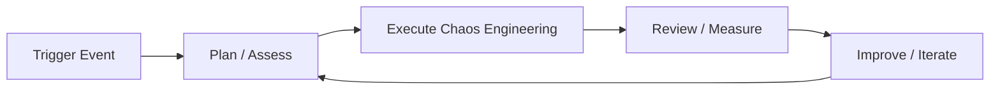

# Chaos Engineering — A 2-Day Crash Course

> **In one sentence:** Chaos engineering is the discipline of deliberately injecting failures into your systems to discover weaknesses before they become outages — you break things on purpose so they don't break by surprise.

Cross-references: [`Incident-Response.md`](./Incident-Response.md) · [`Postmortems-RCA.md`](./Postmortems-RCA.md) · [`Kubernetes.md`](../containers/Kubernetes.md) · [`Prometheus.md`](../observability/Prometheus.md) · [`Grafana.md`](../observability/Grafana.md)

---

## Part 0 — Why Chaos Engineering exists

Distributed systems fail in ways that nobody anticipated. A database replica lags at exactly the wrong moment. A DNS timeout cascades into a full service outage. A network partition causes two halves of your cluster to disagree on state. These failures are not theoretical — they happen in production, and they are almost never reproducible in staging.

The core problem: you cannot enumerate all failure modes in advance. Traditional testing tells you your code works under expected conditions. It tells you nothing about what happens when a dependency is slow, a disk fills up, or a pod disappears mid-request.

Confidence in a distributed system requires evidence, not assumptions. "We think it will be fine" is not a resilience strategy. The only way to know how your system behaves under failure is to cause that failure under controlled conditions and observe the result.

This is what chaos engineering solves. It gives you a structured, scientific method to probe your system's failure behavior before your users discover it first.

**Mental model:** Chaos engineering is a fire drill for your infrastructure — you don't wait for a real fire to find out the sprinklers don't work.

---




## Part 1 — The vocabulary

| Term | What it means |
|------|---------------|
| **Steady State** | A measurable baseline that defines "the system is working normally" — e.g., p99 latency < 200ms, error rate < 0.1%, successful order completions per minute > 500. You need this before you can detect a deviation. |
| **Hypothesis** | A falsifiable prediction: "When we kill one replica of the payments service, the checkout flow will continue to serve requests within SLO because we have three replicas and circuit breakers enabled." |
| **Blast Radius** | The scope of potential impact from an experiment — which services, which users, which environments are at risk. Controlling blast radius means limiting who can be hurt if the experiment reveals something worse than expected. |
| **Game Day** | A scheduled, collaborative event where a team deliberately introduces failures and works through them in real time — part experiment, part practice, part team-building. |
| **Chaos Experiment** | A single, scoped test: one hypothesis, one failure injection, one set of observations, one set of findings. Not a "let's break everything and see what happens." |
| **Abort Conditions** | Predefined tripwires — if the experiment causes X (e.g., error rate exceeds 5%, on-call is paged), you stop immediately and roll back. Non-negotiable. |
| **Litmus** | An open-source Kubernetes-native chaos engineering framework. Uses ChaosEngine and ChaosExperiment CRDs. Strong ecosystem of pre-built experiments. |
| **Chaos Mesh** | Another Kubernetes-native chaos platform with a broader experiment catalog and a web UI. Supports network chaos, IO chaos, time chaos, and more. |
| **Chaos Monkey** | The original Netflix tool — randomly terminates instances in production. The concept that started the field. Modern successors are more surgical. |
| **Resilience** | The ability of a system to absorb failures and return to steady state — not the absence of failures, but the capacity to tolerate them without user impact. |

---

## DAY 1 — Your first chaos experiment

The goal of Day 1 is to run one complete chaos experiment — hypothesis to findings — in a non-production environment. You will touch the scientific method, install tooling, and observe real system behavior under a controlled fault.

### 1. The scientific method for chaos

Every chaos experiment follows the same structure. Skipping steps is how experiments turn into incidents.

1. **Define steady state** — What does "working" look like? Pick one or two measurable signals: request success rate, latency percentile, queue depth. These become your pass/fail criteria. If you cannot measure steady state, you cannot run a chaos experiment.

2. **Form a hypothesis** — Write it as: "Given [system state], when [failure is injected], then [observable outcome] because [mechanism]." Be specific. "The system will be resilient" is not a hypothesis.

3. **Inject the failure** — Introduce the fault in the smallest possible scope. One pod. One node. One network path. Start with the least impactful experiment that tests your hypothesis.

4. **Observe** — Watch your dashboards. Does the system behave as hypothesized? Are there unexpected effects? Record everything — what happened, when, in what order.

5. **Learn and act** — If the hypothesis was confirmed, you have evidence of resilience. If it was not, you have found a real weakness. File a ticket. Do not paper over it. The finding is the value.

### 2. Starting small — your first two experiments

**Experiment A: Kill a pod.**
This is the "hello world" of chaos engineering. It tests whether your Kubernetes deployment handles pod eviction gracefully.

```bash
# Manually kill a pod and watch what happens
kubectl delete pod <pod-name> -n <namespace>

# Watch the deployment recover
kubectl get pods -n <namespace> -w
```

Before you do this: confirm your deployment has `replicas: 2` or more. Check that readiness probes are configured. Have a Grafana dashboard open showing request success rate. Then delete the pod and watch.

What you are looking for: does the success rate dip? Does it recover? How long does recovery take? Are there any retries that fail before the new pod is ready?

**Experiment B: Add network latency.**
This tests whether your services handle slow dependencies gracefully — timeouts, circuit breakers, retry logic.

Using Chaos Mesh, you can inject latency on a specific pod's network:

```yaml
apiVersion: chaos-mesh.org/v1alpha1
kind: NetworkChaos
metadata:
  name: add-latency-payments
  namespace: chaos-testing
spec:
  action: delay
  mode: one
  selector:
    namespaces:
      - production
    labelSelectors:
      app: payments-service
  delay:
    latency: "500ms"
    jitter: "100ms"
  duration: "2m"
```

Apply it, watch your dependent services in Grafana. Did timeouts fire? Did circuit breakers open? Did the UI show errors or degrade gracefully?

### 3. Installing Chaos Mesh on Kubernetes

Chaos Mesh is the easier starting point for most teams. It has a web UI and broad experiment support.

```bash
# Add the Chaos Mesh Helm repo
helm repo add chaos-mesh https://charts.chaos-mesh.org
helm repo update

# Create a dedicated namespace
kubectl create namespace chaos-testing

# Install Chaos Mesh
helm install chaos-mesh chaos-mesh/chaos-mesh \
  --namespace chaos-testing \
  --set controllerManager.replicaCount=1

# Verify installation
kubectl get pods -n chaos-testing
```

Access the dashboard:

```bash
kubectl port-forward -n chaos-testing svc/chaos-dashboard 2333:2333
# Open http://localhost:2333
```

### 4. Installing Litmus on Kubernetes

Litmus takes a CRD-first approach. Experiments are defined as Kubernetes resources, which makes them composable with GitOps workflows.

```bash
# Install LitmusChaos via kubectl
kubectl apply -f https://litmuschaos.github.io/litmus/litmus-operator-v3.0.0.yaml

# Verify CRDs are installed
kubectl get crds | grep litmus

# Install the chaos hub experiments
kubectl apply -f https://hub.litmuschaos.io/api/chaos/3.0.0?file=charts/generic/experiments.yaml \
  -n <your-app-namespace>
```

### 5. Observing experiments with Prometheus and Grafana

Chaos experiments without observability are just vandalism. Before injecting any fault, confirm you can answer these questions from your dashboards:

- What is the current request success rate for the service under test?
- What is p50/p95/p99 latency?
- Are there any alerts currently firing?

During the experiment, watch these metrics in real time. See [`Prometheus.md`](../observability/Prometheus.md) for query patterns and [`Grafana.md`](../observability/Grafana.md) for dashboard setup.

A minimal PromQL dashboard for chaos observation:

```promql
# Request success rate
rate(http_requests_total{status!~"5.."}[1m]) / rate(http_requests_total[1m])

# p99 latency
histogram_quantile(0.99, rate(http_request_duration_seconds_bucket[1m]))

# Error rate spike detection
rate(http_requests_total{status=~"5.."}[1m]) > 0.01
```

### 6. Running your first Chaos Mesh experiment end-to-end

```bash
# 1. Confirm steady state — check your dashboards first
# 2. Apply the experiment
kubectl apply -f network-latency-experiment.yaml

# 3. Watch it run
kubectl get networkchaos -n chaos-testing -w

# 4. Check experiment status
kubectl describe networkchaos add-latency-payments -n chaos-testing

# 5. Stop the experiment early if abort conditions trigger
kubectl delete networkchaos add-latency-payments -n chaos-testing
```

**By end of Day 1 you can:**
- Explain the five-step chaos experiment process
- Define a measurable steady state for a service
- Write a hypothesis with falsifiable predictions
- Kill a pod and observe recovery behavior
- Inject network latency using Chaos Mesh
- Read Prometheus metrics and Grafana dashboards during an active fault

---

## DAY 2 — Make it real

Day 2 moves from controlled experiments in isolation to structured game days, automated chaos in CI/CD, and experiments that stress the harder failure modes — partitions, disk pressure, DNS failures. You also build the practices that make chaos engineering sustainable.

### 1. Running a game day

A game day is not an ad-hoc "let's break things" session. It is a planned event with defined roles, clear communication, and documented outcomes. Done well, it builds team confidence and surfaces systemic weaknesses. Done poorly, it causes real outages and destroys trust in the practice.

**Before the game day:**
- Write the experiment plan — hypotheses, fault types, blast radius, abort conditions — and share it with all stakeholders.
- Schedule it during a low-traffic window. Not during a deploy freeze. Not on Fridays.
- Notify your on-call engineer, your incident response team, and any downstream teams whose services you will affect.
- Confirm your rollback procedure for every experiment. If you cannot roll back in under two minutes, do not run that experiment yet.
- Pre-provision a Grafana dashboard that shows all relevant signals in one view.

**Roles:**
- **Game Day Lead** — owns the experiment plan, calls start/stop, makes abort decisions.
- **Chaos Operator** — applies and removes fault injections on command.
- **Observer** — watches dashboards and calls out anomalies.
- **Scribe** — documents what happened, when, and what was learned. This feeds directly into your postmortem format — see [`Postmortems-RCA.md`](./Postmortems-RCA.md).

**During the game day:**
- Run one experiment at a time. Never overlap experiments — you cannot attribute findings to a specific cause if two faults are active simultaneously.
- Verbalize observations aloud. The Scribe captures them.
- If an abort condition triggers, the Game Day Lead calls stop. The Chaos Operator deletes the fault resource immediately. No debate.

**After the game day:**
- Hold a 30-minute retrospective while it is fresh.
- Document every finding as a ticket with priority and owner.
- Findings with no ticket get fixed by nobody. The Scribe's notes are not a substitute for actionable follow-up.

### 2. Blast radius control

Controlling blast radius is the difference between a chaos experiment and an incident. The principle: start with the minimum scope that can test your hypothesis, then expand only after the smaller scope confirms the hypothesis.

Blast radius levers:
- **Namespace scope** — run experiments in a dedicated `chaos-testing` namespace before touching production namespaces.
- **Pod selector** — target a single pod or a specific label subset, not all instances.
- **Percentage-based fault** — inject faults on 10% of traffic before 100%.
- **Duration** — keep experiment duration short (2–5 minutes) for initial runs. Extend only after the system behaves as expected.
- **Time of day** — off-peak hours mean fewer users affected if something goes wrong.

```yaml
# Chaos Mesh: target only 10% of pods with a specific label
spec:
  mode: fixed-percent
  value: "10"
  selector:
    labelSelectors:
      app: order-service
      env: production
```

### 3. Abort conditions — non-negotiable

Define abort conditions before every experiment. Write them in the experiment document. Share them with the team.

Example abort conditions:
- Error rate for the target service exceeds 1% (steady state is < 0.1%)
- Any unrelated service enters an error state
- On-call engineer is paged for any reason
- Experiment duration exceeds the planned window without explicit extension approval
- Any data loss or data corruption is detected

If an abort condition triggers, stop immediately. Do not try to "see what happens next." The investigation happens after rollback, not during.

```bash
# Emergency abort — delete all chaos resources in a namespace
kubectl delete networkchaos,podchaos,iochaos,stresschaos --all -n chaos-testing
```

### 4. Chaos in CI/CD

Automating chaos experiments in CI/CD pipelines gives you continuous confidence that recent changes have not degraded resilience. The pattern: run a lightweight chaos suite in a staging environment as part of your deployment pipeline.

⚠️ Never run automated chaos experiments directly in production pipelines without extensive blast radius controls and manual approval gates.

```yaml
# GitHub Actions example — chaos validation stage
chaos-validation:
  needs: deploy-staging
  runs-on: ubuntu-latest
  steps:
    - name: Run pod kill experiment
      run: |
        kubectl apply -f chaos/pod-kill-experiment.yaml
        sleep 120
        kubectl get chaosresult pod-kill-result -o jsonpath='{.status.experimentStatus.verdict}'
    - name: Assert steady state
      run: |
        ./scripts/assert-steady-state.sh --max-error-rate 0.01 --duration 60
    - name: Cleanup
      if: always()
      run: kubectl delete -f chaos/pod-kill-experiment.yaml
```

Litmus integrates well with CI pipelines through its `ChaosEngine` resource and result CRD — you can query `ChaosResult` for pass/fail verdicts.

### 5. Advanced experiments

Once pod kills and network latency are routine, these experiments test deeper resilience properties.

**Network partition:**
Simulates a split-brain scenario. Tests whether your services handle total loss of connectivity to a dependency.

```yaml
apiVersion: chaos-mesh.org/v1alpha1
kind: NetworkChaos
metadata:
  name: partition-db-access
spec:
  action: partition
  mode: all
  selector:
    labelSelectors:
      app: api-service
  direction: to
  target:
    mode: all
    selector:
      labelSelectors:
        app: postgres
  duration: "1m"
```

**DNS failure:**
Tests whether services fail gracefully when DNS resolution is unavailable — a common failure mode during certain infrastructure events.

```yaml
apiVersion: chaos-mesh.org/v1alpha1
kind: DNSChaos
metadata:
  name: dns-failure-test
spec:
  action: error
  mode: one
  selector:
    labelSelectors:
      app: api-service
  duration: "90s"
```

**Disk pressure / IO chaos:**
Tests behavior under disk saturation — slow writes, high latency IO, disk fill. Particularly relevant for stateful services.

```yaml
apiVersion: chaos-mesh.org/v1alpha1
kind: IOChaos
metadata:
  name: io-latency-test
spec:
  action: latency
  mode: one
  selector:
    labelSelectors:
      app: postgres
  volumePath: /var/lib/postgresql/data
  delay: "100ms"
  percent: 50
  duration: "2m"
```

**CPU stress:**
Tests autoscaling behavior and whether services degrade gracefully when compute-starved.

```yaml
apiVersion: chaos-mesh.org/v1alpha1
kind: StressChaos
metadata:
  name: cpu-stress-test
spec:
  mode: one
  selector:
    labelSelectors:
      app: compute-service
  stressors:
    cpu:
      workers: 2
      load: 80
  duration: "3m"
```

### 6. Chaos for stateful systems

Stateless services are easier to chaos test — kill a pod, a new one replaces it. Stateful systems require more care.

For databases: test failover, not failure. Your experiment should be "the primary fails over to the replica" — not "the primary dies with no replica." Confirm replication lag before starting. Confirm the application handles the brief connection reset during failover.

For queues: test consumer failure and message redelivery. Kill a consumer pod while messages are in flight. Confirm messages are not lost. Confirm no duplicates are processed if your consumers are not idempotent.

For caches: test cache miss behavior. Flush the cache or partition the cache service. Confirm the application falls back to the database gracefully without overwhelming it.

⚠️ Always take a database backup or snapshot before running chaos experiments against stateful services in any environment that holds real data.

### 7. Building a chaos culture

Tooling is the easy part. Getting an organization to embrace deliberate failure injection is the hard part.

Start with a win. Find a service where you are confident the system is resilient, run an experiment that confirms it, and share the result. "We killed a pod in the payments service and checkout never missed a beat" is more convincing than any theoretical argument for chaos engineering.

Connect chaos findings directly to incident prevention. Every time a chaos experiment finds a real weakness, track it. When that weakness would have caused a production incident, that is your ROI story.

Normalize failure. Treat a hypothesis that fails (the system did not behave as expected) as a success — you found a real problem in a controlled environment. The embarrassing outcome is an undetected weakness, not a hypothesis disconfirmation.

See [`Incident-Response.md`](./Incident-Response.md) for how chaos findings feed into on-call preparedness.

---

## Worked example — Game day: what happens when the database fails over?

**Service under test:** Order processing service backed by a PostgreSQL primary/replica setup.

**Steady state:**
- Order creation success rate: > 99.5%
- p99 latency for `POST /orders`: < 300ms
- No errors in the `order-service` pod logs
- Replication lag: < 100ms

**Hypothesis:** When the PostgreSQL primary is killed, the replica is promoted within 30 seconds, the order service reconnects automatically, and success rate does not drop below 95% during the transition window.

**Injection:**

```bash
# Identify the primary pod
kubectl get pods -n database -l role=primary

# Kill the primary — this triggers automatic failover via patroni/pg_auto_failover
kubectl delete pod postgres-primary-0 -n database

# Watch failover
kubectl get pods -n database -w
```

**Observation (Grafana dashboard during the 3-minute window):**
- T+0s: Primary pod deleted, replica promotion begins.
- T+8s: Order service starts returning 500s — connection pool exhausted.
- T+22s: Replica promoted, DNS record updated.
- T+31s: Order service reconnects. Success rate recovers.
- T+31s to T+45s: Success rate climbs from 68% back to 99.7%.
- Peak error rate during transition: 32%.

**Findings:**
1. The 32% error rate during failover violates the SLO (< 5% error budget). The hypothesis was disconfirmed.
2. The order service connection pool has no retry-on-failover logic — it fails hard until the pool is recycled.
3. The application does not distinguish between a transient connection error (retriable) and a query error (not retriable).
4. Failover took 22 seconds — within expected range for pg_auto_failover.

**Action items:**
- P1: Implement connection retry with exponential backoff on `FATAL: terminating connection due to administrator command` errors.
- P2: Add a health-check endpoint that verifies database connectivity and use it in the Kubernetes readiness probe during failover windows.
- P3: Set up an alerting rule for failover events so on-call knows to watch the order service. See [`Incident-Response.md`](./Incident-Response.md).
- P4: Re-run this experiment after the retry logic is deployed to confirm the fix.

---

## Common pitfalls

- **No steady state defined before the experiment.** You have nothing to compare against. You cannot tell whether the system is degraded unless you know what normal looks like. Define and document steady state before you touch anything.

- **Running chaos in production before proving it in staging.** The blast radius of a misconfigured chaos experiment in production can be enormous. Always validate the experiment in a non-production environment first.

- **Experiments with no abort conditions.** You will eventually hit a scenario where the fault cascades further than expected. Without predefined abort conditions, you debate while users suffer. Write the conditions before you start.

- **Findings that never become tickets.** The experiment found a real weakness. Someone wrote it in a doc. Six months later, the weakness causes a real outage. The chaos experiment was useless unless findings are tracked and acted on.

- **Overlapping experiments.** Two faults active at the same time means you cannot attribute any observation to a specific cause. You are no longer doing science. Run one experiment at a time.

- **Skipping the hypothesis.** "Let's just see what happens" is not chaos engineering — it's chaos. The hypothesis forces you to reason about your system before you inject the fault, which is where much of the learning happens.

- **Chaos experiments without observability.** If you cannot see what is happening during the experiment, you are blind. Set up your dashboards before the experiment window, not during.

- **Targeting only the services you're confident about.** The services you are most nervous about testing are usually the ones that most need to be tested.

- **Treating a confirmed hypothesis as uninteresting.** A confirmed hypothesis is evidence of resilience. Document it. That evidence is valuable when stakeholders ask "how do we know the system is reliable?"

---

## Quick reference

### Chaos Mesh CRDs

| CRD | Purpose |
|-----|---------|
| `NetworkChaos` | Latency, packet loss, partition, bandwidth limit, DNS failure |
| `PodChaos` | Pod kill, pod failure, container kill |
| `IOChaos` | IO latency, IO error, IO attribute override |
| `StressChaos` | CPU stress, memory stress |
| `DNSChaos` | DNS error, DNS randomness |
| `TimeChaos` | Clock skew on target pods |
| `HTTPChaos` | HTTP request/response fault injection |
| `KernelChaos` | Linux kernel-level fault injection |

### Litmus experiments (commonly used)

```bash
# List available experiments
kubectl get chaosexperiments -n <namespace>

# Common experiment names
pod-delete
pod-cpu-hog
pod-memory-hog
node-cpu-hog
node-memory-hog
pod-network-latency
pod-network-loss
pod-network-corruption
disk-fill
node-drain
```

### kubectl chaos commands

```bash
# List all active chaos experiments (Chaos Mesh)
kubectl get networkchaos,podchaos,iochaos,stresschaos,dnschaos -A

# Check experiment status
kubectl describe networkchaos <name> -n <namespace>

# Get Litmus chaos result
kubectl get chaosresult -n <namespace>
kubectl describe chaosresult <engine-name>-<experiment-name> -n <namespace>

# Emergency cleanup — remove all Chaos Mesh experiments
kubectl delete networkchaos,podchaos,iochaos,stresschaos,dnschaos,timechaos --all -n <namespace>

# Watch pod recovery after kill
kubectl get pods -n <namespace> -w

# Check events during an experiment
kubectl get events -n <namespace> --sort-by=.lastTimestamp | tail -20
```

### Game day checklist template

```
GAME DAY CHECKLIST
==================
Date/Time:
Service under test:
Game Day Lead:
Chaos Operator:
Observer:
Scribe:

PRE-EXPERIMENT
[ ] Steady state defined and documented
[ ] Hypothesis written
[ ] Blast radius scoped
[ ] Abort conditions defined and shared
[ ] Stakeholders notified
[ ] Rollback procedure confirmed (< 2 min)
[ ] Grafana dashboard open and showing green
[ ] On-call engineer aware

DURING EXPERIMENT
[ ] One experiment at a time
[ ] Scribe capturing timestamps and observations
[ ] Observer watching for abort conditions
[ ] Chaos Operator ready to delete fault resource immediately

POST-EXPERIMENT
[ ] Fault removed / experiment cleaned up
[ ] Steady state confirmed recovered
[ ] Findings documented
[ ] Action items filed as tickets with owners
[ ] Retrospective scheduled
```

---


## Top 10 Interview Questions

<details>
<summary><strong>Q: What is Chaos Engineering and what problem does it solve?</strong></summary>

Chaos Engineering addresses a specific need in modern engineering workflows. Understanding the core problem it solves — and the alternatives it replaced — is the foundation for every subsequent interview question. Frame your answer around the pain point first, then the solution.

</details>

<details>
<summary><strong>Q: How does Chaos Engineering compare to its main alternatives?</strong></summary>

Every tool exists in an ecosystem of alternatives. Be prepared to articulate the specific tradeoffs: when Chaos Engineering is the right choice, when an alternative is better, and what factors drive the decision (scale, team expertise, existing infrastructure, compliance requirements).

</details>

<details>
<summary><strong>Q: What are the most common production pitfalls with Chaos Engineering?</strong></summary>

Production experience is what separates senior from junior engineers. Common pitfalls include: misconfiguration that works in dev but fails at scale, security oversights, inadequate monitoring, and operational procedures that are untested until an incident occurs. Cite specific examples from your experience.

</details>

<details>
<summary><strong>Q: How do you monitor and observe Chaos Engineering in production?</strong></summary>

Key metrics to track, alerting thresholds to set, dashboards to build, and log patterns to watch. Production monitoring should cover: health/liveness, performance (latency, throughput), capacity (resource utilisation), and business impact (error rates affecting users). Explain which metrics are leading indicators versus lagging.

</details>

<details>
<summary><strong>Q: How do you scale Chaos Engineering as load increases?</strong></summary>

Scaling strategies depend on the bottleneck: horizontal scaling (add more instances), vertical scaling (bigger instances), caching (reduce load), sharding (distribute data), and async processing (decouple components). Explain which approach applies to Chaos Engineering and at what scale each strategy becomes necessary.

</details>

<details>
<summary><strong>Q: How do you handle security and access control with Chaos Engineering?</strong></summary>

Security is non-negotiable in production. Cover: authentication and authorization mechanisms, secrets management (never in code), encryption (at rest and in transit), network security (firewalls, private networks), audit logging, and compliance requirements relevant to your industry.

</details>

<details>
<summary><strong>Q: How do you implement disaster recovery for Chaos Engineering?</strong></summary>

DR planning requires defining RTO (recovery time objective) and RPO (recovery point objective), implementing backup strategies, testing restore procedures, and documenting runbooks. Explain your backup strategy, how you test restores, and what your recovery procedure looks like.

</details>

<details>
<summary><strong>Q: How do you automate Chaos Engineering deployment and configuration management?</strong></summary>

Infrastructure as code, CI/CD pipelines, configuration management, and GitOps workflows. Explain how you version, test, deploy, and roll back changes. Cover: what is automated, what requires manual approval, and how you handle configuration drift.

</details>

<details>
<summary><strong>Q: How do you troubleshoot issues with Chaos Engineering in production?</strong></summary>

A systematic debugging approach: check health endpoints, review recent changes (deploys, config changes), examine logs and metrics, reproduce the issue, identify root cause, fix, verify, and write a postmortem. Explain your actual debugging workflow with concrete examples.

</details>

<details>
<summary><strong>Q: What are the best practices for Chaos Engineering that you have learned from experience?</strong></summary>

Best practices that go beyond documentation: lessons learned from production incidents, configuration patterns that prevent common issues, testing strategies that catch bugs before production, and operational procedures that reduce toil. Share specific examples where following (or not following) a best practice had measurable impact.

</details>

---

## Next steps after Day 2

- [`Incident-Response.md`](./Incident-Response.md) — connect chaos findings to on-call runbooks and incident handling procedures
- [`Postmortems-RCA.md`](./Postmortems-RCA.md) — use postmortem data to identify which failure modes deserve chaos experiments
- [`Kubernetes.md`](../containers/Kubernetes.md) — deeper understanding of pod scheduling, disruption budgets, and resource limits that affect chaos experiment design
- [`Prometheus.md`](../observability/Prometheus.md) — build the alerting and recording rules that serve as your steady-state monitoring layer
- [`Grafana.md`](../observability/Grafana.md) — build dashboards optimized for chaos experiment observation

---

## Recommended learning resources

**YouTube channels & playlists:**
- [Gremlin — Chaos Engineering](https://www.youtube.com/@GremlinInc) — game day planning, failure injection patterns, and building reliability confidence
- [USENIX SREcon — Chaos Engineering Talks](https://www.youtube.com/results?search_query=usenix+srecon+chaos+engineering) — practitioner experiences with chaos experiments at scale
- [Netflix Technology Blog — Chaos Talks](https://www.youtube.com/results?search_query=netflix+chaos+engineering+simian+army) — the origin of chaos engineering: Chaos Monkey, Simian Army, and fault injection at Netflix
- [Google SRE — DiRT (Disaster Recovery Testing)](https://www.youtube.com/results?search_query=google+SRE+disaster+recovery+testing+DiRT) — Google's approach to large-scale failure drills
- [DevOps Enterprise Summit — Resilience](https://www.youtube.com/results?search_query=devops+enterprise+summit+resilience+chaos) — organisational adoption of chaos practices

**Official docs & blogs:**
- [principlesofchaos.org](https://principlesofchaos.org/) — the foundational principles of chaos engineering, co-authored by Netflix engineers
- [Gremlin Blog — Chaos Engineering](https://www.gremlin.com/blog/) — tutorials, case studies, and best practices for running chaos experiments safely

---

**The mantra:** Break it in a drill so it doesn't break in production.
