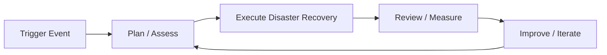

# Disaster Recovery — A 2-Day Crash Course

> DR is the insurance policy you test quarterly; if you have never run a drill, you do not have a DR plan — you have a document.

---

## Part 0 — Why Disaster Recovery Matters

Every system fails eventually. A database gets corrupted. A cloud region goes dark. A botched deployment cascades into a full outage. Disaster Recovery (DR) is the discipline of deciding — in advance, with automation — how fast you come back and how much data you can afford to lose.

Two numbers govern that decision:

- **RPO (Recovery Point Objective)** — the maximum age of data you can lose. An RPO of one hour means you accept losing up to sixty minutes of transactions.
- **RTO (Recovery Time Objective)** — the maximum time the system can be down. An RTO of four hours means customers see an outage no longer than four hours.

Both are business decisions, not engineering ones. Engineering makes them achievable.

Without a tested DR plan:
- You learn your backup is unrestorable during the incident.
- Your runbooks reference servers that were decommissioned eight months ago.
- Your team improvises under pressure and makes a bad situation worse.

DR planning forces you to think through failure before it happens. That is the only time you can do it cheaply.

---




## Part 1 — Vocabulary

**RTO** — Recovery Time Objective. How long the system can be unavailable. Drives architecture choices (active-active vs. warm standby).

**RPO** — Recovery Point Objective. How much data loss is tolerable. Drives backup frequency and replication strategy.

**Failover** — Switching traffic from a failed primary system to a standby. Can be manual (someone runs a script) or automated (health checks trigger it).

**Failback** — Returning traffic to the original primary after it is restored. Often overlooked in planning. Failback is itself a risky operation.

**Hot Standby** — A replica running in sync, ready to accept traffic in seconds. Expensive. Required for sub-minute RTO.

**Warm Standby** — A replica running but at reduced capacity. Takes minutes to scale up and accept traffic. Good balance of cost vs. availability.

**Cold Standby** — Infrastructure defined in IaC but not running. Provisioned on demand during a disaster. Cheapest option; slowest recovery (minutes to hours).

**Active-Active** — Multiple sites handle production traffic simultaneously. A failure reduces capacity but does not cause downtime. Requires conflict-free data replication or strict partitioning.

**Active-Passive** — One site handles all production traffic; the other is on standby. Simpler to operate. Failover introduces a brief outage window.

**BCP (Business Continuity Plan)** — The broader plan for keeping business operations running through a disaster. DR is a subset of BCP focused on IT systems.

**Blast Radius** — The scope of impact when a component fails. Designing for small blast radius means failures stay contained. A single-region active-passive setup has a large blast radius — one region failure takes everything down.

---

## Day 1 — Foundations

### 1.1 RTO/RPO Analysis

Start by mapping every service to a tier. A typical tiering looks like this:

| Tier | Example | RTO | RPO |
|------|---------|-----|-----|
| 0 — Critical | Payment processing, auth | < 15 min | < 1 min |
| 1 — Important | Order management, notifications | < 1 hr | < 5 min |
| 2 — Standard | Reporting, analytics | < 4 hr | < 1 hr |
| 3 — Low | Internal tools, batch jobs | < 24 hr | < 24 hr |

Work with the business to assign tiers. Engineers consistently overestimate how critical their service is. Product and finance overestimate it in the other direction. Resolve disagreements with cost data — hot standby is expensive, so someone has to sign off on the bill.

Once you have tiers, the tier drives the architecture. You cannot achieve a 15-minute RTO with a cold standby and a manual runbook. You cannot justify active-active for a reporting dashboard.

### 1.2 Backup Strategies

**Full backup** — A complete snapshot of all data. Simple to restore. Expensive in time and storage. Usually weekly.

**Incremental backup** — Only changes since the last backup. Fast and small. Restoration requires replaying a chain of backups from the last full snapshot forward. Longer restore time.

**Differential backup** — Changes since the last full backup. Larger than incremental, smaller than full. Faster restore than incremental because you only need two pieces: the last full and the latest differential.

**Continuous backup / PITR (Point-In-Time Recovery)** — Streaming WAL logs (Postgres) or change data capture to a backup store. Lets you restore to any second in the past. Required for RPO under five minutes.

Key rules:
- Test restores regularly. A backup you have never restored is a backup you cannot trust.
- Store backups in a separate account, region, or provider from production. A compromised production account must not be able to delete your backups.
- Encrypt backups at rest and in transit. Verify the encryption key is also backed up and accessible during a disaster.
- Document and automate the restore procedure. A restore under pressure from memory is a restore that goes wrong.

### 1.3 Replication Patterns

**Synchronous replication** — The write is not acknowledged until it has been committed on both primary and replica. Zero data loss. Adds latency to every write. Practical only when replicas are close (same datacenter or same region).

**Asynchronous replication** — The write is acknowledged after the primary commits. The replica catches up in the background. Introduces replication lag — a measure of your actual RPO at any given moment. Monitor lag continuously.

**Log shipping** — WAL segments or binary logs are shipped to a standby on a schedule. Simple. Standby may be minutes or hours behind. Acceptable for Tier 2 and 3 workloads.

**Change Data Capture (CDC)** — Tools like Debezium stream row-level changes from the database transaction log to a message bus (Kafka) and from there to replicas or data stores. Flexible. Supports fan-out to multiple consumers.

**Object storage replication** — S3 Cross-Region Replication, GCS replication, or Azure Blob replication copies objects asynchronously to another region. Turn on versioning. Set lifecycle rules to prevent accidental purges from cascading.

### 1.4 DR Architectures

**Backup and Restore** — Periodic backups to durable storage. Restore from scratch on failure. Cheapest. RTO measured in hours. Appropriate for non-critical workloads.

**Pilot Light** — Core infrastructure (database) runs continuously in DR region at minimum size. Application tier is defined in IaC and launched on demand. RTO measured in tens of minutes.

**Warm Standby** — A scaled-down but fully functional copy of production runs in DR region. Traffic is redirected via DNS or load balancer on failover. RTO measured in minutes. Scale-up adds a few more minutes.

**Multi-Site Active-Active** — Production traffic runs across multiple regions simultaneously. Requires careful data consistency management. Near-zero RTO and RPO. Highest cost and operational complexity.

Choose the architecture that matches your RTO/RPO tier. Do not over-engineer. A reporting service does not need active-active. A payment gateway probably does.

---

## Day 2 — Operations

### 2.1 DR Drills

A drill is the only way to know your plan works. Schedule one per quarter minimum. Treat it like a real incident.

**Types of drills:**

- **Tabletop exercise** — Walk through the DR scenario verbally with all stakeholders. No systems are touched. Low cost. Good for identifying gaps in communication and ownership.
- **Failover test** — Actually failover a non-production environment to DR. Validate the procedure, measure actual RTO, check for data consistency.
- **Full DR test** — Failover production. Reserved for systems where you have high confidence and business sign-off. Some regulated industries require this annually.

**What to measure during a drill:**
- Time to detect the failure
- Time to declare a disaster and initiate failover
- Time to complete failover (actual RTO)
- Data loss at the point of failover (actual RPO)
- Issues encountered that were not in the runbook

Document everything. Update the runbook immediately after. Every drill should make the next drill faster.

### 2.2 Automated Failover

Manual failover is slow and error-prone. Automate as much as you can.

**Health checks and circuit breakers** — Route 53 health checks, GCP Health Checks, or Azure Traffic Manager monitor your primary endpoint. On failure, they redirect DNS to DR. DNS TTL must be low (60 seconds or less) for this to be effective.

**Database failover** — Amazon RDS Multi-AZ handles failover automatically in 60–120 seconds. Aurora Global Database promotes a secondary region in under a minute. Postgres Patroni performs leader election automatically. Whatever you use, test it — the automatic failover is only reliable if you have tested it.

**Service mesh and traffic shifting** — Tools like Istio or AWS App Mesh let you shift traffic percentages between regions. Use this for gradual failover rather than a binary cut.

⚠️ Automated failover can make a bad situation worse if your health checks are poorly tuned. A flapping health check that triggers failover on a transient blip causes unnecessary downtime. Test your thresholds.

### 2.3 IaC for DR

If your DR environment is not defined in code, it is not repeatable.

Use Terraform or Pulumi to define your DR infrastructure as a separate workspace or stack. Keep it in the same repository as production. Run `terraform plan` against it in CI on every merge to main so drift is detected early.

Key practices:
- Parameterize region as a variable. DR should be identical to production except for region and capacity.
- Use modules. The same VPC, EKS, and RDS modules should deploy both environments.
- Store state remotely with locking. Terraform Cloud, S3 + DynamoDB, or similar.
- Test provisioning from scratch in a non-production environment regularly. "IaC that has never been applied in isolation" often has hidden dependencies.

Avoid snowflake DR environments — ones that have been hand-patched over time and diverged from production. If you cannot tear down and rebuild your DR environment in under an hour from IaC, you have snowflake DR.

### 2.4 Database DR

Databases are the hardest part of DR because they hold state.

**Postgres** — Use streaming replication for synchronous replicas in the same region. Use WAL-G or pgBackRest for cross-region continuous backup with PITR. Patroni or repmgr for automated failover.

**MySQL / MariaDB** — Group Replication or ProxySQL for HA. Percona XtraBackup for consistent hot backups.

**MongoDB** — Replica sets provide automatic failover within a cluster. Atlas Global Clusters for cross-region active-active.

**Redis** — Redis Sentinel for automated failover. Redis Cluster for sharding and partial availability. For DR, treat Redis as ephemeral unless you have specifically enabled persistence and tested restore.

**Managed services** — RDS, Aurora, Cloud SQL, and Azure Database for PostgreSQL handle replication and failover for you. Use them unless you have a specific reason not to. The operational overhead of self-managed database HA is significant.

Whatever database you use: know your actual replication lag, know how to promote a replica, and have tested a restore from backup in the last 30 days.

### 2.5 Kubernetes DR with Velero

Velero is the standard tool for Kubernetes DR. It backs up cluster resources and persistent volumes to object storage.

**Install and configure:**
```bash
velero install \
  --provider aws \
  --plugins velero/velero-plugin-for-aws:v1.8.0 \
  --bucket my-velero-backups \
  --backup-location-config region=us-east-1 \
  --snapshot-location-config region=us-east-1 \
  --secret-file ./credentials-velero
```

**Schedule a daily backup:**
```bash
velero schedule create daily-backup \
  --schedule="0 2 * * *" \
  --ttl 720h
```

**Restore to a DR cluster:**
```bash
velero restore create --from-backup daily-backup-20260530120000
```

Key considerations:
- Back up all namespaces or use label selectors to target specific workloads.
- Persistent volume snapshots require CSI driver support. Verify your storage class supports them.
- Velero does not back up secrets by default if you use Sealed Secrets or External Secrets Operator — back up the encryption keys separately.
- Test restores. A Velero backup that has never been restored is not a DR solution.

### 2.6 Cloud Multi-Region DR

**AWS** — Use Route 53 health checks with failover routing policies. Aurora Global Database for databases. S3 Cross-Region Replication for object storage. Consider AWS Backup for centralized backup management across services.

**GCP** — Cloud DNS with geolocation or failover routing. Cloud Spanner or AlloyDB for multi-region databases. Storage Transfer Service for cross-region object replication.

**Azure** — Azure Traffic Manager for DNS-level failover. Azure Site Recovery for VM-level replication. Geo-redundant storage (GRS) for blob storage.

**Multi-cloud DR** — Rare but relevant for organizations that require independence from a single provider. Use a neutral data layer (object storage or managed Kafka) as the replication medium. Terraform makes this feasible, but operational complexity is high. Only pursue multi-cloud DR if single-provider risk is a documented business requirement.

### 2.7 BFSI Regulatory Considerations

Banking, Financial Services, and Insurance (BFSI) workloads carry specific regulatory requirements for DR:

**RBI (India)** — Circular on IT and Cyber Security Framework requires banks to maintain a near-site DR and a remote DR site. Annual DR drills are mandatory. Data must not leave the country unless approved.

**SEBI** — Regulated entities must have a Business Continuity Plan. IT systems supporting trading must have RTO of two hours and RPO of 30 minutes at minimum.

**PCI-DSS** — Requirement 12.10 requires an incident response plan. DR falls under this. Backup media must be physically secured and tested.

**SOC 2** — Availability trust service criterion requires demonstrated backup and recovery procedures. Auditors will ask for evidence of tested restores.

**General BFSI principles:**
- DR documentation must be reviewed and approved by a named executive annually.
- Every drill must produce a written report. Store it for audit.
- Data residency constraints affect where your DR region can be located.
- Engage your compliance team before choosing a DR architecture. Discovering a constraint after deployment is expensive.

---

## Worked Example — DR Drill for a Payment Platform

**Context:** A payment processing service. Tier 0. RTO: 15 minutes. RPO: 1 minute. Active-passive, primary in `us-east-1`, DR in `us-west-2`. Aurora Global Database. EKS clusters in both regions. Velero backups to S3.

**Drill scenario:** `us-east-1` becomes unavailable.

**Step 1 — Detect (target: 0–2 min)**
- CloudWatch alarm fires on primary ALB 5xx rate.
- Route 53 health check marks primary unhealthy.
- On-call engineer receives PagerDuty alert.

**Step 2 — Declare (target: 2–5 min)**
- On-call confirms health check state via AWS Console.
- Declares DR event in incident Slack channel.
- Notifies stakeholders per the communication runbook.

**Step 3 — Failover database (target: 5–8 min)**
- Aurora Global Database promotion:
  ```bash
  aws rds promote-read-replica-db-cluster \
    --db-cluster-identifier payment-dr-cluster \
    --region us-west-2
  ```
- Verify promotion completes. Check for replication lag at time of failover — this is your actual RPO.

**Step 4 — Scale DR application tier (target: 8–12 min)**
- DR EKS cluster is running at minimum capacity. Scale up:
  ```bash
  kubectl scale deployment payment-api --replicas=10 -n payment
  ```
- Verify pods are healthy and connecting to promoted Aurora cluster.

**Step 5 — Cut traffic (target: 12–15 min)**
- Update Route 53 to route to DR ALB:
  ```bash
  aws route53 change-resource-record-sets \
    --hosted-zone-id Z123456 \
    --change-batch file://dr-failover-dns.json
  ```
- Confirm DNS propagation and end-to-end transaction success from synthetic monitoring.

**Post-drill:**
- Record actual RTO and RPO.
- Note every manual step that took longer than expected.
- Update runbook with corrections.
- File drill report for compliance record.

---

## Pitfalls

**Testing only in staging** — Your production environment has different network topology, security groups, and IAM policies. Staging DR tests do not guarantee production DR works.

**Long DNS TTLs** — A DNS TTL of 300 seconds means clients can take five minutes after you update DNS to reach the DR site. Set TTL to 60 seconds in advance of any planned failover window. Lower it proactively, before you need it.

**Not testing failback** — Failback is a separate operation with its own risks. Data written to the DR site during the outage must be replicated back. Test this or you will discover the hard way that failback introduces data loss.

**Shared fate dependencies** — Your DR region talks to a service that only exists in the primary region (logging, secrets manager, an internal API). The DR site comes up but cannot function. Audit every external dependency for region scope.

**Alert fatigue suppressing DR signals** — If your alerting is noisy, the alert that indicates a real disaster gets ignored. Tune your alerts. DR-triggering alerts must be high-fidelity.

**Runbooks that require a VPN into the failed region** — If the region is down, you cannot VPN into it. Ensure all DR procedures can be executed from the DR region or from an administrator's workstation with appropriate IAM and network access.

**No documented owner** — A DR plan with no named owner does not get updated when architecture changes. Assign a named DRI (Directly Responsible Individual) for DR. Review annually.

---

## Quick Reference

| Goal | Tool / Approach |
|------|----------------|
| Kubernetes backup | Velero + S3 |
| Postgres PITR | WAL-G, pgBackRest |
| Cross-region DNS failover | Route 53 health checks, Cloud DNS |
| Database HA | Aurora Multi-AZ, RDS Multi-AZ, Patroni |
| IaC DR environment | Terraform workspaces / Pulumi stacks |
| Backup scheduling | Velero schedules, AWS Backup, pg_dump cron |
| CDC replication | Debezium + Kafka |
| Object storage replication | S3 CRR, GCS replication, Azure GRS |
| Traffic shifting | AWS Traffic Manager, Istio, Route 53 weighted |
| Drill reporting | Runbook + post-drill report template |

---


## Top 10 Interview Questions

<details>
<summary><strong>Q: What is Disaster Recovery and what problem does it solve?</strong></summary>

Disaster Recovery addresses a specific need in modern engineering workflows. Understanding the core problem it solves — and the alternatives it replaced — is the foundation for every subsequent interview question. Frame your answer around the pain point first, then the solution.

</details>

<details>
<summary><strong>Q: How does Disaster Recovery compare to its main alternatives?</strong></summary>

Every tool exists in an ecosystem of alternatives. Be prepared to articulate the specific tradeoffs: when Disaster Recovery is the right choice, when an alternative is better, and what factors drive the decision (scale, team expertise, existing infrastructure, compliance requirements).

</details>

<details>
<summary><strong>Q: What are the most common production pitfalls with Disaster Recovery?</strong></summary>

Production experience is what separates senior from junior engineers. Common pitfalls include: misconfiguration that works in dev but fails at scale, security oversights, inadequate monitoring, and operational procedures that are untested until an incident occurs. Cite specific examples from your experience.

</details>

<details>
<summary><strong>Q: How do you monitor and observe Disaster Recovery in production?</strong></summary>

Key metrics to track, alerting thresholds to set, dashboards to build, and log patterns to watch. Production monitoring should cover: health/liveness, performance (latency, throughput), capacity (resource utilisation), and business impact (error rates affecting users). Explain which metrics are leading indicators versus lagging.

</details>

<details>
<summary><strong>Q: How do you scale Disaster Recovery as load increases?</strong></summary>

Scaling strategies depend on the bottleneck: horizontal scaling (add more instances), vertical scaling (bigger instances), caching (reduce load), sharding (distribute data), and async processing (decouple components). Explain which approach applies to Disaster Recovery and at what scale each strategy becomes necessary.

</details>

<details>
<summary><strong>Q: How do you handle security and access control with Disaster Recovery?</strong></summary>

Security is non-negotiable in production. Cover: authentication and authorization mechanisms, secrets management (never in code), encryption (at rest and in transit), network security (firewalls, private networks), audit logging, and compliance requirements relevant to your industry.

</details>

<details>
<summary><strong>Q: How do you implement disaster recovery for Disaster Recovery?</strong></summary>

DR planning requires defining RTO (recovery time objective) and RPO (recovery point objective), implementing backup strategies, testing restore procedures, and documenting runbooks. Explain your backup strategy, how you test restores, and what your recovery procedure looks like.

</details>

<details>
<summary><strong>Q: How do you automate Disaster Recovery deployment and configuration management?</strong></summary>

Infrastructure as code, CI/CD pipelines, configuration management, and GitOps workflows. Explain how you version, test, deploy, and roll back changes. Cover: what is automated, what requires manual approval, and how you handle configuration drift.

</details>

<details>
<summary><strong>Q: How do you troubleshoot issues with Disaster Recovery in production?</strong></summary>

A systematic debugging approach: check health endpoints, review recent changes (deploys, config changes), examine logs and metrics, reproduce the issue, identify root cause, fix, verify, and write a postmortem. Explain your actual debugging workflow with concrete examples.

</details>

<details>
<summary><strong>Q: What are the best practices for Disaster Recovery that you have learned from experience?</strong></summary>

Best practices that go beyond documentation: lessons learned from production incidents, configuration patterns that prevent common issues, testing strategies that catch bugs before production, and operational procedures that reduce toil. Share specific examples where following (or not following) a best practice had measurable impact.

</details>

---


## Terminal Demo

```terminal-demo
# dr@recovery ~ %

$ echo "DR Status"
RTO Target: 30 minutes
RPO Target: 5 minutes
Last DR Test: 2026-05-15 (passed)

$ echo "Backup Status"
PostgreSQL: WAL shipping to S3 (continuous, RPO < 1 min)
K8s state: Velero daily backup (RPO < 24h)
etcd: snapshot every 6h to cross-region S3
Redis: AOF + RDB to S3 (RPO < 1 min)

$ echo "Failover Drill"
Step 1: Promote RDS read replica in DR region (ETA: 5 min)
Step 2: Update DNS to DR region load balancer (ETA: 2 min)
Step 3: Scale up DR EKS cluster from 0 to 6 nodes (ETA: 8 min)
Step 4: Verify health checks passing (ETA: 3 min)
Total estimated RTO: 18 minutes (within 30 min target)
```

---

## Quick Quiz

Test your understanding with these rapid-fire questions (answers hidden):

<details>
<summary>1. What is the ONE core problem that Disaster Recovery solves?</summary>
Re-read Part 0 — the mental model section. If you can explain the "why" in one sentence, you understand the foundation.
</details>

<details>
<summary>2. Name the 3 most important terms from the vocabulary section.</summary>
Review Part 1. These are the building blocks every conversation about Disaster Recovery uses.
</details>

<details>
<summary>3. What is the first thing you would set up on Day 1?</summary>
Check the Day 1 section — the very first hands-on step that gets you a working result.
</details>

<details>
<summary>4. What is the most common production pitfall with Disaster Recovery?</summary>
Review the Common Pitfalls section. The first item listed is typically the most frequently encountered.
</details>

<details>
<summary>5. How does Disaster Recovery compare to its closest alternative?</summary>
Check the Comparison Matrix below — focus on the key differentiating row.
</details>


## Comparison Matrix

| Dimension | Active-Active DR | Active-Passive DR | Backup-Restore |
|-----------|------------------|-------------------|----------------|
| **Primary use case** | Core strength of Active-Active DR | Core strength of Active-Passive DR | Core strength of Backup-Restore |
| **Learning curve** | Moderate | Varies | Varies |
| **Community/ecosystem** | Active | Active | Growing |
| **Operational complexity** | Medium | Varies | Varies |
| **Best for** | See Part 0 | Different tradeoffs | Different tradeoffs |

> **How to read this matrix:** no tool wins on every dimension. Pick based on your specific constraints — team expertise, existing infrastructure, scale requirements, and compliance needs. The right choice is the one that fits your context, not the one with the most checkmarks.

## Next Steps

- `Incident-Response.md` — When DR fails or takes too long, this is how you manage the incident in parallel.
- `SRE-Process.md` — Error budgets, SLOs, and SLAs are the business contracts that define what your RTO and RPO must be.
- `Chaos-Engineering.md` — Proactively inject failures to validate that your DR mechanisms actually trigger and recover correctly.

---

## Recommended learning resources

**YouTube channels & playlists:**
- [Google SRE — DiRT and Disaster Recovery](https://www.youtube.com/results?search_query=google+SRE+disaster+recovery+DiRT) — Google's Disaster Recovery Testing programme and lessons from large-scale drills
- [USENIX SREcon — DR and Business Continuity](https://www.youtube.com/results?search_query=usenix+srecon+disaster+recovery) — practitioner talks on RTO/RPO targets, failover testing, and DR automation
- [PagerDuty — Business Continuity](https://www.youtube.com/@PagerDuty) — connecting DR plans to incident response and operational readiness
- [Gremlin — Failover Testing](https://www.youtube.com/@GremlinInc) — validating DR mechanisms through controlled chaos experiments
- [AWS re:Invent — Disaster Recovery](https://www.youtube.com/results?search_query=aws+reinvent+disaster+recovery) — multi-region architectures, pilot light, warm standby, and active-active patterns

**Official docs & blogs:**
- [AWS Disaster Recovery Whitepaper](https://docs.aws.amazon.com/whitepapers/latest/disaster-recovery-workloads-on-aws/disaster-recovery-workloads-on-aws.html) — the four DR strategies with cost and RTO trade-offs
- [sre.google — Data Integrity](https://sre.google/sre-book/data-integrity/) — Google's approach to backup, restore, and data integrity under failure

---

## The Mantra

**You do not have a DR plan until you have run a drill, measured the actual RTO and RPO, found the gaps, and fixed them. Everything before that is a hypothesis.**
