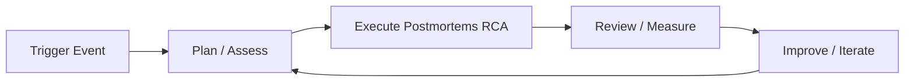

# Postmortems & Root Cause Analysis — A 2-Day Crash Course

> **In one sentence:** A postmortem is the written, blameless analysis you do *after* an incident
> to understand what really happened and why, so the whole organization learns and the same class
> of failure doesn't recur — and RCA (root cause analysis) is the investigative technique at its
> heart.

> Companion to `Incident-Response.md` (running the live incident) and `SRE-Process.md`. The
> incident is the fire; the postmortem is how you stop the next one.

---

## Part 0 — Why postmortems, and why "blameless" is non-negotiable

After an outage, the tempting reactions are "let's just move on" or "whose fault was it?" Both are
disasters. Skipping the analysis guarantees the incident recurs. Blaming an individual guarantees
something worse: people start hiding mistakes, omitting details, and avoiding risky-but-necessary
work — and you lose the very information that would prevent recurrence. Fear destroys learning.

The reframe that makes postmortems work: **almost every incident is a system and process failure,
not a person failure.** If one engineer's single mistake could take down production, the real
problem is that the *system allowed* a single mistake to do that — missing guardrails, missing
tests, missing review, a confusing tool, a fragile design. The person who "pushed the button" is
usually the last link in a long chain of latent conditions. So you fix the chain, not the person.

This is **blameless postmortem culture**: assume everyone acted reasonably given what they knew at
the time, and investigate the conditions that made the failure possible and hard to catch. Done
right, people *volunteer* "here's where I got confused" because they know it leads to a better
system, not a reprimand. That candor is the entire value.

**Mental model:** an incident is a window into how your system *actually* behaves under stress
(versus how you assumed it behaves). The postmortem's job is to look through that window honestly,
extract the systemic lessons, and turn them into concrete changes — then verify those changes
happen.

---




## Part 1 — The vocabulary

| Term | Meaning |
|------|---------|
| **Postmortem** | The document + process analyzing an incident after resolution |
| **Blameless** | Focused on systemic causes, not individual fault |
| **Root cause** | The underlying condition(s) that allowed the incident (usually plural) |
| **Contributing factors** | Things that made it worse, longer, or harder to detect |
| **Timeline** | The factual sequence of events with timestamps |
| **Action item** | A concrete, owned, tracked change to prevent recurrence |
| **5 Whys** | A questioning technique to dig past symptoms to causes |
| **Blast radius** | Who/what was affected, and how badly |

A crucial nuance: **"root cause" is usually a misnomer — there's rarely a single one.** Complex
systems fail from a *combination* of factors lining up (the "Swiss cheese model": several layers
of defense each had a hole, and the holes aligned). Hunting for one root cause oversimplifies and
leads to shallow fixes. Look for the *set* of contributing conditions.

---

## DAY 1 — Write a postmortem

### 1. When to write one
Write a postmortem for: every SEV1/SEV2, any customer-visible outage, any near-miss that *could*
have been bad, and anything where the team learned something surprising. Small/repeat incidents
can get a lightweight version. The rule: if it's worth an incident, it's worth a few paragraphs of
learning.

### 2. The standard postmortem structure
```text
1. Title + metadata        date, duration, severity, authors, status
2. Summary                 2–4 sentences: what happened, impact, resolution (the TL;DR)
3. Impact                  who/what was affected, for how long, quantified
                           (users, requests, revenue, SLO/error-budget burn)
4. Timeline                factual, timestamped sequence: detection -> actions -> resolution
5. Root cause / analysis   what actually happened and WHY (the investigation)
6. What went well          things to keep/reinforce (not just failures!)
7. What went poorly        gaps in detection, response, tooling, process
8. Action items            concrete, owned, dated, tracked changes to prevent recurrence
9. Lessons learned         the durable takeaways for the wider org
```

### 3. Write the timeline first (facts before interpretation)
Reconstruct the factual sequence with timestamps, pulled from alerts, chat logs, deploy logs, and
dashboards (this is why a scribe during the incident matters — see `Incident-Response.md`):
```text
13:58  checkout v2.4 deployed
14:02  Alertmanager fires: checkout 5xx > 5%
14:03  on-call acknowledges, declares SEV2
14:07  identified correlation with the 13:58 deploy
14:10  rollback to v2.3 initiated
14:14  error rate returns to baseline
14:25  incident resolved and stood down
```
Keep it **factual and neutral** — "the deploy went out," not "Sam carelessly deployed." Interpretation
goes in the analysis section, not the timeline.

### 4. Quantify the impact
Vague impact ("some users affected") undercuts the postmortem's weight. Quantify: duration, % of
requests failed, number of users, revenue/SLO impact, error-budget consumed (see
`SRE-Process.md`). Hard numbers make the case for the action items and help prioritize prevention.

### 5. Language discipline (how to keep it blameless on the page)
- Refer to **roles/systems**, not names where fault could be implied: "the deploy was not gated by
  a canary," not "Sam skipped the canary."
- Describe decisions **in the context of what was known at the time** — avoid hindsight bias
  ("they should have obviously…"). At 14:05 nobody knew what you know now.
- Frame causes as **conditions**: "the migration ran without a rollback path" rather than "X wrote
  a bad migration."
- Include **"what went well"** — postmortems aren't just failure catalogues; reinforcing what
  worked is as valuable as fixing what didn't.

**By end of Day 1 you can:** decide when a postmortem is warranted, structure it, build a factual
timeline, quantify impact, and write blamelessly. That's a publishable postmortem.

---

## DAY 2 — Analyze deeply and drive change

### 1. Root cause analysis: the 5 Whys (and its trap)
Repeatedly ask "why?" to move from symptom toward underlying cause:
```text
Problem: checkout returned 500s for 12 minutes.
Why? -> The new code threw on a DB column that didn't exist.
Why? -> The migration that adds the column hadn't run before the app deployed.
Why? -> Migrations and app deploys run in separate, unordered pipelines.
Why? -> No one designed an ordering/gate between schema and app changes.
Why? -> Our deploy process treats schema and code as independent (a systemic gap).
```
Notice the chain ends at a **process/system** condition, not a person — that's the signal you've
gone deep enough. **The trap:** 5 Whys can become a single narrow line of reasoning and miss
parallel causes. Don't stop at exactly five, and don't follow only one branch — ask "what else
contributed?" at each level. Real failures are trees, not chains.

### 2. Look for contributing factors across categories
Prompt yourself across dimensions so you don't fixate on the technical trigger:
- **Detection** — how long until you knew? Was the alert good/timely? (MTTD)
- **Response** — was mitigation fast? Did the process work? (MTTR)
- **Technical** — the code/config/infra trigger and the design weakness it exposed.
- **Process** — review, testing, deploy gates, change management gaps.
- **Tooling** — did tools help or hinder (confusing UI, missing rollback, bad runbook)?
- **Organizational** — unclear ownership, knowledge silos, time pressure.
A latency incident might have a technical trigger *and* a slow detection *and* a missing runbook —
all worth an action item.

### 3. Action items — the only part that prevents recurrence
A postmortem that ends in lessons but no tracked changes is a diary entry. Good action items are:
- **Specific** — "add a canary stage that blocks deploy on 5xx > 1%," not "be more careful."
- **Owned** — a named owner (a team is fine), not "someone."
- **Dated/tracked** — a due date and a ticket; reviewed until done.
- **Prioritized** — tackle the ones that address the deepest/most-likely-to-recur causes first.
- **Proportionate** — don't generate 30 items nobody will do; pick the few that matter.
Classify them: *prevent* (stop it happening), *detect* (catch it faster next time), *mitigate*
(reduce impact when it does). A balanced set covers all three.

> Anti-pattern to avoid: the only action item being "add more monitoring" or "tell people to be
> careful." Those rarely fix the systemic cause. Prefer guardrails (automated gates, tests,
> safer defaults) over reminders to humans.

### 4. The review meeting
Hold a blameless review with the responders and stakeholders:
- Walk the timeline and analysis; invite "what did we miss?" and "where were we confused?"
- Explicitly set the tone: we're here to improve the system, not assign blame.
- Agree and assign the action items. Decide who tracks them to completion.
- Keep it psychologically safe — the quality of candor determines the quality of learning.

### 5. Close the loop (where most orgs fail)
The postmortem isn't done when it's published — it's done when the **action items ship**. Track
them like any other work; review open postmortem actions regularly. Many teams keep an internal
library of past postmortems, searchable, so patterns emerge ("this is our third deploy-ordering
incident — time for a structural fix") and new engineers learn from history. Recurring incident
*types* are themselves a finding.

### 6. Measuring whether it's working
Watch trends, not just individual incidents: **MTTD/MTTR** going down, repeat-incident rate
dropping, action-item completion rate high, and a culture where people readily write and read
postmortems. If the same class of failure keeps recurring, your analyses are too shallow or your
action items aren't shipping.

---

## Worked example — postmortem skeleton for the checkout outage
```text
Title: Checkout 5xx outage — 2026-05-30 — SEV2 — 12 min — Author: <on-call> — Status: Final

Summary: A deploy of checkout v2.4 referenced a DB column added by a migration that had not yet
run, causing ~30% of checkouts to 5xx for 12 minutes. Mitigated by rolling back to v2.3.

Impact: 14:02–14:14 UTC; ~30% of checkout attempts failed (~4,100 requests); ~18% of the monthly
error budget consumed; no data loss.

Timeline: [13:58 deploy] [14:02 alert] [14:03 declared SEV2] [14:07 deploy correlation]
          [14:10 rollback] [14:14 recovered] [14:25 resolved]

Analysis (5 Whys, multi-branch): app referenced a missing column -> migration not applied first
  -> schema and app deploys are independent/unordered pipelines -> no gate was ever designed.
  Contributing: detection was fine (3 min) but there was no canary, so the bad deploy hit 100%.

What went well: fast detection; clean rollback; clear IC and comms.
What went poorly: no canary; no schema/app ordering; runbook lacked a "recent deploy?" first step.

Action items:
  - [PREVENT] Add a canary stage gating on 5xx (owner: platform, due: 06-15, JIRA-123)
  - [PREVENT] Enforce migration-before-deploy ordering in the pipeline (owner: db, due: 06-20)
  - [DETECT]  Add deploy annotations to dashboards (owner: obs, due: 06-10)
  - [MITIGATE] Add "check recent deploys / rollback" as step 1 of the checkout runbook (due: 06-05)

Lessons: schema and code changes must be ordered and gated; canaries limit blast radius.
```

---

## Common pitfalls
- **Blame.** Naming-and-shaming kills candor and hides the real (systemic) causes. Stay blameless,
  always — it's a discipline, not a slogan.
- **Skipping it.** "We fixed it, move on" guarantees recurrence. The learning is the point.
- **Stopping at the symptom / single root cause.** Dig past the trigger to the conditions; look
  for *multiple* contributing factors, not one.
- **Hindsight bias.** Judging past decisions by what you know now. Evaluate based on what was
  known at the time.
- **Action items that are vague, unowned, or never tracked.** Then nothing changes. Specific,
  owned, dated, shipped.
- **"Add more monitoring / be careful" as the only fix.** Prefer structural guardrails over
  human-vigilance reminders.
- **Timeline mixed with interpretation.** Keep facts (timeline) separate from analysis (why).
- **No "what went well."** Postmortems should reinforce good practices, not only catalog failures.

---

## Quick reference
```text
WHEN: every SEV1/SEV2, customer-visible outage, scary near-miss, surprising failure.

STRUCTURE
  Title/meta · Summary (TL;DR) · Impact (quantified) · Timeline (facts) ·
  Analysis (why) · Went well · Went poorly · Action items · Lessons

BLAMELESS RULES
  systemic > individual · assume good intent · context-of-the-time, no hindsight ·
  fix the conditions, not the person · candor requires safety

RCA TECHNIQUES
  5 Whys (but branch — don't follow one line) · Swiss cheese (aligned holes) ·
  ask across: detection / response / technical / process / tooling / org

ACTION ITEMS  (the only part that prevents recurrence)
  specific · owned · dated · tracked to completion · prioritized
  classify: PREVENT / DETECT / MITIGATE · prefer guardrails over "be careful"

CLOSE THE LOOP
  ship the action items · keep a searchable postmortem library · watch repeat-incident rate
  metrics: MTTD/MTTR trending down, action-item completion high
```

---


## Top 10 Interview Questions

<details>
<summary><strong>Q: What is Postmortems RCA and what problem does it solve?</strong></summary>

Postmortems RCA addresses a specific need in modern engineering workflows. Understanding the core problem it solves — and the alternatives it replaced — is the foundation for every subsequent interview question. Frame your answer around the pain point first, then the solution.

</details>

<details>
<summary><strong>Q: How does Postmortems RCA compare to its main alternatives?</strong></summary>

Every tool exists in an ecosystem of alternatives. Be prepared to articulate the specific tradeoffs: when Postmortems RCA is the right choice, when an alternative is better, and what factors drive the decision (scale, team expertise, existing infrastructure, compliance requirements).

</details>

<details>
<summary><strong>Q: What are the most common production pitfalls with Postmortems RCA?</strong></summary>

Production experience is what separates senior from junior engineers. Common pitfalls include: misconfiguration that works in dev but fails at scale, security oversights, inadequate monitoring, and operational procedures that are untested until an incident occurs. Cite specific examples from your experience.

</details>

<details>
<summary><strong>Q: How do you monitor and observe Postmortems RCA in production?</strong></summary>

Key metrics to track, alerting thresholds to set, dashboards to build, and log patterns to watch. Production monitoring should cover: health/liveness, performance (latency, throughput), capacity (resource utilisation), and business impact (error rates affecting users). Explain which metrics are leading indicators versus lagging.

</details>

<details>
<summary><strong>Q: How do you scale Postmortems RCA as load increases?</strong></summary>

Scaling strategies depend on the bottleneck: horizontal scaling (add more instances), vertical scaling (bigger instances), caching (reduce load), sharding (distribute data), and async processing (decouple components). Explain which approach applies to Postmortems RCA and at what scale each strategy becomes necessary.

</details>

<details>
<summary><strong>Q: How do you handle security and access control with Postmortems RCA?</strong></summary>

Security is non-negotiable in production. Cover: authentication and authorization mechanisms, secrets management (never in code), encryption (at rest and in transit), network security (firewalls, private networks), audit logging, and compliance requirements relevant to your industry.

</details>

<details>
<summary><strong>Q: How do you implement disaster recovery for Postmortems RCA?</strong></summary>

DR planning requires defining RTO (recovery time objective) and RPO (recovery point objective), implementing backup strategies, testing restore procedures, and documenting runbooks. Explain your backup strategy, how you test restores, and what your recovery procedure looks like.

</details>

<details>
<summary><strong>Q: How do you automate Postmortems RCA deployment and configuration management?</strong></summary>

Infrastructure as code, CI/CD pipelines, configuration management, and GitOps workflows. Explain how you version, test, deploy, and roll back changes. Cover: what is automated, what requires manual approval, and how you handle configuration drift.

</details>

<details>
<summary><strong>Q: How do you troubleshoot issues with Postmortems RCA in production?</strong></summary>

A systematic debugging approach: check health endpoints, review recent changes (deploys, config changes), examine logs and metrics, reproduce the issue, identify root cause, fix, verify, and write a postmortem. Explain your actual debugging workflow with concrete examples.

</details>

<details>
<summary><strong>Q: What are the best practices for Postmortems RCA that you have learned from experience?</strong></summary>

Best practices that go beyond documentation: lessons learned from production incidents, configuration patterns that prevent common issues, testing strategies that catch bugs before production, and operational procedures that reduce toil. Share specific examples where following (or not following) a best practice had measurable impact.

</details>

---

## Next steps after Day 2
- Adopt a postmortem template and tooling (docs, incident.io, Jira links) so writing one is easy.
- Build a **postmortem library** and review it for recurring patterns (systemic findings).
- Run **wheel-of-misfortune** drills from past postmortems to train responders.
- Tie action items to **error budgets** (`SRE-Process.md`): repeated budget burn justifies pausing
  features to do reliability work the postmortems identified.

## Recommended learning resources

**YouTube channels & playlists:**
- [Google SRE — Postmortem Culture](https://www.youtube.com/results?search_query=google+SRE+postmortem+blameless) — blameless postmortems, action item tracking, and learning from incidents
- [USENIX SREcon — Root Cause Analysis](https://www.youtube.com/results?search_query=usenix+srecon+postmortem+root+cause) — practitioner talks on systemic analysis, contributing factors, and 5 Whys
- [PagerDuty — Post-Incident Reviews](https://www.youtube.com/@PagerDuty) — structuring reviews, writing timelines, and extracting actionable improvements
- [DevOps Enterprise Summit — Learning from Failure](https://www.youtube.com/results?search_query=devops+enterprise+summit+postmortem) — organisational approaches to incident learning
- [John Allspaw — Resilience Engineering](https://www.youtube.com/results?search_query=john+allspaw+resilience+engineering) — moving beyond root cause to systemic understanding of failure

**Official docs & blogs:**
- [sre.google — Postmortem Culture](https://sre.google/sre-book/postmortem-culture/) — Google's postmortem philosophy, template, and best practices
- [learning.pagerduty.com — Postmortems](https://postmortems.pagerduty.com/) — PagerDuty's open-source guide to running effective post-incident reviews

---

**The mantra:** blameless always — incidents are system failures, not people failures. Facts in the
timeline, depth in the analysis (multiple causes, not one), and the payoff in specific, owned,
shipped action items. A postmortem isn't done until the fixes land.
