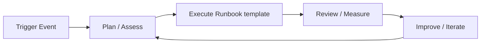

# Runbooks — A 2-Day Crash Course (+ a reusable template)

> **In one sentence:** A runbook is a written, step-by-step guide for handling a specific
> operational situation — the document a tired on-call engineer opens at 3am to know exactly what
> to check and do, instead of guessing under pressure.

> Companion to `Incident-Response.md` (runbooks are what your alerts link to) and `SRE-Process.md`.
> This includes a copy-paste template at the end.

---

## Part 0 — Why runbooks exist

When something breaks at 3am, the on-call engineer is half-asleep, stressed, and may not be the
person who built the system. Without a runbook, they start from zero: where are the logs? what's
normal? what's safe to restart? Every minute of fumbling is downtime and risk (including the
panicked, un-thought-through `rm -rf` or restart that makes things worse). A runbook converts the
expert knowledge that lives in one person's head into a procedure *anyone on-call* can follow
correctly under pressure.

Two related benefits beyond incidents: runbooks **spread knowledge** (no single point of human
failure — the bus factor), and they are the **raw material for automation** (a well-written manual
runbook is a script waiting to be written; the best "runbook" is eventually code that does it for
you).

**The key principle: a runbook is for someone who is *not* an expert in this system, acting under
stress.** That shapes everything — it must be specific, copy-pasteable, unambiguous, and tell you
not just *what* to do but *what's safe* and *when to escalate*. Vague advice ("investigate the
issue") is useless at 3am; exact commands and decision points are gold.

**Mental model:** a runbook is a recipe for an emergency, written for a stranger. Assume the reader
knows general ops but nothing about *this* service's quirks, is tired, and is anxious. Remove every
"you just have to know" and replace it with an explicit step.

---




## Part 1 — What makes a runbook good (vs a useless wiki page)

| Good runbook | Bad runbook |
|--------------|-------------|
| Specific commands you can copy-paste | "Check the database" |
| Says what *normal* looks like | No baseline to compare against |
| Marks destructive steps + safe alternatives | No warnings about danger |
| Clear "if X then Y" decision points | A wall of prose |
| Escalation: who to call, when | "Escalate if needed" |
| Tested and dated | Written once, never verified, stale |
| Linked from the alert that triggers it | Buried where nobody finds it |

The hallmark of a great runbook: an engineer who has never seen the system can resolve (or safely
escalate) the situation by following it literally.

---

## DAY 1 — Anatomy of a runbook and writing your first

### 1. The essential sections
A runbook for a specific alert/situation should contain:
1. **Title & scope** — exactly which situation this covers (match the alert name).
2. **Severity & impact** — what's affected when this fires; how urgent.
3. **Symptoms / how you got here** — the alert, the dashboard, the report that triggers this.
4. **Quick triage** — the first 2–4 commands to assess the situation, with *what normal looks like*.
5. **Diagnosis** — decision tree: "if you see A, it's probably X; if B, probably Y."
6. **Mitigation steps** — the actual fix actions, **mitigation first** (restore service), with
   destructive steps clearly flagged and safe alternatives noted.
7. **Verification** — how to confirm it's actually fixed (which metric should recover).
8. **Escalation** — who/which team to call, and the threshold ("if not resolved in 20 min, page X").
9. **Links** — dashboards, logs, related runbooks, the service's architecture doc.
10. **Metadata** — owner, last-tested date, last-reviewed date.

### 2. Write for the 3am reader (the style rules)
- **Exact, copy-pasteable commands** — not "tail the logs" but the literal
  `kubectl logs -n payments deploy/checkout --tail=100 | grep -i error`.
- **State the baseline** — "normal CPU is 40–60%; alert fires above 85%." Without a baseline the
  reader can't tell signal from noise.
- **Flag danger loudly** — `⚠️ DESTRUCTIVE: this drops connections. Prefer the rolling restart
  below first.` Always offer the safe option before the risky one.
- **Decision points, not prose** — "**If** the error log shows `connection refused` → the DB is
  down, go to §B. **Else if** `timeout` → downstream slow, go to §C."
- **Mitigation before diagnosis** — lead with how to *stop the bleeding* (roll back, fail over,
  restart), then how to investigate root cause (which the postmortem will use — see
  `Postmortems-RCA.md`).
- **One situation per runbook** — don't write a 5,000-line "everything" doc; small, findable,
  per-alert runbooks beat one giant manual.

### 3. Link it from the alert
A runbook nobody can find at 3am is worthless. Put a `runbook_url` annotation on every alerting
rule so the page itself links straight to the procedure (see `Prometheus.md`/`Alertmanager.md`):
```yaml
annotations:
  summary: "checkout 5xx > 5%"
  runbook_url: "https://wiki/runbooks/checkout-5xx"
```
The on-call should go alert → click → runbook in one step.

**By end of Day 1 you can:** structure a runbook with the essential sections, write it for a
stressed non-expert (exact commands, baselines, flagged danger, decision points), and link it from
the alert. That's a runbook that actually helps.

---

## DAY 2 — Maintain, test, and evolve toward automation

### 1. Test your runbooks (untested = fiction)
A runbook written once and never verified is often *wrong* — commands drift, paths change,
services get renamed. Validate them:
- **Walk through it** during a game day / chaos drill (see `Incident-Response.md`) — can someone
  unfamiliar follow it successfully?
- **Use real incidents as tests** — when a runbook is used, note where it was unclear or wrong and
  fix it immediately after (a postmortem action item).
- **Date every runbook** with "last tested / last reviewed" so stale ones are visible.
A runbook you haven't tested is a guess you're asking a tired person to trust.

### 2. Keep them alive (the maintenance discipline)
Runbooks rot as systems change. Build review into your process:
- **Owner per runbook** — someone accountable for keeping it current.
- **Review on change** — when the system changes (new deploy process, new dependency), update the
  runbook in the same PR.
- **Prune** — delete runbooks for decommissioned systems; a wrong runbook is worse than none.
- **Surface staleness** — flag runbooks not reviewed in N months.

### 3. From runbook to automation (the maturity path)
A manual runbook is step one; the goal is to *automate the toil away*:
```text
1. Manual runbook        — human reads and runs each command.
2. Scripted runbook      — the diagnostic/fix steps become a script (see Bash.md) the human runs.
3. Self-service / ChatOps — a bot runs the procedure on command ("/restart checkout").
4. Auto-remediation      — the system detects the condition and fixes itself; humans get notified.
```
Every time you run a manual runbook, ask "could this be a script?" The well-structured runbook is
already most of the way to code. (Caution: automate *mitigation* readily; be careful auto-running
*destructive* actions — keep a human in the loop for those.)

### 4. Types of runbooks worth having
- **Alert-response runbooks** — one per actionable alert (the most important; linked from the page).
- **Operational procedures** — routine tasks: deploy, rollback, failover, certificate rotation,
  scaling, backup/restore, on-call handover.
- **Disaster recovery** — how to recover from major loss (region down, data restore). Test these
  *especially* — an untested DR runbook is a false sense of safety.
- **Onboarding/"how this service works"** — context that makes the above usable.

### 5. Where they live
Keep runbooks **version-controlled** (in the repo next to the code, or a docs site rendered from
Git — see `Git.md`) so changes are reviewed and history is tracked, and **discoverable** (indexed,
searchable, linked from alerts and dashboards). Co-locating with code means the runbook updates in
the same PR as the change that affects it.

---

## The reusable template (copy-paste this)
```markdown
# Runbook: <Situation / Alert Name>

**Owner:** <team/person>   **Last tested:** <YYYY-MM-DD>   **Last reviewed:** <YYYY-MM-DD>
**Severity when this fires:** <SEV1–4>   **Service:** <name>

## Scope
This runbook covers: <exactly what situation — match the alert name>.
It does NOT cover: <related situations + links to their runbooks>.

## Impact
When this fires: <who/what is affected, how badly, how urgent>.

## Symptoms / Trigger
- Alert: `<alert name>` (links here via runbook_url)
- Dashboard: <link>   |   Logs: <link>
- What you'll observe: <the signal>

## 1. Quick triage (first 2 minutes)
```bash
# command 1 — what it checks
<exact command>
# Normal: <what healthy output looks like>.  Bad: <what indicates the problem>.

# command 2
<exact command>
```
⏱️ First question: **what changed recently?** (deploys, config, traffic) — `<command to check>`.

## 2. Diagnosis (decision tree)
- **If** <observation A> → likely <cause X> → go to §3A.
- **If** <observation B> → likely <cause Y> → go to §3B.
- **If** unclear after 10 min → **escalate** (see below).

## 3. Mitigation (STOP THE BLEEDING FIRST)
### 3A. <Cause X> — Safe mitigation
```bash
<safe rollback / restart / failover command>
```
### 3B. <Cause Y>
```bash
<command>
```
⚠️ **DESTRUCTIVE:** `<dangerous command>` — <what it destroys>. Use the safe option above first;
only do this if <condition>.

## 4. Verify recovery
```bash
<command / metric to watch>
```
Recovered when: <metric returns to baseline / synthetic check passes>.

## 5. Escalate
- If not resolved in <N> min, or if <condition>: page **<team/person>** via <channel>.
- System owner: <name>   Downstream owners: <name(s)>

## 6. After
- Note the timeline for the postmortem (see Postmortems-RCA.md).
- File any runbook fixes you discovered as action items.

## Links
- Architecture: <link>   Dashboards: <link>   Related runbooks: <links>
```

---

## Worked example — a real alert-response runbook (abridged)
```markdown
# Runbook: checkout 5xx error rate high

Owner: payments   Last tested: 2026-05-30   Severity: SEV2   Service: checkout

## Quick triage
kubectl get pods -n payments -l app=checkout            # all Running? restarts climbing?
# Normal: all Running, 0–1 restarts. Bad: CrashLoopBackOff / OOMKilled.
kubectl rollout history deploy/checkout -n payments     # WHAT CHANGED? recent deploy?

## Diagnosis
- If a deploy happened in the last ~30 min → suspect the release → §3A (roll back).
- If pods OOMKilled → memory pressure → §3B.
- If logs show "connection refused" to DB → DB issue → escalate to #db-oncall.

## Mitigation
### 3A. Bad release — roll back (SAFE, preferred)
kubectl rollout undo deploy/checkout -n payments
kubectl rollout status deploy/checkout -n payments
### 3B. OOM — scale + raise limits
kubectl scale deploy/checkout -n payments --replicas=6

## Verify
Watch 5xx rate in Grafana <link> return below 1% for 5 min; run the synthetic checkout test.

## Escalate
Not recovered in 20 min → page payments-lead. DB-rooted → page #db-oncall immediately.
```

---

## Common pitfalls
- **Vague instructions.** "Investigate the issue" / "check the logs" — useless at 3am. Give exact,
  copy-pasteable commands.
- **No baseline.** Without "normal looks like X," the reader can't judge what they're seeing.
- **No danger warnings.** A destructive command with no ⚠️ leads to a worse outage. Flag it and
  offer the safe path first.
- **Diagnosis before mitigation.** Lead with how to restore service; root-cause hunting comes after.
- **Untested / undated.** Stale runbooks send people down wrong paths. Test on game days and real
  incidents; date them; a wrong runbook is worse than none.
- **Not linked from the alert.** If on-call can't find it in one click, it won't get used. Add
  `runbook_url`.
- **One giant manual.** Unfindable. Prefer small, per-situation runbooks, indexed.
- **Never automating.** Re-running the same manual runbook forever is toil. Script the safe parts.

---

## Quick reference
```text
A RUNBOOK MUST: be specific (copy-paste commands) · state the baseline (normal vs bad) ·
  flag destructive steps + offer safe alternatives · use if/then decision points ·
  mitigate before diagnose · say how to verify recovery · say who/when to escalate ·
  be tested, dated, owned, version-controlled, and LINKED FROM THE ALERT.

SECTIONS: scope · impact · symptoms · quick triage · diagnosis(tree) · mitigation(safe-first) ·
  verify · escalate · links · metadata(owner/last-tested).

WRITE FOR: a tired non-expert under stress. Remove every "you just have to know."

AUTOMATION PATH: manual -> scripted -> ChatOps/self-service -> auto-remediation
  (automate mitigation readily; keep humans in the loop for destructive actions).

FIRST TRIAGE QUESTION, ALWAYS: "what changed recently?" (deploy/config/traffic)
```

---


## Top 10 Interview Questions

<details>
<summary><strong>Q: What is Runbook template and what problem does it solve?</strong></summary>

Runbook template addresses a specific need in modern engineering workflows. Understanding the core problem it solves — and the alternatives it replaced — is the foundation for every subsequent interview question. Frame your answer around the pain point first, then the solution.

</details>

<details>
<summary><strong>Q: How does Runbook template compare to its main alternatives?</strong></summary>

Every tool exists in an ecosystem of alternatives. Be prepared to articulate the specific tradeoffs: when Runbook template is the right choice, when an alternative is better, and what factors drive the decision (scale, team expertise, existing infrastructure, compliance requirements).

</details>

<details>
<summary><strong>Q: What are the most common production pitfalls with Runbook template?</strong></summary>

Production experience is what separates senior from junior engineers. Common pitfalls include: misconfiguration that works in dev but fails at scale, security oversights, inadequate monitoring, and operational procedures that are untested until an incident occurs. Cite specific examples from your experience.

</details>

<details>
<summary><strong>Q: How do you monitor and observe Runbook template in production?</strong></summary>

Key metrics to track, alerting thresholds to set, dashboards to build, and log patterns to watch. Production monitoring should cover: health/liveness, performance (latency, throughput), capacity (resource utilisation), and business impact (error rates affecting users). Explain which metrics are leading indicators versus lagging.

</details>

<details>
<summary><strong>Q: How do you scale Runbook template as load increases?</strong></summary>

Scaling strategies depend on the bottleneck: horizontal scaling (add more instances), vertical scaling (bigger instances), caching (reduce load), sharding (distribute data), and async processing (decouple components). Explain which approach applies to Runbook template and at what scale each strategy becomes necessary.

</details>

<details>
<summary><strong>Q: How do you handle security and access control with Runbook template?</strong></summary>

Security is non-negotiable in production. Cover: authentication and authorization mechanisms, secrets management (never in code), encryption (at rest and in transit), network security (firewalls, private networks), audit logging, and compliance requirements relevant to your industry.

</details>

<details>
<summary><strong>Q: How do you implement disaster recovery for Runbook template?</strong></summary>

DR planning requires defining RTO (recovery time objective) and RPO (recovery point objective), implementing backup strategies, testing restore procedures, and documenting runbooks. Explain your backup strategy, how you test restores, and what your recovery procedure looks like.

</details>

<details>
<summary><strong>Q: How do you automate Runbook template deployment and configuration management?</strong></summary>

Infrastructure as code, CI/CD pipelines, configuration management, and GitOps workflows. Explain how you version, test, deploy, and roll back changes. Cover: what is automated, what requires manual approval, and how you handle configuration drift.

</details>

<details>
<summary><strong>Q: How do you troubleshoot issues with Runbook template in production?</strong></summary>

A systematic debugging approach: check health endpoints, review recent changes (deploys, config changes), examine logs and metrics, reproduce the issue, identify root cause, fix, verify, and write a postmortem. Explain your actual debugging workflow with concrete examples.

</details>

<details>
<summary><strong>Q: What are the best practices for Runbook template that you have learned from experience?</strong></summary>

Best practices that go beyond documentation: lessons learned from production incidents, configuration patterns that prevent common issues, testing strategies that catch bugs before production, and operational procedures that reduce toil. Share specific examples where following (or not following) a best practice had measurable impact.

</details>

---

## Next steps after Day 2
- Add a `runbook_url` to every alerting rule (`Prometheus.md`/`Alertmanager.md`) and build a
  runbook index.
- Validate runbooks in **game days**; convert frequently-used ones into scripts (`Bash.md`).
- Keep runbooks in Git alongside code so they're reviewed and versioned (`Git.md`).
- Feed incident learnings back into runbooks as postmortem action items (`Postmortems-RCA.md`).

## Recommended learning resources

**YouTube channels & playlists:**
- [Google SRE — On-Call and Runbooks](https://www.youtube.com/results?search_query=google+SRE+on+call+runbooks) — how Google structures runbooks, links them to alerts, and keeps them current
- [PagerDuty — Runbook Automation](https://www.youtube.com/@PagerDuty) — runbook design, automation patterns, and integrating runbooks with incident response
- [USENIX SREcon — Operational Documentation](https://www.youtube.com/results?search_query=usenix+srecon+runbooks+documentation) — practitioner talks on writing documentation that works at 3am
- [Gremlin — Game Days](https://www.youtube.com/@GremlinInc) — validating runbooks through controlled failure exercises
- [DevOps Enterprise Summit — Toil Reduction](https://www.youtube.com/results?search_query=devops+enterprise+summit+toil+automation) — automating repetitive runbook steps and reducing operational toil

**Official docs & blogs:**
- [sre.google — Being On-Call](https://sre.google/sre-book/being-on-call/) — Google's approach to on-call, including runbook requirements and alert hygiene
- [learning.pagerduty.com — Incident Response](https://response.pagerduty.com/) — how runbooks integrate into the broader incident response process

---

**The mantra:** write the recipe a tired stranger can follow under fire — exact commands, the
baseline, flagged danger, clear decisions, mitigation first, verification, and escalation. Link it
from the alert, test it, date it, and turn the repetitive ones into code.
