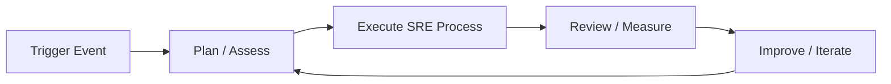

# SRE Process — A 2-Day Crash Course

> **In one sentence:** SRE is an engineering discipline that applies software practices to
> operations, balancing reliability against feature velocity through error budgets, SLOs, and
> systematic toil reduction.

> Companion files: `Incident-Response.md` (running live incidents), `Postmortems-RCA.md`
> (learning from them), `Capacity-Planning.md` (planning for growth), `Runbook-template.md`
> (documenting responses), `Prometheus.md` + `Alertmanager.md` (the instrumentation layer).

---

## Part 0 — Why SRE exists

Before SRE, the relationship between development and operations was adversarial by structure.
Dev teams were measured on shipping features. Ops teams were measured on stability. Every release
was a negotiation — devs pushed, ops resisted, and neither side was wrong given their incentives.
The result: slow deploys, blame-shifting after outages, and an ops team buried in manual work that
could never be automated away because they were too busy doing it.

Google's answer in the early 2000s was to reframe the question. Instead of ops as a brake on dev,
make reliability a *shared engineering problem* with an explicit budget. Hire software engineers
into operations roles. Write code to replace manual work. Set a precise numerical target for
reliability — not "as reliable as possible" but "reliable enough" — and use the margin between
that target and perfection as room to take risks. Call the margin an *error budget*, and let it
govern the pace of change.

The philosophy compresses to three ideas:
1. **Reliability is a feature** — not a department's job, not an afterthought, a product
   requirement like any other. It has a target. Missing the target has consequences.
2. **Toil is waste** — manual, repetitive, automatable operational work is an engineering debt
   that compounds. SRE teams commit to spending no more than 50% of their time on it and treating
   the rest as a bug to fix.
3. **Error budgets align incentives** — by giving dev and SRE teams a shared number to optimize,
   you replace the dev-vs-ops standoff with a conversation about risk appetite.

**Mental model:** SRE is the thermostat between reliability and velocity — error budgets are the
temperature setting. When the room is warm (budget healthy), you can move fast and take risks.
When it's cold (budget exhausted), you slow down and focus on stability. The thermostat doesn't
decide the target temperature — the business does — but it enforces it automatically.

---




## Part 1 — The vocabulary

| Term | Meaning |
|------|---------|
| **SLI** (Service Level Indicator) | A quantitative measure of service behavior — e.g., request success rate, latency at p99 |
| **SLO** (Service Level Objective) | A target value or range for an SLI — e.g., "99.9% of requests succeed over a 30-day window" |
| **SLA** (Service Level Agreement) | A contractual commitment to customers, usually weaker than your internal SLO — breach has legal/financial consequences |
| **Error Budget** | The allowed unreliability = 1 − SLO. At 99.9% SLO, you have 0.1% budget — about 43.8 minutes of downtime per month |
| **Toil** | Work that is manual, repetitive, automatable, tactical, and scales with service growth — the SRE enemy |
| **Golden Signals** | Latency, traffic, errors, saturation — the four metrics that together describe the health of any service |
| **MTTR** | Mean time to restore — how fast you recover from failure |
| **MTTF** | Mean time to failure — how long between failures on average |
| **Blast Radius** | The scope of impact if a component, change, or failure propagates — who and what gets hit |
| **Production Readiness Review (PRR)** | A structured checklist gate before a service goes to production — ensures it has monitoring, runbooks, on-call coverage, and a measured SLO |

---

## DAY 1 — The foundations

### 1. SLIs — picking what to measure

An SLI is a ratio: the number of good events divided by total events, expressed as a percentage.
"Good" has to be defined precisely — vague SLIs produce useless data.

For a web API:
- **Good request** = HTTP 2xx response returned within 200ms
- **Total requests** = all requests that reached the service
- **SLI** = good_requests / total_requests × 100

For a batch pipeline:
- **Good run** = job completed with correct output within the SLA window
- **SLI** = successful_runs / total_runs × 100

The selection principle: measure what the *user experiences*, not what's convenient to instrument.
CPU utilization is easy to measure but doesn't directly answer "did the user get what they asked
for?" Request success rate and latency do. Start with user-journey SLIs, then add infrastructure
signals as supporting context.

### 2. SLOs — setting the target

An SLO is the SLI target plus the measurement window. Both matter.

```
SLO = "99.95% of payment API requests will complete successfully
       with latency < 300ms, measured over a rolling 28-day window"
```

Setting the number: don't pick 99.99% because it sounds good. Ask:
- What does the user actually notice? Users rarely notice a 0.001% error rate. They notice 1%.
- What has your service historically achieved? Set an SLO you can defend, then tighten it.
- What's the cost of the next nine? Going from 99.9% to 99.99% often requires 10x the engineering
  investment. That investment has to be worth it to the business.

Three SLOs: set one for availability (success rate), one for latency (p95 or p99), and optionally
one for data correctness if your service processes data. That's usually enough. Don't create ten
SLOs — you'll end up ignoring most of them.

### 3. SLAs — the contract layer

Your SLA should sit *below* your SLO. If you've committed internally to 99.95%, your SLA to
customers might be 99.9%. The gap gives you room to handle SLO breaches without immediately
triggering contractual penalties. If your SLA equals your SLO, you have no margin.

SLAs are a business and legal concern as much as a technical one. SRE owns the SLO. Legal and
product own the SLA. Make sure they're talking to each other.

### 4. Error budgets — the operational lever

Error budget = 1 − SLO, measured over the same window.

```
SLO = 99.9%  →  error budget = 0.1%  →  26.3 minutes/month at 100% request volume
SLO = 99.95% →  error budget = 0.05% →  21.9 minutes/month
SLO = 99.99% →  error budget = 0.01% →   4.4 minutes/month
```

The budget is consumed by:
- Downtime and errors in production
- Planned maintenance (if it affects users)
- Risky deployments that cause degradation

When budget is healthy (>50% remaining mid-month), engineering can move fast — deploy freely,
run experiments, do infrastructure migrations. When budget is low (<25% remaining), you slow down:
freeze non-essential deploys, hold off on risky changes, focus on reliability work. When budget
hits zero, you stop non-critical changes entirely and the SRE team focuses exclusively on
restoring reliability. This is an automatic, objective decision — no politics, no negotiation.

⚠️ Budget exhaustion should trigger a formal review: why did we burn the budget? Was it one big
incident, or many small ones? The answer shapes the response. See `Postmortems-RCA.md`.

### 5. The four golden signals

Coined in the SRE book and still the clearest framework for service health:

**Latency** — how long requests take. Measure p50, p95, p99. Watch the tail (p99) — averages hide
the users having a bad time. Distinguish successful-request latency from error latency; slow errors
are a separate problem from fast errors.

**Traffic** — the demand on your system. Requests per second, active connections, transactions per
minute. Traffic is the denominator in many SLIs and the signal that precedes saturation. Know your
baseline; a traffic spike often explains a latency spike.

**Errors** — the rate of failed requests. Explicit failures (HTTP 5xx) are easy. Don't forget
implicit failures: HTTP 200 with a wrong response body, timeouts handled as successes, downstream
calls that fail silently. Measure both.

**Saturation** — how full your service is. CPU, memory, disk, connection pool, queue depth, thread
count. Saturation predicts problems before they become user-visible. A service at 90% CPU usage
has no room to absorb a traffic spike. Track the *most constrained* resource, not all of them.

These four signals apply to any service — an API, a database, a message queue, a batch job. Wire
them up in `Prometheus.md` and alert on them via `Alertmanager.md`.

### 6. Identifying and measuring toil

Toil is not all operational work — only the subset that is:
- **Manual** — a human has to do it
- **Repetitive** — the same work recurs
- **Automatable** — a machine could do it
- **Tactical** — reactive, not improving anything
- **Scaling with load** — more traffic means more of this work

Restarting a service after every OOM is toil. Reviewing a deploy checklist by hand every deploy
is toil. SSH-ing into a box to rotate a cert is toil. Investigating alerts that fire and then
resolve with no action is toil.

Measure it: have your team log toil separately from project work for two weeks. If it exceeds 50%
of time, it's an emergency — it will crowd out the work that would eliminate it. Prioritize one
toil-reduction project per quarter even when there's feature pressure. The math always wins: an
hour of automation investment that saves 10 minutes/week pays back in six weeks.

---

**By end of Day 1 you can:**
- Define SLI, SLO, SLA, and error budget for any service, with concrete targets
- Calculate your monthly error budget in minutes given an SLO percentage
- Instrument a service with the four golden signals
- Identify toil in your team's week and estimate what percentage it represents

---

## DAY 2 — Make it real

### 1. Error budget policy — who decides what

An error budget without a policy is just a number. The policy answers: *what happens at each
burn rate?*

Write it down before you need it. A minimal policy:

```
> 75% budget remaining:  Normal velocity. Deploy freely.
50–75% remaining:        Normal, but flag for review if burning fast.
25–50% remaining:        Reduce risky deployments. Engineering review required
                         before new features that touch the critical path.
< 25% remaining:         Freeze non-critical deploys. SRE and product VP notified.
                         Focus shifts to reliability work.
0% (SLO breach):         Full freeze. Incident review. No new features until
                         budget is replenished or SLO is formally relaxed.
```

Escalation path: SRE team monitors budget burn rate daily. At the 25% threshold, the on-call
SRE and the tech lead own a joint decision on deploy freeze. At 0%, the engineering director and
product VP are in the room. The SRE team doesn't make this decision unilaterally — that recreates
the dev-vs-ops standoff. They bring the data; the business decides the tradeoff.

The budget policy should be written down, version-controlled, and linked from your runbooks. If
it's in someone's head, it doesn't exist.

### 2. On-call design — rotation, escalation, compensation

On-call is the sharp end of reliability. Design it poorly and you burn out your engineers, miss
incidents, or get noise-desensitized teams that ignore pages.

**Rotation design:**
- Minimum two engineers in rotation (primary plus secondary) so there's a backup when primary is
  unavailable or overwhelmed.
- Rotation shifts of one week are the standard. Shorter shifts mean too much context-switching;
  longer shifts mean too much sustained stress.
- Handoffs are explicit: the outgoing on-call writes a brief summary (open incidents, known
  instabilities, ongoing changes) and the incoming on-call confirms receipt. A silent handoff is
  a missed incident waiting to happen.

**Escalation paths:**
Define them before 3am, not during it. Every alert should have an escalation path that answers:
if primary doesn't respond in N minutes, who gets paged? A missing escalation path means an
incident goes unhandled. Keep paths shallow — two levels is usually enough. If you need three
levels, your team is too small for the service footprint.

**Alert quality — the most important on-call investment:**
An on-call rotation only works if pages are *actionable*. Every page should be asking the
responder to make a decision or take an action that only a human can take. If the alert auto-
resolves 80% of the time, it's noise. If the runbook says "no action needed", it shouldn't be
paging. Audit your alert roster quarterly and delete or downgrade anything that isn't actionable.
High page volume is not a sign of a good monitoring system — it's a sign of toil. Wire alerts
through `Alertmanager.md` with proper inhibition rules and grouping.

**On-call compensation:**
If your organization is serious about reliability, on-call time outside business hours is
compensated — either financially or through equivalent time off. Engineers who are on-call for
free with no relief will leave or stop caring, both of which are more expensive than compensation.
This is a policy conversation, not a technical one, but SRE leads need to have it.

### 3. Production Readiness Reviews

A PRR is a checklist-based gate that a service must pass before going to production. It's not a
bureaucratic hurdle — it's the mechanism that prevents a new service from becoming an undocumented,
unmonitored liability at 2am.

A minimal PRR covers:
```
Observability
  [ ] SLIs defined and instrumented (Prometheus metrics exist)
  [ ] SLO targets set and documented
  [ ] Dashboards exist for the four golden signals
  [ ] Alerts defined for SLO burn rate (see Alertmanager.md)

Operations
  [ ] Runbook exists and is linked from alerts (see Runbook-template.md)
  [ ] Deployment procedure documented (rollback steps included)
  [ ] On-call rotation covers this service
  [ ] Capacity plan documented (see Capacity-Planning.md)

Resilience
  [ ] Failure modes identified (what happens when dependencies are down?)
  [ ] Graceful degradation tested
  [ ] Load tested to 2× expected peak traffic

Incident readiness
  [ ] Incident severity criteria defined for this service
  [ ] Escalation path documented
  [ ] Service dependencies mapped
```

PRRs work best when the SRE team runs them collaboratively with the dev team — not as a pass/fail
audit, but as a conversation. Most gaps are resolvable in a few days. Blocking a launch over a
missing runbook is not the goal; getting the runbook written before launch is.

### 4. Reducing toil systematically

Once you've measured toil, the reduction playbook is straightforward:

**Automate the runbook.** If your runbook says "SSH to server, run this command, check output" —
that's a script waiting to be written. Automation that executes the first few steps of a runbook
buys time and consistency. It doesn't have to be perfect on day one.

**Make bad states impossible.** A restart loop means something is crashing repeatedly. Don't
automate the restarts — fix the crash. Automation that masks a problem is toil-flavored technical
debt.

**Improve deploy tooling.** A surprising fraction of ops toil is deploy-related: manual
promotion steps, manual canary checks, manual rollback commands. Progressive delivery tools that
automate canaries and rollbacks eliminate whole categories of on-call work.

**Reduce alert noise.** Every spurious page is toil. Alert tuning is high-leverage work that
teams consistently underinvest in. A one-hour session to silence five noisy alerts saves more
cumulative time than most features.

**Track elimination, not just creation.** Add a "toil eliminated this quarter" metric alongside
velocity metrics. If you're only measuring features shipped, toil reduction never wins the
prioritization battle.

### 5. Blameless culture

Blameless doesn't mean consequence-free or that individual actions don't matter. It means the
*analysis* focuses on conditions, not culprits. When an engineer made a change that caused an
outage, the blameless question is: why did the system allow a single change to cause that outage?
What review, test, or guardrail was missing?

In practice, blameless culture lives or dies in how leadership behaves *after* an incident. If the
postmortem is followed by a performance conversation, the next engineer will not be honest in their
postmortem. The two processes must stay completely separate. See `Postmortems-RCA.md` for the
full analysis framework.

The engineering dividend is real: teams with blameless culture surface failure signals faster
because engineers report near-misses instead of hiding them. Those near-miss reports are the
cheapest possible reliability improvements.

### 6. Reliability vs feature velocity — making the tradeoff explicit

The fundamental tension in SRE is that reliability work and feature work compete for the same
engineering time. The error budget is the mechanism for making that tradeoff explicit and
objective, but you still have to make it.

Some principles that hold in practice:

**Never spend all the budget on features.** If 100% of error budget burns on feature launches and
none goes into reliability investment, you're eating your seed corn. Reserve some budget for
planned maintenance and reliability work even when the budget is healthy.

**Reliability has diminishing returns.** Going from 99% to 99.9% reliability often has enormous
user impact. Going from 99.99% to 99.999% is almost never worth the cost for the average service.
Know where your users are on that curve.

**Overly tight SLOs create toil.** A 99.999% SLO on a service that naturally runs at 99.95%
means your team is in constant firefighting mode. Set an SLO that reflects real user needs, not
aspirational ones.

**Feature work funds reliability work.** The business needs features to survive. SRE teams that
block all feature launches in the name of reliability will be defunded or bypassed. The goal is
a *sustainable* pace — fast enough to matter, careful enough to not destroy user trust.

---

## Worked example — Setting up SLOs for a payment service

You're joining the SRE team for a BFSI (banking/financial services) payment processing API.
The service handles fund transfers between accounts. Downtime or errors mean failed transactions —
regulatory, reputational, and financial consequences. Here's how you'd set this up from scratch.

**Step 1 — Select SLIs**

User-facing behaviors that matter:
- Did the transaction succeed?
- Did it complete in a reasonable time?
- Was the response data correct (amount, account numbers)?

```
SLI-1 (Availability): successful_transactions / total_transactions
  Good = HTTP 200 with transaction_status: "completed" or "pending"
  Bad  = HTTP 4xx/5xx, timeouts, or transaction_status: "failed"

SLI-2 (Latency): fraction of transactions completing within 3 seconds
  Good = response_time_ms <= 3000
  Total = all requests

SLI-3 (Correctness): transactions with verified amount match / total transactions
  (measured via reconciliation job comparing instruction vs ledger entry)
```

**Step 2 — Set SLO targets**

Payments are high-stakes. Regulatory context (RBI, PCI-DSS) adds pressure. But users also
tolerate some failure in payments — retry is well-understood. Reasonable targets:

```
SLO-1: Availability  >= 99.95%  (rolling 28-day window)
SLO-2: Latency       >= 99.0%   of requests complete within 3s (rolling 28-day)
SLO-3: Correctness   >= 99.999% (rolling 28-day — this one you do not negotiate)
```

Your SLA to bank partners: 99.9% availability. The gap between internal SLO (99.95%) and SLA
(99.9%) gives you room to investigate SLO breaches before they become SLA breaches.

**Step 3 — Calculate error budgets**

```
28-day window = 28 × 24 × 60 = 40,320 minutes

Availability budget:  0.05% of 40,320 = 20.16 minutes of total unavailability
Latency budget:       1.0%  of requests — 1 in 100 requests may exceed 3s
Correctness budget:   0.001% — roughly 1 incorrect transaction per 100,000
```

At typical load of 1,000 transactions/minute, the availability budget of 20 minutes means you
can afford roughly 20,000 failed transactions per month before breaching SLO. That sounds like a
lot. It isn't — one bad deploy with a 10-minute blast radius at peak load can consume half the
budget.

**Step 4 — Error budget burn policy**

```
Burn rate > 5× (budget will exhaust in < 5 days):
  → Immediate page to on-call SRE + tech lead
  → Deploy freeze on payment service
  → Incident declared (see Incident-Response.md)

Burn rate 2–5× (budget tracking to exhaust before month end):
  → SRE reviews, notifies product and engineering lead
  → Non-critical deploys paused, PRR for any pending changes

Burn rate < 2×:
  → Monitor. Normal velocity.

Budget exhausted:
  → Full deploy freeze
  → Engineering director, product VP, compliance in the loop
  → Postmortem scheduled (see Postmortems-RCA.md)
```

**Step 5 — Wire it up**

Instrument the service with Prometheus counters and histograms (see `Prometheus.md`).
Configure multi-window burn rate alerts in `Alertmanager.md` — a fast-burn alert (5-minute window,
14.4× rate) catches sudden outages; a slow-burn alert (6-hour window, 1× rate) catches gradual
degradation. Link every alert to the runbook (see `Runbook-template.md`).

---

## Common pitfalls

- **SLOs set too high from day one.** Starting at 99.99% when your service runs at 99.95%
  means you're always in budget exhaustion. Set an achievable target, tighten over time as you
  invest in reliability.

- **SLIs that measure infrastructure instead of user experience.** "Server CPU < 80%" is not
  an SLI — it doesn't tell you whether users are getting value. Request success rate and latency
  do. Instrument the user journey first.

- **Error budget with no policy attached.** A budget number nobody acts on is theater. Write
  the policy, get it signed off by engineering and product leadership, and link it from your SLO
  documentation before you need it.

- **Treating toil as inevitable.** "We've always manually restarted that service" is an
  explanation, not a justification. Every recurring manual task is a bug. Put it on the backlog
  and prioritize it.

- **On-call rotations with no alert quality review.** High page volume desensitizes on-call
  engineers. If pages are routinely false alarms, responders start ignoring them — exactly
  backwards from the goal. Audit alert quality quarterly.

- **Blameless culture as slogan only.** If leadership says "blameless" but engineers get
  performance-managed after incidents, the slogan is actively harmful — it destroys trust faster
  than having no policy at all.

- **Conflating SLO breach with SLA breach.** Your internal SLO breach is an engineering signal.
  Your SLA breach is a contractual event with customer and legal consequences. Keep them separate
  in your documentation, dashboards, and communication.

- **PRR as a one-time gate.** Services change. A service that passed PRR two years ago may
  have grown tenfold and have none of its original runbooks. Re-run PRRs annually for critical
  services.

- **Capacity planning disconnected from SLOs.** If your SLO is 99.9% latency at p99 and your
  service is at 90% CPU headroom, the SLO will be violated at the next traffic spike. Link SLO
  targets to capacity thresholds — see `Capacity-Planning.md`.

---

## Quick reference

**SLO formula**
```
SLI  = (good_events / total_events) × 100

SLO  = "SLI >= X% over rolling N-day window"

Error budget (time) = (1 − SLO_decimal) × window_minutes
  e.g., 99.9% SLO over 30 days:
        (1 − 0.999) × 43,200 = 43.2 minutes

Error budget (requests) = (1 − SLO_decimal) × total_request_volume
  e.g., 99.9% SLO, 1M requests/month:
        0.001 × 1,000,000 = 1,000 allowed bad requests

Burn rate = (budget_consumed_so_far / budget_total) / (time_elapsed / window_length)
  Burn rate 1.0  = consuming budget exactly on pace
  Burn rate 2.0  = consuming at 2× pace; will exhaust in half the window
  Burn rate 14.4 = will exhaust a 30-day budget in 50 hours (fast-burn threshold)
```

**Golden signals checklist**
```
For every service, ensure you have:

Latency
  [ ] p50, p95, p99 histograms on all user-facing requests
  [ ] Separate tracking for successful requests vs error responses
  [ ] Latency SLO alert (e.g., p99 > 500ms for > 5 minutes)

Traffic
  [ ] Requests per second (or equivalent throughput metric)
  [ ] Baseline established; alert on significant deviation from baseline

Errors
  [ ] HTTP 5xx rate (explicit errors)
  [ ] Timeout rate (implicit errors)
  [ ] Business-logic error rate (where applicable — e.g., payment failures)

Saturation
  [ ] Most constrained resource identified and tracked
  [ ] CPU, memory, connection pool, queue depth — whichever is nearest ceiling
  [ ] Saturation alert before threshold (e.g., alert at 80%, not at 100%)
```

**On-call checklist**
```
Before going on-call:
  [ ] Rotation documented and communicated
  [ ] Escalation path defined (who is secondary? who is the manager backup?)
  [ ] Runbooks linked from every alert
  [ ] Alert roster reviewed — no pages without runbooks, no auto-resolving pages
  [ ] Handoff notes received from previous on-call

During on-call:
  [ ] Acknowledge page within SLA (typically 5 minutes)
  [ ] Declare incident if SEV1/2 — don't investigate alone
  [ ] Document actions in incident channel (see Incident-Response.md)
  [ ] Track error budget impact

After on-call:
  [ ] Write handoff notes
  [ ] File any toil encountered as backlog items
  [ ] Flag any alerts that were noisy/non-actionable for tuning
```

**Toil assessment template**
```
Task:                     [name of the recurring operational task]
Frequency:                [daily / weekly / per deploy / per incident]
Time per occurrence:      [minutes]
Total time/month:         [frequency × time]
Automatable?              [yes / partial / no]
Why not automated yet:    [complexity / priority / risk]
Proposed fix:             [script / tool / process change]
Estimated investment:     [hours to automate]
Payback period:           [investment / monthly_time_saved]
```

---


## Top 10 Interview Questions

<details>
<summary><strong>Q: What is SRE Process and what problem does it solve?</strong></summary>

SRE Process addresses a specific need in modern engineering workflows. Understanding the core problem it solves — and the alternatives it replaced — is the foundation for every subsequent interview question. Frame your answer around the pain point first, then the solution.

</details>

<details>
<summary><strong>Q: How does SRE Process compare to its main alternatives?</strong></summary>

Every tool exists in an ecosystem of alternatives. Be prepared to articulate the specific tradeoffs: when SRE Process is the right choice, when an alternative is better, and what factors drive the decision (scale, team expertise, existing infrastructure, compliance requirements).

</details>

<details>
<summary><strong>Q: What are the most common production pitfalls with SRE Process?</strong></summary>

Production experience is what separates senior from junior engineers. Common pitfalls include: misconfiguration that works in dev but fails at scale, security oversights, inadequate monitoring, and operational procedures that are untested until an incident occurs. Cite specific examples from your experience.

</details>

<details>
<summary><strong>Q: How do you monitor and observe SRE Process in production?</strong></summary>

Key metrics to track, alerting thresholds to set, dashboards to build, and log patterns to watch. Production monitoring should cover: health/liveness, performance (latency, throughput), capacity (resource utilisation), and business impact (error rates affecting users). Explain which metrics are leading indicators versus lagging.

</details>

<details>
<summary><strong>Q: How do you scale SRE Process as load increases?</strong></summary>

Scaling strategies depend on the bottleneck: horizontal scaling (add more instances), vertical scaling (bigger instances), caching (reduce load), sharding (distribute data), and async processing (decouple components). Explain which approach applies to SRE Process and at what scale each strategy becomes necessary.

</details>

<details>
<summary><strong>Q: How do you handle security and access control with SRE Process?</strong></summary>

Security is non-negotiable in production. Cover: authentication and authorization mechanisms, secrets management (never in code), encryption (at rest and in transit), network security (firewalls, private networks), audit logging, and compliance requirements relevant to your industry.

</details>

<details>
<summary><strong>Q: How do you implement disaster recovery for SRE Process?</strong></summary>

DR planning requires defining RTO (recovery time objective) and RPO (recovery point objective), implementing backup strategies, testing restore procedures, and documenting runbooks. Explain your backup strategy, how you test restores, and what your recovery procedure looks like.

</details>

<details>
<summary><strong>Q: How do you automate SRE Process deployment and configuration management?</strong></summary>

Infrastructure as code, CI/CD pipelines, configuration management, and GitOps workflows. Explain how you version, test, deploy, and roll back changes. Cover: what is automated, what requires manual approval, and how you handle configuration drift.

</details>

<details>
<summary><strong>Q: How do you troubleshoot issues with SRE Process in production?</strong></summary>

A systematic debugging approach: check health endpoints, review recent changes (deploys, config changes), examine logs and metrics, reproduce the issue, identify root cause, fix, verify, and write a postmortem. Explain your actual debugging workflow with concrete examples.

</details>

<details>
<summary><strong>Q: What are the best practices for SRE Process that you have learned from experience?</strong></summary>

Best practices that go beyond documentation: lessons learned from production incidents, configuration patterns that prevent common issues, testing strategies that catch bugs before production, and operational procedures that reduce toil. Share specific examples where following (or not following) a best practice had measurable impact.

</details>

---

## Next steps after Day 2

- `Incident-Response.md` — once your SLOs are set and alerts are wired, you need a process for
  when they fire. Roles, communication, and the lifecycle of a live incident.

- `Postmortems-RCA.md` — when an incident exhausts your error budget, the postmortem is how
  you extract systemic learning and prevent recurrence. Blameless analysis framework and the
  5 Whys technique.

- `Capacity-Planning.md` — SLOs need headroom to hold under load. Capacity planning connects
  your SLO targets to infrastructure provisioning decisions.

- `Runbook-template.md` — every alert needs a runbook. This template covers the structure,
  content, and maintenance discipline for runbooks that are actually useful at 3am.

- `Prometheus.md` — the instrumentation layer where SLIs become real. Metric naming conventions,
  histogram setup for latency SLIs, recording rules for SLO compliance tracking.

---

## Recommended learning resources

**YouTube channels & playlists:**
- [Google SRE — class SRE implements DevOps](https://www.youtube.com/results?search_query=google+class+SRE+implements+devops) — Google's official series explaining SLOs, error budgets, toil, and incident management
- [USENIX SREcon — Conference Talks](https://www.youtube.com/results?search_query=usenix+srecon) — practitioner talks on reliability engineering, on-call, and operational excellence
- [DevOps Enterprise Summit — Talks](https://www.youtube.com/results?search_query=devops+enterprise+summit) — enterprise reliability, SLO adoption, and organizational transformation
- [PagerDuty — Incident Management](https://www.youtube.com/@PagerDuty) — on-call best practices, incident response, and operational maturity
- [Gremlin — Reliability Engineering](https://www.youtube.com/@GremlinInc) — chaos engineering, game days, and building confidence in reliability

**Official docs & blogs:**
- [sre.google — Site Reliability Engineering Books](https://sre.google/books/) — the free SRE Book, SRE Workbook, and Building Secure and Reliable Systems
- [learning.pagerduty.com — Incident Response](https://response.pagerduty.com/) — PagerDuty's open-source incident response documentation and training guides

---

**The mantra:** Reliability is an engineering problem — define it precisely, measure it honestly, and let the number make the hard calls so people don't have to.
