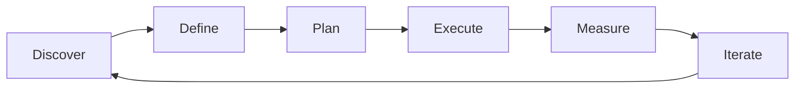

# Agile & Scrum — A 2-Day Crash Course

> **In one sentence:** Scrum is a lightweight framework for delivering complex products in
> short, predictable cycles called sprints — giving teams a rhythm to plan, build, review,
> and improve every one to four weeks.

> Cross-references: `Product-Management-Fundamentals.md` (the PM role within Scrum),
> `User-Stories-Requirements.md` (what goes into the backlog), `Kanban.md` (the flow-based
> alternative), `Stakeholder-Management.md` (who attends sprint reviews).

---

## Part 0 — Why Scrum exists

Before Scrum, software projects followed the waterfall model: gather all requirements up
front, design everything, build everything, test everything, then ship. The problem was that
by the time you shipped — often 12 to 18 months later — the world had moved on. Requirements
had changed, users wanted something different, and half the assumptions you made in month one
were wrong by month twelve. You built the right thing for a world that no longer existed.

Scrum exists to shorten the feedback loop. Instead of one massive delivery, you deliver small
increments every one to four weeks. At the end of each sprint, you have working software you
can show to real users. They tell you what is right, what is wrong, and what they actually
need. You adjust. The next sprint incorporates what you learned. Over time, this loop of
build → review → learn → adjust converges on the right product far faster than any up-front
plan could.

The one idea that makes Scrum work: **inspect and adapt.** Every ceremony, every artefact, and
every role exists to create moments where the team looks at reality, compares it to the plan,
and adjusts. If you strip away everything else, Scrum is a structured way to learn from what
just happened and change what happens next.

**Mental model:** Scrum is a GPS navigator. Waterfall gives you printed directions before you
leave — if the road is closed, you are stuck. Scrum recalculates every few kilometres. It does
not know the perfect route in advance, but it continuously corrects based on where you actually
are. The sprint is the recalculation interval.

---




## Part 1 — The vocabulary

| Term | Meaning |
|------|---------|
| **Sprint** | A fixed time-box (typically 2 weeks) in which the team commits to delivering a set of work items |
| **Product Backlog** | The ordered list of everything that could be built — owned and prioritised by the Product Owner |
| **Sprint Backlog** | The subset of the product backlog the team commits to completing in the current sprint |
| **Increment** | The working, potentially shippable product at the end of a sprint — all completed items combined |
| **Product Owner (PO)** | Owns the backlog, decides what to build and in what order, represents the user and business |
| **Scrum Master (SM)** | Facilitates the process, removes impediments, coaches the team on Scrum practices — not a manager |
| **Development Team** | The cross-functional group that builds the increment — self-organising, typically 3-9 people |
| **Story points** | A relative estimate of effort, complexity, and uncertainty — not hours, not days |
| **Velocity** | The average number of story points a team completes per sprint — used for forecasting, not performance evaluation |
| **Definition of Done (DoD)** | The team-wide checklist that every item must satisfy before it can be called complete |

The key distinction: **the Product Owner decides *what* to build. The Development Team decides
*how* to build it. The Scrum Master ensures the process works.** No one role overrules the
others. This separation of concerns is what makes Scrum teams self-organising.

---

## DAY 1 — Run your first sprint

### 1. The sprint cycle

Every sprint follows the same rhythm:

```text
Sprint Planning (start of sprint)
     |
Daily Standup (every day)
     |
Development work (the sprint)
     |
Sprint Review (end of sprint — show what you built)
     |
Sprint Retrospective (end of sprint — improve how you work)
     |
Next Sprint Planning...
```

This cycle repeats indefinitely. The power is in the repetition — the team builds a rhythm
and gets better at each ceremony over time.

### 2. Sprint planning

Sprint planning answers two questions: *what* will we deliver this sprint, and *how* will we
deliver it?

```text
# Sprint planning structure (2-4 hours for a 2-week sprint)

Part 1 — What (PO leads):
  - PO presents the top-priority items from the product backlog
  - Team asks clarifying questions
  - Team selects items they believe they can complete
  - Selection is based on velocity (historical average)

Part 2 — How (team leads):
  - Team breaks selected stories into tasks
  - Team identifies dependencies and risks
  - Team confirms the sprint goal — one sentence summarising
    the outcome the sprint is aiming for

Output: Sprint backlog + sprint goal
```

The sprint goal matters more than the individual stories. It gives the team a north star: if
scope must be cut mid-sprint, the team can negotiate which stories to drop while still
achieving the goal.

### 3. The daily standup

Fifteen minutes, same time every day, standing up (to keep it short):

```text
Each team member answers three questions:
  1. What did I complete yesterday?
  2. What will I work on today?
  3. What is blocking me?

Rules:
  - Not a status report to the Scrum Master or PO
  - It is a coordination meeting for the team
  - Discussions go offline — "let us talk after standup"
  - Start on time even if people are missing
```

The standup is not a reporting ceremony. It is a synchronisation point. If the team leaves
the standup knowing what everyone is working on and what is stuck, it worked.

### 4. Estimating with story points

Story points measure relative effort, not absolute time:

```text
# Fibonacci scale (most common)
1  — trivial change, well-understood
2  — small, straightforward
3  — moderate, some complexity
5  — significant effort, some unknowns
8  — large, high complexity or uncertainty
13 — very large — consider splitting
21 — epic-sized — must be split before sprint

# How to estimate (planning poker)
1. PO reads the story and acceptance criteria
2. Team discusses briefly (2-3 minutes max)
3. Everyone simultaneously reveals their estimate
4. Highest and lowest explain their reasoning
5. Team converges on a number (usually 1-2 rounds)
```

Story points work because humans are bad at absolute estimation ("this will take 3.5 days")
but good at relative comparison ("this is about twice as hard as that other thing we did").

### 5. Definition of Done

The DoD is a shared checklist that prevents "it works on my machine" from counting as done:

```text
# Example Definition of Done
- [ ] Code written and peer-reviewed
- [ ] Unit tests written and passing
- [ ] Integration tests passing
- [ ] No known defects
- [ ] Documentation updated
- [ ] Deployed to staging environment
- [ ] Product Owner has accepted the story
- [ ] Meets accessibility standards
```

If a story does not meet every item on the DoD, it is not done — it does not count toward
velocity, and it does not go into the sprint review.

### 6. By end of Day 1 you can:

- Explain the sprint cycle and each ceremony's purpose
- Run a sprint planning session
- Facilitate a daily standup
- Estimate stories using story points and planning poker
- Define and apply a Definition of Done

---

## DAY 2 — Make it real

### 7. Sprint review

The sprint review is a demo of what the team built, shown to stakeholders:

```text
# Sprint review structure (1 hour for a 2-week sprint)

1. Sprint goal recap           (5 min)  — what did we set out to do?
2. Demo of completed work      (30 min) — show working software
3. What was not completed      (5 min)  — and why, briefly
4. Stakeholder feedback        (15 min) — reactions, questions, ideas
5. Backlog impact              (5 min)  — how does feedback change
                                          what comes next?

Rules:
  - Demo real software, not slides
  - Incomplete items are not shown (they are not done)
  - Feedback is captured, not debated — debate happens in refinement
```

The sprint review is the team's moment of accountability. It is also the most powerful
stakeholder alignment tool you have — see `Stakeholder-Management.md` for how to use it.

### 8. Sprint retrospective

The retro is where the team improves its own process:

```text
# Retro structure (1-1.5 hours for a 2-week sprint)

1. What went well?          — celebrate, reinforce good practices
2. What did not go well?    — identify friction without blame
3. What will we change?     — pick 1-2 concrete actions for next sprint

Rules:
  - Safe space — no blame, no judgement
  - Focus on process, not people
  - Actions must be specific and assignable
  - Review last retro's actions first — did we follow through?
```

The retro only works if the team actually changes something. A retro that identifies problems
but produces no action items is theatre. Pick one or two changes, try them next sprint, and
evaluate at the next retro.

### 9. Velocity and forecasting

Velocity is the average story points completed per sprint over the last 3-5 sprints:

```text
Sprint 10: 24 points
Sprint 11: 28 points
Sprint 12: 22 points
Sprint 13: 26 points
Sprint 14: 25 points
Average velocity: 25 points/sprint

Forecast: 75 points of remaining work / 25 points per sprint = ~3 sprints
```

Velocity is a **planning tool**, not a **performance metric**:
- Do not compare velocity across teams (points are relative to each team)
- Do not use velocity to pressure teams ("you did 25 last sprint, why only 22 this sprint?")
- Do not inflate points to look productive — this destroys the tool's usefulness
- Velocity stabilises after 3-5 sprints — do not trust early numbers

### 10. The three roles in depth

**Product Owner:**
- Owns the product backlog — sole authority on priority order
- Writes or approves user stories and acceptance criteria
- Available to the team during the sprint for clarification
- Accepts or rejects completed work against the DoD
- Does NOT assign tasks or manage the team's daily work

**Scrum Master:**
- Facilitates ceremonies (planning, standup, review, retro)
- Removes impediments — anything blocking the team that they cannot resolve themselves
- Coaches the team on Scrum practices and self-organisation
- Shields the team from external interruptions mid-sprint
- Does NOT assign work or make technical decisions

**Development Team:**
- Self-organising — decides who does what and how
- Cross-functional — has all skills needed to deliver an increment
- Collectively accountable for the sprint commitment
- Pulls work from the sprint backlog (nobody pushes work onto them)

### 11. Backlog refinement (grooming)

Refinement is the ongoing activity of keeping the backlog ready for future sprints:

```text
# Refinement session (1 hour per week, typically mid-sprint)

1. PO presents upcoming stories (next 1-2 sprints)
2. Team asks clarifying questions
3. Team estimates using story points
4. Stories are split if too large
5. Acceptance criteria are refined

Rule of thumb: the top 2 sprints' worth of backlog should always
be refined and ready to pull into sprint planning.
```

### 12. Common Scrum anti-patterns

| Anti-pattern | What it looks like | The fix |
|--------------|--------------------|---------|
| **Scrum-but** | "We do Scrum, but we skip retros" | Do all ceremonies. They exist for a reason |
| **Sprint stuffing** | Team commits to more than velocity supports | Use velocity as a hard cap, not a target |
| **Zombie stories** | Stories that carry over sprint after sprint | Split them. If a story survives 2 sprints, it is too big |
| **Estimation theatre** | Spending 30 minutes debating 3 vs 5 points | Time-box to 2 minutes per story. Close enough is enough |
| **PO absence** | PO unavailable during the sprint | PO must be reachable daily. Delegate to a proxy if needed |
| **Retro apathy** | "Nothing to discuss" every retro | Rotate formats. Use anonymous input. Review action follow-through |

---

## Worked example — a team's first three sprints

```text
Sprint 1 (the messy one):
  - Team commits to 30 points based on gut feeling
  - Completes 18 points — three stories not done
  - Retro: "We underestimated the payment integration story.
    Action: split any story over 8 points before committing."
  - Velocity: 18

Sprint 2 (finding rhythm):
  - Team commits to 22 points (conservative, based on Sprint 1)
  - Completes 24 points — pulled in one extra story mid-sprint
  - Retro: "Standups are running 25 minutes. Action: strict
    15-minute timer, discussions go to breakout rooms."
  - Velocity: (18 + 24) / 2 = 21

Sprint 3 (stabilising):
  - Team commits to 22 points
  - Completes 22 points exactly
  - Sprint review: stakeholders see real software for the third
    time. Feedback is now specific and actionable because they
    understand the team's cadence.
  - Retro: "Definition of Done needs 'accessibility check' added."
  - Velocity: (18 + 24 + 22) / 3 = 21.3

By Sprint 5, the team has a reliable velocity of ~22 points.
PM can now forecast: 88 points of remaining work = ~4 sprints.
```

---

## Common pitfalls

- **Treating the sprint as a mini-waterfall.** If all testing happens on the last day, you are
  doing waterfall in two-week batches. Test continuously throughout the sprint.
- **Skipping the retrospective.** The retro is where the team gets better. Without it, the same
  problems repeat every sprint. It is the single most important ceremony.
- **Using velocity as a performance metric.** The moment you reward higher velocity, teams
  inflate estimates. Velocity is for forecasting, not evaluation.
- **Changing scope mid-sprint.** Once the sprint starts, the commitment is fixed. New requests
  go into the product backlog for the next sprint. The only exception is a genuine emergency.
- **The PO who is never available.** If the Product Owner cannot answer questions during the
  sprint, the team guesses. Guesses are expensive. The PO must be reachable daily.
- **Skipping sprint planning.** A team that starts the sprint without a clear goal and a shared
  understanding of the stories will waste days on rework and misunderstanding.
- **Doing Scrum ceremonies without understanding why.** If the team does not know why they
  stand up every morning, the standup becomes a resentful status report. Teach the purpose
  before enforcing the practice.

---

## Quick reference

```text
# Sprint ceremonies
Sprint Planning    — start of sprint, 2-4 hours, what + how
Daily Standup      — every day, 15 minutes, sync + unblock
Sprint Review      — end of sprint, 1 hour, demo to stakeholders
Sprint Retro       — end of sprint, 1-1.5 hours, improve process
Backlog Refinement — mid-sprint, 1 hour/week, prepare future work

# The three roles
Product Owner  — owns what to build (backlog priority)
Scrum Master   — owns how the process works (facilitation)
Dev Team       — owns how to build it (self-organising)

# Story point scale (Fibonacci)
1 | 2 | 3 | 5 | 8 | 13 | 21
Anything over 8 = consider splitting

# Velocity formula
Average of last 3-5 sprints' completed points

# Forecast
Remaining points / velocity = estimated sprints to completion

# Definition of Done (example)
Code reviewed | Tests passing | Deployed to staging | PO accepted | Docs updated

# Sprint goal format
"By end of this sprint, [user type] can [capability] so that [outcome]"

# Anti-pattern check
No mid-sprint scope changes | PO available daily | Retro produces actions
Velocity not used for evaluation | Stories split below 8 points
```

---


## Top 10 Interview Questions

<details>
<summary><strong>Q: What is Agile Scrum and what problem does it solve?</strong></summary>

Agile Scrum addresses a specific need in modern engineering workflows. Understanding the core problem it solves — and the alternatives it replaced — is the foundation for every subsequent interview question. Frame your answer around the pain point first, then the solution.

</details>

<details>
<summary><strong>Q: How does Agile Scrum compare to its main alternatives?</strong></summary>

Every tool exists in an ecosystem of alternatives. Be prepared to articulate the specific tradeoffs: when Agile Scrum is the right choice, when an alternative is better, and what factors drive the decision (scale, team expertise, existing infrastructure, compliance requirements).

</details>

<details>
<summary><strong>Q: What are the most common production pitfalls with Agile Scrum?</strong></summary>

Production experience is what separates senior from junior engineers. Common pitfalls include: misconfiguration that works in dev but fails at scale, security oversights, inadequate monitoring, and operational procedures that are untested until an incident occurs. Cite specific examples from your experience.

</details>

<details>
<summary><strong>Q: How do you monitor and observe Agile Scrum in production?</strong></summary>

Key metrics to track, alerting thresholds to set, dashboards to build, and log patterns to watch. Production monitoring should cover: health/liveness, performance (latency, throughput), capacity (resource utilisation), and business impact (error rates affecting users). Explain which metrics are leading indicators versus lagging.

</details>

<details>
<summary><strong>Q: How do you scale Agile Scrum as load increases?</strong></summary>

Scaling strategies depend on the bottleneck: horizontal scaling (add more instances), vertical scaling (bigger instances), caching (reduce load), sharding (distribute data), and async processing (decouple components). Explain which approach applies to Agile Scrum and at what scale each strategy becomes necessary.

</details>

<details>
<summary><strong>Q: How do you handle security and access control with Agile Scrum?</strong></summary>

Security is non-negotiable in production. Cover: authentication and authorization mechanisms, secrets management (never in code), encryption (at rest and in transit), network security (firewalls, private networks), audit logging, and compliance requirements relevant to your industry.

</details>

<details>
<summary><strong>Q: How do you implement disaster recovery for Agile Scrum?</strong></summary>

DR planning requires defining RTO (recovery time objective) and RPO (recovery point objective), implementing backup strategies, testing restore procedures, and documenting runbooks. Explain your backup strategy, how you test restores, and what your recovery procedure looks like.

</details>

<details>
<summary><strong>Q: How do you automate Agile Scrum deployment and configuration management?</strong></summary>

Infrastructure as code, CI/CD pipelines, configuration management, and GitOps workflows. Explain how you version, test, deploy, and roll back changes. Cover: what is automated, what requires manual approval, and how you handle configuration drift.

</details>

<details>
<summary><strong>Q: How do you troubleshoot issues with Agile Scrum in production?</strong></summary>

A systematic debugging approach: check health endpoints, review recent changes (deploys, config changes), examine logs and metrics, reproduce the issue, identify root cause, fix, verify, and write a postmortem. Explain your actual debugging workflow with concrete examples.

</details>

<details>
<summary><strong>Q: What are the best practices for Agile Scrum that you have learned from experience?</strong></summary>

Best practices that go beyond documentation: lessons learned from production incidents, configuration patterns that prevent common issues, testing strategies that catch bugs before production, and operational procedures that reduce toil. Share specific examples where following (or not following) a best practice had measurable impact.

</details>

---

## Next steps after Day 2

- `Kanban.md` — the flow-based alternative when sprints feel too rigid
- `User-Stories-Requirements.md` — writing the stories that feed the backlog
- `Stakeholder-Management.md` — managing the people who attend your sprint review
- `Risk-Management.md` — identifying and mitigating delivery risks within sprints

---

## Recommended learning resources

**YouTube channels & playlists:**
- [Scrum.org](https://www.youtube.com/@Scrumorg) — official Scrum content including Professional Scrum training walkthroughs
- [Mountain Goat Software — Mike Cohn](https://www.youtube.com/@MountainGoatSoftware) — practical Scrum advice on estimation, planning, and backlog management
- [Atlassian Agile Coach](https://www.youtube.com/@Atlassian) — visual walkthroughs of Scrum ceremonies and Jira-based workflows
- [Henrik Kniberg](https://www.youtube.com/@HenrikKniberg1) — "Scrum and XP from the Trenches" talks and the Spotify model of agile scaling

**Official docs & blogs:**
- [The Scrum Guide (scrum.org)](https://scrumguides.org/) — the official, definitive 13-page guide by Schwaber and Sutherland
- [Agile Manifesto](https://agilemanifesto.org/) — the four values and twelve principles behind Scrum
- [Atlassian — Scrum Guide](https://www.atlassian.com/agile/scrum) — practical articles on every ceremony, role, and artefact
- [Mountain Goat Software Blog](https://www.mountaingoatsoftware.com/blog) — Mike Cohn's articles on story points, velocity, and sprint planning

## Recommended learning resources

**YouTube channels & playlists:**
- [Mountain Goat Software — Mike Cohn](https://www.youtube.com/@MountainGoatSoftware) — the original Scrum estimator; practical advice on sprint planning, user stories, and agile estimation
- [Scrum.org — Professional Scrum](https://www.youtube.com/@Scrumorg) — official Scrum Guide walkthroughs, PSM certification prep, and real-world Scrum case studies
- [Atlassian Agile Coach](https://www.youtube.com/@Atlassian) — visual guides to Scrum ceremonies, Jira workflows, and scaling agile in enterprise teams
- [Dave Farley — Continuous Delivery](https://www.youtube.com/@ContinuousDelivery) — engineering-focused perspective on how agile practices connect to software delivery performance

**Books & articles:**
- [Scrum Guide (official)](https://scrumguides.org/) — the canonical 13-page definition; read it yearly
- [Agile Estimating and Planning — Mike Cohn](https://www.mountaingoatsoftware.com/books/agile-estimating-and-planning) — the definitive guide to story points, velocity, and release planning
- [Atlassian Agile Coach](https://www.atlassian.com/agile) — free online guides covering every Scrum concept with visual examples

**The mantra:** Plan in short cycles, demo working software every sprint, inspect what happened, adapt how you work — and remember that the retrospective is the ceremony that makes all other ceremonies better.
