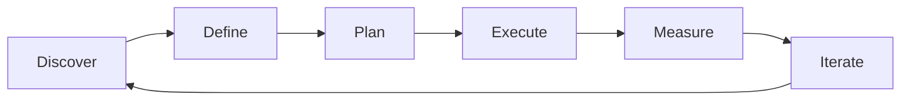

# Delivery & Execution — A 2-Day Crash Course

> **In one sentence:** Delivery and execution is the practice of getting software from "code
> complete" to "running in production" reliably — covering release planning, progressive rollout,
> go/no-go decisions, and what to do when things go wrong.

> Cross-references: `Sprint-Planning-Estimation.md` (how work gets sized and loaded into sprints),
> `Technical-Program-Management.md` (cross-team coordination for complex launches),
> `Product-Management-Fundamentals.md` (the PM's role in release decisions),
> `JIRA-Project-Tools.md` (tracking releases and versions).

---

## Part 0 — Why delivery and execution matters

Building software is only half the job. The other half is getting it to users safely. Teams that
are excellent at building but careless about releasing accumulate a graveyard of features that
were "done" but never reached production — or worse, reached production and broke something.

The gap between "it works on my machine" and "it works for every user in production" is where
outages, rollbacks, and lost trust live. Delivery and execution exist to close that gap
systematically. A good delivery practice means you can ship any time with confidence, roll back
in minutes if something goes wrong, and know exactly what changed when an incident occurs.

The one idea that unlocks delivery: **releasing is not an event — it is a pipeline.** When you
treat releases as big, scary events, you batch up changes, increase risk, and make rollbacks
harder. When you treat releasing as a continuous flow through a well-tested pipeline, each
release is small, safe, and reversible.

**Mental model:** Delivery is like a lock system on a canal. You do not open all the gates at
once and hope the water level is right. You move the ship through a series of chambers — each
one controlled, each one verified before opening the next gate. Feature flags are the gates.
Environments (staging, canary, production) are the chambers. The ship is your code.

---




## Part 1 — The vocabulary

| Term | Meaning |
|------|---------|
| **Release** | A version of the software made available to users. Can be a deployment (infrastructure change) or a feature activation (flag flip) |
| **Feature flag** | A toggle that controls whether a feature is visible to users, independent of deployment. Separates deploy from release |
| **Progressive delivery** | Rolling out a change gradually — canary → percentage ramp → full rollout — rather than all-at-once |
| **Go/no-go** | A decision point where stakeholders confirm readiness to proceed with a release, based on predefined criteria |
| **Rollback** | Reverting to the previous known-good state when a release causes problems. Must be fast and tested |
| **Deployment cadence** | How frequently the team deploys to production — daily, weekly, per-sprint, or continuous |
| **Canary release** | Routing a small percentage of traffic (1-5%) to the new version while monitoring for errors before expanding |
| **Launch checklist** | A structured list of prerequisites that must be verified before a release goes live |
| **Post-launch review** | A retrospective specifically focused on how the release went — what worked, what broke, what to improve |
| **Blue-green deployment** | Running two identical production environments, switching traffic from "blue" (current) to "green" (new) instantly |

The key distinction: **deployment is not the same as release.** You can deploy code to
production without releasing it to users (behind a feature flag). This separation is what makes
progressive delivery possible and safe.

---

## DAY 1 — Understand the delivery pipeline

### 1. The release spectrum

Teams sit on a spectrum of release maturity:

```text
Level 1: Manual releases    — someone runs a script, hopes it works
Level 2: Scheduled releases — deploy every sprint, with a checklist
Level 3: Continuous delivery — every merged PR can go to production
Level 4: Continuous deployment — every merged PR does go to production, automatically
```

Most teams should aim for Level 3 (continuous delivery). Level 4 requires exceptional test
coverage and monitoring. Levels 1-2 are where most pain lives — manual processes that are slow,
error-prone, and terrifying.

### 2. Feature flags: the unlock

Feature flags separate deployment from release. This single practice transforms delivery:

```text
Without flags:
  Code merged → deployed to production → users see it immediately
  Problem: if it breaks, you must redeploy to fix it

With flags:
  Code merged → deployed to production (flag off) → flag turned on for 5% → monitor →
  ramp to 25% → monitor → ramp to 100%
  Problem: if it breaks, flip the flag off in seconds
```

Types of feature flags:

| Type | Purpose | Lifespan |
|------|---------|----------|
| **Release flag** | Control rollout of a new feature | Days to weeks (remove after full rollout) |
| **Experiment flag** | A/B testing different variants | Weeks (remove after experiment concludes) |
| **Ops flag** | Kill switch for features under load | Permanent (e.g., disable non-critical features during traffic spikes) |
| **Permission flag** | Enable features for specific users/tenants | Permanent (e.g., premium features, beta access) |

⚠️ Feature flags are powerful but accumulate as tech debt. Every flag added is a flag that must
eventually be removed. Track flag lifecycle in your project tool and schedule cleanup.

### 3. Progressive delivery in practice

A progressive rollout for a new payment flow in a BFSI application:

```text
Step 1: Deploy to staging, run integration tests        (0% of users)
Step 2: Enable for internal employees only               (dogfooding)
Step 3: Enable for 1% of production traffic              (canary)
Step 4: Monitor error rates, latency, business metrics   (30 min)
Step 5: Ramp to 10%                                      (monitor 1 hour)
Step 6: Ramp to 50%                                      (monitor 4 hours)
Step 7: Ramp to 100%                                     (full rollout)

At any step: if error rate exceeds threshold, flip flag off (instant rollback)
```

The key metrics to watch during rollout:
- **Error rate** — is the new code throwing more errors than the old?
- **Latency** — is response time degrading?
- **Business metrics** — are conversion rates, transaction success rates, or key flows changing?
- **Resource usage** — is CPU/memory spiking unexpectedly?

### 4. Deployment strategies compared

| Strategy | How it works | Rollback speed | Risk | Best for |
|----------|-------------|----------------|------|----------|
| **Recreate** | Stop old, start new | Slow (redeploy) | High | Dev/staging environments |
| **Rolling** | Replace instances one by one | Medium | Medium | Stateless services |
| **Blue-green** | Switch traffic between two full environments | Fast (switch back) | Low | Critical services needing instant rollback |
| **Canary** | Route small % to new version | Fast (reroute) | Low | High-traffic services |
| **Feature flag** | Deploy everywhere, toggle visibility | Instant (flag flip) | Lowest | User-facing features |

For most teams, **rolling + feature flags** covers 90% of cases. Blue-green is worth the
infrastructure cost for services where even seconds of downtime are unacceptable.

### 5. By end of Day 1 you can:

- Explain the difference between deployment and release
- Design a progressive rollout plan using feature flags
- Choose the right deployment strategy for a given service
- Identify the key metrics to monitor during a rollout

---

## DAY 2 — Make it real

### 6. Release planning

Release planning sits between sprint planning (what we build this sprint) and roadmap planning
(what we build this quarter):

```text
Release planning answers:
  - What features go into this release?
  - What is the target date?
  - What are the dependencies and risks?
  - What is the rollback plan?
  - Who needs to know (support, marketing, customers)?

Release planning cadence options:
  - Per-sprint release: ship everything completed in the sprint
  - Train model: releases go out on a fixed schedule (e.g., every 2 weeks),
    features that are ready get on the train, those that aren't wait
  - Continuous: every merged PR ships when ready (requires mature CI/CD)
```

The train model works well for teams transitioning from infrequent releases. It provides
predictability without requiring continuous deployment maturity.

### 7. The go/no-go decision

A go/no-go is not a meeting where everyone says "looks good." It is a structured review against
predefined criteria:

```text
Go/no-go checklist:
  [ ] All stories in the release are Done (acceptance criteria met)
  [ ] Regression tests pass in staging
  [ ] Performance benchmarks within SLA (p95 latency, throughput)
  [ ] Security review completed (if applicable)
  [ ] Feature flags configured for progressive rollout
  [ ] Rollback procedure documented and tested
  [ ] Monitoring dashboards updated for new features
  [ ] On-call team briefed and aware of the release
  [ ] Customer-facing documentation updated
  [ ] Compliance sign-off obtained (BFSI: regulatory requirements met)

Decision: GO / NO-GO / CONDITIONAL GO (go with specific conditions)
Recorded by: [name, date, attendees]
```

A conditional go means "proceed, but with guardrails" — for example, "go, but hold at 10%
rollout until Monday when the full team is available."

### 8. Launch checklists by audience

Different roles need different pre-launch preparations:

```text
Engineering:
  [ ] Code merged to release branch
  [ ] CI pipeline green
  [ ] Database migrations tested (forward and backward)
  [ ] Feature flags configured with correct targeting rules
  [ ] Rollback tested in staging

Operations / SRE:
  [ ] Monitoring dashboards created
  [ ] Alerts configured for error rate and latency thresholds
  [ ] Runbook written or updated
  [ ] On-call handoff includes release context
  [ ] Capacity check — can infrastructure handle the load?

Product:
  [ ] Release notes drafted
  [ ] Support team briefed
  [ ] Customer communication scheduled (if breaking change)
  [ ] Analytics events verified in staging

Security (BFSI-critical):
  [ ] No secrets in code, config, or logs
  [ ] Audit trail captures all state changes
  [ ] Data handling complies with regulatory requirements
  [ ] Penetration test results reviewed (if new attack surface)
```

### 9. Rollback strategies

Every release must have a rollback plan. The plan depends on what changed:

```text
Code-only change:
  → Revert the commit, redeploy the previous version
  → Or: flip the feature flag off (instant, preferred)

Database migration:
  → Write backward-compatible migrations (add columns, don't remove them)
  → The old code must work with the new schema AND the new code with the old schema
  ⚠️ Destructive migrations (drop column, rename table) need a multi-phase approach:
     Phase 1: Deploy new code that handles both old and new schema
     Phase 2: Run migration
     Phase 3: Remove old-schema handling code

Configuration change:
  → Keep the previous config version in version control
  → Rollback = deploy previous config

Infrastructure change:
  → Blue-green: switch traffic back to the old environment
  → Rolling: reverse the rolling update
  → IaC (Terraform/Pulumi): apply previous state
```

The golden rule: **never make a change you cannot undo.** If a change is truly irreversible
(data migration, external API contract change), plan extra carefully and test extra thoroughly.

### 10. Post-launch review

Within 48 hours of a significant launch, run a post-launch review:

```text
Post-launch review agenda:
  1. What shipped? (factual summary)
  2. What went well? (keep doing)
  3. What went wrong? (improve)
  4. Metrics: did we hit the success criteria?
  5. Action items: who owns what by when?
```

This is not a retrospective about the sprint — it is specifically about the release process.
Did the rollout go smoothly? Did the checklist catch everything? Was the rollback plan adequate?
Were the right people informed at the right time?

### 11. Deployment cadence and team maturity

| Cadence | Prerequisites | Typical team |
|---------|--------------|-------------|
| **Monthly** | Manual QA, release branch, change advisory board | Enterprise, regulated industries starting out |
| **Per-sprint (bi-weekly)** | Automated regression tests, staging environment | Most product teams |
| **Weekly** | CI/CD pipeline, feature flags, automated rollback | Mature product teams |
| **Daily/continuous** | Trunk-based development, comprehensive test suite, observability | High-performing teams (DORA "Elite") |

Move toward higher frequency gradually. Each step requires investing in automation, testing, and
monitoring. Forcing daily deploys without the safety net is reckless, not agile.

---

## Worked example — releasing a new transaction-limits feature

```text
Context: A BFSI platform team has built a configurable transaction-limits
feature. Regulatory requirement: must be live by end of month. Team uses
two-week sprints with per-sprint releases.

1. Release planning (Sprint 8, Day 1):
   Features in this release:
   - Configurable transaction limits (the primary feature)
   - Updated audit logging for limit changes
   - Minor bug fix: incorrect timezone in transaction timestamps
   Release target: Sprint 8, Day 10 (Friday)

2. Pre-launch preparation (Sprint 8, Days 1-7):
   Engineering:
   - Feature flag "tx-limits-v2" created, targeting internal users first
   - Database migration adds new columns (backward-compatible, no drops)
   - Rollback tested: flag off returns users to legacy limit logic
   Operations:
   - Dashboard: "Transaction Limits v2" in Grafana with panels for
     error rate, limit-exceeded events, and p95 latency
   - Alert: error rate > 1% for tx-limits-v2 flagged users → page on-call
   - Runbook: "If alert fires, disable tx-limits-v2 flag in LaunchDarkly"
   Security:
   - Audit trail verified: every limit change logged with user, timestamp,
     old value, new value
   - No secrets in configuration — limit thresholds from database, not env vars

3. Go/no-go meeting (Sprint 8, Day 8):
   Checklist reviewed. All items green.
   Decision: GO with progressive rollout.
   Attendees: PM, EM, TPM, QA lead, security engineer.

4. Progressive rollout (Sprint 8, Days 8-10):
   Day 8 AM:  Deploy to production (flag off for all external users)
   Day 8 PM:  Enable flag for internal employees — dogfood for 4 hours
   Day 9 AM:  Ramp to 5% of production traffic — monitor for 2 hours
   Day 9 PM:  Ramp to 25% — monitor error rate and limit-exceeded patterns
   Day 10 AM: Ramp to 100% — full rollout
   All metrics nominal throughout. No rollback needed.

5. Post-launch review (following Monday):
   What went well: progressive rollout caught a minor UI glitch at 5%
   (timezone display), fixed before ramping further.
   What to improve: runbook lacked specific LaunchDarkly steps — updated.
   Metrics: limit-exceeded events tracking correctly, audit log complete.
   Compliance: regulatory requirement met 3 days before deadline.
```

---


## Terminal Demo

```terminal-demo
# delivery@metrics ~ %

$ echo "DORA Metrics (last 30 days)"
Deployment Frequency:    4.2 per day (Elite)
Lead Time for Changes:   2.3 hours (Elite)
Change Failure Rate:     3.2% (Elite)
MTTR:                    18 minutes (Elite)

$ echo "Release Train"
Release v2.1.0: Jun 2 (today)
  Features: 12 stories
  Bug fixes: 5
  Tests: 4,567 passing
  Canary: 5% traffic for 2h -> no errors -> promote to 100%

$ echo "Deployment Pipeline"
Commit → Lint (22s) → Test (1m45s) → Build (58s) → Security (35s) → Deploy staging (45s) → E2E (2m) → Canary prod (2h) → Full prod
Total: ~2.5 hours from commit to production
```

---

## Common pitfalls

- **Big-bang releases.** Batching three months of work into one release maximises risk and
  makes rollback nearly impossible. Ship small, ship often.
- **Deploying on Friday afternoon.** If something breaks, your team is unavailable for the
  weekend. Deploy early in the week when the full team can respond.
- **Feature flags without cleanup.** Every flag you add is tech debt until removed. Track flag
  age and schedule removal sprints. A codebase with 200 stale flags is unmaintainable.
- **Skipping the rollback test.** "We can always roll back" is not a rollback plan. Test the
  rollback in staging before every significant release.
- **No one watching after deploy.** Deploying and walking away means you discover problems when
  users report them. Watch dashboards for at least 30 minutes after any production change.
- **Conflating deployment with release.** If you can only release by deploying, you have no
  safety net. Feature flags give you the ability to release and un-release without touching
  infrastructure.
- **Ignoring database migration rollback.** A forward-only migration that drops a column means
  you cannot roll back the code that depended on it. Always write migrations that are
  backward-compatible.
- **Not briefing the on-call team.** The person paged at 2 AM should not be learning about
  your release for the first time from an alert. Brief them before you ship.

---

## Quick reference

```text
# Deployment strategies
Recreate:      stop old → start new (downtime, simple)
Rolling:        replace instances one by one (zero-downtime)
Blue-green:    switch traffic between two environments (instant rollback)
Canary:        route small % to new version (gradual validation)
Feature flag:  deploy everywhere, toggle visibility (instant rollback)

# Progressive rollout template
Internal → 1% canary → 10% → 25% → 50% → 100%
Monitor at each step: error rate, latency, business metrics, resource usage

# Go/no-go checklist summary
Stories done → Tests pass → Perf OK → Security reviewed → Flags configured →
Rollback tested → Monitoring live → On-call briefed → Compliance signed off

# Feature flag lifecycle
Create → Configure targeting → Enable (progressive) → Full rollout →
Remove flag from code → Delete flag from service → Done

# Rollback decision tree
Code change?           → flip feature flag off (instant) or redeploy previous version
Database migration?    → backward-compatible migrations only; multi-phase for destructive changes
Config change?         → deploy previous config from version control
Infrastructure change? → blue-green switch or IaC rollback

# Post-launch review agenda
What shipped → What went well → What went wrong → Metrics check → Action items

# Deployment cadence progression
Monthly → Per-sprint → Weekly → Daily/continuous
(Each step requires more automation, testing, and monitoring)

# Release planning models
Per-sprint: ship what's done each sprint
Train:      fixed schedule, features board if ready
Continuous: every merge ships when ready
```

---


## Top 10 Interview Questions

<details>
<summary><strong>Q: What is Delivery Execution and what problem does it solve?</strong></summary>

Delivery Execution addresses a specific need in modern engineering workflows. Understanding the core problem it solves — and the alternatives it replaced — is the foundation for every subsequent interview question. Frame your answer around the pain point first, then the solution.

</details>

<details>
<summary><strong>Q: How does Delivery Execution compare to its main alternatives?</strong></summary>

Every tool exists in an ecosystem of alternatives. Be prepared to articulate the specific tradeoffs: when Delivery Execution is the right choice, when an alternative is better, and what factors drive the decision (scale, team expertise, existing infrastructure, compliance requirements).

</details>

<details>
<summary><strong>Q: What are the most common production pitfalls with Delivery Execution?</strong></summary>

Production experience is what separates senior from junior engineers. Common pitfalls include: misconfiguration that works in dev but fails at scale, security oversights, inadequate monitoring, and operational procedures that are untested until an incident occurs. Cite specific examples from your experience.

</details>

<details>
<summary><strong>Q: How do you monitor and observe Delivery Execution in production?</strong></summary>

Key metrics to track, alerting thresholds to set, dashboards to build, and log patterns to watch. Production monitoring should cover: health/liveness, performance (latency, throughput), capacity (resource utilisation), and business impact (error rates affecting users). Explain which metrics are leading indicators versus lagging.

</details>

<details>
<summary><strong>Q: How do you scale Delivery Execution as load increases?</strong></summary>

Scaling strategies depend on the bottleneck: horizontal scaling (add more instances), vertical scaling (bigger instances), caching (reduce load), sharding (distribute data), and async processing (decouple components). Explain which approach applies to Delivery Execution and at what scale each strategy becomes necessary.

</details>

<details>
<summary><strong>Q: How do you handle security and access control with Delivery Execution?</strong></summary>

Security is non-negotiable in production. Cover: authentication and authorization mechanisms, secrets management (never in code), encryption (at rest and in transit), network security (firewalls, private networks), audit logging, and compliance requirements relevant to your industry.

</details>

<details>
<summary><strong>Q: How do you implement disaster recovery for Delivery Execution?</strong></summary>

DR planning requires defining RTO (recovery time objective) and RPO (recovery point objective), implementing backup strategies, testing restore procedures, and documenting runbooks. Explain your backup strategy, how you test restores, and what your recovery procedure looks like.

</details>

<details>
<summary><strong>Q: How do you automate Delivery Execution deployment and configuration management?</strong></summary>

Infrastructure as code, CI/CD pipelines, configuration management, and GitOps workflows. Explain how you version, test, deploy, and roll back changes. Cover: what is automated, what requires manual approval, and how you handle configuration drift.

</details>

<details>
<summary><strong>Q: How do you troubleshoot issues with Delivery Execution in production?</strong></summary>

A systematic debugging approach: check health endpoints, review recent changes (deploys, config changes), examine logs and metrics, reproduce the issue, identify root cause, fix, verify, and write a postmortem. Explain your actual debugging workflow with concrete examples.

</details>

<details>
<summary><strong>Q: What are the best practices for Delivery Execution that you have learned from experience?</strong></summary>

Best practices that go beyond documentation: lessons learned from production incidents, configuration patterns that prevent common issues, testing strategies that catch bugs before production, and operational procedures that reduce toil. Share specific examples where following (or not following) a best practice had measurable impact.

</details>

---


## Quick Quiz

Test your understanding with these rapid-fire questions (answers hidden):

<details>
<summary>1. What is the ONE core problem that Delivery Execution solves?</summary>
Re-read Part 0 — the mental model section. If you can explain the "why" in one sentence, you understand the foundation.
</details>

<details>
<summary>2. Name the 3 most important terms from the vocabulary section.</summary>
Review Part 1. These are the building blocks every conversation about Delivery Execution uses.
</details>

<details>
<summary>3. What is the first thing you would set up on Day 1?</summary>
Check the Day 1 section — the very first hands-on step that gets you a working result.
</details>

<details>
<summary>4. What is the most common production pitfall with Delivery Execution?</summary>
Review the Common Pitfalls section. The first item listed is typically the most frequently encountered.
</details>

<details>
<summary>5. How does Delivery Execution compare to its closest alternative?</summary>
Check the Comparison Matrix below — focus on the key differentiating row.
</details>


## Comparison Matrix

| Dimension | DORA Metrics | Velocity | Throughput |
|-----------|--------------|----------|------------|
| **Primary use case** | Core strength of DORA Metrics | Core strength of Velocity | Core strength of Throughput |
| **Learning curve** | Moderate | Varies | Varies |
| **Community/ecosystem** | Active | Active | Growing |
| **Operational complexity** | Medium | Varies | Varies |
| **Best for** | See Part 0 | Different tradeoffs | Different tradeoffs |

> **How to read this matrix:** no tool wins on every dimension. Pick based on your specific constraints — team expertise, existing infrastructure, scale requirements, and compliance needs. The right choice is the one that fits your context, not the one with the most checkmarks.

## Next steps after Day 2

- `Technical-Program-Management.md` — cross-team coordination for complex, multi-team launches
- `Sprint-Planning-Estimation.md` — how work gets sized and loaded before delivery begins
- `Product-Management-Fundamentals.md` — the PM's role in deciding what goes into a release
- `JIRA-Project-Tools.md` — tracking release versions and deployment status

---

## Recommended learning resources

**YouTube channels & playlists:**
- [Dave Farley — Continuous Delivery](https://www.youtube.com/@ContinuousDelivery) — the definitive channel on deployment strategies, release management, and continuous delivery principles
- [GitHub Official](https://www.youtube.com/@GitHub) — feature flags, GitHub Actions for CI/CD, and progressive delivery workflows
- [LeadDev](https://www.youtube.com/@LeadDev) — engineering leadership talks on release processes, deployment culture, and delivery metrics

**Official docs & references:**
- [Atlassian — Release Management](https://www.atlassian.com/agile/software-development/release-management) — practical guide to planning and executing releases
- [Martin Fowler — Feature Toggles](https://martinfowler.com/articles/feature-toggles.html) — the canonical article on feature flag patterns and categories
- [DORA Metrics (dora.dev)](https://dora.dev/) — the four key metrics for measuring delivery performance (deployment frequency, lead time, change failure rate, recovery time)

## Recommended learning resources

**YouTube channels & playlists:**
- [Dave Farley — Continuous Delivery](https://www.youtube.com/@ContinuousDelivery) — delivery performance, deployment pipelines, and DORA metrics in practice
- [Atlassian Agile Coach](https://www.youtube.com/@Atlassian) — sprint execution, burndown interpretation, and delivery cadence optimisation

**Books & articles:**
- [Accelerate — Forsgren, Humble, Kim](https://itrevolution.com/product/accelerate/) — the research behind DORA metrics and what drives software delivery performance
- [The Phoenix Project — Gene Kim et al.](https://itrevolution.com/product/the-phoenix-project/) — DevOps novel illustrating delivery bottlenecks and the Three Ways

**The mantra:** Deploy small, release gradually, watch the dashboards, and always have a tested path back — releasing should be boring, not brave.
