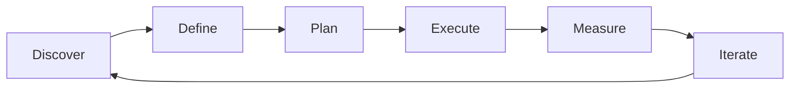

# JIRA & Project Tools — A 2-Day Crash Course

> **In one sentence:** JIRA is the dominant project-tracking tool for software teams — learning
> its data model, query language, and board configuration lets you manage work visibly instead of
> managing it in your head.

> Cross-references: `Agile-Scrum.md` (the methodology JIRA boards implement),
> `Sprint-Planning-Estimation.md` (how work gets sized and loaded), `Delivery-Execution.md`
> (release planning and launch tracking), `Product-Management-Fundamentals.md` (the PM role in
> backlog management).

---

## Part 0 — Why JIRA and project tools exist

Work that lives in people's heads is invisible work. Invisible work cannot be prioritised,
cannot be tracked, and cannot be handed off when someone goes on holiday. When a team of five
grows to a team of fifteen, "I'll just remember what everyone is doing" stops working. Deadlines
slip because nobody saw the dependency. Two engineers build the same thing because neither knew
the other had started.

Project tools exist to make work visible: who is doing what, what is blocked, what is next, and
how much is left. JIRA is the most widely adopted tool in this space — not because it is the
simplest, but because its data model (projects, issue types, workflows, boards) maps onto how
most software teams actually organise work.

The one idea that unlocks JIRA: **everything is an issue, and every issue moves through a
workflow.** Once you understand that an epic, a story, a bug, and a subtask are all just issues
with different types and different positions in a hierarchy, JIRA's complexity becomes navigable.

**Mental model:** JIRA is a kanban board bolted onto a database. The board is what you look at
daily — cards moving from left to right. The database underneath is what lets you query, report,
and slice that work in any dimension you need: by team, by epic, by sprint, by label, by
custom field. The board is the view; the database is the power.

---




## Part 1 — The vocabulary

| Term | Meaning |
|------|---------|
| **Issue** | Any trackable unit of work — story, bug, task, subtask, epic. The atomic unit of JIRA |
| **Epic** | A large body of work that spans multiple sprints, containing many stories. The coarsest level of the hierarchy |
| **Story** | A user-facing unit of value: "As a user, I want X so that Y." Typically completable in one sprint |
| **Subtask** | A technical breakdown of a story — useful for tracking within the team, not visible to stakeholders |
| **Workflow** | The set of statuses an issue moves through (e.g., To Do → In Progress → In Review → Done) and the transition rules between them |
| **Board** | A visual representation of work — either Scrum (sprint-based) or Kanban (flow-based) |
| **JQL** (JIRA Query Language) | A SQL-like language for filtering and finding issues: `project = PAY AND status = "In Progress" AND assignee = currentUser()` |
| **Sprint** | A fixed timebox (typically 2 weeks) in a Scrum board. Issues are added to a sprint during planning and tracked through it |
| **Component** | A logical grouping within a project (e.g., "API", "Frontend", "Auth") used for filtering and assignment |
| **Dashboard** | A customisable page of gadgets (charts, filters, lists) that gives a snapshot of project health |

---

## DAY 1 — Get productive with JIRA

### 1. The issue hierarchy

JIRA's hierarchy is simple once you see it:

```text
Initiative (optional, portfolio-level)
  └── Epic              — "User onboarding redesign"
        └── Story       — "Guided integration picker"
              └── Subtask — "Build recommendation API endpoint"
        └── Story       — "Progress indicator for setup steps"
        └── Bug         — "Setup wizard crashes on Safari 16"
```

**Epics** group related stories around a theme or feature. They span sprints and sometimes
quarters. **Stories** are the unit of planning — small enough to finish in a sprint, large
enough to deliver user value. **Subtasks** break a story into technical work items.

Do not over-nest. Most teams need only Epic → Story → Subtask. Adding more levels creates
bureaucracy without adding clarity.

### 2. Writing effective issues

A good JIRA issue answers three questions: what, why, and how do we know it is done.

```text
Title:       Clear, scannable, starts with a verb or noun
             Good: "Add retry logic to payment gateway client"
             Bad:  "Payment issue"

Description: Context (why this matters)
             Acceptance criteria (how we know it is done)
             Technical notes (constraints, dependencies)
             Links to design docs or Confluence pages

Labels:      Use sparingly for cross-cutting concerns (security, tech-debt)
Components:  Use for team/area ownership (API, Frontend, Infra)
Priority:    Critical / High / Medium / Low — define what each means for your team
```

### 3. Workflows: the state machine

Every issue type has a workflow. The default is simple:

```text
To Do → In Progress → Done
```

Most teams customise it:

```text
Backlog → Ready → In Progress → In Review → QA → Done
```

Keep workflows lean. Every status you add is a status someone must remember to update. If your
workflow has eight statuses and issues routinely skip three of them, you have too many statuses.

Workflow rules you should configure:
- **Validators** — require fields before transition (e.g., must have a reviewer before moving to
  "In Review")
- **Conditions** — restrict who can transition (e.g., only QA can move to "Done")
- **Post-functions** — automate side effects (e.g., auto-assign to reporter when moved to "QA")

### 4. Boards: Scrum vs Kanban

| Aspect | Scrum board | Kanban board |
|--------|-------------|--------------|
| **Timeboxing** | Work in sprints (1-4 weeks) | Continuous flow, no sprints |
| **Planning** | Sprint planning ceremony loads work | Items pulled as capacity opens |
| **Metrics** | Velocity (points/sprint) | Cycle time, throughput |
| **WIP limits** | Implicit (sprint capacity) | Explicit (column limits) |
| **Best for** | Feature teams with regular releases | Support teams, maintenance, ops |

Choose Scrum when you need predictable delivery cadence. Choose Kanban when work arrives
unpredictably and you need fast flow.

### 5. JQL fundamentals

JQL is what makes JIRA powerful beyond the board view. Learn these patterns:

```text
# My open work
assignee = currentUser() AND status != Done

# Unassigned bugs in the current sprint
project = PAY AND type = Bug AND assignee is EMPTY AND sprint in openSprints()

# Stories completed last sprint
project = PAY AND type = Story AND status = Done AND sprint in closedSprints()
  ORDER BY resolved DESC

# High-priority items created in the last 7 days
priority in (Critical, High) AND created >= -7d ORDER BY created DESC

# Overdue items
due < now() AND status != Done
```

JQL operators to know: `=`, `!=`, `in`, `not in`, `is EMPTY`, `is not EMPTY`, `~` (contains
text), `>=`, `<=`, `AND`, `OR`, `ORDER BY`.

### 6. By end of Day 1 you can:

- Create well-structured issues with the right hierarchy
- Read and write basic JQL queries to find anything in your project
- Understand the difference between Scrum and Kanban boards
- Navigate workflows and know what each status means

---

## DAY 2 — Make it real

### 7. Board configuration that works

A well-configured board reduces daily friction:

**Column mapping:** Map workflow statuses to board columns. Merge statuses that do not need
separate visual lanes (e.g., "In Review" and "QA" can share a "Validating" column if your team
does not distinguish them).

**Swimlanes:** Group cards by epic, assignee, or priority. Epic swimlanes are useful during
sprint reviews. Assignee swimlanes help standup go faster.

**Quick filters:** Add buttons for common slices — "My items", "Bugs only", "Blocked items".
These use JQL under the hood: `assignee = currentUser()`, `type = Bug`, `flagged = impediment`.

**WIP limits (Kanban):** Set column limits to prevent overloading. A team of 5 should not have
12 items "In Progress." Start with WIP = team size + 1, then tighten.

### 8. Dashboards and reporting

Build dashboards for different audiences:

```text
Team dashboard:
  - Sprint burndown chart
  - Sprint health gadget (scope changes)
  - Filter results: current sprint issues
  - Activity stream

Stakeholder dashboard:
  - Epic progress bars
  - Version release status
  - Created vs resolved trend (14 days)
  - Pie chart: issues by priority

Engineering lead dashboard:
  - Velocity chart (last 6 sprints)
  - Cycle time control chart
  - Bug creation vs resolution trend
  - Component workload distribution
```

### 9. Confluence integration

JIRA and Confluence pair naturally:

- **Link JIRA issues from Confluence pages** — design docs, PRDs, and runbooks should reference
  the issues that implement them.
- **JIRA issue macro in Confluence** — embed a live table of issues on any page using JQL. Your
  sprint review page can show all completed stories automatically.
- **Confluence page links in JIRA** — attach the spec or design doc directly to the epic.

The pattern: Confluence holds the *why* and the *how* (specs, designs, decisions). JIRA holds
the *what* and the *when* (issues, sprints, releases). Link them so neither is orphaned.

### 10. Automation rules

JIRA automation reduces manual status management:

```text
Useful automation rules:
- When all subtasks are Done → move parent story to Done
- When a pull request is merged → move issue to "In Review"
- When an issue is moved to "In Progress" → assign to the person who transitioned it
- When a bug is created with priority Critical → send Slack notification to #incidents
- When sprint starts → post sprint goal to #team-channel
```

Set these up in Project Settings → Automation. Start with 2-3 rules and add more as you
identify repetitive manual steps.

### 11. Alternatives to JIRA

JIRA is powerful but heavy. Know your options:

| Tool | Strengths | Best for |
|------|-----------|----------|
| **Linear** | Fast, keyboard-driven, opinionated defaults, clean UI | Startups and small teams who value speed |
| **Shortcut** (formerly Clubhouse) | Balance of power and simplicity, good API | Mid-size teams wanting JIRA features without JIRA complexity |
| **GitHub Projects** | Native to GitHub, free, tight PR integration | Teams already living in GitHub who want lightweight tracking |
| **Azure DevOps Boards** | Deep Azure/Microsoft integration, enterprise features | Microsoft-stack enterprises |
| **Notion** | Flexible databases, good for docs + tracking in one place | Small teams, non-engineering stakeholders |

The migration question: if your team spends more time configuring JIRA than using it, consider a
simpler tool. If you need advanced workflows, custom fields, and enterprise reporting, JIRA
earns its complexity.

### 12. JIRA hygiene practices

- **Groom the backlog weekly.** Stale issues create noise. If an issue has been in the backlog
  for 6 months untouched, close it or re-evaluate.
- **Use labels consistently.** Agree on a label taxonomy and document it. Random labels are worse
  than no labels.
- **Archive completed sprints.** Keep the board focused on current work.
- **Limit custom fields.** Every custom field is a field someone must fill in. Add them only when
  you will actually filter or report on the data.
- **Review workflows quarterly.** If a status is routinely skipped, remove it.

---

## Worked example — setting up a new project for an API platform team

```text
Context: A BFSI platform team is starting a new project to build a
transaction-reconciliation API. Five engineers, two-week sprints.

1. Create the project:
   - Project type: Scrum (team wants sprint cadence)
   - Key: RECON
   - Default issue types: Epic, Story, Bug, Subtask, Spike

2. Configure the workflow:
   Backlog → Ready → In Progress → In Review → QA → Done
   - "Ready" requires: acceptance criteria filled, design linked
   - "In Review" requires: PR link attached
   - "Done" auto-resolves the issue

3. Set up the board:
   Columns: Backlog | Ready | In Progress | Review/QA | Done
   Swimlanes: by Epic
   Quick filters: "My Work", "Bugs", "Blocked"

4. Create the epic structure:
   RECON-1: "Core reconciliation engine"
   RECON-2: "Bank statement ingestion"
   RECON-3: "Discrepancy reporting dashboard"
   RECON-4: "Audit trail and compliance logging"

5. Write the first stories under RECON-1:
   RECON-5: "Parse incoming transaction feed (CSV and ISO 20022)"
   RECON-6: "Match transactions by reference ID with configurable tolerance"
   RECON-7: "Flag unmatched transactions for manual review"
   Each has: description, acceptance criteria, component (API), estimate (5, 8, 5)

6. Build the team dashboard:
   - Sprint burndown
   - Created vs resolved (30 days)
   - Epic progress bars
   - Unassigned issues filter

7. First sprint planning: load RECON-5, RECON-6, and three smaller stories
   totalling 34 points against a team velocity of 36.
   Sprint goal: "Core matching engine processes sample bank data end-to-end."
```

---

## Common pitfalls

- **Over-engineering the workflow.** Eight statuses with transition conditions on every arrow
  means nobody updates their tickets. Start simple, add complexity only when pain demands it.
- **Using JIRA as a communication tool.** A comment on a ticket is not a conversation. Complex
  discussions belong in Slack, a meeting, or a Confluence page — then summarise the decision in
  the ticket.
- **Tracking everything as a story.** Not all work is user-facing. Use task for internal work,
  spike for research, and bug for defects. Mixing types muddies your metrics.
- **Ignoring JQL.** Clicking through the board works for one team. Once you manage across
  multiple teams or need cross-project reporting, JQL is the only way. Learn it early.
- **Creating issues that only the author understands.** "Fix the thing" with no description is
  a future mystery. Write for the person who will pick this up after you go on leave.
- **Never closing stale issues.** A backlog with 400 items is not a backlog — it is a graveyard.
  Review and close issues that are no longer relevant.
- **Customising JIRA per-person instead of per-team.** Everyone on the team should see the same
  board, same workflow, same columns. Personal views are fine; personal workflows are chaos.

---

## Quick reference

```text
# JQL essentials
assignee = currentUser() AND status != Done          # my open work
project = X AND sprint in openSprints()              # current sprint
type = Bug AND priority = Critical AND status != Done # open critical bugs
created >= -7d AND project = X                       # new issues this week
due < now() AND status != Done                       # overdue items
resolved >= startOfSprint() AND project = X          # done this sprint
labels = tech-debt AND status = "To Do"              # tech debt backlog

# Issue hierarchy
Initiative → Epic → Story → Subtask
(Most teams: Epic → Story → Subtask is enough)

# Workflow template
Backlog → Ready → In Progress → In Review → QA → Done

# Board quick filters (JQL behind the button)
My Work:    assignee = currentUser()
Bugs:       type = Bug
Blocked:    flagged = impediment
No Assignee: assignee is EMPTY

# Automation rule templates
All subtasks Done     → move parent to Done
PR merged (via link)  → move issue to In Review
Priority = Critical   → notify #incidents channel
Sprint starts         → post sprint goal to Slack

# Tool comparison
JIRA:            powerful, complex, enterprise-grade
Linear:          fast, opinionated, startup-friendly
Shortcut:        balanced power and simplicity
GitHub Projects: lightweight, native to GitHub
Azure DevOps:    Microsoft ecosystem integration
```

---

## Top 10 Interview Questions

<details>
<summary><strong>Q: How do you structure a JIRA project for a new team starting from scratch?</strong></summary>

Start with the simplest hierarchy that works: Epic, Story, Bug, Subtask. Configure a lean workflow (Backlog, Ready, In Progress, In Review, Done) with validation rules on key transitions. Set up a Scrum or Kanban board depending on the team's work pattern. Build quick filters for common views. Add complexity only when pain demands it — over-engineering the setup is the most common mistake.

</details>

<details>
<summary><strong>Q: When would you choose a tool like Linear over JIRA?</strong></summary>

Linear suits small-to-mid teams that value speed, keyboard-driven workflows, and opinionated defaults. JIRA suits enterprise teams needing advanced custom workflows, cross-project reporting, fine-grained permissions, and deep integration with the Atlassian ecosystem. If your team spends more time configuring JIRA than using it, a simpler tool may be the right choice.

</details>

<details>
<summary><strong>Q: How do you keep a product backlog from becoming a graveyard of stale tickets?</strong></summary>

Groom the backlog weekly. Set a policy: any issue untouched for 90 days gets reviewed. Close issues that are no longer relevant rather than letting them accumulate. Keep only the top 2-3 sprints' worth of backlog refined and ready. A backlog with 400 items provides no signal — a focused backlog of 40-60 items enables real prioritisation.

</details>

<details>
<summary><strong>Q: What JQL queries do you use most frequently as a PM?</strong></summary>

My open work: `assignee = currentUser() AND status != Done`. Current sprint overview: `project = X AND sprint in openSprints()`. Overdue items: `due < now() AND status != Done`. Unassigned work: `assignee is EMPTY AND sprint in openSprints()`. These four cover daily standups, sprint health checks, and risk identification.

</details>

<details>
<summary><strong>Q: How do you handle a team that does not update their JIRA tickets regularly?</strong></summary>

First understand why — if the workflow has too many statuses or the process is unclear, simplify it. Add automation rules (e.g., move to In Progress when a branch is created, move to In Review when a PR is opened). Make the board the centrepiece of standups so updating tickets becomes part of the daily rhythm. Never add more process to fix a process compliance problem.

</details>

<details>
<summary><strong>Q: How should JIRA and Confluence work together?</strong></summary>

Confluence holds the why and the how — PRDs, design docs, architecture decisions. JIRA holds the what and the when — issues, sprints, releases. Link them bidirectionally: JIRA issues reference the Confluence spec, Confluence pages embed live JQL tables showing implementation progress. Neither tool should be orphaned from the other.

</details>

<details>
<summary><strong>Q: What JIRA automation rules deliver the most value?</strong></summary>

Three high-impact rules: when all subtasks are Done, auto-move the parent story to Done (eliminates manual status management). When a PR is merged, move the issue to In Review (keeps the board in sync with code). When a Critical bug is created, notify the team channel (reduces response time). Start with these and add more only as you identify repetitive manual steps.

</details>

<details>
<summary><strong>Q: How do you build dashboards for different stakeholders?</strong></summary>

Team dashboards show sprint burndown, current sprint issues, and activity. Stakeholder dashboards show epic progress bars, version release status, and created-vs-resolved trends. Engineering lead dashboards show velocity charts, cycle time, and component workload. Each audience needs a different level of detail — one dashboard for all audiences satisfies none.

</details>

<details>
<summary><strong>Q: How many workflow statuses should a team have?</strong></summary>

Five to six is the sweet spot for most teams: Backlog, Ready, In Progress, In Review, QA, Done. Every status you add is a status someone must remember to update. If issues routinely skip a status, that status is unnecessary. Review workflows quarterly and remove statuses that are not used. The best workflow is the one the team actually follows.

</details>

<details>
<summary><strong>Q: How do you use JIRA for cross-team dependency tracking?</strong></summary>

Use issue links (blocks/is blocked by) to make dependencies visible between projects. Create a cross-project JQL filter to surface all blocked items. If dependencies are frequent, consider a shared dashboard showing dependency status across teams. The goal is to make dependencies visible early so they can be resolved in refinement, not discovered mid-sprint.

</details>

---

## Next steps after Day 2

- `Sprint-Planning-Estimation.md` — how to size work and load sprints using the board
- `Agile-Scrum.md` — the ceremonies and roles that JIRA boards support
- `Delivery-Execution.md` — release planning beyond the sprint level
- `Technical-Program-Management.md` — cross-team coordination when multiple boards intersect

---

## Recommended learning resources

**YouTube channels & playlists:**
- [Atlassian](https://www.youtube.com/@Atlassian) — official JIRA tutorials, board setup, JQL deep dives, and automation walkthroughs
- [GitHub Official](https://www.youtube.com/@GitHub) — GitHub Projects tutorials and issue-tracking workflows
- [LeadDev](https://www.youtube.com/@LeadDev) — engineering leadership on tooling choices and team workflow design

**Official docs & references:**
- [JIRA Documentation (support.atlassian.com)](https://support.atlassian.com/jira-software-cloud/) — the complete JIRA admin and user guide
- [JQL Reference (Atlassian)](https://support.atlassian.com/jira-service-management-cloud/docs/use-advanced-search-with-jira-query-language-jql/) — full JQL syntax and function reference
- [Atlassian Agile Coach](https://www.atlassian.com/agile) — guides on Scrum boards, Kanban boards, and agile project management

## Recommended learning resources

**YouTube channels & playlists:**
- [Atlassian](https://www.youtube.com/@Atlassian) — official Jira tutorials, automation recipes, board configuration, and admin guides
- [Jira School](https://www.youtube.com/@JiraSchool) — Jira administration, custom workflows, dashboards, and JQL query mastery

**Books & articles:**
- [Atlassian Documentation](https://support.atlassian.com/jira-software-cloud/) — official Jira Cloud docs covering every feature, workflow, and integration
- [Atlassian Community](https://community.atlassian.com/) — real-world Jira configuration patterns, automation templates, and admin best practices

**The mantra:** Make work visible — if it is not on the board with a clear status, it does not exist for planning purposes.
