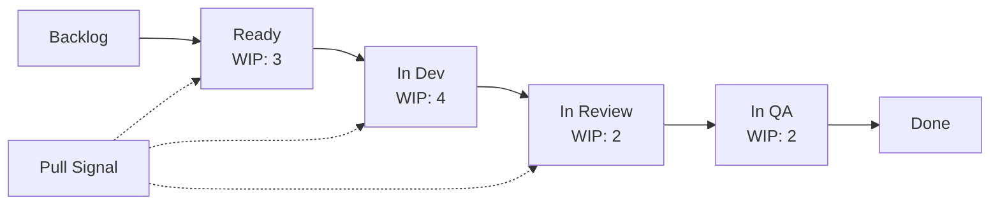

# Kanban — A 2-Day Crash Course

> **In one sentence:** Kanban is a flow-based system for managing work that makes bottlenecks
> visible, limits work in progress, and optimises for smooth, predictable delivery — without
> the fixed time-boxes of Scrum.

> Cross-references: `Agile-Scrum.md` (the sprint-based alternative), `User-Stories-Requirements.md`
> (the work items that flow through the board), `Product-Management-Fundamentals.md` (the PM
> role that prioritises the input queue), `Risk-Management.md` (flow metrics surface delivery
> risk early).

---

## Part 0 — Why Kanban exists

Every team has more work to do than capacity to do it. The natural human response is to start
everything at once — juggle ten things, make progress on all of them, finish none. The result
is predictable: everything takes longer, quality drops, and nobody can answer the question
"when will this be done?"

Kanban exists to fix this. It comes from Toyota's manufacturing system, where the insight was
simple: **stop starting, start finishing.** Instead of pushing work onto the factory floor as
fast as possible, Toyota pulled work through only when capacity was available. The result was
less inventory, fewer defects, and faster delivery — not by working faster, but by working on
fewer things at once.

Applied to software, the principle is identical. A team that limits work in progress finishes
items faster, finds bottlenecks sooner, and delivers more predictably than a team that starts
everything and finishes randomly.

The one idea that makes Kanban click: **limiting WIP exposes problems.** When you cap the
number of items in each column of your board, work cannot pile up silently. If the "In Review"
column is full, nobody can move new items into it — which forces the team to ask "why is
review backed up?" and fix the root cause. Without WIP limits, the same bottleneck hides
under a growing pile of cards that nobody notices until a deadline is missed.

**Mental model:** Kanban is a motorway with metered on-ramps. Without metering, every car
enters at once, the motorway gridlocks, and nobody moves. With metering, cars enter at a
controlled rate, traffic flows, and everyone arrives faster — even though each car waited
briefly at the ramp. WIP limits are the metered on-ramps.



---

## Part 1 — The vocabulary

| Term | Meaning |
|------|---------|
| **WIP limit** (Work In Progress) | The maximum number of items allowed in a column at any time — the core mechanism of Kanban |
| **Pull system** | Work is pulled into the next stage only when there is capacity — as opposed to push, where work is assigned regardless of capacity |
| **Lead time** | The total time from when a request enters the system to when it is delivered to the customer |
| **Cycle time** | The time from when work actively begins on an item to when it is completed — a subset of lead time |
| **Throughput** | The number of items completed per unit of time (per day, per week) |
| **Cumulative Flow Diagram (CFD)** | A stacked area chart showing how many items are in each state over time — the single best visualisation of flow health |
| **Blocked** | An item that cannot progress because of an external dependency or impediment — must be made visible immediately |
| **Swim lane** | A horizontal row on the board that separates work by type, priority, or team — used to manage different classes of service |
| **Explicit policies** | Written rules for how work moves between columns — "definition of done" for each transition |
| **Service Level Expectation (SLE)** | The target for how long items should take, expressed as a percentile ("85% of items complete within 10 days") |

The key distinction between Kanban and Scrum: **Scrum manages work in fixed time-boxes
(sprints). Kanban manages work as a continuous flow with no fixed iterations.** Scrum asks
"how much can we finish in two weeks?" Kanban asks "how can we make items flow through the
system faster?"

---

## DAY 1 — Set up your board

### 1. Design your board columns

A Kanban board makes your workflow visible. Each column represents a stage:

```text
# A typical software delivery board

Backlog | Ready | In Dev | In Review | In QA | Done
        | WIP:3 | WIP:4  | WIP:2     | WIP:2 |

Cards flow left to right.
Each column (except Backlog and Done) has a WIP limit.
```

Map the columns to your actual workflow. Do not copy someone else's board — model how your
team actually works. If your team has a "waiting for design" stage, that is a column. If you
have a "waiting for deployment" stage, that is a column. Make the invisible visible.

### 2. Set WIP limits

WIP limits are the heart of Kanban. Without them, the board is just a to-do list:

```text
# How to set initial WIP limits

Rule of thumb: number of people who work in that stage + 1

Example for a team of 6:
  Ready:     3  (buffer for dev to pull from)
  In Dev:    4  (3 developers + 1 for pairing/handoff)
  In Review: 2  (reviews should be fast — small limit forces it)
  In QA:     2  (similar reasoning)

These are starting points. Adjust based on what you observe.
Lower the limit if you want to expose more bottlenecks.
Raise it slightly if the team is frequently idle.
```

The WIP limit is a constraint you choose, not a rule imposed on you. Its purpose is to
create a signal: when a column is full, something upstream or downstream needs attention.

### 3. The pull principle

In a pull system, work moves forward only when the next stage has capacity:

```text
# Push (bad — Scrum without discipline, or no system at all)
PM assigns 10 stories → Dev starts all 10 → Review is overwhelmed

# Pull (Kanban)
Review has 1 open slot → Dev finishes a story → Dev pulls it into Review
Dev now has 1 open slot → Dev pulls the next Ready item into Dev
```

Nobody assigns work. Team members pull the next highest-priority item when they have capacity.
This is a cultural shift: the board tells you what to work on, not a manager.

### 4. Making blockers visible

When an item cannot progress, mark it immediately:

```text
# Blocker protocol
1. Flag the card visually (red border, "blocked" tag)
2. Add a note: what is blocking it and who can unblock it
3. Raise it at the daily standup
4. A blocked item still counts toward the WIP limit
   (this is intentional — it creates pressure to unblock it)
```

A blocked card that sits silently for three days is invisible waste. A blocked card with a
red flag and an owner gets resolved.

### 5. Daily standup — Kanban style

Kanban standups focus on the board, not the people:

```text
# Walk the board right to left
Start from Done and work backward:
  - "Anything blocked in QA?"
  - "Can we move this review forward?"
  - "Dev column is at WIP limit — what finishes today?"
  - "What should we pull from Ready next?"

Right-to-left focus ensures finishing is prioritised over starting.
```

### 6. By end of Day 1 you can:

- Design a Kanban board that reflects your actual workflow
- Set and enforce WIP limits
- Run a board-focused daily standup
- Make blocked items visible and prioritise unblocking them

---

## DAY 2 — Make it real

### 7. Flow metrics

Kanban teams manage by flow, not by effort estimates. Three metrics matter:

**Lead time** — customer perspective:
```text
Lead time = date item delivered - date item requested
Example: requested 1 June, delivered 12 June → lead time = 11 days
```

**Cycle time** — team perspective:
```text
Cycle time = date item completed - date work started
Example: work started 4 June, completed 12 June → cycle time = 8 days
```

**Throughput** — system perspective:
```text
Throughput = items completed / time period
Example: 12 items completed in 2 weeks → throughput = 6/week
```

Track all three. Lead time tells you what the customer experiences. Cycle time tells you how
fast the team works once started. Throughput tells you whether the system is improving.

### 8. The cumulative flow diagram (CFD)

The CFD is the single most powerful Kanban visualisation:

```text
Items
  ^
  |     ___________________________  Done
  |    /  _________________________  In QA
  |   / /  ________________________  In Review
  |  / / /  _______________________  In Dev
  | / / / /  ______________________  Ready
  |/ / / / /  _____________________  Backlog
  +-------------------------------------> Time
```

Read it this way:
- **Vertical distance** between two bands = WIP in that stage
- **Horizontal distance** between entry and exit = approximate lead time
- **Bands widening** = WIP is growing (work piling up)
- **Bands narrowing** = WIP is shrinking (good — items are finishing)
- **Flat band** = no items moving through that stage (stalled)

A healthy CFD shows roughly parallel bands moving upward. If one band widens significantly,
that stage is a bottleneck.

### 9. Kanban vs Scrum

| Aspect | Scrum | Kanban |
|--------|-------|--------|
| **Cadence** | Fixed sprints (1-4 weeks) | Continuous flow |
| **Roles** | PO, SM, Dev Team (prescribed) | No prescribed roles |
| **Planning** | Sprint planning at start of each sprint | Continuous replenishment as capacity opens |
| **Estimation** | Story points, velocity | Optional — throughput-based forecasting |
| **Change** | Scope locked during sprint | Items can be reprioritised at any time |
| **Commitment** | Sprint goal + selected stories | WIP limits (commitment to flow) |
| **Metrics** | Velocity (points/sprint) | Lead time, cycle time, throughput |
| **Best for** | Teams building new features in cycles | Teams with continuous incoming work (support, ops, maintenance) |

Neither is universally better. Many teams use **Scrumban** — Scrum's ceremonies with Kanban's
WIP limits and flow metrics. Use what fits your work pattern.

### 10. Classes of service

Not all work is equal. Use swim lanes to manage different priorities:

```text
# Swim lanes by urgency

Expedite (top lane):  | WIP: 1 | Production incident, drops everything
Fixed date (second):  | WIP: 2 | Regulatory deadline, compliance work
Standard (third):     | WIP: 4 | Normal feature and improvement work
Intangible (bottom):  | WIP: 1 | Tech debt, refactoring, long-term health
```

The expedite lane has a WIP limit of 1 because if everything is urgent, nothing is. A team
that constantly fills the expedite lane has a prioritisation problem, not a capacity problem.

### 11. Forecasting without estimates

Kanban teams can forecast delivery without estimating individual items:

```text
# Throughput-based forecasting

Historical throughput: 6 items/week (average over last 8 weeks)
Remaining items in backlog: 24

Naive forecast: 24 / 6 = 4 weeks

Better: use a range based on best/worst weeks
  Best week: 9 items → 24 / 9 = 2.7 weeks
  Worst week: 4 items → 24 / 4 = 6 weeks

Answer to stakeholder: "We expect to finish in 3-6 weeks.
We will have a tighter range after the first 2 weeks."
```

This avoids the overhead of estimating every item individually and produces forecasts that
are often more accurate than story-point-based estimates.

### 12. Improving flow — the theory of constraints

When flow stalls, find the bottleneck and fix it:

```text
# Bottleneck identification
1. Which column is most often at its WIP limit?
2. Where do items wait the longest?
3. Where does the CFD band widen?

# Common bottlenecks and fixes
Code review backed up  → Pair programming, smaller PRs, review rotations
QA overwhelmed        → Shift-left: developers write automated tests
Waiting for deploy    → Automate deployment pipeline (see CI/CD guides)
Design not ready      → Include design in upstream refinement
```

The key insight: **optimising a non-bottleneck stage does not improve overall flow.** Making
developers faster when review is the bottleneck just means items pile up in review faster.
Always fix the constraint first.

---

## Worked example — a support team adopts Kanban

```text
1. Before Kanban:
   - 30+ tickets open simultaneously
   - Average resolution time: 14 days
   - No visibility into what is stuck or why
   - Customer complaints about response time

2. Board designed:
   Triage | Investigating | Fix in Progress | In Review | Done
   WIP: 5 | WIP: 4       | WIP: 3          | WIP: 2    |

3. Week 1: team resists WIP limits. "But I have 8 things to investigate!"
   SM explains: "Pick the 4 most important. The rest wait in Triage.
   You will finish these 4 faster, then pull the next ones."

4. Week 2: CFD shows Review column widening — items wait 3 days for
   review. Fix: dedicate 1 hour per day to reviews, rotate reviewers.
   Review wait drops to 1 day.

5. Week 4: metrics after 4 weeks:
   - Average cycle time: 4 days (was 14)
   - Throughput: 8 tickets/week (was 5)
   - No change in team size or hours worked
   - Customer satisfaction score: up 20%

6. Week 8: team adds SLE — "85% of standard tickets resolved within
   5 business days." They hit it 88% of the time. Stakeholders now
   trust the team's delivery predictions.
```

---

## Common pitfalls

- **A board without WIP limits is just a to-do list.** The board alone changes nothing. WIP
  limits are the mechanism that creates flow. Without them, you have a visual backlog, not
  Kanban.
- **Setting WIP limits too high.** A WIP limit of 20 for a team of 5 is not a limit — it is
  decoration. Start lower than feels comfortable. You can always raise it.
- **Ignoring blocked items.** A blocked card that sits for a week is invisible waste. Treat
  every blocker as a mini-incident: who owns it, when will it be resolved?
- **Measuring cycle time but not acting on it.** Metrics exist to drive improvement. If your
  cycle time is trending upward and you are not investigating why, the metric is pointless.
- **Filling the expedite lane constantly.** If every item is expedited, you have no
  prioritisation. The expedite lane should be nearly empty most of the time.
- **Confusing lead time with cycle time.** Lead time includes waiting in the backlog. Cycle
  time starts when work begins. Customers care about lead time. Your team optimises cycle time.
  Track both.
- **Abandoning the board when it gets uncomfortable.** WIP limits create tension — that is
  the point. When the board forces a hard conversation about priorities or bottlenecks, that
  is Kanban working, not Kanban failing.

---

## Quick reference

```text
# Core Kanban principles
1. Visualise the workflow (board with columns)
2. Limit work in progress (WIP limits per column)
3. Manage flow (pull, do not push)
4. Make policies explicit (written rules for transitions)
5. Implement feedback loops (standups, reviews, metrics)
6. Improve collaboratively (use data, experiment)

# Flow metrics
Lead time   = delivered date - requested date (customer view)
Cycle time  = completed date - work started date (team view)
Throughput  = items completed / time period (system view)

# WIP limit starting point
People in stage + 1

# CFD reading guide
Vertical gap between bands    = WIP in that stage
Horizontal gap entry to exit  = approximate lead time
Band widening                 = bottleneck forming
Bands parallel and rising     = healthy flow

# Classes of service
Expedite (WIP:1) | Fixed date (WIP:2) | Standard (WIP:4) | Intangible (WIP:1)

# Throughput-based forecast
Remaining items / avg throughput = estimated weeks
Use best/worst range for confidence interval

# Bottleneck fix priority
1. Find the column most often at WIP limit
2. Fix that constraint first
3. Re-measure after change
4. Move to the next bottleneck

# Kanban vs Scrum quick comparison
Scrum = time-boxed sprints + roles + velocity
Kanban = continuous flow + WIP limits + flow metrics
Scrumban = ceremonies of Scrum + flow discipline of Kanban
```

---

## Top 10 Interview Questions

<details>
<summary><strong>Q: What happens when a team member finishes their work but the next column is at its WIP limit?</strong></summary>

They do not start new work. Instead, they help unblock the full column — pair on a review, assist with testing, or resolve a blocker. This is Kanban working as intended: WIP limits create pressure to finish existing work before starting new work. The discomfort is the signal that something downstream needs attention.

</details>

<details>
<summary><strong>Q: How do you set initial WIP limits for a team that has never used Kanban?</strong></summary>

Start with the number of people who work in that stage plus one. For a team of six with three developers, set In Dev at 4, In Review at 2, In QA at 2. These are starting points — lower the limit to expose more bottlenecks, raise it slightly if the team is frequently idle. The goal is to find the limit where flow is smooth but problems surface quickly.

</details>

<details>
<summary><strong>Q: How do you convince a team that WIP limits help rather than slow them down?</strong></summary>

Run a two-week experiment. Measure cycle time, throughput, and items completed before and after WIP limits. In nearly every case, throughput stays the same or increases while cycle time drops significantly. The team finishes the same number of items but each item finishes faster because it spends less time waiting. Let the data make the argument.

</details>

<details>
<summary><strong>Q: What is the difference between lead time and cycle time, and why do both matter?</strong></summary>

Lead time is from when a request enters the system to when it is delivered — the customer's perspective. Cycle time is from when work actively starts to when it is completed — the team's perspective. Customers care about lead time. The team optimises cycle time. A large gap between the two means items wait a long time before work begins, which is a prioritisation or capacity problem.

</details>

<details>
<summary><strong>Q: How do you use a cumulative flow diagram to identify bottlenecks?</strong></summary>

Look for bands that are widening over time — that stage is accumulating items faster than it processes them. The vertical distance between bands shows WIP in each stage. If the In Review band grows while Done stays flat, review is the bottleneck. Fix it by dedicating time to reviews, adding reviewers, or requiring smaller PRs that are faster to review.

</details>

<details>
<summary><strong>Q: When should a team use Kanban instead of Scrum?</strong></summary>

Kanban suits teams with continuous incoming work that cannot be batched into sprints — support teams, ops, maintenance, or platform teams. It also suits teams where priorities shift frequently, because Kanban allows reprioritisation at any time. Scrum is better when teams need a predictable delivery cadence and benefit from the structure of sprint ceremonies.

</details>

<details>
<summary><strong>Q: How do you handle urgent work (expedite items) without breaking the Kanban system?</strong></summary>

Create an expedite swim lane with a WIP limit of 1. Expedite items skip the queue and flow through immediately. The WIP limit of 1 is critical — if everything is expedited, nothing is. Track how often the expedite lane is used. If it is full constantly, the team has a prioritisation problem upstream, not a capacity problem.

</details>

<details>
<summary><strong>Q: How do you forecast delivery dates without story points or estimates?</strong></summary>

Use throughput-based forecasting. Measure how many items the team completes per week over the last 6-8 weeks. Divide remaining items by average throughput for a naive forecast. Use best-week and worst-week throughput for a confidence range. This approach avoids estimation overhead and often produces more accurate forecasts than story-point-based estimates.

</details>

<details>
<summary><strong>Q: What is the theory of constraints and how does it apply to Kanban?</strong></summary>

The theory of constraints says that optimising a non-bottleneck stage does not improve overall flow. If code review is the bottleneck, making developers code faster just means items pile up in review faster. Always identify the constraint (the column most often at WIP limit or where items wait longest) and fix it first. Then re-measure and address the next constraint.

</details>

<details>
<summary><strong>Q: How do you transition a team from Scrum to Kanban?</strong></summary>

Start by adding WIP limits to the existing Scrum board while keeping sprint ceremonies. Measure cycle time and throughput alongside velocity. Gradually reduce ceremony overhead — replace sprint planning with continuous replenishment, replace velocity tracking with flow metrics. This is Scrumban, and it gives the team a gentle transition without losing the structure they are used to.

</details>

---

## Next steps after Day 2

- `Agile-Scrum.md` — the sprint-based alternative, and how to combine it with Kanban (Scrumban)
- `Risk-Management.md` — using flow metrics to identify delivery risk early
- `User-Stories-Requirements.md` — writing the work items that flow through your board
- `Product-Management-Fundamentals.md` — the PM role in prioritising the input queue

---

## Recommended learning resources

**YouTube channels & playlists:**
- [Henrik Kniberg](https://www.youtube.com/@HenrikKniberg1) — "Kanban and Scrum: Making the Most of Both" and practical flow visualisations
- [Atlassian Agile Coach](https://www.youtube.com/@Atlassian) — Kanban board walkthroughs, WIP limit explanations, and Jira Kanban setup
- [Dave Farley — Continuous Delivery](https://www.youtube.com/@ContinuousDelivery) — how flow-based thinking connects to continuous delivery and deployment
- [LeadDev](https://www.youtube.com/@LeadDev) — engineering leadership talks on managing flow, reducing WIP, and team productivity

**Official docs & blogs:**
- [Atlassian — Kanban Guide](https://www.atlassian.com/agile/kanban) — comprehensive articles on boards, WIP limits, and flow metrics
- [Kanban University](https://kanban.university/) — official resources from the Kanban method community
- [Mountain Goat Software — Kanban](https://www.mountaingoatsoftware.com/agile/kanban) — Mike Cohn's practical comparison of Kanban and Scrum

**The mantra:** Stop starting, start finishing — limit work in progress, pull based on capacity, measure flow, and fix the bottleneck that the board reveals.
