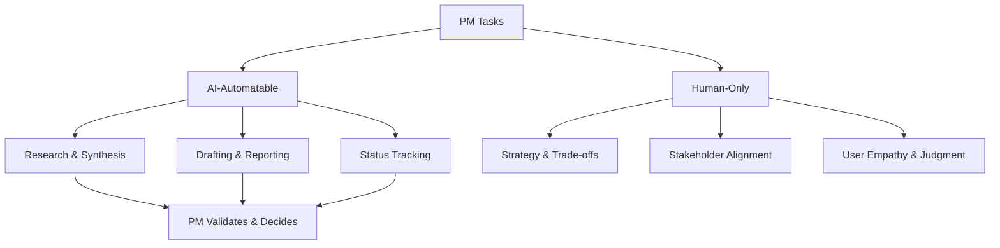

# Product & Project Management in the AI Era — A 2-Day Crash Course

> **In one sentence:** AI is not replacing product and project managers — it is reshaping what
> the role demands, shifting the value from information gathering and status tracking to
> judgment, strategy, and the uniquely human skill of knowing what to build and why.

> Cross-references: `Product-Management-Fundamentals.md` (the core PM role),
> `Product-Strategy.md` (strategic thinking), `Product-Discovery.md` (user research),
> `Product-Analytics.md` (metrics), `Technical-Program-Management.md` (TPM coordination).
> AI context: `ai/LLM-Fundamentals.md`, `ai/Prompt-Engineering.md`, `ai/Agentic-Patterns.md`.

---

## Part 0 — Why this conversation matters now

For two decades, product and project management were insulated from automation. The work was
too ambiguous, too interpersonal, too context-dependent. While manufacturing robots replaced
assembly lines and software replaced clerical work, PMs kept running standups and writing PRDs
by hand.

That changed in 2023. Large language models can now draft PRDs, summarise user research, write
acceptance criteria, generate sprint reports, triage bug queues, and produce competitive
analyses — tasks that used to consume 30-40% of a PM's week. Project managers watched AI tools
auto-generate status updates, predict timeline slippage, and draft stakeholder communications.

The question every PM and project manager is asking: "Am I next?"

The answer is nuanced. The *tasks* are being automated. The *role* is being elevated. The PM
who spent most of their time writing documents and updating JIRA is in trouble. The PM who
spent that time understanding users, making hard trade-offs, aligning stakeholders, and
setting strategy is more valuable than ever — because now they can do it faster with AI as
a force multiplier.

The same applies to project managers. AI can track status, flag risks, and generate reports.
It cannot navigate organisational politics, rebuild trust after a failed launch, or decide
which project should be killed to free resources for a better one.

**Mental model:** AI is like giving every PM a team of junior analysts who work instantly and
never sleep — but who have no judgment, no context about your organisation, and no ability to
read the room. You went from doing everything yourself to managing a team of brilliant but
context-blind assistants. The skill shifts from *doing the work* to *directing the work and
validating the output*.



---

## Part 1 — The vocabulary

| Term | Meaning |
|------|---------|
| **AI-augmented PM** | A PM who uses AI tools to accelerate research, writing, and analysis — not to replace thinking |
| **Copilot pattern** | AI assists in real-time as you work — suggests, drafts, completes — but you steer and approve |
| **Agent pattern** | AI executes multi-step tasks autonomously — triaging bugs, generating reports, running analyses — with human checkpoints |
| **Prompt engineering** | The skill of giving AI precise instructions to get useful output — the new "writing a good brief" |
| **AI-native product** | A product built with AI as a core capability, not a bolt-on feature — requires different PM skills |
| **Human-in-the-loop** | A workflow where AI does the heavy lifting but a human reviews, approves, or overrides before action |
| **Signal vs noise** | AI generates volume. PM judgment separates the insights that matter from the output that doesn't |
| **Evaluation** | The discipline of assessing AI output quality — hallucinations, accuracy, relevance — before trusting it |

---

## DAY 1 — What AI changes (and what it does not)

### 1. Tasks AI is already doing well

These PM and project management tasks are being automated or heavily augmented today:

**Research and synthesis:**
- Summarising user interview transcripts into themes
- Competitive analysis from public sources
- Market sizing and TAM estimates
- Summarising long Slack threads and meeting recordings

**Writing and documentation:**
- First drafts of PRDs, BRDs, and user stories
- Sprint retrospective summaries
- Release notes and changelog entries
- Stakeholder update emails

**Analysis and reporting:**
- Dashboard summaries and anomaly detection
- Bug triage and priority suggestions
- Sprint velocity analysis and timeline prediction
- Risk register updates based on project signals

**Project tracking:**
- Status report generation from JIRA/Linear data
- Dependency mapping across teams
- Meeting notes and action item extraction
- Gantt chart and timeline updates

### 2. Tasks AI cannot do (and why)

These remain fundamentally human:

- **Setting strategy.** AI can analyse data but cannot decide what your company should bet on.
  Strategy requires understanding organisational context, competitive dynamics, and risk
  appetite — none of which AI has access to.
- **Making trade-offs.** "Should we build feature A or feature B?" requires weighing business
  context, team morale, technical debt, customer relationships, and timing. AI can list pros
  and cons. It cannot make the call.
- **Building relationships.** Stakeholder alignment, executive trust, cross-functional
  influence — these are interpersonal skills that require reading the room, understanding
  history, and navigating politics.
- **Saying no.** The hardest PM skill. AI cannot tell a VP their pet feature is not worth
  building. That requires courage, data, and relationship capital.
- **Understanding users deeply.** AI can summarise what users said. It cannot feel the
  frustration in their voice, notice the workaround they invented, or sense the unspoken
  need behind the stated request.
- **Owning accountability.** When a product fails, someone must own it, learn from it, and
  decide what to do next. AI does not carry accountability.

### 3. The new PM skill stack

The skills that mattered five years ago vs what matters now:

| Declining value | Rising value |
|----------------|--------------|
| Writing PRDs from scratch | Evaluating and refining AI-drafted PRDs |
| Manual competitive analysis | Prompting AI for research + validating accuracy |
| Updating status reports | Designing AI-powered dashboards and automations |
| Facilitating every meeting | Deciding which meetings still need a human |
| JIRA ticket management | Defining workflows that AI agents can execute |
| Data pulling and formatting | Asking the right questions of data |
| Scheduling and coordination | Strategic thinking and cross-team alignment |

### 4. By end of Day 1 you can:

- Identify which of your current tasks AI can augment immediately
- Explain why strategy, judgment, and relationships are AI-proof
- Describe the new PM skill stack to your team or in an interview

---

## DAY 2 — Make it real

### 5. Building your AI-augmented workflow

Start with the tasks you do most often and hate the most:

**User research synthesis:**
- Record interviews (with consent), run them through AI transcription
- Prompt: "Summarise the top 5 pain points from these 10 interview transcripts, with direct
  quotes as evidence"
- Your job: validate the themes, notice what AI missed, identify the *emotional* patterns

**PRD drafting:**
- Write a one-paragraph problem statement. Let AI expand it into a full PRD
- Prompt: "Write a PRD for [problem]. Include problem statement, goals, success metrics,
  user stories, scope, and open questions"
- Your job: challenge the assumptions, sharpen the scope, add organisational context AI lacks

**Sprint reporting:**
- Connect AI to your JIRA/Linear data
- Auto-generate weekly status: completed, in progress, blocked, velocity trend
- Your job: add the "so what" — interpretation, risks, recommendations

**Stakeholder communication:**
- Draft emails and updates with AI
- Your job: adjust tone for the audience, add political context, decide what to emphasise
  and what to downplay

### 6. Managing AI-native products

If you are a PM on a product that *uses* AI (chatbots, recommendation engines, generative
features), you need additional skills:

- **Evaluation design.** How do you know if the AI feature is working? Traditional A/B tests
  plus qualitative assessment of output quality. See `ai/LLMOps.md`.
- **Failure mode thinking.** AI fails differently than traditional software. It does not crash —
  it confidently gives wrong answers. Your UX must account for this.
- **Prompt as product.** For AI-powered features, the prompt *is* the product logic. Prompt
  engineering is now a PM-relevant skill. See `ai/Prompt-Engineering.md`.
- **Cost awareness.** AI inference has variable cost. A feature that calls GPT-4 on every
  keystroke might work beautifully and bankrupt you. Token economics matter.
- **Guardrails.** What should the AI never do? PII handling, harmful content, off-brand
  responses — defining these boundaries is a PM responsibility. See `ai/AI-Guardrails.md`.

### 7. The project manager evolution

For project managers specifically, the shift is from *tracking* to *orchestrating*:

**Before AI:**
- Manually updating Gantt charts and timelines
- Chasing people for status updates
- Writing meeting notes and distributing action items
- Creating risk registers from scratch
- Formatting reports for stakeholders

**After AI:**
- Designing the automated tracking systems
- Interpreting signals and making judgment calls on risks
- Facilitating the *hard* conversations AI cannot have
- Running scenario planning with AI-generated models
- Focusing on dependency resolution and cross-team unblocking

The project managers who thrive will be the ones who stop being note-takers and become
orchestrators — using AI to handle the mechanical work while they focus on the human
coordination that makes projects succeed or fail.

### 8. Career positioning

How to position yourself for the AI era:

- **Become the AI power user on your team.** Be the PM who knows how to use AI tools
  effectively. This is a temporary advantage — soon everyone will — but first movers
  build credibility.
- **Double down on judgment.** The more AI can do the "what," the more valuable the "why"
  and "whether" become. Strategy, prioritisation, and user empathy are your moat.
- **Learn to evaluate AI output.** The PM who blindly trusts AI-generated content will
  ship hallucinated requirements. The PM who can spot what AI got wrong is invaluable.
- **Understand AI capabilities and limits.** You do not need to train models. You need to
  know what AI can and cannot do so you can make informed product and process decisions.
- **Build cross-functional influence.** As AI handles more individual contributor work,
  the ability to align teams, navigate ambiguity, and drive decisions becomes the
  primary differentiator.

---

## Worked example — AI-augmented product discovery sprint

```text
Week 1: AI-augmented discovery for a "smart alerts" feature

Monday:
- PM records 6 customer interviews about alert fatigue (30 min each)
- AI transcribes all 6, generates summaries with key quotes
- PM reviews: catches that AI missed a subtle theme about trust
  ("I don't trust the alerts anymore, so I ignore all of them")
- PM adds the trust theme manually — AI had the words but missed the meaning

Tuesday:
- PM prompts AI: "Analyse these 6 interviews and our support tickets from
  the last 90 days. Identify the top 5 pain points around alerting."
- AI returns: noise ratio, missing context, no escalation path, mobile gaps,
  no correlation across alerts
- PM validates against their own notes. Adds: "alert fatigue leading to
  learned helplessness" — a pattern AI described but did not name

Wednesday:
- PM prompts AI: "Draft a PRD for an intelligent alert prioritisation system
  that addresses these 5 pain points. Include success metrics."
- AI generates a 2-page PRD in 3 minutes
- PM spends 2 hours refining: tightens the scope (cuts mobile for v1),
  adds organisational context (compliance team needs audit trail),
  sharpens success metrics (reduce alert-to-action time from 12min to 3min)

Thursday:
- PM shares PRD with engineering lead and design
- Discussion surfaces technical constraint AI could not know: the current
  alert pipeline cannot support real-time ML scoring without a refactor
- PM adjusts scope: v1 uses rule-based scoring, v2 adds ML
- This trade-off decision is pure PM judgment — no AI involved

Friday:
- AI generates a competitive analysis of 5 alert management tools
- PM validates: 3 are accurate, 2 have outdated information
- PM corrects and adds context from their industry knowledge
- Stakeholder update drafted by AI, edited by PM for tone and emphasis

Result: a discovery sprint that would have taken 2 weeks done in 5 days.
AI handled ~40% of the work. PM judgment handled 100% of the decisions.
```

---


## Terminal Demo

```terminal-demo
# ai-pm@product ~ %

$ echo "AI Feature Evaluation"
Feature: AI-powered incident root cause analysis
Model: Claude Sonnet for reasoning, embeddings for retrieval
Accuracy target: 85% correct root cause in top-3 suggestions
Current accuracy: 78% (needs improvement)

$ echo "AI-Specific Metrics"
Model latency p99: 2.3s (target: < 3s) ✓
Hallucination rate: 4.2% (target: < 5%) ✓
User trust score: 3.8/5 (target: > 4.0) ✗
Feedback: "suggestions are good but need more context"

$ echo "Evaluation Matrix"
| Dimension    | Score | Target | Status |
|-------------|-------|--------|--------|
| Accuracy    | 78%   | 85%    | ✗      |
| Latency     | 2.3s  | 3.0s   | ✓      |
| Hallucination| 4.2% | 5.0%   | ✓      |
| User trust  | 3.8   | 4.0    | ✗      |
```

---

## Common pitfalls

- **Outsourcing thinking to AI.** AI drafts. You decide. If you cannot explain *why* a
  decision was made without pointing at AI output, you have abdicated your role.
- **Trusting AI output without validation.** LLMs hallucinate confidently. Every AI-generated
  fact, metric, or claim needs a human check — especially before it reaches stakeholders.
- **Automating the wrong things.** Automating status reports saves time. Automating user
  empathy destroys product quality. Know which tasks benefit from the human touch.
- **Fearing replacement instead of adapting.** The PMs who panic and resist AI tools will be
  outperformed by the PMs who embrace them. The role changes — it does not disappear.
- **Becoming a prompt jockey.** Spending all day prompting AI and none talking to users is
  just a new flavour of the old mistake of building without understanding.
- **Ignoring AI literacy.** You do not need to build models. You do need to understand
  tokens, context windows, hallucination, and evaluation well enough to make product
  decisions about AI features.
- **Losing the human signal.** AI can summarise what 100 users said. It cannot tell you that
  the one user who cried during the interview revealed the most important insight. Protect
  your direct contact with users.

---

## Quick reference

```text
# Tasks AI handles well for PMs
Research synthesis | PRD first drafts | Status reports | Competitive analysis
Meeting summaries | Bug triage | Sprint metrics | Stakeholder email drafts

# Tasks that remain human
Strategy | Trade-offs | Stakeholder alignment | Saying no
User empathy | Accountability | Cross-team influence | Judgment calls

# AI-augmented workflow
1. Define the task clearly (prompt engineering)
2. Let AI generate the first draft
3. Validate — check facts, add context, fix hallucinations
4. Add judgment — the "so what," the trade-off, the decision
5. Communicate — adjust for audience, tone, politics

# PM skill stack shift
FROM: writing, tracking, formatting, scheduling, data pulling
TO:   evaluating, deciding, influencing, strategising, empathising

# AI-native product PM checklist
- Evaluation framework defined?
- Failure modes identified?
- Guardrails set?
- Cost model understood?
- Human-in-the-loop designed?

# Career positioning
1. Be the AI power user on your team
2. Double down on judgment and strategy
3. Learn to evaluate AI output critically
4. Understand AI capabilities at a conceptual level
5. Build cross-functional influence
```

---

## Top 10 Interview Questions

<details>
<summary><strong>Q: Which PM tasks should be automated with AI first, and which should never be?</strong></summary>

Automate high-volume, low-judgment tasks first: status report generation, meeting summaries, competitive analysis drafts, and bug triage suggestions. Never automate strategy decisions, trade-off calls, stakeholder relationship management, or saying no to requests. The rule is: AI handles the what and the first draft; the PM owns the why, the decision, and the validation.

</details>

<details>
<summary><strong>Q: How do you validate AI-generated output before sharing it with stakeholders?</strong></summary>

Treat every AI output as a first draft from a junior analyst. Check facts against primary sources, especially metrics and competitive claims. Add organisational context AI cannot know. Remove hallucinated details — LLMs confidently fabricate specifics. Adjust tone for the audience. The PM who blindly forwards AI output will eventually share something embarrassingly wrong.

</details>

<details>
<summary><strong>Q: How does the PM skill stack change in the AI era?</strong></summary>

Skills declining in value: writing PRDs from scratch, manual competitive analysis, status tracking, data pulling, scheduling. Skills rising in value: evaluating AI output, prompt engineering, strategic thinking, cross-functional influence, user empathy, and judgment. The shift is from doing the work to directing AI and validating results.

</details>

<details>
<summary><strong>Q: How would you use AI to accelerate user research without losing the human signal?</strong></summary>

Use AI to transcribe and summarise interviews, identify recurring themes, and cluster support tickets. But always review the summaries yourself — AI misses emotional subtext, body language cues, and the one outlier insight that reveals a deeper truth. Maintain direct contact with users. AI can process what 100 users said; it cannot feel why one user's frustration matters most.

</details>

<details>
<summary><strong>Q: What new risks does an AI-native product introduce that a traditional product does not?</strong></summary>

AI fails differently: it does not crash, it confidently gives wrong answers. New risks include hallucination in user-facing outputs, variable inference costs that can explode with usage, bias in training data affecting outcomes, and guardrail failures where the AI does something off-brand or harmful. PMs must define failure modes, set guardrails, and design evaluation frameworks.

</details>

<details>
<summary><strong>Q: A VP says "just add AI to the product." How do you respond?</strong></summary>

Ask what user problem AI would solve. AI is a capability, not a feature. Start with the job-to-be-done, then evaluate whether AI is the right solution. If it is, define success metrics, failure modes, and cost constraints before building. Many products benefit more from better UX or faster performance than from an AI feature added for the sake of having one.

</details>

<details>
<summary><strong>Q: How do you manage the cost of AI features in production?</strong></summary>

AI inference has variable cost that scales with usage. Map token consumption to user actions and set cost budgets per feature. Use smaller models for simpler tasks (classification, summarisation) and reserve expensive models for high-value tasks. Cache common responses. Set usage limits on free tiers. Monitor cost per active user as a key metric alongside engagement.

</details>

<details>
<summary><strong>Q: How should PMs think about prompt engineering as a product skill?</strong></summary>

In AI-powered features, the prompt is the product logic. Writing a good prompt is the new "writing a good spec" — it requires clarity about what the AI should do, how it should handle edge cases, and what it should never do. PMs do not need to train models, but they need to understand context windows, temperature, and system prompts well enough to collaborate with engineers.

</details>

<details>
<summary><strong>Q: Will AI replace product managers?</strong></summary>

AI is automating PM tasks, not the PM role. The tasks being automated — writing, tracking, formatting — were never the core of the job. The core — strategy, judgment, trade-offs, user empathy, stakeholder alignment, accountability — requires human context and interpersonal skills AI does not have. PMs who only did tasks are at risk. PMs who made decisions are more valuable than ever.

</details>

<details>
<summary><strong>Q: How do you evaluate whether an AI feature is actually working for users?</strong></summary>

Combine quantitative and qualitative evaluation. Quantitatively: measure task completion rate, time-to-completion, error rate, and user satisfaction scores. Qualitatively: review a sample of AI outputs for accuracy, relevance, and tone. Use human-in-the-loop feedback to catch failures. Set guardrail metrics to ensure the AI feature does not degrade other product metrics.

</details>

---


## Quick Quiz

Test your understanding with these rapid-fire questions (answers hidden):

<details>
<summary>1. What is the ONE core problem that PM in the AI Era solves?</summary>
Re-read Part 0 — the mental model section. If you can explain the "why" in one sentence, you understand the foundation.
</details>

<details>
<summary>2. Name the 3 most important terms from the vocabulary section.</summary>
Review Part 1. These are the building blocks every conversation about PM in the AI Era uses.
</details>

<details>
<summary>3. What is the first thing you would set up on Day 1?</summary>
Check the Day 1 section — the very first hands-on step that gets you a working result.
</details>

<details>
<summary>4. What is the most common production pitfall with PM in the AI Era?</summary>
Review the Common Pitfalls section. The first item listed is typically the most frequently encountered.
</details>

<details>
<summary>5. How does PM in the AI Era compare to its closest alternative?</summary>
Check the Comparison Matrix below — focus on the key differentiating row.
</details>


## Comparison Matrix

| Dimension | AI-Native PM | Traditional PM | Technical PM |
|-----------|--------------|----------------|--------------|
| **Primary use case** | Core strength of AI-Native PM | Core strength of Traditional PM | Core strength of Technical PM |
| **Learning curve** | Moderate | Varies | Varies |
| **Community/ecosystem** | Active | Active | Growing |
| **Operational complexity** | Medium | Varies | Varies |
| **Best for** | See Part 0 | Different tradeoffs | Different tradeoffs |

> **How to read this matrix:** no tool wins on every dimension. Pick based on your specific constraints — team expertise, existing infrastructure, scale requirements, and compliance needs. The right choice is the one that fits your context, not the one with the most checkmarks.

## Next steps after Day 2

- `Product-Management-Fundamentals.md` — the core PM role that AI augments, not replaces
- `Product-Strategy.md` — strategic thinking is the most AI-proof PM skill
- `Product-Discovery.md` — AI-augmented research with human validation
- `ai/Prompt-Engineering.md` — the skill of directing AI effectively
- `ai/Agentic-Patterns.md` — understanding autonomous AI workflows you will manage
- `ai/AI-Guardrails.md` — setting boundaries for AI-powered features

---

## Recommended learning resources

**YouTube channels & playlists:**
- [Lenny's Podcast](https://www.youtube.com/@LennysPodcast) — frequent episodes on AI's impact on product management with top PMs
- [SVPG — Marty Cagan](https://www.youtube.com/@SVPG) — how empowered product teams adapt to AI, the role of judgment
- [Shreyas Doshi](https://www.youtube.com/@ShreyasDoshi) — frameworks for PM craft that AI cannot replace
- [AI Engineer](https://www.youtube.com/@AIEngineer) — understanding the AI tools and patterns PMs need to know
- [Product School](https://www.youtube.com/@ProductSchool) — AI for product managers series, career adaptation talks

**Official docs & blogs:**
- [Lenny's Newsletter — AI and PM](https://www.lennysnewsletter.com/) — regular coverage of how AI is changing product work
- [SVPG — Marty Cagan on AI](https://www.svpg.com/articles/) — the human skills that matter more in the AI era
- [Reforge](https://www.reforge.com/) — advanced product strategy courses adapted for AI-era PMs

## Recommended learning resources

**YouTube channels & playlists:**
- [Lenny Rachitsky](https://www.youtube.com/@LennyRachitsky) — PM leaders discussing AI product strategy, building with LLMs, and the evolving PM role
- [a]16z](https://www.youtube.com/@a16z) — AI product-market fit, AI-native product design, and enterprise AI adoption patterns

**Books & articles:**
- [AI Product Management — Marily Nika](https://www.goodreads.com/book/show/123456789-ai-product-management) — how PM practices change when the product includes ML/AI components
- [Anthropic Research Blog](https://www.anthropic.com/research) — understanding AI capabilities and limitations; essential context for AI product decisions

**The mantra:** AI automates your tasks, not your judgment — the PMs who thrive will be the ones who use AI to work faster while doubling down on the strategy, empathy, and trade-off decisions that no model can make.
