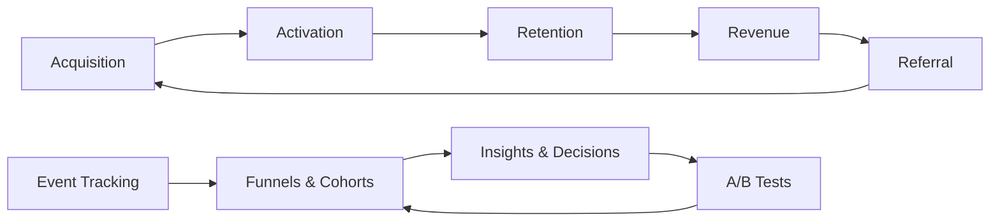

# Product Analytics — A 2-Day Crash Course

> **In one sentence:** Product analytics is the practice of measuring how users actually behave in
> your product — turning raw event data into the insights that drive prioritisation, validate
> hypotheses, and reveal what is working and what is not.

> Cross-references: `Product-Management-Fundamentals.md` (metrics are half of PM decision-making),
> `Product-Strategy.md` (North Star metrics and OKRs), `Product-Discovery.md` (analytics
> complements qualitative research), `Product-Led-Growth.md` (PLG depends heavily on analytics).

---

## Part 0 — Why product analytics exists

Intuition is useful. Data is better. The history of product development is littered with features
that the team was sure would work — and did not. Redesigns that made things worse. "Obvious"
improvements that users ignored. Without analytics, you only discover these failures when
revenue drops or users churn — months after the damage was done.

Product analytics exists to shorten that feedback loop. It tells you what users actually do (not
what they say they do), where they struggle, what keeps them coming back, and where they leave
forever. It replaces arguments about what might work with evidence about what does work.

But analytics is not a replacement for talking to users. Data tells you *what* is happening;
interviews tell you *why*. A funnel chart shows you that 40% of users drop off at step 3. Only a
conversation with those users tells you they dropped off because the field label was confusing. The
best product teams use both: quantitative to find the pattern, qualitative to understand it.

**Mental model:** Analytics is a dashboard on a car. You need the speedometer (are we moving fast
enough?), the fuel gauge (are we running out?), and the warning lights (is something broken?). But
the dashboard does not tell you *where* to drive — that is strategy. And it does not tell you
*why* the engine is making that noise — that is discovery. Analytics shows you the state of the
machine so you can make better driving decisions.



---

## Part 1 — The vocabulary

| Term | Meaning |
|------|---------|
| **Event** | A discrete action a user takes in your product — "clicked signup button," "completed onboarding," "exported report" — the atomic unit of analytics |
| **Funnel** | A sequence of events that represents a user journey (signup → activate → engage → retain → pay) — measured by conversion rate between steps |
| **Cohort** | A group of users who share a common characteristic, usually sign-up date — used to compare behaviour across time |
| **Retention** | The percentage of users who return after a given period — the single most important metric for product health |
| **AARRR (Pirate Metrics)** | Acquisition, Activation, Retention, Revenue, Referral — a framework for measuring the full user lifecycle |
| **A/B test** | An experiment where users are randomly split between two (or more) variants to measure which performs better on a target metric |
| **North Star Metric** | The single metric that best captures the value your product delivers — all other metrics ladder up to it |
| **Leading vs lagging indicator** | Leading indicators predict future outcomes (activation rate). Lagging indicators confirm past results (quarterly revenue) |
| **Vanity metric** | A number that looks impressive but drives no decisions — total signups, page views, app downloads without context |

---

## DAY 1 — Learn to measure

### 1. The AARRR framework (Pirate Metrics)

Dave McClure's framework gives you a complete view of the user lifecycle:

```text
Acquisition  → How do users find you?
Activation   → Do they experience the core value quickly?
Retention    → Do they come back?
Revenue      → Do they pay?
Referral     → Do they tell others?
```

Each stage has its own metrics:

| Stage | Example metrics |
|-------|----------------|
| **Acquisition** | Visitors, signups, signup conversion rate, cost per acquisition |
| **Activation** | Completed onboarding, reached "aha moment," time-to-first-value |
| **Retention** | Day 1/7/30 retention, weekly active users, churn rate |
| **Revenue** | MRR, ARPU, conversion to paid, expansion revenue |
| **Referral** | Invite rate, viral coefficient, NPS |

The framework forces you to look at the *entire* journey, not just the top (acquisition) or
bottom (revenue). Most product problems live in the middle — activation and retention — where
they are invisible without instrumentation.

### 2. Choosing your North Star

Your North Star metric should capture the core value exchange:

```text
Good North Stars:
  Slack:     Messages sent in channels per week (value = team communication)
  Airbnb:    Nights booked per month (value = successful stays)
  Dropbox:   Files stored and synced (value = reliable file access)

Bad North Stars:
  Total signups        (does not measure value delivery)
  Revenue              (lagging — too slow to act on)
  Page views           (vanity — no connection to user success)
```

The North Star should be:
- Measurable and trackable over time
- Connected to the value users receive (not just business extraction)
- Influenceable by the product team
- A leading indicator of long-term business health

### 3. Funnel analysis

A funnel tracks conversion through a sequence of steps:

```text
Landing page visitors:     10,000  (100%)
    ↓
Started signup:             3,000  (30%)
    ↓
Completed signup:           2,100  (70% of started, 21% of total)
    ↓
Completed onboarding:       840    (40% of signed up, 8.4% of total)
    ↓
Reached aha moment:         420    (50% of onboarded, 4.2% of total)
    ↓
Still active at Day 7:      210    (50% of aha, 2.1% of total)
```

The funnel reveals where users drop off. In this example, the biggest absolute loss is between
landing page and signup start (7,000 users), but the biggest *rate* drop is between signup
completion and onboarding completion (60% drop). That is likely where the highest-leverage fix
lives.

**The rule:** Fix the biggest drop-off percentage first, not the biggest absolute number —
because percentage drops compound through the funnel.

### 4. Event tracking foundations

Before you can analyse anything, you need clean event data:

```text
Event taxonomy:
  [Object].[Action]
  Examples:
    user.signed_up
    onboarding.step_completed (property: step_number)
    dashboard.created
    report.exported
    subscription.upgraded

Properties (context on each event):
  user_id, timestamp, plan_type, source, device_type

Naming conventions:
  - Past tense for completed actions (signed_up, not signing_up)
  - Consistent object.action format
  - No abbreviations (subscription, not sub)
  - Document every event in a tracking plan
```

A tracking plan is a spreadsheet or document that lists every event, its properties, when it
fires, and why you care. Without it, your analytics become an unmaintainable mess within months.

### 5. By end of Day 1 you can:

- Map your product's user lifecycle using the AARRR framework
- Choose a North Star metric that captures real value delivery
- Build and interpret a funnel to find the highest-leverage drop-off
- Design an event taxonomy that stays maintainable as the product grows

---

## DAY 2 — Make it real

### 6. Cohort analysis

Cohort analysis answers: "Are we getting better over time?" by comparing groups of users who
joined in different periods:

```text
Cohort retention table (% of users still active):

Sign-up week | Week 0 | Week 1 | Week 2 | Week 4 | Week 8
-------------|--------|--------|--------|--------|-------
Jan 1-7      | 100%   | 42%    | 28%    | 18%    | 12%
Jan 8-14     | 100%   | 45%    | 31%    | 22%    | 15%
Jan 15-21    | 100%   | 48%    | 35%    | 25%    | —
Jan 22-28    | 100%   | 52%    | 38%    | —      | —
```

Reading this table: the Jan 22-28 cohort has better Week 1 retention (52%) than the Jan 1-7
cohort (42%). This suggests something improved — perhaps a product change, onboarding tweak, or
channel mix shift. Without cohort analysis, you might look at aggregate retention and see no
change, because older cohorts with worse retention dilute the signal.

**The key insight:** aggregate metrics hide improvement. Cohorts reveal it.

### 7. A/B testing

A/B testing removes opinion from product decisions by letting users decide:

```text
Hypothesis: A simplified onboarding flow (3 steps instead of 7) will
            increase activation rate.

Setup:
  Control (A): Current 7-step onboarding
  Variant (B): New 3-step onboarding
  Split: 50/50 random assignment
  Primary metric: Activation rate (completed first core action)
  Guardrail metrics: Support tickets, feature adoption at Day 7
  Sample size: 2,000 users per variant (calculated for 80% power)
  Duration: 2 weeks

Results:
  Control: 34% activation rate
  Variant: 41% activation rate
  Statistical significance: p = 0.02 (significant)
  Guardrail check: no increase in support tickets ✓
  Decision: Ship variant B
```

**A/B testing rules:**
- Test one change at a time (otherwise you cannot attribute the result)
- Decide your success metric *before* running the test (not after)
- Calculate sample size in advance — ending a test early because "the numbers look good" leads
  to false positives
- Always check guardrail metrics — a change that improves activation but increases churn is not
  a win
- Not everything needs an A/B test — use judgment for low-risk, easily reversible changes

### 8. Retention deep dive

Retention is the single most important metric because it compounds everything else. High
acquisition with low retention is a leaky bucket.

**Types of retention:**
- **Day N retention:** % of users active on exactly day N (common for apps)
- **Bounded retention:** % of users active within a window (e.g. active at least once in week 2)
- **Unbounded retention:** % of users who ever return after day N

**The retention curve:**

```text
100% ─┐
      │╲
      │  ╲
      │    ╲────────── Flattening = good (you have a retained base)
      │
      │     ╲_________ Approaching zero = bad (no long-term retention)
      │
  0% ─┴──────────────
      D0  D1  D7  D30  D90
```

A healthy retention curve flattens — it stops declining and stabilises at some percentage. That
flat portion is your retained user base. If the curve never flattens and approaches zero, you do
not have product-market fit regardless of what acquisition looks like.

### 9. Data-informed, not data-driven

A crucial distinction. "Data-driven" implies data makes the decision. "Data-informed" means data
is one input alongside user research, strategic context, and product judgment:

**When data should lead:**
- Which variant to ship (A/B test results)
- Where the funnel drops off (clear quantitative signal)
- Whether a launched feature succeeded (metric moved or did not)

**When data should inform but not decide:**
- What to build next (data shows the problem, not the solution)
- Whether to enter a new market (strategic judgment with data inputs)
- How to design the user experience (qualitative insight matters more)

**When data is misleading:**
- Small sample sizes (anecdotes, not patterns)
- Correlation without causation ("users who do X also pay more" — maybe X is a symptom, not a
  cause)
- Survivorship bias (you only see data from users who stayed — the ones who left are invisible)

### 10. Building a metrics dashboard

A good product dashboard answers these questions at a glance:

```text
Layer 1: Health check (is the product okay right now?)
  - North Star metric (current, trend, target)
  - Active users (DAU/WAU/MAU and DAU/MAU ratio)
  - Error rate / uptime

Layer 2: Growth levers (are the input metrics moving?)
  - Acquisition: signups this week vs last
  - Activation: % reaching aha moment
  - Retention: Week 1 retention for latest cohort
  - Revenue: MRR, conversion rate

Layer 3: Experiment results (what have we learned recently?)
  - Active A/B tests and interim results
  - Recently shipped features and their metric impact
```

**Dashboard rules:**
- Fewer metrics are better — if you have 40 metrics, nobody looks at any of them
- Every metric should have an owner who monitors and acts on it
- Include trends, not just snapshots — "500 DAU" means nothing without "up 12% from last week"
- Review the dashboard weekly as a team ritual

---

## Worked example — diagnosing a retention problem

```text
1. Signal: Monthly retention has dropped from 45% to 35% over the past
   quarter. The CEO asks "what happened?"

2. Cohort analysis:
   The drop is not gradual — it appears in the Feb cohort onward.
   Jan cohort: 48% month-1 retention (normal)
   Feb cohort: 36% month-1 retention (sudden drop)
   Mar cohort: 34% month-1 retention (still low)

3. What changed in February?
   - New onboarding flow launched Feb 3
   - Pricing page updated Feb 10
   - Marketing shifted to paid channels Feb 15

4. Funnel analysis (Feb cohort):
   Signup → Onboarding complete: 55% (was 70% for Jan cohort — problem here)
   Onboarding complete → Day 7 active: 65% (same as Jan — no problem)

   The drop is in onboarding completion, not in post-onboarding engagement.

5. Segment analysis:
   Organic users: onboarding completion still 68% (fine)
   Paid channel users: onboarding completion 38% (terrible)

   The new paid channel users have a different intent and are dropping
   off in onboarding.

6. Qualitative follow-up:
   Interviewed 6 users from the paid channel who dropped off.
   Finding: the ad promised "instant setup" but onboarding asks for
   configuration choices they do not understand.

7. Action:
   - Created a "quick start" onboarding path for users from paid ads
     that skips advanced configuration (sets sensible defaults)
   - A/B tested against existing onboarding for paid users
   - Result: onboarding completion for paid users rose from 38% to 61%
   - Month-1 retention for April cohort recovered to 43%

8. Lesson: Aggregate retention hid the problem. Cohort + segment
   analysis found it. Qualitative research explained it.
```

---


## Terminal Demo

```terminal-demo
# analytics@metrics ~ %

$ echo "Funnel Analysis: Onboarding"
Step 1: Sign up          — 10,000 (100%)
Step 2: Verify email      — 7,500 (75%)
Step 3: Create first project — 4,500 (45%)
Step 4: Invite team member — 2,250 (22.5%)
Step 5: First deployment  — 1,500 (15%)
Biggest drop: Step 2 → Step 3 (30% drop)

$ echo "Cohort Retention (Weekly)"
Week 0: 100%
Week 1: 45%
Week 2: 32%
Week 4: 25%
Week 8: 20%
Week 12: 18%

$ echo "Experiment: New Onboarding"
Control:   15% activation (n=5,000)
Treatment: 22% activation (n=5,000)
Lift: +46.7%
p-value: 0.002 (statistically significant)
Decision: SHIP IT
```

---

## Common pitfalls

- **Measuring everything, understanding nothing.** Tracking 500 events without a clear hierarchy
  of metrics creates noise, not insight. Start with 10-15 core events tied to your AARRR stages.
- **Vanity metrics as goals.** Total signups, total page views, and app downloads feel good in
  board decks but drive no product decisions. Measure active usage, retention, and value
  delivery.
- **Ignoring statistical significance.** Ending an A/B test early because one variant "looks
  better" leads to false conclusions. Commit to a sample size before starting and honour it.
- **Aggregate metrics hiding segment problems.** Overall retention can be stable while a specific
  cohort or segment is collapsing. Always break metrics down by cohort and segment.
- **Correlation as causation.** "Users who complete onboarding have higher retention" does not
  mean forcing users through onboarding will improve retention — it means engaged users
  complete onboarding *and* retain.
- **Data without action.** A dashboard that nobody reviews is decoration. Every metric should
  have an owner and a threshold that triggers investigation.
- **Instrumenting after the fact.** If you did not add tracking events before launch, you cannot
  measure the feature's impact. Make instrumentation part of the definition of done.

---

## Quick reference

```text
# AARRR framework
Acquisition → Activation → Retention → Revenue → Referral

# North Star criteria
Measurable | Connected to user value | Team can influence | Leading indicator of business health

# Funnel analysis
Track conversion between each step
Fix the biggest percentage drop-off first

# Cohort analysis
Compare same-age metrics across sign-up cohorts
Reveals improvement or degradation that aggregates hide

# A/B test checklist
1. Hypothesis with primary metric
2. Calculate sample size (80% statistical power)
3. Set guardrail metrics
4. Run for full duration (no peeking)
5. Check significance before deciding

# Retention curve
Flattens = product-market fit signal
Approaches zero = no sustained engagement

# Dashboard layers
Health (North Star, active users) → Growth levers (AARRR input metrics) → Experiments

# Event naming convention
[object].[action] in past tense with documented properties
Example: onboarding.step_completed { step_number, duration_seconds }
```

---

## Top 10 Interview Questions

<details>
<summary><strong>Q: How do you choose a North Star metric for a product?</strong></summary>

The North Star should capture the core value exchange between the product and users. It must be measurable, influenceable by the product team, and a leading indicator of long-term business health. Slack chose "messages sent in channels per week" because it reflects actual team communication value. Avoid lagging indicators like revenue or vanity metrics like total signups — they tell you what happened, not whether you are delivering value.

</details>

<details>
<summary><strong>Q: What is the difference between data-driven and data-informed decision-making?</strong></summary>

Data-driven implies data makes the decision. Data-informed means data is one input alongside user research, strategic context, and product judgment. Data should lead when you are choosing an A/B test winner or identifying funnel drop-offs. Data should inform but not decide when choosing what to build next or whether to enter a new market. The best PMs know when to follow the data and when to override it with judgment.

</details>

<details>
<summary><strong>Q: Retention is dropping. Walk me through how you would diagnose the problem.</strong></summary>

Start with cohort analysis to identify when the drop started and which cohorts are affected. Check what changed around that time — product changes, channel mix shifts, pricing updates. Run funnel analysis on affected cohorts to find where users drop off. Segment by acquisition channel, user type, or plan tier to isolate the problem. Follow up with qualitative interviews of users who churned to understand why. Aggregate metrics hide problems; cohorts and segments reveal them.

</details>

<details>
<summary><strong>Q: How do you avoid common mistakes when running A/B tests?</strong></summary>

Define the success metric before starting, not after. Calculate sample size in advance and commit to running the full duration. Do not peek at results and stop early when one variant looks better — this leads to false positives. Test one change at a time so you can attribute the result. Always check guardrail metrics: a change that improves activation but increases churn is not a win.

</details>

<details>
<summary><strong>Q: What is the difference between a vanity metric and an actionable metric?</strong></summary>

A vanity metric looks impressive but drives no decisions — total signups, page views, app downloads. An actionable metric tells you something specific you can act on — activation rate, Week 1 retention, free-to-paid conversion rate. The test: if the metric goes down, do you know what to investigate and change? If yes, it is actionable. If no, it is vanity.

</details>

<details>
<summary><strong>Q: How do you design an event tracking plan for a new feature?</strong></summary>

Define every event using a consistent object.action taxonomy in past tense (user.signed_up, onboarding.step_completed). Include properties that provide context: user_id, timestamp, plan_type, source. Document every event in a tracking plan before engineering begins — what it is, when it fires, and what question it answers. Make instrumentation part of the definition of done. Without a plan, analytics become an unmaintainable mess within months.

</details>

<details>
<summary><strong>Q: How do cohort analysis and funnel analysis complement each other?</strong></summary>

Funnels show where users drop off in a journey — they reveal the weakest step. Cohorts show whether performance is improving over time by comparing users who joined in different periods. Use funnels to find the problem (60% drop-off at onboarding), then use cohorts to track whether your fix is working (did the January cohort have better onboarding completion than December?). Together they give you both the diagnosis and the treatment monitoring.

</details>

<details>
<summary><strong>Q: How do you handle the situation where correlation looks like causation in product data?</strong></summary>

"Users who complete onboarding have higher retention" does not mean forcing users through onboarding improves retention — it means engaged users do both. Look for natural experiments, use A/B tests to prove causation, and be sceptical of any finding that conveniently confirms your hypothesis. Also watch for survivorship bias — you only see data from users who stayed; the ones who left are invisible.

</details>

<details>
<summary><strong>Q: What should a product analytics dashboard include, and what should it leave out?</strong></summary>

Three layers: health check (North Star metric, active users, error rate), growth levers (AARRR input metrics with trends), and experiment results (active A/B tests and recent feature impact). Leave out anything without an owner who monitors and acts on it. Fewer metrics are better — if you have 40, nobody looks at any. Every metric should include a trend, not just a snapshot.

</details>

<details>
<summary><strong>Q: When should you not rely on analytics and use qualitative research instead?</strong></summary>

Analytics tells you what is happening; it cannot tell you why. When you see a drop-off but do not know the reason, talk to users. When you are exploring a new problem space, interviews reveal needs that no data can surface. When you need to understand emotional reactions, workarounds, or unspoken needs, qualitative research is essential. The best product teams use both: quantitative to find the pattern, qualitative to understand it.

</details>

---


## Quick Quiz

Test your understanding with these rapid-fire questions (answers hidden):

<details>
<summary>1. What is the ONE core problem that Product Analytics solves?</summary>
Re-read Part 0 — the mental model section. If you can explain the "why" in one sentence, you understand the foundation.
</details>

<details>
<summary>2. Name the 3 most important terms from the vocabulary section.</summary>
Review Part 1. These are the building blocks every conversation about Product Analytics uses.
</details>

<details>
<summary>3. What is the first thing you would set up on Day 1?</summary>
Check the Day 1 section — the very first hands-on step that gets you a working result.
</details>

<details>
<summary>4. What is the most common production pitfall with Product Analytics?</summary>
Review the Common Pitfalls section. The first item listed is typically the most frequently encountered.
</details>

<details>
<summary>5. How does Product Analytics compare to its closest alternative?</summary>
Check the Comparison Matrix below — focus on the key differentiating row.
</details>


## Comparison Matrix

| Dimension | Amplitude | Mixpanel | PostHog |
|-----------|-----------|----------|---------|
| **Primary use case** | Core strength of Amplitude | Core strength of Mixpanel | Core strength of PostHog |
| **Learning curve** | Moderate | Varies | Varies |
| **Community/ecosystem** | Active | Active | Growing |
| **Operational complexity** | Medium | Varies | Varies |
| **Best for** | See Part 0 | Different tradeoffs | Different tradeoffs |

> **How to read this matrix:** no tool wins on every dimension. Pick based on your specific constraints — team expertise, existing infrastructure, scale requirements, and compliance needs. The right choice is the one that fits your context, not the one with the most checkmarks.

## Next steps after Day 2

- `Product-Led-Growth.md` — analytics-heavy growth strategy that depends on the metrics covered here
- `Product-Discovery.md` — pairing quantitative analytics with qualitative user research
- `Product-Strategy.md` — connecting metrics to strategic goals via OKRs and North Star
- `Product-Roadmapping.md` — using metric insights to prioritise the roadmap

---

## Recommended learning resources

**YouTube channels & playlists:**
- [Lenny's Podcast](https://www.youtube.com/@LennysPodcast) — episodes on metrics with data leaders from Amplitude, Mixpanel, Reforge
- [Reforge](https://www.youtube.com/@Reforge) — retention, growth loops, metric frameworks
- [Product School](https://www.youtube.com/@ProductSchool) — analytics workshops, A/B testing fundamentals
- [Shreyas Doshi](https://www.youtube.com/@ShreyasDoshi) — choosing metrics, avoiding vanity metrics

**Official docs & blogs:**
- [Lenny's Newsletter](https://www.lennysnewsletter.com/) — benchmarks for retention, activation, and growth metrics across industries
- [Amplitude Blog](https://amplitude.com/blog) — product analytics best practices, North Star framework
- [Mind the Product](https://www.mindtheproduct.com/) — articles on data-informed product management
- [Reforge Blog](https://www.reforge.com/blog) — deep dives on retention, engagement, and growth metrics

## Recommended learning resources

**YouTube channels & playlists:**
- [Amplitude](https://www.youtube.com/@Amplitude) — product analytics tutorials, cohort analysis, retention curves, and event tracking best practices
- [Mixpanel](https://www.youtube.com/@mixpanel) — funnel analysis, A/B testing, and data-informed product decisions
- [Dan Olsen — Lean Product](https://www.youtube.com/@danolsen) — product-market fit metrics, the lean analytics cycle, and growth measurement

**Books & articles:**
- [Lean Analytics — Alistair Croll & Benjamin Yoskovitz](https://leananalyticsbook.com/) — one metric that matters, analytics stages by business model, and data-driven pivots
- [Amplitude Analytics Playbook](https://amplitude.com/blog/product-analytics) — free guides on event taxonomies, user segmentation, and retention analysis

**The mantra:** Measure what users do, not what they say — use funnels to find the drop-off, cohorts to track improvement, and experiments to prove causation, but never forget that data shows the what, not the why.
