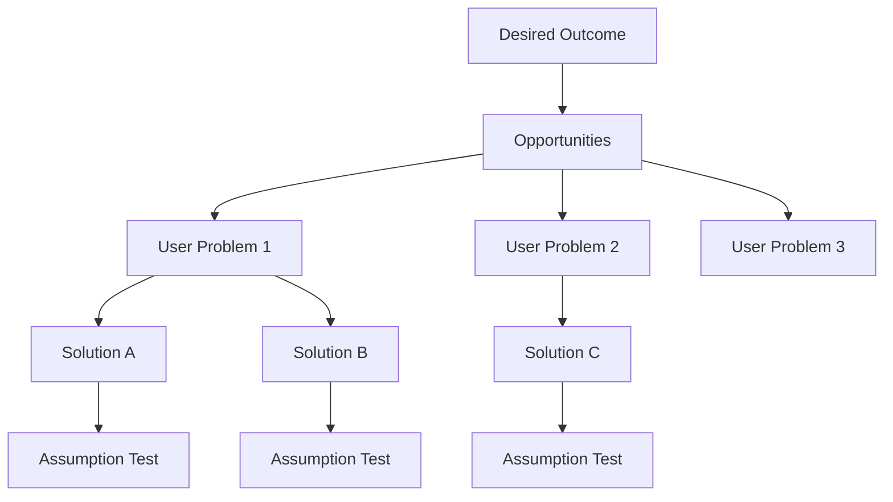

# Product Discovery — A 2-Day Crash Course

> **In one sentence:** Product discovery is the discipline of figuring out what to build *before*
> you commit engineering effort — by systematically understanding user problems, testing
> assumptions, and validating solutions with real evidence.

> Cross-references: `Product-Management-Fundamentals.md` (discovery is half the PM's job),
> `Product-Strategy.md` (strategy tells you where to look), `Product-Analytics.md` (quantitative
> evidence complements qualitative discovery), `Product-Roadmapping.md` (discovery feeds the
> roadmap).

---

## Part 0 — Why product discovery exists

The most expensive mistake in product development is building the wrong thing well. A perfectly
engineered feature that solves a problem nobody has is waste — of engineering time, of
opportunity cost, of user trust. And yet this happens constantly, because teams skip from "someone
asked for this" to "let's build it" without checking whether the problem is real, whether the
proposed solution actually solves it, and whether users will adopt it.

Discovery exists to reduce that risk. It is the set of practices that happen *before* delivery —
before you write code, before you design screens, sometimes before you write a single user story.
The goal is not to eliminate uncertainty (you cannot) but to reduce it to a level where the
remaining risk is worth taking.

Discovery is not a phase. It is not something you do once at the start of a project and then
stop. It is a continuous habit: talk to users every week, test assumptions before building, and
treat every feature as a hypothesis until you have evidence it works.

**Mental model:** Discovery is a metal detector. You are walking across a beach (the problem
space), and buried somewhere under the sand are the problems worth solving and the solutions that
actually work. You could dig everywhere — that is what building without discovery looks like. Or
you could sweep the detector across the surface first, find the strong signals, and then dig
precisely. Discovery does not guarantee you find gold, but it stops you from digging a hundred
empty holes.



---

## Part 1 — The vocabulary

| Term | Meaning |
|------|---------|
| **Discovery** | The process of identifying, validating, and refining user problems and solutions before committing to delivery |
| **Assumption** | Something you believe to be true but have not yet validated — discovery is fundamentally about surfacing and testing assumptions |
| **Jobs-to-be-Done (JTBD)** | A framework that defines user needs as "jobs" they are trying to accomplish, independent of your product |
| **Opportunity Solution Tree (OST)** | Teresa Torres's framework for mapping a desired outcome to the opportunities (user problems) and solutions that could achieve it |
| **Prototype** | A low-fidelity representation of a solution used to test assumptions before building the real thing — ranges from paper sketches to clickable mockups |
| **Assumption test** | A small, fast experiment designed to validate or invalidate a specific belief — the core unit of discovery work |
| **Continuous discovery** | The practice of making discovery a weekly habit rather than a phase — at minimum, one user touchpoint per week |
| **Desirability / Viability / Feasibility / Usability** | The four risks every solution must address: do users want it, does it work for the business, can we build it, can users figure it out |

---

## DAY 1 — Learn to listen

### 1. The four risks of product development

Every feature carries four risks. Discovery aims to reduce all four before you build:

- **Desirability risk** — will users actually want this?
- **Usability risk** — can users figure out how to use it?
- **Feasibility risk** — can engineering build it within constraints?
- **Viability risk** — does it work for the business (revenue, compliance, brand)?

Most teams only check feasibility. The other three are where expensive failures hide.

### 2. Customer interviews — the foundation

Talking to users is the most powerful discovery tool you have. But most teams do it badly:

**What makes a good interview:**
- Ask about past behaviour, not future intentions. "Tell me about the last time you…" not
  "Would you use a feature that…?"
- Follow the energy. When someone's voice changes or they lean forward, dig in. That is where
  the real pain lives.
- Ask "why" repeatedly. The first answer is usually surface-level.
- Let silences sit. People fill silences with the things they were not going to say.
- Interview for the problem, not the solution. You are there to understand their world, not to
  pitch yours.

**What ruins an interview:**
- Leading questions: "Don't you think it would be great if…?"
- Asking for predictions: "Would you pay for this?"
- Talking more than listening. The 80/20 rule — they talk 80% of the time.
- Confirming your hypothesis instead of testing it.

### 3. Jobs-to-be-Done (JTBD)

JTBD reframes the user from "a persona with demographics" to "a person trying to accomplish
something." The job statement format:

```text
When [situation], I want to [motivation], so I can [expected outcome].
```

Examples:
```text
When I receive an alert at 2am, I want to quickly identify the root cause,
so I can restore the service before users notice.

When I am preparing a quarterly review, I want to see which features moved
our metrics, so I can justify next quarter's investment.
```

JTBD matters because users do not buy products — they hire them to do a job. If you understand
the job, you can evaluate whether your solution does it better than the alternatives (which
include doing nothing, using a spreadsheet, or asking a colleague).

### 4. Opportunity Solution Trees

Teresa Torres's OST gives you a visual structure for connecting outcomes to user problems to
solutions:

```text
        [Desired Outcome]
              |
    ┌─────────┼─────────┐
    |         |         |
[Opportunity] [Opportunity] [Opportunity]
  (user pain)   (user pain)    (user pain)
    |              |
 ┌──┴──┐       ┌──┴──┐
 |     |       |     |
[Sol] [Sol]  [Sol]  [Sol]
  |              |
[Test]        [Test]
```

- **Outcome** — the business or product metric you are trying to move (from your OKRs)
- **Opportunities** — the user problems, needs, or desires that, if addressed, would move that
  outcome
- **Solutions** — possible ways to address each opportunity
- **Assumption tests** — experiments to validate the riskiest assumptions about each solution

The tree forces you to consider multiple opportunities before jumping to a solution, and multiple
solutions before committing to one.

### 5. By end of Day 1 you can:

- Name the four risks of product development and explain why most teams only check one
- Conduct a customer interview that uncovers real problems instead of polite agreement
- Frame user needs as jobs-to-be-done
- Build an opportunity solution tree connecting outcomes to problems to solutions

---

## DAY 2 — Make it real

### 6. Assumption mapping

Every solution sits on a pile of assumptions. Before building, surface them and test the riskiest
ones first:

```text
Solution: In-app guided setup wizard

Assumptions:
  Desirability: Users want guidance (vs figuring it out themselves)
  Usability:    Users can complete the wizard in under 10 minutes
  Feasibility:  We can detect the user's context to personalise steps
  Viability:    The wizard won't increase support load from confused users

Riskiest assumption: Users actually want guidance (desirability)
  → Test this first, before designing the wizard
```

Plot assumptions on a 2x2 matrix: importance (if wrong, the solution fails) vs evidence (how
much you already know). Test high-importance, low-evidence assumptions first.

### 7. Assumption testing techniques

Match the test to the assumption. Start with the cheapest, fastest option:

| Technique | Best for | Speed | Cost |
|-----------|----------|-------|------|
| **Customer interviews** | Desirability, problem validation | Hours | Free |
| **Survey** | Quantifying a qualitative finding | Days | Low |
| **Concierge test** | Manually delivering the experience before automating | Days | Low |
| **Wizard of Oz** | Testing the interface while the backend is manual | Days | Low |
| **Paper prototype** | Usability, flow validation | Hours | Free |
| **Clickable prototype** | Usability, desirability of a specific solution | Days | Low |
| **Fake door test** | Demand validation — put a button, measure clicks | Hours | Free |
| **A/B test** | Comparing two solutions with real users | Weeks | Medium |
| **Landing page test** | Market demand — drive traffic, measure signups | Days | Low |

The principle: spend hours or days testing an assumption, not weeks or months building something
that rests on an untested belief.

### 8. Prototyping for learning

Prototypes are not early versions of the product. They are disposable tools for learning.

**Levels of fidelity:**

```text
Low fidelity:  Paper sketches, whiteboard flows
               → Use to validate flow and concept
               → Takes minutes to create

Medium fidelity: Clickable wireframes (Figma, Balsamiq)
                 → Use to test usability and navigation
                 → Takes hours to create

High fidelity: Polished mockups with real content
               → Use to test emotional response and final usability
               → Takes days to create
```

Start at the lowest fidelity that can answer your question. If you are testing whether users
understand a concept, a paper sketch suffices. If you are testing whether the visual design
inspires confidence, you need higher fidelity.

**The rule:** you should be embarrassed by the quality of your first prototype. If you are proud
of it, you spent too long on it.

### 9. Continuous discovery habits

Discovery is not a project phase — it is a weekly practice:

- **One user interview per week** — even 20 minutes with one user compounds into deep
  understanding over months
- **Recruit continuously** — build a panel of users who have opted in to occasional research
  sessions
- **Share insights in a common place** — a shared document or tool where the whole team can see
  what you are learning
- **Involve the whole product trio** — PM, designer, and tech lead in interviews together, so
  everyone hears the user's voice firsthand

### 10. When to stop discovering and start building

Discovery does not end with certainty — it ends with sufficient confidence:

- You have validated that the problem is real and painful (at least 5 users described it
  independently)
- You have tested the riskiest assumptions about your proposed solution
- The team has a shared understanding of the problem and the solution direction
- Remaining unknowns are better resolved by building and shipping than by more research

Diminishing returns are real. At some point, the next interview teaches you nothing new. That is
the signal to commit.

---

## Worked example — discovering a feature for an observability platform

```text
1. Outcome (from OKRs): Reduce time-to-resolution for on-call engineers
   by 30% this quarter.

2. Opportunity identification:
   Interviewed 12 on-call engineers across 4 companies.
   Recurring themes:
   - "I spend 20 minutes just figuring out which service is affected"
   - "The alert gives me a metric, but I need the trace"
   - "I end up in four different tools before I find the root cause"

   Top opportunity: Engineers cannot quickly correlate alerts with
   the relevant traces and logs (mentioned by 9 of 12).

3. Opportunity solution tree:
   Outcome: Reduce time-to-resolution by 30%
     └─ Opportunity: Cannot correlate alert → trace → logs
          ├─ Solution A: Auto-link alerts to related traces
          ├─ Solution B: Unified investigation view (alert + trace + logs)
          └─ Solution C: AI-generated root cause summary

4. Assumption testing (Solution B — unified view):
   Riskiest assumption: Engineers will trust a single view over their
   current multi-tool workflow.

   Test: Concierge test — for 3 volunteer on-call engineers, a team
   member manually assembled the unified view during incidents and
   sent it via Slack within 2 minutes of alert firing.

   Result: All 3 engineers used it as their primary starting point.
   Average time-to-identification dropped from 18 min to 6 min.
   Confidence: high enough to build a prototype.

5. Prototype test:
   Clickable Figma prototype of the unified view. Tested with 5
   additional engineers in 30-minute sessions.
   - 4/5 completed the investigation task without guidance
   - Key feedback: "I need to be able to filter the logs from this view"
   - Iterated the prototype to add log filtering

6. Decision: Build Solution B with log filtering. Remaining unknowns
   (performance at scale, data freshness) are feasibility risks best
   resolved in engineering spikes, not more user research.
```

---

## Common pitfalls

- **Confirmation bias.** Hearing what you want to hear in interviews. The antidote: have someone
  else review your notes and challenge your interpretation. Ask disconfirming questions on
  purpose.
- **Asking users to design the solution.** Users are experts on their problems, not on product
  design. "What feature would you want?" produces bad data. "Tell me about the last time this
  was painful" produces insight.
- **Skipping discovery because you "already know."** The most dangerous assumption is that you
  understand the problem without checking. Senior PMs are especially vulnerable — experience
  creates confidence that may not match the current context.
- **Over-discovering.** Using discovery as a shield against the discomfort of committing. If you
  have interviewed 20 users and they all say the same thing, stop interviewing and start
  building.
- **Testing solutions before validating problems.** Showing a prototype before confirming the
  problem is real produces feedback on the solution, not evidence that the problem matters.
- **Confusing a busy user with an engaged user.** Someone who agrees to test your prototype is
  not the same as someone who will pay for the product. Enthusiasm in a research session does
  not equal demand.
- **Discovery as a solo sport.** If only the PM talks to users, the designer designs from
  hearsay and the engineer builds from a spec. Bring the trio to interviews.

---

## Quick reference

```text
# The four risks
Desirability | Usability | Feasibility | Viability

# Customer interview rules
Ask about past behaviour, not future intentions
Listen 80%, talk 20%
Follow the energy
No leading questions
Interview for the problem, not the solution

# JTBD format
When [situation], I want to [motivation], so I can [expected outcome]

# Opportunity Solution Tree
Outcome → Opportunities (user problems) → Solutions → Assumption tests

# Assumption mapping
Plot: importance (high/low) × evidence (high/low)
Test: high-importance, low-evidence first

# Testing techniques (cheapest first)
Interviews → Surveys → Paper prototype → Clickable prototype
→ Fake door → Concierge → Wizard of Oz → A/B test

# Prototype fidelity
Paper sketch (minutes) → Wireframe (hours) → High-fidelity mockup (days)
Start at the lowest fidelity that answers the question

# Continuous discovery cadence
1 user interview per week (minimum)
Share insights with the whole team
Involve PM + designer + tech lead
```

---

## Top 10 Interview Questions

<details>
<summary><strong>Q: How do you balance discovery with delivery when there is pressure to ship?</strong></summary>

Discovery and delivery run in parallel, not in sequence. While the team delivers Sprint N features, the PM and designer discover Sprint N+2 opportunities. Dedicate a fixed percentage of time — even 20% — to continuous discovery. The alternative is worse: shipping features nobody needs wastes far more time than a weekly user interview. Frame discovery as risk reduction, not delay.

</details>

<details>
<summary><strong>Q: How do you know when to stop discovery and start building?</strong></summary>

Stop when you have validated that the problem is real (at least 5 users described it independently), tested the riskiest assumptions about your solution, and the team has a shared understanding of the direction. Remaining unknowns should be better resolved by building and shipping than by more research. If the next interview teaches you nothing new, that is the signal to commit.

</details>

<details>
<summary><strong>Q: A stakeholder says "I already know what users want — just build it." How do you respond?</strong></summary>

Acknowledge their experience and insight. Then propose a lightweight check: "Let me talk to 5 users this week to validate that and sharpen the requirements. If they confirm, we build with confidence. If they reveal something unexpected, we save engineering weeks." Frame discovery not as doubting their judgment but as de-risking their investment.

</details>

<details>
<summary><strong>Q: What is the difference between the four risks of product development?</strong></summary>

Desirability: will users actually want this? Usability: can they figure out how to use it? Feasibility: can engineering build it within constraints? Viability: does it work for the business (revenue, compliance, brand)? Most teams only check feasibility. The other three are where expensive failures hide. Discovery should address all four before committing to build.

</details>

<details>
<summary><strong>Q: How do you avoid confirmation bias in customer interviews?</strong></summary>

Ask about past behaviour, not future intentions — "tell me about the last time" instead of "would you use." Have someone else review your interview notes and challenge your interpretation. Ask disconfirming questions on purpose. Interview for the problem, not the solution. If you leave every interview more confident in your hypothesis, you are likely hearing what you want to hear.

</details>

<details>
<summary><strong>Q: Explain the Opportunity Solution Tree and how you would use it.</strong></summary>

The OST connects a desired outcome (from OKRs) to user opportunities (problems worth solving) to potential solutions to assumption tests. It forces you to consider multiple user problems before jumping to a solution, and multiple solutions before committing to one. I use it to structure discovery: the outcome tells me where to look, interviews reveal opportunities, and assumption tests validate solutions before building.

</details>

<details>
<summary><strong>Q: What makes a good assumption test, and how do you choose which assumptions to test first?</strong></summary>

A good test is cheap, fast, and targets a single assumption. Plot assumptions on importance (if wrong, the solution fails) versus evidence (how much you already know). Test high-importance, low-evidence assumptions first. A fake door test (measuring clicks on a button that does not exist yet) can validate demand in hours. A concierge test can validate the experience in days. Spend hours testing, not months building.

</details>

<details>
<summary><strong>Q: How do you conduct a customer interview that reveals real problems instead of polite agreement?</strong></summary>

Ask about specific past experiences, not hypotheticals. Follow the energy — when someone's voice changes or they lean forward, dig deeper. Let silences sit — people fill them with things they were not going to say. Listen 80%, talk 20%. Never lead with your solution. The goal is to understand their world, not to get validation for your idea.

</details>

<details>
<summary><strong>Q: What is the difference between a prototype and an MVP?</strong></summary>

A prototype is a disposable tool for learning — it tests assumptions before you build. An MVP is a real, shippable product with the minimum functionality needed to deliver value and collect real-world data. Prototypes come before the decision to build. MVPs come after. You should be embarrassed by your prototype's quality; your MVP should be small but genuinely useful.

</details>

<details>
<summary><strong>Q: How do you involve engineering in discovery without pulling them away from delivery?</strong></summary>

Include the tech lead in one customer interview per week — it takes 30 minutes and gives them firsthand user context. Involve engineering in feasibility assessments during assumption mapping. Share interview highlights in a shared space the whole team can access. When engineers hear user pain directly, they build better solutions and challenge assumptions earlier, which saves time in delivery.

</details>

---


## Quick Quiz

Test your understanding with these rapid-fire questions (answers hidden):

<details>
<summary>1. What is the ONE core problem that Product Discovery solves?</summary>
Re-read Part 0 — the mental model section. If you can explain the "why" in one sentence, you understand the foundation.
</details>

<details>
<summary>2. Name the 3 most important terms from the vocabulary section.</summary>
Review Part 1. These are the building blocks every conversation about Product Discovery uses.
</details>

<details>
<summary>3. What is the first thing you would set up on Day 1?</summary>
Check the Day 1 section — the very first hands-on step that gets you a working result.
</details>

<details>
<summary>4. What is the most common production pitfall with Product Discovery?</summary>
Review the Common Pitfalls section. The first item listed is typically the most frequently encountered.
</details>

<details>
<summary>5. How does Product Discovery compare to its closest alternative?</summary>
Check the Comparison Matrix below — focus on the key differentiating row.
</details>


## Comparison Matrix

| Dimension | Continuous Discovery | Design Sprints | Big-Bang Research |
|-----------|----------------------|----------------|-------------------|
| **Primary use case** | Core strength of Continuous Discovery | Core strength of Design Sprints | Core strength of Big-Bang Research |
| **Learning curve** | Moderate | Varies | Varies |
| **Community/ecosystem** | Active | Active | Growing |
| **Operational complexity** | Medium | Varies | Varies |
| **Best for** | See Part 0 | Different tradeoffs | Different tradeoffs |

> **How to read this matrix:** no tool wins on every dimension. Pick based on your specific constraints — team expertise, existing infrastructure, scale requirements, and compliance needs. The right choice is the one that fits your context, not the one with the most checkmarks.

## Next steps after Day 2

- `Product-Analytics.md` — complementing qualitative discovery with quantitative evidence
- `Product-Roadmapping.md` — turning discovery insights into a prioritised plan
- `Product-Strategy.md` — the strategic context that tells you where to focus discovery
- `Product-Led-Growth.md` — how discovery practices differ in self-serve products

---

## Recommended learning resources

**YouTube channels & playlists:**
- [Teresa Torres](https://www.youtube.com/@TeresaTorres) — opportunity solution trees, continuous discovery, assumption testing
- [Lenny's Podcast](https://www.youtube.com/@LennysPodcast) — interviews on user research and discovery with PMs from Spotify, Airbnb
- [SVPG — Marty Cagan](https://www.youtube.com/@SVPG) — discovery in empowered teams, dual-track agile
- [Product School](https://www.youtube.com/@ProductSchool) — discovery workshops, customer interview techniques

**Official docs & blogs:**
- [Teresa Torres (teresatorres.com)](https://www.producttalk.org/) — the definitive resource on continuous discovery and opportunity solution trees
- [Silicon Valley Product Group (svpg.com)](https://www.svpg.com/articles/) — Marty Cagan on product discovery
- [Mind the Product](https://www.mindtheproduct.com/) — articles and talks on user research and discovery practices
- [Lenny's Newsletter](https://www.lennysnewsletter.com/) — frameworks and case studies on discovery

## Recommended learning resources

**YouTube channels & playlists:**
- [Teresa Torres — Product Talk](https://www.youtube.com/@ProductTalk) — continuous discovery habits, opportunity solution trees, and interview techniques
- [IDEO U](https://www.youtube.com/@ideou) — design thinking, user research methods, and rapid prototyping from the pioneers
- [Lenny Rachitsky](https://www.youtube.com/@LennyRachitsky) — discovery practices from top PM teams at Airbnb, Figma, and Linear

**Books & articles:**
- [Continuous Discovery Habits — Teresa Torres](https://www.producttalk.org/continuous-discovery-habits/) — the modern playbook for weekly discovery cadences and opportunity mapping
- [The Mom Test — Rob Fitzpatrick](https://www.momtestbook.com/) — how to talk to customers without leading them; essential for user interviews

**The mantra:** Talk to users every week, test your riskiest assumptions before building, and remember that the most expensive feature is the one nobody needed.
