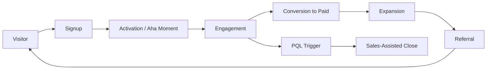

# Product-Led Growth — A 2-Day Crash Course

> **In one sentence:** Product-led growth (PLG) is a go-to-market strategy where the product itself
> is the primary driver of acquisition, activation, conversion, and expansion — users experience
> value before they ever talk to a salesperson or spend a penny.

> Cross-references: `Product-Analytics.md` (PLG lives and dies by metrics), `Product-Strategy.md`
> (PLG is a strategic choice about how to win), `Product-Discovery.md` (PLG demands relentless
> focus on user experience), `Product-Roadmapping.md` (PLG shifts what you prioritise).

---

## Part 0 — Why product-led growth exists

Traditional software sales follows a pattern: marketing generates leads, sales qualifies them,
the buyer sits through a demo, signs a contract, and *then* — weeks or months later — users
finally touch the product. The product is the thing you get *after* the sale.

PLG inverts this. The product is not the reward at the end of the sales process — it is the
beginning. Users sign up, experience the value, and *then* decide to pay. The product does the
selling. Slack, Dropbox, Figma, Notion, Calendly, Zoom — they all grew this way. Users adopted
the tool because it solved a real problem immediately, told their colleagues, and the company
only had to monetise what was already working.

PLG is not "no sales team." Many PLG companies have large sales organisations. The difference is
that sales engages *after* users have already experienced value — upgrading teams from free to
paid, expanding enterprise contracts, handling procurement. The product handles the top of the
funnel. Sales handles the expansion.

This matters because buyer behaviour has changed. People want to try before they buy. They want
to evaluate on their own terms. They trust their own experience more than a sales demo. PLG
aligns the business model with this reality.

**Mental model:** PLG is a supermarket, not a car dealership. At a dealership, you cannot drive
the car until you have talked to a salesperson, negotiated a price, and committed. At a
supermarket, you walk in, pick things up, taste the free samples, and only pay for what you
decide to keep. PLG lets users walk the aisles and fill their cart before asking for a credit
card.



---

## Part 1 — The vocabulary

| Term | Meaning |
|------|---------|
| **PLG** (Product-Led Growth) | A strategy where the product is the primary vehicle for acquiring, activating, and retaining users |
| **Freemium** | A pricing model where a limited version of the product is free forever, with paid tiers for additional features or capacity |
| **Free trial** | A pricing model where users get full (or near-full) access for a limited time, then must pay to continue |
| **Activation** | The moment a new user first experiences the core value of the product — the "aha moment" that predicts long-term retention |
| **Time-to-value (TTV)** | How long it takes a new user to reach the aha moment — PLG demands this be as short as possible |
| **Virality** | Growth driven by users bringing other users into the product through normal usage (sharing a file, inviting to a workspace) |
| **Viral coefficient (K)** | The average number of new users each existing user brings in — K > 1 means exponential growth |
| **PQL** (Product-Qualified Lead) | A user who has reached a meaningful engagement threshold in the product and is now a good candidate for sales outreach |
| **Self-serve** | The motion where users sign up, activate, and pay without human intervention — the purest form of PLG |
| **Reverse trial** | A model where new users start with the full paid experience, then downgrade to free if they do not convert |

---

## DAY 1 — Understand the PLG engine

### 1. PLG vs sales-led vs marketing-led

Three go-to-market motions, each with different economics:

| Dimension | Sales-led | Marketing-led | Product-led |
|-----------|-----------|---------------|-------------|
| **Top of funnel** | Outbound sales, demos | Content, ads, events | Product signups |
| **Conversion** | Sales calls, proposals | Nurture sequences | In-product experience |
| **Cost to acquire** | High (CAC often $5K-50K+) | Medium | Low (often <$500) |
| **Time to revenue** | Months | Weeks to months | Days to weeks |
| **Scales by** | Hiring more salespeople | Spending more on marketing | Improving the product |
| **Best for** | Complex enterprise, high ACV | Mid-market, moderate ACV | Broad market, low-to-mid ACV |

Most successful companies use a hybrid. Slack is PLG at the bottom and sales-assisted at the top
(enterprise deals). The question is not "PLG or sales?" but "where does the product do the work,
and where does a human add more value?"

### 2. Freemium vs free trial vs reverse trial

The three most common PLG pricing models:

**Freemium** (Slack, Notion, Figma):
- Free forever with limits (users, features, storage)
- Paid tiers unlock more
- Advantage: low friction, large top of funnel
- Risk: too generous = no conversion; too restrictive = no activation

**Free trial** (most B2B SaaS):
- Full access for 7-30 days, then pay or lose access
- Advantage: users experience full value, creates urgency
- Risk: users who do not activate during trial are lost

**Reverse trial** (Ahrefs, some enterprise tools):
- Start with full paid experience, auto-downgrade to free tier after trial
- Advantage: users know what they will miss, higher conversion
- Risk: complex to implement, can feel like a bait-and-switch if done poorly

The right choice depends on your product's time-to-value. If users can experience core value in
minutes (Calendly), freemium works. If it takes days of setup and data import (analytics tools),
a trial with enough time to reach the aha moment is better.

### 3. The activation moment

Activation is the most important metric in PLG. It is the moment a user first experiences the
core value — the moment they understand why the product exists and why they should keep using it:

```text
Slack:      Sent 2000 messages as a team (historically their activation metric)
Dropbox:    Uploaded first file to a synced folder
Zoom:       Hosted first meeting with 2+ participants
Figma:      Created a design and shared it with a teammate
Calendly:   Received first booking through a shared link
```

To find your activation moment:
1. Look at users who retained long-term (30+ days)
2. Identify the behaviours they completed in their first session or week
3. Compare those behaviours to users who churned
4. The behaviour that best separates retained from churned users is your activation metric

Once you know it, your entire onboarding should be designed to get users there as fast as
possible.

### 4. Time-to-value (TTV)

In PLG, every minute between signup and the aha moment is a minute the user might leave:

```text
High TTV (bad for PLG):
  Sign up → Fill profile → Import data → Configure settings →
  Invite team → Wait for data → See first dashboard
  Time: 2+ hours across multiple sessions

Low TTV (good for PLG):
  Sign up → See sample data → Explore in 30 seconds →
  Import your own data → Aha moment
  Time: under 5 minutes
```

Tactics to reduce TTV:
- Pre-populate with sample data so users see value immediately
- Defer non-essential configuration (do not ask for billing info upfront)
- Offer templates or wizards for common use cases
- Progressive disclosure — show only what the user needs right now
- Reduce signup friction (social login, minimal fields)

### 5. By end of Day 1 you can:

- Explain PLG and how it differs from sales-led growth
- Choose between freemium, free trial, and reverse trial for your product
- Identify your product's activation moment using behavioural data
- Design an onboarding flow that minimises time-to-value

---

## DAY 2 — Make it real

### 6. Onboarding for PLG

PLG onboarding has one job: get the user to the activation moment. Everything else is secondary:

```text
Onboarding design principles:
  1. Show value before asking for effort
     (let them see a demo state before importing data)
  2. Ask for information only when you need it
     (don't front-load a 10-field form)
  3. Celebrate progress
     (checklists, progress bars — signal momentum)
  4. Offer escape hatches
     (let users skip steps and come back later)
  5. Personalise the path
     (ask one question — "what's your role?" — to customise the flow)
```

**The onboarding checklist pattern** — used by Notion, Slack, and most PLG products:

```text
Welcome to [Product] — Let's get you set up:
  [done]    Create your first [core object]
  [  ]      Invite a teammate
  [  ]      Complete your first [core action]
  [  ]      Explore [key feature]

Progress: 1 of 4 complete
```

This pattern works because it creates a sense of incompleteness (the Zeigarnik effect) that
motivates users to finish.

### 7. Virality and growth loops

PLG products grow fastest when usage naturally invites new users:

**Types of virality:**

- **Inherent virality** — the product only works when shared (Zoom meetings, Slack workspaces,
  Google Docs). Using it *is* inviting others.
- **Artificial virality** — incentivised sharing (Dropbox's "get 500MB free for each referral").
  Works but is weaker than inherent.
- **Word-of-mouth** — users recommend the product because it is genuinely good. Not a mechanic
  you build — a quality you earn.

**The viral loop:**

```text
User signs up → Experiences value → Invites colleague
     ↑                                    ↓
     └──── Colleague signs up ←────────────┘

Viral coefficient (K) = invites sent × conversion rate
  Example: each user invites 3 people, 20% convert
  K = 3 × 0.2 = 0.6

  K < 1: viral growth supplements other channels
  K = 1: each user replaces themselves (sustaining)
  K > 1: exponential growth (rare and usually temporary)
```

Even K = 0.3 is valuable. It means every 10 users you acquire through paid channels bring 3 more
for free, lowering your effective CAC by 23%.

### 8. Self-serve vs sales-assisted

Most PLG companies develop a hybrid model:

```text
Self-serve motion (small teams, low ACV):
  Sign up → Activate → Convert to paid → Expand within team
  Handled entirely by the product.
  Target: individuals and small teams (<10 users)

Sales-assisted motion (larger teams, higher ACV):
  Sign up → Activate → PQL trigger → Sales outreach → Enterprise deal
  Product acquires and activates. Sales expands and closes.
  Target: teams of 10+ or accounts with high expansion potential

Enterprise motion (top accounts, highest ACV):
  Inbound interest → Demo → Security review → Procurement → Contract
  Product provides proof of value. Sales handles procurement complexity.
  Target: organisations with compliance, security, or procurement requirements
```

**Product-Qualified Leads (PQLs):**
A PQL is a user who has demonstrated enough engagement to be a good sales prospect:

```text
PQL criteria examples:
  - Account has 5+ active users (team adoption signal)
  - User hit the usage limit on the free plan (expansion signal)
  - Admin visited the pricing page 3+ times (buying intent signal)
  - Team created 20+ [core objects] in the past week (high engagement)
```

PQLs convert at 5-10x the rate of marketing-qualified leads because the user has already
experienced the value.

### 9. Monetisation in PLG

The free tier must be generous enough to deliver real value but limited enough to create a
natural upgrade trigger:

**Common limit types:**

| Limit type | Example | Works when |
|-----------|---------|-----------|
| **Usage** | Slack's 90-day message history | Value increases with volume |
| **Features** | Free lacks SSO, admin controls | Enterprise features drive upgrades |
| **Seats** | Free for up to 3 users | Product is collaborative |
| **Support** | Free = community only | Users need help at scale |
| **Storage** | Free = 5GB | Product stores user data |

**The pricing page as a product feature:**
In PLG, the pricing page is one of the most visited pages. Design it to:
- Make the free tier clearly valuable (not a crippled demo)
- Make the upgrade trigger obvious (what you get by paying)
- Reduce friction (monthly billing, no contracts, easy cancellation)
- Show social proof (logos, user counts)

### 10. PLG metrics that matter

Beyond the standard AARRR, PLG companies track:

```text
Acquisition:
  - Signup rate (visitors → signups)
  - Organic vs paid signup ratio (healthy PLG = high organic)

Activation:
  - Time-to-value (minutes/hours to aha moment)
  - Activation rate (signups → reached aha moment)

Engagement:
  - DAU/MAU ratio (>20% = strong engagement)
  - Core action frequency (how often users do the key thing)

Conversion:
  - Free-to-paid conversion rate (benchmark: 2-5% for freemium)
  - Trial-to-paid conversion rate (benchmark: 15-25% for free trial)
  - PQL-to-customer conversion rate (benchmark: 20-40%)

Expansion:
  - Net revenue retention (>100% = expansion exceeds churn)
  - Seat expansion rate (teams growing within accounts)

Virality:
  - Viral coefficient (K)
  - Invite rate (% of users who invite at least one other)
```

---

## Worked example — launching PLG for a monitoring tool

```text
1. Context: A monitoring SaaS currently sells via demo → contract.
   Average deal takes 45 days and costs $8K in sales effort.
   Leadership wants to add a PLG motion to reach smaller teams.

2. Strategic decision:
   - PLG for teams of 1-10 (self-serve, low ACV)
   - Sales-assisted for 10-50 (PLG acquires, sales expands)
   - Enterprise sales for 50+ (existing motion, unchanged)

3. Free tier design:
   - 3 hosts monitored (enough to cover a small staging environment)
   - 1-day data retention (enough to experience value, upgrade for history)
   - Community support only
   - No SSO, no RBAC (enterprise features behind paid tiers)

4. Activation metric identification:
   Analysed 500 trial users who converted vs 2000 who did not.
   Key differentiator: users who set up at least 1 alert within
   48 hours of signup retained at 3x the rate.
   Activation metric: first alert configured within 48 hours.

5. Onboarding redesign:
   Old flow: signup → install agent → wait for data → explore → configure
   Time-to-value: 2+ hours

   New flow: signup → see demo environment instantly → guided setup
   of first alert in 5 minutes → install agent on your infrastructure
   Time-to-value: under 10 minutes (for demo value) + 30 minutes
   (for real data)

6. Results after 3 months:
   - Signups: 800/month (vs 50 demo requests previously)
   - Activation rate: 35% (configured first alert within 48h)
   - Free-to-paid conversion: 4.2% (within 30 days)
   - PQLs passed to sales: 40/month (accounts with 5+ active users)
   - PQL conversion rate: 28%
   - Effective CAC dropped from $8K to $1.2K for PLG cohort

7. Viral loop: monitored teams share read-only dashboards with
   stakeholders. Stakeholders see the tool, ask "what is this?"
   → visit landing page → sign up for their own team.
   Viral coefficient: K = 0.4 (each team brings 0.4 new teams)
```

---


## Terminal Demo

```terminal-demo
# plg@growth ~ %

$ echo "PLG Funnel"
Visitors:        100,000/mo
Sign-ups:        10,000/mo (10% conversion)
Activated:       3,200/mo (32% activation)
Paying:          640/mo (20% of activated)
Expanded:        128/mo (20% expand)

$ echo "Time-to-Value"
Median time to first value: 12 minutes
Target: < 10 minutes
Action: Simplify project creation (currently 5 steps -> 2)

$ echo "Product-Qualified Leads"
PQLs generated this month: 234
PQL → Sales conversation: 45%
PQL → Closed won: 18%
Avg deal size (PQL): $12,000 ARR
```

---

## Common pitfalls

- **Making the free tier too generous.** If users get everything they need for free, they will
  never pay. The free tier should deliver genuine value but create a natural ceiling that
  growing users hit.
- **Making the free tier too restrictive.** If users cannot reach the aha moment on the free
  tier, PLG fails. The activation moment must be achievable without paying.
- **Ignoring activation.** Pouring users into the top of the funnel without fixing the
  activation rate is pouring water into a sieve. Fix activation before scaling acquisition.
- **Treating PLG as "no sales."** PLG replaces the top of the funnel, not the entire sales
  motion. Enterprise buyers still need human help with security reviews, procurement, and
  custom contracts.
- **Optimising signup and ignoring onboarding.** A signup is not a user. A user who never
  activates is a wasted signup. The path from signup to activation is where most PLG products
  leak.
- **Bolting PLG onto a sales-led product.** PLG requires a product designed for self-serve
  discovery. If your product needs a consultant to configure, adding a signup button will not
  make it PLG.
- **Measuring signups as success.** Signups are vanity. Activation rate, free-to-paid
  conversion, and net revenue retention are the metrics that matter. A million signups with 0.1%
  conversion is not PLG — it is a marketing expense.

---

## Quick reference

```text
# PLG pricing models
Freemium:       Free forever with limits, pay for more
Free trial:     Full access for limited time
Reverse trial:  Start with paid features, downgrade to free

# Activation
Find it: compare retained users' early behaviour vs churned users
Measure it: % of signups reaching the aha moment
Optimise it: reduce time-to-value through onboarding design

# Viral coefficient
K = invites per user × invite conversion rate
K > 1 = exponential    K = 0.3-0.7 = strong supplement

# PQL criteria
Usage thresholds + team size + buying signals (pricing page visits)
PQL conversion benchmark: 20-40%

# Conversion benchmarks
Freemium free-to-paid: 2-5%
Free trial to paid: 15-25%
Reverse trial to paid: 20-30%

# PLG funnel
Visit → Signup → Activate → Engage → Convert → Expand → Refer

# Free tier design
Generous enough to activate, limited enough to upgrade
Common limits: usage, features, seats, support, storage

# Self-serve vs sales-assisted
Self-serve: individuals and small teams (product handles everything)
Sales-assisted: mid-market (product acquires, sales expands)
Enterprise: large orgs (product proves value, sales closes)
```

---

## Top 10 Interview Questions

<details>
<summary><strong>Q: How do you find a product's activation moment?</strong></summary>

Compare the early behaviours of users who retained long-term (30+ days) versus those who churned. The behaviour that best separates the two groups is your activation metric. Slack found it was 2000 messages sent as a team. Dropbox found it was uploading a first file to a synced folder. Once identified, design the entire onboarding to get users there as fast as possible.

</details>

<details>
<summary><strong>Q: How do you decide between freemium, free trial, and reverse trial?</strong></summary>

It depends on time-to-value. If users can experience core value in minutes (Calendly, Canva), freemium works — low friction, large top of funnel. If it takes days of setup and data import, a free trial with enough time to reach the aha moment is better. Reverse trial (start with paid features, auto-downgrade) works when you want users to experience the full product and understand what they would lose.

</details>

<details>
<summary><strong>Q: What is a Product-Qualified Lead and why does it convert better than a Marketing-Qualified Lead?</strong></summary>

A PQL is a user who has demonstrated meaningful engagement — 5+ active users in an account, hitting usage limits, visiting the pricing page repeatedly. PQLs convert at 5-10x the rate of MQLs because the user has already experienced the product's value. An MQL filled out a form; a PQL used the product and wants more.

</details>

<details>
<summary><strong>Q: How do you design a free tier that is generous enough to activate but limited enough to convert?</strong></summary>

The free tier must let users reach the aha moment — otherwise PLG fails at the start. Limit what grows with usage: storage, seats, message history, integrations. Keep the core experience fully functional. The upgrade trigger should feel natural, not punitive — users should think "I need more of this" rather than "they are crippling the product."

</details>

<details>
<summary><strong>Q: PLG acquisition is strong but conversion to paid is below 2%. What do you investigate?</strong></summary>

Check three areas. First, activation: are users reaching the aha moment? If not, fix onboarding before anything else. Second, the upgrade trigger: is the free tier too generous (users never hit the ceiling) or is the paid tier not compelling enough? Third, pricing page friction: is the path from "I want to upgrade" to "I have paid" simple? Often low conversion is an activation problem disguised as a monetisation problem.

</details>

<details>
<summary><strong>Q: How does PLG change what a PM prioritises on the roadmap?</strong></summary>

PLG shifts priority toward the self-serve experience: onboarding, activation, in-product education, and reducing time-to-value. Features that would normally be "nice to have" — like sample data, templates, or a guided setup wizard — become critical. The product itself must sell, which means UX quality, first-run experience, and viral loops compete with feature development for roadmap space.

</details>

<details>
<summary><strong>Q: What is a viral loop and how do you measure its effectiveness?</strong></summary>

A viral loop is the cycle where a user experiences value, shares the product (invites a colleague, shares a file), and the recipient signs up and repeats the cycle. Measure it with the viral coefficient K = invites per user multiplied by invite conversion rate. K greater than 1 means exponential growth (rare). Even K of 0.3 is valuable — it means every 10 acquired users bring 3 more for free, reducing effective CAC by 23%.

</details>

<details>
<summary><strong>Q: Can you bolt PLG onto an existing sales-led product?</strong></summary>

Not easily. PLG requires a product designed for self-serve discovery — intuitive onboarding, fast time-to-value, and in-product education. If your product needs a consultant to configure or a demo to understand, adding a signup button does not make it PLG. It requires rethinking the first-run experience, simplifying setup, and often building a separate self-serve entry point.

</details>

<details>
<summary><strong>Q: How do self-serve and sales-assisted motions coexist in a PLG company?</strong></summary>

Self-serve handles individuals and small teams — the product does everything from acquisition to conversion. Sales-assisted engages when PQL triggers fire: accounts with 5+ active users, usage limit hits, or pricing page visits. Enterprise sales handles large organisations with compliance, security, and procurement requirements. The product acquires and activates; sales expands and closes.

</details>

<details>
<summary><strong>Q: What are the key metrics that distinguish a healthy PLG business from one that is just burning signups?</strong></summary>

Activation rate (are signups reaching the aha moment?), free-to-paid conversion (2-5% benchmark for freemium), net revenue retention above 100% (expansion exceeds churn), organic-to-paid signup ratio (healthy PLG has high organic), and DAU/MAU ratio above 20% (strong engagement). A million signups with 0.1% conversion is a marketing expense, not PLG.

</details>

---


## Quick Quiz

Test your understanding with these rapid-fire questions (answers hidden):

<details>
<summary>1. What is the ONE core problem that Product Led Growth solves?</summary>
Re-read Part 0 — the mental model section. If you can explain the "why" in one sentence, you understand the foundation.
</details>

<details>
<summary>2. Name the 3 most important terms from the vocabulary section.</summary>
Review Part 1. These are the building blocks every conversation about Product Led Growth uses.
</details>

<details>
<summary>3. What is the first thing you would set up on Day 1?</summary>
Check the Day 1 section — the very first hands-on step that gets you a working result.
</details>

<details>
<summary>4. What is the most common production pitfall with Product Led Growth?</summary>
Review the Common Pitfalls section. The first item listed is typically the most frequently encountered.
</details>

<details>
<summary>5. How does Product Led Growth compare to its closest alternative?</summary>
Check the Comparison Matrix below — focus on the key differentiating row.
</details>


## Comparison Matrix

| Dimension | PLG | Sales-Led Growth | Marketing-Led |
|-----------|-----|------------------|---------------|
| **Primary use case** | Core strength of PLG | Core strength of Sales-Led Growth | Core strength of Marketing-Led |
| **Learning curve** | Moderate | Varies | Varies |
| **Community/ecosystem** | Active | Active | Growing |
| **Operational complexity** | Medium | Varies | Varies |
| **Best for** | See Part 0 | Different tradeoffs | Different tradeoffs |

> **How to read this matrix:** no tool wins on every dimension. Pick based on your specific constraints — team expertise, existing infrastructure, scale requirements, and compliance needs. The right choice is the one that fits your context, not the one with the most checkmarks.

## Next steps after Day 2

- `Product-Analytics.md` — the metrics infrastructure PLG depends on
- `Product-Strategy.md` — PLG as a strategic choice within the broader company strategy
- `Product-Discovery.md` — discovering what makes users activate and retain
- `Product-Roadmapping.md` — prioritising PLG investments on the roadmap

---

## Recommended learning resources

**YouTube channels & playlists:**
- [Lenny's Podcast](https://www.youtube.com/@LennysPodcast) — episodes on PLG with leaders from Figma, Notion, Calendly, Miro
- [Reforge](https://www.youtube.com/@Reforge) — growth loops, monetisation, activation, retention deep dives
- [Product School](https://www.youtube.com/@ProductSchool) — PLG strategy workshops, freemium design, growth metrics
- [Shreyas Doshi](https://www.youtube.com/@ShreyasDoshi) — product-led thinking, growth vs monetisation trade-offs

**Official docs & blogs:**
- [OpenView Partners PLG Resources](https://openviewpartners.com/product-led-growth/) — the firm that coined "product-led growth," benchmarks and frameworks
- [Lenny's Newsletter](https://www.lennysnewsletter.com/) — PLG benchmarks, activation rate data, conversion benchmarks
- [Reforge Blog](https://www.reforge.com/blog) — growth loops, engagement frameworks, monetisation strategy
- [Mind the Product](https://www.mindtheproduct.com/) — articles on PLG, self-serve design, and product-led sales

## Recommended learning resources

**YouTube channels & playlists:**
- [OpenView Partners — PLG](https://www.youtube.com/@OpenViewVenture) — PLG benchmarks, product-led sales, and enterprise PLG strategies from the investors who coined the term
- [Wes Bush — ProductLed](https://www.youtube.com/@ProductLed) — the PLG flywheel, freemium vs free trial, and self-serve onboarding optimisation
- [Elena Verna](https://www.youtube.com/@elenaverna) — growth advisor talks on PLG + sales-assist models, expansion revenue, and activation metrics

**Books & articles:**
- [Product-Led Growth — Wes Bush](https://productled.com/book) — the foundational PLG playbook: time-to-value, bowling alley framework, and self-serve funnels
- [OpenView PLG Index](https://openviewpartners.com/product-led-growth-index/) — annual benchmarks for PLG SaaS companies on conversion, retention, and expansion

**The mantra:** Let the product do the selling — get users to value fast, make sharing natural, monetise the engagement you have earned, and never forget that a signup without activation is just a row in a database.
