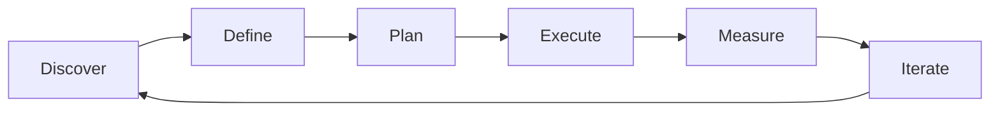

# Product Management Fundamentals — A 2-Day Crash Course

> **In one sentence:** Product management is the discipline of deciding what to build, why to
> build it, and in what order — sitting at the intersection of user needs, business goals, and
> engineering reality.

> Cross-references: `Product-Strategy.md` (the strategic layer above), `Product-Discovery.md`
> (how you figure out what users need), `User-Stories-Requirements.md` (how you communicate it
> to engineering), `Agile-Scrum.md` (how the team executes).

---

## Part 0 — Why product management exists

Software teams without product management build things nobody asked for. They ship features
because a stakeholder shouted loudest, or because an engineer thought it was interesting, or
because a competitor launched it. The result: bloated products, exhausted teams, and users who
churn because the one thing they actually needed never got prioritised.

Product management exists to prevent that. The PM is not the boss of the product — they are the
person accountable for ensuring the team works on the *right problems* in the *right order*. They
do not write code. They do not design interfaces. They do not manage people. What they do is
synthesise information from users, business, and technology into decisions about what to build
next and — just as critically — what *not* to build.

The role is fundamentally about trade-offs. Every yes is a hundred nos. Every feature you build
is a feature you did not build instead. The PM's job is to make those trade-offs explicitly,
with data, with user evidence, and with a clear connection to business outcomes.

**Mental model:** A PM is a navigator on a ship. The captain (CEO/leadership) sets the
destination. The crew (engineering, design) sails the ship. The navigator reads the map, checks
the weather, and says "turn here" — not because they outrank anyone, but because they are the
one person whose entire job is to know where you are, where you need to go, and what is in the
way.

---




## Part 1 — The vocabulary

| Term | Meaning |
|------|---------|
| **PM** (Product Manager) | Owns the "what" and "why" — decides what to build and in what order based on user needs and business goals |
| **PO** (Product Owner) | Scrum-specific role — manages the backlog, writes acceptance criteria, attends sprint ceremonies. Often the PM wears this hat |
| **PMM** (Product Marketing Manager) | Owns positioning, messaging, go-to-market. Focuses on how the product is communicated to the market |
| **Discovery** | The process of figuring out what to build — user research, problem validation, solution testing — before committing engineering effort |
| **Delivery** | The process of building and shipping what you decided to build — sprints, standups, releases |
| **PRD** (Product Requirements Document) | A document describing what you are building, why, for whom, success metrics, and scope boundaries |
| **Roadmap** | A communication tool showing what the team plans to work on and roughly when — not a commitment, a plan |
| **Stakeholder** | Anyone with a vested interest in your product decisions — executives, sales, support, engineering leads, customers |
| **North Star Metric** | The single metric that best captures the value your product delivers to users — guides prioritisation |
| **Feature vs outcome** | A feature is what you ship. An outcome is the user behaviour change it produces. PMs optimise for outcomes |

---

## DAY 1 — Understand the role

### 1. The three inputs

Every PM decision sits at the intersection of three inputs:

- **User desirability** — do people actually want this? Is the problem real and painful?
- **Business viability** — does solving this problem move a metric the business cares about?
- **Technical feasibility** — can engineering build it in a reasonable timeframe with acceptable trade-offs?

Your job is to find the overlap. A feature that users want but the business cannot monetise is a
charity project. A feature the business wants but users do not need is a vanity metric. A feature
that is technically easy but solves no real problem is engineering theatre.

### 2. Discovery vs delivery

The PM's week splits roughly into two modes:

**Discovery** (figuring out what to build):
- Talking to users and watching them use the product
- Analysing usage data and funnel metrics
- Running experiments to validate assumptions
- Writing problem statements and evaluating solutions

**Delivery** (getting it built and shipped):
- Writing user stories and acceptance criteria
- Prioritising the backlog
- Attending sprint ceremonies
- Unblocking engineering with context and decisions
- Reviewing what shipped against what was intended

The ratio shifts by stage. Early-stage products are 70% discovery. Mature products might be
70% delivery. But you never stop doing both.

### 3. PM vs PO vs PMM

These roles overlap and confuse everyone:

| Role | Focus | Timeframe |
|------|-------|-----------|
| **PM** | What to build and why | Quarters to years |
| **PO** | Backlog management, sprint-level decisions | Weeks to sprints |
| **PMM** | Positioning, messaging, go-to-market | Launch cycles |

In many teams, one person does all three. In larger organisations, they are distinct roles that
must communicate tightly.

### 4. Working with engineering

The PM-engineering relationship is the most important one in product development:

- **Share the problem, not just the solution.** Engineers make better decisions when they
  understand *why* something matters, not just *what* to build.
- **Be available.** The PM who is unreachable during a sprint forces engineers to guess at
  requirements. Guesses are expensive.
- **Respect technical constraints.** When engineering says "this will take three months," do not
  negotiate it to three weeks. Ask what a smaller version would look like.
- **Say no together.** Help engineering say no to stakeholders by providing the data and the
  prioritisation framework.

### 5. By end of Day 1 you can:

- Explain the PM role without using jargon
- Distinguish discovery from delivery and know when to do each
- Identify the three inputs to every product decision
- Have a productive first conversation with your engineering team

---

## DAY 2 — Make it real

### 6. Prioritisation frameworks

Every PM needs a system for saying "this, not that":

**RICE scoring:**
- **R**each — how many users will this affect?
- **I**mpact — how much will it move the metric? (3 = massive, 0.25 = minimal)
- **C**onfidence — how sure are you about the above? (100%, 80%, 50%)
- **E**ffort — how many person-months?
- Score = (Reach × Impact × Confidence) / Effort

**ICE scoring** (simpler):
- Impact × Confidence × Ease (1-10 each)

**MoSCoW** (for scope negotiation):
- Must have / Should have / Could have / Won't have (this time)

No framework is perfect. They are tools for making trade-offs visible, not algorithms for
avoiding judgment.

### 7. Writing a PRD

A PRD is not a specification — it is a communication tool. Keep it short enough that people
actually read it:

```text
1. Problem statement    — what pain are we solving and for whom?
2. Goal and success metrics — what does success look like, measured how?
3. User stories         — as a [user], I want [action] so that [outcome]
4. Scope               — what is in, what is explicitly out
5. Design              — wireframes or mockups (link, don't embed)
6. Technical notes     — anything engineering needs to know up front
7. Open questions      — what you have not decided yet
8. Timeline            — rough phases, not exact dates
```

### 8. Stakeholder management basics

Stakeholders will always have more requests than you can build. Your job is not to make everyone
happy — it is to make decisions transparent:

- **Say no with data.** "We are not building X because Y metric shows Z" is inarguable. "We
  are not building X because I don't think it's important" starts a fight.
- **Share the roadmap proactively.** Surprises create conflict. If stakeholders know what is
  coming and why, they push back less.
- **Separate the request from the problem.** When sales says "we need feature X," ask "what
  problem is the customer trying to solve?" Often there is a simpler solution.

### 9. Metrics that matter

Not everything that can be measured should be:

- **Leading indicators** tell you if you are on track (activation rate, engagement frequency)
- **Lagging indicators** tell you if you succeeded (revenue, retention, NPS)
- **Vanity metrics** feel good but drive no decisions (total signups, page views)

Pick one North Star metric that captures the core value your product delivers. Align the team
around it. Decompose it into input metrics that individual teams can influence.

### 10. The PM calendar

A typical PM week looks roughly like:

```text
Monday:     Review last week's metrics, triage incoming requests
Tuesday:    User interviews or research sessions
Wednesday:  Sprint ceremonies (planning, review, retro)
Thursday:   Stakeholder updates, roadmap alignment
Friday:     Write specs, update roadmap, think time
```

The biggest mistake new PMs make is filling every slot with meetings and leaving no time to
think. Protect your thinking time — it is where the actual product decisions happen.

---

## Worked example — launching a new onboarding flow

```text
1. Problem: 60% of new users drop off before completing setup.
   Data: funnel analysis shows step 3 (connect integration) is the wall.
   User interviews: "I didn't know which integration to pick."

2. PRD written:
   - Goal: increase setup completion from 40% to 65% in 30 days
   - Solution: guided integration picker with recommendations based on role
   - Scope IN: picker UI, recommendation logic, analytics events
   - Scope OUT: new integrations, SSO changes, billing changes
   - Success metric: setup completion rate

3. Prioritisation: RICE score = (5000 × 3 × 0.8) / 2 = 6000. Top of backlog.

4. Sprint planning: broken into 3 stories across 2 sprints.
   - Story 1: recommendation engine (backend)
   - Story 2: picker UI (frontend)
   - Story 3: analytics instrumentation

5. Launch: feature flag rollout to 10% → 50% → 100%.
   Result: completion rate reaches 62% after 2 weeks.
   Retro: close to goal, iterate on copy in step 3.
```

---

## Common pitfalls

- **Building what stakeholders ask for instead of what users need.** Stakeholders have opinions.
  Users have problems. Validate before committing.
- **Confusing output with outcome.** Shipping features is output. Changing user behaviour is
  outcome. Optimise for the latter.
- **Skipping discovery.** The most expensive mistake is building the wrong thing well. Spend
  time with users before writing a single story.
- **Writing novels instead of PRDs.** Nobody reads a 20-page spec. One page of clear thinking
  beats ten pages of comprehensive coverage.
- **Saying yes to everything.** A roadmap with 50 items is not a roadmap — it is a wish list.
  Prioritise ruthlessly.
- **Not measuring.** If you cannot say whether a feature succeeded, you cannot learn from it.
  Define success metrics before you build.
- **Treating the roadmap as a promise.** Roadmaps change. Communicate them as plans, not
  commitments. Date-based roadmaps create false precision.

---

## Quick reference

```text
# The PM decision filter
1. Is the problem real? (user evidence)
2. Is it worth solving? (business impact)
3. Can we solve it? (technical feasibility)
4. Is now the right time? (priority vs alternatives)

# RICE scoring
Score = (Reach × Impact × Confidence) / Effort

# PRD structure
Problem → Goal/Metrics → User Stories → Scope → Design → Tech Notes → Open Qs → Timeline

# Discovery activities
User interviews | Surveys | Usage analytics | A/B tests | Prototype testing | Competitive analysis

# Delivery activities
Backlog grooming | Sprint planning | Story writing | Acceptance criteria | Release management

# Stakeholder management
Share early | Say no with data | Separate request from problem | Update proactively
```

---


## Top 10 Interview Questions

<details>
<summary><strong>Q: What is Product Management Fundamentals and what problem does it solve?</strong></summary>

Product Management Fundamentals addresses a specific need in modern engineering workflows. Understanding the core problem it solves — and the alternatives it replaced — is the foundation for every subsequent interview question. Frame your answer around the pain point first, then the solution.

</details>

<details>
<summary><strong>Q: How does Product Management Fundamentals compare to its main alternatives?</strong></summary>

Every tool exists in an ecosystem of alternatives. Be prepared to articulate the specific tradeoffs: when Product Management Fundamentals is the right choice, when an alternative is better, and what factors drive the decision (scale, team expertise, existing infrastructure, compliance requirements).

</details>

<details>
<summary><strong>Q: What are the most common production pitfalls with Product Management Fundamentals?</strong></summary>

Production experience is what separates senior from junior engineers. Common pitfalls include: misconfiguration that works in dev but fails at scale, security oversights, inadequate monitoring, and operational procedures that are untested until an incident occurs. Cite specific examples from your experience.

</details>

<details>
<summary><strong>Q: How do you monitor and observe Product Management Fundamentals in production?</strong></summary>

Key metrics to track, alerting thresholds to set, dashboards to build, and log patterns to watch. Production monitoring should cover: health/liveness, performance (latency, throughput), capacity (resource utilisation), and business impact (error rates affecting users). Explain which metrics are leading indicators versus lagging.

</details>

<details>
<summary><strong>Q: How do you scale Product Management Fundamentals as load increases?</strong></summary>

Scaling strategies depend on the bottleneck: horizontal scaling (add more instances), vertical scaling (bigger instances), caching (reduce load), sharding (distribute data), and async processing (decouple components). Explain which approach applies to Product Management Fundamentals and at what scale each strategy becomes necessary.

</details>

<details>
<summary><strong>Q: How do you handle security and access control with Product Management Fundamentals?</strong></summary>

Security is non-negotiable in production. Cover: authentication and authorization mechanisms, secrets management (never in code), encryption (at rest and in transit), network security (firewalls, private networks), audit logging, and compliance requirements relevant to your industry.

</details>

<details>
<summary><strong>Q: How do you implement disaster recovery for Product Management Fundamentals?</strong></summary>

DR planning requires defining RTO (recovery time objective) and RPO (recovery point objective), implementing backup strategies, testing restore procedures, and documenting runbooks. Explain your backup strategy, how you test restores, and what your recovery procedure looks like.

</details>

<details>
<summary><strong>Q: How do you automate Product Management Fundamentals deployment and configuration management?</strong></summary>

Infrastructure as code, CI/CD pipelines, configuration management, and GitOps workflows. Explain how you version, test, deploy, and roll back changes. Cover: what is automated, what requires manual approval, and how you handle configuration drift.

</details>

<details>
<summary><strong>Q: How do you troubleshoot issues with Product Management Fundamentals in production?</strong></summary>

A systematic debugging approach: check health endpoints, review recent changes (deploys, config changes), examine logs and metrics, reproduce the issue, identify root cause, fix, verify, and write a postmortem. Explain your actual debugging workflow with concrete examples.

</details>

<details>
<summary><strong>Q: What are the best practices for Product Management Fundamentals that you have learned from experience?</strong></summary>

Best practices that go beyond documentation: lessons learned from production incidents, configuration patterns that prevent common issues, testing strategies that catch bugs before production, and operational procedures that reduce toil. Share specific examples where following (or not following) a best practice had measurable impact.

</details>

---

## Next steps after Day 2

- `Product-Strategy.md` — how strategy and vision guide what you prioritise
- `Product-Discovery.md` — deep dive into user research and validation
- `Product-Roadmapping.md` — frameworks for building and communicating roadmaps
- `User-Stories-Requirements.md` — writing stories that engineering can actually build from
- `Agile-Scrum.md` — the execution framework your team likely uses

---

## Recommended learning resources

**YouTube channels & playlists:**
- [Lenny's Podcast](https://www.youtube.com/@LennysPodcast) — interviews with top PMs from Airbnb, Stripe, Figma on real product decisions
- [Product School](https://www.youtube.com/@ProductSchool) — PM fundamentals, career advice, product leader talks
- [Shreyas Doshi](https://www.youtube.com/@ShreyasDoshi) — frameworks for prioritisation, stakeholder management, PM craft
- [SVPG — Marty Cagan](https://www.youtube.com/@SVPG) — product discovery, empowered teams, the "inspired" methodology

**Official docs & blogs:**
- [Silicon Valley Product Group (svpg.com)](https://www.svpg.com/articles/) — Marty Cagan's articles on product management
- [Lenny's Newsletter](https://www.lennysnewsletter.com/) — the most-read PM newsletter with frameworks and benchmarks
- [Mind the Product](https://www.mindtheproduct.com/) — articles, conference talks, and community for product managers

**The mantra:** Decide what to build by understanding what users need, what the business requires, and what is feasible — then say no to everything else.
