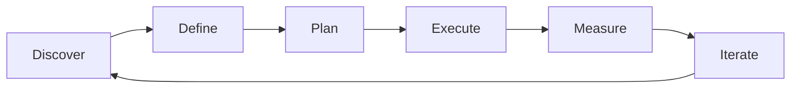

# Product Roadmapping — A 2-Day Crash Course

> **In one sentence:** A product roadmap is a communication tool that shows what the team plans to
> work on and roughly when — designed to align stakeholders around strategic priorities, not to
> promise exact delivery dates.

> Cross-references: `Product-Strategy.md` (the strategy the roadmap serves), `Product-Discovery.md`
> (discovery feeds what goes on the roadmap), `Product-Management-Fundamentals.md` (prioritisation
> frameworks like RICE), `Product-Analytics.md` (metrics that determine roadmap success).

---

## Part 0 — Why product roadmapping exists

Every product team faces the same pressure from multiple directions. Sales wants the integration
a prospect asked for. Support wants the bug that generates the most tickets fixed. The CEO wants
the big strategic bet. Engineering wants to pay down tech debt. And everyone believes their
request is the most important.

Without a roadmap, the team lurches between competing demands. Whoever shouts loudest wins. The
result: an incoherent product that serves no-one well, a team that feels whiplashed, and
stakeholders who distrust the product team because they never know what is coming.

A roadmap solves this by making priorities visible. It says: "Here is what we are working on,
here is what is coming next, and here is what we are deliberately not doing right now." It turns
an invisible decision process into a shared artefact that stakeholders can see, question, and
ultimately trust.

The critical distinction: a roadmap is a *plan*, not a *promise*. Plans change as you learn new
information. A roadmap that never changes is either fiction or a sign that the team is not
learning. The best roadmaps are designed to be updated, not carved in stone.

**Mental model:** A roadmap is a restaurant menu, not a contract. The menu tells you what the
kitchen can make and what they recommend — but the chef reserves the right to change the specials
based on what is fresh. You would not sue a restaurant because they ran out of the risotto. Treat
your roadmap the same way: a clear statement of current intent, honest about uncertainty.

---




## Part 1 — The vocabulary

| Term | Meaning |
|------|---------|
| **Theme** | A strategic area of investment (e.g. "reduce onboarding friction") — roadmaps organised by themes are more flexible than feature lists |
| **Now-Next-Later** | A time-horizon framework: Now (committed, in progress), Next (planned, high confidence), Later (exploratory, low confidence) |
| **RICE** | A scoring framework: Reach x Impact x Confidence / Effort — used to compare initiatives on a common scale |
| **ICE** | A simpler scoring variant: Impact x Confidence x Ease (1-10 each) |
| **Initiative** | A chunk of work larger than a feature but smaller than a theme — the typical unit on a roadmap |
| **Outcome-based roadmap** | A roadmap framed around problems to solve or metrics to move, not features to build |
| **Feature-based roadmap** | A roadmap listing specific features and dates — common but dangerous because it conflates the solution with the problem |
| **Stakeholder alignment** | The state where key stakeholders understand, if not always agree with, the current priorities and rationale |
| **Saying no** | The most important roadmap skill — declining requests without damaging relationships by explaining the trade-off |

---

## DAY 1 — Build a roadmap that works

### 1. The problem with feature roadmaps

Most roadmaps look like this:

```text
Q1: Build Jira integration
Q2: Launch mobile app
Q3: Add SSO support
Q4: Build reporting dashboard
```

This format has three problems:
- It commits to solutions before validating problems
- It creates date expectations that turn into broken promises
- It leaves no room for what you learn along the way

The alternative is an outcome-based roadmap that describes the *problem* or *metric* you are
targeting, not the specific feature:

```text
Q1: Reduce time-to-first-value for new users (target: 50% faster)
Q2: Enable teams to collaborate on investigations (target: 3+ users per session)
Q3: Meet enterprise security requirements (target: pass SOC 2 audit)
```

This gives the team freedom to find the best solution while giving stakeholders clarity on
direction.

### 2. Now-Next-Later framework

The most flexible roadmap format. It replaces precise dates with confidence horizons:

```text
NOW (in progress, committed)
├── Guided onboarding wizard — reduce setup time from 45 min to 15 min
└── Alert-to-trace correlation — auto-link alerts to relevant traces

NEXT (planned, high confidence, 1-3 months)
├── Team collaboration features — shared investigations
└── Custom dashboard builder — let users create their own views

LATER (exploring, low confidence, 3-6 months)
├── AI-assisted root cause analysis
└── Enterprise audit logging
```

**Now** items are committed — engineering is working on them. **Next** items are validated and
planned but not yet started. **Later** items are strategic directions under exploration — they
may change significantly or be dropped entirely.

This format honestly communicates certainty. Stakeholders know that "Later" means "we are
thinking about it" not "it will ship in Q4."

### 3. Prioritisation with RICE

When you have more ideas than capacity (always), RICE provides a structured way to compare:

```text
Initiative A: Guided onboarding wizard
  Reach:      2000 new users/quarter
  Impact:     3 (high — directly moves activation metric)
  Confidence: 80% (validated in discovery)
  Effort:     2 person-months
  Score:      (2000 × 3 × 0.8) / 2 = 2400

Initiative B: Jira integration
  Reach:      500 users/quarter (only teams using Jira)
  Impact:     1 (medium — convenience, not core value)
  Confidence: 50% (requested by sales, not validated)
  Effort:     3 person-months
  Score:      (500 × 1 × 0.5) / 3 = 83
```

RICE does not make the decision for you. It makes the trade-off visible: the onboarding wizard
scores 29x higher. That does not mean the Jira integration is wrong — it means you need a strong
strategic reason to do it first.

### 4. Theme-based organisation

Group roadmap items under strategic themes tied to your OKRs:

```text
Theme 1: Faster time-to-value (OKR: activation rate from 30% to 60%)
  - Guided onboarding wizard [NOW]
  - Template library for common setups [NEXT]

Theme 2: Team collaboration (OKR: multi-user sessions from 10% to 40%)
  - Shared investigation view [NEXT]
  - Commenting and tagging [LATER]

Theme 3: Platform trust (OKR: pass SOC 2 audit)
  - Audit logging [LATER]
  - SSO support [LATER]
```

Themes make it easy to answer "what percentage of our effort goes toward which strategic goal?"
If 80% of your roadmap falls under one theme, either that is the right focus or you are
neglecting something important.

### 5. By end of Day 1 you can:

- Explain why outcome-based roadmaps outperform feature lists
- Build a Now-Next-Later roadmap for your product
- Score initiatives with RICE to make trade-offs visible
- Organise your roadmap around strategic themes

---

## DAY 2 — Make it real

### 6. Stakeholder alignment

The roadmap is only useful if stakeholders understand and trust it. Alignment is an ongoing
process, not a one-time presentation:

**Before the roadmap review:**
- Share the roadmap document 24 hours in advance
- Highlight what changed since last review and why
- Anticipate the top 2-3 objections and prepare data

**During the review:**
- Start with the strategic context: "Here is what we are trying to achieve this quarter"
- Walk through each theme and its rationale
- Explicitly name what you are *not* doing and why
- Invite challenges — silence is not agreement

**After the review:**
- Send a written summary of decisions and rationale
- Track action items and follow up
- Update the roadmap based on legitimate new information

### 7. The art of saying no

Every roadmap is mostly "no." Saying no well is the skill that separates effective PMs from
overwhelmed ones:

**The framework:**
1. Acknowledge the request genuinely — "I understand why this matters to your team"
2. Explain the trade-off — "If we do this, we cannot do X, which impacts Y metric"
3. Share the data — "Our prioritisation scores this at Z because of reach/impact/confidence"
4. Offer an alternative — "Here is what we *can* do that partially addresses your need"
5. Leave the door open — "Let's revisit this next quarter when we reassess"

**What not to do:**
- Do not say "it's on the roadmap" when it is not — this creates false expectations
- Do not say "maybe later" without meaning it — stakeholders remember
- Do not blame engineering for capacity — own the prioritisation decision

### 8. Roadmap cadence and updates

A roadmap is a living document. Establish a regular cadence:

```text
Weekly:   Team reviews progress on NOW items, flags risks
Monthly:  PM reviews NEXT items against new data, adjusts sequencing
Quarterly: Full roadmap refresh — re-evaluate themes, re-score with RICE,
           align with updated OKRs
Ad hoc:   Major new information (customer loss, market shift, strategic
          pivot) triggers an immediate reassessment
```

Every update should have a changelog. Stakeholders who cannot see what changed and why will stop
trusting the roadmap.

### 9. Communicating roadmaps to different audiences

Different stakeholders need different views of the same roadmap:

| Audience | What they need | Format |
|----------|---------------|--------|
| **Executives** | Strategic direction, resource allocation, key bets | Theme-level, quarterly view |
| **Sales** | What is coming that helps close deals, what is not coming | Feature-level, with honest timelines |
| **Engineering** | What is next, technical dependencies, sequencing rationale | Initiative-level, with context on why |
| **Customers** | What problems you are solving, rough timing | Outcome-level, no internal details |

Never share the internal engineering roadmap with customers. They will read it as a contract.
Create an external-facing version that communicates intent without creating obligations.

### 10. When the roadmap is wrong

Sometimes the roadmap needs to change dramatically — a key customer churns, a competitor launches
something, market conditions shift. When this happens:

- Acknowledge the change openly, do not pretend the roadmap was always this way
- Explain what new information drove the change
- Show the trade-offs: "We are pulling in X, which means Y moves to Later"
- Communicate the change to everyone who was aligned on the previous version

A roadmap that never changes is a sign that the team is not learning. A roadmap that changes
every week is a sign that the team has no strategy. The sweet spot is a stable strategic
direction with tactical flexibility.

---

## Worked example — quarterly roadmap for an internal platform team

```text
1. Context: A platform team serves 8 internal product teams.
   OKRs for Q3:
   - Reduce deployment time from 45 min to 10 min
   - Achieve 99.9% platform uptime (currently 99.5%)
   - Onboard 2 new teams to the platform

2. Intake: 14 requests from internal teams, plus 5 tech debt items
   from engineering, plus a CEO request for a demo environment.

3. RICE scoring (top 5):
   | Initiative              | Reach | Impact | Conf | Effort | Score |
   |------------------------|-------|--------|------|--------|-------|
   | Parallel build pipeline | 8     | 3      | 90%  | 2      | 10.8  |
   | Auto-rollback on failure| 8     | 2      | 80%  | 1.5    | 8.5   |
   | New team onboarding kit | 2     | 3      | 70%  | 1      | 4.2   |
   | Demo environment        | 1     | 1      | 50%  | 3      | 0.17  |
   | Custom build plugins    | 3     | 1      | 40%  | 4      | 0.3   |

4. Roadmap:
   NOW:
   ├── Parallel build pipeline (directly serves deploy time OKR)
   └── Auto-rollback on failure (directly serves uptime OKR)

   NEXT:
   ├── New team onboarding kit (serves team onboarding OKR)
   └── Canary deployments (supports uptime after rollback ships)

   LATER:
   ├── Custom build plugins (low confidence, needs discovery)
   └── Demo environment (CEO request, low RICE score — discussed
       and agreed to defer with explanation)

5. Saying no: The CEO's demo environment request scored lowest.
   Conversation: "We understand the demo need for investor meetings.
   The trade-off is pulling a developer off the parallel pipeline,
   which delays the deploy time improvement by 3 weeks. We recommend
   using a staging environment with anonymised data as a stopgap.
   We can revisit a dedicated demo environment in Q4."
   CEO agreed.

6. Stakeholder communication:
   - Engineering: detailed initiative briefs with technical context
   - Internal teams: monthly update email with Now/Next/Later view
   - Leadership: quarterly review deck with OKR progress + roadmap
```

---


## Terminal Demo

```terminal-demo
# roadmap@planning ~ %

$ echo "NOW / NEXT / LATER"
--- NOW (this quarter) ---
✓ Checkout v2 (shipped May 15)
◌ AI incident assistant (in progress, 60%)
◌ SSO integration (starting next sprint)

--- NEXT (next quarter) ---
○ Self-service onboarding
○ Custom dashboards
○ Webhook integrations

--- LATER (future) ---
○ Mobile app
○ Marketplace for plugins
○ Multi-region deployment

$ echo "Roadmap Confidence"
NOW items:   90% confidence (committed, resourced)
NEXT items:  60% confidence (validated, not yet resourced)
LATER items: 30% confidence (strategic direction, may change)
```

---

## Common pitfalls

- **Date-driven roadmaps.** Putting specific dates on items creates false precision. Use
  time horizons (Now/Next/Later) instead of "ships March 15th." Dates become promises that
  erode trust when missed.
- **The feature graveyard.** A roadmap with 40 items where nothing gets removed. If your
  Later section has been growing for three quarters, you are not prioritising — you are
  collecting.
- **Roadmap by committee.** Letting every stakeholder add their pet item produces a roadmap that
  serves politics, not users. One person (the PM) owns the roadmap. Others provide input; they
  do not have edit rights.
- **Confusing a roadmap with a release plan.** The roadmap says "what and roughly when." The
  release plan says "exactly how and exactly when." They serve different audiences.
- **Not showing what you cut.** Stakeholders trust roadmaps more when they can see what was
  considered and deliberately excluded. A "not doing" section builds credibility.
- **Updating without communicating.** Changing the roadmap silently trains stakeholders to
  distrust it. Every change needs a notification and a rationale.
- **Building everything at once.** A roadmap with too many NOW items means nothing is truly
  prioritised. Limit NOW to what the team can realistically deliver in the current cycle.

---

## Quick reference

```text
# Now-Next-Later format
NOW:   Committed, in progress (high certainty)
NEXT:  Planned, validated (medium certainty, 1-3 months)
LATER: Exploring, strategic direction (low certainty, 3-6 months)

# RICE scoring
Score = (Reach × Impact × Confidence) / Effort
  Reach: users affected per quarter
  Impact: 3 = massive, 2 = high, 1 = medium, 0.5 = low, 0.25 = minimal
  Confidence: 100% / 80% / 50%
  Effort: person-months

# ICE scoring (simpler)
Score = Impact × Confidence × Ease (1-10 each)

# Theme structure
Theme (strategic goal) → Initiatives (roadmap items) → Features (delivery units)

# Stakeholder alignment cadence
Weekly:    Team progress check
Monthly:   PM adjusts sequencing
Quarterly: Full roadmap refresh with OKR alignment

# Saying no framework
Acknowledge → Explain trade-off → Share data → Offer alternative → Leave door open

# Audience-specific views
Executives:  Theme-level, quarterly
Sales:       Feature-level, honest timelines
Engineering: Initiative-level, with rationale
Customers:   Outcome-level, no internal details
```

---


## Top 10 Interview Questions

<details>
<summary><strong>Q: What is Product Roadmapping and what problem does it solve?</strong></summary>

Product Roadmapping addresses a specific need in modern engineering workflows. Understanding the core problem it solves — and the alternatives it replaced — is the foundation for every subsequent interview question. Frame your answer around the pain point first, then the solution.

</details>

<details>
<summary><strong>Q: How does Product Roadmapping compare to its main alternatives?</strong></summary>

Every tool exists in an ecosystem of alternatives. Be prepared to articulate the specific tradeoffs: when Product Roadmapping is the right choice, when an alternative is better, and what factors drive the decision (scale, team expertise, existing infrastructure, compliance requirements).

</details>

<details>
<summary><strong>Q: What are the most common production pitfalls with Product Roadmapping?</strong></summary>

Production experience is what separates senior from junior engineers. Common pitfalls include: misconfiguration that works in dev but fails at scale, security oversights, inadequate monitoring, and operational procedures that are untested until an incident occurs. Cite specific examples from your experience.

</details>

<details>
<summary><strong>Q: How do you monitor and observe Product Roadmapping in production?</strong></summary>

Key metrics to track, alerting thresholds to set, dashboards to build, and log patterns to watch. Production monitoring should cover: health/liveness, performance (latency, throughput), capacity (resource utilisation), and business impact (error rates affecting users). Explain which metrics are leading indicators versus lagging.

</details>

<details>
<summary><strong>Q: How do you scale Product Roadmapping as load increases?</strong></summary>

Scaling strategies depend on the bottleneck: horizontal scaling (add more instances), vertical scaling (bigger instances), caching (reduce load), sharding (distribute data), and async processing (decouple components). Explain which approach applies to Product Roadmapping and at what scale each strategy becomes necessary.

</details>

<details>
<summary><strong>Q: How do you handle security and access control with Product Roadmapping?</strong></summary>

Security is non-negotiable in production. Cover: authentication and authorization mechanisms, secrets management (never in code), encryption (at rest and in transit), network security (firewalls, private networks), audit logging, and compliance requirements relevant to your industry.

</details>

<details>
<summary><strong>Q: How do you implement disaster recovery for Product Roadmapping?</strong></summary>

DR planning requires defining RTO (recovery time objective) and RPO (recovery point objective), implementing backup strategies, testing restore procedures, and documenting runbooks. Explain your backup strategy, how you test restores, and what your recovery procedure looks like.

</details>

<details>
<summary><strong>Q: How do you automate Product Roadmapping deployment and configuration management?</strong></summary>

Infrastructure as code, CI/CD pipelines, configuration management, and GitOps workflows. Explain how you version, test, deploy, and roll back changes. Cover: what is automated, what requires manual approval, and how you handle configuration drift.

</details>

<details>
<summary><strong>Q: How do you troubleshoot issues with Product Roadmapping in production?</strong></summary>

A systematic debugging approach: check health endpoints, review recent changes (deploys, config changes), examine logs and metrics, reproduce the issue, identify root cause, fix, verify, and write a postmortem. Explain your actual debugging workflow with concrete examples.

</details>

<details>
<summary><strong>Q: What are the best practices for Product Roadmapping that you have learned from experience?</strong></summary>

Best practices that go beyond documentation: lessons learned from production incidents, configuration patterns that prevent common issues, testing strategies that catch bugs before production, and operational procedures that reduce toil. Share specific examples where following (or not following) a best practice had measurable impact.

</details>

---


## Quick Quiz

Test your understanding with these rapid-fire questions (answers hidden):

<details>
<summary>1. What is the ONE core problem that Product Roadmapping solves?</summary>
Re-read Part 0 — the mental model section. If you can explain the "why" in one sentence, you understand the foundation.
</details>

<details>
<summary>2. Name the 3 most important terms from the vocabulary section.</summary>
Review Part 1. These are the building blocks every conversation about Product Roadmapping uses.
</details>

<details>
<summary>3. What is the first thing you would set up on Day 1?</summary>
Check the Day 1 section — the very first hands-on step that gets you a working result.
</details>

<details>
<summary>4. What is the most common production pitfall with Product Roadmapping?</summary>
Review the Common Pitfalls section. The first item listed is typically the most frequently encountered.
</details>

<details>
<summary>5. How does Product Roadmapping compare to its closest alternative?</summary>
Check the Comparison Matrix below — focus on the key differentiating row.
</details>


## Comparison Matrix

| Dimension | NOW/NEXT/LATER | Timeline Roadmap | Theme-Based |
|-----------|----------------|------------------|-------------|
| **Primary use case** | Core strength of NOW/NEXT/LATER | Core strength of Timeline Roadmap | Core strength of Theme-Based |
| **Learning curve** | Moderate | Varies | Varies |
| **Community/ecosystem** | Active | Active | Growing |
| **Operational complexity** | Medium | Varies | Varies |
| **Best for** | See Part 0 | Different tradeoffs | Different tradeoffs |

> **How to read this matrix:** no tool wins on every dimension. Pick based on your specific constraints — team expertise, existing infrastructure, scale requirements, and compliance needs. The right choice is the one that fits your context, not the one with the most checkmarks.

## Next steps after Day 2

- `Product-Strategy.md` — the strategic context that drives roadmap priorities
- `Product-Discovery.md` — validating roadmap items before committing to them
- `Product-Analytics.md` — measuring whether roadmap bets paid off
- `Product-Management-Fundamentals.md` — the broader PM toolkit including PRDs and stakeholder management

---

## Recommended learning resources

**YouTube channels & playlists:**
- [Lenny's Podcast](https://www.youtube.com/@LennysPodcast) — episodes on roadmapping with PMs from Linear, Notion, Figma
- [Shreyas Doshi](https://www.youtube.com/@ShreyasDoshi) — prioritisation frameworks, saying no, roadmap communication
- [Product School](https://www.youtube.com/@ProductSchool) — roadmap workshops and stakeholder alignment techniques
- [SVPG — Marty Cagan](https://www.youtube.com/@SVPG) — outcome-based roadmaps, empowered teams

**Official docs & blogs:**
- [Itamar Gilad (itamargilad.com)](https://itamargilad.com/) — the GIST framework, evidence-guided roadmapping
- [Lenny's Newsletter](https://www.lennysnewsletter.com/) — roadmap templates, prioritisation benchmarks
- [Mind the Product](https://www.mindtheproduct.com/) — articles on roadmap communication and stakeholder management
- [Silicon Valley Product Group (svpg.com)](https://www.svpg.com/articles/) — outcome-based roadmaps, product vision

## Recommended learning resources

**YouTube channels & playlists:**
- [Productboard](https://www.youtube.com/@productboard) — roadmap prioritisation, stakeholder alignment, and outcome-driven roadmapping
- [Mind the Product](https://www.youtube.com/@mindtheproduct) — ProductTank talks on roadmapping strategies, NOW/NEXT/LATER frameworks, and product leadership
- [Lenny Rachitsky](https://www.youtube.com/@LennyRachitsky) — how top PMs build and communicate roadmaps at scale

**Books & articles:**
- [Product Roadmaps Relaunched — C. Todd Lombardo et al.](https://www.goodreads.com/book/show/36507075-product-roadmaps-relaunched) — modern roadmapping: themes over features, outcomes over outputs
- [Intercom on Product Management](https://www.intercom.com/books/product-management) — free guide covering roadmapping, prioritisation, and saying no

**The mantra:** A roadmap is a plan, not a promise — organise it by outcomes, score it with data, communicate it with honesty, and update it as you learn.
