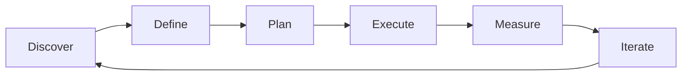

# Product Strategy — A 2-Day Crash Course

> **In one sentence:** Product strategy is the set of deliberate choices about who you serve, what
> value you deliver, and how you win — the bridge between a company's vision and the daily
> prioritisation decisions a product team makes.

> Cross-references: `Product-Management-Fundamentals.md` (the role that executes strategy),
> `Product-Discovery.md` (how you validate strategic bets), `Product-Roadmapping.md` (how strategy
> becomes a plan), `Product-Analytics.md` (how you measure whether the strategy is working).

---

## Part 0 — Why product strategy exists

Without strategy, a product team is a feature factory. Requests come in from sales, support,
executives, and competitors — and the team builds them in whatever order feels most urgent. The
result is a product that does a bit of everything and excels at nothing. Users cannot explain what
it is for. The team cannot explain why they are building what they are building.

Product strategy exists to prevent this drift. It answers three questions that sit above any
individual feature decision: *Who are we building for?* *What problem do we solve better than
anyone else?* *How do we know we are winning?* Once those answers are clear, every roadmap
decision becomes a filter: does this initiative move the strategy forward, or is it noise?

The hardest part of strategy is not choosing what to do — it is choosing what *not* to do. A
strategy that says "we will serve everyone, do everything, and win everywhere" is not a strategy.
It is a wish. Real strategy forces painful trade-offs: this segment, not that one; this wedge,
not the full market; this metric, not vanity growth.

**Mental model:** Strategy is a compass, not a map. A map tells you every turn to make (that is
the roadmap). A compass tells you which direction is north — so when the terrain changes and the
map is wrong, you still know where to go. Every product decision should point toward the same
north.

---




## Part 1 — The vocabulary

| Term | Meaning |
|------|---------|
| **Vision** | The aspirational future state your product is working toward — typically 3-5 years out. Intentionally ambitious and directional |
| **Mission** | What you do today, for whom, and why it matters — the grounding statement beneath the vision |
| **Strategy** | The set of choices about where to play and how to win that connect the vision to execution |
| **OKR** (Objectives and Key Results) | A goal-setting framework: the Objective is qualitative (what you want to achieve), Key Results are quantitative (how you measure progress) |
| **North Star Metric** | The single metric that best captures the core value your product delivers to users — the ultimate measure of strategic progress |
| **Product-market fit** | The state where your product solves a real problem for a defined market well enough that growth becomes pull, not push |
| **Moat** | A sustainable competitive advantage that makes it hard for others to replicate your position — network effects, switching costs, data, brand |
| **Wedge** | The narrow entry point into a larger market — the first problem you solve brilliantly before expanding |
| **Input metric** | A leading indicator your team can directly influence that feeds into the North Star (e.g. activation rate feeds into retention) |

---

## DAY 1 — Build the strategic foundation

### 1. Vision and mission

The vision is where you are going. The mission is what you do right now:

```text
Vision:  "A world where every team ships software with confidence."
Mission: "We provide automated testing infrastructure that catches bugs
          before users do."
```

A useful vision is ambitious enough to guide decisions for years but specific enough to exclude
things. "Make the world better" is not a vision. "Make financial services accessible to the
unbanked" is — it tells you who, what domain, and what direction.

### 2. The strategy stack

Strategy is not a single document. It is a stack of choices that cascade:

```text
Company Vision          (3-5 year aspiration)
    ↓
Company Strategy        (where to play, how to win)
    ↓
Product Strategy        (which user problems, which segments, which positioning)
    ↓
Product Roadmap         (what to build, in what order)
    ↓
Sprint Plan             (what to build this week)
```

Each layer inherits constraints from the one above. A product strategy that contradicts the
company strategy is not bold — it is disconnected. Your job is to make the product layer concrete
enough that teams can act on it.

### 3. Strategic choices — where to play and how to win

Every product strategy must answer these five questions (adapted from Roger Martin's "Playing to
Win"):

1. **What is our winning aspiration?** — What does success look like?
2. **Where will we play?** — Which markets, segments, geographies, use cases?
3. **How will we win?** — What is our unique advantage in those chosen areas?
4. **What capabilities must we have?** — What do we need to build or acquire?
5. **What management systems do we need?** — How do we measure and govern?

The most common mistake is answering questions 4 and 5 before settling questions 2 and 3. Teams
jump to building capabilities before they have decided where they are competing.

### 4. Competitive positioning

Positioning defines how your product occupies a distinct place in the user's mind relative to
alternatives:

```text
For [target user]
Who [has this problem]
Our product is a [category]
That [key benefit]
Unlike [primary alternative]
We [key differentiator]
```

Fill this in honestly. If you cannot articulate how you differ from the primary alternative, you
do not have positioning — you have a description.

### 5. By end of Day 1 you can:

- Articulate a product vision and mission that guides decisions
- Walk through the strategy stack from vision to sprint
- Answer the five "where to play / how to win" questions
- Write a positioning statement that differentiates your product

---

## DAY 2 — Make it real

### 6. OKRs — connecting strategy to execution

OKRs translate strategy into measurable quarterly goals:

```text
Objective:  Become the go-to testing platform for mid-market SaaS teams
  KR1: Increase mid-market trial-to-paid conversion from 12% to 20%
  KR2: Achieve 40 NPS among mid-market accounts
  KR3: Reduce mid-market time-to-first-test from 45 min to 15 min
```

**Objectives** are qualitative, aspirational, and time-bound (usually quarterly). **Key Results**
are quantitative, measurable, and ideally outcomes not outputs. "Ship the onboarding redesign" is
an output. "Reduce time-to-first-test to 15 minutes" is an outcome.

Set 2-4 OKRs per quarter. More than that and nothing is a priority.

### 7. North Star metrics

The North Star metric captures the core value exchange between your product and its users:

| Product type | Example North Star |
|-------------|-------------------|
| Marketplace | Transactions completed per week |
| SaaS tool | Weekly active users completing core action |
| Content platform | Total time spent consuming content |
| Fintech | Money moved through the platform monthly |

The North Star is supported by input metrics — the levers teams pull to move it:

```text
North Star: Weekly active teams running tests
    ↓
Input metrics:
  - New team activation rate (first test within 24h)
  - Test suite expansion rate (tests added per team per week)
  - Retention rate (teams still active at 30 days)
```

### 8. Product-market fit

Product-market fit is the state where your product solves a real problem well enough that demand
exceeds your ability to supply. Signs you have it:

- Users tell other users about the product without being asked
- Usage grows even when you stop marketing
- Users complain loudly when you consider removing features
- Sean Ellis test: 40%+ of surveyed users say they would be "very disappointed" if the product
  disappeared

Signs you do not have it:

- Growth stalls without paid acquisition
- Churn is persistently high
- Users sign up but never reach the core action
- You are selling a solution to a problem users do not recognise

Before product-market fit, strategy is about *finding* the right problem-solution-market
combination. After product-market fit, strategy is about *scaling* what works and defending the
position.

### 9. Strategic frameworks in practice

**Jobs-to-be-Done (JTBD):** Frame strategy around the job the user is hiring your product to do,
not around features or demographics. "Help me understand why my tests fail" is a job. "Provide a
dashboard" is a feature.

**Blue Ocean strategy:** Instead of competing head-to-head (red ocean), identify uncontested
market space by eliminating, reducing, raising, or creating factors the industry takes for
granted.

**The Kano model:** Categorise features as basic (expected — absence causes dissatisfaction),
performance (more is better — linear satisfaction), or delight (unexpected — creates
disproportionate satisfaction). Strategy should ensure basics are covered before chasing delights.

### 10. Saying no with strategy

Strategy's greatest value is providing a principled framework for saying no:

```text
Request: "Build an integration with Jira."
Strategic filter:
  - Does it serve our target segment? (mid-market SaaS) → Yes
  - Does it move our North Star? (teams running tests) → Indirectly
  - Does it strengthen our moat? (ease of setup) → Yes
  → Prioritise, but sequence after activation improvements (KR3)

Request: "Build an enterprise audit log."
Strategic filter:
  - Does it serve our target segment? (mid-market SaaS) → No, enterprise
  - Does it move our North Star? → Marginally
  - Does it strengthen our moat? → No
  → Not now. Revisit when we expand upmarket.
```

---

## Worked example — strategy for a developer tools startup

```text
1. Context: A startup sells automated code review tools. Growth has
   plateaued at ~500 paying teams. The CEO wants to "go enterprise."

2. Current state assessment:
   - 80% of paying customers are teams of 5-20 developers
   - NPS is 62 among small teams, 28 among the few enterprise trials
   - Core differentiator: setup takes 5 minutes (competitors take days)
   - Churn: 3% monthly for small teams, 15% for enterprise trials

3. Strategic choices:
   - Where to play: mid-market dev teams (10-50 developers), not enterprise
   - How to win: fastest time-to-value — 5-minute setup, zero config
   - What not to do: enterprise compliance features, on-premise deployment
   - Wedge: expand from code review into the broader CI testing workflow

4. OKRs (Q3):
   Objective: Double adoption among mid-market teams
     KR1: Increase mid-market signups from 80/month to 160/month
     KR2: Achieve 70% activation rate (first review within 1 hour)
     KR3: Launch CI test integration used by 30% of active teams

5. North Star: Teams running automated reviews weekly
   Input metrics: signup rate, activation rate, expansion rate

6. What they said no to: enterprise audit logs, SOC 2 compliance,
   on-premise deployment, Jira deep integration. All reasonable
   requests. None aligned with the chosen strategy.
```

---


## Terminal Demo

```terminal-demo
# strategy@product ~ %

$ echo "Strategy Canvas"
Vision:   "Every SRE team ships with confidence"
Mission:  Reduce MTTR by 50% through AI-powered incident response
North Star: Time-to-resolution for P1 incidents

$ echo "OKR Q3 2026"
O: Improve incident response speed
  KR1: Reduce MTTR from 45min to 22min (50%)
  KR2: Auto-resolve 30% of P3 incidents
  KR3: Achieve 90% customer satisfaction on incident handling

$ echo "Competitive Landscape"
| Dimension      | Us    | Competitor A | Competitor B |
|---------------|-------|-------------|-------------|
| AI-powered    | ✓     | Partial     | ✗           |
| Self-hosted   | ✓     | ✗           | ✓           |
| Price         | $$    | $$$         | $           |
```

---

## Common pitfalls

- **Strategy by accretion.** Adding every good idea to the strategy until it says everything and
  therefore means nothing. A strategy with ten priorities has zero priorities.
- **Confusing vision with strategy.** Vision is the destination. Strategy is the route. "Be the
  best testing platform" is a vision. "Win mid-market SaaS by being the fastest to set up" is a
  strategy.
- **Skipping the "how to win" question.** Most teams can articulate *where* they play but not
  *why* they win there. If you cannot name your advantage, you are competing on luck.
- **OKRs as task lists.** "Ship feature X" is a task, not a key result. Key results measure
  outcomes — the behaviour change you expect the work to produce.
- **Chasing competitors.** Reacting to every competitor launch is not strategy — it is letting
  someone else set your agenda. Respond to competitive moves only when they threaten your
  chosen position.
- **Premature scaling.** Expanding to new segments before achieving product-market fit in the
  first one. You cannot scale what does not work.
- **Strategy as a secret.** If the team cannot articulate the strategy in one sentence, the
  strategy does not exist. Write it down. Share it widely. Repeat it often.

---

## Quick reference

```text
# Strategy stack
Vision → Company Strategy → Product Strategy → Roadmap → Sprint Plan

# Playing to Win — five questions
1. Winning aspiration
2. Where to play (segments, markets, use cases)
3. How to win (unique advantage)
4. Capabilities required
5. Management systems needed

# OKR format
Objective: [qualitative, aspirational, time-bound]
  KR1: [quantitative outcome metric] from X to Y
  KR2: [quantitative outcome metric] from X to Y
  KR3: [quantitative outcome metric] from X to Y

# Positioning template
For [target user] who [problem], our product is a [category]
that [key benefit], unlike [alternative], we [differentiator].

# Product-market fit test
40%+ of users would be "very disappointed" without the product

# North Star decomposition
North Star Metric → Input Metric 1 + Input Metric 2 + Input Metric 3

# Strategic saying-no filter
Does it serve our target segment? → Does it move our North Star?
→ Does it strengthen our moat? → Sequence accordingly.
```

---


## Top 10 Interview Questions

<details>
<summary><strong>Q: What is Product Strategy and what problem does it solve?</strong></summary>

Product Strategy addresses a specific need in modern engineering workflows. Understanding the core problem it solves — and the alternatives it replaced — is the foundation for every subsequent interview question. Frame your answer around the pain point first, then the solution.

</details>

<details>
<summary><strong>Q: How does Product Strategy compare to its main alternatives?</strong></summary>

Every tool exists in an ecosystem of alternatives. Be prepared to articulate the specific tradeoffs: when Product Strategy is the right choice, when an alternative is better, and what factors drive the decision (scale, team expertise, existing infrastructure, compliance requirements).

</details>

<details>
<summary><strong>Q: What are the most common production pitfalls with Product Strategy?</strong></summary>

Production experience is what separates senior from junior engineers. Common pitfalls include: misconfiguration that works in dev but fails at scale, security oversights, inadequate monitoring, and operational procedures that are untested until an incident occurs. Cite specific examples from your experience.

</details>

<details>
<summary><strong>Q: How do you monitor and observe Product Strategy in production?</strong></summary>

Key metrics to track, alerting thresholds to set, dashboards to build, and log patterns to watch. Production monitoring should cover: health/liveness, performance (latency, throughput), capacity (resource utilisation), and business impact (error rates affecting users). Explain which metrics are leading indicators versus lagging.

</details>

<details>
<summary><strong>Q: How do you scale Product Strategy as load increases?</strong></summary>

Scaling strategies depend on the bottleneck: horizontal scaling (add more instances), vertical scaling (bigger instances), caching (reduce load), sharding (distribute data), and async processing (decouple components). Explain which approach applies to Product Strategy and at what scale each strategy becomes necessary.

</details>

<details>
<summary><strong>Q: How do you handle security and access control with Product Strategy?</strong></summary>

Security is non-negotiable in production. Cover: authentication and authorization mechanisms, secrets management (never in code), encryption (at rest and in transit), network security (firewalls, private networks), audit logging, and compliance requirements relevant to your industry.

</details>

<details>
<summary><strong>Q: How do you implement disaster recovery for Product Strategy?</strong></summary>

DR planning requires defining RTO (recovery time objective) and RPO (recovery point objective), implementing backup strategies, testing restore procedures, and documenting runbooks. Explain your backup strategy, how you test restores, and what your recovery procedure looks like.

</details>

<details>
<summary><strong>Q: How do you automate Product Strategy deployment and configuration management?</strong></summary>

Infrastructure as code, CI/CD pipelines, configuration management, and GitOps workflows. Explain how you version, test, deploy, and roll back changes. Cover: what is automated, what requires manual approval, and how you handle configuration drift.

</details>

<details>
<summary><strong>Q: How do you troubleshoot issues with Product Strategy in production?</strong></summary>

A systematic debugging approach: check health endpoints, review recent changes (deploys, config changes), examine logs and metrics, reproduce the issue, identify root cause, fix, verify, and write a postmortem. Explain your actual debugging workflow with concrete examples.

</details>

<details>
<summary><strong>Q: What are the best practices for Product Strategy that you have learned from experience?</strong></summary>

Best practices that go beyond documentation: lessons learned from production incidents, configuration patterns that prevent common issues, testing strategies that catch bugs before production, and operational procedures that reduce toil. Share specific examples where following (or not following) a best practice had measurable impact.

</details>

---


## Quick Quiz

Test your understanding with these rapid-fire questions (answers hidden):

<details>
<summary>1. What is the ONE core problem that Product Strategy solves?</summary>
Re-read Part 0 — the mental model section. If you can explain the "why" in one sentence, you understand the foundation.
</details>

<details>
<summary>2. Name the 3 most important terms from the vocabulary section.</summary>
Review Part 1. These are the building blocks every conversation about Product Strategy uses.
</details>

<details>
<summary>3. What is the first thing you would set up on Day 1?</summary>
Check the Day 1 section — the very first hands-on step that gets you a working result.
</details>

<details>
<summary>4. What is the most common production pitfall with Product Strategy?</summary>
Review the Common Pitfalls section. The first item listed is typically the most frequently encountered.
</details>

<details>
<summary>5. How does Product Strategy compare to its closest alternative?</summary>
Check the Comparison Matrix below — focus on the key differentiating row.
</details>


## Comparison Matrix

| Dimension | Outcome-Driven | Feature-Driven | Vision-Driven |
|-----------|----------------|----------------|---------------|
| **Primary use case** | Core strength of Outcome-Driven | Core strength of Feature-Driven | Core strength of Vision-Driven |
| **Learning curve** | Moderate | Varies | Varies |
| **Community/ecosystem** | Active | Active | Growing |
| **Operational complexity** | Medium | Varies | Varies |
| **Best for** | See Part 0 | Different tradeoffs | Different tradeoffs |

> **How to read this matrix:** no tool wins on every dimension. Pick based on your specific constraints — team expertise, existing infrastructure, scale requirements, and compliance needs. The right choice is the one that fits your context, not the one with the most checkmarks.

## Next steps after Day 2

- `Product-Discovery.md` — how to validate the strategic bets you have made
- `Product-Roadmapping.md` — translating strategy into a sequenced plan
- `Product-Analytics.md` — measuring whether the strategy is working
- `Product-Led-Growth.md` — a specific growth strategy worth understanding deeply

---

## Recommended learning resources

**YouTube channels & playlists:**
- [Lenny's Podcast](https://www.youtube.com/@LennysPodcast) — episodes on strategy with leaders from Figma, Notion, Amplitude
- [Shreyas Doshi](https://www.youtube.com/@ShreyasDoshi) — frameworks for strategic thinking, prioritisation, and focus
- [SVPG — Marty Cagan](https://www.youtube.com/@SVPG) — product strategy in empowered teams, product vision
- [Reforge](https://www.youtube.com/@Reforge) — growth strategy, product-market fit, strategic loops

**Official docs & blogs:**
- [Silicon Valley Product Group (svpg.com)](https://www.svpg.com/articles/) — Marty Cagan on product vision and strategy
- [Lenny's Newsletter](https://www.lennysnewsletter.com/) — strategy frameworks, North Star metrics, benchmarks
- [Itamar Gilad (itamargilad.com)](https://itamargilad.com/) — the GIST framework, confidence-driven planning
- [Roger Martin's "Playing to Win"](https://rogerlmartin.com/lets-read/playing-to-win) — the foundational strategy framework

## Recommended learning resources

**YouTube channels & playlists:**
- [Lenny Rachitsky — Lenny's Podcast](https://www.youtube.com/@LennyRachitsky) — deep dives on product strategy with leaders from Notion, Linear, Figma, and Ramp
- [Gibson Biddle](https://www.youtube.com/@gibsonbiddle) — former Netflix VP Product on DHM model, strategy frameworks, and product leadership
- [Reforge](https://www.youtube.com/@Reforge) — advanced product strategy, growth models, and retention frameworks from practitioners

**Books & articles:**
- [Good Strategy Bad Strategy — Richard Rumelt](https://www.goodreads.com/book/show/11721966-good-strategy-bad-strategy) — the definitive book on strategy; diagnosis, guiding policy, coherent actions
- [Escaping the Build Trap — Melissa Perri](https://melissaperri.com/book) — how to shift from output-focused to outcome-focused product management

**The mantra:** Strategy is the art of choosing what not to do — pick your segment, name your advantage, measure one North Star, and say no to everything that does not point toward it.
