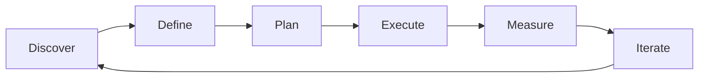

# Project Management Fundamentals — A 2-Day Crash Course

> **In one sentence:** Project management is the discipline of planning, executing, and
> controlling work to deliver a defined outcome within constraints of scope, time, and cost —
> the operating system that keeps complex efforts from drifting into chaos.

> Cross-references: `Product-Management-Fundamentals.md` (decides *what* to build — project
> management decides *how* to deliver it), `Sprint-Planning-Estimation.md` (Agile execution
> mechanics), `Technical-Program-Management.md` (scaling project management across multiple
> teams), `Delivery-Execution.md` (release planning and launch).

---

## Part 0 — Why project management exists

Every team that has ever said "we just need to start coding" and then missed the deadline by
three months has learned why project management exists. The code is not the hard part. The hard
part is knowing what to build, in what order, with which people, by when — and adjusting the
plan when reality changes.

Without project management, teams operate on assumptions. Assumptions about who is doing what.
Assumptions about when things will be ready. Assumptions about what "done" means. Those
assumptions diverge silently until the deadline arrives and everyone discovers they built
different things, in the wrong order, with gaps nobody noticed.

Project management exists to replace assumptions with explicit plans, visible progress, and
structured decisions about trade-offs. It does not remove uncertainty — it manages it.

The one idea that unlocks project management: **every project is a negotiation between scope,
time, and cost.** You cannot change one without affecting the others. The project manager's job
is to make that negotiation explicit so that stakeholders make informed choices instead of
discovering the consequences after the fact.

**Mental model:** A project is like building a house. You can have it big (scope), fast (time),
or cheap (cost) — pick two. The architect (product) decides what the house looks like. The
builders (engineering) do the construction. The project manager is the general contractor: they
sequence the trades, manage the schedule, flag when the plumbing is late and will delay the
drywall, and tell the homeowner "adding a third bathroom means two more weeks" before the wall
is already framed.

---




## Part 1 — The vocabulary

| Term | Meaning |
|------|---------|
| **Triple constraint** | The three competing dimensions of every project: scope, time, and cost. Change one and the others must adjust |
| **Project charter** | A short document that formally authorises the project — states the objective, scope boundaries, key stakeholders, and success criteria |
| **WBS** (Work Breakdown Structure) | A hierarchical decomposition of all the work required to complete the project — from deliverables down to individual tasks |
| **Milestone** | A significant checkpoint that marks the completion of a phase or key deliverable — not a task, but a state |
| **Critical path** | The longest sequence of dependent tasks that determines the minimum project duration. Delays here delay the project |
| **Stakeholder** | Anyone who affects or is affected by the project — sponsors, users, teams, regulators, operations |
| **Risk** | An uncertain event that, if it occurs, will affect the project positively or negatively. Managed by identifying, assessing, and planning responses |
| **Change request** | A formal proposal to modify scope, timeline, or budget. Must be evaluated for impact before approval |
| **PMBOK** | Project Management Body of Knowledge — PMI's framework of project management processes, knowledge areas, and best practices |

The key distinction every engineer should understand: **Waterfall plans the whole project up
front and executes linearly. Agile plans iteratively and delivers incrementally. Hybrid uses
Waterfall for the overall structure and Agile for the execution within phases.** None is
universally right — the choice depends on how much you know at the start and how much will
change along the way.

---

## DAY 1 — Understand the fundamentals

### 1. The triple constraint

Every project conversation is ultimately about three variables:

```text
        Scope
       /     \
      /       \
   Time ——— Cost

Change scope (add features)  → time increases or cost increases
Reduce time (ship sooner)    → scope decreases or cost increases
Cut cost (fewer people)      → scope decreases or time increases
```

The project manager's job is not to make all three perfect — it is to make the trade-offs
visible. When a stakeholder says "add this feature but don't slip the date," the correct
response is: "we can do that if we either drop another feature or add two engineers."

### 2. Waterfall vs Agile vs Hybrid

| Aspect | Waterfall | Agile | Hybrid |
|--------|-----------|-------|--------|
| **Planning** | Complete up front | Iterative, per-sprint | Phased milestones, Agile within each phase |
| **Requirements** | Fixed at start | Evolving through discovery | Major scope fixed, details evolve |
| **Delivery** | One delivery at the end | Incremental every sprint | Incremental within fixed phases |
| **Change handling** | Formal change request | Welcomed, re-prioritised | Change requests for phase scope, Agile within phase |
| **Best when** | Requirements are stable and well-understood | Requirements will evolve, fast feedback needed | Regulatory milestones with flexible implementation |
| **Risk** | Late discovery of problems | Scope creep without discipline | Complexity of managing two modes |

Most modern software teams use Agile. But many organisations — especially in BFSI, healthcare,
and government — operate in environments where Waterfall-style milestones are required for
regulatory compliance or contract management. Hybrid bridges that gap: fixed milestone gates for
governance, Agile sprints for execution within each gate.

### 3. The project lifecycle

Regardless of methodology, every project passes through five phases:

```text
1. Initiating    — define the project, get authorisation (project charter)
2. Planning      — build the roadmap, WBS, schedule, risk plan
3. Executing     — do the work (sprints, builds, deployments)
4. Monitoring    — track progress, manage risks, handle changes
5. Closing       — deliver the outcome, conduct lessons learned, release resources
```

In Waterfall, these are sequential. In Agile, phases 3 and 4 happen continuously within each
sprint, and "closing" happens at the end of each increment as well as the overall project.

### 4. The project charter

A project charter is not a 50-page document. It is a one-to-two page agreement that says:

```text
Project Charter: [Project Name]

1. Objective:        What are we delivering and why?
2. Scope:            What is in, what is explicitly out?
3. Success criteria:  How do we measure success? (metrics, not feelings)
4. Key stakeholders: Who sponsors, who decides, who contributes, who is informed?
5. Timeline:         Major milestones and target dates
6. Budget/resources: Team size, infrastructure costs, external dependencies
7. Risks:            Top 3-5 known risks and initial mitigation ideas
8. Approval:         Sponsor sign-off
```

The charter prevents the most common project failure: different people thinking the project is
about different things. Write it before a single line of code.

### 5. Work Breakdown Structure (WBS)

The WBS decomposes a project into manageable pieces:

```text
Level 1: Project
  Level 2: Deliverable / Phase
    Level 3: Work package
      Level 4: Task / Story

Example — Payment Gateway Migration:
  1. Payment Gateway Migration
    1.1 Design Phase
      1.1.1 Architecture review
      1.1.2 API contract definition
      1.1.3 Security assessment
    1.2 Build Phase
      1.2.1 Gateway adapter service
      1.2.2 Transaction routing logic
      1.2.3 Reconciliation updates
    1.3 Test Phase
      1.3.1 Integration testing
      1.3.2 Performance testing
      1.3.3 Security penetration testing
    1.4 Launch Phase
      1.4.1 Progressive rollout
      1.4.2 Monitoring setup
      1.4.3 Runbook creation
```

The WBS answers: "what are all the pieces of work?" The schedule answers: "in what order, and
how long?" The two together give you the project plan.

### 6. By end of Day 1 you can:

- Explain the triple constraint and use it to frame trade-off conversations
- Choose between Waterfall, Agile, and Hybrid for a given project context
- Write a project charter that aligns stakeholders
- Decompose a project into a WBS

---

## DAY 2 — Make it real

### 7. Scheduling and the critical path

Once you have the WBS, estimate each task and map dependencies:

```text
Task              Duration   Depends on
A: API design     5 days     —
B: DB schema      3 days     A
C: Auth module    4 days     A
D: API build      8 days     B
E: Frontend       6 days     A
F: Integration    5 days     D, E
G: Perf testing   3 days     F
H: Launch         2 days     G, C

Critical path: A → B → D → F → G → H = 5+3+8+5+3+2 = 26 days
(C and E are parallel and shorter, so they have float)
```

Float (slack) is the time a task can slip without delaying the project. Tasks on the critical
path have zero float. Focus your attention there.

### 8. PMBOK essentials for engineers

You do not need PMP certification to be effective. But knowing these PMBOK knowledge areas helps
you speak the language of project management in enterprise settings:

| Knowledge area | What it covers | Why engineers care |
|---------------|---------------|-------------------|
| **Scope management** | What is in and out of the project | Prevents scope creep eating your sprint |
| **Schedule management** | Timeline, milestones, critical path | Tells you when your work blocks others |
| **Risk management** | Identify, assess, respond to risks | Engineering risks (tech debt, unknowns) get tracked formally |
| **Stakeholder management** | Who needs what information when | Explains why you get asked for status updates |
| **Integration management** | How all the pieces fit together | The PM's version of systems thinking |
| **Quality management** | Definition of done, acceptance criteria | Your tests and code reviews live here |

### 9. Risk management in practice

Risk management is not bureaucracy — it is the practice of worrying productively:

```text
Risk register format:
| ID   | Risk                                  | Prob   | Impact | Score | Response        | Owner   |
|------|---------------------------------------|--------|--------|-------|-----------------|---------|
| R-01 | Key engineer leaves mid-project       | Medium | High   | 6     | Cross-train now | EM      |
| R-02 | Third-party API changes during build  | Low    | High   | 4     | Pin API version | TechLead|
| R-03 | Regulatory review takes longer than 2w| Medium | High   | 6     | Start early     | TPM     |
| R-04 | Performance target not met            | Medium | Medium | 4     | Spike in Sprint 3| SRE    |

Probability: Low=1, Medium=2, High=3
Impact:      Low=1, Medium=2, High=3
Score = Probability x Impact (higher = more attention)
```

Risk responses:
- **Avoid** — change the plan to eliminate the risk entirely
- **Mitigate** — reduce the probability or impact
- **Transfer** — shift the risk to someone else (insurance, SLAs, contracts)
- **Accept** — acknowledge and monitor (for low-score risks)

### 10. Change management

Scope changes are inevitable. The question is whether they are managed or chaotic:

```text
Change request process:
1. Request: someone proposes a change (new feature, scope reduction, timeline shift)
2. Impact assessment: PM analyses effect on scope, schedule, cost, and risk
3. Review: stakeholders evaluate trade-offs
4. Decision: approve, reject, or defer
5. Update: plan, WBS, and schedule adjusted if approved

Example:
  Request: "Add multi-currency support to the payment migration"
  Impact:  +3 weeks to schedule, +1 engineer needed, new risk (exchange rate API)
  Decision: Defer to Phase 2 — regulatory deadline takes priority
```

Without a change process, every stakeholder request becomes an implicit scope addition.
The result is a project that is perpetually "almost done" because the finish line keeps moving.

### 11. Monitoring and reporting

Track progress against the plan, not against feelings:

```text
Key project health metrics:
  - Schedule variance: are we ahead or behind? (planned vs actual completion)
  - Scope variance: has scope grown? (original WBS vs current WBS)
  - Budget burn rate: are we spending faster than planned?
  - Risk trend: are risks increasing or being retired?
  - Team health: is the team sustainable or burning out?

Status report format (weekly):
  Overall RAG: [Green / Amber / Red]
  What shipped this week: [bullet list]
  What is planned next week: [bullet list]
  Blockers / risks: [bullet list with owners]
  Decisions needed: [bullet list with deadline]
```

### 12. Closing a project properly

Projects that never officially close haunt organisations. Close explicitly:

```text
Project closing checklist:
  [ ] All deliverables accepted by stakeholders
  [ ] Lessons learned documented (what worked, what to change)
  [ ] Outstanding risks transferred to operations
  [ ] Documentation handed to the maintenance team
  [ ] Resources (people, infrastructure) formally released
  [ ] Final status communicated to all stakeholders
  [ ] Project archived in the team's knowledge base
```

The lessons-learned session is the most valuable and most skipped part of closing. Run it while
the experience is fresh. Feed findings into the next project's risk register.

---

## Worked example — planning a regulatory-deadline project

```text
Context: A BFSI platform must implement new transaction-reporting requirements
mandated by the regulator. Hard deadline: 1 September 2026. Non-negotiable.
Three teams involved, six-month timeline.

1. Project charter written:
   Objective: Comply with Regulation XYZ by generating daily transaction reports
   in the prescribed format and submitting them to the regulator's portal.
   Scope IN:  Report generation, data extraction, portal integration, audit trail
   Scope OUT: Changing the underlying transaction processing system
   Success criteria: Reports accepted by regulator portal in UAT by 15 August
   Risks: Regulator may change format mid-project; legacy data quality issues

2. WBS created:
   1.1 Data extraction layer (Team Alpha)
   1.2 Report generation engine (Team Beta)
   1.3 Portal integration and submission (Team Gamma)
   1.4 Audit trail and compliance logging (Team Alpha)
   1.5 Testing and UAT (all teams)
   1.6 Launch and monitoring (SRE + all teams)

3. Schedule built:
   Critical path: Data extraction → Report generation → Portal integration →
   UAT → Launch = 22 weeks
   Total timeline: 24 weeks (2 weeks buffer)
   Methodology: Hybrid — Waterfall milestones (Design Review, UAT Gate,
   Launch Gate), Agile sprints within each phase

4. Risk register populated:
   R-01: Regulator changes format (Medium/High) → mitigate with modular
         template engine that can adapt formats
   R-02: Legacy data quality (High/High) → mitigate with data-cleansing
         sprint in Month 1
   R-03: Key engineer on Team Beta relocating (Medium/Medium) → cross-train
         second engineer immediately

5. Execution (Months 1-5):
   Month 1: Data extraction stories in sprint, data quality spike
   Month 2: Report engine MVP, first integration test
   Month 3: Portal integration, audit trail
   Month 4: End-to-end testing, performance testing
   Month 5: UAT with regulator's sandbox, bug fixes

6. Change request at Month 3:
   Regulator adds two new fields to the report format.
   Impact: +1 week to report engine, no schedule impact (absorbed by buffer)
   Decision: Approved, buffer reduced to 1 week.

7. Project closing (Month 6):
   Reports accepted in UAT. Production submission successful.
   Lessons learned: starting data-quality work in Month 1 saved 3 weeks
   that would have been lost to bad data in UAT.
   Risk R-01 materialised but was absorbed by the modular design decision.
```

---


## Terminal Demo

```terminal-demo
# pm@project ~ %

$ echo "Project Status: API v2 Migration"
Phase: Execution (3 of 5)
Timeline: Apr 1 — Jul 31 (4 months)
Budget: $120K spent of $180K (67%)
Scope: 18/25 features delivered (72%)
Risk: Medium (1 team member leaving in July)

$ echo "Gantt Summary"
Apr: Requirements + Design     [████████████] DONE
May: Core API + Auth           [████████████] DONE
Jun: Integration + Testing     [████████░░░░] 75%
Jul: Migration + Go-live       [░░░░░░░░░░░░] Not started

$ echo "RAID Log"
Risks: 2 (team attrition, API compatibility)
Assumptions: 3 (client migration support, no scope change)
Issues: 1 (performance regression in batch endpoint)
Dependencies: 2 (auth team, data team)
```

---

## Common pitfalls

- **Skipping the charter.** Without a charter, stakeholders have different mental models of what
  the project is. Write one page and get sign-off. It takes an hour and saves weeks.
- **Planning to 100% utilisation.** People are not machines. Account for meetings, context
  switching, on-call, and unexpected work. Plan to 70-80% capacity.
- **Ignoring the critical path.** If you do not know which tasks drive the timeline, you cannot
  protect the timeline. Map dependencies and identify the critical path early.
- **Treating the plan as sacred.** A plan is a model, not a prophecy. Update it when reality
  changes. A plan that was accurate three months ago and has not been updated is misleading.
- **No change management process.** Without one, every conversation becomes a scope negotiation.
  With one, changes are evaluated for impact before being accepted.
- **Waterfall where Agile is needed.** If requirements are uncertain and will evolve, a
  full-upfront plan is fiction. Use Agile or Hybrid.
- **Agile where governance is needed.** If there are regulatory milestones and audit gates,
  pure Agile without milestone structure will frustrate compliance stakeholders.
- **Never closing the project.** Unclosed projects linger — team members are "still on it,"
  infrastructure stays provisioned, and nobody captures lessons learned. Close explicitly.

---

## Quick reference

```text
# Triple constraint
Scope + Time + Cost — change one, the others must adjust
"Fast, good, cheap — pick two"

# Project lifecycle
Initiating → Planning → Executing → Monitoring → Closing

# Project charter template
Objective → Scope (in/out) → Success criteria → Stakeholders →
Timeline → Budget → Top risks → Approval

# WBS decomposition
Project → Deliverable/Phase → Work package → Task/Story

# Critical path
Longest dependent-task chain = minimum project duration
Tasks on critical path have zero float — protect them

# Methodology decision
Requirements stable + predictable scope?  → Waterfall
Requirements evolving + fast feedback?    → Agile
Regulatory gates + flexible execution?    → Hybrid

# Risk scoring
Score = Probability (1-3) x Impact (1-3)
Respond: Avoid → Mitigate → Transfer → Accept

# Change request process
Request → Impact assessment → Review → Decision → Update plan

# Status report format
RAG status → What shipped → What is next → Blockers → Decisions needed

# PMBOK knowledge areas (top 6 for engineers)
Scope | Schedule | Risk | Stakeholder | Integration | Quality

# Project closing
Deliverables accepted → Lessons learned → Risks transferred →
Docs handed off → Resources released → Final status sent → Archived
```

---


## Top 10 Interview Questions

<details>
<summary><strong>Q: What is Project Management Fundamentals and what problem does it solve?</strong></summary>

Project Management Fundamentals addresses a specific need in modern engineering workflows. Understanding the core problem it solves — and the alternatives it replaced — is the foundation for every subsequent interview question. Frame your answer around the pain point first, then the solution.

</details>

<details>
<summary><strong>Q: How does Project Management Fundamentals compare to its main alternatives?</strong></summary>

Every tool exists in an ecosystem of alternatives. Be prepared to articulate the specific tradeoffs: when Project Management Fundamentals is the right choice, when an alternative is better, and what factors drive the decision (scale, team expertise, existing infrastructure, compliance requirements).

</details>

<details>
<summary><strong>Q: What are the most common production pitfalls with Project Management Fundamentals?</strong></summary>

Production experience is what separates senior from junior engineers. Common pitfalls include: misconfiguration that works in dev but fails at scale, security oversights, inadequate monitoring, and operational procedures that are untested until an incident occurs. Cite specific examples from your experience.

</details>

<details>
<summary><strong>Q: How do you monitor and observe Project Management Fundamentals in production?</strong></summary>

Key metrics to track, alerting thresholds to set, dashboards to build, and log patterns to watch. Production monitoring should cover: health/liveness, performance (latency, throughput), capacity (resource utilisation), and business impact (error rates affecting users). Explain which metrics are leading indicators versus lagging.

</details>

<details>
<summary><strong>Q: How do you scale Project Management Fundamentals as load increases?</strong></summary>

Scaling strategies depend on the bottleneck: horizontal scaling (add more instances), vertical scaling (bigger instances), caching (reduce load), sharding (distribute data), and async processing (decouple components). Explain which approach applies to Project Management Fundamentals and at what scale each strategy becomes necessary.

</details>

<details>
<summary><strong>Q: How do you handle security and access control with Project Management Fundamentals?</strong></summary>

Security is non-negotiable in production. Cover: authentication and authorization mechanisms, secrets management (never in code), encryption (at rest and in transit), network security (firewalls, private networks), audit logging, and compliance requirements relevant to your industry.

</details>

<details>
<summary><strong>Q: How do you implement disaster recovery for Project Management Fundamentals?</strong></summary>

DR planning requires defining RTO (recovery time objective) and RPO (recovery point objective), implementing backup strategies, testing restore procedures, and documenting runbooks. Explain your backup strategy, how you test restores, and what your recovery procedure looks like.

</details>

<details>
<summary><strong>Q: How do you automate Project Management Fundamentals deployment and configuration management?</strong></summary>

Infrastructure as code, CI/CD pipelines, configuration management, and GitOps workflows. Explain how you version, test, deploy, and roll back changes. Cover: what is automated, what requires manual approval, and how you handle configuration drift.

</details>

<details>
<summary><strong>Q: How do you troubleshoot issues with Project Management Fundamentals in production?</strong></summary>

A systematic debugging approach: check health endpoints, review recent changes (deploys, config changes), examine logs and metrics, reproduce the issue, identify root cause, fix, verify, and write a postmortem. Explain your actual debugging workflow with concrete examples.

</details>

<details>
<summary><strong>Q: What are the best practices for Project Management Fundamentals that you have learned from experience?</strong></summary>

Best practices that go beyond documentation: lessons learned from production incidents, configuration patterns that prevent common issues, testing strategies that catch bugs before production, and operational procedures that reduce toil. Share specific examples where following (or not following) a best practice had measurable impact.

</details>

---


## Quick Quiz

Test your understanding with these rapid-fire questions (answers hidden):

<details>
<summary>1. What is the ONE core problem that Project Management Fundamentals solves?</summary>
Re-read Part 0 — the mental model section. If you can explain the "why" in one sentence, you understand the foundation.
</details>

<details>
<summary>2. Name the 3 most important terms from the vocabulary section.</summary>
Review Part 1. These are the building blocks every conversation about Project Management Fundamentals uses.
</details>

<details>
<summary>3. What is the first thing you would set up on Day 1?</summary>
Check the Day 1 section — the very first hands-on step that gets you a working result.
</details>

<details>
<summary>4. What is the most common production pitfall with Project Management Fundamentals?</summary>
Review the Common Pitfalls section. The first item listed is typically the most frequently encountered.
</details>

<details>
<summary>5. How does Project Management Fundamentals compare to its closest alternative?</summary>
Check the Comparison Matrix below — focus on the key differentiating row.
</details>


## Comparison Matrix

| Dimension | Agile | Waterfall | Hybrid |
|-----------|-------|-----------|--------|
| **Primary use case** | Core strength of Agile | Core strength of Waterfall | Core strength of Hybrid |
| **Learning curve** | Moderate | Varies | Varies |
| **Community/ecosystem** | Active | Active | Growing |
| **Operational complexity** | Medium | Varies | Varies |
| **Best for** | See Part 0 | Different tradeoffs | Different tradeoffs |

> **How to read this matrix:** no tool wins on every dimension. Pick based on your specific constraints — team expertise, existing infrastructure, scale requirements, and compliance needs. The right choice is the one that fits your context, not the one with the most checkmarks.

## Next steps after Day 2

- `Sprint-Planning-Estimation.md` — Agile estimation and sprint-level planning mechanics
- `Technical-Program-Management.md` — scaling project management across multiple teams
- `Delivery-Execution.md` — release planning, feature flags, and deployment strategies
- `Product-Management-Fundamentals.md` — the product role that defines what the project delivers

---

## Recommended learning resources

**YouTube channels & playlists:**
- [Mountain Goat Software](https://www.youtube.com/@MountainGoatSoftware) — Mike Cohn on Agile project management, estimation, and planning
- [Atlassian](https://www.youtube.com/@Atlassian) — project management with JIRA, Agile vs Waterfall, and team workflow guides
- [Dave Farley — Continuous Delivery](https://www.youtube.com/@ContinuousDelivery) — how delivery practices intersect with project planning
- [LeadDev](https://www.youtube.com/@LeadDev) — engineering leadership on project execution, risk management, and stakeholder communication

**Official docs & references:**
- [PMI — PMBOK Guide (pmi.org)](https://www.pmi.org/pmbok-guide-standards) — the canonical project management framework and knowledge areas
- [Scrum.org](https://www.scrum.org/) — Agile project management through the Scrum framework
- [Atlassian Agile Coach](https://www.atlassian.com/agile/project-management) — practical guides for Agile, Waterfall, and Hybrid project management
- [Mountain Goat Software](https://www.mountaingoatsoftware.com/) — Agile estimation, planning, and project management articles

## Recommended learning resources

**YouTube channels & playlists:**
- [Project Management Institute (PMI)](https://www.youtube.com/@pabormi) — PMP certification content, project lifecycle, and risk management frameworks
- [Mike Clayton — Online PM Courses](https://www.youtube.com/@OnlinePMCourses) — practical project management across methodologies (waterfall, agile, hybrid)

**Books & articles:**
- [PMBOK Guide — PMI](https://www.pmi.org/pmbok-guide-standards) — the canonical project management body of knowledge; process groups, knowledge areas, and tools
- [Making Things Happen — Scott Berkun](https://www.goodreads.com/book/show/2335148.Making_Things_Happen) — practical, no-nonsense project management for tech teams

**The mantra:** Plan the work, work the plan, and when reality changes the plan, update the plan — the triple constraint does not negotiate, it only trades.
