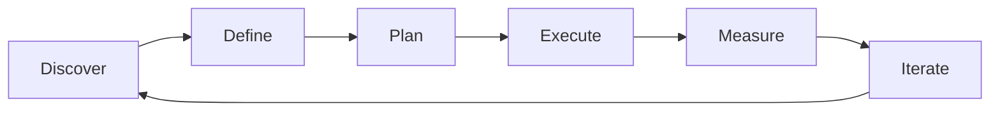

# Risk Management — A 2-Day Crash Course

> **In one sentence:** Risk management is the discipline of identifying what could go wrong,
> assessing how likely and how damaging each risk is, and deciding in advance what you will do
> about it — so that surprises become manageable events instead of crises.

> Cross-references: `Stakeholder-Management.md` (stakeholder misalignment is a risk),
> `Agile-Scrum.md` (where risks surface during sprint ceremonies), `Kanban.md` (flow metrics
> as early risk signals), `Product-Management-Fundamentals.md` (risk-aware prioritisation).

---

## Part 0 — Why risk management exists

Every product initiative carries uncertainty. The API you depend on might change. The key
engineer might leave. The regulatory deadline might move forward. The market might shift
while you are building. These are not hypothetical scenarios — they are the normal reality of
building products. The question is not whether risks will materialise, but which ones, and
whether you are prepared.

Teams without risk management discover problems at the worst possible moment — during launch,
during an audit, during a customer demo. Teams with risk management discover the same problems
weeks earlier, when there is still time and budget to respond. The difference is not luck. It
is the habit of asking "what could go wrong?" before it does.

The one idea that makes risk management click: **a risk is not a problem — it is a potential
problem with a probability attached.** Problems demand immediate action. Risks demand
preparation. The purpose of risk management is to convert as many future problems as possible
into planned responses, so that when the risk materialises, you execute a plan instead of
panicking.

**Mental model:** Risk management is insurance for your project. You do not buy home insurance
because you expect your house to burn down. You buy it because the cost of being uninsured
when it does is catastrophic. A risk register is your insurance policy — you invest a small
amount of time now to avoid a large amount of pain later.

---




## Part 1 — The vocabulary

| Term | Meaning |
|------|---------|
| **Risk** | An uncertain event that, if it occurs, would have a positive or negative effect on the project (in practice, we focus on negative risks — threats) |
| **Probability** | How likely the risk is to occur, typically rated Low / Medium / High or on a 1-5 scale |
| **Impact** | How much damage the risk would cause if it occurs, rated on the same scale |
| **Risk score** | Probability x Impact — used to prioritise which risks need active mitigation |
| **Mitigation** | An action taken in advance to reduce the probability or impact of a risk |
| **Contingency plan** | A pre-planned response to execute if the risk actually materialises — your "plan B" |
| **Risk register** | The living document that lists all identified risks, their scores, owners, mitigations, and status |
| **RAID log** | A combined tracker for Risks, Assumptions, Issues, and Dependencies — a superset of the risk register |
| **Risk owner** | The person accountable for monitoring a specific risk and executing the mitigation or contingency |
| **Residual risk** | The risk that remains after mitigation actions have been applied — you accept it or mitigate further |

The key distinction: **a risk is something that might happen. An issue is something that has
happened.** Risks live in the risk register with mitigations. Issues live in the issue tracker
with action items. When a risk materialises, it moves from "risk" to "issue" and the
contingency plan activates.

---

## DAY 1 — Identify and assess risks

### 1. Risk identification

The hardest part of risk management is seeing risks before they become obvious. Use structured
techniques to find them:

```text
# Risk identification techniques

1. Brainstorm with the team
   "What could prevent us from shipping on time?"
   "What assumptions are we making that might be wrong?"
   "What has gone wrong on similar projects before?"

2. Category prompts (PESTLE for products)
   - Technical: dependencies, performance, scalability, security
   - Resource: staffing, skills gaps, availability, burnout
   - Schedule: deadlines, dependencies on other teams, holidays
   - Scope: changing requirements, stakeholder disagreement
   - External: vendor changes, regulatory shifts, market moves
   - Organisational: reorgs, budget cuts, priority changes

3. Pre-mortem technique
   "Imagine it is 3 months from now and this project failed.
    What went wrong?" Work backward from failure.

4. Historical review
   Check past project retros and postmortems for recurring risks.
```

The pre-mortem is the most powerful technique because it gives the team permission to voice
concerns they might otherwise suppress. "What could go wrong?" invites optimism bias. "What
did go wrong?" (in a hypothetical future) invites honesty.

### 2. The probability x impact matrix

Once risks are identified, assess each one:

```text
# 5x5 Probability x Impact matrix

              Impact -->
              1-Minimal  2-Low  3-Moderate  4-High  5-Critical
Probability
5-Almost certain   5       10      15         20       25
4-Likely           4        8      12         16       20
3-Possible         3        6       9         12       15
2-Unlikely         2        4       6          8       10
1-Rare             1        2       3          4        5

Score = Probability x Impact
  1-4:   Low risk    --> accept and monitor
  5-9:   Medium risk --> mitigate if cost-effective
  10-16: High risk   --> active mitigation required
  17-25: Critical    --> escalate, mitigate immediately
```

Do not overthink the ratings. A risk that is "probably going to happen" and "would delay us
by a month" is clearly high. You do not need decimal precision — you need a shared
understanding of what matters most.

### 3. Building a risk register

The risk register is the central document. Keep it simple:

```text
# Risk register format

| ID | Risk description                          | Prob | Impact | Score | Owner    | Mitigation                              | Contingency                          | Status |
|----|-------------------------------------------|------|--------|-------|----------|-----------------------------------------|--------------------------------------|--------|
| R1 | Key backend dev leaves before launch      | 3    | 4      | 12    | Eng Lead | Cross-train second dev on payment module | Contractor on standby with NDA       | Open   |
| R2 | Third-party KYC API deprecates v2         | 2    | 5      | 10    | PM       | Monitor vendor changelog weekly         | Fall back to manual KYC for 2 weeks  | Open   |
| R3 | Regulatory review takes longer than 2 wks | 4    | 3      | 12    | PM       | Submit for review 4 weeks early         | Descope non-critical features        | Open   |
| R4 | Performance under month-end load          | 3    | 5      | 15    | Eng Lead | Load test at 2x expected volume         | Auto-scale config ready, runbook set | Open   |
```

Review the register weekly. A risk register that is written once and forgotten is worse than
no register — it creates a false sense of security.

### 4. The four risk responses

For every risk, you choose one of four responses:

```text
# Risk response strategies

1. Avoid   — eliminate the risk by changing the plan
   Example: "Use a managed database instead of self-hosting
            to avoid the risk of DBA skills gap."

2. Mitigate — reduce probability or impact
   Example: "Cross-train a second engineer on the payment module
            to reduce impact if the primary engineer leaves."

3. Transfer — shift the risk to someone better equipped
   Example: "Use a third-party fraud detection service instead
            of building in-house (transfers accuracy risk to vendor)."

4. Accept  — acknowledge the risk and prepare a contingency
   Example: "Accept that the vendor API might have downtime.
            Contingency: queue requests and retry with backoff."
```

Most risks are mitigated or accepted. Avoidance is expensive (it means changing the plan).
Transfer is appropriate when another party can manage the risk more effectively.

### 5. By end of Day 1 you can:

- Identify risks using structured techniques including the pre-mortem
- Assess risks on a probability x impact matrix
- Build and maintain a risk register
- Choose the right response strategy for each risk

---

## DAY 2 — Make it real

### 6. The RAID log

A RAID log extends the risk register to capture four related categories:

```text
# RAID log structure

R — Risks:        uncertain events that could affect the project
A — Assumptions:  things we believe to be true but have not verified
I — Issues:       problems that have already occurred and need resolution
D — Dependencies: things we need from others to proceed

| Type | Description                                         | Owner       | Due date   | Status      |
|------|-----------------------------------------------------|-------------|------------|-------------|
| R    | Third-party API rate limit may block batch jobs     | Dev Lead    | Ongoing    | Monitoring  |
| A    | Legal review will take no more than 2 weeks         | PM          | 2026-06-15 | To verify   |
| I    | Staging environment SSL cert expired, blocking QA   | DevOps      | 2026-06-02 | In progress |
| D    | Design team delivers final mockups by sprint start  | Design Lead | 2026-06-08 | On track    |
```

The RAID log is particularly valuable in regulated environments. In BFSI, auditors want to
see that assumptions were documented and validated, that dependencies were tracked, and that
risks were actively managed — not just acknowledged.

### 7. Contingency planning

A contingency plan is your pre-written response for when a risk materialises:

```text
# Contingency plan template

Risk: R4 — Performance under month-end load exceeds SLA

Trigger: response time exceeds 500ms p95 during load test
         OR alerts fire during month-end processing

Actions:
  1. Enable pre-configured auto-scaling (runbook section 4.2)
  2. Activate read-replica for reporting queries
  3. Notify stakeholders: "Performance plan B activated,
     expected recovery within 30 minutes"
  4. If still degraded after 30 min: disable non-critical
     background jobs (batch reports, analytics export)

Owner: Eng Lead
Communication: Slack #incidents + email to VP Engineering
```

The value of a contingency plan is speed. When the risk materialises at 2 AM on salary day,
you do not want someone figuring out what to do from scratch. You want them executing a
rehearsed plan.

### 8. Risk reviews — keeping the register alive

A risk register is only useful if it is current:

```text
# Weekly risk review (15 minutes, part of team sync)

1. Review each open risk:
   - Has the probability or impact changed?
   - Is the mitigation on track?
   - Has the risk materialised (move to Issues)?
   - Can we close it (risk no longer applies)?

2. Add new risks discovered this week

3. Check assumptions:
   - Have any assumptions been proven wrong?
   - Which assumptions still need verification?

4. Review dependencies:
   - Are external teams delivering on time?
   - Any new dependencies identified?
```

### 9. Risk-based prioritisation

Risks should influence what you build and in what order:

```text
# Risk-driven backlog decisions

High-risk item with high value --> build first (reduce uncertainty early)
High-risk item with low value  --> consider descoping entirely
Low-risk item with high value  --> schedule normally
Low-risk item with low value   --> deprioritise or cut

Example: The payment integration is both the highest-value and
highest-risk item. Build it first — not last. If it fails, you
want to know in sprint 2, not sprint 8.
```

This is the opposite of the natural instinct to "save the hard stuff for later." Tackle high
risk early when you still have time and budget to pivot.

### 10. Risk communication

Different audiences need different levels of risk detail:

```text
# Risk communication by audience

Executive / steering committee:
  "We have 2 red risks that could delay launch by 2 weeks.
   Mitigations are in place. I need a decision on [X]."
  --> Top 3 risks, scores, status, decisions needed

Team:
  "Here is the updated risk register. R4 has moved from
   amber to red — we need to prioritise the load test this sprint."
  --> Full register, detailed mitigations, weekly review

Stakeholders:
  "The regulatory review risk is being managed — we submitted
   4 weeks early. Current status: on track."
  --> Relevant risks only, plain language, outcome-focused
```

Never hide risks from stakeholders. A risk that surprises an executive is a career-limiting
event. A risk that was communicated early with a mitigation plan is a sign of competence.

### 11. Risk patterns in product development

Certain risks recur across most product work. Know them:

```text
# Recurring product risks (have mitigations ready)

Integration risk    — third-party API changes, vendor instability
  Mitigation: abstraction layer, contract tests, vendor monitoring

Scope creep         — requirements expand beyond original agreement
  Mitigation: written scope in PRD, change request process

Key-person risk     — critical knowledge in one person's head
  Mitigation: pair programming, documentation, cross-training

Estimation risk     — work takes longer than estimated
  Mitigation: spike unknown work first, use ranges not points

Adoption risk       — users do not use the feature after launch
  Mitigation: validate with users before building (discovery)

Compliance risk     — regulatory requirements misunderstood or missed
  Mitigation: involve legal/compliance early, not at launch
```

---

## Worked example — risk management for a payment system migration

```text
1. Context: Team is migrating from legacy payment gateway to a new
   provider. Target: complete in 8 weeks. Regulatory deadline: end of Q3.

2. Pre-mortem conducted. Team identifies 6 risks:

   R1: New gateway API has undocumented rate limits
       (Prob:3, Impact:4, Score:12)
       Mitigation: run load test against sandbox in week 1
       Contingency: implement request queuing with backoff

   R2: Legacy system has undocumented edge cases
       (Prob:4, Impact:3, Score:12)
       Mitigation: audit legacy transaction logs before migration
       Contingency: run both systems in parallel for 2 weeks

   R3: Key engineer on leave for 2 weeks during migration
       (Prob:5, Impact:3, Score:15)
       Mitigation: cross-train second engineer starting week 1
       Contingency: delay non-critical tasks to post-leave period

   R4: Compliance review rejects new flow
       (Prob:2, Impact:5, Score:10)
       Mitigation: submit for review in week 2, not week 6
       Contingency: pre-approved fallback flow meeting minimums

   R5: Data reconciliation discrepancies
       (Prob:3, Impact:4, Score:12)
       Mitigation: automated reconciliation comparing both systems
       Contingency: manual reconciliation process with finance

   R6: Customer confusion during switchover
       (Prob:3, Impact:2, Score:6)
       Mitigation: in-app notification + support briefing
       Contingency: support FAQ and escalation path ready

3. Week 2: R1 materialises — rate limit hit during load test.
   Contingency activated: queuing implemented in 2 days.
   Risk moved to "Issues — resolved." Residual risk added:
   "Queue depth may grow during peaks" (Score:6, accepted).

4. Week 5: R4 mitigation succeeds — compliance approved with
   minor changes. Risk closed. PM updates steering committee:
   "4 of 6 risks resolved or closed. 2 remain at medium."

5. Week 8: migration completes. Both systems run in parallel for
   2 weeks (R2 contingency). Zero discrepancies after day 3.
   Legacy system decommissioned. Register archived in retro doc.
```

---


## Terminal Demo

```terminal-demo
# risk@assessment ~ %

$ echo "Risk Register"
| ID | Risk                    | Probability | Impact | Score | Mitigation      |
|----|------------------------|-------------|--------|-------|-----------------|
| R1 | Key developer leaves   | Medium      | High   | 12    | Cross-training  |
| R2 | API compatibility break | Low         | High   | 8     | Contract tests  |
| R3 | Scope creep            | High        | Medium | 12    | Change board    |
| R4 | Vendor API changes     | Medium      | Medium | 9     | Abstraction layer|

$ echo "Risk Burndown"
Q1: 8 risks identified, 5 mitigated
Q2: 4 new risks, 3 mitigated
Active risks: 4
Accepted risks: 2
```

---

## Common pitfalls

- **Writing a risk register once and never updating it.** A static register is a false safety
  net. Review weekly, update scores, close resolved risks, add new ones.
- **Confusing risks with issues.** "The server is down" is an issue — fix it now. "The server
  might go down under month-end load" is a risk — prepare for it. Keep them in separate
  categories.
- **Rating everything as high risk.** If every risk is red, nothing stands out. Be honest
  about probabilities. A risk that is genuinely unlikely should be rated as such, even if the
  impact would be severe.
- **Mitigating risks but not assigning owners.** A mitigation without an owner is a wish. Every
  risk and every mitigation needs a named person accountable for it.
- **Hiding risks from stakeholders.** Concealing a risk does not reduce it — it removes the
  chance for help. Communicate risks early with a mitigation plan attached.
- **Ignoring low-probability, high-impact risks.** Rare events with catastrophic consequences
  (data breach, complete vendor failure) need contingency plans even if the probability is low.
  This is especially critical in BFSI where regulatory penalties can be severe.
- **Treating risk management as overhead.** Risk management is not a separate activity bolted
  onto the project. It is part of planning, part of prioritisation, and part of every sprint
  review. Fifteen minutes per week prevents weeks of firefighting.

---

## Quick reference

```text
# Probability x Impact scoring
Score = Probability (1-5) x Impact (1-5)
1-4: Low (accept)  |  5-9: Medium (mitigate if cheap)
10-16: High (active mitigation)  |  17-25: Critical (escalate)

# Four risk responses
Avoid    — change the plan to eliminate the risk
Mitigate — reduce probability or impact
Transfer — shift risk to a third party
Accept   — acknowledge and prepare contingency

# Risk register columns
ID | Description | Prob | Impact | Score | Owner | Mitigation | Contingency | Status

# RAID log categories
R — Risks (might happen)
A — Assumptions (believed true, not verified)
I — Issues (already happened)
D — Dependencies (need from others)

# Risk review cadence
Weekly, 15 minutes: review scores, update mitigations, add/close risks

# Pre-mortem prompt
"Imagine the project failed. What went wrong?"

# Risk communication by audience
Executives: top 3, scores, decisions needed
Team: full register, detailed actions
Stakeholders: relevant risks, plain language

# Risk-driven prioritisation
High risk + high value --> build first
High risk + low value  --> consider descoping
```

---


## Top 10 Interview Questions

<details>
<summary><strong>Q: What is Risk Management and what problem does it solve?</strong></summary>

Risk Management addresses a specific need in modern engineering workflows. Understanding the core problem it solves — and the alternatives it replaced — is the foundation for every subsequent interview question. Frame your answer around the pain point first, then the solution.

</details>

<details>
<summary><strong>Q: How does Risk Management compare to its main alternatives?</strong></summary>

Every tool exists in an ecosystem of alternatives. Be prepared to articulate the specific tradeoffs: when Risk Management is the right choice, when an alternative is better, and what factors drive the decision (scale, team expertise, existing infrastructure, compliance requirements).

</details>

<details>
<summary><strong>Q: What are the most common production pitfalls with Risk Management?</strong></summary>

Production experience is what separates senior from junior engineers. Common pitfalls include: misconfiguration that works in dev but fails at scale, security oversights, inadequate monitoring, and operational procedures that are untested until an incident occurs. Cite specific examples from your experience.

</details>

<details>
<summary><strong>Q: How do you monitor and observe Risk Management in production?</strong></summary>

Key metrics to track, alerting thresholds to set, dashboards to build, and log patterns to watch. Production monitoring should cover: health/liveness, performance (latency, throughput), capacity (resource utilisation), and business impact (error rates affecting users). Explain which metrics are leading indicators versus lagging.

</details>

<details>
<summary><strong>Q: How do you scale Risk Management as load increases?</strong></summary>

Scaling strategies depend on the bottleneck: horizontal scaling (add more instances), vertical scaling (bigger instances), caching (reduce load), sharding (distribute data), and async processing (decouple components). Explain which approach applies to Risk Management and at what scale each strategy becomes necessary.

</details>

<details>
<summary><strong>Q: How do you handle security and access control with Risk Management?</strong></summary>

Security is non-negotiable in production. Cover: authentication and authorization mechanisms, secrets management (never in code), encryption (at rest and in transit), network security (firewalls, private networks), audit logging, and compliance requirements relevant to your industry.

</details>

<details>
<summary><strong>Q: How do you implement disaster recovery for Risk Management?</strong></summary>

DR planning requires defining RTO (recovery time objective) and RPO (recovery point objective), implementing backup strategies, testing restore procedures, and documenting runbooks. Explain your backup strategy, how you test restores, and what your recovery procedure looks like.

</details>

<details>
<summary><strong>Q: How do you automate Risk Management deployment and configuration management?</strong></summary>

Infrastructure as code, CI/CD pipelines, configuration management, and GitOps workflows. Explain how you version, test, deploy, and roll back changes. Cover: what is automated, what requires manual approval, and how you handle configuration drift.

</details>

<details>
<summary><strong>Q: How do you troubleshoot issues with Risk Management in production?</strong></summary>

A systematic debugging approach: check health endpoints, review recent changes (deploys, config changes), examine logs and metrics, reproduce the issue, identify root cause, fix, verify, and write a postmortem. Explain your actual debugging workflow with concrete examples.

</details>

<details>
<summary><strong>Q: What are the best practices for Risk Management that you have learned from experience?</strong></summary>

Best practices that go beyond documentation: lessons learned from production incidents, configuration patterns that prevent common issues, testing strategies that catch bugs before production, and operational procedures that reduce toil. Share specific examples where following (or not following) a best practice had measurable impact.

</details>

---


## Quick Quiz

Test your understanding with these rapid-fire questions (answers hidden):

<details>
<summary>1. What is the ONE core problem that Risk Management solves?</summary>
Re-read Part 0 — the mental model section. If you can explain the "why" in one sentence, you understand the foundation.
</details>

<details>
<summary>2. Name the 3 most important terms from the vocabulary section.</summary>
Review Part 1. These are the building blocks every conversation about Risk Management uses.
</details>

<details>
<summary>3. What is the first thing you would set up on Day 1?</summary>
Check the Day 1 section — the very first hands-on step that gets you a working result.
</details>

<details>
<summary>4. What is the most common production pitfall with Risk Management?</summary>
Review the Common Pitfalls section. The first item listed is typically the most frequently encountered.
</details>

<details>
<summary>5. How does Risk Management compare to its closest alternative?</summary>
Check the Comparison Matrix below — focus on the key differentiating row.
</details>


## Comparison Matrix

| Dimension | Quantitative Risk | Qualitative Risk | Risk Matrix |
|-----------|-------------------|------------------|-------------|
| **Primary use case** | Core strength of Quantitative Risk | Core strength of Qualitative Risk | Core strength of Risk Matrix |
| **Learning curve** | Moderate | Varies | Varies |
| **Community/ecosystem** | Active | Active | Growing |
| **Operational complexity** | Medium | Varies | Varies |
| **Best for** | See Part 0 | Different tradeoffs | Different tradeoffs |

> **How to read this matrix:** no tool wins on every dimension. Pick based on your specific constraints — team expertise, existing infrastructure, scale requirements, and compliance needs. The right choice is the one that fits your context, not the one with the most checkmarks.

## Next steps after Day 2

- `Stakeholder-Management.md` — communicating risks to different audiences effectively
- `Agile-Scrum.md` — how risks surface and are managed within sprint ceremonies
- `Kanban.md` — using flow metrics as early warning signals for delivery risk
- `Product-Management-Fundamentals.md` — integrating risk into prioritisation decisions

---

## Recommended learning resources

**YouTube channels & playlists:**
- [LeadDev](https://www.youtube.com/@LeadDev) — engineering leadership talks on managing delivery risk, incident preparedness, and technical decision-making
- [Dave Farley — Continuous Delivery](https://www.youtube.com/@ContinuousDelivery) — how continuous delivery practices reduce deployment and integration risk
- [Atlassian Agile Coach](https://www.youtube.com/@Atlassian) — practical risk management within agile frameworks, RAID log templates
- [Mountain Goat Software — Mike Cohn](https://www.youtube.com/@MountainGoatSoftware) — estimation risk, sprint planning under uncertainty, and forecasting techniques

**Official docs & blogs:**
- [Atlassian — Risk Management Guide](https://www.atlassian.com/agile/project-management/risk-management) — practical guide to risk identification and tracking in agile teams
- [Scrum.org — Risk Management on Agile Projects](https://www.scrum.org/resources) — how Scrum ceremonies naturally surface and manage risk
- [Mountain Goat Software Blog](https://www.mountaingoatsoftware.com/blog) — articles on estimation risk, velocity-based forecasting, and managing uncertainty

## Recommended learning resources

**YouTube channels & playlists:**
- [Project Management Institute](https://www.youtube.com/@pabormi) — risk identification, qualitative and quantitative analysis, and risk response strategies
- [Ricardo Vargas](https://www.youtube.com/@rvaborgas) — practical risk management, Monte Carlo simulation, and schedule risk analysis for project managers

**Books & articles:**
- [Waltzing with Bears — DeMarco & Lister](https://www.goodreads.com/book/show/665153.Waltzing_with_Bears) — managing risk in software projects; the classic text on why ignoring risk kills projects
- [The Failure of Risk Management — Douglas Hubbard](https://www.goodreads.com/book/show/6516525-the-failure-of-risk-management) — quantitative risk analysis and why risk matrices are broken

**The mantra:** Identify what could go wrong before it does, score it honestly, assign an owner, prepare a contingency, and review weekly — because the risk you manage is the crisis you prevent.
