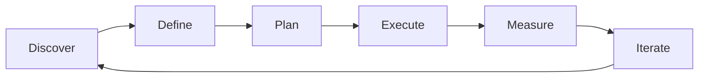

# Sprint Planning & Estimation — A 2-Day Crash Course

> **In one sentence:** Sprint planning and estimation are the practices of deciding how much work
> a team can take on in a fixed timebox and sizing that work so decisions are based on evidence,
> not wishful thinking.

> Cross-references: `Agile-Scrum.md` (the execution framework), `Product-Management-Fundamentals.md`
> (the PM role in planning), `Delivery-Execution.md` (what happens after the sprint starts),
> `JIRA-Project-Tools.md` (where you track it all).

---

## Part 0 — Why sprint planning and estimation exist

Without estimation, every conversation about scope turns into a negotiation based on gut feel.
Engineering says "that's hard." Product says "we need it by Friday." Neither side has a shared
language for complexity, and the result is either over-commitment (burnout, missed deadlines) or
under-commitment (slow delivery, frustrated stakeholders).

Sprint planning and estimation exist to replace gut feel with a calibrated, team-owned process.
They give you three things: a shared understanding of what "done" means for each item, a
realistic picture of how much the team can absorb in a timebox, and a feedback loop (velocity)
that gets more accurate over time.

The one idea that unlocks estimation: **you are not predicting the future — you are creating a
shared language for relative complexity.** An estimate is not a promise. It is a conversation
tool that surfaces misunderstandings, hidden complexity, and missing requirements before you
start coding.

**Mental model:** Estimation is like packing a suitcase. You do not weigh each shirt to the
gram — you compare items ("this jacket takes up about three T-shirts' worth of space") and you
know your suitcase fits roughly 20 T-shirt-equivalents. Story points are T-shirt-equivalents.
Velocity is the suitcase size. Sprint planning is the packing session.

---




## Part 1 — The vocabulary

| Term | Meaning |
|------|---------|
| **Story point** | A relative measure of effort, complexity, and uncertainty — not hours. A 5-point story is roughly 2.5x a 2-point story for *this team* |
| **Velocity** | The number of story points a team completes per sprint, averaged over several sprints. Your empirical capacity |
| **Sprint goal** | A single, coherent objective that gives the sprint a purpose beyond "finish these tickets" |
| **Capacity** | The team's actual availability in a sprint, accounting for holidays, on-call, meetings, and other commitments |
| **Planning poker** | A simultaneous-reveal estimation technique where each team member independently picks a size, then the team discusses divergences |
| **Commitment vs forecast** | Commitment = "we promise to finish this." Forecast = "based on history, we expect to finish roughly this much." Modern Scrum uses forecast |
| **Fibonacci sequence** | The scale most teams use for points: 1, 2, 3, 5, 8, 13, 21. The gaps widen because precision decreases with size |
| **Spike** | A timeboxed investigation story used when the team cannot estimate because they lack information |
| **Definition of Ready** | Criteria a story must meet before the team will pull it into a sprint — clear acceptance criteria, design decided, dependencies identified |

The key distinction: **story points measure complexity, not time.** Two developers might take
different amounts of clock time on the same story, but the complexity (and therefore the points)
is the same. This is why you do not convert points to hours.

---

## DAY 1 — Learn to estimate

### 1. Why relative sizing beats absolute time

Humans are bad at estimating absolute duration but good at comparing things. "Will this take 14
hours or 18 hours?" is a coin flip. "Is this bigger or smaller than that login story we did last
sprint?" is something the whole team can answer consistently.

Relative sizing also protects against individual variation. A senior developer and a junior
developer will disagree on hours but agree on relative complexity. Points capture the work, not
the worker.

### 2. The Fibonacci scale

Most teams use a modified Fibonacci sequence: 1, 2, 3, 5, 8, 13, 21.

```text
1   — trivial change, well-understood, no unknowns
2   — small, straightforward, one component
3   — moderate, clear approach, might touch 2-3 files
5   — significant, some complexity or minor unknowns
8   — large, multiple components, some investigation needed
13  — very large, significant unknowns, consider splitting
21  — too large to commit to in a sprint — split it
```

The gaps widen deliberately. You cannot meaningfully distinguish a 14 from a 15, so the scale
does not pretend you can. If the team argues between 8 and 13, the uncertainty itself is
information — discuss what is causing the disagreement.

### 3. Running planning poker

Planning poker is a simultaneous-reveal technique that prevents anchoring (the loudest person
setting the estimate for everyone):

```text
1. Product owner presents the story and acceptance criteria.
2. Team asks clarifying questions until the scope is understood.
3. Each team member privately selects a point value.
4. Everyone reveals simultaneously (cards, app, or fingers).
5. If estimates align (e.g., all 5s and 3s) — take the consensus.
6. If estimates diverge (e.g., a 2 and a 13) — the outliers explain.
   The person who said 2 might know a shortcut.
   The person who said 13 might see a hidden dependency.
7. Re-vote after discussion. Converge within one round or two.
```

The value is not the number — it is the conversation that surfaces hidden assumptions.

### 4. Calibrating with a reference story

Before your first planning poker session, pick a completed story the whole team remembers.
Assign it a baseline size (typically 3 or 5). Every future estimate is relative to this anchor.

"Is the new story bigger or smaller than the password-reset story we called a 5?"

Re-calibrate every few months as the team's skill and codebase evolve.

### 5. T-shirt sizing for roadmap-level estimation

For early-stage items where detailed estimation is premature, use T-shirt sizes:

| Size | Rough meaning |
|------|--------------|
| **S** | A few days of work for one person |
| **M** | About a sprint for one person |
| **L** | A full sprint for 2-3 people |
| **XL** | Multiple sprints — needs decomposition before committing |

T-shirt sizes are useful for roadmap conversations with stakeholders. They communicate "roughly
how big" without the false precision of points.

### 6. By end of Day 1 you can:

- Run a planning poker session with your team
- Explain why points measure complexity, not hours
- Set a reference story and calibrate the team's scale
- Use T-shirt sizing for roadmap-level conversations

---

## DAY 2 — Make it real

### 7. Sprint planning: the ceremony

Sprint planning has two parts:

**Part 1 — What** (30-60 min): The product owner presents the sprint goal and the candidate
stories. The team discusses scope, asks questions, and confirms the Definition of Ready is met.

**Part 2 — How** (30-60 min): The team breaks stories into tasks, identifies technical approach,
and pulls items into the sprint until capacity is reached.

```text
Sprint capacity calculation:
  Team members:           5
  Sprint length:          2 weeks (10 working days)
  Holidays/PTO:          -3 person-days
  On-call rotation:      -2 person-days
  Meetings/overhead:     -20% of remaining
  Available person-days: (50 - 3 - 2) x 0.8 = 36 person-days
  Historical velocity:   40 points (when fully staffed at 50 person-days)
  Adjusted forecast:     40 x (36/40) = 36 points
```

### 8. Sprint goals that actually work

A good sprint goal is not "finish all 12 stories." It is a coherent outcome:

```text
Bad:  "Complete JIRA-101 through JIRA-112"
Good: "Users can complete onboarding without contacting support"
Good: "Payment processing handles month-end volume spikes"
```

The sprint goal gives the team permission to negotiate scope. If a story turns out to be bigger
than expected, the team can drop a lower-priority item while still achieving the goal.

### 9. Velocity tracking and forecasting

Track velocity over at least 5-6 sprints before treating it as reliable:

```text
Sprint 1:  34 points
Sprint 2:  42 points
Sprint 3:  38 points
Sprint 4:  28 points  (holiday sprint, 2 people out)
Sprint 5:  40 points
Sprint 6:  36 points

Average velocity: 36 points/sprint
Range: 28-42 points/sprint
```

Use the range, not just the average. "We will finish 36 points" is false precision. "We will
finish between 28 and 42 points, most likely around 36" is honest forecasting.

For release planning, use velocity to project:

```text
Remaining backlog: 180 points
Velocity range: 28-42 points/sprint
Best case:  180 / 42 = 4.3 sprints (about 9 weeks)
Worst case: 180 / 28 = 6.4 sprints (about 13 weeks)
Likely:     180 / 36 = 5.0 sprints (about 10 weeks)
```

### 10. When not to estimate

Estimation has a cost. Skip it when the cost exceeds the value:

- **Maintenance/bug-fix teams** — if everything is small, just count items instead of pointing
  them. Throughput (stories per sprint) works as well as velocity for teams with uniform story
  sizes.
- **Spikes and research** — timebox them (e.g., "2 days") instead of pointing them. The output
  is knowledge, not a deployable increment.
- **Kanban teams** — use cycle time and throughput instead of story points. Measure how long
  items take to flow through, not how big they are up front.

### 11. Handling estimation antipatterns

| Antipattern | Why it hurts | What to do instead |
|------------|-------------|-------------------|
| **Converting points to hours** | Destroys the relative-sizing benefit; managers start treating points as time | Refuse the conversion. If asked "how many hours is a 5?", answer "it depends on who works on it" |
| **Inflating estimates as padding** | Erodes trust; velocity becomes meaningless | Build uncertainty into the range, not the estimate. Use spikes for unknowns |
| **Estimating individually** | One person's estimate does not capture team knowledge | Always estimate as a team — divergence is the signal |
| **Carrying over incomplete work** | Masks poor splitting; inflates next sprint's velocity | Re-estimate the remaining work. Do not count partial credit |
| **Changing estimates after the sprint starts** | Breaks the feedback loop | Keep the original estimate. Learn from the variance in retrospective |
| **Using velocity as a performance metric** | Teams game the numbers; points inflate | Velocity is a planning tool, not a productivity measure |

---

## Worked example — planning a payment-gateway migration sprint

```text
Context: A BFSI platform team needs to migrate from Payment Gateway A to Gateway B.
The backlog has been groomed. Sprint length: 2 weeks. Team: 5 engineers.

1. Sprint goal: "All sandbox transactions route through Gateway B with parity
   test coverage."

2. Capacity check:
   - 1 engineer on-call for 3 days this sprint
   - No holidays
   - Available: (50 - 3) x 0.8 = 37.6 person-days
   - Recent velocity: 34, 38, 40 — average 37 points

3. Planning poker (selected stories):
   Story: "Implement Gateway B client adapter"
     Votes: 5, 5, 8, 5, 5
     Discussion: the 8-voter flagged retry logic complexity
     After discussion: team agrees on 5 (retry logic is standard)
     Final: 5 points

   Story: "Migrate /charge endpoint to Gateway B"
     Votes: 8, 8, 13, 8, 8
     Discussion: the 13-voter worried about idempotency keys
     After discussion: team agrees on 8 (idempotency approach is known)
     Final: 8 points

   Story: "Add dual-write transaction logging"
     Votes: 3, 5, 3, 3, 5
     Discussion: minor disagreement on test coverage scope
     Final: 5 points

4. Sprint backlog loaded to 35 points (within the 34-40 range).
   Two stretch items (6 points combined) identified but not committed.

5. End of sprint: 33 points completed. One 5-point story split mid-sprint
   when hidden complexity emerged — 3 points delivered, 2 carried as new story.
   Velocity recorded: 33.
   Retro action: improve acceptance criteria for integration stories.
```

---

## Common pitfalls

- **Treating story points as hours in disguise.** The moment a manager says "a point equals a
  day," the entire system breaks. Points measure relative complexity, not calendar time.
- **Skipping the discussion in planning poker.** The number is not the point — the conversation
  is. If everyone agrees instantly, you might be groupthinking rather than analysing.
- **Planning to 100% capacity.** Teams are not machines. Account for meetings, context-switching,
  code reviews, and the unexpected. Plan to 70-80% of theoretical capacity.
- **Using velocity to compare teams.** Team A's 40 points and Team B's 25 points say nothing
  about relative productivity. Each team's scale is internal.
- **Never revisiting the reference story.** As codebases and teams change, the original "this is
  a 5" drifts. Re-calibrate quarterly.
- **Splitting stories by technical layer.** "Backend for feature X" and "Frontend for feature X"
  are not independently valuable. Split by user-facing slice instead.
- **Ignoring the sprint goal.** Without a goal, the sprint is just a list. With a goal, the team
  can make trade-offs when reality diverges from the plan.

---

## Quick reference

```text
# Fibonacci scale
1 — trivial | 2 — small | 3 — moderate | 5 — significant
8 — large | 13 — very large (consider splitting) | 21 — must split

# Planning poker flow
Present story → Q&A → private vote → reveal → discuss outliers → re-vote → record

# Sprint capacity formula
Available person-days = (team-size x sprint-days - PTO - on-call) x 0.8
Forecast points = historical velocity x (available / normal-available)

# Velocity forecasting for releases
Best case:  backlog / max-velocity
Worst case: backlog / min-velocity
Likely:     backlog / avg-velocity

# Sprint planning agenda
Part 1 (What):  Review goal → present candidates → clarify scope → confirm readiness
Part 2 (How):   Estimate → break into tasks → load sprint to capacity → commit

# Estimation decision tree
Known, small, uniform items?     → skip points, count throughput
Research/investigation?          → timebox as spike, don't point
Kanban flow?                     → use cycle time, not points
Scrum with variable story sizes? → use story points + planning poker

# Antipattern checklist
⚠️ Points converted to hours       → refuse the conversion
⚠️ Velocity used as KPI            → it is a planning tool only
⚠️ Estimates changed mid-sprint    → keep originals, learn in retro
⚠️ 100% capacity planned           → plan to 70-80%
⚠️ Stories split by tech layer     → split by user-facing slice
```

---


## Top 10 Interview Questions

<details>
<summary><strong>Q: What is Sprint Planning Estimation and what problem does it solve?</strong></summary>

Sprint Planning Estimation addresses a specific need in modern engineering workflows. Understanding the core problem it solves — and the alternatives it replaced — is the foundation for every subsequent interview question. Frame your answer around the pain point first, then the solution.

</details>

<details>
<summary><strong>Q: How does Sprint Planning Estimation compare to its main alternatives?</strong></summary>

Every tool exists in an ecosystem of alternatives. Be prepared to articulate the specific tradeoffs: when Sprint Planning Estimation is the right choice, when an alternative is better, and what factors drive the decision (scale, team expertise, existing infrastructure, compliance requirements).

</details>

<details>
<summary><strong>Q: What are the most common production pitfalls with Sprint Planning Estimation?</strong></summary>

Production experience is what separates senior from junior engineers. Common pitfalls include: misconfiguration that works in dev but fails at scale, security oversights, inadequate monitoring, and operational procedures that are untested until an incident occurs. Cite specific examples from your experience.

</details>

<details>
<summary><strong>Q: How do you monitor and observe Sprint Planning Estimation in production?</strong></summary>

Key metrics to track, alerting thresholds to set, dashboards to build, and log patterns to watch. Production monitoring should cover: health/liveness, performance (latency, throughput), capacity (resource utilisation), and business impact (error rates affecting users). Explain which metrics are leading indicators versus lagging.

</details>

<details>
<summary><strong>Q: How do you scale Sprint Planning Estimation as load increases?</strong></summary>

Scaling strategies depend on the bottleneck: horizontal scaling (add more instances), vertical scaling (bigger instances), caching (reduce load), sharding (distribute data), and async processing (decouple components). Explain which approach applies to Sprint Planning Estimation and at what scale each strategy becomes necessary.

</details>

<details>
<summary><strong>Q: How do you handle security and access control with Sprint Planning Estimation?</strong></summary>

Security is non-negotiable in production. Cover: authentication and authorization mechanisms, secrets management (never in code), encryption (at rest and in transit), network security (firewalls, private networks), audit logging, and compliance requirements relevant to your industry.

</details>

<details>
<summary><strong>Q: How do you implement disaster recovery for Sprint Planning Estimation?</strong></summary>

DR planning requires defining RTO (recovery time objective) and RPO (recovery point objective), implementing backup strategies, testing restore procedures, and documenting runbooks. Explain your backup strategy, how you test restores, and what your recovery procedure looks like.

</details>

<details>
<summary><strong>Q: How do you automate Sprint Planning Estimation deployment and configuration management?</strong></summary>

Infrastructure as code, CI/CD pipelines, configuration management, and GitOps workflows. Explain how you version, test, deploy, and roll back changes. Cover: what is automated, what requires manual approval, and how you handle configuration drift.

</details>

<details>
<summary><strong>Q: How do you troubleshoot issues with Sprint Planning Estimation in production?</strong></summary>

A systematic debugging approach: check health endpoints, review recent changes (deploys, config changes), examine logs and metrics, reproduce the issue, identify root cause, fix, verify, and write a postmortem. Explain your actual debugging workflow with concrete examples.

</details>

<details>
<summary><strong>Q: What are the best practices for Sprint Planning Estimation that you have learned from experience?</strong></summary>

Best practices that go beyond documentation: lessons learned from production incidents, configuration patterns that prevent common issues, testing strategies that catch bugs before production, and operational procedures that reduce toil. Share specific examples where following (or not following) a best practice had measurable impact.

</details>

---

## Next steps after Day 2

- `Agile-Scrum.md` — the full Scrum framework that sprint planning lives within
- `Delivery-Execution.md` — release planning, feature flags, and go/no-go decisions
- `JIRA-Project-Tools.md` — configuring boards, JQL queries, and velocity charts
- `Product-Management-Fundamentals.md` — the PM's role in backlog prioritisation

---

## Recommended learning resources

**YouTube channels & playlists:**
- [Mountain Goat Software](https://www.youtube.com/@MountainGoatSoftware) — Mike Cohn on story points, planning poker, and agile estimation techniques
- [Atlassian](https://www.youtube.com/@Atlassian) — sprint planning walkthroughs and agile ceremony guides
- [Dave Farley — Continuous Delivery](https://www.youtube.com/@ContinuousDelivery) — estimation, forecasting, and why "no estimates" has a point
- [LeadDev](https://www.youtube.com/@LeadDev) — engineering leadership perspectives on planning and delivery

**Official docs & references:**
- [Scrum Guide (scrum.org)](https://scrumguides.org/) — the canonical definition of sprint planning and the sprint goal
- [Mountain Goat Software — Estimation](https://www.mountaingoatsoftware.com/agile/planning-poker) — Mike Cohn's planning poker guide and reference stories
- [Atlassian Agile Coach — Estimation](https://www.atlassian.com/agile/project-management/estimation) — practical guide to story points and velocity

**The mantra:** Estimate to have the conversation, not to predict the future — then use velocity as a mirror, not a whip.
