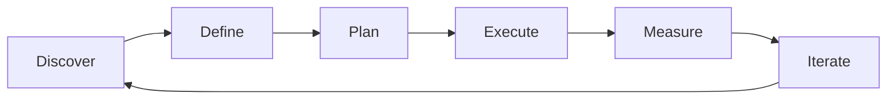

# Stakeholder Management — A 2-Day Crash Course

> **In one sentence:** Stakeholder management is the practice of identifying the people who
> influence or are affected by your product decisions, then keeping them informed, aligned, and
> constructively engaged — so that decisions stick and politics do not derail delivery.

> Cross-references: `Product-Management-Fundamentals.md` (the PM role that does this daily),
> `User-Stories-Requirements.md` (where stakeholder needs become concrete requirements),
> `Agile-Scrum.md` (the ceremonies where stakeholder input is structured),
> `Risk-Management.md` (stakeholder misalignment is itself a risk).

---

## Part 0 — Why stakeholder management exists

Every product decision affects people beyond the immediate team. An executive who learns about
a scope change from a customer instead of from you will make your next quarter difficult. A
sales lead whose top feature request disappears from the roadmap without explanation will
escalate over your head. A compliance officer who was not consulted until the week before
launch will block the release.

These are not personality problems. They are communication failures. Stakeholder management
exists to prevent them. It is the discipline of knowing who cares about your product, what
they care about, how much influence they have, and what information they need — then providing
that information proactively, before they have to ask.

The one idea that makes stakeholder management click: **alignment is not agreement.** You do
not need every stakeholder to agree with your decisions. You need them to understand *why*
you made them, feel they were heard, and know what is coming next. People accept decisions
they disagree with if the process felt fair. People fight decisions they agree with if they
were blindsided.

**Mental model:** Stakeholder management is air traffic control. You have multiple aircraft
(stakeholders) approaching the same runway (your team's capacity) at different speeds and
altitudes. Your job is not to fly the planes — it is to sequence them safely, communicate
clearly, and make sure nobody collides. If you stop communicating, planes stack up and
eventually something crashes.

---




## Part 1 — The vocabulary

| Term | Meaning |
|------|---------|
| **Stakeholder** | Anyone who has a vested interest in your product — executives, engineering leads, sales, support, legal, customers, partners |
| **RACI** | A matrix that clarifies who is Responsible, Accountable, Consulted, and Informed for each decision |
| **Influence without authority** | The ability to shape decisions and behaviour when you have no direct power over the people involved — the core PM skill |
| **Managing up** | Communicating effectively with people above you in the org — executives and senior leadership |
| **Managing across** | Aligning with peers in other functions — sales, marketing, design, other PMs — who have their own goals |
| **Managing down** | Providing context and clarity to the delivery team so they understand the "why" behind prioritisation |
| **Alignment meeting** | A structured check-in where stakeholders review priorities, raise concerns, and confirm shared understanding |
| **Escalation** | When a disagreement cannot be resolved at the current level and is moved to a higher authority for a decision |
| **Executive summary** | A concise format (3-5 sentences or bullets) that gives a senior leader everything they need to know without reading detail |
| **Sponsor** | A senior stakeholder who actively advocates for your product or initiative within the organisation |

---

## DAY 1 — Map your stakeholders

### 1. Identify your stakeholders

Start by listing every person and group who has a stake in your product. Cast wide:

```text
# Stakeholder identification checklist
Internal:
  - Executive sponsor (VP/C-level who owns the budget)
  - Engineering lead (owns technical decisions and capacity)
  - Design lead (owns user experience)
  - Sales / account management (hears customer pain daily)
  - Customer support (sees what breaks)
  - Marketing (needs to position and launch)
  - Legal / compliance (approves what ships, especially in BFSI)
  - Finance (cares about cost and revenue impact)
  - Other PMs (whose products depend on or compete with yours)

External:
  - Key customers / customer advisory board
  - Partners and integrators
  - Regulators (in banking, healthcare, finance)
```

### 2. The power-interest grid

Not all stakeholders need the same level of attention. Map them on two axes:

```text
                    High Interest
                         |
         MANAGE CLOSELY  |  KEEP SATISFIED
         (collaborate)   |  (consult regularly)
                         |
  Low Power -------------|-------------- High Power
                         |
         MONITOR         |  KEEP INFORMED
         (minimal effort)|  (regular updates)
                         |
                    Low Interest
```

- **High power, high interest** — your executive sponsor, engineering lead. These people can
  block or accelerate you. Meet them regularly. Share decisions before they are final.
- **High power, low interest** — C-suite who approve budget but do not care about details.
  Give them concise updates. Do not waste their time; do not surprise them.
- **Low power, high interest** — support team, individual customers. They care deeply but
  cannot block you. Keep them informed so they feel heard.
- **Low power, low interest** — monitor. Do not over-invest.

### 3. Building a RACI matrix

For any significant decision, clarify roles explicitly:

```text
Decision: Launch new fraud-alert notification system

                    PM    Eng Lead   Compliance   VP Product   Support
Design approach     R     C          C            I            I
Technical arch      C     R          I            I            I
Go/no-go decision   R     C          C            A            I
Launch comms        C     I          I            A            R

R = Responsible (does the work)
A = Accountable (final decision-maker — only ONE per row)
C = Consulted (input before decision)
I = Informed (told after decision)
```

The most important rule: **only one A per row.** If two people think they are accountable for
the same decision, you have a conflict waiting to happen.

### 4. Saying no with data

This is the single most valuable stakeholder skill. When a stakeholder requests a feature:

```text
Step 1: Acknowledge the need
  "I understand — your clients need bulk export. That is a real pain point."

Step 2: Show the trade-off
  "Here is what is currently ahead of it in priority, and why."
  [Show the RICE scores, the roadmap, the data]

Step 3: Offer an alternative or timeline
  "We can address this in Q3, or I can explore a lightweight workaround
   that might solve 80% of the problem this sprint."

Step 4: Document the decision
  Record the request, the rationale for saying no (or not now), and
  the date. This protects you when memory fades.
```

Never say "no" without data. Never say "yes" without understanding the cost. The answer is
almost always "not now, and here is why."

### 5. By end of Day 1 you can:

- List all your stakeholders and map them by power and interest
- Build a RACI matrix for a key decision
- Say no to a feature request with data instead of opinion
- Identify which stakeholders need proactive management

---

## DAY 2 — Make it real

### 6. Managing up — executive communication

Executives operate under severe time constraints. They do not want your reasoning process —
they want your conclusion and the one or two facts that support it.

```text
# The executive update format (written or verbal)

1. Status:    On track / At risk / Blocked  (one word)
2. Key metric: "Activation rate is 42%, up from 38% last month"
3. Decision needed: "I need approval to delay feature X by 2 weeks to
                     address the security finding"
4. Risk:      "If we do not address Y by [date], Z will happen"

Total: 4-5 sentences. Attach detail as an appendix they can read if
they choose.
```

Rules for managing up:
- **No surprises.** Bad news delivered early is a problem. Bad news delivered late is a crisis.
- **Lead with the ask.** If you need a decision, say so in the first sentence.
- **Bring options, not problems.** "We have a problem" is unhelpful. "We have a problem, and
  here are two options with trade-offs" is actionable.
- **Match the medium to the message.** Routine updates in writing. Sensitive decisions face
  to face or on a call.

### 7. Managing across — peer alignment

Your peers in sales, marketing, and other product teams have their own goals. Alignment with
peers requires:

- **Shared context** — they need to understand your roadmap and constraints, and you need to
  understand theirs
- **Clear swim lanes** — who owns what decisions, documented in a RACI if needed
- **Regular cadence** — a fortnightly sync is worth more than a quarterly all-hands
- **Mutual wins** — find where your goals overlap and collaborate there first

The biggest pitfall in peer relationships is assuming silence means alignment. If a peer has
not explicitly said "I agree" or "I can live with this," they have not agreed.

### 8. Managing down — giving the team context

Engineering and design do better work when they understand the *why*, not just the *what*:

- Share the customer story behind a feature, not just the acceptance criteria
- Explain which metric this work moves and why that metric matters right now
- When priorities change mid-sprint, explain what changed and why — do not just reorder the
  backlog silently
- Protect the team from noise — filter stakeholder requests so engineers hear the decision,
  not the debate

### 9. The alignment meeting

Run a recurring stakeholder alignment meeting (fortnightly works for most teams):

```text
# Alignment meeting structure (30 minutes)

1. Metrics update        (5 min)  — where are we on key outcomes?
2. What shipped          (5 min)  — what went out since last sync?
3. What is coming        (10 min) — next 2-4 weeks, any changes to plan?
4. Decisions / input     (5 min)  — anything that needs stakeholder input?
5. Open floor            (5 min)  — questions, concerns, requests

Send the agenda 24 hours in advance. Send notes within 24 hours after.
```

This meeting is your primary defence against "I didn't know" and "nobody told me." If a
stakeholder consistently skips it, they forfeit the right to be surprised.

### 10. Influencing without authority

PMs rarely have direct authority over anyone. You influence through:

- **Data** — usage metrics, customer interviews, market analysis. Hard to argue with evidence.
- **Relationships** — invest in 1:1s. People support people they trust.
- **Framing** — position your request in terms of the other person's goals, not yours.
  "This will help you hit your Q3 revenue target" lands better than "I need this for my
  roadmap."
- **Consistency** — follow through on what you promise. Reliability is currency.
- **Escalation as last resort** — escalate when you must, but do it transparently. "I believe
  we are stuck. I would like to bring this to [name] for a decision. Are you comfortable with
  that?"

### 11. Handling conflict and escalation

Disagreements are normal. Unresolved disagreements are dangerous:

- **Disagree and commit** — once a decision is made, everyone commits to it publicly, even
  if they argued against it privately. Relitigating decisions mid-sprint is poison.
- **Escalate early, escalate cleanly** — if you and a peer cannot resolve a disagreement,
  bring it to a shared manager with a clear framing: "We agree on X. We disagree on Y. Here
  are the options and trade-offs. We need you to decide."
- **Never escalate by surprise** — tell the other person you are escalating before you do it.
  Blindsiding a peer destroys trust permanently.

---

## Worked example — navigating a cross-functional conflict

```text
1. Situation: Sales VP wants "bulk user import" shipped in Sprint 14
   because a large prospect requires it. PM has prioritised a security
   fix (authentication vulnerability) for Sprint 14 instead.

2. PM maps the stakeholders:
   - Sales VP: high power, high interest (manage closely)
   - CISO: high power, moderate interest (keep satisfied)
   - Engineering lead: moderate power, high interest
   - Prospect: external, no direct power but large revenue

3. PM prepares data:
   - Security fix: P1 vulnerability, 3 days of engineering effort,
     compliance deadline in 4 weeks
   - Bulk import: 8 days of effort, prospect decision in 6 weeks

4. PM meets Sales VP 1:1:
   "I understand the urgency — this is a major prospect. Here is the
    trade-off: the security fix has a compliance deadline in 4 weeks.
    If we miss it, we risk audit findings that affect all customers,
    not just one prospect. Bulk import fits in Sprint 15, which gives
    us 2 weeks before the prospect's decision date."

5. Sales VP pushes back: "Can we do both?"
   PM: "Engineering estimates 11 days of work for 10 days of sprint.
   We could cut scope on bulk import to a CSV-only MVP (3 days) and
   ship the security fix. That gives the prospect enough to evaluate."

6. Outcome: MVP bulk import + security fix in Sprint 14. Full bulk
   import in Sprint 15. Both stakeholders aligned. PM sends summary
   email documenting the decision and rationale.
```

---

## Common pitfalls

- **Assuming silence is alignment.** A stakeholder who does not respond to your update has not
  agreed to it. Follow up. Explicitly ask "are you aligned with this direction?"
- **Over-communicating detail to executives.** Executives want the conclusion and the decision.
  Save the reasoning for peers and the team. If they want more, they will ask.
- **Under-communicating change to the team.** When priorities shift, explain why. A team that
  sees the backlog reordered without context loses trust in the PM.
- **Avoiding conflict.** Unresolved disagreements do not go away — they fester. Address them
  early with data and clear framing.
- **Making promises you cannot keep.** Telling a stakeholder "we will ship X by March" when
  you have not consulted engineering is how careers end. Always check feasibility before
  committing.
- **Skipping the documentation.** Verbal agreements are forgotten or reinterpreted. Write down
  decisions, who made them, and the rationale. A shared document or email is your shield when
  memory conflicts arise.
- **Treating all stakeholders the same.** The CISO and the junior support agent need different
  levels of detail at different frequencies. Use the power-interest grid.

---

## Quick reference

```text
# Power-interest grid
High power + high interest = Manage closely (collaborate)
High power + low interest  = Keep satisfied (concise updates)
Low power + high interest  = Keep informed (regular updates)
Low power + low interest   = Monitor (minimal effort)

# RACI rules
R = does the work (can be multiple)
A = final decision-maker (only ONE per row)
C = consulted before decision
I = informed after decision

# Saying no framework
1. Acknowledge the need
2. Show the trade-off (with data)
3. Offer alternative or timeline
4. Document the decision

# Executive update format
Status (one word) → Key metric → Decision needed → Risk

# Alignment meeting cadence
Fortnightly, 30 min. Agenda 24h before, notes 24h after.

# Influence levers (no authority needed)
Data | Relationships | Framing | Consistency | Escalation (last resort)

# Escalation protocol
1. Tell the other party you are escalating
2. Frame clearly: "We agree on X, disagree on Y"
3. Present options and trade-offs to the decision-maker
```

---


## Top 10 Interview Questions

<details>
<summary><strong>Q: What is Stakeholder Management and what problem does it solve?</strong></summary>

Stakeholder Management addresses a specific need in modern engineering workflows. Understanding the core problem it solves — and the alternatives it replaced — is the foundation for every subsequent interview question. Frame your answer around the pain point first, then the solution.

</details>

<details>
<summary><strong>Q: How does Stakeholder Management compare to its main alternatives?</strong></summary>

Every tool exists in an ecosystem of alternatives. Be prepared to articulate the specific tradeoffs: when Stakeholder Management is the right choice, when an alternative is better, and what factors drive the decision (scale, team expertise, existing infrastructure, compliance requirements).

</details>

<details>
<summary><strong>Q: What are the most common production pitfalls with Stakeholder Management?</strong></summary>

Production experience is what separates senior from junior engineers. Common pitfalls include: misconfiguration that works in dev but fails at scale, security oversights, inadequate monitoring, and operational procedures that are untested until an incident occurs. Cite specific examples from your experience.

</details>

<details>
<summary><strong>Q: How do you monitor and observe Stakeholder Management in production?</strong></summary>

Key metrics to track, alerting thresholds to set, dashboards to build, and log patterns to watch. Production monitoring should cover: health/liveness, performance (latency, throughput), capacity (resource utilisation), and business impact (error rates affecting users). Explain which metrics are leading indicators versus lagging.

</details>

<details>
<summary><strong>Q: How do you scale Stakeholder Management as load increases?</strong></summary>

Scaling strategies depend on the bottleneck: horizontal scaling (add more instances), vertical scaling (bigger instances), caching (reduce load), sharding (distribute data), and async processing (decouple components). Explain which approach applies to Stakeholder Management and at what scale each strategy becomes necessary.

</details>

<details>
<summary><strong>Q: How do you handle security and access control with Stakeholder Management?</strong></summary>

Security is non-negotiable in production. Cover: authentication and authorization mechanisms, secrets management (never in code), encryption (at rest and in transit), network security (firewalls, private networks), audit logging, and compliance requirements relevant to your industry.

</details>

<details>
<summary><strong>Q: How do you implement disaster recovery for Stakeholder Management?</strong></summary>

DR planning requires defining RTO (recovery time objective) and RPO (recovery point objective), implementing backup strategies, testing restore procedures, and documenting runbooks. Explain your backup strategy, how you test restores, and what your recovery procedure looks like.

</details>

<details>
<summary><strong>Q: How do you automate Stakeholder Management deployment and configuration management?</strong></summary>

Infrastructure as code, CI/CD pipelines, configuration management, and GitOps workflows. Explain how you version, test, deploy, and roll back changes. Cover: what is automated, what requires manual approval, and how you handle configuration drift.

</details>

<details>
<summary><strong>Q: How do you troubleshoot issues with Stakeholder Management in production?</strong></summary>

A systematic debugging approach: check health endpoints, review recent changes (deploys, config changes), examine logs and metrics, reproduce the issue, identify root cause, fix, verify, and write a postmortem. Explain your actual debugging workflow with concrete examples.

</details>

<details>
<summary><strong>Q: What are the best practices for Stakeholder Management that you have learned from experience?</strong></summary>

Best practices that go beyond documentation: lessons learned from production incidents, configuration patterns that prevent common issues, testing strategies that catch bugs before production, and operational procedures that reduce toil. Share specific examples where following (or not following) a best practice had measurable impact.

</details>

---

## Next steps after Day 2

- `Product-Management-Fundamentals.md` — the broader PM role that stakeholder management serves
- `Risk-Management.md` — treating stakeholder misalignment as a formal risk
- `Agile-Scrum.md` — the sprint ceremonies where stakeholder input is structured
- `User-Stories-Requirements.md` — turning stakeholder needs into actionable requirements

---

## Recommended learning resources

**YouTube channels & playlists:**
- [LeadDev](https://www.youtube.com/@LeadDev) — engineering leadership talks covering stakeholder communication, managing up, and cross-functional alignment
- [Lenny's Podcast](https://www.youtube.com/@LennysPodcast) — PM leaders discuss real stakeholder conflicts and how they resolved them
- [Shreyas Doshi](https://www.youtube.com/@ShreyasDoshi) — frameworks for influence, saying no, and executive communication
- [SVPG — Marty Cagan](https://www.youtube.com/@SVPG) — how empowered product teams manage stakeholder expectations

**Official docs & blogs:**
- [Silicon Valley Product Group (svpg.com)](https://www.svpg.com/articles/) — articles on managing stakeholders in empowered teams
- [Mind the Product](https://www.mindtheproduct.com/) — community articles on PM soft skills including stakeholder alignment
- [Atlassian — RACI Guide](https://www.atlassian.com/team-playbook/plays/roles-and-responsibilities) — practical RACI templates and guidance

## Recommended learning resources

**YouTube channels & playlists:**
- [Mind the Product](https://www.youtube.com/@mindtheproduct) — PM talks on managing up, stakeholder alignment, and navigating organisational politics
- [Harvard Business Review](https://www.youtube.com/@harabordbusinessreview) — communication frameworks, influence without authority, and executive stakeholder management

**Books & articles:**
- [Crucial Conversations](https://www.goodreads.com/book/show/15014.Crucial_Conversations) — tools for handling high-stakes disagreements with stakeholders
- [SVPG Blog — Marty Cagan](https://www.svpg.com/articles/) — essays on stakeholder management, empowered teams, and the PM-leadership relationship

**The mantra:** Alignment is not agreement — keep stakeholders informed, say no with data, document every decision, and never let anyone be surprised.
