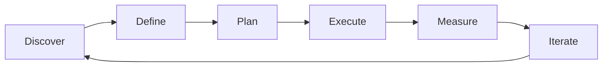

# Technical Program Management — A 2-Day Crash Course

> **In one sentence:** Technical program management is the discipline of coordinating multiple
> teams, managing cross-team dependencies, and driving complex technical initiatives to
> completion — the connective tissue between strategy and execution at scale.

> Cross-references: `Product-Management-Fundamentals.md` (the PM role that TPMs partner with),
> `Delivery-Execution.md` (launch readiness and release planning), `Project-Management-Fundamentals.md`
> (foundational project management concepts), `JIRA-Project-Tools.md` (the tracking tools TPMs
> live in).

---

## Part 0 — Why technical program management exists

A single team building a single feature does not need a TPM. The product manager sets direction,
the engineering manager runs the team, and work flows through sprints to delivery. The problems
start when the feature requires three teams, two of which have conflicting priorities, one of
which depends on a platform migration that is running late, and the whole thing must ship before
a regulatory deadline.

That is when work falls through the cracks. Team A assumes Team B is building the shared
library. Team B assumes Team C already has the API ready. Nobody tracks the critical path.
Status updates become a game of telephone. The deadline arrives, and everyone is surprised.

Technical program management exists to prevent that surprise. The TPM does not build the
software and does not decide what to build. What the TPM does is make the invisible visible:
dependencies between teams, risks that span boundaries, decisions that are blocked because nobody
owns the meeting, and timelines that do not account for reality.

**Mental model:** A TPM is an air traffic controller. The pilots (engineering teams) fly the
planes. The airline (product/business) decides which routes to fly. The air traffic controller
does not fly or decide routes — they see the whole airspace, sequence the landings, flag
conflicts, and make sure nothing collides. Without them, each pilot sees only their own
instruments. With them, the system works.

---




## Part 1 — The vocabulary

| Term | Meaning |
|------|---------|
| **TPM** (Technical Program Manager) | Drives cross-team execution of complex technical initiatives — owns the "how and when" across teams |
| **Program** | A collection of related projects that together achieve a strategic objective. Bigger than a project, smaller than a portfolio |
| **Dependency** | A relationship where Team A's work cannot start or finish until Team B delivers something. The primary source of cross-team risk |
| **Critical path** | The longest sequence of dependent tasks that determines the earliest possible completion date. Delays on the critical path delay the program |
| **RAID log** | A tracking tool for Risks, Assumptions, Issues, and Dependencies — the TPM's primary risk-management instrument |
| **Launch readiness review (LRR)** | A structured checklist-driven review to confirm all teams are ready to ship — code, testing, monitoring, rollback, docs, compliance |
| **Stakeholder map** | A classification of everyone affected by the program: who decides, who contributes, who needs to be informed |
| **Program roadmap** | A timeline view showing all workstreams, milestones, dependencies, and decision points across the program |
| **Milestone** | A significant checkpoint in the program — not a task, but a marker that a meaningful state has been reached |

The key distinction between the three roles that often get confused:

| Role | Owns | Timeframe | Primary question |
|------|------|-----------|-----------------|
| **PM** (Product Manager) | What to build and why | Quarters to years | "Are we building the right thing?" |
| **EM** (Engineering Manager) | The team — people, process, technical quality | Ongoing | "Is the team healthy and effective?" |
| **TPM** (Technical Program Manager) | Cross-team execution | Weeks to quarters | "Will this land on time, with all pieces fitting together?" |

In smaller organisations, one person may wear two of these hats. In larger organisations, the
boundaries are clear and all three roles are essential.

---

## DAY 1 — Understand the role

### 1. When you need a TPM (and when you do not)

You need a TPM when:
- More than two teams must coordinate to deliver a single outcome
- There are hard deadlines with external consequences (regulatory, contractual, launch events)
- The initiative has cross-cutting technical dependencies (platform migrations, API changes,
  shared infrastructure)
- Past similar efforts failed because of coordination gaps, not technical difficulty

You do not need a TPM when:
- A single team owns the entire delivery end to end
- The work is well-scoped with no cross-team dependencies
- The engineering manager can handle coordination as part of their role

### 2. The TPM's daily toolkit

A TPM's week revolves around a small set of recurring activities:

```text
Monday:    Review RAID log, update dependency tracker, identify blockers
Tuesday:   Cross-team sync — 30 min standup with tech leads from each workstream
Wednesday: Stakeholder update — status email or dashboard refresh
Thursday:  Risk review — are mitigation plans on track? Any new risks?
Friday:    Program roadmap update, prep for next week's decisions
```

The artefacts a TPM maintains:

```text
1. Program roadmap       — timeline with workstreams, milestones, dependencies
2. RAID log              — risks, assumptions, issues, dependencies (living document)
3. Dependency tracker    — who needs what from whom, by when
4. Status report         — weekly summary for stakeholders (RAG status per workstream)
5. Decision log          — what was decided, by whom, when, and why
6. Launch readiness doc  — checklist for go/no-go
```

### 3. Mapping dependencies

Dependencies are the single biggest source of program risk. Map them explicitly:

```text
Dependency format:
  [Team A: Task X] --depends on--> [Team B: Task Y] by [date]

Example dependency chain for a payment-system migration:
  [Payments: New gateway adapter]
    --depends on--> [Platform: API versioning framework] by Sprint 4
    --depends on--> [Infra: New certificate provisioning] by Sprint 3
    --depends on--> [Security: Compliance review of gateway B] by Sprint 5
```

Visualise dependencies as a directed graph. Any cycle is a design problem. Any chain longer than
three links is a schedule risk. The longest chain through the graph is your critical path.

### 4. The RAID log

```text
| ID   | Type       | Description                              | Owner   | Status | Due        |
|------|------------|------------------------------------------|---------|--------|------------|
| R-01 | Risk       | Gateway B sandbox may have rate limits    | DevLead | Open   | 2026-06-15 |
| A-01 | Assumption | Compliance team available for review Q3   | TPM     | Open   | 2026-07-01 |
| I-01 | Issue      | Staging env not provisioned yet           | Infra   | Active | 2026-06-08 |
| D-01 | Dependency | Need API v2 schema from Platform team     | PlatEng | Open   | 2026-06-20 |
```

Review the RAID log weekly. Stale entries erode trust — if something was resolved, mark it.
If a risk materialised, move it to issues.

### 5. By end of Day 1 you can:

- Explain the TPM role and how it differs from PM and EM
- Build a dependency map for a multi-team initiative
- Start and maintain a RAID log
- Identify the critical path through a set of dependencies

---

## DAY 2 — Make it real

### 6. Building a program roadmap

A program roadmap is not a Gantt chart for one team — it is a view across all teams showing how
their work fits together:

```text
            Sprint 3      Sprint 4      Sprint 5      Sprint 6
Platform:   [API v2 design] [API v2 build] [API v2 test]
                              |
Payments:                    [Adapter build]──[Integration test]──[Rollout]
                                                |
Infra:      [Cert provisioning]────────────────[Monitoring setup]
                                                |
Security:                                      [Compliance review]───[Sign-off]
                                                                       |
                                                              * Launch readiness
```

Key principles:
- **Show dependencies as arrows**, not just parallel tracks
- **Mark milestones** with a clear definition of "done" for each
- **Highlight the critical path** — the sequence whose delay delays everything
- **Update weekly** — a roadmap that is not current is worse than no roadmap

### 7. Stakeholder communication

Different stakeholders need different levels of detail:

| Audience | What they need | Format | Frequency |
|----------|---------------|--------|-----------|
| **Executives** | Are we on track? What are the top risks? | 3-bullet email or slide | Bi-weekly |
| **Product managers** | Scope trade-offs, timeline impacts | Program sync meeting | Weekly |
| **Tech leads** | Dependency status, blockers, technical decisions | Cross-team standup | 2x/week |
| **Individual contributors** | "What do I need from another team, and when?" | Dependency tracker | Continuous |

The most common communication mistake: sending the same status email to all four audiences.
Executives do not need JQL queries. Engineers do not need executive framing.

Use RAG (Red/Amber/Green) status consistently:

```text
Green:  On track, no action needed
Amber:  At risk — mitigation plan exists but needs attention
Red:    Off track — requires escalation or scope change
```

### 8. Running a cross-team sync

The cross-team sync is the TPM's most important recurring meeting:

```text
Duration: 30 minutes (strict)
Attendees: Tech leads from each workstream (not the whole team)
Agenda:
  1. Dependency check (5 min) — any blockers since last sync?
  2. Workstream updates (15 min) — RAG status, what shipped, what is next
  3. Risks and decisions (10 min) — new risks, decisions needed this week

Rules:
  - No problem-solving in the sync. Identify the problem, assign an owner, solve offline.
  - Decisions that affect multiple teams get logged with rationale.
  - If a workstream is Green, one sentence is enough. Spend time on Amber and Red.
```

### 9. Launch readiness review

Before any major launch, run a structured readiness review:

```text
Launch readiness checklist:
  [ ] All features code-complete and merged
  [ ] Integration tests passing in staging
  [ ] Performance testing completed — meets SLA thresholds
  [ ] Monitoring and alerting configured (dashboards, PagerDuty)
  [ ] Rollback plan documented and tested
  [ ] Runbook written for on-call team
  [ ] Security review signed off
  [ ] Compliance/regulatory approval obtained (BFSI: audit trail verified)
  [ ] Customer communication prepared (if user-facing change)
  [ ] Support team briefed on new functionality
  [ ] Go/no-go decision recorded with attendees and rationale
```

⚠️ The rollback plan is not optional. Every launch must have a tested path back to the previous
state. In regulated environments (banking, payments), this is not just good practice — it is a
compliance requirement.

### 10. Handling program-level risks

When a risk materialises into an issue, the TPM's job is triage:

```text
1. What is the impact on the critical path?
   - If on critical path → immediate escalation
   - If not on critical path → monitor, adjust buffer

2. What are the options?
   - Descope: remove a feature to preserve the timeline
   - Resequence: move a workstream to absorb the delay
   - Add capacity: bring in another engineer (diminishing returns)
   - Accept the slip: push the date and communicate early

3. Who decides?
   - Scope changes → PM + TPM
   - Timeline changes → TPM + EM + PM
   - Resource changes → EM
   - Escalation → TPM presents options, leadership decides
```

The TPM's value is not avoiding problems — it is seeing them early, presenting clear options,
and driving a decision before the problem becomes a crisis.

---

## Worked example — coordinating a multi-team platform migration

```text
Context: A BFSI organisation is migrating its core payment processing from
a monolith to microservices. Four teams involved. Regulatory deadline: end of Q3.

1. TPM maps the program:
   Workstreams:
   - Team Alpha: Payment gateway microservice
   - Team Beta: Transaction ledger service
   - Team Gamma: Reconciliation engine (depends on Alpha and Beta)
   - Team Infra: Kubernetes cluster + observability stack

2. Dependencies identified:
   Gamma cannot start integration testing until Alpha and Beta have
   deployed to staging (Sprint 6).
   Infra must have the cluster ready by Sprint 4 (all teams need it).
   Security review must complete before any production traffic.

3. Critical path:
   Infra cluster (Sprint 4) → Alpha deploys to staging (Sprint 6) →
   Gamma integration tests (Sprint 7-8) → Security review (Sprint 9) →
   Production cutover (Sprint 10)

4. RAID log populated:
   R-01: Infra team has 1 engineer on paternity leave Sprints 5-6
   D-01: Alpha needs new cert format from Infra by Sprint 4
   A-01: Assumes regulatory review takes 2 weeks, not 4

5. Weekly cross-team sync established (Tuesday 10:00):
   Week 3 update: Infra is Amber — cert provisioning tool has a bug.
   TPM action: escalate to Infra lead, propose workaround using
   existing cert format temporarily.

6. Week 6: Assumption A-01 invalidated — regulator needs 4 weeks.
   TPM presents options to PM and leadership:
   Option A: Start regulatory submission 2 sprints earlier (descope one feature)
   Option B: Push launch by 2 weeks (still within Q3, but tight)
   Decision: Option A chosen. Feature descoped to backlog for Q4.

7. Sprint 9: Launch readiness review conducted.
   All items green except monitoring dashboards (Amber — 80% complete).
   Decision: proceed with launch, monitoring gaps closed in first week.

8. Sprint 10: Production cutover completes. Zero-downtime migration.
   Post-launch review: dependency mapping saved an estimated 3 weeks of
   delay that would have been discovered late.
```

---

## Common pitfalls

- **Becoming a status-collection service.** If all you do is ask "what's your status?" and relay
  it, you are a human email forwarder. TPMs add value by analysing dependencies, flagging risks
  before they materialise, and driving decisions.
- **Owning decisions that belong to PM or EM.** The TPM facilitates and tracks decisions but does
  not make product scope calls (PM's job) or people decisions (EM's job). Overstepping erodes
  trust.
- **Ignoring the critical path.** If you track everything equally, you protect nothing
  effectively. Identify the critical path and focus your energy there.
- **Letting the RAID log go stale.** A RAID log that has not been updated in three weeks is
  decoration. Review it weekly or do not maintain one at all.
- **Over-communicating to everyone.** Sending the full program status to every stakeholder means
  nobody reads it. Tailor the message to the audience.
- **Tracking vanity milestones.** A milestone that does not represent a meaningful state change
  ("design started") is noise. Milestones should mark points where something is usable, testable,
  or shippable.
- **Not testing the rollback plan.** A rollback plan that has never been exercised is a hope, not
  a plan. In BFSI, untested rollback in production is an audit finding.

---

## Quick reference

```text
# TPM vs PM vs EM
TPM: cross-team execution, dependencies, timeline — "will it land?"
PM:  what to build and why — "are we building the right thing?"
EM:  team health, people, technical quality — "is the team effective?"

# RAID log format
R — Risk:       what might go wrong (probability + impact)
A — Assumption: what we believe to be true but have not verified
I — Issue:      what has already gone wrong (needs resolution)
D — Dependency: what we need from another team (with deadline)

# RAG status
Green: on track | Amber: at risk, mitigation exists | Red: off track, escalation needed

# Cross-team sync agenda (30 min)
Dependency check (5 min) → Workstream updates (15 min) → Risks + decisions (10 min)

# Critical path identification
1. Map all tasks and dependencies as a directed graph
2. Find the longest path from start to finish
3. Any delay on this path = program delay
4. Focus TPM energy on critical-path items

# Launch readiness checklist
Code complete → Tests passing → Perf tested → Monitoring live → Rollback tested →
Security signed off → Compliance approved → Support briefed → Go/no-go recorded

# Stakeholder communication matrix
Executives:  3-bullet summary, bi-weekly
PMs:         scope + timeline detail, weekly sync
Tech leads:  dependency status + blockers, 2x/week
ICs:         dependency tracker, continuous

# Risk response options
Descope → Resequence → Add capacity → Accept slip → Escalate
```

---


## Top 10 Interview Questions

<details>
<summary><strong>Q: What is Technical Program Management and what problem does it solve?</strong></summary>

Technical Program Management addresses a specific need in modern engineering workflows. Understanding the core problem it solves — and the alternatives it replaced — is the foundation for every subsequent interview question. Frame your answer around the pain point first, then the solution.

</details>

<details>
<summary><strong>Q: How does Technical Program Management compare to its main alternatives?</strong></summary>

Every tool exists in an ecosystem of alternatives. Be prepared to articulate the specific tradeoffs: when Technical Program Management is the right choice, when an alternative is better, and what factors drive the decision (scale, team expertise, existing infrastructure, compliance requirements).

</details>

<details>
<summary><strong>Q: What are the most common production pitfalls with Technical Program Management?</strong></summary>

Production experience is what separates senior from junior engineers. Common pitfalls include: misconfiguration that works in dev but fails at scale, security oversights, inadequate monitoring, and operational procedures that are untested until an incident occurs. Cite specific examples from your experience.

</details>

<details>
<summary><strong>Q: How do you monitor and observe Technical Program Management in production?</strong></summary>

Key metrics to track, alerting thresholds to set, dashboards to build, and log patterns to watch. Production monitoring should cover: health/liveness, performance (latency, throughput), capacity (resource utilisation), and business impact (error rates affecting users). Explain which metrics are leading indicators versus lagging.

</details>

<details>
<summary><strong>Q: How do you scale Technical Program Management as load increases?</strong></summary>

Scaling strategies depend on the bottleneck: horizontal scaling (add more instances), vertical scaling (bigger instances), caching (reduce load), sharding (distribute data), and async processing (decouple components). Explain which approach applies to Technical Program Management and at what scale each strategy becomes necessary.

</details>

<details>
<summary><strong>Q: How do you handle security and access control with Technical Program Management?</strong></summary>

Security is non-negotiable in production. Cover: authentication and authorization mechanisms, secrets management (never in code), encryption (at rest and in transit), network security (firewalls, private networks), audit logging, and compliance requirements relevant to your industry.

</details>

<details>
<summary><strong>Q: How do you implement disaster recovery for Technical Program Management?</strong></summary>

DR planning requires defining RTO (recovery time objective) and RPO (recovery point objective), implementing backup strategies, testing restore procedures, and documenting runbooks. Explain your backup strategy, how you test restores, and what your recovery procedure looks like.

</details>

<details>
<summary><strong>Q: How do you automate Technical Program Management deployment and configuration management?</strong></summary>

Infrastructure as code, CI/CD pipelines, configuration management, and GitOps workflows. Explain how you version, test, deploy, and roll back changes. Cover: what is automated, what requires manual approval, and how you handle configuration drift.

</details>

<details>
<summary><strong>Q: How do you troubleshoot issues with Technical Program Management in production?</strong></summary>

A systematic debugging approach: check health endpoints, review recent changes (deploys, config changes), examine logs and metrics, reproduce the issue, identify root cause, fix, verify, and write a postmortem. Explain your actual debugging workflow with concrete examples.

</details>

<details>
<summary><strong>Q: What are the best practices for Technical Program Management that you have learned from experience?</strong></summary>

Best practices that go beyond documentation: lessons learned from production incidents, configuration patterns that prevent common issues, testing strategies that catch bugs before production, and operational procedures that reduce toil. Share specific examples where following (or not following) a best practice had measurable impact.

</details>

---

## Next steps after Day 2

- `Project-Management-Fundamentals.md` — foundational project management concepts (WBS, triple constraint)
- `Delivery-Execution.md` — release planning, feature flags, and go/no-go decisions
- `Product-Management-Fundamentals.md` — the PM role that TPMs partner with daily
- `JIRA-Project-Tools.md` — the tracking tools for program-level visibility

---

## Recommended learning resources

**YouTube channels & playlists:**
- [LeadDev](https://www.youtube.com/@LeadDev) — talks on technical program management, cross-team coordination, and engineering leadership
- [Dave Farley — Continuous Delivery](https://www.youtube.com/@ContinuousDelivery) — release management, deployment strategies, and launch readiness
- [Atlassian](https://www.youtube.com/@Atlassian) — program-level tracking with JIRA and Confluence, portfolio management

**Official docs & references:**
- [PMI (pmi.org)](https://www.pmi.org/) — program management standards and the PgMP certification framework
- [Scrum.org — Nexus Guide](https://www.scrum.org/resources/nexus-guide) — scaling Scrum across multiple teams
- [Atlassian — Program Management](https://www.atlassian.com/agile/project-management/program-management) — practical guide to managing programs with agile tools

## Recommended learning resources

**YouTube channels & playlists:**
- [Gergely Orosz — The Pragmatic Engineer](https://www.youtube.com/@mrgergelyorosz) — TPM role deep dives, big tech program management, and cross-functional coordination
- [Will Larson](https://www.youtube.com/@WillLarson) — staff engineering and TPM perspectives on technical strategy, migrations, and platform work

**Books & articles:**
- [An Elegant Puzzle — Will Larson](https://lethain.com/elegant-puzzle/) — engineering management and program management for scaling organisations
- [Staff Engineer — Will Larson](https://staffeng.com/book) — technical leadership patterns that TPMs need to understand and support

**The mantra:** See the whole board, not just one team's lane — surface dependencies early, drive decisions before they become crises, and never launch without a tested rollback plan.
