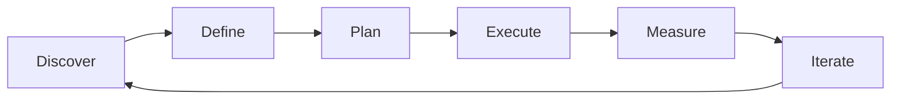

# User Stories & Requirements — A 2-Day Crash Course

> **In one sentence:** User stories are the bridge between what users need and what engineering
> builds — small, testable descriptions of value written from the user's perspective.

> Cross-references: `Product-Management-Fundamentals.md` (the PM role that writes them),
> `Agile-Scrum.md` (the execution framework that consumes them), `Stakeholder-Management.md`
> (where requirements often originate), `Product-Discovery.md` (how you validate before writing).

---

## Part 0 — Why user stories exist

Without user stories, requirements live in one of two bad places: a 60-page specification
document nobody reads, or inside one person's head where nobody else can see them. The spec
document goes stale the moment it is written. The head-knowledge creates a bus factor of one.
Both lead to the same outcome — engineering builds something different from what users need,
and nobody notices until it ships.

User stories solve this by making requirements small, visible, and testable. Instead of
describing a system in abstract terms, you describe a single slice of value from the
perspective of someone who will use it. This forces you to answer three questions every time:
who wants it, what they want, and why they want it. If you cannot answer all three, the
requirement is not ready.

The one idea that unlocks everything: a user story is not a specification — it is a
**placeholder for a conversation**. The story card captures just enough to remind the team
what to talk about. The real detail emerges in the conversation between PM, engineering, and
design. The acceptance criteria record the outcome of that conversation.

**Mental model:** A user story is a restaurant order. The diner (user) says what they want and
why ("I'd like the salmon, no dairy — I'm lactose intolerant"). The waiter (PM) writes it on
a ticket. The chef (engineering) reads the ticket and asks clarifying questions before cooking.
The ticket is not the recipe — it is the agreement about what will arrive at the table.

---




## Part 1 — The vocabulary

| Term | Meaning |
|------|---------|
| **User story** | A short description of a feature from the user's perspective: "As a [role], I want [action] so that [benefit]" |
| **Acceptance criteria** | The specific conditions that must be true for a story to be considered done — the definition of "correct" |
| **Epic** | A large body of work that breaks down into multiple user stories — too big to fit in one sprint |
| **Task** | A technical unit of work within a story — what an individual developer picks up ("add API endpoint", "write migration") |
| **INVEST** | A checklist for well-written stories: Independent, Negotiable, Valuable, Estimable, Small, Testable |
| **Definition of Done (DoD)** | The team-wide standard every story must meet before it can be called complete (tests pass, code reviewed, deployed to staging) |
| **Story mapping** | A technique for arranging stories in a 2D grid — user journey across the top, priority down the side — to see the whole product at once |
| **PRD** (Product Requirements Document) | A document describing the problem, goals, scope, and stories for a feature — the story's parent context |
| **BRD** (Business Requirements Document) | A higher-level document describing what the business needs and why — feeds into PRDs |
| **Spike** | A time-boxed research story whose output is knowledge, not code — used when the team cannot estimate because they do not understand the problem yet |

The key distinction to internalise: **PRDs describe the problem and solution at a feature
level. User stories describe individual slices of value within that solution. Tasks describe
the engineering work to deliver a single story.** The hierarchy is: BRD → PRD → Epic → Story → Task.

---

## DAY 1 — Write your first stories

### 1. The anatomy of a good story

The classic format:

```text
As a [type of user],
I want [action or capability],
so that [benefit or outcome].
```

The "so that" clause is the most important part and the most frequently skipped. Without it,
you are describing a feature, not a need. "As a user, I want to reset my password" is
incomplete. "As a user, I want to reset my password so that I can regain access to my account
when I forget my credentials" tells engineering *why* — and the why shapes the how.

### 2. Writing acceptance criteria

Acceptance criteria turn a vague story into a testable contract. Use the Given/When/Then
format for clarity:

```text
Story: As a customer, I want to filter transactions by date range
       so that I can find specific payments quickly.

Acceptance criteria:
  Given I am on the transaction history page
  When I select a start date and end date
  Then only transactions within that range are displayed

  Given I select a date range with no transactions
  When the filter is applied
  Then I see an empty state message, not an error

  Given I clear the date filter
  When the page refreshes
  Then all transactions are shown again
```

Each criterion is a scenario. If you can write the Given/When/Then, you can write the test.
If you cannot write the Given/When/Then, the story is not ready for engineering.

### 3. The INVEST checklist

Before putting a story into the backlog, run it through INVEST:

- **Independent** — can it be built without depending on another unfinished story?
- **Negotiable** — is the implementation open for discussion, or have you dictated the solution?
- **Valuable** — does it deliver something a user or the business cares about?
- **Estimable** — can engineering give it a rough size? If not, you need a spike first.
- **Small** — can it be completed in one sprint? If not, split it.
- **Testable** — can you write acceptance criteria? If not, the requirement is too vague.

### 4. Splitting stories that are too big

Large stories are the number-one cause of sprint overruns. Split along these axes:

```text
# Splitting strategies (pick the one that fits)
1. By workflow step    — "search" and "filter" are separate stories
2. By data variation   — "transfer to own account" vs "transfer to third party"
3. By user role        — "admin views dashboard" vs "analyst views dashboard"
4. By happy/sad path   — "successful payment" vs "payment failure handling"
5. By CRUD operation   — create, read, update, delete as separate stories
6. By platform         — "mobile view" vs "desktop view"
```

The goal is not to create the smallest possible stories. The goal is stories that each deliver
a usable slice of value and can be completed in one sprint.

### 5. From stories to tasks

Once a story is estimated and pulled into a sprint, the engineering team breaks it into tasks:

```text
Story: As a manager, I want to export a team report as PDF
       so that I can share it with stakeholders offline.

Tasks:
  1. Design PDF template layout (design, 2h)
  2. Create PDF generation service (backend, 4h)
  3. Add "Export PDF" button to report page (frontend, 2h)
  4. Write integration test for PDF endpoint (test, 2h)
  5. Add analytics event for export action (instrumentation, 1h)
```

Stories belong to the PM. Tasks belong to engineering. The PM says *what* and *why*; engineering
decides *how* and breaks it into *tasks*.

### 6. By end of Day 1 you can:

- Write a user story with a clear who/what/why
- Attach testable acceptance criteria using Given/When/Then
- Evaluate a story against the INVEST checklist
- Split an oversized story into sprint-sized slices
- Distinguish between epics, stories, and tasks

---

## DAY 2 — Make it real

### 7. Story mapping

Story mapping arranges your backlog in two dimensions:

```text
User journey (left to right):
  Sign up → Configure → First use → Daily use → Share → Admin

Priority (top to bottom):
  Row 1: Walking skeleton (minimum viable)
  Row 2: First release
  Row 3: Nice to have
  Row 4: Future

        Sign up    Configure    First use    Daily use    Share
Row 1:  email reg  defaults     basic view   core action  invite link
Row 2:  SSO        custom       onboarding   filters      PDF export
Row 3:  social     import       tutorials    bulk ops     API access
```

Read left-to-right to see the user's journey. Draw a horizontal line to define your release —
everything above the line ships; everything below waits. This is far more useful than a flat
backlog because it preserves the user's experience as the organising principle.

### 8. Writing a PRD

A PRD is the story's parent document. It provides context that individual stories cannot carry:

```text
# PRD: Transaction Export Feature

1. Problem:     Managers copy transaction data into spreadsheets manually.
                This takes 2+ hours per week and introduces errors.
2. Goal:        Reduce export effort to under 5 minutes. Success = 80%
                of managers using the export feature within 30 days.
3. User stories: [list the 4-6 stories that compose this feature]
4. Scope IN:    CSV and PDF export, date range filter, column selection
5. Scope OUT:   Scheduled exports, email delivery, custom templates
6. Design:      [link to Figma mockups]
7. Tech notes:  PDF generation via server-side rendering; CSV streamed
8. Open Qs:     Max row count before we paginate? Compliance review needed?
9. Timeline:    Sprint 14 (backend), Sprint 15 (frontend + integration)
```

The PRD is not a contract. It is a communication tool. Keep it short enough that people read it.

### 9. BRDs vs PRDs

| Aspect | BRD | PRD |
|--------|-----|-----|
| **Audience** | Executives, business stakeholders | Engineering, design, QA |
| **Focus** | Business need and justification | Solution and implementation scope |
| **Detail** | High-level outcomes and metrics | Stories, criteria, wireframes |
| **Who writes** | Business analyst or senior PM | Product manager |
| **When** | Before solution is designed | After problem is validated |

In smaller organisations, one document does both jobs. In regulated industries like banking,
the BRD often exists for audit and compliance purposes — it records *why* the business
approved the spend.

### 10. Backlog refinement

Stories rot. A story written three months ago is stale — the context has changed, the team
has learned things, the priority may have shifted. Refine the backlog weekly:

- **Re-estimate** — has new information changed the effort?
- **Re-prioritise** — is this still the most valuable thing?
- **Split or merge** — has scope changed?
- **Remove** — if nobody has touched it in three months, delete it. You can rewrite it if it
  becomes relevant again. Dead stories create noise.

### 11. Requirements in regulated environments

In BFSI and healthcare, requirements carry compliance weight. Traceability matters:

- Every user story links to a business requirement (BRD item or regulatory clause)
- Acceptance criteria double as test evidence for auditors
- Change history is preserved — who changed what requirement, when, and why
- Stories that affect financial calculations or user data get explicit security review

This is not bureaucracy for its own sake. It is how you demonstrate to a regulator that what
you built is what you intended to build.

---

## Worked example — from business need to sprint-ready stories

```text
1. Business need (BRD): "We must support real-time fraud alerts to comply
   with RBI mandate by Q3. Current batch processing misses 40% of
   fraud within the first hour."

2. PRD written:
   - Problem: batch fraud detection has a 1-hour delay
   - Goal: detect and alert on suspicious transactions within 30 seconds
   - Success metric: time-to-alert < 30s for 95th percentile
   - Scope IN: real-time scoring, push alert, transaction hold
   - Scope OUT: ML model retraining, customer dispute flow

3. Story map created:
   Row 1 (MVP):     stream transactions → score in real-time → push alert
   Row 2 (release): hold transaction → manual review queue → release/block
   Row 3 (future):  customer notification → dispute initiation → audit log

4. Stories for Row 1:
   Story A: "As a fraud analyst, I want transactions scored in real-time
            so that I see alerts within 30 seconds of a suspicious event."
   Criteria: Given a transaction with fraud score > 0.8,
             When it is processed, Then an alert appears in the dashboard
             within 30 seconds.

   Story B: "As a fraud analyst, I want push notifications for high-risk
            alerts so that I do not need to watch the dashboard constantly."
   Criteria: Given a fraud score > 0.95, When the alert fires,
             Then a push notification is sent to on-call analyst's device.

   Story C: "As an operations lead, I want to see a real-time count of
            alerts per hour so that I can staff the review queue."
   Criteria: Given the dashboard is open, When new alerts arrive,
             Then the hourly count updates without page refresh.

5. Sprint planning: Stories A and B go into Sprint 12. Story C into Sprint 13.
   Each story has 3-4 tasks assigned to individual engineers.
```

---

## Common pitfalls

- **Skipping the "so that" clause.** Without the benefit, engineering cannot make trade-offs.
  "I want a button" tells them nothing. "So that I can export data for my weekly report" tells
  them everything.
- **Writing implementation as a story.** "As a developer, I want to refactor the database
  schema" is a task, not a story. Stories describe user value. Refactors are tasks that enable
  future stories.
- **Gold-plating acceptance criteria.** Criteria should define *what* is correct, not *how* to
  build it. "Use React and Redux" is an implementation constraint, not an acceptance criterion.
- **Never splitting stories.** If a story takes more than one sprint, it is an epic wearing a
  disguise. Split it. You lose nothing by splitting; you gain visibility and momentum.
- **Treating the backlog as sacred.** Stories are cheap. Delete stale ones. A backlog of 200
  stories is a graveyard, not a plan.
- **Writing stories in isolation.** A story without a conversation is a guess. The PM writes
  the initial draft; the team refines it together in grooming.
- **Confusing PRDs with contracts.** A PRD is a living document. If you learn something during
  the sprint that changes scope, update the PRD. Clinging to the original spec is how you ship
  the wrong thing on time.

---

## Quick reference

```text
# User story format
As a [role], I want [action] so that [benefit]

# Acceptance criteria format (Given/When/Then)
Given [precondition]
When [action]
Then [expected result]

# INVEST checklist
I — Independent (no blocked-by chains)
N — Negotiable (solution is open to discussion)
V — Valuable (delivers user or business value)
E — Estimable (team can size it)
S — Small (fits in one sprint)
T — Testable (acceptance criteria are writable)

# Story splitting strategies
Workflow step | Data variation | User role | Happy/sad path | CRUD | Platform

# Hierarchy
BRD → PRD → Epic → Story → Task

# Story mapping axes
Horizontal: user journey steps (left to right)
Vertical: priority (top = MVP, bottom = future)

# PRD structure
Problem → Goal/Metrics → Stories → Scope IN/OUT → Design → Tech Notes → Open Qs → Timeline

# Backlog health check (weekly)
Re-estimate | Re-prioritise | Split or merge | Delete stale items
```

---


## Top 10 Interview Questions

<details>
<summary><strong>Q: What is User Stories Requirements and what problem does it solve?</strong></summary>

User Stories Requirements addresses a specific need in modern engineering workflows. Understanding the core problem it solves — and the alternatives it replaced — is the foundation for every subsequent interview question. Frame your answer around the pain point first, then the solution.

</details>

<details>
<summary><strong>Q: How does User Stories Requirements compare to its main alternatives?</strong></summary>

Every tool exists in an ecosystem of alternatives. Be prepared to articulate the specific tradeoffs: when User Stories Requirements is the right choice, when an alternative is better, and what factors drive the decision (scale, team expertise, existing infrastructure, compliance requirements).

</details>

<details>
<summary><strong>Q: What are the most common production pitfalls with User Stories Requirements?</strong></summary>

Production experience is what separates senior from junior engineers. Common pitfalls include: misconfiguration that works in dev but fails at scale, security oversights, inadequate monitoring, and operational procedures that are untested until an incident occurs. Cite specific examples from your experience.

</details>

<details>
<summary><strong>Q: How do you monitor and observe User Stories Requirements in production?</strong></summary>

Key metrics to track, alerting thresholds to set, dashboards to build, and log patterns to watch. Production monitoring should cover: health/liveness, performance (latency, throughput), capacity (resource utilisation), and business impact (error rates affecting users). Explain which metrics are leading indicators versus lagging.

</details>

<details>
<summary><strong>Q: How do you scale User Stories Requirements as load increases?</strong></summary>

Scaling strategies depend on the bottleneck: horizontal scaling (add more instances), vertical scaling (bigger instances), caching (reduce load), sharding (distribute data), and async processing (decouple components). Explain which approach applies to User Stories Requirements and at what scale each strategy becomes necessary.

</details>

<details>
<summary><strong>Q: How do you handle security and access control with User Stories Requirements?</strong></summary>

Security is non-negotiable in production. Cover: authentication and authorization mechanisms, secrets management (never in code), encryption (at rest and in transit), network security (firewalls, private networks), audit logging, and compliance requirements relevant to your industry.

</details>

<details>
<summary><strong>Q: How do you implement disaster recovery for User Stories Requirements?</strong></summary>

DR planning requires defining RTO (recovery time objective) and RPO (recovery point objective), implementing backup strategies, testing restore procedures, and documenting runbooks. Explain your backup strategy, how you test restores, and what your recovery procedure looks like.

</details>

<details>
<summary><strong>Q: How do you automate User Stories Requirements deployment and configuration management?</strong></summary>

Infrastructure as code, CI/CD pipelines, configuration management, and GitOps workflows. Explain how you version, test, deploy, and roll back changes. Cover: what is automated, what requires manual approval, and how you handle configuration drift.

</details>

<details>
<summary><strong>Q: How do you troubleshoot issues with User Stories Requirements in production?</strong></summary>

A systematic debugging approach: check health endpoints, review recent changes (deploys, config changes), examine logs and metrics, reproduce the issue, identify root cause, fix, verify, and write a postmortem. Explain your actual debugging workflow with concrete examples.

</details>

<details>
<summary><strong>Q: What are the best practices for User Stories Requirements that you have learned from experience?</strong></summary>

Best practices that go beyond documentation: lessons learned from production incidents, configuration patterns that prevent common issues, testing strategies that catch bugs before production, and operational procedures that reduce toil. Share specific examples where following (or not following) a best practice had measurable impact.

</details>

---


## Quick Quiz

Test your understanding with these rapid-fire questions (answers hidden):

<details>
<summary>1. What is the ONE core problem that User Stories Requirements solves?</summary>
Re-read Part 0 — the mental model section. If you can explain the "why" in one sentence, you understand the foundation.
</details>

<details>
<summary>2. Name the 3 most important terms from the vocabulary section.</summary>
Review Part 1. These are the building blocks every conversation about User Stories Requirements uses.
</details>

<details>
<summary>3. What is the first thing you would set up on Day 1?</summary>
Check the Day 1 section — the very first hands-on step that gets you a working result.
</details>

<details>
<summary>4. What is the most common production pitfall with User Stories Requirements?</summary>
Review the Common Pitfalls section. The first item listed is typically the most frequently encountered.
</details>

<details>
<summary>5. How does User Stories Requirements compare to its closest alternative?</summary>
Check the Comparison Matrix below — focus on the key differentiating row.
</details>


## Comparison Matrix

| Dimension | User Stories | Use Cases | Job Stories |
|-----------|--------------|-----------|-------------|
| **Primary use case** | Core strength of User Stories | Core strength of Use Cases | Core strength of Job Stories |
| **Learning curve** | Moderate | Varies | Varies |
| **Community/ecosystem** | Active | Active | Growing |
| **Operational complexity** | Medium | Varies | Varies |
| **Best for** | See Part 0 | Different tradeoffs | Different tradeoffs |

> **How to read this matrix:** no tool wins on every dimension. Pick based on your specific constraints — team expertise, existing infrastructure, scale requirements, and compliance needs. The right choice is the one that fits your context, not the one with the most checkmarks.

## Next steps after Day 2

- `Agile-Scrum.md` — how stories flow through sprints
- `Kanban.md` — an alternative flow-based approach to managing story work
- `Product-Discovery.md` — how to validate that you are writing the right stories
- `Stakeholder-Management.md` — managing the people who generate requirements

---

## Recommended learning resources

**YouTube channels & playlists:**
- [Mountain Goat Software — Mike Cohn](https://www.youtube.com/@MountainGoatSoftware) — the definitive source on user stories, estimation, and agile requirements
- [Atlassian Agile Coach](https://www.youtube.com/@Atlassian) — practical walkthroughs of story writing, backlog grooming, and story mapping
- [Henrik Kniberg](https://www.youtube.com/@HenrikKniberg1) — story mapping, MVP thinking, and the "skateboard to car" model of incremental delivery
- [Dave Farley — Continuous Delivery](https://www.youtube.com/@ContinuousDelivery) — how well-written requirements connect to continuous delivery

**Official docs & blogs:**
- [Mountain Goat Software — User Stories](https://www.mountaingoatsoftware.com/agile/user-stories) — Mike Cohn's articles and templates for story writing
- [Atlassian — User Stories Guide](https://www.atlassian.com/agile/project-management/user-stories) — practical guide with examples
- [Agile Manifesto](https://agilemanifesto.org/) — the foundational principles behind story-driven development

## Recommended learning resources

**YouTube channels & playlists:**
- [Mountain Goat Software — Mike Cohn](https://www.youtube.com/@MountainGoatSoftware) — the definitive user story educator; INVEST criteria, story splitting, and acceptance criteria patterns
- [Atlassian Agile Coach](https://www.youtube.com/@Atlassian) — user story writing workshops, Jira story templates, and requirement hierarchy guides

**Books & articles:**
- [User Stories Applied — Mike Cohn](https://www.mountaingoatsoftware.com/books/user-stories-applied) — the original user stories book; writing, estimating, and planning with stories
- [Writing Effective User Stories — Stoica](https://www.goodreads.com/book/show/36564812-writing-effective-user-stories) — practical patterns and anti-patterns for requirement writing

**The mantra:** Write stories from the user's perspective, attach testable acceptance criteria, split until they fit in a sprint, and remember — the story is a placeholder for a conversation, not a specification.
