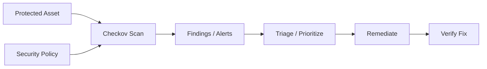

# Checkov — A 2-Day Crash Course

Checkov is a static analysis tool for IaC — it scans Terraform, CloudFormation, Kubernetes, and Dockerfile for security misconfigurations before you deploy them.

**Prerequisite:** `Terraform.md`

---

## Part 0 — Why Checkov

Trivy scans images after build. Checkov scans your IaC before deploy. That distinction matters more than it looks.

By the time a container image is built and pushed, you have already written the Terraform that opens port 22 to `0.0.0.0/0`, created the S3 bucket with public ACL, or deployed the pod without a `readOnlyRootFilesystem`. Checkov catches those decisions at `terraform plan` time — before any resource touches a cloud account.

The principle is called shifting security left. The further left a finding lands, the cheaper it is to fix. A failed Checkov check in a local pre-commit hook costs you thirty seconds. The same misconfiguration caught by a penetration tester costs you weeks.

Checkov integrates into the same workflow you already use: local CLI, pre-commit hooks, and CI/CD pipelines. It requires no agents, no cloud credentials, and no runtime access. It reads files.

---

## Vocabulary

**Policy** — A rule that defines what "secure" means for a given resource attribute. Example: "S3 buckets must have server-side encryption enabled."

**Check** — The implementation of a policy. Each check has an ID (e.g., `CKV_AWS_19`), a name, a resource type it targets, and pass/fail logic.

**Framework** — The IaC format being scanned. Checkov supports `terraform`, `cloudformation`, `kubernetes`, `dockerfile`, `helm`, `bicep`, `arm`, `ansible`, `github_actions`, and more.

**Guideline** — A URL attached to a check that explains the remediation. Shown in output when a check fails.

**Custom Policy (Python)** — A check you write in Python by subclassing `BaseResourceCheck`. Full access to the resource config dict.

**Custom Policy (YAML)** — A declarative check written as a YAML file using Checkov's DSL. No Python required. Easier to write, narrower in power.

**Baseline** — A snapshot of existing violations. When you run Checkov with a baseline, it suppresses findings that were already present when the snapshot was taken. Useful for brownfield codebases — you can adopt Checkov without blocking on hundreds of pre-existing issues.

**Suppression** — An inline annotation that tells Checkov to skip a specific check for a specific resource. Uses a comment in the IaC file itself, keeping the justification next to the code.

**SARIF** — Static Analysis Results Interchange Format. A JSON schema for security tool output. GitHub Code Scanning, Azure DevOps, and other platforms consume SARIF to surface findings in pull request annotations.

**SCA (Software Composition Analysis)** — Checkov can scan `requirements.txt`, `package.json`, `go.mod`, and similar files for known CVEs in open-source dependencies. This is separate from IaC checks.

**Graph-based Check** — A check that reasons across multiple resources and their relationships. Example: a security group that allows unrestricted ingress attached to an EC2 instance — neither resource is misconfigured in isolation, but together they are. Graph checks use a resource connection graph built from your Terraform state.

---




## DAY 1 — Scanning and Reading Results

### Install

```bash
pip install checkov

# verify
checkov --version
```

If you prefer isolation:

```bash
pipx install checkov
```

Docker (no install required):

```bash
docker run --rm -v $(pwd):/tf bridgecrew/checkov -d /tf
```

### Scan a Terraform Directory

```bash
checkov -d ./infra
```

Checkov walks the directory, parses every `.tf` file, and evaluates all built-in checks against every resource it finds.

Output format by default is CLI. Each result shows:

```
Check: CKV_AWS_19: "Ensure all data stored in the S3 bucket is securely encrypted"
  PASSED for resource: aws_s3_bucket.logs
  File: /infra/storage.tf:10-25

Check: CKV_AWS_20: "Ensure the S3 bucket has access control list (ACL) is private"
  FAILED for resource: aws_s3_bucket.assets
  File: /infra/storage.tf:28-42
  Guide: https://docs.bridgecrew.io/docs/s3_1-acl-prohibited
```

Exit code `0` means all checks passed. Exit code `1` means at least one check failed. CI pipelines use this.

### Scan Kubernetes Manifests

```bash
checkov -d ./k8s --framework kubernetes
```

Or target a single file:

```bash
checkov -f ./k8s/deployment.yaml
```

Checkov detects the framework automatically when you use `-f`. With `-d` it scans all supported frameworks unless you restrict with `--framework`.

Common K8s checks: privileged containers (`CKV_K8S_16`), `hostPID` (`CKV_K8S_17`), missing resource limits (`CKV_K8S_11`), `readOnlyRootFilesystem` (`CKV_K8S_22`), capabilities drop (`CKV_K8S_28`).

### Scan a Dockerfile

```bash
checkov -f ./Dockerfile
```

Common Dockerfile checks: running as root (`CKV_DOCKER_2`), `HEALTHCHECK` missing (`CKV_DOCKER_6`), `ADD` used instead of `COPY` (`CKV_DOCKER_9`).

### Reading Output

The default output is verbose. For a summary only:

```bash
checkov -d ./infra --compact
```

For machine-readable output:

```bash
# JSON
checkov -d ./infra -o json > results.json

# JUnit XML (for CI test reporters)
checkov -d ./infra -o junitxml > results.xml

# SARIF (for GitHub Code Scanning)
checkov -d ./infra -o sarif > results.sarif
```

### Filtering by Severity

Checkov checks carry severity labels: `CRITICAL`, `HIGH`, `MEDIUM`, `LOW`, `INFO`.

```bash
# fail only on CRITICAL and HIGH
checkov -d ./infra --check-type-filter CRITICAL,HIGH

# soft fail: always exit 0, but still report
checkov -d ./infra --soft-fail

# soft fail only for LOW and INFO, hard fail for everything else
checkov -d ./infra --soft-fail-on LOW,INFO
```

### Filtering by Framework

```bash
checkov -d ./infra --framework terraform
checkov -d . --framework kubernetes,dockerfile
```

### Run or Skip Specific Checks

```bash
# run only these checks
checkov -d ./infra --check CKV_AWS_19,CKV_AWS_20

# skip these checks
checkov -d ./infra --skip-check CKV_AWS_18
```

---

## DAY 2 — Custom Policies, Baselines, CI/CD, and More

### Custom Policy in Python

Create a file `checks/enforce_tags.py`:

```python
from checkov.common.models.enums import CheckResult, CheckCategories
from checkov.terraform.checks.resource.base_resource_check import BaseResourceCheck

class EnforceCostCenterTag(BaseResourceCheck):
    def __init__(self):
        name = "Ensure all resources have a cost_center tag"
        id = "CKV_CUSTOM_1"
        supported_resources = ["aws_instance", "aws_s3_bucket", "aws_rds_instance"]
        categories = [CheckCategories.GENERAL_SECURITY]
        super().__init__(name=name, id=id,
                         categories=categories,
                         supported_resources=supported_resources)

    def scan_resource_conf(self, conf):
        tags = conf.get("tags", [{}])
        if isinstance(tags, list):
            tags = tags[0]
        if isinstance(tags, dict) and "cost_center" in tags:
            return CheckResult.PASSED
        return CheckResult.FAILED

scanner = EnforceCostCenterTag()
```

Run with the custom check:

```bash
checkov -d ./infra --external-checks-dir ./checks
```

### Custom Policy in YAML

Create `checks/enforce_tags.yaml`:

```yaml
metadata:
  name: "Ensure cost_center tag is present"
  id: "CKV2_CUSTOM_1"
  category: "GENERAL_SECURITY"
  severity: "MEDIUM"
scope:
  provider: aws
definition:
  and:
    - cond_type: attribute
      resource_types:
        - aws_instance
        - aws_s3_bucket
      attribute: tags.cost_center
      operator: exists
```

```bash
checkov -d ./infra --external-checks-dir ./checks
```

YAML policies are easier to write and review in pull requests. Use Python when you need conditional logic that the YAML DSL cannot express.

### Baseline — Suppress Existing Violations

Generate a baseline from the current state of your repo:

```bash
checkov -d ./infra --create-baseline
```

This writes `.checkov.baseline` to the directory. Commit it.

Now run with the baseline:

```bash
checkov -d ./infra --baseline .checkov.baseline
```

Only new violations — introduced after the baseline was created — will fail the run. Existing violations are reported but do not affect the exit code.

Refresh the baseline after you remediate issues:

```bash
checkov -d ./infra --create-baseline
git add .checkov.baseline && git commit -m "chore: update checkov baseline"
```

### Inline Suppression

To suppress a specific check for a specific resource, add a comment in the Terraform file:

```hcl
resource "aws_s3_bucket" "legacy_public" {
  bucket = "my-legacy-public-bucket"
  acl    = "public-read"  # checkov:skip=CKV_AWS_20:Legacy bucket, migration tracked in JIRA-4821
}
```

The comment format is `checkov:skip=CHECK_ID:reason`. The reason is required — Checkov will not suppress without it.

For Kubernetes:

```yaml
metadata:
  annotations:
    checkov.io/skip1: "CKV_K8S_22=needs write access for log rotation"
```

### CI/CD Integration

**GitHub Actions:**

```yaml
name: Checkov IaC Scan

on:
  pull_request:
    paths:
      - 'infra/**'
      - 'k8s/**'

jobs:
  checkov:
    runs-on: ubuntu-latest
    steps:
      - uses: actions/checkout@v4

      - name: Run Checkov
        uses: bridgecrewio/checkov-action@v3.2.0
        with:
          directory: infra/
          framework: terraform
          output_format: sarif
          output_file_path: results.sarif
          soft_fail: false
          skip_check: CKV_AWS_18

      - name: Upload SARIF
        uses: github/codeql-action/upload-sarif@v3
        if: always()
        with:
          sarif_file: results.sarif
```

The SARIF upload surfaces Checkov findings directly in the pull request's Security tab as inline annotations.

**Pre-commit hook:**

```yaml
# .pre-commit-config.yaml
repos:
  - repo: https://github.com/bridgecrewio/checkov
    rev: 3.2.0
    hooks:
      - id: checkov
        args: ['--framework', 'terraform', '--soft-fail-on', 'LOW,INFO']
```

### Graph-based Checks

Graph checks reason about resource connections. Checkov builds a graph of your Terraform resources and their relationships, then evaluates policies that span multiple nodes.

A practical example: `CKV2_AWS_12` checks whether an EC2 instance is associated with a security group that has unrestricted ingress on port 22. Neither the `aws_instance` nor the `aws_security_group` alone fails — the check only triggers when the two are connected via `vpc_security_group_ids`.

Graph checks run automatically when you scan Terraform. You do not need a special flag. To write your own graph check, subclass `BaseGraphCheck` in Python — YAML is not sufficient for cross-resource logic.

### SCA — Open-Source Dependency Scanning

```bash
# scan Python dependencies
checkov -f requirements.txt

# scan a whole project including manifests
checkov -d . --framework sca_package
```

Checkov queries the Prisma Cloud vulnerability database. A free API key gives you the full dataset; without it, Checkov falls back to a bundled offline database that is updated less frequently.

```bash
export BC_API_KEY=your_key_here
checkov -d . --framework sca_package
```

It reports CVE IDs, severity, affected version, and the fixed version. Treat SCA results the same as IaC results — pipe them to SARIF and upload to Code Scanning.

### IDE Plugins

VS Code: install the "Checkov" extension from the Marketplace. It runs checks on save and underlines failing resources inline, showing the check ID and guideline URL on hover.

JetBrains (IntelliJ, PyCharm, GoLand): install the "Checkov" plugin from the plugin marketplace. Same behavior.

Both plugins respect your `.checkov.baseline` and `checkov:skip` annotations, so your suppression decisions carry through from CI to your editor.

### Checkov vs tfsec vs Terrascan

| Dimension | Checkov | tfsec | Terrascan |
|---|---|---|---|
| Frameworks | Terraform, CF, K8s, Dockerfile, Helm, Bicep, ARM, GitHub Actions, and more | Terraform, Dockerfile, K8s | Terraform, K8s, Dockerfile, Helm |
| Custom policies | Python + YAML DSL | Rego (OPA) | Rego (OPA) |
| Graph-based checks | Yes | No | No |
| SCA (dependencies) | Yes | No | No |
| SARIF output | Yes | Yes | Yes |
| Baseline support | Yes | No | No |
| Speed | Moderate | Fast | Moderate |
| Maintained by | Prisma Cloud (Palo Alto) | Aqua Security | Tenable |

Use Checkov when you want the widest framework coverage, YAML custom policies, and SCA in one tool. Use tfsec when you want Terraform-only scanning with the fastest runtime. Use Terrascan when your organization already standardizes on Rego for OPA and wants consistent policy language across tools.

---

## Worked Example — Securing a Terraform AWS Project in CI

You have a Terraform project in `infra/` that provisions an EC2 instance, an S3 bucket, and a VPC. You want to add Checkov to your GitHub Actions pipeline.

**Step 1 — Run locally first.**

```bash
checkov -d infra/ --framework terraform -o json > checkov_baseline_run.json
```

Read the failures. You find:

- `CKV_AWS_8` — EC2 IMDSv2 not enforced
- `CKV_AWS_20` — S3 bucket ACL not private
- `CKV_AWS_18` — S3 access logging not enabled (acceptable for dev)

**Step 2 — Fix the real issues.**

```hcl
# EC2: enforce IMDSv2
resource "aws_instance" "app" {
  ami           = var.ami_id
  instance_type = "t3.small"

  metadata_options {
    http_tokens   = "required"
    http_endpoint = "enabled"
  }
}

# S3: remove public ACL
resource "aws_s3_bucket_acl" "assets" {
  bucket = aws_s3_bucket.assets.id
  acl    = "private"
}
```

**Step 3 — Suppress the accepted risk.**

```hcl
resource "aws_s3_bucket" "assets" {
  bucket = "my-app-assets-dev"
  # checkov:skip=CKV_AWS_18:Access logging not required for dev environment, tracked in SEC-112
}
```

**Step 4 — Create a baseline.**

```bash
checkov -d infra/ --create-baseline
git add infra/.checkov.baseline
```

**Step 5 — Add to CI.**

```yaml
- name: Checkov scan
  uses: bridgecrewio/checkov-action@v3.2.0
  with:
    directory: infra/
    framework: terraform
    baseline: infra/.checkov.baseline
    output_format: sarif
    output_file_path: checkov.sarif

- name: Upload results
  uses: github/codeql-action/upload-sarif@v3
  if: always()
  with:
    sarif_file: checkov.sarif
```

From this point, any new resource that introduces a failing check will block the pull request. Existing accepted violations stay suppressed via the baseline.

---

## Pitfalls

**Scanning the wrong directory.** Checkov scans subdirectories recursively. If your repo root contains both application code and Terraform, run `checkov -d infra/` not `checkov -d .`. Scanning the full repo is slower and noisier.

**Pinning to `@master`.** The `bridgecrewio/checkov-action@master` tag always pulls the latest release. This is convenient but can break your pipeline when Checkov adds new checks that your code does not yet pass. Pin to a specific version in production pipelines.

**Baseline drift.** A baseline is a snapshot. If you add new resources without regenerating it, violations in those new resources will be invisible. Regenerate the baseline only after you have intentionally reviewed and accepted the current violation set.

**Suppressing without a reason.** `checkov:skip=CKV_AWS_20` without a reason string causes Checkov to ignore the annotation silently in some versions. Always include the colon and a reason. It also forces whoever writes the suppression to justify it in code review.

**Treating soft-fail as a fix.** `--soft-fail` makes Checkov exit `0` regardless of findings. This is useful during initial adoption, not as a permanent configuration. Teams that leave `--soft-fail` on permanently get no signal from the tool.

**Graph checks and dynamic blocks.** If your Terraform uses dynamic blocks or `count`/`for_each` in ways that obscure resource relationships, graph checks may produce false negatives. Review graph check results manually during initial setup to confirm coverage.

**SCA without an API key.** Offline SCA uses a bundled, infrequently updated CVE database. For production security scanning, set `BC_API_KEY`. The key is free.

---

## Quick Reference

```bash
# basic scan
checkov -d ./infra

# single file
checkov -f main.tf

# specific framework
checkov -d . --framework kubernetes

# JSON output
checkov -d . -o json

# SARIF output
checkov -d . -o sarif

# skip a check
checkov -d . --skip-check CKV_AWS_18

# run only specific checks
checkov -d . --check CKV_AWS_19,CKV_AWS_20

# severity filter
checkov -d . --check-type-filter CRITICAL,HIGH

# soft fail (always exit 0)
checkov -d . --soft-fail

# soft fail on low severity only
checkov -d . --soft-fail-on LOW,INFO

# create baseline
checkov -d ./infra --create-baseline

# run with baseline
checkov -d ./infra --baseline .checkov.baseline

# external custom checks
checkov -d . --external-checks-dir ./checks

# SCA dependency scan
checkov -d . --framework sca_package

# compact output
checkov -d . --compact

# inline suppression (in .tf file)
# checkov:skip=CKV_AWS_20:reason

# API key for full SCA database
export BC_API_KEY=your_key_here
```

---


## Top 10 Interview Questions

<details>
<summary><strong>Q: What is Checkov and what problem does it solve?</strong></summary>

Checkov addresses a specific need in modern engineering workflows. Understanding the core problem it solves — and the alternatives it replaced — is the foundation for every subsequent interview question. Frame your answer around the pain point first, then the solution.

</details>

<details>
<summary><strong>Q: How does Checkov compare to its main alternatives?</strong></summary>

Every tool exists in an ecosystem of alternatives. Be prepared to articulate the specific tradeoffs: when Checkov is the right choice, when an alternative is better, and what factors drive the decision (scale, team expertise, existing infrastructure, compliance requirements).

</details>

<details>
<summary><strong>Q: What are the most common production pitfalls with Checkov?</strong></summary>

Production experience is what separates senior from junior engineers. Common pitfalls include: misconfiguration that works in dev but fails at scale, security oversights, inadequate monitoring, and operational procedures that are untested until an incident occurs. Cite specific examples from your experience.

</details>

<details>
<summary><strong>Q: How do you monitor and observe Checkov in production?</strong></summary>

Key metrics to track, alerting thresholds to set, dashboards to build, and log patterns to watch. Production monitoring should cover: health/liveness, performance (latency, throughput), capacity (resource utilisation), and business impact (error rates affecting users). Explain which metrics are leading indicators versus lagging.

</details>

<details>
<summary><strong>Q: How do you scale Checkov as load increases?</strong></summary>

Scaling strategies depend on the bottleneck: horizontal scaling (add more instances), vertical scaling (bigger instances), caching (reduce load), sharding (distribute data), and async processing (decouple components). Explain which approach applies to Checkov and at what scale each strategy becomes necessary.

</details>

<details>
<summary><strong>Q: How do you handle security and access control with Checkov?</strong></summary>

Security is non-negotiable in production. Cover: authentication and authorization mechanisms, secrets management (never in code), encryption (at rest and in transit), network security (firewalls, private networks), audit logging, and compliance requirements relevant to your industry.

</details>

<details>
<summary><strong>Q: How do you implement disaster recovery for Checkov?</strong></summary>

DR planning requires defining RTO (recovery time objective) and RPO (recovery point objective), implementing backup strategies, testing restore procedures, and documenting runbooks. Explain your backup strategy, how you test restores, and what your recovery procedure looks like.

</details>

<details>
<summary><strong>Q: How do you automate Checkov deployment and configuration management?</strong></summary>

Infrastructure as code, CI/CD pipelines, configuration management, and GitOps workflows. Explain how you version, test, deploy, and roll back changes. Cover: what is automated, what requires manual approval, and how you handle configuration drift.

</details>

<details>
<summary><strong>Q: How do you troubleshoot issues with Checkov in production?</strong></summary>

A systematic debugging approach: check health endpoints, review recent changes (deploys, config changes), examine logs and metrics, reproduce the issue, identify root cause, fix, verify, and write a postmortem. Explain your actual debugging workflow with concrete examples.

</details>

<details>
<summary><strong>Q: What are the best practices for Checkov that you have learned from experience?</strong></summary>

Best practices that go beyond documentation: lessons learned from production incidents, configuration patterns that prevent common issues, testing strategies that catch bugs before production, and operational procedures that reduce toil. Share specific examples where following (or not following) a best practice had measurable impact.

</details>

---


## Terminal Demo

```terminal-demo
# checkov@policy ~ %

$ checkov --version
3.2.38

$ checkov -d terraform/ --framework terraform
Passed checks: 45  Failed checks: 3  Skipped: 2

Check: CKV_AWS_145: "Ensure S3 bucket encryption is enabled"
  PASSED for: aws_s3_bucket.data_lake

Check: CKV_AWS_18: "Ensure AWS access logging is enabled on S3"
  FAILED for: aws_s3_bucket.logs
  File: /s3.tf:12-18
  Guide: https://docs.bridgecrew.io/docs/s3-13-enable-logging

Check: CKV_AWS_23: "Ensure every security group has a description"
  FAILED for: aws_security_group.api
  File: /sg.tf:1-8

$ checkov -f Dockerfile
Passed: 5  Failed: 1
FAILED: CKV_DOCKER_3 "Ensure USER instruction exists"

$ checkov -d kubernetes/ --framework kubernetes
Passed: 23  Failed: 2
FAILED: CKV_K8S_20 "Containers should not run with allowPrivilegeEscalation"
FAILED: CKV_K8S_28 "Ensure resource limits are set"
```

---

## Quick Quiz

Test your understanding with these rapid-fire questions (answers hidden):

<details>
<summary>1. What is the ONE core problem that Checkov solves?</summary>
Re-read Part 0 — the mental model section. If you can explain the "why" in one sentence, you understand the foundation.
</details>

<details>
<summary>2. Name the 3 most important terms from the vocabulary section.</summary>
Review Part 1. These are the building blocks every conversation about Checkov uses.
</details>

<details>
<summary>3. What is the first thing you would set up on Day 1?</summary>
Check the Day 1 section — the very first hands-on step that gets you a working result.
</details>

<details>
<summary>4. What is the most common production pitfall with Checkov?</summary>
Review the Common Pitfalls section. The first item listed is typically the most frequently encountered.
</details>

<details>
<summary>5. How does Checkov compare to its closest alternative?</summary>
Check the Comparison Matrix below — focus on the key differentiating row.
</details>


## Comparison Matrix

| Dimension | Checkov | tfsec | Snyk IaC |
|-----------|---------|-------|----------|
| **Primary use case** | Core strength of Checkov | Core strength of tfsec | Core strength of Snyk IaC |
| **Learning curve** | Moderate | Varies | Varies |
| **Community/ecosystem** | Active | Active | Growing |
| **Operational complexity** | Medium | Varies | Varies |
| **Best for** | See Part 0 | Different tradeoffs | Different tradeoffs |

> **How to read this matrix:** no tool wins on every dimension. Pick based on your specific constraints — team expertise, existing infrastructure, scale requirements, and compliance needs. The right choice is the one that fits your context, not the one with the most checkmarks.

## Next Steps

- `Terraform.md` — write the IaC that Checkov scans
- `Trivy.md` — scan container images and registries after build
- `OPA.md` — write Rego policies for tools like tfsec and Conftest
- `GitHub-Actions.md` — integrate Checkov into your pipeline alongside other security steps

---

## Recommended learning resources

**YouTube channels & playlists:**
- [Bridgecrew (Prisma Cloud) — Checkov playlist](https://www.youtube.com/@PrismaCloudbyPaloAltoNetworks) — official tutorials on policy-as-code scanning for Terraform, CloudFormation, Kubernetes, and Dockerfiles
- [John Hammond — Infrastructure Security](https://www.youtube.com/@_JohnHammond) — hands-on demonstrations of catching misconfigurations before they reach production
- [CNCF — Policy-as-Code talks](https://www.youtube.com/@cncf) — KubeCon presentations on OPA, Checkov, and the broader shift-left security movement
- [Snyk — IaC Security](https://www.youtube.com/@Snyksec) — comparisons of IaC scanning tools and strategies for integrating them into CI pipelines
- [The Cyber Mentor — Cloud Security](https://www.youtube.com/@TCMSecurityAcademy) — offensive cloud security perspective that shows what Checkov's policies are designed to prevent

**Official docs & blogs:**
- [Checkov Official Documentation](https://www.checkov.io/1.Welcome/Quick%20Start.html) — installation, CLI usage, custom policy authoring, and CI/CD integration guide
- [Bridgecrew Blog](https://www.paloaltonetworks.com/blog/) — IaC security research, new policy announcements, and misconfiguration case studies
- [OWASP — Infrastructure as Code Security](https://owasp.org/www-project-devsecops-guideline/) — the DevSecOps framework that Checkov helps implement

---

## The Mantra

> Catch it in the plan. Fix it in the file. Never fix it in the account.

Security tools that run after deployment are forensics. Checkov runs before deployment — that is the only phase where a finding costs nothing to fix. Every check you skip or suppress is a decision, not a shortcut. Own the decision, document it inline, and review it when the threat model changes.
