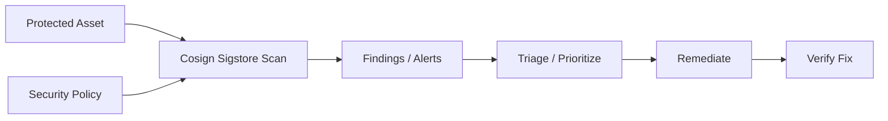

# Cosign & Sigstore — A 2-Day Crash Course

Supply chain security — sign and verify container images cryptographically so you can prove an image is exactly what it claims to be, untampered, from the builder you trust.

---

## Part 0 — Why This Matters

In December 2020 SolarWinds shipped a software update that had been backdoored at the build stage. Eighteen thousand organizations installed it. The attackers didn't break into production — they broke into the build pipeline and poisoned the artifact before it ever shipped.

Container images have the same problem. When you `docker pull myapp:1.4.2`, you're trusting that:

- The registry served you the image the maintainer actually built
- Nobody tampered with it in transit or at rest
- The tag hasn't been silently overwritten since you last ran it

Tags are mutable. Digests are immutable but unverified. Neither proves *who* built the image or *what* went into it.

Cosign and the Sigstore ecosystem give you cryptographic proof. You sign an artifact at build time and verify that signature at deploy time. If the signature doesn't match, you reject the workload before it ever runs.

This isn't theoretical hygiene. CISA, NSA, and the White House Executive Order on Cybersecurity (EO 14028) all mandate software supply chain integrity controls. SLSA (Supply chain Levels for Software Artifacts) is the framework that operationalizes it. Cosign is the tooling you'll reach for most often.

---

## Vocabulary

**Cosign** — a CLI tool (and Go library) from the Sigstore project. You use it to sign container images, blobs, and attestations, and to verify them.

**Sigstore** — the umbrella project. Think of it as "Let's Encrypt for software signing." It provides the public-good infrastructure — Rekor and Fulcio — so the ecosystem doesn't rely on everyone managing their own PKI.

**Rekor** — an append-only, tamper-evident transparency log (like Certificate Transparency, but for software signatures). Every signature you push gets recorded here. You can query it independently of the registry.

**Fulcio** — a short-lived certificate authority. When you do keyless signing, Fulcio issues you a certificate valid for ten minutes, tied to your OIDC identity (GitHub Actions OIDC token, Google account, etc.). The certificate proves *who* signed without requiring you to manage long-lived private keys.

**Keyless Signing** — sign using an ephemeral key pair and OIDC identity instead of a persistent key. The certificate is recorded in Rekor. Verification is done by checking the Rekor entry and the certificate's subject (e.g., `https://github.com/org/repo/.github/workflows/release.yml@refs/heads/main`).

**SBOM (Software Bill of Materials)** — a manifest of every package, library, and component in your image. Think of it as a nutritional label for software. Common formats: SPDX and CycloneDX.

**Attestation** — a signed claim *about* an artifact. An SBOM attached as an attestation says "this image contains these packages, and this signature proves the claim came from a trusted builder." Other attestations can assert test results, vulnerability scan results, or SLSA provenance.

**SLSA (Supply chain Levels for Software Artifacts)** — a graduated framework (Levels 1–4) describing how much you can trust a build artifact. Level 1 means provenance exists. Level 4 means a hermetic, reproducible build by a two-party reviewed process. Most teams target SLSA Level 2 or 3.

**Policy (Kyverno / OPA / Connaisseur)** — admission controllers in Kubernetes that enforce "only admit images with a valid Cosign signature from this identity." Without policy enforcement, signing is documentation, not a control.

---




## DAY 1 — Sign and Verify

### Install Cosign

```bash
# macOS
brew install cosign

# Linux (binary)
COSIGN_VERSION=$(curl -s https://api.github.com/repos/sigstore/cosign/releases/latest \
  | jq -r .tag_name)
curl -Lo cosign \
  "https://github.com/sigstore/cosign/releases/download/${COSIGN_VERSION}/cosign-linux-amd64"
chmod +x cosign
sudo mv cosign /usr/local/bin/

# Confirm the install
cosign version
```

### Generate a Key Pair (traditional signing)

```bash
cosign generate-key-pair
# Writes cosign.key (private) and cosign.pub (public)
# You'll be prompted for a password
```

Store `cosign.key` in your secrets manager. Commit `cosign.pub` to your repository — it's public.

### Sign an Image

You must reference an image by digest, not tag, when signing. Tags are mutable; digests are not.

```bash
# Push your image first, then capture the digest
IMAGE="ghcr.io/yourorg/yourapp"
DIGEST=$(docker buildx imagetools inspect "${IMAGE}:latest" \
  --format '{{.Manifest.Digest}}')

cosign sign --key cosign.key "${IMAGE}@${DIGEST}"
```

Cosign stores the signature in the same registry as the image, as an OCI artifact attached to the digest. Nothing extra to manage.

### Verify an Image

```bash
cosign verify \
  --key cosign.pub \
  "${IMAGE}@${DIGEST}" \
  | jq .
```

A successful verify prints the payload JSON. A failed verify exits non-zero — which is what you want in scripts.

### What Gets Stored Where

Cosign pushes signatures to the registry under a derived tag: `sha256-<digest>.sig`. You don't see it with `docker pull` but it's there. The signature itself is a JWS (JSON Web Signature) blob.

To also write signatures to Rekor:

```bash
cosign sign --key cosign.key --rekor-url https://rekor.sigstore.dev "${IMAGE}@${DIGEST}"
```

This is the default behavior for keyless signing.

### Keyless Signing with OIDC

Keyless signing removes the burden of key management. Instead of a persistent private key, you use your OIDC identity token — issued by GitHub Actions, GitLab CI, Google, or any other OIDC provider Fulcio trusts.

```bash
# Locally, cosign opens a browser to authenticate
cosign sign "${IMAGE}@${DIGEST}"
# No --key flag — cosign detects keyless mode
```

In GitHub Actions:

```yaml
- name: Sign image
  run: |
    cosign sign \
      --identity-token="${ACTIONS_ID_TOKEN_REQUEST_TOKEN}" \
      "${IMAGE}@${DIGEST}"
```

Fulcio issues a ten-minute certificate. Cosign creates a signature, bundles it with the certificate, and records both in Rekor. The private key is discarded immediately.

### Verify Keyless

```bash
cosign verify \
  --certificate-identity \
    "https://github.com/yourorg/yourrepo/.github/workflows/release.yml@refs/heads/main" \
  --certificate-oidc-issuer \
    "https://token.actions.githubusercontent.com" \
  "${IMAGE}@${DIGEST}"
```

You're asserting: trust signatures issued to this workflow on this branch, from GitHub's OIDC issuer. This is stronger than trusting a key file, because the identity is human-readable and auditable.

---

## DAY 2 — Attestations, SBOMs, Policy, CI/CD, and SLSA

### Attach an SBOM as an Attestation

Generate an SBOM with Syft:

```bash
syft "${IMAGE}@${DIGEST}" -o spdx-json > sbom.spdx.json
```

Attest it:

```bash
cosign attest \
  --key cosign.key \
  --predicate sbom.spdx.json \
  --type spdxjson \
  "${IMAGE}@${DIGEST}"
```

Verify the attestation:

```bash
cosign verify-attestation \
  --key cosign.pub \
  --type spdxjson \
  "${IMAGE}@${DIGEST}" \
  | jq '.payload | @base64d | fromjson'
```

The attestation is stored alongside the signature in the registry. Anyone with pull access can verify the SBOM is authentic and unchanged.

### Query the Rekor Transparency Log

Every signature and attestation recorded in Rekor gets a UUID. You can look it up:

```bash
# Find Rekor entries for your image
rekor-cli search --artifact "${IMAGE}@${DIGEST}"

# Fetch a specific entry
rekor-cli get --uuid <uuid> --format json | jq .
```

This is your audit trail. Even if someone overwrites the registry entry, the Rekor log is append-only and publicly auditable. You can prove a signature existed (or did not exist) at a specific timestamp.

### Policy Enforcement in Kubernetes — Kyverno

Installing Kyverno:

```bash
helm repo add kyverno https://kyverno.github.io/kyverno/
helm install kyverno kyverno/kyverno -n kyverno --create-namespace
```

A ClusterPolicy that requires a valid Cosign signature:

```yaml
apiVersion: kyverno.io/v1
kind: ClusterPolicy
metadata:
  name: require-signed-images
spec:
  validationFailureAction: Enforce
  background: false
  rules:
    - name: check-image-signature
      match:
        any:
          - resources:
              kinds: [Pod]
      verifyImages:
        - imageReferences:
            - "ghcr.io/yourorg/*"
          attestors:
            - entries:
                - keyless:
                    subject: >-
                      https://github.com/yourorg/yourrepo/
                      .github/workflows/release.yml@refs/heads/main
                    issuer: "https://token.actions.githubusercontent.com"
                    rekor:
                      url: https://rekor.sigstore.dev
```

Apply it:

```bash
kubectl apply -f require-signed-images.yaml
```

Now any Pod referencing an unsigned image from `ghcr.io/yourorg/*` is rejected at admission. This is enforcement, not just logging.

### Policy Enforcement — Connaisseur

Connaisseur is an alternative admission controller focused specifically on image signature verification. It's lighter than Kyverno if signing enforcement is your only need.

```bash
helm repo add connaisseur \
  https://sse-secure-systems.github.io/connaisseur/charts
helm install connaisseur connaisseur/connaisseur \
  -n connaisseur --create-namespace \
  -f your-connaisseur-values.yaml
```

Configuration is YAML-based — you list validators (Cosign, Notary v2) and their public keys or keyless identities. Refer to the Connaisseur docs for the full values schema.

### CI/CD Integration Checklist

In every pipeline that builds and pushes a container image:

1. Build and push the image, capture the digest
2. Generate an SBOM (Syft or Trivy)
3. Sign the image with `cosign sign`
4. Attach the SBOM with `cosign attest`
5. Optionally run a vulnerability scan and attest the results
6. Optionally generate SLSA provenance and attest it

Never sign a tag — always sign the digest. Tags can be rewritten; digests cannot.

### SLSA Levels in Practice

| Level | What it means | How to get there |
|-------|--------------|-----------------|
| 1 | Provenance exists | Use `cosign attest` with SLSA predicate |
| 2 | Hosted build, signed provenance | GitHub Actions + keyless Cosign |
| 3 | Hardened build, non-falsifiable provenance | Ephemeral build environments, no persistent credentials |
| 4 | Two-party review, hermetic build | Significant process overhead — rare outside critical infra |

Most teams ship SLSA Level 2 using GitHub Actions and Cosign keyless. Level 3 requires that the build environment itself cannot inject artifacts — ephemeral VMs, no network during build, reproducible builds.

The `slsa-github-generator` project gives you SLSA Level 3 provenance for GitHub Actions workflows with about ten lines of YAML.

---

## Worked Example — Signing and Verifying in a GitHub Actions Pipeline

```yaml
name: build-sign-push

on:
  push:
    branches: [main]

permissions:
  contents: read
  packages: write
  id-token: write   # required for keyless signing

jobs:
  build:
    runs-on: ubuntu-latest
    outputs:
      image-digest: ${{ steps.build.outputs.digest }}

    steps:
      - uses: actions/checkout@v4

      - name: Install Cosign
        uses: sigstore/cosign-installer@v3

      - name: Install Syft
        uses: anchore/sbom-action/download-syft@v0

      - name: Log in to GHCR
        uses: docker/login-action@v3
        with:
          registry: ghcr.io
          username: ${{ github.actor }}
          password: ${{ secrets.GITHUB_TOKEN }}

      - name: Build and push
        id: build
        uses: docker/build-push-action@v5
        with:
          push: true
          tags: ghcr.io/${{ github.repository }}:latest
          outputs: >-
            type=image,
            name=ghcr.io/${{ github.repository }},
            push-by-digest=true

      - name: Sign the image (keyless)
        run: |
          cosign sign \
            "ghcr.io/${{ github.repository }}@${{ steps.build.outputs.digest }}"

      - name: Generate SBOM
        run: |
          syft \
            "ghcr.io/${{ github.repository }}@${{ steps.build.outputs.digest }}" \
            -o spdx-json > sbom.spdx.json

      - name: Attest SBOM
        run: |
          cosign attest \
            --predicate sbom.spdx.json \
            --type spdxjson \
            "ghcr.io/${{ github.repository }}@${{ steps.build.outputs.digest }}"
```

Verification from any machine after the pipeline completes:

```bash
cosign verify \
  --certificate-identity \
    "https://github.com/yourorg/yourrepo/.github/workflows/build-sign-push.yml@refs/heads/main" \
  --certificate-oidc-issuer \
    "https://token.actions.githubusercontent.com" \
  "ghcr.io/yourorg/yourrepo@sha256:<digest>"
```

---

## Pitfalls

**Signing tags instead of digests.** A tag can be overwritten after signing. Sign `image@sha256:abc...` — not `image:latest`. Your pipeline should always resolve the digest after push and sign that value.

**Missing `id-token: write` permission.** Keyless signing in GitHub Actions requires an OIDC token. If `permissions.id-token` is not set to `write` in your workflow, the signing step silently fails or errors.

**Not pinning the cosign-installer action.** Use a pinned SHA for `sigstore/cosign-installer` in production workflows. Pulling `@v3` means you get whatever the maintainer pushed to that tag — which is the same supply chain problem you're trying to prevent.

**Trusting verification without enforcement.** Running `cosign verify` in a script that doesn't fail the deployment on non-zero exit is theater. Verification must gate the workflow — check exit codes explicitly, and back it up with an admission controller.

**Skipping Rekor logging.** For keyless signing, Rekor is mandatory — the certificate's validity window is ten minutes and the Rekor entry is how you prove the signature existed at build time. Don't disable it.

**Large attestations in the registry.** SBOMs for large images can be multi-megabyte JSON files stored as OCI artifacts in your registry. Confirm your registry supports OCI referrers — GHCR, ECR, and Artifact Registry all do. Some older Harbor installs need configuration.

**Key rotation neglect.** If you use key-based (not keyless) signing, rotate your keys on a schedule. A leaked `cosign.key` means all previous signatures are untrustworthy. With keyless signing this problem disappears — each signature is tied to a moment-in-time OIDC identity, not a persistent key.

⚠️ **Enforcement lag.** Adding a Kyverno policy to an existing cluster in `Enforce` mode will immediately block unsigned workloads. Roll out in `Audit` mode first, verify no legitimate workloads are unsigned, then switch to `Enforce`. Skipping this step will take down running services during a rollout.

---

## Quick Reference

```bash
# Install cosign
brew install cosign

# Generate key pair
cosign generate-key-pair

# Sign — key-based
cosign sign --key cosign.key IMAGE@DIGEST

# Sign — keyless
cosign sign IMAGE@DIGEST

# Verify — key-based
cosign verify --key cosign.pub IMAGE@DIGEST

# Verify — keyless
cosign verify \
  --certificate-identity WORKFLOW_URL \
  --certificate-oidc-issuer ISSUER_URL \
  IMAGE@DIGEST

# Attach SBOM attestation
cosign attest \
  --key cosign.key \
  --predicate sbom.json \
  --type spdxjson \
  IMAGE@DIGEST

# Verify attestation
cosign verify-attestation \
  --key cosign.pub \
  --type spdxjson \
  IMAGE@DIGEST

# Query Rekor
rekor-cli search --artifact IMAGE@DIGEST
rekor-cli get --uuid UUID --format json

# Get image digest
docker buildx imagetools inspect IMAGE:TAG \
  --format '{{.Manifest.Digest}}'
```

---


## Top 10 Interview Questions

<details>
<summary><strong>Q: What is Cosign Sigstore and what problem does it solve?</strong></summary>

Cosign Sigstore addresses a specific need in modern engineering workflows. Understanding the core problem it solves — and the alternatives it replaced — is the foundation for every subsequent interview question. Frame your answer around the pain point first, then the solution.

</details>

<details>
<summary><strong>Q: How does Cosign Sigstore compare to its main alternatives?</strong></summary>

Every tool exists in an ecosystem of alternatives. Be prepared to articulate the specific tradeoffs: when Cosign Sigstore is the right choice, when an alternative is better, and what factors drive the decision (scale, team expertise, existing infrastructure, compliance requirements).

</details>

<details>
<summary><strong>Q: What are the most common production pitfalls with Cosign Sigstore?</strong></summary>

Production experience is what separates senior from junior engineers. Common pitfalls include: misconfiguration that works in dev but fails at scale, security oversights, inadequate monitoring, and operational procedures that are untested until an incident occurs. Cite specific examples from your experience.

</details>

<details>
<summary><strong>Q: How do you monitor and observe Cosign Sigstore in production?</strong></summary>

Key metrics to track, alerting thresholds to set, dashboards to build, and log patterns to watch. Production monitoring should cover: health/liveness, performance (latency, throughput), capacity (resource utilisation), and business impact (error rates affecting users). Explain which metrics are leading indicators versus lagging.

</details>

<details>
<summary><strong>Q: How do you scale Cosign Sigstore as load increases?</strong></summary>

Scaling strategies depend on the bottleneck: horizontal scaling (add more instances), vertical scaling (bigger instances), caching (reduce load), sharding (distribute data), and async processing (decouple components). Explain which approach applies to Cosign Sigstore and at what scale each strategy becomes necessary.

</details>

<details>
<summary><strong>Q: How do you handle security and access control with Cosign Sigstore?</strong></summary>

Security is non-negotiable in production. Cover: authentication and authorization mechanisms, secrets management (never in code), encryption (at rest and in transit), network security (firewalls, private networks), audit logging, and compliance requirements relevant to your industry.

</details>

<details>
<summary><strong>Q: How do you implement disaster recovery for Cosign Sigstore?</strong></summary>

DR planning requires defining RTO (recovery time objective) and RPO (recovery point objective), implementing backup strategies, testing restore procedures, and documenting runbooks. Explain your backup strategy, how you test restores, and what your recovery procedure looks like.

</details>

<details>
<summary><strong>Q: How do you automate Cosign Sigstore deployment and configuration management?</strong></summary>

Infrastructure as code, CI/CD pipelines, configuration management, and GitOps workflows. Explain how you version, test, deploy, and roll back changes. Cover: what is automated, what requires manual approval, and how you handle configuration drift.

</details>

<details>
<summary><strong>Q: How do you troubleshoot issues with Cosign Sigstore in production?</strong></summary>

A systematic debugging approach: check health endpoints, review recent changes (deploys, config changes), examine logs and metrics, reproduce the issue, identify root cause, fix, verify, and write a postmortem. Explain your actual debugging workflow with concrete examples.

</details>

<details>
<summary><strong>Q: What are the best practices for Cosign Sigstore that you have learned from experience?</strong></summary>

Best practices that go beyond documentation: lessons learned from production incidents, configuration patterns that prevent common issues, testing strategies that catch bugs before production, and operational procedures that reduce toil. Share specific examples where following (or not following) a best practice had measurable impact.

</details>

---


## Quick Quiz

Test your understanding with these rapid-fire questions (answers hidden):

<details>
<summary>1. What is the ONE core problem that Cosign Sigstore solves?</summary>
Re-read Part 0 — the mental model section. If you can explain the "why" in one sentence, you understand the foundation.
</details>

<details>
<summary>2. Name the 3 most important terms from the vocabulary section.</summary>
Review Part 1. These are the building blocks every conversation about Cosign Sigstore uses.
</details>

<details>
<summary>3. What is the first thing you would set up on Day 1?</summary>
Check the Day 1 section — the very first hands-on step that gets you a working result.
</details>

<details>
<summary>4. What is the most common production pitfall with Cosign Sigstore?</summary>
Review the Common Pitfalls section. The first item listed is typically the most frequently encountered.
</details>

<details>
<summary>5. How does Cosign Sigstore compare to its closest alternative?</summary>
Check the Comparison Matrix below — focus on the key differentiating row.
</details>


## Comparison Matrix

| Dimension | Cosign/Sigstore | Notary v2 | Docker Content Trust |
|-----------|-----------------|-----------|----------------------|
| **Primary use case** | Core strength of Cosign/Sigstore | Core strength of Notary v2 | Core strength of Docker Content Trust |
| **Learning curve** | Moderate | Varies | Varies |
| **Community/ecosystem** | Active | Active | Growing |
| **Operational complexity** | Medium | Varies | Varies |
| **Best for** | See Part 0 | Different tradeoffs | Different tradeoffs |

> **How to read this matrix:** no tool wins on every dimension. Pick based on your specific constraints — team expertise, existing infrastructure, scale requirements, and compliance needs. The right choice is the one that fits your context, not the one with the most checkmarks.

## Next Steps

- `Trivy.md` — vulnerability scanning; combine with `cosign attest` to record scan results as signed attestations
- `Docker.md` — build fundamentals; signing assumes you're already pushing to a registry
- `Kubernetes.md` — admission controllers, Kyverno ClusterPolicies, and workload hardening
- `GitHub-Actions.md` — OIDC token permissions, reusable workflows, and pinning actions by SHA

---

## Recommended learning resources

**YouTube channels & playlists:**
- [CNCF — Sigstore talks (KubeCon)](https://www.youtube.com/@cncf) — maintainer presentations on keyless signing, Fulcio, Rekor, and the transparency log architecture
- [John Hammond — Supply Chain Security](https://www.youtube.com/@_JohnHammond) — hands-on demonstrations of image signing, verification, and attestation workflows
- [Snyk — Software Supply Chain](https://www.youtube.com/@Snyksec) — broader context on SBOMs, provenance, and how signing fits into the supply chain security model
- [Chainguard — Sigstore Tutorials](https://www.youtube.com/@Chainguard) — practical guides on Cosign, SLSA provenance, and policy enforcement with Kyverno
- [LiveOverflow — Cryptography and Signing](https://www.youtube.com/@LiveOverflow) — foundational understanding of the cryptographic primitives that underpin Sigstore

**Official docs & blogs:**
- [Sigstore Official Documentation](https://docs.sigstore.dev/) — architecture overview, Cosign CLI reference, Fulcio and Rekor setup, and keyless signing guide
- [Chainguard Blog](https://www.chainguard.dev/unchained) — practical articles on image signing, SLSA compliance, and supply chain hardening
- [OWASP Software Supply Chain Security](https://owasp.org/www-project-software-component-verification-standard/) — the broader security framework that Sigstore helps implement

---

## The Mantra

> Sign at build time. Verify at deploy time. Enforce at admission time. Log everything in Rekor. Trust identities, not keys.

If you only do one thing from this guide, add `cosign verify` as a blocking step before any `kubectl apply`. Everything else builds on that foundation.
