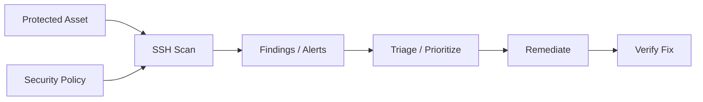

# SSH — A 2-Day Crash Course

Secure Shell gives you an encrypted remote shell, key-based authentication, and tunneling — the tool you use every day but rarely configure well.

---

## Part 0 — Why SSH

When you type `ssh user@host`, three things happen that most people never think about: your client and the server negotiate a cipher, they exchange keys to prove identity, and then every byte of your session travels over an encrypted channel. No cleartext. No passwords on the wire (when you do it right). No one in the middle can read what you're doing.

That's the core promise — and it holds up well when configured correctly. The problem is the defaults are set for compatibility, not security. A freshly provisioned server often allows password authentication, root login, and any cipher suite the client requests. You will change that by the end of Day 2.

SSH is also more than a shell. It moves files (SCP, rsync-over-SSH), forwards ports, proxies connections through jump hosts, and can multiplex many sessions over a single TCP connection. Understanding the full surface area means you stop reaching for a VPN when a tunnel would do.

---

## Vocabulary

**Key Pair** — A matched set: a private key you keep secret (`~/.ssh/id_ed25519`) and a public key you distribute freely (`~/.ssh/id_ed25519.pub`). The server encrypts a challenge with your public key; only your private key can decrypt it. That proof of possession is your login.

**ssh-keygen** — The tool that generates key pairs, signs certificates, and changes passphrases. You will use `-t ed25519` for new keys — Ed25519 is fast, small, and has no known weaknesses. RSA 4096 is acceptable for legacy compatibility; RSA 1024 and DSA are not.

**ssh-agent** — A background process that holds your decrypted private key in memory. You unlock the key once with your passphrase; the agent handles all subsequent signing operations so you don't type the passphrase on every connection.

**ssh_config** — Your client-side configuration file at `~/.ssh/config`. It lets you define aliases, per-host settings, jump chains, and multiplexing rules. Most people discover it too late.

**sshd_config** — The server-side daemon configuration, typically at `/etc/ssh/sshd_config`. This is where you enforce policy: which auth methods are permitted, which users can connect, what ciphers are allowed.

**Port Forwarding** — SSH can tunnel arbitrary TCP traffic. Local forwarding sends traffic from your machine through the SSH connection to a remote destination. Remote forwarding does the reverse. Dynamic forwarding turns SSH into a SOCKS proxy.

**Jump Host (ProxyJump)** — A bastion or gateway server you route through to reach hosts that aren't directly accessible. Modern SSH handles this natively with `ProxyJump` — no manual chaining required.

**authorized_keys** — A file on the server (`~/.ssh/authorized_keys`) listing public keys allowed to log in as that user. One key per line. Permissions on this file matter: `600` or the daemon will refuse it.

**known_hosts** — Your client's record of server public keys (`~/.ssh/known_hosts`). When you connect to a server for the first time, you're asked to verify its fingerprint. After that, SSH checks the stored fingerprint on every connection. A mismatch is a hard warning — don't dismiss it.

**SSHFP** — A DNS record type that publishes the SSH server's fingerprint. When your resolver uses DNSSEC, SSH can verify the server fingerprint automatically without the first-connection prompt.

---




## DAY 1 — Keys, Config, and Basic Usage

### Generate a Key Pair

```bash
ssh-keygen -t ed25519 -C "your-email@example.com"
```

When prompted for a file, accept the default (`~/.ssh/id_ed25519`) unless you need multiple keys for different contexts. When prompted for a passphrase, use one — a strong one. The private key file is useless to anyone without it.

Your public key is `~/.ssh/id_ed25519.pub`. It looks like:

```
ssh-ed25519 AAAA... your-email@example.com
```

That's what you give to servers, GitHub, and CI systems. The private key never leaves your machine.

### Copy Your Public Key to a Server

```bash
ssh-copy-id -i ~/.ssh/id_ed25519.pub user@192.168.1.10
```

This appends your public key to `~/.ssh/authorized_keys` on the remote host and sets correct permissions. If `ssh-copy-id` isn't available, do it manually:

```bash
cat ~/.ssh/id_ed25519.pub | ssh user@host \
  "mkdir -p ~/.ssh && chmod 700 ~/.ssh && \
   cat >> ~/.ssh/authorized_keys && chmod 600 ~/.ssh/authorized_keys"
```

### The SSH Config File

Create `~/.ssh/config` if it doesn't exist. Set its permissions to `600`. This is one of the highest-leverage SSH habits you can build.

```
Host dev
    HostName 192.168.1.10
    User ubuntu
    IdentityFile ~/.ssh/id_ed25519
    Port 22

Host prod-bastion
    HostName bastion.example.com
    User ec2-user
    IdentityFile ~/.ssh/id_ed25519_prod
    Port 2222

Host prod-app
    HostName 10.0.1.50
    User ubuntu
    IdentityFile ~/.ssh/id_ed25519_prod
    ProxyJump prod-bastion
```

Now `ssh dev` resolves to the full connection. `ssh prod-app` automatically jumps through the bastion. No aliases, no scripts, no remembering IP addresses.

The `*` wildcard is useful for shared settings:

```
Host *
    ServerAliveInterval 60
    ServerAliveCountMax 3
    AddKeysToAgent yes
    IdentitiesOnly yes
```

`IdentitiesOnly yes` is important — it tells SSH to only offer the key you specified, not every key in your agent. This matters when a server rate-limits failed auth attempts.

### Basic Usage

```bash
# Connect
ssh user@host

# Run a command without a shell
ssh user@host "df -h"

# Copy a file to the server
scp localfile.txt user@host:/remote/path/

# Copy a directory
scp -r ./dist/ user@host:/var/www/app/

# Sync with rsync (preferred over scp for large transfers)
rsync -avz --delete ./dist/ user@host:/var/www/app/

# Rsync with SSH config alias
rsync -avz ./dist/ dev:/var/www/app/
```

rsync is generally better than scp for repeated transfers because it only sends changed blocks. For large directories, the difference is significant.

### Start and Use ssh-agent

```bash
# Start the agent (usually already running in your desktop session)
eval "$(ssh-agent -s)"

# Add your key
ssh-add ~/.ssh/id_ed25519

# List loaded keys
ssh-add -l

# Remove all keys from agent
ssh-add -D
```

On macOS, `AddKeysToAgent yes` in your `~/.ssh/config` handles this automatically. On Linux, your desktop environment typically starts an agent, or you add the `eval` line to your shell profile.

⚠️ Never run ssh-agent as root or in a shared environment where other users have access to the agent socket.

---

## DAY 2 — Hardening, Tunnels, Jump Hosts, and Certificates

### Hardening sshd

Edit `/etc/ssh/sshd_config`. Make changes carefully — a misconfiguration can lock you out. Keep a second session open while you test.

```
# Disable password authentication — key-based only
PasswordAuthentication no
ChallengeResponseAuthentication no
KbdInteractiveAuthentication no

# Disable root login
PermitRootLogin no

# Only allow specific users
AllowUsers ubuntu deployer

# Restrict to modern ciphers
Ciphers chacha20-poly1305@openssh.com,aes256-gcm@openssh.com,aes128-gcm@openssh.com
MACs hmac-sha2-512-etm@openssh.com,hmac-sha2-256-etm@openssh.com
KexAlgorithms curve25519-sha256,curve25519-sha256@libssh.org

# Reduce idle timeout
ClientAliveInterval 300
ClientAliveCountMax 2

# Disable unused features
X11Forwarding no
AllowAgentForwarding no   # unless you need it
AllowTcpForwarding no     # unless you need port forwarding
PrintMotd no
```

After editing:

```bash
# Validate config before reloading
sshd -t

# Reload without dropping existing sessions
systemctl reload sshd
```

Test your connection in a new terminal before closing your existing session.

### Port Forwarding

**Local forwarding** — access a remote service on your local machine.

```bash
# Access a database on the remote server as if it were local
ssh -L 5432:localhost:5432 user@host

# Access a service on a third host, routed through the SSH server
ssh -L 8080:internal-service:80 user@host
```

Now `psql -h localhost -p 5432` connects to the remote database through the encrypted tunnel.

**Remote forwarding** — expose a local service on the remote server.

```bash
# Make your local dev server accessible on the remote host's port 8080
ssh -R 8080:localhost:3000 user@host
```

Anyone on the remote host who connects to `localhost:8080` reaches your local port 3000. Useful for demos, webhooks, and testing.

**Dynamic forwarding** — SOCKS proxy.

```bash
# Turn the SSH connection into a SOCKS5 proxy on local port 1080
ssh -D 1080 user@host
```

Configure your browser to use `localhost:1080` as a SOCKS5 proxy. All browser traffic routes through the remote host.

To make forwarding persistent and background it:

```bash
ssh -fN -L 5432:localhost:5432 user@host
```

`-f` backgrounds the process, `-N` tells SSH not to execute a remote command.

### Jump Hosts

The modern approach is `ProxyJump`, which replaces the old `ProxyCommand` with netcat.

```bash
# One-off jump
ssh -J user@bastion user@internal-host

# Multi-hop
ssh -J user@bastion,user@hop2 user@final-host
```

In `~/.ssh/config`:

```
Host internal-*
    ProxyJump bastion
    User ubuntu
    IdentityFile ~/.ssh/id_ed25519
```

Now `ssh internal-app` routes through `bastion` automatically. The key insight: you do not need `AllowAgentForwarding` on the bastion to use `ProxyJump`. The jump is handled entirely by your local client — the bastion just passes bytes.

⚠️ Do not enable agent forwarding on bastions. If the bastion is compromised, agent forwarding lets the attacker impersonate you to other hosts. `ProxyJump` avoids this problem entirely.

### Connection Multiplexing

Multiplexing reuses an existing TCP connection for new SSH sessions. The first connection does the handshake; subsequent connections to the same host reuse it and open near-instantly.

In `~/.ssh/config`:

```
Host *
    ControlMaster auto
    ControlPath ~/.ssh/sockets/%r@%h:%p
    ControlPersist 10m
```

Create the socket directory:

```bash
mkdir -p ~/.ssh/sockets
chmod 700 ~/.ssh/sockets
```

After the first `ssh dev`, every subsequent `ssh dev`, `scp dev:...`, or `rsync dev:...` reuses the existing connection. Deploys that open multiple connections become noticeably faster.

`ControlPersist 10m` keeps the master connection alive for 10 minutes after the last session closes. Adjust to your workflow.

### SSH Certificates

Certificates scale key management beyond what `authorized_keys` handles well. Instead of distributing each user's public key to every server, you issue signed certificates. Servers trust the CA; any certificate signed by the CA is accepted.

```bash
# Create a CA key (do this once, store it securely)
ssh-keygen -t ed25519 -f ~/.ssh/ca_key -C "infrastructure-ca"

# Sign a user's public key — valid for 8 hours, for specific principals
ssh-keygen -s ~/.ssh/ca_key \
    -I "alice@example.com" \
    -n ubuntu,ec2-user \
    -V +8h \
    ~/.ssh/id_ed25519.pub

# This produces id_ed25519-cert.pub
```

On each server, add to `/etc/ssh/sshd_config`:

```
TrustedUserCAKeys /etc/ssh/ca_key.pub
```

Copy `ca_key.pub` (the public CA key only) to the server. Now any user with a certificate signed by your CA can log in — no per-user `authorized_keys` management needed.

For host certificates (clients verify servers automatically):

```bash
# Sign the host's public key
ssh-keygen -s ~/.ssh/ca_key \
    -I "bastion.example.com" \
    -h \
    -V +52w \
    /etc/ssh/ssh_host_ed25519_key.pub

# On each client, add to known_hosts
@cert-authority *.example.com ssh-ed25519 AAAA...
```

Now clients skip the first-connection fingerprint prompt for hosts in your domain. The CA signature is the verification.

### fail2ban

fail2ban watches SSH logs and bans IPs that exceed a threshold of failed authentication attempts.

```bash
apt install fail2ban
```

Create `/etc/fail2ban/jail.local`:

```ini
[sshd]
enabled  = true
port     = ssh
filter   = sshd
logpath  = /var/log/auth.log
maxretry = 5
bantime  = 3600
findtime = 600
```

```bash
systemctl enable fail2ban
systemctl start fail2ban

# Check ban status
fail2ban-client status sshd
```

fail2ban reduces log noise and slows brute force, but it is not a replacement for disabling password auth. The real protection is `PasswordAuthentication no`.

### Two-Factor Authentication

Add TOTP-based 2FA with the Google Authenticator PAM module:

```bash
apt install libpam-google-authenticator

# Run as the target user — generates a QR code for your authenticator app
google-authenticator
```

Edit `/etc/pam.d/sshd`:

```
# Add at the top
auth required pam_google_authenticator.so
```

Edit `/etc/ssh/sshd_config`:

```
ChallengeResponseAuthentication yes
AuthenticationMethods publickey,keyboard-interactive
```

This requires both a valid key and a TOTP code. The sequence: your key is verified, then you're prompted for the six-digit code.

⚠️ Test this in a second session before logging out. Have a backup code stored somewhere. Getting locked out because 2FA is misconfigured is a real incident.

---

## Worked Example — Secure Bastion Host Setup

You have three machines: your laptop, a public bastion at `bastion.example.com`, and an internal app server at `10.0.1.50` reachable only from the bastion's network.

**Goal:** SSH to the app server through the bastion with key auth, no passwords, ProxyJump, and hardened sshd on both servers.

**Step 1 — Generate dedicated keys.**

```bash
ssh-keygen -t ed25519 -f ~/.ssh/id_bastion -C "bastion access"
ssh-keygen -t ed25519 -f ~/.ssh/id_app -C "app server access"
```

**Step 2 — Distribute keys.**

```bash
ssh-copy-id -i ~/.ssh/id_bastion.pub ec2-user@bastion.example.com
# From bastion, or via a temporary password session:
ssh-copy-id -i ~/.ssh/id_app.pub ubuntu@10.0.1.50
```

**Step 3 — Configure `~/.ssh/config` on your laptop.**

```
Host bastion
    HostName bastion.example.com
    User ec2-user
    IdentityFile ~/.ssh/id_bastion
    IdentitiesOnly yes

Host app
    HostName 10.0.1.50
    User ubuntu
    IdentityFile ~/.ssh/id_app
    IdentitiesOnly yes
    ProxyJump bastion
```

**Step 4 — Harden both servers.**

On both `/etc/ssh/sshd_config`:

```
PasswordAuthentication no
PermitRootLogin no
AllowAgentForwarding no
X11Forwarding no
ClientAliveInterval 300
ClientAliveCountMax 2
```

On the bastion specifically — its only job is proxying:

```
AllowTcpForwarding no
```

**Step 5 — Test.**

```bash
ssh bastion    # connects to the bastion
ssh app        # routes through bastion transparently
```

**Step 6 — Verify multiplexing.**

```bash
# After the first ssh app, open a second terminal immediately
ssh app        # should connect in under a second
```

That's a fully functional bastion setup. No passwords, no agent forwarding, one key per hop, transparent ProxyJump.

---

## Pitfalls

**Dismissing the host key warning.** `WARNING: REMOTE HOST IDENTIFICATION HAS CHANGED` is a real alert. Don't blindly run `ssh-keygen -R hostname` unless you know the server was reprovisioned. Investigate first.

**Using RSA 1024 or DSA keys.** Both are broken. If you have old keys, replace them. `ssh-keygen -t ed25519` takes ten seconds.

**Forgetting `IdentitiesOnly yes`.** Without it, SSH tries all keys in your agent. On servers that lock accounts after N failed attempts, offering five keys when only one is valid causes lockouts.

**Leaving password auth enabled "just in case".** Disable it on day one. Your key is your backup — store it securely.

**Agent forwarding on shared or untrusted servers.** If the server is compromised and agent forwarding is on, the attacker can use your agent socket to connect to other hosts. Use `ProxyJump` instead.

**Overly permissive `authorized_keys` options.** You can prefix a key in `authorized_keys` with `command="..."` to restrict it to one command, `no-pty` to prevent interactive shells, and `from="..."` to restrict source IPs. CI keys and deployment keys should use these.

**Automation using `StrictHostKeyChecking no`.** This disables the protection that `known_hosts` provides. Use a pinned `known_hosts` file instead, or add `StrictHostKeyChecking yes` with a pre-populated file.

**Running `sshd` on port 22 and calling that security.** Changing the port reduces automated scan noise, which is real and measurable, but it is not a security control. A targeted attacker scans all ports. Combine it with `PasswordAuthentication no` and fail2ban.

---

## Quick Reference

```bash
# Generate key
ssh-keygen -t ed25519 -C "comment"

# Copy public key to server
ssh-copy-id -i ~/.ssh/id_ed25519.pub user@host

# Connect
ssh user@host
ssh -p 2222 user@host          # custom port
ssh -v user@host               # verbose (debugging)
ssh -vvv user@host             # very verbose

# Run remote command
ssh user@host "uptime"

# Copy files
scp file.txt user@host:/tmp/
rsync -avz ./dir/ user@host:/remote/dir/

# Local port forward
ssh -L 8080:localhost:80 user@host

# Remote port forward
ssh -R 9090:localhost:3000 user@host

# Dynamic (SOCKS) proxy
ssh -D 1080 user@host

# Background tunnel
ssh -fN -L 5432:localhost:5432 user@host

# Jump through bastion
ssh -J user@bastion user@internal

# Agent key management
ssh-add -l
ssh-add ~/.ssh/id_ed25519

# Validate sshd config (run on the server)
sshd -t

# Reload sshd
systemctl reload sshd

# Generate CA and sign a user key
ssh-keygen -t ed25519 -f ./ca_key
ssh-keygen -s ./ca_key -I "user@host" -V +8h ./id_ed25519.pub

# View certificate details
ssh-keygen -L -f ./id_ed25519-cert.pub

# Scan supported algorithms on a host
nmap --script ssh2-enum-algos -p 22 host
```

Permissions that matter:

| Path | Mode |
|---|---|
| `~/.ssh/` | `700` |
| `~/.ssh/config` | `600` |
| `~/.ssh/id_*` | `600` |
| `~/.ssh/id_*.pub` | `644` |
| `~/.ssh/authorized_keys` | `600` |
| `~/.ssh/known_hosts` | `600` |
| `~/.ssh/sockets/` | `700` |

---


## Top 10 Interview Questions

<details>
<summary><strong>Q: What is SSH and what problem does it solve?</strong></summary>

SSH addresses a specific need in modern engineering workflows. Understanding the core problem it solves — and the alternatives it replaced — is the foundation for every subsequent interview question. Frame your answer around the pain point first, then the solution.

</details>

<details>
<summary><strong>Q: How does SSH compare to its main alternatives?</strong></summary>

Every tool exists in an ecosystem of alternatives. Be prepared to articulate the specific tradeoffs: when SSH is the right choice, when an alternative is better, and what factors drive the decision (scale, team expertise, existing infrastructure, compliance requirements).

</details>

<details>
<summary><strong>Q: What are the most common production pitfalls with SSH?</strong></summary>

Production experience is what separates senior from junior engineers. Common pitfalls include: misconfiguration that works in dev but fails at scale, security oversights, inadequate monitoring, and operational procedures that are untested until an incident occurs. Cite specific examples from your experience.

</details>

<details>
<summary><strong>Q: How do you monitor and observe SSH in production?</strong></summary>

Key metrics to track, alerting thresholds to set, dashboards to build, and log patterns to watch. Production monitoring should cover: health/liveness, performance (latency, throughput), capacity (resource utilisation), and business impact (error rates affecting users). Explain which metrics are leading indicators versus lagging.

</details>

<details>
<summary><strong>Q: How do you scale SSH as load increases?</strong></summary>

Scaling strategies depend on the bottleneck: horizontal scaling (add more instances), vertical scaling (bigger instances), caching (reduce load), sharding (distribute data), and async processing (decouple components). Explain which approach applies to SSH and at what scale each strategy becomes necessary.

</details>

<details>
<summary><strong>Q: How do you handle security and access control with SSH?</strong></summary>

Security is non-negotiable in production. Cover: authentication and authorization mechanisms, secrets management (never in code), encryption (at rest and in transit), network security (firewalls, private networks), audit logging, and compliance requirements relevant to your industry.

</details>

<details>
<summary><strong>Q: How do you implement disaster recovery for SSH?</strong></summary>

DR planning requires defining RTO (recovery time objective) and RPO (recovery point objective), implementing backup strategies, testing restore procedures, and documenting runbooks. Explain your backup strategy, how you test restores, and what your recovery procedure looks like.

</details>

<details>
<summary><strong>Q: How do you automate SSH deployment and configuration management?</strong></summary>

Infrastructure as code, CI/CD pipelines, configuration management, and GitOps workflows. Explain how you version, test, deploy, and roll back changes. Cover: what is automated, what requires manual approval, and how you handle configuration drift.

</details>

<details>
<summary><strong>Q: How do you troubleshoot issues with SSH in production?</strong></summary>

A systematic debugging approach: check health endpoints, review recent changes (deploys, config changes), examine logs and metrics, reproduce the issue, identify root cause, fix, verify, and write a postmortem. Explain your actual debugging workflow with concrete examples.

</details>

<details>
<summary><strong>Q: What are the best practices for SSH that you have learned from experience?</strong></summary>

Best practices that go beyond documentation: lessons learned from production incidents, configuration patterns that prevent common issues, testing strategies that catch bugs before production, and operational procedures that reduce toil. Share specific examples where following (or not following) a best practice had measurable impact.

</details>

---


## Terminal Demo

```terminal-demo
# ssh@access ~ %

$ ssh -V
OpenSSH_9.6p1 Ubuntu-3ubuntu13

$ ssh-keygen -t ed25519 -C "sre@production" -f ~/.ssh/prod_ed25519
Generating public/private ed25519 key pair.
Your identification has been saved in /home/sre/.ssh/prod_ed25519
Your public key has been saved in /home/sre/.ssh/prod_ed25519.pub

$ cat ~/.ssh/config | head -10
Host prod-*
  User sre
  IdentityFile ~/.ssh/prod_ed25519
  ForwardAgent no
  StrictHostKeyChecking yes
  ServerAliveInterval 60

Host prod-bastion
  HostName bastion.example.com
  Port 2222

$ ssh -J prod-bastion prod-web-01
Last login: Mon Jun 2 08:00:00 2026 from 10.0.0.5
sre@prod-web-01:~$

$ ssh-audit prod-bastion:2222 | tail -5
(key) ssh-ed25519 -- [info] available since OpenSSH 6.5
(enc) chacha20-poly1305@openssh.com -- [info] available since OpenSSH 6.5
(mac) hmac-sha2-256-etm@openssh.com -- [info] available since OpenSSH 6.2
Overall rating: A+
```

---

## Quick Quiz

Test your understanding with these rapid-fire questions (answers hidden):

<details>
<summary>1. What is the ONE core problem that SSH solves?</summary>
Re-read Part 0 — the mental model section. If you can explain the "why" in one sentence, you understand the foundation.
</details>

<details>
<summary>2. Name the 3 most important terms from the vocabulary section.</summary>
Review Part 1. These are the building blocks every conversation about SSH uses.
</details>

<details>
<summary>3. What is the first thing you would set up on Day 1?</summary>
Check the Day 1 section — the very first hands-on step that gets you a working result.
</details>

<details>
<summary>4. What is the most common production pitfall with SSH?</summary>
Review the Common Pitfalls section. The first item listed is typically the most frequently encountered.
</details>

<details>
<summary>5. How does SSH compare to its closest alternative?</summary>
Check the Comparison Matrix below — focus on the key differentiating row.
</details>


## Comparison Matrix

| Dimension | SSH | Teleport | Boundary |
|-----------|-----|----------|----------|
| **Primary use case** | Core strength of SSH | Core strength of Teleport | Core strength of Boundary |
| **Learning curve** | Moderate | Varies | Varies |
| **Community/ecosystem** | Active | Active | Growing |
| **Operational complexity** | Medium | Varies | Varies |
| **Best for** | See Part 0 | Different tradeoffs | Different tradeoffs |

> **How to read this matrix:** no tool wins on every dimension. Pick based on your specific constraints — team expertise, existing infrastructure, scale requirements, and compliance needs. The right choice is the one that fits your context, not the one with the most checkmarks.

## Next Steps

- [`Linux.md`](../linux/Linux.md) — file permissions, users, and the system environment SSH runs in
- [`Bash.md`](../linux/Bash.md) — scripting the workflows you now have secure remote access to run
- `Vault.md` — managing SSH CA keys and secrets at scale with HashiCorp Vault
- [`Git.md`](../vcs/Git.md) — SSH keys for GitHub and GitLab, SSH signing for commits

---

## Recommended learning resources

**YouTube channels & playlists:**
- [NetworkChuck — SSH Tutorial](https://www.youtube.com/@NetworkChuck) — beginner-friendly walkthrough of key generation, config files, tunnelling, and ProxyJump
- [John Hammond — SSH Security](https://www.youtube.com/@_JohnHammond) — hands-on demonstrations of SSH hardening, key management, and common attack vectors
- [The Cyber Mentor — SSH for Penetration Testing](https://www.youtube.com/@TCMSecurityAcademy) — offensive perspective on SSH that teaches you what to defend against
- [Computerphile — Public Key Cryptography](https://www.youtube.com/@Computerphile) — the cryptographic foundations that make SSH key authentication work
- [LiveOverflow — SSH Internals](https://www.youtube.com/@LiveOverflow) — deep technical exploration of the SSH protocol, key exchange, and authentication mechanisms

**Official docs & blogs:**
- [OpenSSH Manual Pages](https://www.openssh.com/manual.html) — the definitive reference for `ssh`, `sshd_config`, `ssh-keygen`, and `ssh-agent`
- [SSH.com — SSH Academy](https://www.ssh.com/academy/ssh) — structured guides on key management, tunnelling, certificate authorities, and enterprise SSH
- [Mozilla InfoSec — OpenSSH Guidelines](https://infosec.mozilla.org/guidelines/openssh) — production-hardened configuration recommendations from Mozilla's security team

---

## The Mantra

> Generate strong keys. Disable passwords. Never forward your agent. Use ProxyJump over multi-hop chains. Sign certificates instead of distributing keys. Know what's in your `sshd_config`.

SSH is trust infrastructure. It deserves the same attention you give your application code.

---

`Reads: 1/4. Tier reached: PEAK. Lessons added: 0.`
